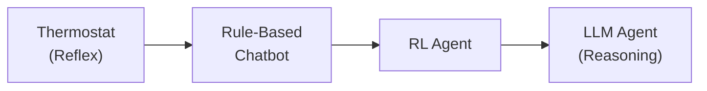
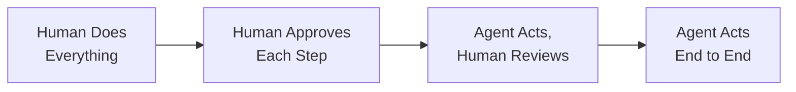
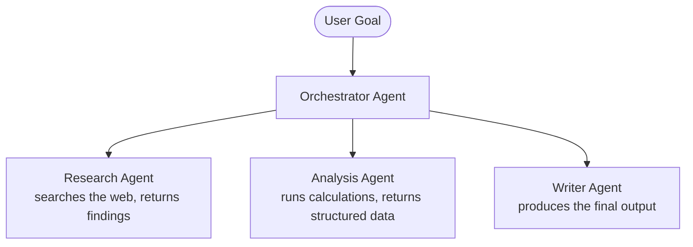
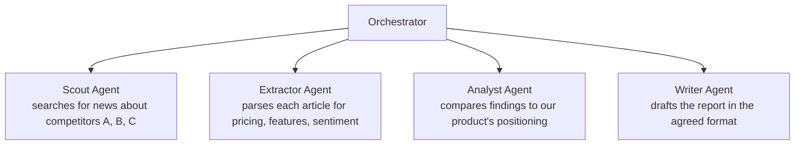

*[Agentic AI Academy](../../README.md) · Section 2 — Agent Fundamentals · Lesson 2.1*

---

# What Are AI Agents
**Last Updated:** 2026-04-10

> *"LLM" answers a question. An "agent" takes a action — and that single word carries thirty years of evolving meaning worth understanding before you ship anything.*

---

## Learning Outcomes

By the end of this page, you will be able to:

- Trace how the definition of "agent" has shifted from academic AI to modern LLM systems
- Articulate a working definition of an AI agent that holds up in a design review
- Distinguish between an agent, an agentic system, and a multi-agent system — without handwaving
- Define the core vocabulary: tools, memory, planning, orchestration, and autonomy
- Recognize the spectrum from "a chatbot with one LLM call" to "a fully autonomous multi-agent pipeline"
- Make an informed first assessment of whether a problem needs an agent at all

---

## 1. Why This Matters (In Our Systems)

Here is a conversation happening in engineering teams right now:

*"Should we build this as an agent?"*

*"Sure, yeah — let's make it agentic."*

Nobody in that conversation means the same thing. One person means "a loop that calls the LLM multiple times." Another means "something with tools." A third is imagining a sci-fi autonomous system that manages itself. They'll all agree, start building, and have a very confusing design review three weeks later.

"Agent" is one of the most overloaded words in the AI industry right now. It has a thirty-year academic history, a wave of redefinition in the late 2010s with reinforcement learning, and a completely new colloquial meaning since ChatGPT plugins launched in 2023. If you don't know which definition is in the room, you can't have a useful conversation — and you definitely can't design a system.

This page gives you the map.

---

## 2. Intuition & Mental Models

Let's start with the oldest, simplest intuition — one that still holds:

**An agent is something that perceives its environment and takes actions to achieve a goal.**

That's it. That sentence comes from Russell and Norvig's *Artificial Intelligence: A Modern Approach* (1995) and it has aged remarkably well. A thermostat perceives temperature and acts by turning the furnace on or off. By this definition, it is — technically — an agent. Not a smart one, but an agent.

The interesting evolution is what we've come to mean by *perceive*, *action*, and *goal* as the systems get more capable.

Here's a mental model that helps: think of a spectrum from **reflex** to **reasoning**.



A thermostat reacts instantly to one signal with one fixed action. A rule-based chatbot matches patterns to canned replies. A reinforcement learning agent learns which actions lead to rewards over thousands of trials. A modern LLM-based agent perceives complex natural language input, reasons about a goal, selects from a set of tools, acts, observes the result, and loops — often across many steps.

Same word. Very different beasts. Knowing where on the spectrum you are is the first and most important design decision.

---

## 3. Core Concepts & Terminology

**Agent**
An entity that perceives inputs, reasons about a goal, and takes actions — possibly over multiple steps — to achieve it. In the modern LLM context: an LLM given a goal, access to tools, and the ability to decide what to do next. The key distinguishing feature from a plain LLM call is *autonomy over sequencing*: the agent decides what happens next, not your code.

**Agentic**
An adjective describing systems or behaviors that exhibit agent-like properties — specifically: multi-step reasoning, tool use, and some degree of autonomous decision-making. A single LLM call is not agentic. An LLM that decides to call a search tool, reads the result, decides to call a calculator, then writes a final answer — that is agentic behavior.

**Agentic System**
A broader term for any system architected around agentic behavior. This includes: a single agent in a loop, an agent with tools, a chain of agents working in sequence, or a full multi-agent network. Think of it as the umbrella term — "we're building an agentic system" means you've accepted that the LLM will have some control over execution flow, not just text generation.

**Tool (Function Calling)**
A capability exposed to the agent that lets it interact with the world beyond text. Examples: web search, code execution, database query, API call, file read/write. The agent decides *when* to call a tool and *what* to pass to it. The result comes back as context for the next reasoning step. Tools are what separate a chatbot from an agent.

**Memory**
How an agent retains information across steps or sessions. There are four types worth knowing:

| Memory Type | What It Is | Example |
|---|---|---|
| In-context | Text in the current prompt window | Conversation history |
| External / Episodic | Retrieved from a DB at runtime | RAG over past sessions |
| Semantic | Embedded knowledge in a vector store | Stored facts about a user |
| Procedural | Baked into weights (via fine-tuning) | Model "knows" your API |

Most simple agents only use in-context memory. Sophisticated ones combine all four.

**Planning**
The agent's ability to decompose a goal into sub-steps before executing them. A planning agent might receive "research and draft a competitor analysis" and first outline: 1) search for competitors, 2) extract key features, 3) compare to ours, 4) write the draft. Planning dramatically improves reliability on complex tasks — but also amplifies failure modes if the plan is wrong.

**Orchestration**
The layer that coordinates agent behavior — routing tasks, managing state, handling tool results, and deciding when to stop. In simple systems, the LLM itself orchestrates. In complex systems, there's explicit orchestration code (or an orchestrator agent) managing the flow.

**Autonomy Level**
The degree to which a human is in the loop. This is a spectrum, not a binary:



Most production systems today sit in the second or third position. Full autonomy is rare and risky outside narrow, well-defined tasks.

**Multi-Agent System**
A system where multiple agents — each with their own role, tools, and possibly its own LLM — collaborate to complete a task. One agent might research, another critique, another write, another review. This mirrors how human teams work, and solves the problem of a single agent's context window or expertise ceiling.

---

## 4. How It Works (What Actually Matters)

A modern LLM agent runs a loop. The core pattern, sometimes called ReAct (Reason + Act), looks like this:

```
1. Receive goal
2. Reason: "What do I know? What do I need? What should I do next?"
3. Act: call a tool, generate output, or ask for clarification
4. Observe: read the tool's result
5. Reason again with the new information
6. Repeat until goal is achieved or a stopping condition is met
```

In code, this is often called an **agent loop** or **run loop**:

```python
def run_agent(goal: str, tools: list, max_steps: int = 10):
    messages = [{"role": "user", "content": goal}]

    for step in range(max_steps):
        response = llm.chat(messages=messages, tools=tools)

        if response.stop_reason == "end_turn":
            return response.content  # agent decided it's done

        if response.stop_reason == "tool_use":
            tool_result = execute_tool(response.tool_call)
            messages.append(response)               # agent's reasoning
            messages.append(tool_result)            # world's response
            # loop continues — agent reasons again with new info

    return "Max steps reached"  # safety exit
```

`max_steps` is not optional. Without it, a misconfigured agent loops forever. This is the first production safety lesson.

> **Counterintuitive:** The agent doesn't "remember" its previous steps the way a human does. Each reasoning step re-reads the entire message history — its "memory" is just the growing transcript in the context window. When that window fills up, the agent effectively starts forgetting. Long-running agents need explicit memory management.

**Multi-agent systems** extend this by having one agent (the orchestrator) delegate subtasks to specialist agents:



Each specialist can have its own system prompt, tools, and even a different model. The orchestrator manages the workflow. This separation of concerns makes the system more reliable and easier to debug — each agent has a narrow, well-defined job.

---

## 5. Worked Examples & Realistic Scenarios

**Scenario: A single agent that answers questions about your internal docs**

This is the simplest real-world agent. The goal is: "answer user questions using our support documentation."

The agent has two tools: `search_docs(query)` and `done(answer)`. The loop:

1. User asks: "How do I reset my API key?"
2. Agent reasons: "I should search the docs for API key reset"
3. Agent calls: `search_docs("reset API key")`
4. Tool returns: three relevant document chunks
5. Agent reasons: "I have enough to answer"
6. Agent calls: `done("To reset your API key, go to Settings > API > Regenerate...")`

One loop, two tool calls. This is the minimum viable agent — and for many use cases, it's exactly enough.

**Scenario: A multi-agent system for competitive analysis**

Task: "Produce a weekly competitive analysis report."



Why split it? Because a single agent trying to do all four tasks in one context window will lose track of details, conflate steps, and produce worse output. Each agent's context stays focused. The orchestrator coordinates, not the LLM trying to juggle everything.

---

## 6. Practical Usage & Decision Guidance

The most important question is not "how do I build an agent?" It's "do I actually need one?"

| Situation | Recommendation |
|---|---|
| Single, well-defined input → output | Plain LLM call. No agent needed. |
| Task requires fetching external data | LLM + one tool call. Still not a full agent. |
| Task requires *deciding* which tool to use | Single agent with tools. |
| Task is too complex for one context window | Multi-step agent or multi-agent. |
| Task requires parallelism or specialist expertise | Multi-agent system. |
| Task requires human approval at key steps | Agent with human-in-the-loop checkpoints. |

**The honest rule:** start with the simplest thing. A plain LLM call is cheaper, faster, and more predictable than an agent. Add agency only when the task genuinely requires autonomous sequencing — not because it sounds more impressive.

---

## 7. Common Pitfalls & Misconceptions

**"An agent is just a chatbot with a system prompt."**
A chatbot responds to a turn. An agent decides what the next turn is. The distinction is who controls execution flow — your code, or the model. If the model is choosing what to do next, you have an agent.

**"More agents = better results."**
Adding agents adds coordination complexity, latency, and failure surface. A well-prompted single agent often outperforms a poorly coordinated multi-agent system. Add agents for separation of concerns or scale, not as a default.

**"Agents are autonomous so I don't need to handle failures."**
Agents fail in novel ways: tool errors, reasoning loops, context window overflow, goal drift. You need retry logic, max-step guards, output validation, and logging. Treat agents like distributed systems — assume partial failure is normal.

**"The agent will figure out the goal."**
Vague goals produce vague agent behavior. "Research this topic" is not a goal; "find the three most recent pricing changes by our top three competitors and return them as JSON" is. Agents are not mind readers — they are plausible-continuation machines given what you told them.

---

## 8. Trade-offs, Scale, and Edge Cases

**Latency:** Every reasoning step is an LLM call. A five-step agent is five round trips to the API. At scale, this compounds. Design agents to minimize steps, not maximize capability.

**Cost:** Each step costs tokens — the entire message history is re-sent on every call. A ten-step agent on a long task can spend 10x what you'd expect. Instrument token usage from day one.

**Reliability:** Single LLM calls are already non-deterministic. Agents compound this — an early reasoning error propagates through every subsequent step. Shorter agent loops with validation checkpoints are more reliable than long autonomous runs.

**The "galaxy-brained" failure mode:** An agent can reason its way into a confident but completely wrong sequence of steps. Each individual reasoning step sounds plausible; the combined effect is nonsense. The longer the chain, the higher the risk. This is why human-in-the-loop checkpoints matter for high-stakes tasks.

**Alternatives to agents:**
- Chained LLM calls with fixed logic (your code controls flow, not the model) — more predictable, easier to test
- Workflow engines (Temporal, Airflow) with LLM steps — better for long-running, stateful tasks
- Fine-tuned models for narrow tasks — often faster and cheaper than an agent loop

---

## 9. Self-Check Questions

1. A teammate says "let's just make it agentic" for a feature that takes a user's question and returns a formatted answer from one API. Do you agree? What do you say?
2. What is the difference between an agent's in-context memory and its external memory — and when does the distinction start to matter operationally?
3. You're designing a multi-agent system and the orchestrator agent keeps getting confused about what the sub-agents have done. What's the most likely architectural cause?
4. A stakeholder wants to know why your agent-powered feature sometimes takes 45 seconds to respond. Walk them through the explanation in plain terms.
5. An agent is given the goal "improve our documentation." What's wrong with this goal, and how would you rewrite it?

---

## 10. What to Learn Next

- **[[Agentic Patterns & Tool Use]]** — The concrete design patterns (ReAct, Plan-and-Execute, Reflection) that make agents reliable rather than aspirational.
- **[[Multi-Agent System Design]]** — How to architect orchestrator/specialist patterns, handle inter-agent communication, and avoid coordination failures.
- **[[LLM Evals & Observability]]** — Agents fail in subtle ways that don't surface in happy-path testing; this page covers how to instrument and catch them.
- **[[Human-in-the-Loop Design]]** — When to pause an agent for human approval, how to design those checkpoints, and why autonomy is a dial rather than a switch.

---

## References

### Core References
- *Artificial Intelligence: A Modern Approach* — Russell & Norvig (1995, 4th ed. 2020) — The canonical academic definition of agents; Chapter 2 covers the agent taxonomy that still underpins modern thinking
- [Anthropic's Guide to Building Agents](https://docs.anthropic.com/en/docs/build-with-claude/agents) — Practical, current, and opinionated in the right ways
- *"ReAct: Synergizing Reasoning and Acting in Language Models"* — Yao et al., 2022 — The paper that formalized the Reason+Act loop now used in most LLM agent frameworks

### Supplementary Reading
- *"Agents"* — Lilian Weng, Lil'Log (2023) — The most thorough survey of agent architectures written for engineers; key insight: memory, planning, and tool use are the three axes on which all agent designs vary
- *"The Landscape of Emerging AI Agent Frameworks"* — Harrison Chase (LangChain blog) — Useful for understanding how the framework space reflects different design philosophies

---

## Summary

"Agent" has meant many things over thirty years — from a thermostat to a reinforcement learning policy to a modern LLM in a reasoning loop. The definition that holds up today is: an entity that perceives input, reasons about a goal, and autonomously decides what action to take next, possibly over many steps. Agentic systems give the LLM control over execution flow; multi-agent systems divide that work across specialists coordinated by an orchestrator. The vocabulary — tools, memory, planning, autonomy level — is what lets teams have precise conversations instead of agreeing on a word while imagining completely different systems. Start simple, add agency only when the task genuinely requires it, and instrument everything from the first day.

## Self-Assessment Checklist

- [ ] I can explain this clearly to a teammate without looking at the page
- [ ] I know when to use it and when to reach for something else
- [ ] I can spot related mistakes in a code review
- [ ] I know what I'd read next to go deeper

## Suggested Next Pages

- [[Agentic Patterns & Tool Use]] — *The mental models here become engineering decisions there — ReAct, reflection, and plan-and-execute are the patterns that actually ship*
- [[Multi-Agent System Design]] — *Once you know what an agent is, this page answers how to make several of them work together without chaos*
- [[LLM Evals & Observability]] — *Agents fail in ways that silent-pass testing; you need different instrumentation than you're used to*

---

← [1.3 — Embeddings & Vector Search](<../1. Fundamentals/1.3 Embeddings & Vector Search.md>) &nbsp;|&nbsp; [2.2 — Agent Design Patterns & Tool Use →](<2.2 Agent Design Patterns and Tool Use.md>)
