*[Agentic AI Academy](../../README.md) · Section 2 — Agent Fundamentals · Lesson 2.2*

---

# Agentic Design Patterns & Tool Use

**Last Updated:** 2026-04-10

> *A hammer is not a plan. Knowing your agent has tools is the starting point — knowing which pattern to wire them into is the craft.*

---

## Learning Outcomes

By the end of this page, you will be able to:

- Explain what a design pattern means in the context of agentic systems
- Identify and apply the six foundational agentic patterns by name and structure
- Recognise three niche but powerful patterns and know when they earn their complexity
- Conceptualise the pattern stack you'd need to build a deep research agent
- Describe how an agent selects a tool — and design tools that get selected correctly
- Anticipate where each pattern fails under production load and what to do about it

---

## 1. Why This Matters (In Our Systems)

Picture two teams. Both are building a "research assistant" agent. Both use the same model, the same tools, the same infrastructure.

Team A ships in six weeks. The agent works end-to-end on real tasks. Users trust it. Team B is still firefighting three months later — the agent loops, contradicts itself, misses steps, and occasionally does something creative that nobody asked for.

The difference is almost never the model. It's almost always the pattern. Team A chose an architecture that matched their task's shape. Team B wired tools together and hoped the LLM would figure out the rest.

Design patterns for agentic systems are what they've always been in software: proven solutions to recurring structural problems. The problems are just newer — and the failure modes are more colourful.

---

## 2. Intuition & Mental Models

Before patterns, one mental model to carry through everything:

**An agent is a decision-maker in a loop. A pattern is the shape of that loop.**

The simplest loop: think → act → observe → repeat. Every agentic pattern is a variation on this loop — some add planning before the loop, some add reflection after each step, some split the loop across multiple agents, some let the loop branch like a tree.

Think of patterns the way you think of kitchen recipes for a new cook. You don't invent a beurre blanc from first principles on a Tuesday night. You use a technique. Later, when you understand *why* the technique works, you adapt it. Same here.

A second mental model: **patterns exist on two axes.**

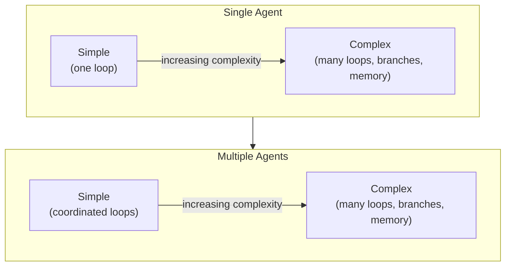

Most teams start top-left (simple, single agent) and move right and down as their task demands it. Fighting the urge to jump to the bottom-right is one of the most valuable engineering instincts you can develop.

---

## 3. Core Concepts & Terminology

**Design Pattern**
A reusable, named solution to a recurring structural problem. In agentic systems: a defined way of organising the reasoning loop, tool calls, memory, and agent interactions to solve a class of problems reliably.

**Tool**
Any capability exposed to the agent that lets it affect or observe the world: web search, code execution, database query, file read/write, API call, sending a message. Tools are the agent's hands.

**Tool Schema**
The description of a tool — its name, what it does, its parameters, and their types. This is what the agent reads to decide which tool to use. A well-written schema is the difference between a tool that gets called correctly and one that gets ignored.

**Orchestrator**
The agent (or component) that manages the high-level plan: what needs doing, in what order, and by whom. In single-agent systems, the LLM itself orchestrates. In multi-agent systems, a dedicated orchestrator agent coordinates specialists.

**Worker / Subagent**
A specialist agent that receives a scoped task from the orchestrator, executes it (potentially with its own tools and loop), and returns a result.

**Reflection**
A reasoning step where the agent critiques its own previous output before continuing. "Did I actually answer the question? Is my reasoning sound? What did I miss?" This is not magic — it's a second LLM call with the first output as input.

**Grounding**
Anchoring the agent's output to verifiable sources rather than letting it generate from training data alone. Tool calls that fetch real data are the primary grounding mechanism.

---

## 4. How It Works (What Actually Matters)

### How an agent chooses a tool

This trips most people up: the agent does not run an if-else tree to pick a tool. It reads all the tool schemas as part of its context and generates the most plausible next action — which might be a tool call, or might be reasoning text.

The selection mechanism is probabilistic. Which means:

- **Tool names matter.** `search_web` is clearer than `tool_1`.
- **Tool descriptions matter more.** A one-sentence description is not enough for ambiguous tools.
- **Overlap confuses the model.** Two tools that sound similar will be called interchangeably. Disambiguate explicitly in the schema.

```
Tool Schema (what the agent sees):
┌─────────────────────────────────────────────────────────┐
│ Name: search_recent_news                                │
│ Description: Search for news articles published in the │
│   last 30 days. Use for current events and recent      │
│   developments. Do NOT use for historical facts or     │
│   product documentation.                               │
│ Parameters:                                             │
│   query (string): the search terms                     │
│   max_results (int, default 5): number of results      │
└─────────────────────────────────────────────────────────┘
```

The negative instruction ("Do NOT use for...") is not redundant. It is the part that prevents the model from reaching for this tool when it should use something else.

> **Counterintuitive:** The agent doesn't validate whether a tool is the *right* choice before calling it. It calls what seems most plausible given the schema and context. Bad schemas produce bad tool selection — silently, and at scale.

---

## 5. The Foundational Patterns

### Pattern 1 — ReAct (Reason + Act)

The original and still most common pattern. The agent alternates between a reasoning step and an action step, using the result of each action to inform the next reasoning step.

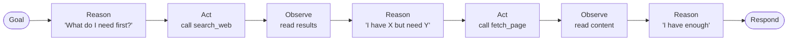

**Best for:** Tasks with a clear goal that require fetching or processing information in an unpredictable sequence.

**Breaks when:** The chain gets long, the agent loses track of the original goal, or early errors compound unchecked.

---

### Pattern 2 — Plan-and-Execute

The agent produces a full plan *before* taking any action, then executes each step. Planning and execution are separate phases.

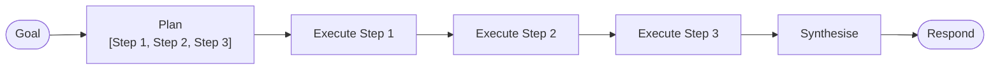

**Best for:** Complex, multi-step tasks where knowing the shape of the whole task upfront reduces errors mid-stream. Good when steps can be parallelised.

**Breaks when:** The real world doesn't match the plan (step 2 fails because step 1 returned unexpected data). Pure plan-and-execute is brittle without replanning.

**Enhancement:** Add a replanning step when a step fails — the agent revises the remaining plan rather than blindly continuing or crashing.

---

### Pattern 3 — Reflection

After completing a draft or output, the agent is asked to critique its own work before finalising.

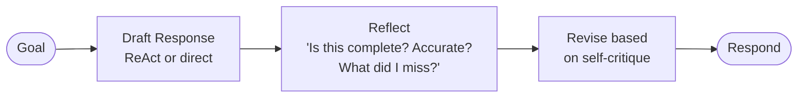

**Best for:** Tasks where output quality matters more than speed — written content, code generation, structured analysis.

**Breaks when:** The model is overconfident — reflection produces "this looks great!" without genuine critique. Adding explicit criteria ("check for: completeness, accuracy, format compliance") forces meaningful reflection.

> **Counterintuitive:** Reflection is just a second LLM call where the input is the first output. There is no deeper self-awareness. Its value is entirely in what you ask it to check.

---

### Pattern 4 — Orchestrator-Worker

One orchestrator agent breaks a task into subtasks and delegates each to a specialist worker agent. Workers report back; the orchestrator synthesises.

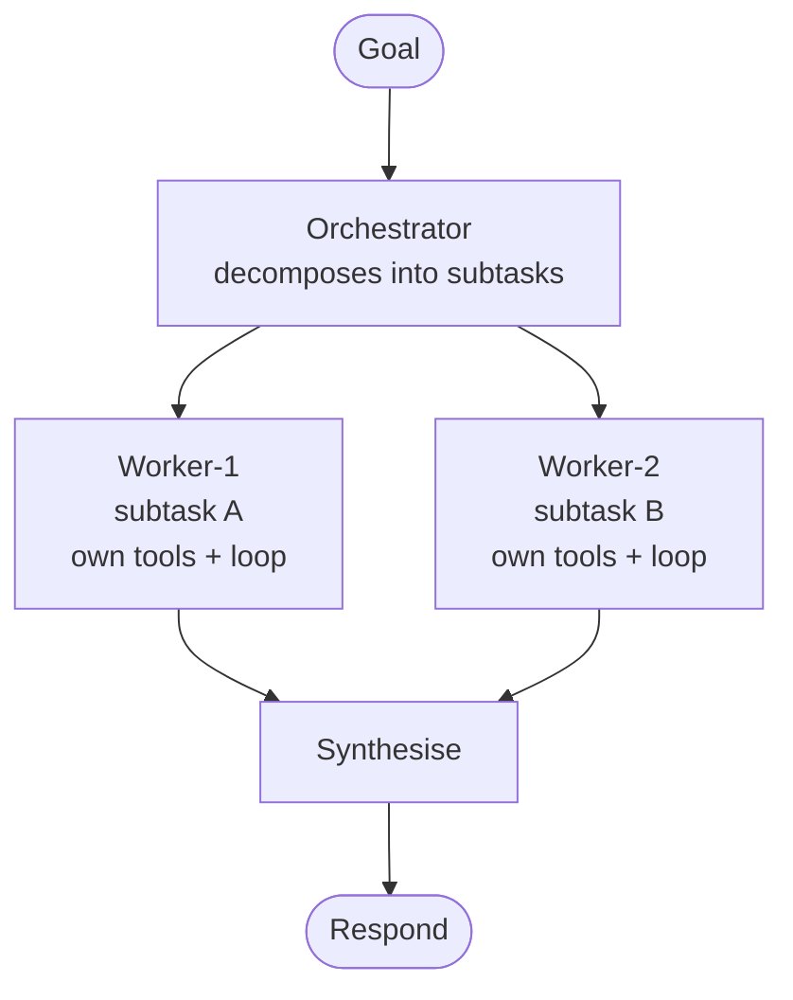

**Best for:** Tasks that are too large for one context window, or that benefit from specialist expertise (a "writer" agent vs. a "researcher" agent).

**Breaks when:** The orchestrator's subtask decomposition is poor, or workers return results in incompatible formats. Define worker output schemas explicitly.

---

### Pattern 5 — Parallelisation

Multiple agent instances (or tool calls) run simultaneously rather than sequentially. Results are collected and merged.

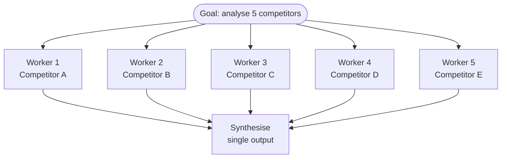

**Best for:** Tasks that are naturally decomposable into independent units of work. Dramatically reduces wall-clock time.

**Breaks when:** The subtasks are not truly independent (one result depends on another), or when synthesis of parallel results is itself complex and error-prone.

---

### Pattern 6 — Human-in-the-Loop

The agent pauses at defined checkpoints and requests human approval or input before continuing.

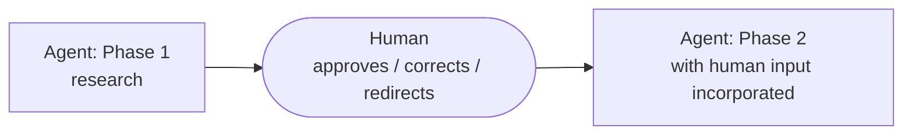

**Best for:** High-stakes tasks where errors are costly, early in a system's life when trust hasn't been established, or when the task requires human judgment that cannot be automated.

**Breaks when:** Checkpoints are too frequent (defeats the purpose) or too infrequent (the agent goes too far wrong before correction). Calibrate checkpoint placement to where irreversible decisions happen.

---

## 6. Niche Patterns Worth Knowing

### Pattern 7 — Self-Consistency

The agent generates multiple independent answers to the same question (at higher temperature), then takes the majority vote or synthesises the consensus.

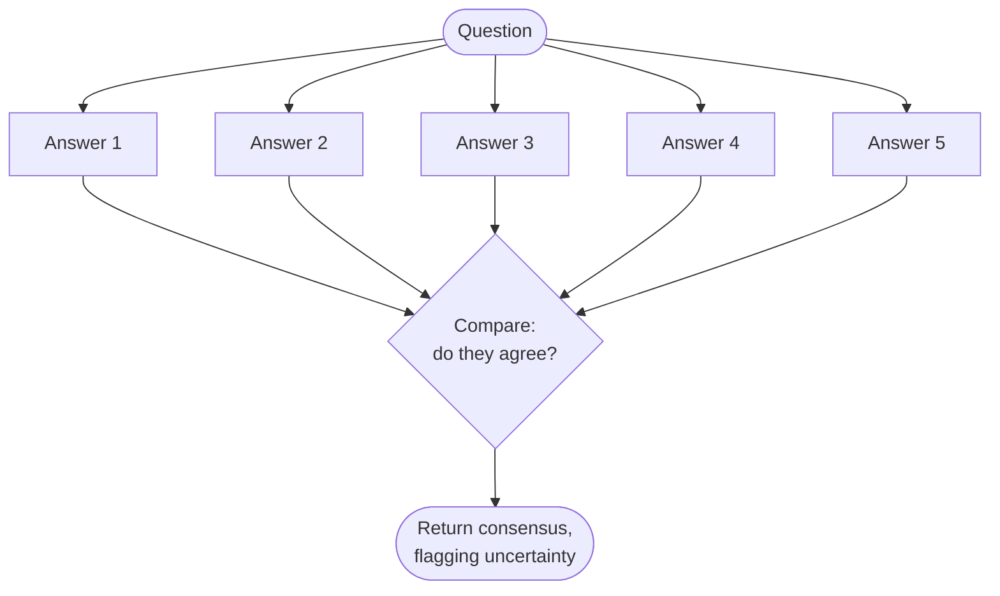

**Best for:** Factual or analytical questions where single-pass answers are unreliable. Catches cases where the model reasons differently depending on which path it takes first.

**Cost:** N times the inference cost. Use selectively.

---

### Pattern 8 — Critic-Actor (Debate)

Two agents with opposing roles: one generates, one critiques. They iterate until the critic is satisfied or a round limit is reached.

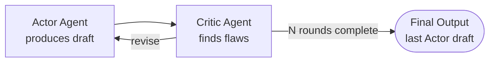

**Best for:** Generating robust plans, stress-testing decisions, producing well-reasoned arguments. The adversarial dynamic surfaces weaknesses a single agent would miss.

**Breaks when:** The critic is not given specific evaluation criteria — it becomes a rubber stamp. The critic's system prompt is as important as the actor's.

---

### Pattern 9 — LATS (Language Agent Tree Search)

The agent explores multiple possible action paths simultaneously (like a decision tree), evaluates each path, and backtracks when a path underperforms. Think of it as Monte Carlo Tree Search applied to agent reasoning.

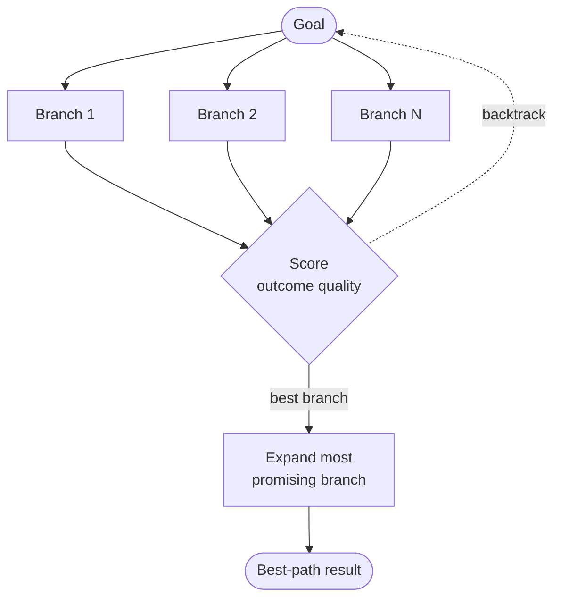

**Best for:** Tasks with a complex, branching solution space — algorithmic problem-solving, multi-step planning with many valid paths, situations where the best first move is not obvious.

**Cost:** Expensive in tokens and latency. Reserve for tasks where quality dramatically outweighs cost.

---

## 7. Putting It Together — The Deep Research Agent

Now let's apply these patterns to a concrete and ambitious target: a deep research agent that, given a topic, autonomously produces a well-sourced, multi-angle research report.

Here is how you'd stack the patterns:

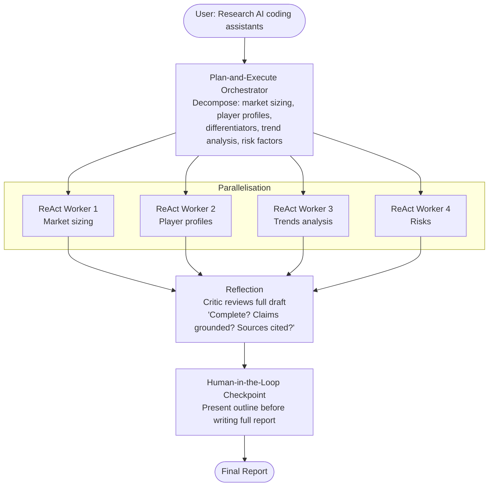

Each worker runs its own ReAct loop with tools like `search_web`, `fetch_page`, `extract_quotes`, and `check_date` (to flag stale sources). The orchestrator handles synthesis. The critic runs before the human checkpoint — so the human sees a polished draft, not a raw assembly.

This is not one pattern. It is a stack of patterns, each chosen for the specific problem it solves at that stage.

---

## 8. Practical Usage & Decision Guidance

| Task Shape | Pattern to Reach For |
|---|---|
| Known sequence of steps, order matters | Plan-and-Execute |
| Unknown sequence, discover as you go | ReAct |
| Quality matters more than speed | ReAct + Reflection |
| Large task, parallelisable subtasks | Orchestrator-Worker + Parallelisation |
| High-stakes decision, irreversible actions | Human-in-the-Loop at key checkpoints |
| Factual reliability is critical | Self-Consistency |
| Need adversarial quality check | Critic-Actor |
| Complex solution space, many valid paths | LATS (expensive — use carefully) |

**The honest rule:** start with ReAct. Add Plan-and-Execute when the task is complex enough to benefit from upfront structure. Add Reflection when output quality is unsatisfactory. Add Orchestrator-Worker when context limits bite. Add everything else only when you have evidence the simpler version is failing.

---

## 9. Common Pitfalls & Misconceptions

**"I'll give the agent all the tools and let it figure it out."**
Ten tools with overlapping descriptions produce confused, inconsistent tool selection. Every tool you add competes for the model's attention. Give agents the minimum set of tools for the task. Remove what isn't needed.

**"Reflection will fix my bad outputs."**
Reflection improves outputs that are directionally correct. It cannot recover from a fundamentally wrong reasoning path. If your agent consistently misunderstands the goal, reflection just produces a well-critiqued version of the wrong answer. Fix the system prompt first.

**"Parallelisation is always faster."**
Parallel workers mean parallel costs. Five workers running simultaneously costs five times the tokens. If the synthesis step is slow and complex, you may spend the latency savings on aggregation. Profile before assuming parallelisation is a net win.

**"Plan-and-Execute means the agent follows the plan."**
The agent re-reads the plan at each step — but if execution diverges significantly from what the plan assumed, the agent may drift or produce incoherent results. Plans need replanning hooks, not just execution hooks.

---

## 10. Trade-offs, Scale, and Edge Cases

**Error propagation:** In sequential patterns (ReAct, Plan-and-Execute), an early error silently poisons every downstream step. Add validation gates after high-stakes tool calls — check whether the result is plausible before continuing.

**Context window exhaustion:** Long agent loops accumulate history. At some point, the model's working memory fills up and early context is lost or degraded. Design long-running agents with explicit memory summarisation steps, or use external memory to offload history.

**Cost at scale:** A Critic-Actor pattern with 5 rounds doubles the inference cost before you add any tools. LATS can multiply it by 10x or more. Design with a per-task token budget, not just a per-call one.

**Idempotency:** Agents that write to databases, send emails, or call external APIs need idempotent tool implementations. An agent that retries a failed step should not send the same email twice. This is basic distributed systems hygiene — apply it to every tool that has side effects.

**The right alternative:** Not every workflow needs an agent. A deterministic pipeline (step 1 always calls tool A, step 2 always calls tool B) is cheaper, faster, and easier to test. Reserve agentic patterns for tasks where the *sequence* genuinely cannot be known in advance.

---

## 11. Self-Check Questions

1. A teammate proposes using Critic-Actor for a real-time customer-facing feature that must respond in under three seconds. What do you say?
2. You're building a ReAct agent that has both a `search_web` tool and a `search_internal_docs` tool. Users complain it always uses web search even for questions about your own product. What's the most likely cause and how do you fix it at the schema level?
3. Walk through the pattern stack you'd design for an agent that autonomously monitors a competitor's pricing page daily and alerts the team when prices change. Which patterns appear and why?
4. Your Plan-and-Execute agent produces a 7-step plan, but step 3 always fails because it depends on data that step 2 didn't actually return. What architectural addition fixes this without abandoning the pattern?
5. What's the difference between Reflection and Critic-Actor — and what signal tells you which one to use?

---

## 12. What to Learn Next

- **[[Multi-Agent System Design]]** — Patterns are the vocabulary; this page is the grammar — how to architect stable, observable multi-agent systems that don't fall apart under real load.
- **[[LLM Evals & Observability]]** — Patterns introduce complexity that silent-passes basic testing; you need structured evals and tracing to know whether your pattern stack is actually working.
- **[[Human-in-the-Loop Design]]** — Designing good approval checkpoints is a craft — where to pause, what to show, and how to avoid alert fatigue while maintaining meaningful oversight.
- **[[Memory Architecture for Agents]]** — Long-running agents need external memory strategies; in-context history doesn't scale, and knowing how to manage it is what separates demos from production systems.

---

## References

### Core References
- *"ReAct: Synergizing Reasoning and Acting in Language Models"* — Yao et al., 2022 — The foundational paper for the ReAct pattern; canonical reading before using any agent framework
- *"Reflexion: Language Agents with Verbal Reinforcement Learning"* — Shinn et al., 2023 — The paper that formalised reflection as a first-class pattern
- *"Tree of Thoughts"* — Yao et al., 2023 — The intellectual precursor to LATS; key insight: letting agents explore branching paths rather than committing to one dramatically improves performance on hard reasoning tasks
- [Anthropic's Guide to Agentic Systems](https://docs.anthropic.com/en/docs/build-with-claude/agents) — Practical pattern guidance with real implementation considerations

### Supplementary Reading
- *"LLM Powered Autonomous Agents"* — Lilian Weng, Lil'Log (2023) — The best single survey of agent architectures; key insight: all agent architectures are variations on the combination of memory, planning, and tool use — understanding those three axes lets you evaluate any new pattern claim
- *"The Landscape of Emerging AI Agent Frameworks"* — Harrison Chase — Useful for understanding how framework design choices reflect underlying pattern decisions

---

## Summary

Agentic design patterns are the proven structural shapes that turn a capable model into a reliable system. The foundational six — ReAct, Plan-and-Execute, Reflection, Orchestrator-Worker, Parallelisation, and Human-in-the-Loop — cover the majority of real-world agentic tasks, and niche patterns like Critic-Actor and LATS earn their complexity only when simpler patterns demonstrably fall short. Tool selection is probabilistic and schema-driven: the agent picks the most plausible tool given the descriptions you write, which makes tool design as important as agent design. A deep research agent is not one pattern — it is a deliberate stack of patterns, each chosen for the specific structural challenge at that layer of the workflow. The discipline is knowing which pattern fits the problem, not which pattern sounds most impressive.

## Self-Assessment Checklist

- [ ] I can explain this clearly to a teammate without looking at the page
- [ ] I know when to use it and when to reach for something else
- [ ] I can spot related mistakes in a code review
- [ ] I know what I'd read next to go deeper

## Suggested Next Pages

- [[Multi-Agent System Design]] — *Patterns are the building blocks; this page is how you architect them into systems that hold together under real conditions*
- [[LLM Evals & Observability]] — *Pattern stacks fail in subtle ways — this page gives you the instrumentation to know when and why*
- [[Memory Architecture for Agents]] — *The hidden constraint in every pattern on this page: context windows are finite, and long-running agents need explicit memory strategies to stay coherent*

---

← [2.1 — What Are AI Agents](<2.1 What are Agents.md>) &nbsp;|&nbsp; [2.3 — Memory Architecture →](<2.3 Memory Architecture for Agents.md>)
