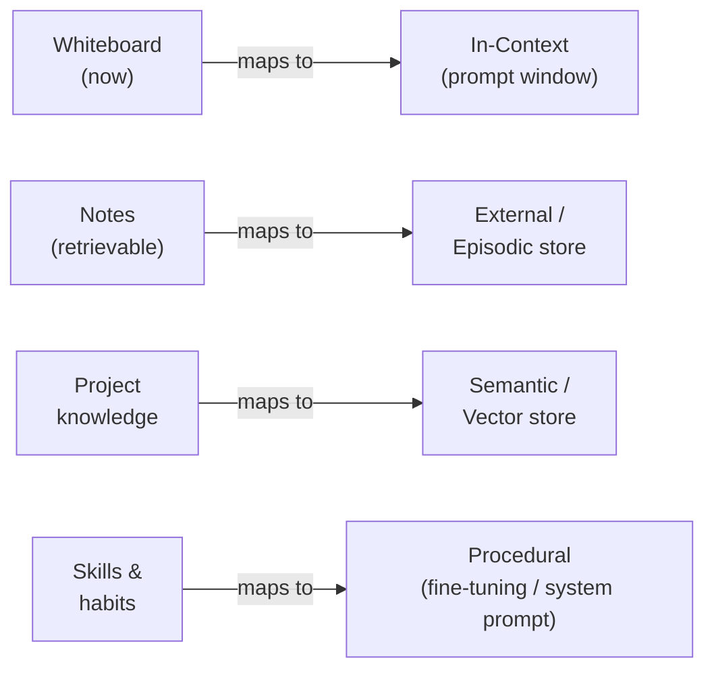
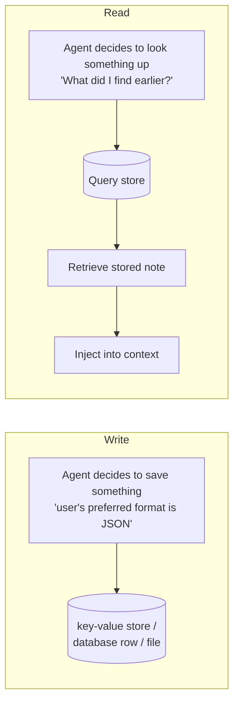
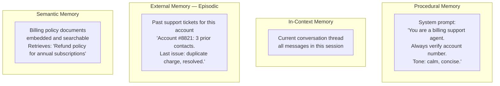

*[Agentic AI Academy](../../README.md) · Section 2 — Agent Fundamentals · Lesson 2.3*

---

# Memory Architecture for Agents
**Last Updated:** 2026-04-10

> *An agent without memory is a brilliant colleague with amnesia — impressive in the moment, exhausting to work with over time.*

---

## Learning Outcomes

By the end of this page, you will be able to:

- Explain why agents need memory and what breaks without it
- Distinguish between the four types of agent memory and the job each one does
- Match a memory type to a task requirement without second-guessing yourself
- Design a memory strategy for a real agentic system end to end
- Identify memory-related failure modes in production and reason about their causes
- Know when in-context memory is enough — and when it will silently betray you

---

## 1. Why This Matters (In Our Systems)

Meet your new AI assistant. You tell it your name, your preferences, and what you're working on. It helps you beautifully. You close the tab.

You come back the next day. "Hi! How can I help you?" It has no idea who you are.

This isn't a hypothetical frustration — it is the default behaviour of every LLM-powered system that hasn't deliberately addressed memory. And it compounds fast. A customer support agent that can't remember what it told a user two messages ago. A research agent that re-fetches the same web page on step 3 that it already read on step 1. A coding assistant that forgets the architectural decision you explained at the start of the session.

Each of these is a memory problem with a specific shape — and a specific fix. Understanding memory architecture is what separates agents that feel useful from agents that feel like they're meeting you for the first time, every time.

---

## 2. Intuition & Mental Models

Let's start with the most natural model available: your own brain.

When you walk into a meeting, you're carrying several kinds of memory simultaneously:

- **What's on the whiteboard right now** — the immediate, visible context of this meeting
- **Notes from last week's meeting** — stored somewhere you can retrieve if needed
- **General knowledge about the project** — built up over months, available without looking anything up
- **How to run a retrospective** — a skill so practised it's almost automatic

These aren't the same kind of memory. They live in different places, serve different purposes, and degrade in different ways. Your whiteboard gets erased when the meeting ends. Your notes survive if you filed them. Your project knowledge fades slowly over months. Your facilitation skills don't fade at all.

Agent memory works the same way — just made explicit in software.



Once you see the map, the four types of agent memory stop feeling like an arbitrary list and start feeling like obvious necessities.

---

## 3. Core Concepts & Terminology

**In-Context Memory**
Everything currently in the prompt window — the conversation history, the task instructions, intermediate reasoning steps, tool results. It is the agent's active working memory. Fast, immediate, zero retrieval cost. Also finite, expensive, and gone the moment the session ends.

**External Memory (Episodic)**
A persistent store — a database, a file, a log — that the agent can read from and write to during a run. Think of it as a notebook the agent carries. Unlike the whiteboard, it survives between sessions. The agent must explicitly decide to read from or write to it.

**Semantic Memory**
Stored facts, knowledge, and embeddings that represent *what things mean* rather than *what happened when*. Typically lives in a vector database. The agent retrieves relevant knowledge by similarity search, not exact lookup. "What do we know about this topic?" — that is semantic memory's job.

**Procedural Memory**
Behaviour baked into the agent's structure — through fine-tuning, system prompts, or hardcoded tool logic. The agent doesn't retrieve this; it simply *does* it. How to format output, how to handle refusals, what tone to take — these are procedural memories. They don't flex at runtime; they shape every run.

**Memory Read vs. Memory Write**
Every memory type has two operations: reading (retrieval) and writing (storage). In-context memory is read automatically (it's always there) and written automatically (the agent's output is appended). External and semantic memory must be explicitly queried and explicitly updated. Procedural memory is written offline (at training or configuration time) and read implicitly at runtime.

**Memory Horizon**
How far back an agent can "see." In-context memory has a hard horizon — the context window limit. External memory has a soft horizon — anything stored can be retrieved if queried correctly, but the agent must know to ask. Semantic memory has a fuzzy horizon — retrieval by similarity means older but relevant memories resurface, while irrelevant recent ones don't.

---

## 4. How It Works (What Actually Matters)

### In-Context Memory — the whiteboard

The prompt window is a flat, ordered sequence of text. Every message, every tool result, every reasoning step gets appended to it. The model reads the entire thing on every inference call.

```
[System Prompt]
[User message 1]
[Agent response 1]
[Tool call + result]
[User message 2]
[Agent response 2]  ← model generates from here, seeing everything above
```

The critical property: **every token in context costs money and contributes to latency, every time.** A 10,000-token conversation history is re-sent on every single agent step. At 100 steps, that's 1,000,000 tokens just for history replay.

> **Counterintuitive:** The model doesn't accumulate memory as it goes. It re-reads the entire transcript on every step. It has no persistent internal state between inference calls. What looks like "remembering" is just re-reading.

**Context window exhaustion** is the most common in-context memory failure. When the window fills up, most systems silently truncate the oldest messages. The agent loses early instructions, prior decisions, and context it assumed was available — and produces confused, inconsistent output without any error signal.

**The fix:** implement context summarisation. When conversation history grows beyond a threshold, run a summarisation step — compress old messages into a dense summary, keep the summary in context, discard the raw history.

```
Before (hitting limit):
[message 1][message 2]...[message 47][message 48][new message]

After summarisation:
[Summary: "We decided X, found Y, ruled out Z..."][message 46][message 47][message 48][new message]
```

---

### External Memory — the notebook

External memory is any persistent store the agent writes to during execution and reads from on demand. It is the agent's equivalent of taking notes.

The core operations:



What makes external memory powerful is persistence across sessions. What makes it hard is that the agent must decide *when* to write and *what* to query. A poorly designed agent either writes too much (everything, indiscriminately) or reads too little (never thinks to look things up).

**Episodic memory** is a specific flavour of external memory that stores *events* — what happened, when, in what sequence. "At 9am the user submitted invoice #4421. At 9:03 the agent flagged it for review. At 9:15 the user overrode the flag." This timeline is exactly what you need for auditing, debugging, and giving the agent awareness of what it has already done.

---

### Semantic Memory — the knowledge base

You already know embeddings from the previous page in this series. Semantic memory is embeddings applied to an agent's long-term knowledge store.

The agent accumulates facts, documents, and learned knowledge as vector embeddings in a vector database. At query time, it retrieves the most semantically relevant entries — not by exact match, but by meaning proximity.


This is the pattern that powers RAG (Retrieval-Augmented Generation). The agent doesn't try to hold all knowledge in context — it holds a query, retrieves what's relevant, and reasons over that.

The key design decision: what do you store, and at what granularity? Store too coarsely (whole documents) and retrieval is imprecise. Store too finely (individual sentences) and retrieved snippets lose surrounding context. Paragraphs or logical sections tend to be the right unit for most use cases.

---

### Procedural Memory — the instincts

Procedural memory shapes how the agent behaves without requiring any retrieval at all. It is the difference between an agent that *has to be told* to respond in JSON and one that simply *does*.

Three ways procedural memory is encoded:

| Method | What It Controls | Flexibility |
|---|---|---|
| System prompt | Tone, format, constraints, persona | Can be changed per-deployment |
| Fine-tuning | Deep behavioural patterns, style | Requires retraining to change |
| Tool definitions | What capabilities exist and how | Changed by updating the schema |

Procedural memory is the right place for: output format conventions, safety guardrails, domain-specific terminology, and task-specific reasoning habits. It is the wrong place for: facts that change, user-specific preferences, or anything that needs to vary by session.

> **Counterintuitive:** Fine-tuning is often described as "teaching the model new knowledge." It's more accurate to say it teaches new *habits*. Fine-tuning excels at behaviour — not at injecting reliable facts, which is semantic memory's job.

---

## 5. Worked Examples & Realistic Scenarios

**Scenario: A customer support agent that handles billing queries**

Without memory design:
- Every message starts from scratch
- The agent asks for the account number in every reply
- It cannot tell if it already explained the refund policy two messages ago
- Users give up in frustration

With memory design:



Now the agent greets the user knowing their history, retrieves the exact policy paragraph when asked, stays in-context through the conversation, and logs the outcome when the session closes. Each memory type doing the job it was designed for.

---

**Scenario: A long-running research agent (5+ minutes, many steps)**

The context window problem becomes critical here. After 30 reasoning steps and 15 tool calls, the context is enormous.

Memory strategy:

```
Step 1–10:   Full in-context (normal operation)
Step 10:     Summarise steps 1–8, keep 9–10 raw + summary in context
Step 20:     Write key findings to external memory (episodic log)
Step 25:     Agent queries external memory: "What sources have I checked so far?"
             → avoids re-fetching the same pages
Step 30:     Final synthesis pulls from external log, not from 30-step context
```

The external memory acts as an external hard drive — offloading what the whiteboard can no longer hold, available on demand.

---

## 6. Practical Usage & Decision Guidance

| Memory Need | Memory Type to Use |
|---|---|
| Current conversation / task state | In-context |
| Facts that must survive session end | External (episodic or key-value) |
| "What did I already do?" | External (episodic log) |
| "What do we know about this topic?" | Semantic (vector store) |
| Consistent behaviour across all runs | Procedural (system prompt / fine-tuning) |
| User preferences that persist | External (key-value, user profile store) |
| Long conversations without truncation risk | In-context + summarisation |
| Domain knowledge the agent must reason over | Semantic (RAG) |

**The layering rule:** start with in-context. When sessions end and continuity matters, add external memory. When domain knowledge is involved, add semantic memory. When behaviour is inconsistent, fix procedural memory. Add layers only when the simpler layer demonstrably fails.

---

## 7. Common Pitfalls & Misconceptions

**"More context = better memory."**
More context means more cost, more latency, and — past a certain length — degraded attention on content buried in the middle. Bigger context window is a relief valve, not a memory strategy. It delays the problem; it doesn't solve it.

**"I'll just store everything in external memory."**
Indiscriminate writing produces noise that overwhelms retrieval. When the agent queries its external store and gets 50 marginally relevant entries, it can't distinguish signal from noise. Be selective about what gets stored and why.

**"Semantic memory is a database."**
It's closer to a library than a database. You don't look up records by ID — you search by meaning. The quality of what you get back depends on how well you embedded the content and how well you phrased the query. It rewards deliberate design.

**"Fine-tuning will give the agent a good memory."**
Fine-tuning gives the agent good habits, not a good memory. You cannot reliably fine-tune factual recall — models trained on facts still hallucinate them. For knowledge, use semantic memory with retrieval. Fine-tune for style and behaviour.

---

## 8. Trade-offs, Scale, and Edge Cases

**In-context at scale:** Shared context windows in multi-tenant systems leak data between users if not scoped carefully. Every user's conversation must be isolated. This sounds obvious — it is consistently missed.

**External memory consistency:** If two agent instances write to the same external store simultaneously (in a parallelised agent pattern), you get write conflicts and stale reads. Apply the same concurrency disciplines you would to any shared database — optimistic locking, idempotent writes, read-your-writes consistency where required.

**Semantic memory drift:** Embedded documents become stale when source content changes. A policy document embedded six months ago doesn't reflect today's policy. Build re-embedding pipelines for content that changes, and timestamp your embeddings so you can audit recency.

**Memory privacy and compliance:** External and semantic stores accumulate personal data. A user's conversation history, preferences, and queries may be subject to GDPR right-to-erasure, data residency requirements, or audit obligations. Design deletion and export paths from day one — retrofitting them is painful.

**The forgetting problem:** Sometimes agents need to *forget* — a user updates their preferences, a previous finding is superseded, a session should not contaminate future ones. Build explicit invalidation into every memory type. In-context: scoped per session. External: include expiry or version fields. Semantic: support deletion and re-embedding.

---

## 9. Self-Check Questions

1. A long-running agent starts giving contradictory answers mid-task — it seems to forget decisions it made twenty steps ago. Which memory type has failed, and what is the most likely architectural cause?
2. A user asks your support agent a question it answered correctly last week, but this week it answers differently. The system prompt hasn't changed. Which memory type might explain the difference, and how would you investigate?
3. You're designing a personal assistant agent that must remember user preferences across sessions but handle 10,000 concurrent users. What memory type handles preferences, and what are the key design constraints at that scale?
4. Your semantic memory retrieval is returning plausible but subtly wrong results for user queries. The underlying documents are correct. What are the two most likely root causes in the memory pipeline?
5. A teammate proposes fine-tuning your agent on your company's internal policies so it "knows" them. What is the risk with this approach, and what would you recommend instead?

---

## 10. What to Learn Next

- **[[RAG Architecture]]** — Semantic memory's full implementation story: chunking strategies, retrieval pipelines, and the design decisions that make retrieval accurate rather than approximate.
- **[[LLM Evals & Observability]]** — Memory failures are often silent; this page covers how to instrument and detect them before users report them.
- **[[Multi-Agent System Design]]** — When multiple agents share memory stores, consistency and isolation become first-class architectural concerns.
- **[[Human-in-the-Loop Design]]** — Memory stores accumulate sensitive data; knowing when to surface stored context to users for review is a safety and trust issue as much as an architectural one.

---

## References

### Core References
- *"Cognitive Architectures for Language Agents"* — Sumers et al., 2023 — The paper that formalised the four-memory taxonomy used throughout this page; essential reading for anyone designing serious agentic systems
- *"MemGPT: Towards LLMs as Operating Systems"* — Packer et al., 2023 — Key insight: treating the context window as RAM and external storage as disk, with explicit memory management, allows agents to maintain coherent long-term interactions
- [Anthropic's Memory and Context Guide](https://docs.anthropic.com/en/docs/build-with-claude/agents) — Practical guidance on context management with real implementation considerations

### Supplementary Reading
- *"Lost in the Middle: How Language Models Use Long Contexts"* — Liu et al., 2023 — Key insight: retrieval accuracy degrades for content in the middle of long contexts, which directly informs when to summarise rather than accumulate
- *"LLM Powered Autonomous Agents"* — Lilian Weng, Lil'Log — The memory section of this survey is the clearest overview of the four-type taxonomy written for practising engineers

---

## Summary

Agent memory is not one thing — it is four distinct systems, each built for a different job. In-context memory is the whiteboard: fast and immediate but finite and session-scoped. External memory is the notebook: persistent and queryable but only useful if the agent knows to write and read it. Semantic memory is the knowledge base: meaning-driven retrieval that scales across vast knowledge without cluttering the context window. Procedural memory is the instinct layer: behaviour encoded at configuration or training time that shapes every run without any retrieval cost. Good memory architecture means choosing the right layer for the right job — and building explicit strategies for what happens when each one runs out of room.

## Self-Assessment Checklist

- [ ] I can explain this clearly to a teammate without looking at the page
- [ ] I know when to use it and when to reach for something else
- [ ] I can spot related mistakes in a code review
- [ ] I know what I'd read next to go deeper

## Suggested Next Pages

- [[RAG Architecture]] — *Semantic memory's full implementation story — the retrieval pipeline that makes "search by meaning" reliable rather than accidental*
- [[Agentic Design Patterns & Tool Use]] — *Memory is a resource; design patterns are how agents use it — understanding both together is where coherent agent architecture lives*
- [[LLM Evals & Observability]] — *Memory failures are quiet until they aren't — instrumentation is how you catch them before users do*

---

← [2.2 — Agent Design Patterns & Tool Use](<2.2 Agent Design Patterns and Tool Use.md>) &nbsp;|&nbsp; [2.4 — Retrieval-Augmented Generation →](<2.4-Retrieval-Augmented-Generation.md>)
