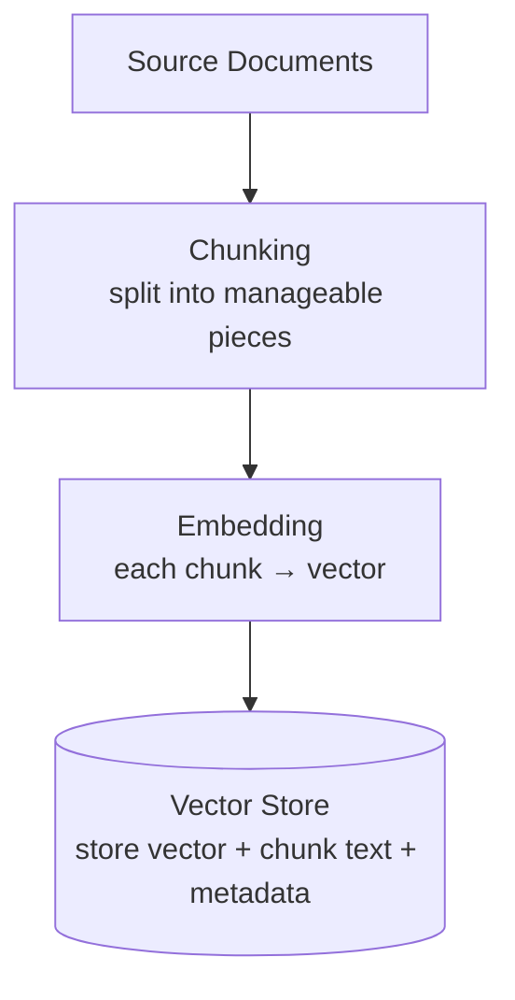
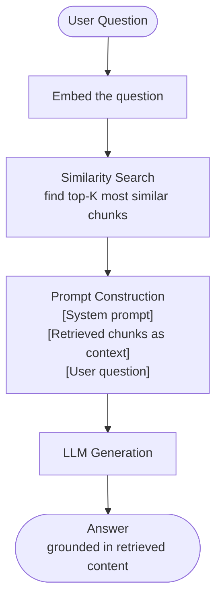
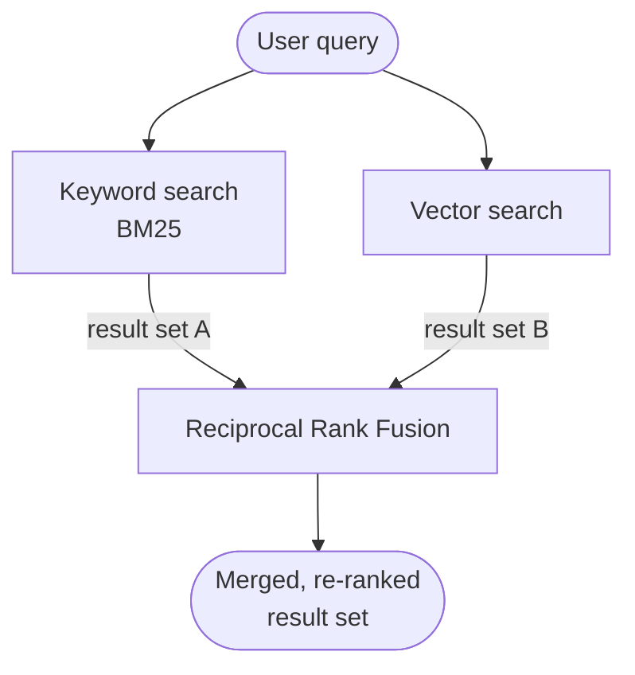
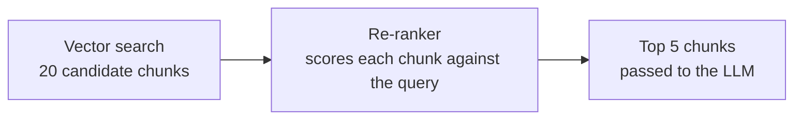
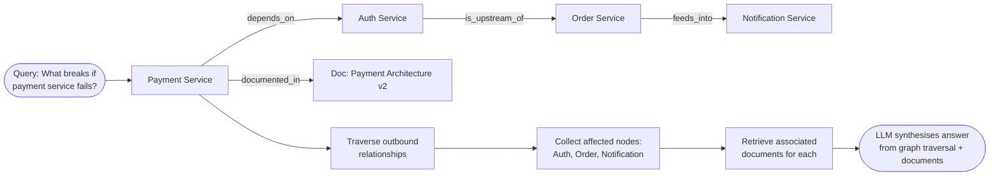
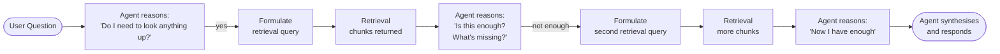
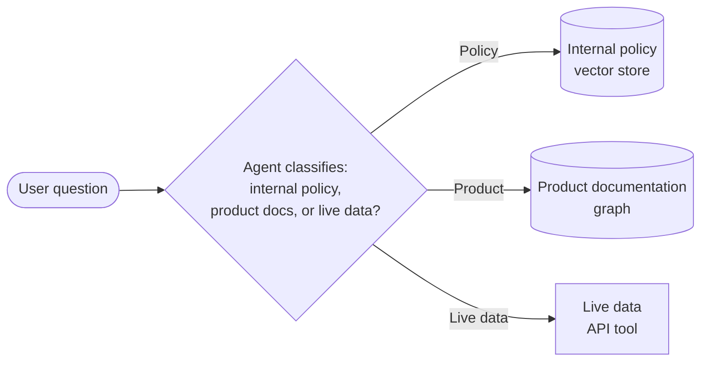
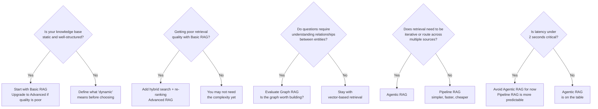

*[Agentic AI Academy](../../README.md) · Section 2 — Agent Fundamentals · Lesson 2.4*

---

# Retrieval-Augmented Generation (RAG)

**Last Updated:** 2026-04-10

> *The model knows almost everything — except your stuff. RAG is how you fix that without retraining anything.*

---

## Learning Outcomes

By the end of this page, you will be able to:

- Explain what RAG is, why it exists, and what problem it solves that fine-tuning cannot
- Describe the end-to-end pipeline of a basic RAG system — from document to answer
- Identify the weaknesses of basic RAG and the techniques that address each one
- Explain Graph RAG and articulate when it outperforms vector-based retrieval
- Describe Agentic RAG and how it differs structurally from pipeline-based RAG
- Design a RAG system appropriate to a given use case, from proof-of-concept to production scale
- Know where each variation breaks and what signals tell you which to reach for

---

## 1. Why This Matters (In Our Systems)

Here is a conversation that happens in every company that ships an LLM feature:

*"Why does the AI not know about our product?"*
*"Why did it answer with last year's pricing?"*
*"Why did it make up a policy that doesn't exist?"*

The model was trained on public data, frozen at a cutoff date, and has never seen your internal documents, your support history, your product specs, or your company wiki. If you ask it about your systems, it will answer confidently — from its training data, from inference, or from imagination. None of which is what you want.

The naive fix is fine-tuning: retrain the model on your data. But fine-tuning is expensive, slow, doesn't reliably inject factual recall (models still hallucinate fine-tuned facts), and goes stale the moment your data changes.

RAG is the better answer for most teams most of the time. It keeps the model's general intelligence intact and gives it *your* information, *at query time*, as context. The model doesn't need to memorise your docs. It just needs to read the right ones before answering.

---

## 2. Intuition & Mental Models

Imagine you've hired the world's most knowledgeable consultant. They have read more than any human ever has. But they've never seen your company's internal documents.

You have two options:

**Option A:** Lock them in a room with every document your company has ever produced and ask them to memorise it. Expensive, slow, and they'll still misremember details.

**Option B:** Before each meeting, your assistant pulls the three most relevant documents from the filing cabinet and hands them to the consultant. The consultant reads them on the spot and answers from those, plus their general knowledge.

Option B is RAG. The consultant is the LLM. The filing cabinet is your document store. The assistant who pulls the relevant pages is the retrieval system.

The key insight: **the model doesn't need to know your information in advance. It needs to be able to read it in the moment.**

Now extend the analogy:

- **Basic RAG** — the assistant pulls documents by keyword match or similarity
- **Graph RAG** — the assistant also understands how concepts in your filing cabinet *relate* to each other, so they can pull connected documents the user didn't explicitly ask about
- **Agentic RAG** — the consultant themselves decides what to look up, in what order, iteratively — they're not waiting to be handed documents, they're doing their own research

---

## 3. Core Concepts & Terminology

**RAG**
A pattern where relevant information is *retrieved* from a knowledge store at query time and *injected into the prompt* before the model generates a response. The model generates *augmented* by retrieved context, not from memory alone.

**Chunk**
A unit of text extracted from a source document for embedding and storage. A 50-page PDF becomes many chunks. Chunk size is one of the highest-leverage decisions in any RAG system — too large and retrieval is imprecise; too small and retrieved chunks lack context.

**Embedding**
A vector representation of a chunk's meaning. Similar meanings produce numerically close vectors. This is how retrieval by meaning (rather than keyword) works. (Covered in depth in [[1.3 Embeddings & Vector Search]].)

**Vector Store**
A database that stores chunks as vectors and supports similarity search — "find me the chunks closest in meaning to this query." Examples: pgvector, Pinecone, Weaviate, Qdrant.

**Retrieval**
The act of querying the vector store (or other store) with an embedded version of the user's question to find the most relevant chunks.

**Augmentation**
Injecting the retrieved chunks into the prompt as context, so the model has the relevant information when it generates its answer.

**Grounding**
The property of an answer being traceable to a source document. RAG-based answers are grounded; pure model answers may not be.

**Knowledge Graph**
A data structure that stores not just facts but *relationships between facts* — nodes (entities) connected by labelled edges (relationships). "Product X *is a component of* System Y. System Y *requires* Configuration Z." Flat vector stores store what things say; knowledge graphs store how things relate.

**Re-ranking**
A second-pass scoring step that re-orders retrieved chunks by relevance quality before they're passed to the model. Retrieval gets candidates; re-ranking gets the best ones to the top.

---

## 4. How It Works — The Three Generations of RAG

### Generation 1: Basic RAG

The classic pipeline. Two phases: indexing and querying.

**Indexing (done once, updated on change):**

**Querying (on every user request):**

This works remarkably well for simple, factual question-answering against a reasonably sized, well-structured knowledge base. It is the right starting point for most teams.

**Where basic RAG breaks:**

| Problem | Symptom | Root Cause |
|---|---|---|
| Poor chunking | Retrieved chunks miss key context | Chunk boundaries cut mid-thought |
| Vocabulary mismatch | "invoice" query misses "bill" chunks | Semantic gap between query and document language |
| Top-K is noisy | Model gets 5 chunks, 3 are irrelevant | Retrieval recall without precision filtering |
| Multi-hop questions | "What does the policy say about X given condition Y?" fails | Answer requires connecting two separate documents |
| Stale index | Model answers from old document version | No re-embedding pipeline on document update |

Each of these failures has a targeted fix — which is where Advanced RAG patterns come in.

---

### Generation 2: Advanced RAG

Advanced RAG keeps the same core pipeline but adds precision at each stage.

**Better chunking:**
- Sliding window chunks (overlap between chunks to avoid mid-thought cuts)
- Hierarchical chunking (store both paragraph-level and document-level summaries; retrieve the right granularity)
- Semantic chunking (split at meaning boundaries, not character counts)

**Better retrieval:**

*Hybrid search* combines keyword search (BM25) with vector similarity. Keyword search catches exact matches that vector search misses; vector search catches semantic matches that keyword search misses. Merge both result sets using a ranking algorithm (Reciprocal Rank Fusion is the standard).

*Query transformation* rewrites or expands the user's query before retrieval. Users don't phrase questions the same way documents phrase answers. Rewriting bridges that gap:

- HyDE (Hypothetical Document Embedding): generate a hypothetical answer to the query, embed *that*, and use it to retrieve. The hypothetical answer is phrased more like a document than a question.
- Query expansion: generate 3–5 paraphrases of the query and retrieve for all of them, then merge results.

**Re-ranking:**
After retrieval, a second model scores each chunk specifically for relevance to the query. The top-K retrieval gets you candidates; re-ranking gets you quality. Cross-encoder re-rankers consistently outperform raw vector similarity at the precision step.

> **Counterintuitive:** Retrieving more candidates and re-ranking to a smaller set almost always outperforms retrieving the exact number you need. The retrieval step optimises for recall; the re-ranking step optimises for precision. Separating them makes both better.

---

### Generation 3: Graph RAG

Have you ever noticed that some questions can't be answered from a single document — they require understanding *how things connect*?

"What are all the downstream systems affected if the payment service goes down?"

A vector store retrieves documents *about* the payment service. But the answer requires traversing *relationships*: payment service → depends on → auth service → is upstream of → order service → feeds into → notification service. That's a graph traversal, not a similarity search.

**Graph RAG** structures your knowledge as a knowledge graph — entities as nodes, relationships as labelled edges — and uses graph traversal alongside (or instead of) vector similarity for retrieval.

**Graph RAG also solves the multi-hop problem.** "What is the refund policy for enterprise customers who paid via bank transfer?" requires connecting: refund policy → enterprise tier → payment method conditions. Three separate facts, linked by relationships. A graph traversal finds the path; vector search finds individual documents that may not individually contain the full answer.

**When Graph RAG wins over vector RAG:**

| Scenario | Better Choice |
|---|---|
| Factual Q&A over flat documents | Vector RAG |
| Relationship-heavy domains (systems, org charts, supply chains) | Graph RAG |
| Multi-hop reasoning ("X given Y and Z") | Graph RAG |
| Unstructured text corpora | Vector RAG |
| Semi-structured data with clear entity types | Graph RAG |
| Speed and simplicity matter | Vector RAG |

**The cost:** building and maintaining a knowledge graph is significantly more work than chunking documents. Entity extraction, relationship labelling, and graph updates require structured effort. Only earn that complexity when the retrieval problems it solves actually appear in your use case.

---

### Generation 4: Agentic RAG

Basic and Advanced RAG have a fixed pipeline: the system decides what to retrieve, retrieves it once, and passes it to the model. The model is a passenger.

Agentic RAG flips this. The model is the driver. It decides:
- Whether to retrieve at all
- What query to use for retrieval
- Whether the retrieved information is sufficient
- Whether to retrieve again with a refined query
- When to stop and synthesise

The agent treats retrieval as a *tool* — one of many it can call, as many times as needed, with whatever query makes sense given what it has learned so far. This is the ReAct pattern (from the Agentic Design Patterns page) applied specifically to knowledge retrieval.

**Agentic RAG also enables routing.** An agent can decide *which* knowledge source to query:

A single pipeline cannot do this. An agent with multiple retrieval tools can.

**When Agentic RAG wins:**

| Scenario | Better Choice |
|---|---|
| Simple, well-scoped Q&A | Basic/Advanced RAG (pipeline) |
| Questions that require iterative refinement | Agentic RAG |
| Multiple knowledge sources that need routing | Agentic RAG |
| Complex research tasks with unknown retrieval path | Agentic RAG |
| Latency-sensitive user-facing features | Pipeline RAG (agents add steps) |
| Auditable, predictable retrieval traces | Pipeline RAG (more deterministic) |

---

## 5. Worked Examples & Realistic Scenarios

**Scenario: Internal HR policy assistant**

Users ask questions like "Can I carry over unused leave to next year?" or "What's the process for requesting parental leave?"

*Start with:* Basic RAG. Chunk the HR handbook by section. Embed each chunk. On each query, retrieve the top 3 most similar chunks and pass them to the model with: "Answer only from the provided context. If the answer is not in the context, say so."

*Problem that emerges:* Users ask "What's the leave policy for part-time employees on fixed-term contracts?" — this requires joining the part-time policy section with the fixed-term contract section.

*Upgrade to:* Advanced RAG with hybrid search + re-ranking. Expand the query to "part-time leave entitlement" and "fixed-term contract leave allowance," retrieve and re-rank, pass the best 4 chunks. Covers multi-term queries well.

*If relationships grow complex* (policy exceptions that depend on tenure, employment type, and location simultaneously): consider Graph RAG with employment conditions as entity types and exception rules as relationships.

---

**Scenario: Technical support agent for a software platform**

Users ask: "Why is my API returning a 429 error after my rate limit resets?"

*Start with:* Advanced RAG. Documentation is chunked at the section level. Hybrid search finds "rate limiting" and "429" content. Re-ranker surfaces the most relevant sections.

*Problem that emerges:* Some answers require the agent to check the user's actual account data (live) AND retrieve documentation AND cross-reference a known-issues log — three different sources, and the relevant documentation depends on what the live data shows.

*Upgrade to:* Agentic RAG with three tools:
- `search_docs(query)` — vector search over documentation
- `get_account_status(account_id)` — live API call
- `search_known_issues(query)` — vector search over issue log

The agent retrieves account data first, then uses what it learns to formulate a more precise documentation query. This is retrieval that adapts — something no fixed pipeline can do.

---

## 6. Practical Usage & Decision Guidance

**Which RAG variation should you start with?**

---

## 7. Common Pitfalls & Misconceptions

**"RAG is just search."**
RAG is retrieval + generation. The retrieval step uses search. The generation step uses an LLM to synthesise, reason over, and present retrieved information in natural language. A search engine returns links. RAG returns answers, grounded in sources.

**"Better embeddings will fix my retrieval problems."**
Embedding quality matters, but chunking strategy matters more. A perfect embedding of a badly chunked document retrieves a badly chunked document perfectly. Fix chunking before optimising embeddings.

**"I'll retrieve more chunks to be safe."**
Retrieving 20 chunks when 3 would do dilutes the signal. The model's attention is finite — more context doesn't mean better answers, and past a point it means worse ones. Retrieve enough; re-rank aggressively; pass only what the model needs.

**"Graph RAG is always better than vector RAG."**
Graph RAG is better when relationships are the answer. For straight factual retrieval over unstructured text, vector RAG is faster, cheaper, and easier to maintain. Don't build a knowledge graph because it sounds sophisticated.

**"RAG eliminates hallucination."**
RAG reduces hallucination by grounding the model in retrieved text. It does not eliminate it. A model can still ignore retrieved context, misread it, or hallucinate beyond it. Grounding helps; validation and prompt constraints help more.

---

## 8. Trade-offs, Scale, and Edge Cases

**Indexing lag:** When source documents change, the index is stale until re-embedded. For fast-changing content (live pricing, incident logs), RAG over a static index gives stale answers. Design a re-indexing pipeline with appropriate frequency — or route live-data questions to a live API tool instead.

**Retrieval latency at scale:** Vector similarity search over millions of documents requires a proper ANN index (HNSW or similar). Without it, search degrades from milliseconds to seconds. Managed vector databases handle this; self-hosted solutions need explicit index configuration.

**Chunk granularity at scale:** At millions of chunks, retrieval precision matters more. A 5% noise rate at 100 chunks is manageable. At 10 million chunks, 5% noise floods every retrieval result. Invest in chunking quality and re-ranking before scaling the index.

**Graph RAG maintenance:** Knowledge graphs require entity extraction (usually an LLM step), relationship labelling, deduplication, and update pipelines. This is meaningful engineering investment. For many teams, a hybrid approach works: vector search for text retrieval, a lightweight graph only for entity relationships where traversal is genuinely needed.

**Multi-tenancy:** If multiple customers share a RAG system, their documents must be isolated at the vector store level — using metadata filters or separate collections. Retrieval that leaks one tenant's documents into another's query results is a serious data breach, not a retrieval bug.

---

## 9. Self-Check Questions

1. A user asks your RAG-powered assistant a question and gets an answer that sounds right but is not in any source document. What are the two most likely failure modes in the RAG pipeline, and how would you investigate each?
2. You're building a RAG system for a legal firm that needs to answer questions like "What precedents apply to cases involving both IP infringement and employment disputes?" Which RAG variation would you consider, and why?
3. Your basic RAG system retrieves the right documents 80% of the time in testing, but drops to 55% on production queries. What are three differences between test and production queries that could explain the gap?
4. A stakeholder asks why you're not just fine-tuning the model on your company's documents instead of building a RAG pipeline. Walk them through your reasoning.
5. Your Agentic RAG system is accurate but takes 12 seconds to respond. A product manager says it needs to be under 3 seconds. What architectural options do you have, and what do you trade away with each?

---

## 10. What to Learn Next

- **[[Chunking Strategies for LLM Pipelines]]** — Chunking is the single highest-leverage decision in any RAG system; getting it wrong makes everything downstream worse regardless of retrieval sophistication.
- **[[Embeddings & Vector Search]]** — The retrieval engine underneath RAG; understanding how similarity search works is what lets you diagnose and fix retrieval quality problems.
- **[[LLM Evals & Observability]]** — RAG systems need evaluation pipelines — retrieval recall, answer faithfulness, and answer relevance are the three metrics that tell you if your system is actually working.
- **[[Agentic Design Patterns & Tool Use]]** — Agentic RAG is a specific application of agent patterns; understanding the broader pattern vocabulary opens up more sophisticated retrieval architectures.

---

## References

### Core References
- *"Retrieval-Augmented Generation for Knowledge-Intensive NLP Tasks"* — Lewis et al., Facebook AI Research, 2020 — The original RAG paper; key insight: combining a retrieval component with a generative model outperforms either alone on knowledge-intensive tasks
- *"From Local to Global: A Graph RAG Approach to Query-Focused Summarisation"* — Edge et al., Microsoft Research, 2024 — The paper that formalised Graph RAG; demonstrates that community-based graph structures outperform naive vector RAG on global, relationship-heavy queries
- *"Self-RAG: Learning to Retrieve, Generate and Critique through Self-Reflection"* — Asai et al., 2023 — The conceptual foundation for Agentic RAG; key insight: models that decide *whether* to retrieve, and critique their own outputs, outperform models that always retrieve blindly
- [Anthropic's RAG and Context Guide](https://docs.anthropic.com/en/docs/build-with-claude/agents) — Practical guidance on context management and retrieval patterns

### Supplementary Reading
- *"Advanced RAG Techniques"* — Lilian Weng, Lil'Log — Comprehensive survey of retrieval improvements; key insight: the gap between naive RAG and production-quality RAG is almost entirely in chunking, retrieval precision, and re-ranking — not in the model
- *"HyDE: Precise Zero-Shot Dense Retrieval without Relevance Labels"* — Gao et al., 2022 — Key insight: generating a hypothetical answer and embedding *that* for retrieval consistently outperforms embedding the raw question, because the hypothetical answer is phrased more like a document

---

## Summary

RAG gives an LLM access to your information at query time — without retraining, without memorisation, and without hoping the model already knows. Basic RAG is a retrieval pipeline: chunk your documents, embed them, retrieve the most similar ones at query time, and inject them into the prompt. Advanced RAG adds precision through hybrid search, query transformation, and re-ranking. Graph RAG structures knowledge as connected entities and relationships, unlocking multi-hop reasoning that vector similarity cannot handle. Agentic RAG hands the retrieval decision to the agent itself, enabling iterative, adaptive, multi-source research. Choose the simplest variation that solves your actual retrieval failures — and build the evaluation pipeline that tells you when it stops working.

## Self-Assessment Checklist

- [ ] I can explain this clearly to a teammate without looking at the page
- [ ] I know when to use it and when to reach for something else
- [ ] I can spot related mistakes in a code review
- [ ] I know what I'd read next to go deeper

## Suggested Next Pages

- [[Embeddings & Vector Search]] — *The retrieval engine underneath every RAG variation — understanding it makes you a better RAG architect*
- [[Agentic Design Patterns & Tool Use]] — *Agentic RAG is ReAct applied to retrieval — the design patterns page gives you the full toolkit*
- [[LLM Evals & Observability]] — *A RAG pipeline without evaluation metrics is a guess; this page gives you the measurement framework*
- [[Chunking Strategies for LLM Pipelines]] — *The decision with the highest leverage on retrieval quality, and the one most teams get wrong first*

---

← [2.3 — Memory Architecture](<2.3 Memory Architecture for Agents.md>) &nbsp;|&nbsp; [3.1 — Frameworks & Orchestration →](<../3. Frameworks and Orchestration/3.1 Frameworks and orchestration landscape.md>)
