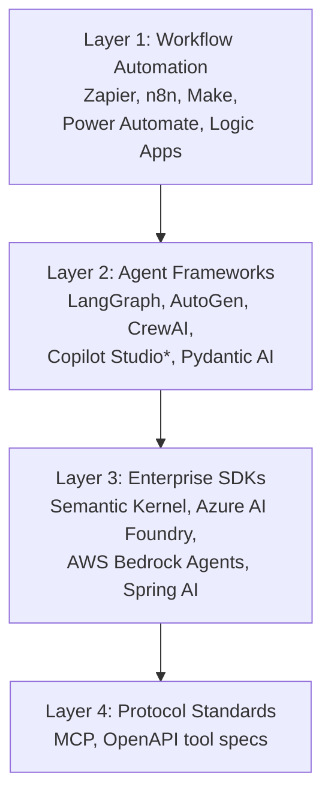
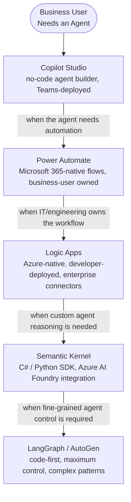

*[Agentic AI Academy](../../README.md) · Section 3 — Frameworks and Orchestration · Lesson 3.1*

---

# Agentic Frameworks & Orchestration
**Last Updated:** 2026-04-10

> *The model is the engine. The framework is the car — and choosing the wrong one means you'll spend more time fixing the vehicle than driving it.*

---

## Learning Outcomes

By the end of this page, you will be able to:

- Explain what an orchestration framework does and why it exists
- Map the landscape of tools from no-code automation to code-first agent frameworks
- Distinguish between workflow automation tools, agent frameworks, and enterprise SDKs — and know which problem each solves
- Match a specific tool (n8n, Zapier, Power Automate, Logic Apps, Copilot Studio, LangGraph, AutoGen, CrewAI, Semantic Kernel) to a given use case with clear reasoning
- Understand how Microsoft's tooling stack connects and when to use each layer
- Identify the right level of abstraction for your team's needs without over-engineering
- Anticipate the production trade-offs each category makes before you commit to one

---

## 1. Why This Matters (In Our Systems)

A team decides to build an AI feature. They start with a raw API call. It works. Then they need the agent to call a tool. They wire that up. Then they need memory. Then retry logic. Then logging. Then multi-step workflows. Then parallel execution. Six weeks later, they have built a bespoke orchestration layer out of glue code, hope, and increasingly fragile if-statements.

Another team picks the wrong framework — one designed for visual workflow automation when they needed fine-grained programmatic control. They spend three weeks fighting the tool's abstractions before admitting defeat and starting over.

A third team — deep in the Microsoft ecosystem — reaches for LangGraph when Power Automate and Copilot Studio would have delivered the same outcome in two days, with zero infrastructure to maintain.

The framework decision is one of the highest-leverage early choices in any agentic system. The wrong one doesn't just slow you down — it shapes the ceiling of what you can build, how easily you can debug it, and how much of your team's effort goes into fighting infrastructure versus building product.

Understanding the landscape before you pick is not over-planning. It is the difference between a foundation and a sinkhole.

---

## 2. Intuition & Mental Models

Think about kitchens.

A **fast-food kitchen** (Zapier, Power Automate) is designed for speed and consistency. Everything has a template. You assemble known ingredients in known ways. You can produce hundreds of meals with zero culinary training. You cannot put duck confit on the menu.

A **restaurant kitchen** (LangGraph, AutoGen) gives a trained chef real tools — knives, heat control, improvisation. The output is far more flexible and sophisticated. It requires skill to operate. You would not hand it to someone on their first day.

A **catering operation with a central commissary** (Logic Apps, Semantic Kernel) is designed for scale, consistency, and auditability. It has approval processes, dietary constraint tracking, and audit logs. Built for institutional clients, not dinner parties.

A **self-service food court kiosk** (Copilot Studio) lets anyone order a customised meal without knowing how to cook. The menu is fixed, the experience is smooth, and it works brilliantly — right up until you want something that isn't on the menu.

A **universal power outlet standard** (Model Context Protocol / MCP) is not a kitchen at all — it is the standard that lets every kitchen plug in any appliance. It solves the integration problem between tools and models, regardless of which framework you chose.

None of these is universally "better." They solve different problems for different teams at different stages. The mental model that pays off: **always choose the simplest tool that solves your actual problem**, and know what signals tell you you've outgrown it.

---

## 3. Core Concepts & Terminology

**Orchestration Framework**
Software that manages the coordination of LLM calls, tool use, memory, state, and agent interactions. Without one, you write this coordination logic yourself. With one, you inherit its opinions — for better and worse.

**Workflow Automation Tool**
A system designed to connect applications and automate sequences of steps, typically via a visual interface. LLMs are one node in a larger workflow, not the primary construct. Examples: Zapier, n8n, Power Automate, Logic Apps.

**Agent Framework**
A code-first library where the LLM and its reasoning loop are the primary construct. Designed to build, orchestrate, and run agents — single or multi-agent. Examples: LangGraph, AutoGen, CrewAI.

**No-Code Agent Builder**
A visual environment that lets non-developers create AI agents with predefined capabilities, connectors, and deployment targets. Example: Copilot Studio.

**Enterprise SDK**
A framework designed for production enterprise integration — with observability, compliance features, multi-language support, and alignment with enterprise platforms. Examples: Semantic Kernel (Microsoft), Spring AI (Java ecosystem).

**Protocol / Standard**
A specification that defines how tools and resources expose themselves to models, independent of the framework. Model Context Protocol (MCP) is the current leading example — it standardises tool definitions so the same tool works across LangGraph, AutoGen, Claude, or any compliant model.

**Graph-Based Orchestration**
A model where agent workflows are expressed as directed graphs — nodes are steps (LLM calls, tools, conditions), edges are transitions. Enables cycles, branches, and explicit state management. LangGraph is the primary example.

**Event-Driven Orchestration**
A model where agents react to events rather than following a predefined graph. Steps trigger based on incoming signals. More flexible for unpredictable workflows, harder to trace and debug.

**Human-in-the-Loop (HITL) Checkpoint**
A defined pause in an orchestrated workflow where a human must approve, correct, or redirect before execution continues. Production-grade frameworks support this as a first-class feature.

---

## 4. How It Works — The Landscape in Layers

The tooling landscape organises cleanly into four layers, from least to most technical:



*Copilot Studio sits between Layer 1 and 2 — a no-code agent builder, not a pure workflow tool and not a full code-first framework.*

Each layer builds on the one below. A team might use LangGraph (Layer 2) with MCP tool definitions (Layer 4), deployed via Azure AI Foundry (Layer 3), with Logic Apps (Layer 1) triggering the workflow from a business event. They are not competitors — they are different parts of the same stack.

> **Counterintuitive:** LangGraph and Zapier are not alternatives. One builds AI agents; the other automates business workflows. A team that replaces Zapier with LangGraph for a form-to-email automation has significantly over-engineered their problem. A team that uses Zapier to build a deep research agent has significantly under-tooled theirs.

---

## 5. The Tools — What Each One Actually Does

### Layer 1: Workflow Automation Tools

**Zapier**
The oldest and most recognised name in workflow automation. Connects 6,000+ apps via a visual drag-and-drop interface. AI steps let you call an LLM inside a workflow — summarise an email, classify a ticket, generate a draft reply. The LLM is one step among many, not the orchestrating intelligence.

*Strengths:* fastest time to value for business users, massive integration library, no coding required.
*Limits:* limited control over LLM behaviour, no real agent loops, debugging is opaque, pricing escalates with volume.
*Best for:* business automation where AI is one step — not the director.

---

**n8n**
Open-source, self-hostable workflow automation. Comparable visual interface to Zapier but with significantly more flexibility — you can write JavaScript or Python inside nodes, call any HTTP endpoint, and run it on your own infrastructure. Has an AI agent node that supports basic tool-calling loops.

*Strengths:* self-hostable (data sovereignty), more extensible than Zapier, growing AI-native features, cost-effective at scale.
*Limits:* more setup than Zapier, AI agent capabilities are still maturing compared to dedicated frameworks.
*Best for:* teams wanting Zapier-level convenience with more control and self-hosting. A good bridge between pure automation and agent-native thinking.

---

**Power Automate (Microsoft)**
Microsoft's answer to Zapier. Connects Microsoft 365 apps (Teams, SharePoint, Outlook, Dynamics) and hundreds of third-party services via a visual flow builder. Has an AI Builder module that lets you embed LLM-powered steps — document processing, sentiment classification, form extraction — inside a flow. Deep native integration with the Microsoft 365 ecosystem is its defining advantage.

*Strengths:* if your organisation runs on Microsoft 365, Power Automate is already licensed and deeply connected to your data. SharePoint triggers, Teams notifications, Outlook actions — zero integration overhead. Business users can build and own their own flows.
*Limits:* AI capabilities are more constrained than dedicated agent frameworks, debugging complex flows can be opaque, costs escalate with premium connectors.
*Best for:* Microsoft 365 shops automating business workflows where the data lives in SharePoint, Teams, or Dynamics — and AI is one step, not the director.

---

**Logic Apps (Azure)**
Azure's enterprise-grade workflow automation service. Looks similar to Power Automate on the surface — visual designer, connectors, trigger-based flows — but positioned firmly at the developer and IT-pro end of the spectrum. Runs serverless in Azure, supports both a visual designer and an underlying JSON-based workflow definition you can version-control and deploy via CI/CD pipelines. Offers a consumption model (pay per execution) and a standard model (dedicated compute, more control).

*The key distinction from Power Automate:* Logic Apps is infrastructure you own and deploy. Power Automate is a SaaS product your business users operate. They can integrate with each other; they are not the same product.

*Strengths:* enterprise-grade reliability, full Azure RBAC and VNet integration, deployable via ARM/Bicep/Terraform, strong connector library including SAP, mainframe, and healthcare systems. Supports long-running workflows measured in days, not minutes.
*Limits:* steeper setup than Power Automate, not designed for business users, AI-native agent patterns require pairing with Azure AI Foundry or Semantic Kernel.
*Best for:* IT and engineering teams building reliable, auditable business workflows on Azure — especially where data sovereignty, VNet isolation, or enterprise connector support matters.

---

### Layer 2: Agent Frameworks

**Copilot Studio (Microsoft)**
Microsoft's no-code agent builder. Lets business users and citizen developers create custom AI agents — chatbots, internal assistants, process agents — without writing code. Agents can be connected to internal knowledge bases (SharePoint, Dataverse), given tools (Power Automate flows, Logic Apps workflows, custom API connectors), and deployed to Teams, web, or other channels. Under the hood, it uses Azure OpenAI and connects into the broader Power Platform ecosystem.

*The mental model:* Copilot Studio is to agent-building what Power BI is to analytics — it democratises access to a sophisticated capability for people who are not engineers, within Microsoft's guardrails.

*Strengths:* genuinely no-code for standard use cases, deeply integrated with Teams and Microsoft 365, agent actions can trigger Power Automate flows, built-in governance and data loss prevention policies.
*Limits:* limited control for complex agent patterns — you cannot express a LangGraph-style conditional execution graph in Copilot Studio. When requirements outgrow the visual designer, you hit a wall quickly.
*Best for:* business teams who need an internal assistant or process agent within the Microsoft ecosystem, and IT teams who want to give business units self-service agent creation within controlled boundaries.

---

**LangGraph**
A graph-based agent orchestration library. Workflows are modelled as directed graphs with explicit nodes (steps) and edges (transitions). State is tracked across the graph. Supports cycles (agent loops), branching, human-in-the-loop pauses, and streaming.

*The core idea:* instead of writing agent logic as imperative code, you define it as a graph — which makes the flow inspectable, debuggable, and composable.

```python
# Conceptual structure — not a complete implementation
graph = StateGraph(AgentState)
graph.add_node("reason", reasoning_step)
graph.add_node("call_tool", tool_execution_step)
graph.add_node("respond", final_response_step)

graph.add_conditional_edges(
    "reason",
    route_next,           # decides: tool or respond?
    {"tool": "call_tool", "done": "respond"}
)
graph.add_edge("call_tool", "reason")   # loop back after tool use
```

*Strengths:* explicit control over execution flow, excellent observability (via LangSmith), strong production features, active development.
*Limits:* steeper learning curve, LangChain ecosystem has a history of breaking changes, graph mental model requires adjustment.
*Best for:* teams building production-grade single or multi-agent systems who want fine-grained control and observability.

---

**AutoGen (Microsoft)**
A multi-agent conversation framework where agents are modelled as participants in a conversation. Agents send messages to each other; an orchestrating agent routes the conversation. Specialises in patterns like Critic-Actor, debate, and collaborative problem-solving.

*The core idea:* agents are social — they interact through structured dialogue rather than direct function calls.

*Strengths:* excellent for multi-agent patterns, strong research community, supports human-in-the-loop as a "human proxy agent," good for iterative refinement workflows.
*Limits:* conversation-as-coordination can feel unnatural for deterministic pipelines, debugging multi-agent conversations requires care.
*Best for:* multi-agent systems where the collaboration pattern is central — code review, research, debate, iterative generation.

---

**CrewAI**
A higher-level framework that models agents as a "crew" with defined roles, goals, and a backstory. A crew has a manager agent that delegates tasks to specialist agents. Designed to feel intuitive to people who think in org-chart terms.

*The core idea:* you define *who* each agent is and *what their job is*, and the framework handles the coordination.

*Strengths:* very fast to prototype, role-based mental model is natural, good for straightforward orchestrator-worker patterns.
*Limits:* less control than LangGraph when you need it, abstractions can obscure failure modes, less mature for complex production scenarios.
*Best for:* teams that want to prototype multi-agent workflows quickly and whose use case fits the role-based model cleanly.

---

**Pydantic AI**
A newer, opinionated framework that leans heavily into type safety and validation. Agents are defined with typed inputs and outputs; tool calls are validated at runtime. Fewer magic abstractions, more predictable behaviour.

*Best for:* teams where type safety and predictable output schemas are non-negotiable — financial, legal, or any domain where output structure matters as much as content.

---

### Layer 3: Enterprise SDKs

**Semantic Kernel (Microsoft)**
An enterprise-grade SDK supporting Python, C#, and Java. Designed to integrate LLM capabilities into existing enterprise applications — not to replace them. Has strong plugin architecture, memory abstractions, and deep alignment with Microsoft Azure services. The .NET support makes it a natural fit for teams already in the Microsoft ecosystem.

*Best for:* .NET/enterprise teams integrating AI into existing systems, organisations standardised on Azure, teams needing multi-language SDK support.

---

**Azure AI Foundry / AWS Bedrock Agents**
Managed cloud services that provide agent capabilities — tool use, memory, orchestration — without running your own framework. You define the agent's tools and behaviour; the cloud provider handles the runtime, scaling, and infrastructure.

*Strengths:* no infrastructure management, built-in compliance and security features, direct integration with cloud services.
*Limits:* less control than self-hosted frameworks, vendor lock-in, costs at scale can be significant.
*Best for:* teams that want production-grade agent infrastructure without the operational overhead, especially within an existing cloud commitment.

---

### Layer 4: Protocol Standards

**Model Context Protocol (MCP)**
An open standard that defines how tools and data sources expose themselves to AI models. Think of it as USB-C for AI tools — a standard connector that works regardless of which model or framework is on the other end.

With MCP, a tool built once (a database query tool, a file reader, a calendar API) can be used by any MCP-compliant model or framework without custom integration per tool.

*Why it matters:* as your tool library grows, the integration cost without a standard grows quadratically. MCP makes it linear.

*Best for:* teams building reusable tool libraries, organisations standardising tool access across multiple agent projects, any team where tool portability matters.

---

## 6. The Microsoft Stack — How It Fits Together

For teams inside the Microsoft ecosystem, the tools form a coherent layered stack rather than a menu of competing choices:



A realistic enterprise deployment might use all five layers simultaneously: Copilot Studio for the HR team's internal assistant, Power Automate to trigger document processing workflows, Logic Apps to orchestrate back-end integration with SAP, Semantic Kernel to manage agent reasoning and memory, and LangGraph for a specific complex research workflow that Semantic Kernel's abstractions cannot express cleanly.

They are not competitors inside this stack. They are colleagues.

---

## 7. Practical Usage & Decision Guidance

The most useful decision starts not with "which framework?" but with "what kind of problem is this?"

```
Is the primary need connecting existing apps with AI as one step?
  YES → Workflow automation layer. Next question:
        Are you in the Microsoft 365 ecosystem?
          YES → Power Automate (business users) or Logic Apps (IT/dev-owned)
          NO  → Zapier (speed) or n8n (self-hosting / control)

Is the primary need building an AI agent with tools and a reasoning loop?
  YES → Agent framework. Next question:

  Are you in the Microsoft ecosystem, non-technical audience?
    YES → Copilot Studio

  Is the workflow deterministic / graph-like?
    YES → LangGraph (control + observability)

  Is the workflow multi-agent with collaborative roles?
    YES → AutoGen (conversation-based) or CrewAI (role-based, faster prototype)

  Is type safety and output validation non-negotiable?
    YES → Pydantic AI

Is the team in the Microsoft/.NET ecosystem, building for production?
  YES → Semantic Kernel (+ Azure AI Foundry for managed runtime)

Is infrastructure management a constraint?
  YES → Managed cloud (Azure AI Foundry, AWS Bedrock Agents)

Do you need tools to work across multiple frameworks?
  YES → Build to MCP spec from day one
```

| Tool | Best Fit | Not For |
|---|---|---|
| Zapier | Business automation, AI as one step | Building agent loops |
| n8n | Self-hosted automation, moderate complexity | Complex agent state management |
| Power Automate | Microsoft 365 automation, non-technical users | Code-first agent patterns |
| Logic Apps | Azure-native enterprise workflows, IT/dev-owned | Business user self-service |
| Copilot Studio | No-code agent building in Microsoft ecosystem | Complex multi-step reasoning patterns |
| LangGraph | Production agents, explicit control | Quick prototypes |
| AutoGen | Multi-agent, iterative collaboration | Simple single-agent tasks |
| CrewAI | Fast prototyping, role-based crews | When fine-grained control is needed |
| Semantic Kernel | .NET/Azure enterprise integration | Greenfield Python-first teams |
| MCP | Tool standardisation across projects | Replacing an agent framework |

---

## 8. Common Pitfalls & Misconceptions

**"I'll start with LangGraph because it's the most powerful."**
Starting with the most powerful tool means starting with the most complexity. Complexity is a tax you pay on every debugging session. If your problem is "summarise incoming emails," Power Automate or n8n solves it in an afternoon. LangGraph solves it in a week and leaves you maintaining a graph that does one thing.

**"Power Automate and Logic Apps are the same thing."**
They share a visual designer aesthetic and a connector library, which causes real confusion. Power Automate is a SaaS product for business users — licensed per user, designed for non-developers, lives in the Microsoft 365 admin centre. Logic Apps is an Azure infrastructure service — deployed like any cloud resource, owned by engineering, version-controlled and deployed via pipelines. They can call each other, but they are owned by different teams and solve different governance problems. Conflating them leads to the wrong team owning the wrong tool.

**"Copilot Studio will handle anything a chatbot needs."**
Copilot Studio handles *standard* chatbot needs elegantly. The moment you need conditional branching across more than two or three states, iterative retrieval, or coordination between multiple agents, you are fighting the visual designer. It is a ceiling, not a foundation. Know the ceiling before you commit a complex use case to it.

**"These frameworks abstract away the hard parts."**
They abstract away the boilerplate. The hard parts — prompt design, tool schema quality, memory strategy, failure handling, evaluation — remain entirely your responsibility. A framework does not make a bad agent good. It makes a good agent easier to build.

**"AutoGen and LangGraph are competitors — I need to pick one."**
They solve different structural problems. LangGraph is about controlling execution flow. AutoGen is about modelling agent collaboration as dialogue. Some teams use both in the same system for different layers.

**"The framework will handle retries and failures."**
Most frameworks expose retry primitives — they do not implement your retry strategy for you. A tool that fails, a context window that overflows, an agent that loops — these require explicit handling. The framework gives you the tools; you must wield them.

---

## 9. Trade-offs, Scale, and Edge Cases

**Abstraction debt:** High-level frameworks (CrewAI, Copilot Studio, Zapier) move fast in the beginning and hit walls later. When you need behaviour the abstraction doesn't support, you fight the framework to get around it. Know the ceiling of each tool before you commit.

**Observability:** LangGraph + LangSmith gives you detailed traces of every node execution. AutoGen conversations are inspectable. Logic Apps has built-in run history in the Azure portal. Power Automate has flow run history. Zapier's debugging is limited. At production scale, you need traces — choose a framework that provides them or integrates with your observability stack.

**Vendor lock-in:** Copilot Studio, Power Automate, Logic Apps, and Semantic Kernel all tie you to the Microsoft ecosystem. CrewAI and LangGraph tie you to the LangChain ecosystem. Managed cloud agents lock you to a provider. MCP tools are the most portable investment — they travel with you regardless of framework changes.

**Framework churn:** This ecosystem moves fast. LangChain has had significant breaking changes between major versions. AutoGen released a substantially different v0.4 architecture. Microsoft has rebranded and restructured its Power Platform AI features multiple times. Contain framework-specific code behind your own abstractions where possible — treat the framework like a dependency, not a foundation.

**When to go frameworkless:** For simple, well-defined agent pipelines (one tool, one loop, clear stopping condition), a handwritten agent loop is often more debuggable, more portable, and more maintainable than a framework. Frameworks earn their keep at complexity. Don't import them before you need them.

---

## 10. Self-Check Questions

1. A product manager asks you to build a workflow that sends a Teams message when a new support ticket is created, with an AI-generated summary. Your organisation runs on Microsoft 365. Which tool do you reach for, and which would be the wrong choice?
2. You're building a research agent that searches the web, reads pages, writes notes to memory, and iterates until it has a complete answer. Which framework best fits, and what is the primary reason?
3. Your team is building three separate AI features — a document Q&A, a code review agent, and a customer support chatbot — all of which need a "search internal SharePoint wiki" tool. How does MCP change your architecture decision, and how does Copilot Studio's SharePoint connector relate?
4. A business stakeholder wants to use Copilot Studio for a workflow that requires the agent to pull live pricing from an external API, cross-reference it against an internal pricing matrix, and then route the result through a conditional approval chain of three people. What do you tell them?
5. You've deployed an AutoGen-based multi-agent system to production. Users report that sometimes it takes 2 seconds, sometimes 40 seconds. What are the three most likely causes, and which framework features would help you diagnose them?

---

## 11. What to Learn Next

- **[[Agentic Design Patterns & Tool Use]]** — Frameworks implement patterns; this page covers the patterns themselves, so you can evaluate whether a framework's abstractions match your problem's shape.
- **[[LLM Evals & Observability]]** — Every framework generates traces, logs, and outputs that need structured evaluation; this page covers how to measure whether your orchestrated system is actually working.
- **[[Memory Architecture for Agents]]** — Framework choice affects which memory strategies are available; understanding memory architecture helps you evaluate a framework's memory primitives before committing.
- **[[Human-in-the-Loop Design]]** — HITL support varies significantly between frameworks — LangGraph's interrupt mechanism differs from AutoGen's human proxy agent and Copilot Studio's approval actions. Knowing the design principles helps you use each correctly.

---

## References

### Core References
- [LangGraph Documentation](https://langchain-ai.github.io/langgraph/) — Start with the conceptual overview before the API reference
- [AutoGen Documentation](https://microsoft.github.io/autogen/) — The architecture overview for v0.4 is essential reading before building anything
- [Copilot Studio Documentation](https://learn.microsoft.com/en-us/microsoft-copilot-studio/) — Covers agent topics, action configuration, and Teams deployment
- [Power Automate Documentation](https://learn.microsoft.com/en-us/power-automate/) — Covers AI Builder integration and AI-assisted flow creation
- [Logic Apps Documentation](https://learn.microsoft.com/en-us/azure/logic-apps/) — The "Logic Apps vs Power Automate" comparison article in the docs is worth reading before choosing between them
- [Semantic Kernel Documentation](https://learn.microsoft.com/en-us/semantic-kernel/) — Essential for .NET teams integrating AI into existing systems
- [Model Context Protocol Specification](https://modelcontextprotocol.io) — Key reading for any team building reusable tools across frameworks

### Supplementary Reading
- *n8n AI Agent documentation* — [n8n.io/ai](https://n8n.io/ai) — Useful for understanding where the no-code/low-code boundary with genuine agent capability currently sits
- *CrewAI documentation and examples* — [docs.crewai.com](https://docs.crewai.com) — The quickstart gives an honest sense of how fast you can go and where the abstraction ceiling sits
- *"The State of AI Agents"* — a16z and Sequoia landscape surveys (2024–2025) — Key insight across both: the market is converging on graph-based state management and protocol standardisation as the two durable abstractions regardless of which framework wins

---

## Summary

Agentic frameworks exist on a spectrum from no-code workflow automation (Zapier, Power Automate) to no-code agent builders (Copilot Studio) to enterprise workflow infrastructure (Logic Apps) to code-first agent orchestration (LangGraph, AutoGen) to enterprise SDKs (Semantic Kernel) to protocol standards (MCP) — and these are not competing alternatives but different layers of the same stack. For teams in the Microsoft ecosystem, the layers connect deliberately: Copilot Studio for business users, Power Automate for Microsoft 365 workflows, Logic Apps for IT-owned enterprise orchestration, and Semantic Kernel or LangGraph when code-first control is required. MCP is the investment that pays off regardless of which framework you choose — portable tools that travel with you as the ecosystem evolves. Choose the simplest tool that solves your real problem today, know the signals that tell you you've outgrown it, and contain framework-specific code behind your own abstractions so the next framework migration is a week, not a quarter.

## Self-Assessment Checklist

- [ ] I can explain this clearly to a teammate without looking at the page
- [ ] I know when to use it and when to reach for something else
- [ ] I can spot related mistakes in a code review
- [ ] I know what I'd read next to go deeper

## Suggested Next Pages

- [[Agentic Design Patterns & Tool Use]] — *Frameworks implement patterns — knowing the patterns lets you evaluate any framework, including ones that don't exist yet*
- [[Memory Architecture for Agents]] — *Framework selection affects which memory strategies are available — understanding memory first makes the framework choice clearer*
- [[LLM Evals & Observability]] — *An orchestrated system without evaluation is a black box; this page gives you the instrumentation layer every production framework needs*

---

← [2.4 — Retrieval-Augmented Generation](<../2. Agent Fundamentals/2.4-Retrieval-Augmented-Generation.md>) &nbsp;|&nbsp; [4.1 — Multi-Agent Architectures →](<../4. Multi Agent systems/4.1 Multi-Agent architectures.md>)
