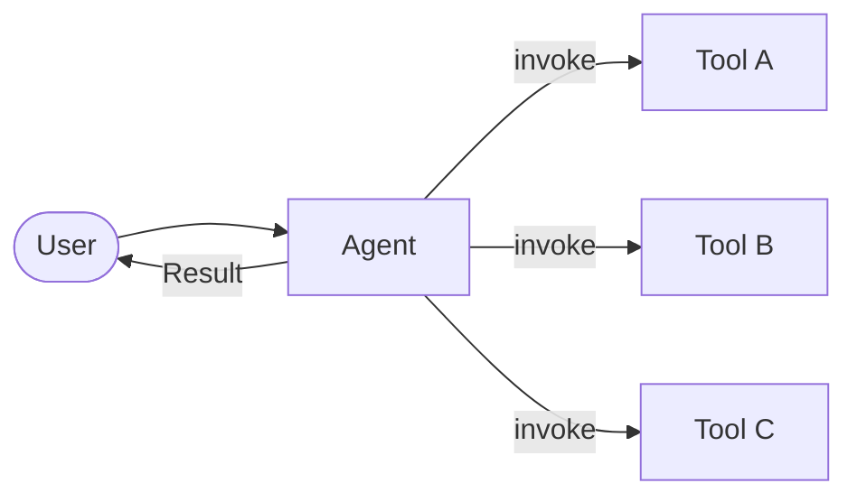
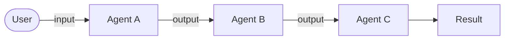
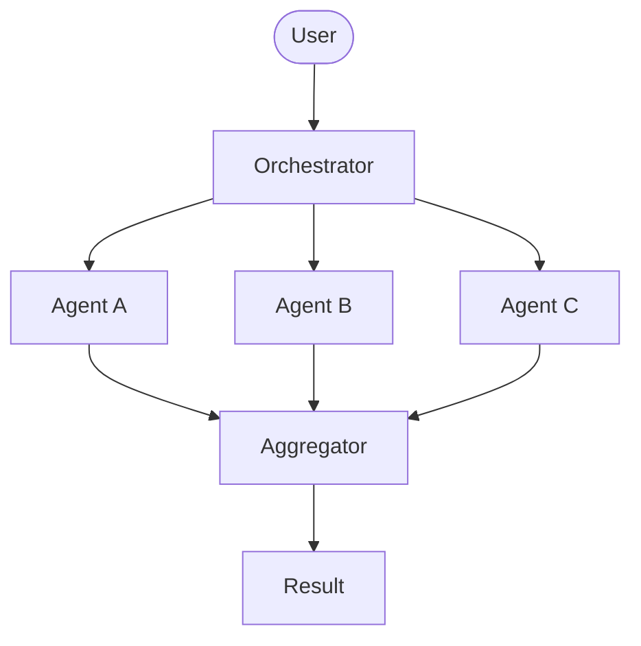
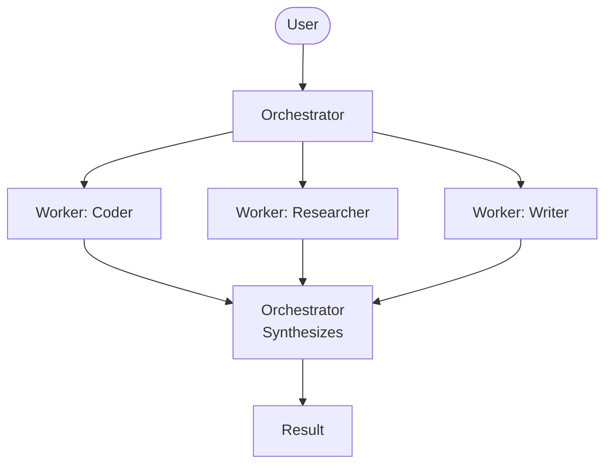
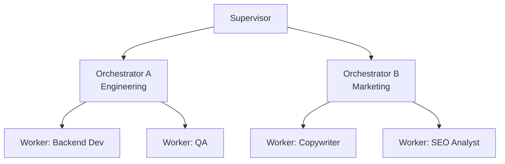
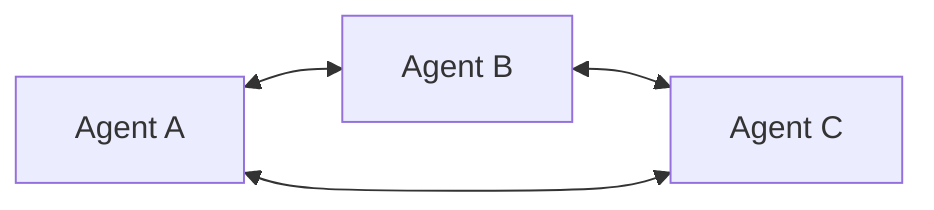
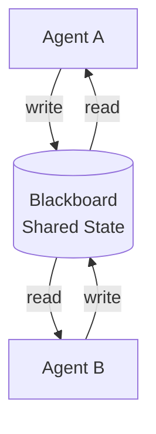
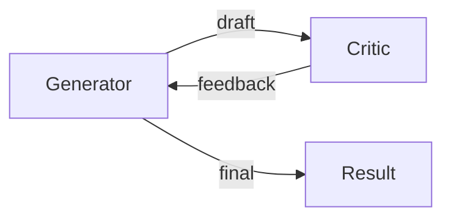
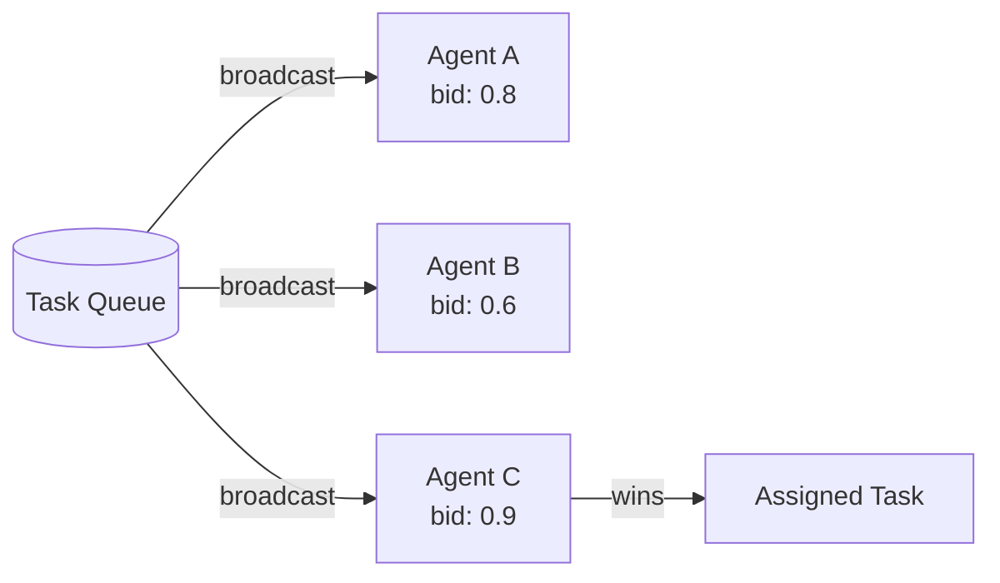
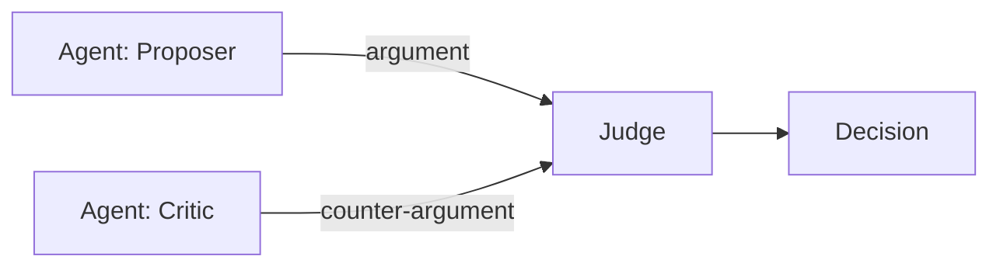

*[Agentic AI Academy](../../README.md) · Section 4 — Multi-Agent Systems · Lesson 4.1*

# Multi-Agent Architectures

**Last Updated:** 2026-04-11

> *One agent is a tool. Many agents, working together correctly, is a system that can reason, recover, and scale — but only if you pick the right shape.*

---

## Learning Outcomes

By the end of this page, you will be able to:

- Explain what a multi-agent system is and why it exists
- Identify at least six distinct architectural patterns and describe how they differ
- Match a real-world problem to the pattern most likely to solve it cleanly
- Spot the failure modes each pattern introduces before they hit production
- Sketch a basic multi-agent design on a whiteboard and defend your choices

---

## 1. Why This Matters (In Our Systems)

Imagine you're asked to plan a product launch: write copy, check legal compliance, research competitors, create visuals, and schedule social posts — all at once. You don't do all of that sequentially yourself. You delegate, coordinate, and synthesize.

Now imagine you tried to cram all of that into a single AI agent. It would lose context, make conflicting decisions, and fail at the edges of its attention span. This is exactly what happens in practice.

Multi-agent systems exist because **no single agent can reliably do everything** — not due to intelligence limits alone, but due to context window constraints, specialization advantages, parallelism needs, and fault isolation requirements.

If you design the wrong shape for your system, you'll get agents that talk past each other, loop indefinitely, or produce contradictory outputs with no way to resolve them. The architecture is the system.

---

## 2. Intuition & Mental Models

Think of a restaurant kitchen.

There's an expeditor at the pass who calls out orders. There are station chefs — one on grill, one on cold prep, one on sauces. They don't all talk to each other constantly; they each do their job and hand off at the right moment. The expeditor synthesizes everything into a coherent plate.

That's a multi-agent system. The expeditor is an orchestrator. The station chefs are workers. The ticket system is a shared message queue. The passing of a plate is a handoff.

Now swap the kitchen for a courtroom — lawyers argue opposing positions, a judge synthesizes. That's a debate/adversarial pattern. Swap it for a trading floor — agents bid for tasks based on capacity. That's a market-based pattern.

Every architectural pattern is just a different answer to the question: **who decides what, and how does information flow?**

---

## 3. Core Concepts & Terminology

Before patterns, get these building blocks solid:

- **Agent** — An entity that perceives input, reasons, and takes action. In software: a model + tools + a goal.
- **Task** — A unit of work delegated to or claimed by an agent.
- **Message/Signal** — How agents communicate. Can be synchronous (request/response) or asynchronous (events).
- **State** — What the system remembers across steps. Can be local (per agent) or shared (global).
- **Handoff** — Transferring control or output from one agent to another.
- **Orchestrator** — An agent or process that directs other agents.
- **Worker/Subagent** — An agent that receives directed tasks and executes them.
- **Tool** — A capability an agent can invoke (search, code execution, API call).
- **Memory** — Persistent context an agent can read/write across interactions.

---

## 4. How It Works — The Patterns

This is the map. Start at Simple, work toward Scale.

---

### Pattern 1: Single Agent + Tools (Baseline)

One agent. Many tools. No coordination needed.

**When it works:** Focused, bounded tasks. A research agent that searches, summarizes, and returns.
**Where it breaks:** Long tasks, context overflow, tasks requiring parallelism or specialization.

#### Real-World Use Cases

| Use Case | What the Agent Does |
|---|---|
| Customer support bot | Receives a ticket, queries a knowledge base, drafts a reply, logs the interaction |
| Code explanation tool | Takes a function, reads documentation, returns a plain-English explanation |
| Personal scheduling assistant | Reads calendar, checks preferences, books a meeting slot |
| Expense categorization | Reads a receipt image, classifies the category, writes to a ledger |

> The single-agent pattern powers most production AI assistants today. GitHub Copilot's inline suggestions, Notion AI's "improve writing", and basic customer chatbots all live here. It is underrated precisely because it looks simple.

---

### Pattern 2: Sequential Pipeline (Chain)

Agents are linked in a line. Output of Agent A becomes input of Agent B.

**Good for:** Assembly-line tasks with clear, non-overlapping stages.
**Failure mode:** One bad output poisons every downstream agent. No recovery path.

> ⚠️ **Counterintuitive:** Adding more agents to a pipeline doesn't reduce error — it compounds it. Each step is a new chance to drift from the original intent.

**Enabling tech:** LangChain LCEL chains, simple queues (Redis, SQS), any async function composition.

#### Real-World Use Cases

| Use Case | Pipeline Stages |
|---|---|
| Content moderation | Detect language → classify severity → decide action → log decision |
| Job application screener | Parse resume → score against criteria → rank candidates → draft recruiter summary |
| Invoice processing | Extract fields (OCR agent) → validate against PO → flag discrepancies → approve or escalate |
| Medical report summarization | Extract clinical entities → normalize terminology → generate patient-facing summary → compliance check |

> Automated invoice processing at enterprise scale (think SAP integrations or Coupa) is almost always a pipeline. Each stage has a different data format and validation concern — trying to do it in one shot reliably is not realistic.

---

### Pattern 3: Parallel Fan-Out / Fan-In

One orchestrator spawns multiple agents simultaneously and aggregates results.

**Good for:** Independent subtasks that don't need each other's output. Dramatically cuts wall-clock time.
**Failure mode:** Aggregation logic becomes the bottleneck. Agents may return conflicting results with no resolution strategy.

**Enabling tech:** `asyncio` / `Promise.all`, thread pools, LangGraph parallel nodes, Celery task groups.

#### Real-World Use Cases

| Use Case | Parallel Agents |
|---|---|
| Competitive intelligence report | Simultaneously scrape 10 competitor sites, aggregate into one briefing |
| Multi-source financial analysis | Pull earnings reports, news sentiment, analyst ratings in parallel → synthesize |
| Penetration testing recon | Run port scan, WHOIS lookup, SSL audit, subdomain enumeration concurrently |
| Multilingual content publishing | Translate a blog post into 8 languages simultaneously → QA → publish |

> Perplexity AI's answer engine is conceptually a fan-out: it fans across multiple search sources in parallel, then synthesizes a single coherent answer. The parallelism is what makes it feel fast.

---

### Pattern 4: Orchestrator-Worker

A central orchestrator breaks down a goal, assigns tasks to specialized workers, collects results, and synthesizes.

**Good for:** Complex goals with distinct specializations. The orchestrator maintains the big picture; workers stay narrow and focused.
**Failure mode:** Orchestrator becomes a single point of failure. If it hallucinates task decomposition, everything downstream is wrong.

> ⚠️ **Counterintuitive:** Workers don't need to be "smarter." Specialization and tight scope often outperform a general-purpose agent given the same underlying model.

**Enabling tech:** OpenAI Assistants API, LangGraph, CrewAI, AutoGen, Claude's tool use + subagent calls.

#### Real-World Use Cases

| Use Case | Orchestrator Role | Workers |
|---|---|---|
| AI software engineer (e.g., Devin-style) | Breaks feature request into subtasks | Coder, test writer, documentation agent, code reviewer |
| Market research platform | Decomposes research question | Web scraper, data analyst, chart generator, report writer |
| Legal due diligence | Identifies document categories to review | Contract analyzer, risk flagger, precedent finder, summary writer |
| E-commerce catalog enrichment | Queues products for enrichment | Description writer, tag generator, SEO optimizer, image alt-text agent |

> SWE-bench top performers (like SWE-agent and OpenHands) are orchestrator-worker systems. The orchestrator plans the fix strategy; specialized subagents handle file edits, test runs, and diff validation. Task decomposition quality at the orchestrator is the #1 variable in benchmark performance.

---

### Pattern 5: Supervisor / Hierarchical

A supervisor manages orchestrators, who manage workers. Multi-level authority for large, multi-domain systems.

**Good for:** Large, long-running systems spanning multiple domains where no single orchestrator should own everything.
**Failure mode:** Coordination overhead grows fast. Messages pass through too many layers; latency accumulates and errors become hard to attribute.

**Enabling tech:** LangGraph with nested subgraphs, AutoGen GroupChat with nested managers, custom message-routing middleware.

#### Real-World Use Cases

| Use Case | Supervisor | Orchestrators | Workers |
|---|---|---|---|
| Autonomous startup operator | CEO agent | CTO agent, CMO agent, CFO agent | Engineers, designers, analysts |
| Enterprise IT operations | Incident commander | Infrastructure orchestrator, app orchestrator, security orchestrator | Diagnostic agents, remediation agents |
| AI-driven game NPC societies | World director | Faction leaders | Individual NPC agents |
| Large-scale content platform | Editorial director | Section editors (Tech, Business, Health) | Writers, fact-checkers, translators |

> Games like Minecraft-based AI experiments (e.g., Voyager, DEPS) use hierarchical multi-agent structures to simulate believable societies. A director-level agent sets world goals; faction agents coordinate groups; individual NPCs execute. The pattern maps almost perfectly onto how organizations actually work.

---

### Pattern 6: Peer-to-Peer (Decentralized)

No central authority. Agents communicate directly with each other, negotiate tasks, and self-organize.

**Good for:** Highly dynamic environments where task assignment cannot be predetermined. Resilient to single-node failure — no orchestrator to take down.
**Failure mode:** Coordination is hard. Agents can loop, deadlock, or contradict each other with no arbiter to resolve it. Debugging is painful.

**Enabling tech:** Actor model frameworks (Akka, Ray), custom message buses, gossip protocols, NATS or Kafka for agent-to-agent messaging.

#### Real-World Use Cases

| Use Case | Why P2P Fits |
|---|---|
| Robotic swarm coordination (warehouse/delivery drones) | No central server; robots negotiate paths and task claims locally |
| Decentralized threat detection (cybersecurity) | Sensor agents share indicators of compromise directly; no single SIEM to compromise |
| Distributed scientific simulation | Agents represent physical regions; exchange boundary conditions with neighbors only |
| Multiplayer AI agent economies (research) | Agents trade, negotiate, and form coalitions without a central market maker |

> NASA's Mars rover fleet research and autonomous drone swarms (like DARPA's OFFensive Swarm-Enabled Tactics program) use decentralized coordination because the communication latency to a central controller is unacceptable. The intelligence must live at the edge.

---

### Pattern 7: Blackboard / Shared Memory

Agents don't communicate directly. They read from and write to a shared knowledge store. Any agent can pick up any task it is qualified to handle.

**Good for:** Problems where no one agent knows the full solution — each contributes partial knowledge until the board converges on an answer.
**Failure mode:** Consistency is hard. Two agents writing to the same key simultaneously causes race conditions. Without locking or versioning, you get silent corruption.

**Enabling tech:** Redis, shared vector stores (Pinecone, Weaviate), a relational database with row-level locking, Apache Kafka as an event ledger.

#### Real-World Use Cases

| Use Case | How the Blackboard Works |
|---|---|
| Clinical diagnosis support | Each specialist agent (radiology, pathology, lab) writes findings; a synthesis agent reads the full board to form a differential |
| Air traffic control simulation | Each aircraft agent updates its position and intent; conflict-resolution agents monitor and intervene |
| Collaborative document drafting | Outline agent, research agent, writing agent, and citation agent all work the same shared document state |
| Supply chain disruption response | Demand agent, inventory agent, logistics agent, and procurement agent all read/write to a shared situation board |

> Early expert systems in medical diagnosis (like CADUCEUS from the 1980s) were blackboard architectures — specialists contributed findings to a shared record and a control agent decided when diagnosis was confident enough to surface. The pattern pre-dates LLMs by decades and remains highly relevant.

---

### Pattern 8: Reflection / Critic

One agent generates output; another agent critiques it; the generator revises. Optionally iterates until quality threshold is met.

**Good for:** Output quality tasks — writing, code generation, safety checking, plan validation.
**Failure mode:** The critic can be sycophantic (agrees with everything) or overcritical (never converges). Iteration loops need a hard stop condition.

> ⚠️ **Counterintuitive:** The critic doesn't have to be a different model. Even the same model in a different prompt context can meaningfully critique its own output — though a genuinely separate, adversarially-prompted critic performs better.

#### Real-World Use Cases

| Use Case | Generator | Critic |
|---|---|---|
| AI code review | Coding agent writes implementation | Review agent checks for bugs, style, security, edge cases |
| Legal contract drafting | Drafting agent writes clauses | Compliance agent flags non-standard terms and regulatory risk |
| Scientific hypothesis generation | Research agent proposes hypothesis | Falsification agent stress-tests assumptions and identifies confounders |
| Ad copy optimization | Creative agent writes variants | Brand safety agent checks tone, claim accuracy, and policy compliance |

> Anthropic's Constitutional AI training process is a large-scale reflection pattern: a model generates responses, a critique model scores them against a constitution, and the generator is fine-tuned on the critiques. The loop runs at dataset scale, not just inference time.

---

### Pattern 9: Market / Auction-Based

Tasks are posted to a market. Agents bid based on their capacity, specialization, or cost. The best bid wins the task.

**Good for:** Dynamic load balancing across heterogeneous agents with variable cost or latency profiles. Prevents task starvation.
**Failure mode:** Bidding strategy is non-trivial to design. Poorly designed auctions cause starvation, gaming, or runaway cost.

**Enabling tech:** Custom scoring functions, Celery with priority queues, AWS SQS with visibility timeouts, specialized task-routing middleware.

#### Real-World Use Cases

| Use Case | How Bidding Works |
|---|---|
| Cloud compute task routing | Spot instance agents bid based on current price and available capacity |
| Customer service queue routing | Specialist agents bid based on topic match score and current queue depth |
| Freelance AI agent marketplace (emerging) | Agents list capabilities and price; orchestrators select best bid per task |
| Real-time ad serving | Ad agents bid in milliseconds for impression slots; highest bid wins placement |

> Real-Time Bidding (RTB) in programmatic advertising is the most battle-tested market-based agent system in existence — billions of auctions per day, sub-100ms resolution. The AI agent equivalent is still maturing, but the mechanism design lessons from ad tech transfer directly.

---

### Pattern 10: Debate / Adversarial

Two or more agents argue opposing positions. A judge — human or model — evaluates the arguments and decides.

**Good for:** High-stakes decisions where false confidence is dangerous. Forces the system to surface the best counter-argument before committing.
**Failure mode:** Both agents may be wrong. The judge must be genuinely capable of adjudicating — otherwise you add latency with no quality gain.

#### Real-World Use Cases

| Use Case | Proposer | Critic | Judge |
|---|---|---|---|
| Architecture decision records | Agent argues for microservices | Agent argues for monolith | Senior engineer or model reviews |
| Investment thesis review | Bull-case agent | Bear-case agent | Portfolio manager or model |
| Security threat modeling | Red team agent (attacker perspective) | Blue team agent (defender perspective) | Security lead |
| Clinical trial protocol review | Efficacy-optimizing agent | Risk/safety-focused agent | Medical review board |

> OpenAI's "debate" alignment research (Irving et al., 2018) proposed this pattern as a scalable approach to AI safety: if two agents debate and a human judges, the human only needs to follow the argument, not evaluate the underlying facts. The pattern has since spread into production use for high-stakes document review.

---

## 5. Worked Example — Choosing a Pattern

**Scenario:** You're building a system that accepts a user's business question, researches it across the web, writes a structured report, and checks it for factual consistency before delivery.

Walk through the decision:

- Multiple distinct stages? Yes (research, write, check). Pipeline is a candidate.
- Research can happen in parallel across multiple sources? Yes. Fan-out within the research stage.
- Final check needs the full draft? Yes. Sequential after writing.
- Single point of failure acceptable? No. Add a critic loop on the checker with a max iteration cap.

**Result:** A hybrid — parallel fan-out for research, feeding into a sequential pipeline (write → critic → deliver). An orchestrator coordinates the stages. The critic runs a reflection loop with a maximum of 2 iterations before surfacing for human review.

This is how real systems look: **multiple patterns composed, not one pattern applied in isolation.**

---

## 6. Practical Usage & Decision Guidance

| Situation | Recommended Pattern |
|---|---|
| Simple, bounded task | Single Agent + Tools |
| Clear sequential stages, no parallelism needed | Pipeline |
| Independent subtasks, speed matters | Parallel Fan-Out |
| Complex goal requiring specialization | Orchestrator-Worker |
| Multiple domains, large system, clear hierarchy | Supervisor / Hierarchical |
| Dynamic tasks, no predictable structure, resilience critical | Peer-to-Peer |
| Collaborative knowledge accumulation | Blackboard |
| Output quality is critical, self-correction needed | Reflection / Critic |
| Heterogeneous agents, dynamic load balancing | Market / Auction |
| High-stakes decision, need to surface best counterargument | Debate / Adversarial |

**When NOT to go multi-agent:** When a single agent with good tools can do the job. Every added agent adds latency, cost, and failure surface. Start simple. Earn complexity.

---

## 7. Common Pitfalls & Misconceptions

**"More agents = smarter system."** The reality: more agents means more coordination overhead and more ways to fail silently. Complexity should follow necessity, not ambition.

**"The orchestrator is just a router."** The reality: the orchestrator often does the hardest cognitive work — task decomposition, ambiguity resolution, result synthesis. Underinvesting in the orchestrator's prompt and logic is the single most common design mistake.

**"Agents will naturally coordinate."** The reality: without explicit protocols (message formats, handoff contracts, shared state schemas), agents talk past each other in ways that are extremely hard to debug after the fact.

**Infinite loops.** Reflection and peer-to-peer patterns are especially susceptible. Always design explicit termination conditions — max iterations, confidence thresholds, timeout budgets — before you design the loop itself.

**Prompt bleed.** In systems where agents share context windows or message history, one agent's instructions can subtly override another's. Keep agent contexts isolated unless sharing is intentional.

---

## 8. Trade-offs, Scale, and Edge Cases

| Pattern | Latency | Fault Tolerance | Debuggability | Best Scale |
|---|---|---|---|---|
| Single Agent + Tools | Very Low | Low | Very High | Solo tasks |
| Pipeline | Low | Low | High | Small |
| Fan-Out | Low (parallel) | Medium | Medium | Medium |
| Orchestrator-Worker | Medium | Medium | High | Medium–Large |
| Supervisor | High | High | Low | Large |
| Peer-to-Peer | Variable | Very High | Very Low | Large |
| Blackboard | Medium | High | Medium | Medium–Large |
| Reflection / Critic | High | Medium | High | Any |
| Market / Auction | Medium | High | Medium | Large |
| Debate / Adversarial | Very High | Medium | High | Small–Medium |

At scale, observability becomes non-negotiable. You need traces per agent, message logs between agents, and latency metrics per stage. Without this, debugging a multi-agent failure is archaeology — you are reading artifacts, not watching events.

---

## 9. Self-Check Questions

1. Your orchestrator-worker system is producing inconsistent final outputs. The workers seem fine in isolation. Where do you look first, and why?
2. You have a peer-to-peer system where two agents keep assigning the same task to each other. What design property is missing?
3. When would you prefer a blackboard pattern over an orchestrator-worker pattern for a collaborative research task? What are you trading away?
4. A reflection loop is running 15 iterations before converging. What are two distinct root causes that could explain this?
5. Why might a pipeline produce wrong final output even when each individual agent's output looks correct in isolation?

---

## 10. What to Learn Next

- **Agent Memory Systems** — Patterns are stateless skeletons; memory is what makes them useful across sessions. Understanding episodic, semantic, and working memory in agents directly shapes how you design handoffs and shared state.
- **Prompt Engineering for Agent Roles** — Each agent's behavior is defined by its system prompt. Learning how to write tight, role-specific prompts determines whether your worker agents stay in their lane or drift.
- **Observability & Tracing in AI Systems** — You cannot debug what you cannot see. Learn how to trace agent calls, log intermediate state, and measure where your system spends time and makes mistakes.
- **Evaluation & Testing for Agentic Systems** — How do you know your architecture actually works? LLM-as-judge patterns, golden-set evals, and human review pipelines are the testing layer most teams skip and most regret.

---

## References

### Core References

- [Anthropic: Building Effective Agents](https://www.anthropic.com/research/building-effective-agents) — canonical primer on agentic patterns from the team that builds Claude
- [LangGraph Documentation](https://langchain-ai.github.io/langgraph/) — graph-based orchestration with first-class support for cycles, state, and multi-agent flows
- [AutoGen Framework](https://microsoft.github.io/autogen/) — Microsoft's research framework explicitly designed around multi-agent conversation and debate patterns
- [The Blackboard Model of Problem Solving — Hayes-Roth, 1985](https://en.wikipedia.org/wiki/Blackboard_system) — the original CS research; the core ideas have aged remarkably well
- [AI Safety via Debate — Irving et al., OpenAI, 2018](https://arxiv.org/abs/1805.00899) — the foundational paper behind the adversarial/debate pattern

### Supplementary Reading

- *Designing Machine Learning Systems* — Chip Huyen; the agents chapter is the most grounded production-oriented take available in book form
- CrewAI documentation — practical orchestrator-worker implementation; most important insight: role prompt specificity is the single highest-leverage variable in output quality
- *Voyager: An Open-Ended Embodied Agent with Large Language Models* (Wang et al., 2023) — excellent real-world case study of hierarchical agents in an open-ended environment

---

## Summary

Multi-agent architectures exist because complex tasks benefit from decomposition, specialization, and parallelism — the same reasons human organizations don't have one person do everything. The ten patterns in this page form a vocabulary: pipeline for sequence, fan-out for parallelism, orchestrator-worker for specialization, reflection for quality, peer-to-peer and blackboard for resilience, market-based for load balancing, and debate for high-stakes decisions. Real-world systems — from Perplexity's search engine to NASA's rover fleet to programmatic advertising — use these patterns in production today. The craft is knowing which pattern fits which problem, and having the discipline to start simpler than you think you need to.

---

## Self-Assessment Checklist

- [ ] I can explain this clearly to a teammate without looking at the page
- [ ] I can match a real-world use case to its most natural pattern
- [ ] I can spot coordination design mistakes in a system diagram or code review
- [ ] I know what I would read next to go deeper

---

## Suggested Next Pages

- [[Agent Memory Systems]] — *patterns are stateless skeletons; memory is what makes an agent useful across a session or conversation*
- [[Observability for AI Systems]] — *you will not know your architecture is broken until you can see inside it*
- [[Prompt Engineering for Agent Roles]] — *the system prompt is the job description; bad job descriptions produce bad workers*
- [[Evaluating Agentic Systems]] — *shipping without evals is guessing; this page shows you how to actually measure whether your system works*

---

← [3.1 — Frameworks & Orchestration](<../3. Frameworks and Orchestration/3.1 Frameworks and orchestration landscape.md>) &nbsp;|&nbsp; [4.2 — Agent Communication Protocols →](<4.2-Agent-Communication-protocols.md>)
