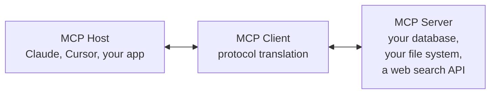
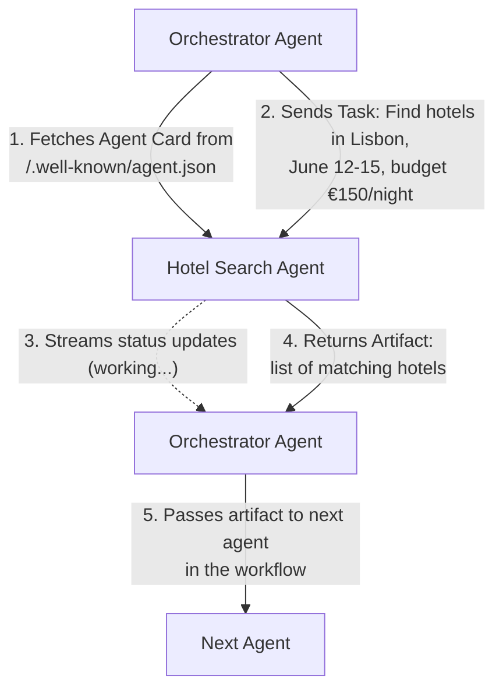
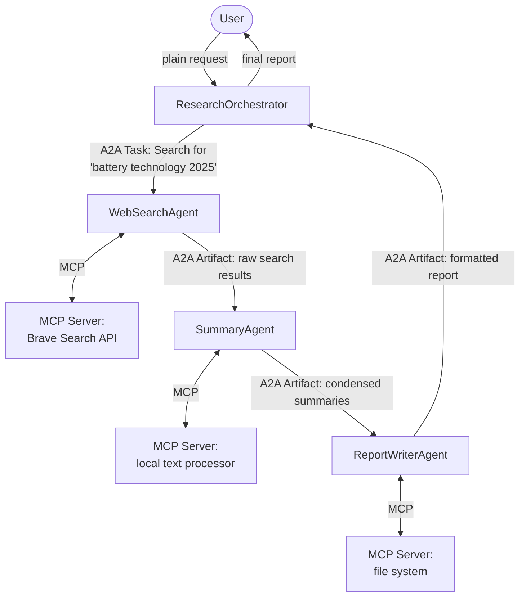

*[Agentic AI Academy](../../README.md) · Section 4 — Multi-Agent Systems · Lesson 4.2*

# Agent Communication Protocols

**Last Updated:** 2026-04-12

> *Agents are only as powerful as their ability to talk to each other — and right now, the industry is in the middle of figuring out exactly how that conversation should work.*

---

## Learning Outcomes

By the end of this page, you will be able to:

- Explain why agent communication protocols exist and what breaks without them
- Describe what MCP (Model Context Protocol) is, what problem it solves, and how it works
- Describe what A2A (Agent-to-Agent Protocol) is and how it differs from MCP
- Name at least three other industry protocols and place them on a timeline and purpose map
- Choose the right protocol — or combination — for a given agent system design
- Spot integration gaps and interoperability risks in a multi-agent architecture

---

## 1. Why This Matters (In Our Systems)

Here's a scenario that happens constantly in teams building with agents today.

You build an AI agent that can search the web. Your colleague builds an agent that can write reports. Your manager wants one system that researches *and* writes. Simple, right? You connect them.

Except your search agent returns results as a JSON array. Your colleague's writing agent expects a plain text summary. Your search agent authenticates with an API key in a header. The writing agent expects a bearer token in the body. One agent runs on HTTP. The other communicates over stdio. Neither knows the other exists until you hardcode it.

You have just built an integration, not a system. And every new agent pair you connect will cost you the same bespoke glue work. This is exactly where the web was in 1990 — before HTTP and HTML gave every browser and server a shared language.

**Agent communication protocols are the HTTP of the agentic web.** Without them, you build integrations. With them, you build ecosystems.

---

## 2. Intuition & Mental Models

### The USB Analogy

Before USB, every device had its own connector. Your printer used a parallel port. Your mouse used PS/2. Your camera had a proprietary cable. Connecting a new device meant checking what port it used, finding the right cable, and hoping it worked with your specific machine.

USB changed that. One standard. Any device. Any computer. Just plug in.

Agent communication protocols are the USB standard for the AI world. They answer: what shape is the connector? How does the device announce its capabilities? How does data flow across the connection? What happens on error?

MCP is USB-C for the model-to-tool connection.
A2A is the networking standard for agent-to-agent communication.
FIPA-ACL was the parallel port — it worked, but it was its era.

### The Foreign Diplomat Analogy

Imagine two diplomats from different countries meeting for the first time. They speak different languages. Without a shared protocol — a common language, a recognized format for proposals, a shared understanding of what "I agree" versus "I acknowledge" means — the meeting produces noise, not decisions.

Diplomatic protocol solves this. It defines: how to address each other, how to make a request, what a binding commitment looks like, and how to signal disagreement without causing an incident.

Agent communication protocols do the same thing — but for software agents that may be built by different teams, in different languages, running on different infrastructure, and designed without knowledge of each other.

### The Two Distinct Problems

Here is the split that confuses almost everyone when they first enter this space:

- **Model ↔ Tool:** How does an AI model call an external capability (a database, an API, a calculator)?
- **Agent ↔ Agent:** How does one autonomous agent talk to another autonomous agent?

These look similar but are fundamentally different problems. MCP solves the first. A2A solves the second. Confusing them leads to using the wrong tool — and wondering why it doesn't fit.

---

## 3. Core Concepts & Terminology

Before the protocols, nail these terms:

- **Protocol** — A shared set of rules that lets two parties communicate reliably, even if they were built independently. Think of it as a contract that both sides agree to honor.
- **Client** — The party initiating a request in a communication exchange.
- **Server** — The party responding to a request and providing a capability.
- **Transport** — The underlying mechanism that carries messages (e.g., HTTP, stdio, WebSocket).
- **Schema** — A formal description of the shape of a message. Defines what fields are expected, what types they are, and what is required.
- **Capability Discovery** — How one agent or model finds out what another can do, before it tries to use it.
- **Interoperability** — The ability of systems built independently to work together without custom glue code.
- **Performative** — In agent communication theory, the *intent* of a message. "I am informing you of X" is different from "I am requesting you to do X", even if the content looks similar.
- **Agent Card** — A machine-readable description of an agent's identity, capabilities, and how to reach it. Think of it as a business card that a computer can read.

---

## 4. Layer 1 — What Makes a Protocol?

Every agent communication protocol, regardless of its era or inventor, has to answer the same five questions:

| Question | What It Means in Practice |
|---|---|
| **Discovery** | How does one side learn what the other can do? |
| **Invocation** | How does one side ask the other to do something? |
| **Response Format** | How does one side communicate the result back? |
| **Error Handling** | What happens when something goes wrong? |
| **Identity & Trust** | How do parties know who they are talking to? |

A strong protocol answers all five clearly. A weak one leaves some implicit — and that is where bugs and security holes live.

With that foundation in place, let's walk the protocols from oldest to newest.

---

## 5. Layer 2 — FIPA-ACL: The Academic Ancestor

**Born:** 1997 | **Organization:** Foundation for Intelligent Physical Agents

Before cloud AI, academics and roboticists were already building multi-agent systems. FIPA-ACL (Agent Communication Language) was their standard.

Its core insight was the concept of **performatives** — the idea that the *intention* of a message matters as much as its content.

```
(inform
  :sender  AgentA
  :receiver AgentB
  :content "the-package-is-at-warehouse-3"
)

(request
  :sender  AgentA
  :receiver AgentB
  :content (action AgentB (deliver the-package))
)
```

`INFORM` says: *I am telling you a fact.*
`REQUEST` says: *I am asking you to do something.*
`QUERY-IF` says: *I am asking whether something is true.*
`PROPOSE` says: *I am suggesting a plan for your consideration.*

This distinction matters enormously. A system that can tell apart "I'm informing you" from "I'm ordering you" can build nuanced coordination logic — escalation paths, negotiation loops, consent mechanisms.

**Why it matters today:** FIPA-ACL's core ideas — performatives, structured intent, formal conversation protocols — echo in every modern agent protocol. It is the intellectual ancestor. It never became the web standard because it was too verbose and too academic for the pace of software development. But its vocabulary shapes how researchers think about agents to this day.

**Still used in:** Robotics (ROS-based systems), academic multi-agent research, some industrial automation systems.

---

## 6. Layer 3 — OpenAI Function Calling: The De Facto Tool Standard

**Born:** 2023 | **Organization:** OpenAI (widely adopted as informal standard)

When OpenAI introduced function calling, they accidentally created the most widely-used agent-to-tool protocol in the industry. It works like this:

You describe a tool to the model using JSON Schema:

```json
{
  "name": "get_weather",
  "description": "Returns current weather for a given city",
  "parameters": {
    "type": "object",
    "properties": {
      "city": {
        "type": "string",
        "description": "The city name"
      }
    },
    "required": ["city"]
  }
}
```

The model reads this, decides when to call it, generates a structured call, and your code executes it and returns the result. Simple. Effective. Now replicated by Anthropic (tool use), Google (function declarations), Mistral, and almost every major model provider.

**What it solved:** Tool invocation and response formatting. The model knows *what* tools exist and *how* to call them.

**What it did not solve:** How tools discover each other. How tools authenticate. How tools are shared across organizations. How agents talk to other agents. These gaps are exactly what MCP and A2A were built to fill.

---

## 7. Layer 4 — MCP: The Model-Tool Bridge

**Born:** November 2024 | **Organization:** Anthropic (open standard)

### The Problem It Solves

Every AI assistant needs to connect to external systems — your file system, your database, your Slack, your GitHub. Before MCP, every vendor built their own connector. Claude had a Claude connector. Cursor had a Cursor connector. If you switched tools, you rewrote your integrations.

MCP is the USB-C moment. Build one MCP Server for your database, and any MCP-compatible host (Claude, Cursor, VS Code Copilot, your custom agent) can connect to it without modification.

### The Architecture

MCP has three roles:



- **MCP Host** — The AI application that wants to use external capabilities (e.g., Claude Desktop, an IDE, your custom app).
- **MCP Client** — The protocol layer inside the host that speaks MCP.
- **MCP Server** — A lightweight process that exposes capabilities to MCP clients.

### What an MCP Server Can Expose

| Primitive | What It Is | Example |
|---|---|---|
| **Tools** | Actions the model can invoke | `run_sql_query`, `send_email`, `create_github_issue` |
| **Resources** | Data the model can read | A file, a database record, a calendar entry |
| **Prompts** | Pre-built prompt templates | "Summarize this repo", "Write a PR description" |

### How It Works — Step by Step

1. The MCP Server starts and announces its capabilities (tools, resources, prompts) via a manifest.
2. The MCP Client (inside the host) reads the manifest and makes capabilities available to the model.
3. The model decides to use a tool, generates a structured call.
4. The MCP Client routes the call to the correct MCP Server.
5. The Server executes and returns a result.
6. The model reads the result and continues reasoning.

### Transport Options

MCP supports two transport mechanisms:

- **stdio** — The client spawns the server as a child process and communicates over standard input/output. Great for local tools (file system, local scripts).
- **HTTP + SSE (Server-Sent Events)** — The server runs as a remote HTTP service. Great for shared, hosted tools.

### Real-World Use Cases

| Use Case | MCP Server Exposed |
|---|---|
| AI coding assistant reads your codebase | File system MCP server |
| Claude queries your company database | PostgreSQL MCP server |
| Agent creates GitHub issues from a conversation | GitHub MCP server |
| AI reads and drafts emails | Gmail MCP server |
| Developer agent runs tests and reads results | Terminal/shell MCP server |

> ⚠️ **Counterintuitive:** MCP is not about agents talking to agents. It is specifically about a *model* getting access to *tools and data*. If you need two autonomous agents to communicate and delegate tasks to each other, MCP alone is not the answer — that is A2A's territory.

---

## 8. Layer 5 — A2A: The Agent-Agent Bridge

**Born:** April 2025 | **Organization:** Google (open standard, 50+ partners at launch)

### The Problem It Solves

MCP connects a model to tools. But what if the "tool" is itself an intelligent agent — capable of reasoning, planning, and operating autonomously? What if you want a travel-booking agent to delegate hotel search to a specialist hotel agent, which in turn delegates payment to a payment agent?

This is agent *collaboration* — and it requires a different protocol. The agents need to:

- Find each other (discovery)
- Negotiate task ownership (delegation)
- Stream progress back and forth (long-running tasks)
- Communicate partial results, status updates, and errors

A2A is built for this.

### The Core Concepts

**Agent Card** — A JSON document, hosted at a known URL (typically `/.well-known/agent.json`), that describes an agent's identity, what it can do, and how to communicate with it. Think of it as a machine-readable business card.

```json
{
  "name": "HotelSearchAgent",
  "description": "Searches and compares hotel availability",
  "url": "https://hotels.example.com/agent",
  "capabilities": {
    "streaming": true,
    "pushNotifications": false
  },
  "skills": [
    {
      "id": "search_hotels",
      "name": "Search Hotels",
      "description": "Finds available hotels by location and dates",
      "inputModes": ["text"],
      "outputModes": ["text", "data"]
    }
  ]
}
```

**Task** — The unit of work in A2A. When Agent A asks Agent B to do something, it creates a Task. Tasks have lifecycle states: `submitted → working → completed / failed`.

**Message** — Communication within a Task. Messages carry `Parts` — text, files, or structured data.

**Artifact** — The output of a completed Task. The result that gets handed back to the calling agent.

### How It Works — Step by Step



### Real-World Use Cases

| Use Case | A2A in Action |
|---|---|
| Travel planning system | Orchestrator delegates to flight agent, hotel agent, car hire agent — all via A2A |
| Enterprise AI workforce | HR agent delegates payroll query to finance agent, which calls compliance agent |
| Software development pipeline | PM agent delegates to architect agent → coding agent → QA agent |
| Customer support escalation | Tier-1 agent escalates complex case to specialist agent with full context transferred |
| Supply chain coordination | Demand forecasting agent communicates inventory needs to procurement agent |

> ⚠️ **Counterintuitive:** A2A is built for *opaque* agent collaboration. The calling agent does not need to know how the receiving agent works internally — only what it accepts and what it returns. This is intentional. It mirrors how microservices work. You call an API; you don't care about its database schema.

---

## 9. Layer 6 — ACP and ANP: The Emerging Field

The protocol landscape is moving fast. Two more standards worth knowing:

### ACP — Agent Communication Protocol

**Organization:** IBM / BeeAI (open standard, 2025)

ACP is a REST-native protocol focused on simplicity and developer ergonomics. Where A2A uses Agent Cards and a task lifecycle model, ACP leans into familiar REST conventions — standard HTTP verbs, JSON bodies, synchronous and asynchronous response modes.

Its core premise: most developers already know REST. A protocol that looks like a REST API has a much lower adoption barrier than one requiring a new mental model.

**Best for:** Teams building agent systems on top of existing REST infrastructure. Easier to test with standard HTTP tools like curl or Postman.

### ANP — Agent Network Protocol

**Organization:** Community-driven / Decentralized AI research

ANP is the most ambitious and least mature of the group. Its goal: a fully decentralized agent communication layer where agents can discover and communicate with each other without any central registry, using decentralized identity (DID) standards.

Think of it as the peer-to-peer / blockchain-influenced take on agent communication. It solves the question: what if you don't want any central authority to control who can communicate with whom?

**Best for:** Research contexts, decentralized AI applications, scenarios where trust cannot be rooted in a central server.

**Current state:** Experimental. Not production-ready at the time of writing, but the ideas are influential.

---

## 10. How They All Differ — The Comparison Map

| Protocol | Created By | Primary Purpose | Communication Model | Maturity |
|---|---|---|---|---|
| FIPA-ACL | FIPA (academic) | Multi-agent coordination | Performative messages | Mature, niche |
| OpenAI Function Calling | OpenAI | Model → tool invocation | JSON schema + structured call | Widely adopted |
| MCP | Anthropic | Model → tool/data/resource | Client-server, stdio or HTTP | Growing rapidly |
| A2A | Google + partners | Agent ↔ Agent delegation | Task-based, HTTP + streaming | New, strong momentum |
| ACP | IBM / BeeAI | Agent ↔ Agent (REST-native) | REST HTTP | Early adoption |
| ANP | Community | Decentralized agent networking | P2P, DID-based | Experimental |

### The Key Distinction You Must Internalize

```
MCP  =  Model gets hands.  (Tools, data, resources for a model to use)
A2A  =  Agents get voices. (Agents delegate tasks to other agents)
```

They are complementary, not competing. A well-designed agent system will often use both: MCP so each agent can access its tools, and A2A so agents can coordinate with each other.

---

## 11. Worked Example — Building a Research & Report System

**Goal:** An agent that researches a topic and produces a polished report.

**Step 1 — Define the agents:**
- `ResearchOrchestrator` — accepts user query, coordinates the workflow
- `WebSearchAgent` — specialist at querying the web
- `SummaryAgent` — specialist at distilling long content
- `ReportWriterAgent` — specialist at structured document creation

**Step 2 — Assign protocols:**

- Each agent exposes its capabilities via an **A2A Agent Card**.
- The `ResearchOrchestrator` uses **A2A** to send tasks to each specialist agent.
- Each specialist agent internally uses **MCP** to connect to its tools (web search API, file system, formatting library).



This is a real production pattern. The separation of concerns is clean. Each agent can be replaced, upgraded, or swapped without touching the others — because they all speak the same protocols.

---

## 12. Practical Usage & Decision Guidance

| Scenario | Recommended Protocol(s) |
|---|---|
| Your model needs to query a database | MCP (build a DB MCP Server) |
| Your model needs to read files or run code | MCP (file system / shell MCP Server) |
| One agent needs to delegate a task to another | A2A |
| You want agents to discover each other dynamically | A2A (Agent Cards) |
| Your team lives in REST and wants minimal new concepts | ACP |
| You are building academic or robotic multi-agent research | FIPA-ACL |
| You need decentralized trust with no central authority | ANP (experimental) |
| You are connecting to a model from any major provider | OpenAI-style function calling / tool use |

**The practical starting point for most teams today:**

1. Use **MCP** to give your agents access to tools and data.
2. Use **A2A** when you need agents to collaborate and delegate.
3. Keep an eye on **ACP** as a simpler REST-native alternative to A2A.

---

## 13. Common Pitfalls & Misconceptions

**"MCP and A2A do the same thing."** They do not. MCP is vertical (model to tool). A2A is horizontal (agent to agent). Using MCP to simulate agent-to-agent communication is like using a USB cable to connect two computers — technically possible, deeply wrong for the purpose.

**"I'll just use HTTP and JSON and skip the protocol."** You can. Until you need capability discovery, streaming responses, standardized error codes, authentication, and the ability to swap out one agent for another without rewriting the caller. That's when the lack of protocol becomes expensive.

**"Protocols add latency."** A well-implemented protocol adds microseconds. A badly-designed bespoke integration adds hours of debugging. The trade is almost always worth it.

**"A2A means agents are autonomous — they'll just figure it out."** A2A defines how agents *communicate*. It does not define what they decide. You still need to design the task decomposition, the error handling, the escalation paths, and the termination conditions. The protocol is the vocabulary, not the conversation strategy.

**"I should pick one protocol and use it everywhere."** The protocols are complementary, not mutually exclusive. Most serious agent systems in production use more than one. Design at the level of *purpose*, then pick the protocol that fits.

---

## 14. Trade-offs, Scale, and Edge Cases

| Consideration | MCP | A2A |
|---|---|---|
| Latency | Low (local stdio transport) to moderate (HTTP) | Moderate to high (HTTP round-trips per task) |
| Discovery | Static (manifest loaded at startup) | Dynamic (Agent Card fetch at runtime) |
| Streaming | SSE for resources | Native task progress streaming |
| Security model | Server-level auth | Per-task auth, agent identity via Agent Cards |
| Ecosystem maturity | Growing fast (1000s of MCP servers exist) | Early (dozens of A2A-native agents) |
| Debugging | Relatively straightforward | Complex — tasks span multiple agents and hops |

**At scale**, the biggest challenge with any agent protocol is **observability**. When a task fails three hops into an A2A chain, which agent failed, what state was the task in, and what was the last message? Without distributed tracing across your agent network, you are debugging in the dark.

The protocols define the communication layer. Observability is what makes that layer operable.

---

## 15. Self-Check Questions

1. A teammate proposes using MCP to connect your orchestrator agent to a specialist pricing agent. What question would you ask before agreeing?

2. You are designing a customer support system where a Tier-1 agent escalates unresolved tickets to domain specialist agents. Which protocol fits this handoff, and what specific feature makes it well-suited?

3. What is the difference between a Tool in MCP and a Skill in A2A? Why does the distinction matter architecturally?

4. An A2A task is stuck in `working` state with no updates for 10 minutes. Where do you start debugging, and what information do you need?

5. Your company wants to build an internal agent marketplace — teams can publish specialized agents and other teams can discover and use them. Which protocol concept is the foundation for this capability, and what does it require each team to provide?

---

## 16. What to Learn Next

- **Multi-Agent Architecture Patterns** — Protocols define how agents talk; architecture patterns define how they are organized. Orchestrator-worker, peer-to-peer, and supervisor patterns each put protocols to work differently.
- **Agent Security & Trust Models** — Protocols open channels. Security closes the wrong ones. Learn how agent identity, capability scoping, and prompt injection attacks intersect with protocol design.
- **Observability for Agentic Systems** — A2A tasks span multiple hops. Without distributed tracing, you cannot operate them in production. This is the most commonly skipped foundation.
- **Agentic Workflow Design** — Understanding protocols is the prerequisite. Designing the actual task flows, fallback strategies, and human-in-the-loop checkpoints is the next layer of skill to build.

---

## References

### Core References

- [MCP Official Specification](https://modelcontextprotocol.io) — Anthropic's full MCP spec, architecture docs, and SDK guides; start with the "Core Architecture" page
- [A2A Protocol GitHub Repository](https://github.com/google-a2a/A2A) — Google's open-source A2A spec, reference implementation, and sample agents
- [ACP Specification — BeeAI](https://agentcommunicationprotocol.dev) — REST-native agent communication protocol from IBM's open-source agent team
- [FIPA Abstract Architecture Specification](http://www.fipa.org/specs/fipa00001/) — the original 2002 specification; valuable for understanding where modern ideas originated
- [OpenAI Function Calling Documentation](https://platform.openai.com/docs/guides/function-calling) — the informal industry standard for model-to-tool invocation

### Supplementary Reading

- *"Introducing the Model Context Protocol"* — Anthropic Blog (Nov 2024); most important insight: the USB-C analogy is Anthropic's own framing — the protocol was explicitly designed for ecosystem reuse, not just internal use
- *"A2A: A New Era of Agent Interoperability"* — Google Blog (Apr 2025); key insight: A2A was designed so that agents do not need to share a runtime, a vendor, or even a trust boundary to collaborate
- Harrison Chase (LangChain) on protocol composability (various talks, 2025): the argument that MCP + A2A together form a sufficient foundation for most production agent systems worth building today

---

## Summary

Agent communication protocols are the shared grammar that lets independently-built agents and tools work together without bespoke glue. MCP solves the model-to-tool problem — giving an AI model standardized access to data, tools, and resources. A2A solves the agent-to-agent problem — letting autonomous agents discover each other, delegate tasks, and stream results. Older standards like FIPA-ACL established the intellectual vocabulary; emerging standards like ACP and ANP are exploring simpler and more decentralized alternatives. Most production systems will need both MCP and A2A — they are complementary layers, not competitors. The field is moving fast, but the underlying questions each protocol answers have been stable for decades.

---

## Self-Assessment Checklist

- [ ] I can explain the difference between MCP and A2A to a teammate without looking at this page
- [ ] I can sketch which protocol to use at each connection point in an agent system diagram
- [ ] I know what an Agent Card is and what it enables
- [ ] I can name two failure modes that protocols introduce and how to mitigate them
- [ ] I know what I would read next to go deeper

---

## Suggested Next Pages

- [[Multi-Agent Architecture Patterns]] — *protocols define the vocabulary; architecture patterns define the grammar — how agents are structured and coordinated at system scale*
- [[Agent Security and Trust Models]] — *every open protocol is also an attack surface; learn how capability scoping, identity verification, and prompt injection intersect with the protocols covered here*
- [[Observability for Agentic Systems]] — *A2A tasks fan across multiple hops and services; without distributed tracing, operating them in production is guesswork*
- [[Agentic Workflow Design]] — *now that you know how agents talk, learn how to design what they say — task decomposition, handoff contracts, fallback strategies, and human checkpoints*

---

← [4.1 — Multi-Agent Architectures](<4.1 Multi-Agent architectures.md>) &nbsp;|&nbsp; [4.3 — Evaluation and Tracing →](<4.3 Evaluation and Tracing.md>)
