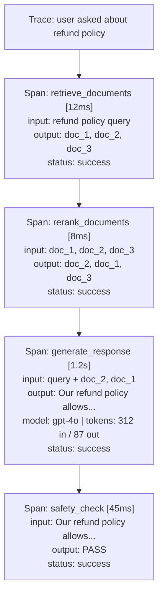
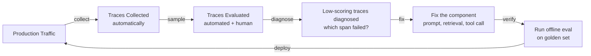

*[Agentic AI Academy](../../README.md) · Section 4 — Multi-Agent Systems · Lesson 4.3*

# Evaluation and Tracing for AI Systems

**Last Updated:** 2026-04-12

> *Traditional tests tell you if your code works. Evaluation tells you if your AI is any good — and those are very different questions with very different answers.*

---

## Learning Outcomes

By the end of this page, you will be able to:

- Explain why AI evaluation is fundamentally different from traditional software testing
- Describe at least five evaluation methods, from manual inspection to LLM-as-judge
- Choose the right evaluation approach for a given stage of development
- Explain what tracing is, why it matters for AI systems, and what a trace captures
- Describe how evaluation and tracing work together in a production AI pipeline
- Identify the most common evaluation mistakes and how to avoid them

---

## 1. Why This Matters (In Our Systems)

Here is a scenario that plays out on almost every AI team, usually around week three of a project.

You build a customer support agent. You test it manually on ten questions — it looks great. You ship it. Two weeks later, your users are complaining. The agent is confidently wrong. It is polite about it, which somehow makes it worse.

You go back to look at the outputs. Some are excellent. Some are subtly off. Some are flat-out wrong in ways that are hard to characterize. You don't know which prompts caused the failures. You don't know if a prompt change you made last Tuesday made things better or worse overall. You don't know if the problem is in the retrieval step, the reasoning step, or the final formatting step.

You are flying blind. And the reason is that you confused "it looked good on my test cases" with "we have evaluated this system."

This is not a small gap. It is the difference between software engineering and AI engineering. Closing it requires a completely different mental model of what "testing" means.

---

## 2. Intuition & Mental Models

### The Spell Checker vs. The Editor

Traditional software testing is like a spell checker. It knows the rules. It checks each word against a dictionary. The answer is binary: correct or incorrect. Fast, cheap, deterministic. Run it a thousand times; get the same answer a thousand times.

AI evaluation is like hiring an editor. The editor reads the whole piece. They consider tone, clarity, accuracy, audience fit, flow. Their assessment involves judgment. Two good editors might score the same piece slightly differently. The assessment takes time. And you trust it precisely *because* it involves judgment — because quality is not reducible to rules.

The mistake most teams make is trying to use a spell checker to do an editor's job. They write `assert output == expected_output` and wonder why their AI system keeps surprising them in production.

### The Flight Data Recorder

Now imagine your AI agent as an aircraft. You care about whether it lands safely (the final output). But when something goes wrong at 3am, "it didn't land" is not enough information to fix anything. You need the flight data recorder — every instrument reading, every decision, every system state, from takeoff to wherever it went wrong.

That is tracing. A trace is the flight data recorder for your agent. It captures every step: which tools were called, what inputs were passed, what each component returned, how long each step took, and where the chain broke. Without it, debugging a multi-step agent failure is archaeology.

Evaluation and tracing are two sides of the same coin: **evaluation tells you *whether* your system is working. Tracing tells you *why* it isn't.**

### The Test Kitchen Analogy

You would never judge a restaurant chef on a single dish, tasted once, in optimal conditions. You run them through a test kitchen — a curated set of recipes across difficulty levels, ingredient constraints, and time pressure — and you score the results systematically.

An **evaluation dataset** is your test kitchen. It is a curated set of inputs with known-good reference outputs, edge cases, adversarial examples, and real-world samples. Your AI system is the chef. The evaluation framework is the scoring rubric.

The quality of your evaluation is almost entirely determined by the quality of your dataset. Garbage in, false confidence out.

---

## 3. Core Concepts & Terminology

**Evaluation (Eval)** — The process of systematically measuring how well an AI system performs on a defined set of inputs, against a defined set of quality criteria. Not a one-time check; a repeatable process.

**Trace** — A complete, structured record of a single execution through an AI system. Captures inputs, outputs, intermediate steps, tool calls, latency, and errors at each stage.

**Span** — One unit within a trace. A trace is made of spans. Each span represents one logical step: "called web search tool", "generated response", "retrieved 5 documents". Think of a trace as a timeline and spans as the events on it.

**Eval Dataset** — A curated collection of test cases: input prompts paired with reference outputs, labels, or scoring criteria. The foundation of any repeatable evaluation.

**Metric** — A quantitative measure used to score output quality. Can be automated (BLEU score, exact match) or human-assigned (relevance rating from 1-5).

**Golden Set** — A small, high-quality subset of your eval dataset where the correct answers are known with high confidence. Used to detect regressions quickly.

**Benchmark** — An eval dataset published publicly, designed to compare systems against each other. Examples: MMLU, HumanEval, TruthfulQA. Useful for positioning but rarely sufficient for production readiness.

**Online Evaluation** — Evaluation that happens in production, on real traffic, in real time. Captures what benchmarks miss: actual user behavior.

**Offline Evaluation** — Evaluation that happens before deployment, on a fixed dataset, in a controlled environment. Faster to run, easier to reason about, but blind to real-world distribution.

**LLM-as-Judge** — Using a language model to evaluate the output of another language model. Scales better than human evaluation but introduces its own biases.

**Trajectory Evaluation** — For agentic systems: evaluating not just the final answer, but every step the agent took to get there. Did it use the right tools? In the right order?

---

## 4. How It Differs from Traditional Testing

This is the section most people need before anything else clicks. The differences are not superficial — they go all the way down.

| Dimension | Traditional Software Testing | AI Evaluation |
|---|---|---|
| Output type | Deterministic — same input always produces same output | Probabilistic — same input can produce different outputs |
| Pass/fail | Binary — it either works or it doesn't | Scored — quality exists on a spectrum |
| Speed | Milliseconds — run thousands in a CI pipeline | Seconds to minutes — each eval may call a model |
| Cost | Essentially free | Real cost per eval run (API calls, human time) |
| What you're checking | Correctness — does the logic do what it says? | Quality — is the output good enough for its purpose? |
| Who scores it | The computer (assertions) | A human, another model, or a heuristic |
| Regression detection | Easy — a test either passes or fails | Hard — scores shift by small amounts; trends matter |
| Coverage | Achievable — enumerate inputs | Impossible — the input space is infinite natural language |

> ⚠️ **Counterintuitive:** Passing all your eval cases does not mean your system is good. It means it is good on the cases you thought to test. The hardest work in AI evaluation is figuring out which cases to include — not running them.

The mental shift required: stop thinking about your AI system as a function with a correct output. Start thinking about it as a product with a quality level. Your job is to measure that quality level reliably, track it over time, and know when it regresses.

---

## 5. The Evaluation Ladder — Simple to Sophisticated

Evaluation is not one thing. It is a progression of methods, each more reliable and more expensive than the last. You build up the ladder as your system matures.

---

### Rung 1: Eyeball Evaluation (Vibe Checks)

You generate some outputs. You read them. They seem fine.

This is where everyone starts, and there is nothing wrong with it — at the right stage.

**When it works:** Day 0–7 of a project. You are exploring the problem space, not optimizing a system.
**Where it breaks:** You cannot read 10,000 outputs. You have cognitive biases. You see what you expect to see. You cannot detect gradual degradation over time.

**The honest version of vibe checks:** Build a small, shared document where your team reviews 20–30 outputs together, once a week, with explicit discussion of what "good" looks like. This forces calibration even without formal metrics.

---

### Rung 2: Rule-Based and Heuristic Checks

Write code that checks properties of the output automatically.

Examples:
- Is the output valid JSON? Does it have all required fields?
- Is the output length within an acceptable range?
- Does the output contain a required keyword or section header?
- Does the output *not* contain forbidden phrases?
- Does the output start with the expected format?

```python
# Simple heuristic eval — does the output contain a summary section?
def check_has_summary(output: str) -> bool:
    return "## Summary" in output or "summary:" in output.lower()

# Does the output respect the length limit?
def check_length(output: str, max_words: int = 300) -> bool:
    return len(output.split()) <= max_words
```

**When it works:** Format compliance, safety filters, structural validation. Fast and cheap to run on every response.
**Where it breaks:** It cannot assess quality, accuracy, or coherence. An output that passes all format checks can still be confidently wrong.

> ⚠️ **Counterintuitive:** Rule-based checks are not real evaluation. They are guardrails. Shipping a system that "passes all format checks" tells you almost nothing about whether users will find it helpful.

---

### Rung 3: Human Evaluation

A human reads the output and scores it.

The most common formats:
- **Binary rating:** Thumbs up / thumbs down
- **Likert scale:** 1–5 rating on one or more dimensions (accuracy, helpfulness, tone)
- **Side-by-side preference:** Given output A and output B, which is better?
- **Error annotation:** Identify and label specific errors (factual, logical, formatting)

**When it works:** Building the ground truth. Calibrating your automated metrics. Catching subtle quality issues that no algorithm catches. Preference eval before/after a model change.
**Where it breaks:** Does not scale. Expensive. Slow. Inter-annotator agreement is hard to achieve. Humans are inconsistent across sessions.

**The practical rule:** Use human evaluation to *build your dataset* and *calibrate your automated metrics*. Use automated metrics to *run at scale and detect regressions*.

---

### Rung 4: Reference-Based Automatic Metrics

You have a set of known-good reference outputs. You measure how similar the model's output is to the reference.

Common metrics:

| Metric | What It Measures | Best For |
|---|---|---|
| Exact Match | Is the output character-for-character identical? | Short factual answers, structured outputs |
| BLEU / ROUGE | N-gram overlap between output and reference | Translation, summarization |
| Semantic Similarity | Embedding-space distance between output and reference | Open-ended answers where phrasing varies |
| F1 (for extraction) | Precision and recall of extracted entities | Named entity recognition, slot filling |

```python
# Semantic similarity using embedding cosine distance
# Pseudocode — library choice is yours
similarity = cosine_similarity(
    embed(model_output),
    embed(reference_output)
)
# Score of 0.85+ is typically "close enough" for open-ended answers
```

**When it works:** Constrained tasks where there is a definite right answer (translation, summarization of a specific document, code generation with test cases).
**Where it breaks:** Open-ended generation. If the model paraphrases perfectly but uses different words, BLEU will penalize it. If the task has no single correct answer, reference-based metrics are misleading.

> ⚠️ **Counterintuitive:** High BLEU score does not mean high quality. It means high similarity to a specific reference. A creative, accurate, well-reasoned answer that uses different phrasing will score lower than a mediocre answer that copies the reference's sentence structure.

---

### Rung 5: LLM-as-Judge

Use a language model to evaluate the output of your system. Give the judge model a rubric, the input, and the output — and ask it to score.

```
System prompt to judge model:
"You are evaluating an AI assistant's response.
Score the following response on a scale of 1-5 for each dimension:
- Accuracy: Is the information factually correct?
- Completeness: Does it address all aspects of the question?
- Clarity: Is it easy to understand?

Input: {user_question}
Response to evaluate: {model_output}

Return your scores as JSON: {"accuracy": N, "completeness": N, "clarity": N}"
```

**When it works:** Open-ended generation tasks where human evaluation is too expensive. Comparative evaluation (is version A better than version B?). Multi-dimensional quality assessment at scale.
**Where it breaks:** The judge model has biases. It tends to prefer longer outputs, its own writing style, and responses that sound confident regardless of accuracy. It can be fooled by well-formatted but factually wrong answers.

**Mitigation strategies:**
- Use a different model family as your judge than the one generating outputs
- Use structured rubrics, not open-ended "is this good?"
- Calibrate your judge against human labels on a sample set
- Always spot-check judge decisions before trusting the scores

> ⚠️ **Counterintuitive:** Using the same model to judge its own outputs is not useless — but it is not trustworthy either. The model will systematically fail to catch its own characteristic failure modes, precisely because those failures look normal to it.

---

### Rung 6: Trajectory Evaluation (Agentic Systems)

For single-turn QA, evaluating the final output is sufficient. For agents that take multiple steps — calling tools, making decisions, delegating subtasks — the final output is only part of the story.

**Trajectory evaluation** assesses the entire execution path:

- Did the agent call the right tools?
- Were the tool call parameters correct?
- Did the agent use the results of one step correctly in the next?
- Did it take the most efficient path, or did it waste steps?
- Did it know when to stop?

```
Example: "Book a flight to Paris on June 12"

Good trajectory:
  Step 1: search_flights(origin="user_city", destination="Paris", date="June 12") ✓
  Step 2: confirm_booking(flight_id="AF123") ✓

Bad trajectory (same final result, bad path):
  Step 1: search_hotels(destination="Paris") ✗ (wrong tool first)
  Step 2: search_flights(...) ✓
  Step 3: confirm_booking(...) ✓
```

Both might produce a valid booking. But the second agent's reasoning is wrong — and that wrong reasoning will cause failures on harder tasks.

**Trajectory evaluation metrics:**
- **Step accuracy** — What fraction of steps were correct?
- **Tool selection accuracy** — Did the agent choose the right tool at each step?
- **Efficiency** — How many unnecessary steps were taken?
- **Recovery rate** — When the agent made a wrong step, did it self-correct?

---

## 6. Tracing — The Flight Recorder for Agents

You cannot evaluate what you cannot observe. Tracing is the infrastructure that makes evaluation possible for complex systems.

### What a Trace Captures

A trace is a structured record of one complete execution. It is made up of **spans** — one span per logical step.



### What You Learn from Traces

- **Which step is slow?** Latency breakdown per span.
- **Which step is failing?** Error attribution to the exact component.
- **What data was retrieved?** See the exact documents that fed the model.
- **What did the model actually receive?** The full assembled prompt, not just the user query.
- **How did costs accumulate?** Token usage per span, per request, per user.

### Traces Enable Evaluation

Traces are not just for debugging. They are the raw material for evaluation:

- Sample 100 traces from production. Run your evaluators on them. Find patterns.
- Compare traces from version A and version B. Which retrieval step returns better documents?
- Flag traces where the safety check returned WARN — send those to human review.
- Build your eval dataset by sampling real traces and labeling them.

**The feedback loop:**



This loop is the operational rhythm of a healthy AI system.

---

## 7. Building Your Evaluation Stack — Layer by Layer

### Stage 1: Early Development

- Manual vibe checks on 20–50 examples
- A shared doc or spreadsheet with team ratings
- Basic format/structure heuristics in code

**Goal:** Understand what "good" looks like before you try to measure it.

### Stage 2: Pre-Launch

- Curated eval dataset of 100–500 cases covering core use cases, edge cases, and known failure modes
- Mix of rule-based checks + semantic similarity + LLM-as-judge
- Baseline scores established before any changes go out

**Goal:** Know where you stand before you ship.

### Stage 3: Post-Launch

- Tracing enabled on all production traffic
- Online eval running on a sampled percentage of real requests
- Weekly human review of flagged traces
- Regression alerts when scores drop below threshold

**Goal:** Know immediately when something degrades.

### Stage 4: Continuous Improvement

- Eval in CI/CD — every PR runs the eval suite before merge
- A/B evaluation of prompt or model changes
- Eval dataset grows continuously as new failure patterns emerge from production
- Red-teaming: adversarial inputs specifically designed to break the system

**Goal:** Make quality a property of your development process, not an afterthought.

---

## 8. Worked Example — Evaluating a Document Q&A Agent

**System:** An agent that answers questions based on a company's internal document library.

**Step 1: Define what "good" looks like**

Before writing a single eval, answer: what does a perfect response look like? For this system:
- Factually grounded in the source documents (no hallucination)
- Cites the relevant document
- Answers the actual question asked (not a related one)
- Appropriate length — thorough but not padded

**Step 2: Build the eval dataset**

Curate 200 question-answer pairs:
- 100 from real user queries (sampled from logs)
- 50 from edge cases (ambiguous questions, questions the docs don't answer)
- 50 adversarial cases (questions designed to make the agent hallucinate)

**Step 3: Select metrics**

| Dimension | Method | Why |
|---|---|---|
| Groundedness | LLM-as-judge with rubric | "Is every claim in the answer supported by the cited document?" |
| Citation accuracy | Rule-based | Does the cited document actually exist? Does it contain the answer? |
| Answer relevance | LLM-as-judge | Does the answer address what was asked? |
| Refusal appropriateness | Human review | When the docs don't contain an answer, does the agent say so? |

**Step 4: Enable tracing**

Instrument the retrieval step and generation step as separate spans. When groundedness scores are low, look at the retrieval span first — the problem is often there, not in the generation.

**Step 5: Establish a baseline, then iterate**

Run the full eval suite before any changes. Record the scores. Every subsequent change is measured against this baseline. A prompt change that improves groundedness by 4% but drops relevance by 8% is not a win.

---

## 9. Common Pitfalls & Misconceptions

**"We tested it manually and it works."** The reality: manual testing on examples you chose is selection bias. You unconsciously pick the cases your system handles well. A real eval dataset is built to find failures, not confirm successes.

**"Our eval dataset is our test set from development."** The reality: if you built your system while looking at those examples, you have overfit your judgment to them. Reserve a holdout set that nobody touches until evaluation day.

**"We use LLM-as-judge, so eval is fully automated and objective."** The reality: LLM judges are biased, inconsistent across runs, and systematically blind to certain failure modes. They are powerful but require calibration against human labels and regular audits.

**"We have tracing, so we have observability."** The reality: collecting traces is the easy part. Having a process to review them, sample them, and act on them is the hard part. Traces that nobody reads are just expensive storage.

**"Evaluation is a one-time gate before launch."** The reality: your eval dataset goes stale the moment real users start using your system in ways you didn't anticipate. Evaluation is a continuous process, not a launch checklist.

**"Better model = better scores."** The reality: switching to a more capable model can break your system in unexpected ways. Always run your full eval suite after any model change, even "upgrades."

---

## 10. Trade-offs at Scale

| Evaluation Method | Cost | Speed | Reliability | Best Stage |
|---|---|---|---|---|
| Manual vibe checks | Low cost, high human time | Fast per session | Low | Early development |
| Rule-based heuristics | Very low | Very fast | High for what they check | All stages |
| Human evaluation | High | Slow | High | Dataset building, calibration |
| Reference-based metrics | Low | Fast | Medium (task-dependent) | Constrained output tasks |
| LLM-as-judge | Medium (API cost) | Medium | Medium (requires calibration) | Scale evaluation |
| Trajectory evaluation | High | Slow | High for agentic systems | Agentic systems |
| Online production eval | Infrastructure cost | Continuous | High (real distribution) | Post-launch |

**The honest trade-off:** Cheap evals are fast but unreliable. Reliable evals are expensive and slow. Production systems need both — cheap evals for fast iteration, reliable evals for confidence before major changes.

---

## 11. Self-Check Questions

1. Your LLM-as-judge evaluator gives your new prompt variant a score of 4.2/5, up from 3.9. Your teammate says "ship it." What questions do you ask before agreeing?

2. You have a RAG-based agent that sometimes gives confidently wrong answers. Your eval scores look fine. Where is the most likely gap in your evaluation setup?

3. A trace shows that your agent's final answer is correct, but it called the wrong tool three times before arriving there. Is this a problem? What does it tell you about your eval setup?

4. You are about to upgrade your underlying model from version A to version B. Your team says "it's a better model, no need to re-run evals." What is the argument against this?

5. Your eval dataset was built six months ago. Your system has been in production since then. Why might your eval scores no longer be a reliable signal of real-world quality?

---

## 12. What to Learn Next

- **Prompt Engineering and Regression Testing** — Every prompt change is a potential regression. Learning how to version prompts and run differential evals between versions is the practical extension of everything on this page.
- **Observability for Agentic Systems** — Tracing at the span level is the foundation; learning how to aggregate traces into dashboards, set alerting thresholds, and build debugging workflows is the operational layer on top.
- **Red-Teaming and Adversarial Evaluation** — Standard evals check whether your system is good. Red-teaming checks whether it can be broken. A system that scores well on your dataset but fails on adversarial inputs is a liability.
- **Data Flywheels and Continuous Improvement** — The most durable eval systems feed production failures back into the eval dataset automatically, creating a loop where the system gets harder to fool over time. This is where evaluation becomes a competitive advantage.

---

## References

### Core References

- [Anthropic: Evaluating AI Systems](https://www.anthropic.com/research) — evaluation philosophy and methodology from the team that builds Claude
- [OpenAI Evals Framework](https://github.com/openai/evals) — open-source framework for evaluating LLM outputs; useful both as a tool and as a reference for how to structure eval datasets
- [RAGAS](https://docs.ragas.io) — open-source framework specifically for evaluating RAG pipelines; covers groundedness, answer relevance, and context recall
- [OpenTelemetry Specification](https://opentelemetry.io/docs/) — the open standard for distributed tracing; the conceptual model (traces, spans, attributes) applies directly to AI system instrumentation

### Supplementary Reading

- *"Evaluating Large Language Models: A Survey"* — Guo et al., 2023 (arXiv); most important insight: no single metric captures overall quality — every metric is a proxy for something you actually care about, and proxies have failure modes
- Hamel Husain's writing on LLM evaluation (hamel.dev) — the most practically grounded engineering perspective on building eval pipelines; key insight: start with your failure modes, not your metrics
- *Chip Huyen — Designing Machine Learning Systems*, Chapter 6 (Model Evaluation) — the best book-length treatment of eval as an engineering discipline, covering dataset construction, metric selection, and production monitoring together

---

## Summary

AI evaluation is not testing — it is the systematic, repeatable measurement of quality across a spectrum, not a binary pass/fail check. The evaluation ladder runs from manual vibe checks through rule-based heuristics, human rating, reference-based metrics, LLM-as-judge, and trajectory evaluation for agentic systems — each rung more reliable and more expensive than the last. Tracing is the infrastructure that makes evaluation actionable: it records every step of every execution so you can diagnose *why* a score is low, not just *that* it is. Together, evaluation and tracing form the feedback loop that separates AI systems that improve from those that quietly degrade. The most important lesson: eval is not a gate before launch — it is a continuous practice that grows with your system.

---

## Self-Assessment Checklist

- [ ] I can explain the difference between AI evaluation and traditional testing to a skeptical engineer
- [ ] I can pick the right evaluation method for a given task and development stage
- [ ] I can describe what a trace captures and why it matters for debugging
- [ ] I know the failure modes of LLM-as-judge and how to mitigate them
- [ ] I know what I would read next to go deeper

---

## Suggested Next Pages

- [[Multi-Agent Architecture Patterns]] — *evaluation and tracing become significantly more complex in multi-agent systems; knowing the patterns helps you know where to instrument*
- [[Agent Communication Protocols]] — *understanding how agents communicate is prerequisite to tracing those communications — you can only log what you understand*
- [[Prompt Engineering and Regression Testing]] — *every prompt is a hypothesis; evaluation is how you test it; regression testing is how you make sure you don't accidentally break what's already working*
- [[Red-Teaming and Adversarial Evaluation]] — *standard evals find the failures you anticipated; red-teaming finds the ones you didn't — and those are usually the ones that matter in production*

---

← [4.2 — Agent Communication Protocols](<4.2-Agent-Communication-protocols.md>) &nbsp;|&nbsp; [4.4 — Reliability Patterns →](<4.4 Reliability Patterns.md>)
