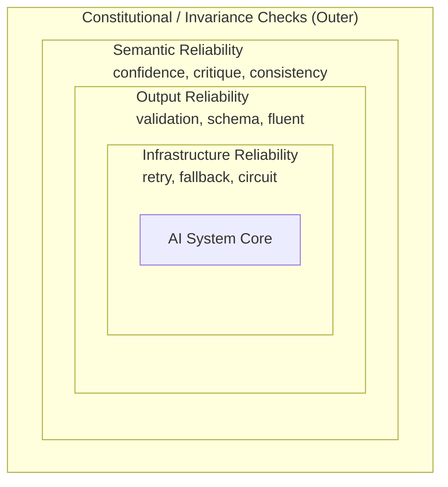
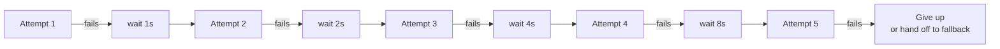
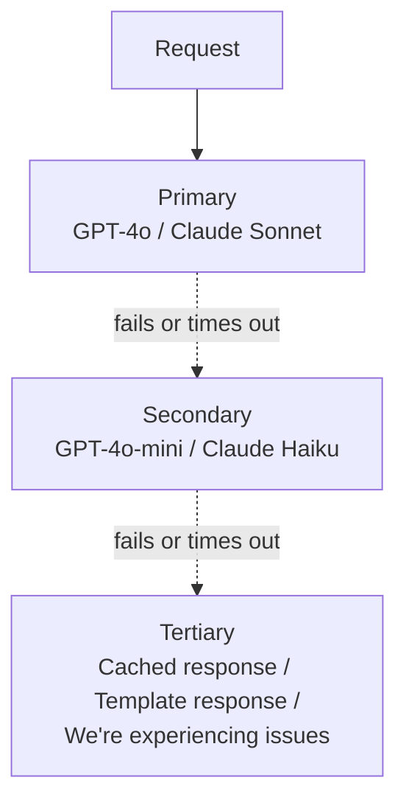
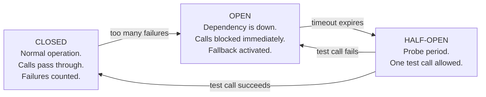
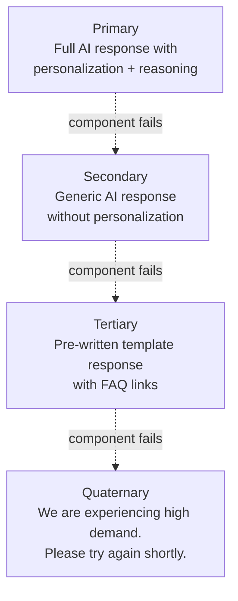

*[Agentic AI Academy](../../README.md) · Section 4 — Multi-Agent Systems · Lesson 4.4*

# Reliability Patterns for AI Systems

**Last Updated:** 2026-04-12

> *An AI system that usually works correctly is not a reliable system — it is a liability with good days.*

---

## Learning Outcomes

By the end of this page, you will be able to:

- Explain why reliability in AI systems is fundamentally different from reliability in traditional software
- Describe and implement exponential backoff, fallback models, circuit breakers, and timeout strategies
- Apply output validation, fluent validation, and schema enforcement to guard against malformed responses
- Design self-critique loops and confidence threshold gates to catch semantic failures
- Explain advanced patterns: ensemble voting, consistency probing, speculative execution, and constitutional guardrails
- Compose multiple reliability patterns into a layered defense strategy for a production AI system

---

## 1. Why This Matters (In Our Systems)

Here is the subtle and dangerous thing about AI systems: they fail politely.

A traditional server that crashes gives you a 500 error. You know immediately. Something is broken. An AI model that hallucinates gives you a confident, fluent, well-formatted answer that happens to be completely wrong. No error. No stack trace. Just a user who now has bad information, a wrong decision made, or a transaction executed on false premises.

This is the core reliability problem in AI engineering. The system does not know when it does not know. And if you have not built explicit reliability mechanisms into your system, neither do you.

Consider what goes wrong in a production AI system on an ordinary Tuesday:
- The model API returns a 429 (rate limit) at peak load. Your system crashes.
- The model returns valid JSON but with a negative price field. Your cart processes it.
- The summarization agent returns a confident summary of a document it did not actually retrieve. Your analyst acts on it.
- The classification model returns "high confidence: Category A" — but the score was never checked; it is below your minimum threshold.
- Your primary model is down. Your system has no fallback. Users get a blank screen.

Each of these is a different class of failure. Each requires a different pattern to prevent it. This page is the map.

---

## 2. Intuition & Mental Models

### The Airliner vs. The Race Car

A race car is built to be fast. Reliability is secondary. If it breaks, the driver pulls over.

A commercial airliner is built to be safe. It has redundant engines, redundant hydraulics, redundant navigation, automated failure detection, and a trained crew with checklists for every failure mode. No single point of failure can bring it down.

Your AI system in production is a commercial airliner, not a race car. The question is not "does it work under ideal conditions?" The question is "what happens when the primary model is slow, returns garbage, is confidently wrong, or is unavailable entirely?" If the answer to any of those is "the system fails," you have a race car.

Reliability patterns are your redundant systems, your checklists, your failure detection. They are not afterthoughts. They are the engineering.

### The Layers of Trust

Think of reliability patterns as concentric rings around your AI system — each ring catching a different class of failure:



Each ring assumes the inner rings may fail. No single pattern is enough. The goal is defense in depth — multiple independent mechanisms, each catching what the others miss.

---

## 3. Core Concepts & Terminology

**Reliability** — The probability that a system produces a correct, useful, safe output across the full range of inputs it will encounter in production. Not just "does it work on my test cases."

**Failure Mode** — A specific way a system can break. AI systems have failure modes that traditional software does not: hallucination, format drift, semantic errors, stochastic inconsistency.

**Deterministic Failure** — A failure you can reproduce reliably. Traditional software is full of these.

**Stochastic Failure** — A failure that occurs probabilistically — the same input sometimes works, sometimes does not. AI systems are inherently stochastic.

**Graceful Degradation** — When a system cannot perform its primary function, it falls back to a reduced but still useful mode rather than failing completely.

**Defense in Depth** — Multiple independent reliability mechanisms layered on top of each other, so that failure of any one does not cause total system failure.

**Idempotency** — A retry-safe operation: calling it once or ten times produces the same result. Critical for safe retry logic.

---

## 4. The Reliability Ladder — Layer by Layer

---

### Layer 1: Infrastructure Reliability

These patterns protect against the system being unavailable or unresponsive. They do not care about the quality of the response — only that one arrives.

---

#### Pattern 1: Retry with Exponential Backoff

Have you ever knocked on a door with no answer, waited a moment, then knocked again? And if still no answer, waited a bit longer before trying once more?

That is exponential backoff. When a request fails (network error, rate limit, temporary unavailability), you wait before retrying — and each successive wait is longer than the last.

**Why exponential?** If a server is overloaded and a thousand clients all retry immediately and simultaneously, you make the problem worse. Spreading out retries gives the server time to recover.



**Jitter** — Add a small random amount to each wait time. If all clients start simultaneously, even exponential backoff becomes synchronized without jitter.

```python
# Pseudocode — technology-agnostic concept
def wait_time(attempt: int, base: float = 1.0, max_wait: float = 60.0) -> float:
    exponential = base * (2 ** attempt)
    jitter = random.uniform(0, 1)               # randomizes the wait
    return min(exponential + jitter, max_wait)  # caps at max_wait seconds
```

**Retry only what is safe to retry.** Reads and idempotent writes are safe. Non-idempotent writes (e.g., "send this email") are not — retrying them causes duplicates.

**When to use it:** Any external API call — model providers, search APIs, database calls.
**Enabling tech:** `tenacity` (Python), `retry` (Node.js), built-in retry in most cloud SDK clients.

---

#### Pattern 2: Timeout Management

Every external call your system makes should have a maximum time it is allowed to wait. Without timeouts, one slow dependency can freeze your entire system.

Three timeout levels matter in AI systems:

| Timeout Type | What It Guards | Typical Range |
|---|---|---|
| Connection timeout | How long to wait to establish the connection | 2–5 seconds |
| Request timeout | How long to wait for the first byte of response | 10–30 seconds |
| Total timeout | Hard ceiling on the entire operation, including retries | 30–120 seconds |

LLM calls are slow by nature — streaming responses can take 30+ seconds for long outputs. Set timeouts that are tight enough to protect your system but loose enough not to kill legitimate long responses.

> ⚠️ **Counterintuitive:** A missing timeout is not a safe default — it is an invisible bug. It only surfaces under load, when a slow dependency causes your thread pool to exhaust and your entire system becomes unresponsive. This is one of the most common causes of cascading failures.

---

#### Pattern 3: Fallback Models

When your primary model is unavailable, too slow, or too expensive for the current request, route to a fallback.



**Fallback hierarchy design principles:**
- Each level should be cheaper, faster, and less capable than the one above it
- Define clearly what requests are eligible for fallback vs. must succeed on primary
- Log every fallback invocation — if your system is constantly falling back, that is a signal, not a feature

**Model fallback is not just about availability.** You can also route based on task complexity: simple queries go to fast, cheap models; complex reasoning goes to capable, expensive ones. This is sometimes called **model routing** or **cascading inference**.

**Real-world example:** Klarna's AI system routes support queries by complexity — simple balance inquiries go to a fast small model; nuanced dispute resolution goes to a larger model. Cost drops significantly with no user-visible quality difference.

---

#### Pattern 4: Circuit Breaker

Named after the electrical device in your home's fuse box. When something draws too much current, the breaker trips — cutting power to prevent a fire. You reset it manually once the problem is fixed.

In software: when a dependency is failing repeatedly, stop calling it for a period of time. This prevents wasted calls, allows the dependency to recover, and keeps your own system responsive.



**When the circuit opens:** You need a fallback ready. The circuit breaker alone is not reliability — it just stops making things worse.

**Enabling tech:** `pybreaker` (Python), `opossum` (Node.js), `Resilience4j` (Java), built into service meshes like Istio.

---

### Layer 2: Output Reliability

These patterns protect against the model returning a response that your system cannot use — malformed, missing fields, wrong type, or structurally invalid.

---

#### Pattern 5: Schema Validation

AI models are asked to return structured output — JSON, XML, a list, a number. They do not always comply. Schema validation checks the structure before your system acts on it.

```json
// Expected output schema
{
  "sentiment": "positive" | "negative" | "neutral",
  "confidence": number (0-1),
  "summary": string (max 200 chars)
}

// What the model returned
{
  "sentiment": "mostly positive",     ← not a valid enum value
  "confidence": "high",              ← string, not number
  "summary": "<very long text...>"   ← exceeds max length
}
```

Schema validation catches these before they reach your business logic.

**Structured output forcing** — Most modern model APIs support a mode where the model is constrained to output valid JSON matching a provided schema. The model is more likely to comply when the API enforces it rather than relying on prompt instructions alone.

**Enabling tech:** JSON Schema (universal), Pydantic (Python), Zod (TypeScript/JavaScript).

---

#### Pattern 6: Fluent Validation

Schema validation checks structure. Fluent validation checks *meaning within structure*. It is the difference between a spell checker and a proofreader.

A field can be structurally valid and semantically wrong:

```python
# Schema valid but semantically wrong
{
  "price": -49.99,           # valid number, impossible price
  "discount_percent": 150,   # valid number, impossible discount
  "delivery_date": "1995-01-01",  # valid date, impossible future delivery
  "email": "not_an_email",   # valid string, invalid email format
}
```

Fluent validation is a chain of readable, composable rules that verify the *business logic* of the output:

```python
# Pseudocode — illustrating the concept
validator = (
    OutputValidator()
    .field("price").must_be_positive()
    .field("discount_percent").must_be_between(0, 100)
    .field("delivery_date").must_be_in_future()
    .field("email").must_match_pattern(EMAIL_REGEX)
)

result = validator.validate(model_output)
if not result.is_valid:
    trigger_retry_or_fallback(result.errors)
```

The "fluent" part means the rules read like sentences. This is intentional — it makes the validation logic self-documenting and reviewable by non-engineers.

**Enabling tech:** FluentValidation (.NET, with ports for other languages), Pydantic validators (Python), Joi (Node.js), custom rule chains in any language.

---

#### Pattern 7: Retry-on-Invalid

When validation fails, do not immediately surface the error to the user. Instead, retry the model call — often with the validation error included in the prompt so the model can self-correct.

```
Attempt 1: model returns invalid output
Validation: fails — "price field is negative"

Attempt 2 prompt: 
  "<original prompt>
   Previous attempt returned: {failed_output}
   Validation error: price must be a positive number.
   Please correct and return valid output."

Attempt 2: model returns corrected output
Validation: passes
```

This pattern is surprisingly effective. Most structural failures are recoverable when the model is shown its own mistake and given a second chance.

**Cap your retries.** Three attempts is usually sufficient. Beyond that, the model is likely confused at a deeper level and retrying will not help.

---

### Layer 3: Semantic Reliability

These patterns protect against outputs that are structurally valid but semantically wrong — correct format, wrong meaning. This is the hardest class of failure to catch automatically.

---

#### Pattern 8: Confidence Thresholds

Think of a doctor who says: "I am 60% sure it is a sprain, but before I send you home I want an X-ray." They have an internal threshold — below it, they do not act on their first instinct alone.

Confidence thresholds work the same way. When a model's confidence in its output falls below a defined threshold, the system does not act on it — it escalates, asks for clarification, falls back, or routes to a human.

```
Model output:
{
  "classification": "fraud",
  "confidence": 0.61
}

Threshold rule:
  confidence >= 0.85 → auto-action (flag transaction)
  confidence >= 0.60 → human review queue
  confidence < 0.60  → reject and request re-evaluation
```

**The threshold is a product decision, not just a technical one.** Setting it too high means too many escalations; too low means acting on uncertain outputs. The right threshold depends on the cost of a false positive vs. a false negative in your specific domain.

> ⚠️ **Counterintuitive:** Model-reported confidence scores are not well-calibrated probabilities. A model that says "confidence: 0.95" does not mean it is right 95% of the time on that class of input. Treat confidence scores as relative signals, not absolute probabilities. Calibrate them against real labeled data before trusting them for threshold decisions.

---

#### Pattern 9: Self-Critique Loops

Have you ever written an email, re-read it imagining you are the recipient, and then changed it? That is self-critique. You evaluated your own output from a different perspective.

A self-critique loop asks the model to evaluate its own output against a rubric before that output leaves the system.

```
Step 1: Generate
  Prompt: "Summarize this legal contract in plain English for a non-lawyer."
  Output: [draft summary]

Step 2: Critique (same or different model, different system prompt)
  Prompt: "Review this summary of a legal contract.
           Check: Is any claim inaccurate? Is any critical clause omitted?
           Is the language genuinely plain English or does it use legal terms?
           Return: {issues: [...], approved: true/false}"

Step 3: Revise (if not approved)
  Prompt: "Revise the summary to address these issues: {issues}"

Step 4: Final output
```

**What makes a good critique prompt:**
- Specific rubric — not "is this good?" but "does it satisfy criterion A, B, C?"
- A structured output from the critic (issues list, approval flag)
- A hard iteration cap (usually 2–3 rounds)

**When to use a different model as the critic:** When the primary model has systematic blind spots — a different model family is less likely to make the same mistakes.

---

#### Pattern 10: Consistency Probing

Ask the same question in multiple different ways. If a reliable system knows the answer, it should give consistent answers regardless of phrasing. If the answers diverge significantly, the system is guessing.

```
Question variants:
  "What is the capital of Australia?"
  "Which city serves as Australia's capital?"
  "Name the Australian capital city."

Consistent (good signal): "Canberra" × 3
Inconsistent (bad signal): "Canberra", "Sydney", "Canberra"
```

**This pattern is especially powerful for:**
- Factual claims that will be acted upon
- Medical, legal, or financial information
- Any answer where confident-sounding wrong answers are costly

**Implementation:** Run 3–5 paraphrased variants, compare answers with semantic similarity. If agreement is low, flag for human review or withhold the answer entirely.

> ⚠️ **Counterintuitive:** A model can give inconsistent answers not because it is "confused" but because its training data contained conflicting information and it is sensitive to which framing activates which memory. Consistency probing surfaces this instability before it reaches users.

---

### Layer 4: System-Level Reliability

These patterns operate at the system level — across multiple model calls, multiple agents, or the overall output of a pipeline.

---

#### Pattern 11: Ensemble Voting

Do not ask one model. Ask several. Take the majority answer.

```
Question: "Is this customer review positive or negative?"

Model A: Positive
Model B: Positive
Model C: Negative

Vote: Positive (2/3 majority)
```

**Variants:**
- **Majority vote** — Most common answer wins. Good for categorical outputs.
- **Weighted vote** — Models with better calibration on this task type get more weight.
- **Unanimous requirement** — All models must agree, or the output is flagged as uncertain. Good for high-stakes decisions.

**When to use it:** High-stakes classification, ambiguous inputs, safety-critical decisions.
**When not to use it:** Cost-sensitive applications — you are paying for N model calls per request. The reliability gain must justify the cost.

---

#### Pattern 12: Speculative Execution

Start generating a response with a fast, cheap model immediately. In parallel, send the same request to a slow, capable model. When the better model finishes, compare its output to the fast model's. If they agree, you have already delivered the answer. If they diverge, use the better model's output.

```
t=0ms:  Fast model starts      → Capable model starts (parallel)
t=200ms: Fast model returns   → system delivers tentatively
t=1500ms: Capable model returns → compare outputs
           agree: confirm delivery
           disagree: update response with capable model's output
```

This is borrowed directly from CPU architecture — processors speculatively execute the branch they think is most likely, then confirm or roll back.

**Real-world relevance:** This pattern is behind streaming responses in AI assistants. You see words immediately (speculative, cheap generation) while heavier processing continues in the background.

---

#### Pattern 13: Graceful Degradation Cascade

Design every feature of your system to have a degraded-but-functional mode. When a component fails, step down to the next level of capability — never to zero.



The user always gets something. The something degrades gracefully. This is what separates mature AI products from fragile demos.

---

### Layer 5: Niche and Advanced Patterns

---

#### Pattern 14: Constitutional Guardrails (Inline Policy Enforcement)

Instead of checking output after generation, embed policy rules directly into the generation process. The model is given a set of principles — a "constitution" — and instructed to check its own output against them before responding.

```
System prompt addition:
"Before returning your response, verify it against these rules:
1. No personally identifiable information in the output
2. All monetary figures must include a currency code
3. No definitive medical diagnoses — only observations
4. Any claim of fact must be followed by the source document it came from

If your response violates any rule, rewrite it before responding."
```

This shifts the reliability check from post-generation validation into the generation itself. More efficient than a separate critique pass; less reliable than a separate critic model.

**Best for:** Style guides, safety rules, format consistency requirements, regulatory compliance checklists.

---

#### Pattern 15: Semantic Invariance Testing

A production reliability pattern borrowed from property-based testing. Instead of testing specific inputs, test properties that should hold across all inputs.

For AI systems: certain semantic transformations of the input should not change the output.

```
Invariant: Negating a sentiment question should invert the answer.
  Input A: "Is this review positive?" → Answer: "Yes"
  Input B: "Is this review negative?" → Answer: "No"
  If both answers are "Yes" → invariance violated → output is unreliable

Invariant: Adding irrelevant information should not change a factual answer.
  Input A: "What is the boiling point of water?"
  Input B: "The sky is blue. What is the boiling point of water?"
  If answers differ → model is distracted by irrelevant context → flag
```

Run these invariance checks in your eval pipeline and on sampled production traffic. They catch subtle prompt sensitivity and reasoning instability before users do.

---

#### Pattern 16: Uncertainty Quantification via Temperature Sampling

Instead of running inference once, run it multiple times with non-zero temperature (which introduces randomness into model outputs). Measure the variance of the outputs.

High variance = the model is uncertain. It is not settled on an answer.
Low variance = the model is confident. Its outputs are stable.

```python
# Pseudocode
outputs = [model.generate(prompt, temperature=0.7) for _ in range(10)]
answers = [extract_answer(o) for o in outputs]

# What fraction of runs gave the same answer?
most_common = Counter(answers).most_common(1)[0]
agreement_rate = most_common[1] / len(outputs)

if agreement_rate < 0.7:
    # Less than 70% agreement → high uncertainty → flag or escalate
    flag_for_review(prompt, outputs)
else:
    return most_common[0]  # Return the majority answer
```

This is conceptually related to ensemble voting but uses a single model with temperature sampling rather than multiple different models.

> ⚠️ **Counterintuitive:** Temperature 0 (deterministic) does not mean the model knows the answer. It means it always gives the same answer — which could be consistently wrong. Sampling with temperature > 0 reveals the underlying uncertainty the deterministic mode was hiding.

---

## 5. Worked Example — Reliable Financial Data Extraction

**System:** An AI agent that reads earnings call transcripts and extracts key financial figures (revenue, guidance, EPS) for an investment research platform.

**The stakes:** Wrong numbers mean bad investment decisions. Confident wrong numbers are worse than no numbers.

**Step 1 — Infrastructure reliability**
- Exponential backoff on the model API (max 3 retries, 60s cap)
- 45-second total timeout per document
- Fallback to a secondary model provider if primary is down
- Circuit breaker trips after 5 consecutive failures

**Step 2 — Output reliability**
- Schema validation: output must be JSON with required fields (`revenue_usd`, `eps`, `guidance_range`, `source_quote`)
- Fluent validation: all monetary values must be positive; guidance range must have lower ≤ upper; EPS must be a number
- Retry-on-invalid: if validation fails, retry with error message appended (max 2 retries)

**Step 3 — Semantic reliability**
- Confidence threshold: only publish figures with confidence ≥ 0.88; below that, route to analyst review queue
- Self-critique loop: a critic model checks that each figure is supported by the `source_quote` field — if the quote does not contain the number, flag as ungrounded
- Consistency probe: ask the model to extract the same figure from three different passages of the transcript; if all three agree, publish; if they diverge, flag

**Step 4 — System reliability**
- Graceful degradation: if extraction fails after all retries, publish a placeholder card ("Extraction pending analyst review") rather than an empty page
- Semantic invariance check (weekly, on sampled data): verify that rephrasing the extraction prompt does not meaningfully change extracted figures

**Result:** A system where every number that reaches a user has passed infrastructure checks, format checks, business rule checks, confidence checks, grounding verification, and consistency verification. The system fails loudly when uncertain instead of silently when wrong.

---

## 6. Practical Usage & Decision Guidance

| Situation | Pattern to Apply |
|---|---|
| Model API returns 429 or 503 | Exponential backoff with jitter |
| Dependency is down repeatedly | Circuit breaker |
| Primary model too slow under load | Fallback model |
| Model returns malformed JSON | Schema validation + retry-on-invalid |
| Output violates business rules | Fluent validation |
| High-stakes decision, model may be wrong | Confidence threshold + human review queue |
| Output quality is critical | Self-critique loop |
| Factual claim with real consequences | Consistency probing |
| Need faster perceived response time | Speculative execution |
| Categorical output, stakes are high | Ensemble voting |
| System component fails | Graceful degradation cascade |
| Need to embed compliance rules | Constitutional guardrails |
| Model seems sensitive to phrasing | Semantic invariance testing |
| Need to measure model uncertainty | Temperature sampling + variance measurement |

**The default stack for any new production AI feature:**

1. Exponential backoff + timeout on all external calls
2. Schema validation on all structured outputs
3. Fluent validation on all business-critical fields
4. Confidence threshold with a defined escalation path
5. Graceful degradation for every failure mode

Add self-critique, consistency probing, and ensemble patterns as the stakes of the feature increase.

---

## 7. Common Pitfalls & Misconceptions

**"We have retries, so we're reliable."** Retries handle transient infrastructure failures. They do nothing for semantic failures — a model that gives a wrong answer will give it consistently across all retries. Infrastructure reliability and output reliability are different problems.

**"The model said it's confident."** Confidence scores from language models are not calibrated probabilities. A model that says "confidence: 0.95" is telling you its internal state, not a statistically validated accuracy rate. Always calibrate confidence scores against real outcomes before using them to gate decisions.

**"We validated the schema, so the output is correct."** Schema validation checks structure. A perfectly schema-valid response can still be factually wrong, dangerously incomplete, or semantically nonsensical. Structure and meaning are different properties.

**"Self-critique always improves output."** Sometimes the critic and the generator share the same blind spot — especially if they are the same model. A self-critique loop that uses identical context catches formatting issues well but misses systematic reasoning errors. Use a different model or a different context window for meaningful critique.

**"More retries = more reliability."** Beyond 2–3 retries, you are usually not recovering — you are delaying failure. Excessive retries cause cascading load on dependencies that are already struggling. Hard caps exist for a reason.

**"Circuit breakers are for microservices, not AI systems."** Model APIs go down. Rate limits get hit. Regional outages happen. A circuit breaker in front of every external model call is not over-engineering — it is basic production hygiene.

---

## 8. Trade-offs, Scale, and Edge Cases

| Pattern | Latency Impact | Cost Impact | Reliability Gain | Complexity |
|---|---|---|---|---|
| Exponential Backoff | Medium (retries add time) | Low | High (infrastructure) | Low |
| Fallback Models | Low | Medium (two providers) | High | Low |
| Circuit Breaker | None (fast fail) | None | High | Medium |
| Schema Validation | None | None | Medium | Low |
| Fluent Validation | None | None | Medium-High | Medium |
| Retry-on-Invalid | Medium | Medium (retry calls) | High | Low |
| Confidence Threshold | None | None | Medium | Low |
| Self-Critique Loop | High (2× calls) | High (2× cost) | High | Medium |
| Consistency Probing | Very High (N× calls) | Very High | Very High | Medium |
| Ensemble Voting | High (N× calls) | Very High | Very High | Medium |
| Speculative Execution | Low (parallel) | Medium | Medium | High |
| Constitutional Guardrails | Low | None | Medium | Low |
| Semantic Invariance | Offline only | Medium | High (testing) | Medium |
| Temperature Sampling | High (N× calls) | High | High (uncertainty signal) | Medium |

**The honest trade-off:** Every reliability pattern costs something — latency, money, or complexity. The patterns you apply should be proportional to the cost of failure in your domain. A typo in a social media caption is a different cost than a wrong figure in an investment report.

---

## 9. Self-Check Questions

1. Your AI system has exponential backoff configured and schema validation in place. During a production incident, you discover it has been outputting confidently wrong answers for three days without any alerts firing. Which layer of the reliability stack was missing, and what pattern would have caught this?

2. You are designing a medical triage assistant that classifies symptom descriptions as urgent, moderate, or low priority. What combination of reliability patterns would you apply, and why does each one earn its place?

3. A teammate argues that a self-critique loop is redundant: "If the model got it wrong the first time, why would it get it right when reviewing its own answer?" How do you respond?

4. Your ensemble of three models votes 2-1 on a classification. The dissenting model is the most capable one. How do you handle this, and what does it tell you about the reliability of your system?

5. You add a confidence threshold gate to your system — any output with confidence below 0.80 goes to human review. After a week, 60% of outputs are being routed to human review. What are the two most likely causes, and how do you investigate each?

---

## 10. What to Learn Next

- **Evaluation and Tracing** — Reliability patterns prevent failures; evaluation and tracing tell you how often failures are occurring and where. The two disciplines are inseparable in production.
- **Prompt Engineering and Regression Testing** — Many reliability failures originate at the prompt level. Understanding how to write defensive prompts and test them for regression is the most cost-effective reliability investment.
- **Agent Memory and State Management** — In multi-step agentic systems, reliability failures compound across steps. Understanding how state is managed, corrupted, and recovered is the next frontier of reliability engineering.
- **Red-Teaming and Adversarial Robustness** — Standard reliability patterns protect against accidental failures. Red-teaming protects against intentional ones — users or attackers deliberately probing your system's failure modes.

---

## References

### Core References

- [Anthropic: Building Reliable AI Systems](https://www.anthropic.com/research) — Anthropic's published work on constitutional AI, self-critique, and output reliability
- [Google SRE Book — Chapter 3: Embracing Risk](https://sre.google/sre-book/embracing-risk/) — the foundational text on reliability engineering; the concepts transfer directly to AI systems even though it predates them
- [Netflix Tech Blog: Hystrix Circuit Breaker](https://netflixtechstack.medium.com/fault-tolerance-in-a-high-volume-distributed-system-91ab4faae74a) — the definitive case study for circuit breaker patterns in production; the principles apply identically to AI system dependencies
- [Pydantic Documentation](https://docs.pydantic.dev) — the most widely used schema + fluent validation library in the Python AI ecosystem; excellent reference for output validation patterns

### Supplementary Reading

- *Release It! Design and Deploy Production-Ready Software* — Michael Nygard; the book that codified circuit breakers, timeouts, and bulkheads; still the best treatment of infrastructure reliability patterns
- Shreya Shankar's work on ML reliability and data drift (shreyashankar.github.io) — the most grounded practical writing on reliability in deployed ML systems; key insight: reliability is not a property of a model, it is a property of a model in a specific deployment context
- *"Constitutional AI: Harmlessness from AI Feedback"* — Anthropic, 2022 (arXiv:2212.08073); the paper behind constitutional guardrails — self-critique and policy-guided revision at training scale, with direct inference-time implications

---

## Summary

Reliability in AI systems is not one problem — it is four nested problems: keeping the infrastructure up, keeping the output well-formed, keeping the semantics correct, and keeping the whole system functional when any part fails. Each layer requires different patterns: exponential backoff and circuit breakers for infrastructure, schema and fluent validation for output form, confidence thresholds and self-critique loops for semantic quality, and graceful degradation cascades for system-level resilience. The niche patterns — consistency probing, constitutional guardrails, semantic invariance, temperature sampling — are not theoretical; they are the difference between a system that catches its own failures and one that does not. The patterns are composable by design: apply the full stack proportional to the cost of failure in your domain.

---

## Self-Assessment Checklist

- [ ] I can explain the four layers of AI reliability and name a pattern for each
- [ ] I can design a basic reliability stack for a new AI feature from scratch
- [ ] I know the difference between schema validation and fluent validation, and when each is insufficient
- [ ] I can explain why confidence scores require calibration before they can be trusted as thresholds
- [ ] I know what I would read next to go deeper on this topic

---

## Suggested Next Pages

- [[Evaluation and Tracing for AI Systems]] — *reliability patterns prevent failures; evaluation and tracing measure how often they are occurring and why — the two are the same discipline viewed from different angles*
- [[Multi-Agent Architecture Patterns]] — *reliability failures compound in multi-agent systems; the patterns here apply at every hop, and knowing the architecture determines where to apply them*
- [[Prompt Engineering and Regression Testing]] — *the most cost-effective reliability investment — a well-written prompt fails less often and more predictably than a poorly-written one wrapped in validation*
- [[Red-Teaming and Adversarial Robustness]] — *reliability patterns guard against accidental failures; red-teaming guards against deliberate ones — both are necessary in production*

---

← [4.3 — Evaluation and Tracing](<4.3 Evaluation and Tracing.md>) &nbsp;|&nbsp; [5.1 — Agent Security and Safety →](<../5. Production & Mastery/5.1 Agent Security and Safety.md>)
