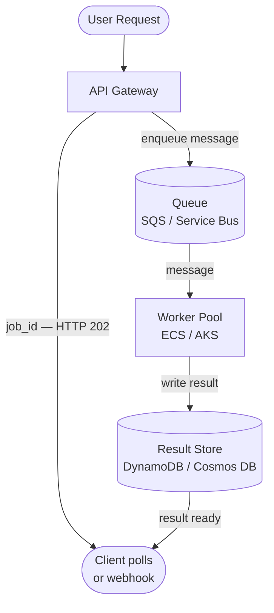
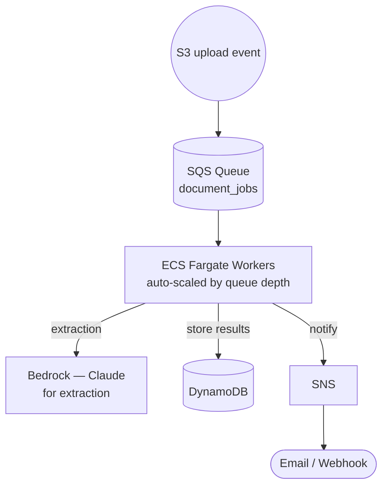
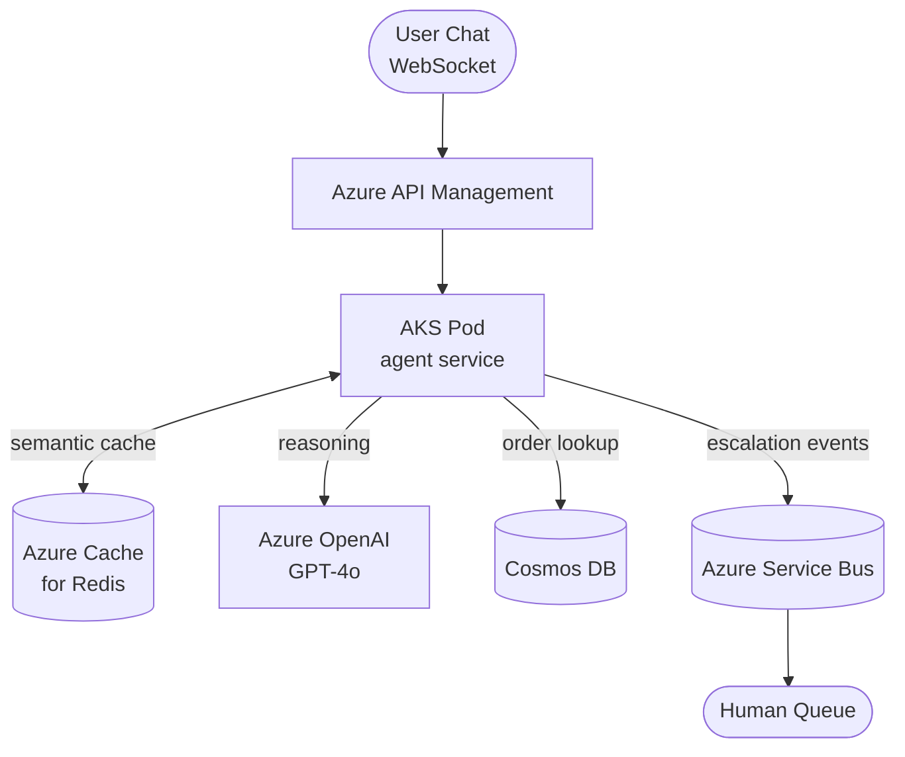

*[Agentic AI Academy](../../README.md) · Section 5 — Production & Mastery · Lesson 5.2*


# Deployment and Scaling AI Agents

**Last Updated:** 2026-04-13

> *Building an agent that works on your laptop is a weekend project.
> Building one that works for ten thousand users without bankrupting you
> is the actual job.*

---

## Learning Outcomes

By the end of this page, you will be able to:

- Explain why synchronous execution breaks under load and how async patterns
  fix it
- Design a cost control strategy covering model calls, token usage, and
  infrastructure spend
- Identify what is safe to cache in an agentic system and what is not
- Containerize an agent workload and explain what each layer of that decision
  buys you
- Map core scaling concepts (queues, autoscaling, load balancing) to their
  AWS and Azure equivalents
- Recognize early warning signs that a deployment is about to fail under load
- Make informed trade-off decisions between cost, latency, and reliability

---

## 1. Why This Matters (In Our Systems)

Here is a scenario that plays out in nearly every AI team's first production
deployment.

The demo works beautifully. The agent responds in two seconds, handles complex
questions, and impresses everyone in the room. You ship to production. The
first hundred users are fine. Then a marketing campaign runs. A thousand users
arrive simultaneously. Response times climb to forty seconds. Your cloud bill
for one day exceeds your monthly budget estimate. The on-call engineer wakes up
to a flood of timeout errors.

None of this happened because the agent was wrong. It happened because the
*infrastructure* was never designed for scale.

AI agents have a cost and latency profile unlike traditional software. A single
agent turn can invoke a large language model multiple times, call external
APIs, execute code, and read from storage — all in sequence. Each step has
latency. Each model call has a per-token cost. Under concurrent load, these
multiply in ways that surprise teams who are used to scaling conventional
web services.

The good news: the patterns are well understood. The cloud platforms have
the building blocks. This page is your map.

---

## 2. Intuition and Mental Models

**The restaurant kitchen analogy.**

Imagine a restaurant where every customer order must be cooked by a single
chef, start to finish, before the next order can begin. That is synchronous
execution. One slow order (a complex agent run) blocks everything behind it.

Now imagine the kitchen has a ticket rail. Orders come in, tickets go up,
multiple chefs work in parallel, and food goes out as it is ready — not in
the order it was ordered. That is async execution with a queue. The customer
waits the same amount of time for their food, but the kitchen serves ten
tables instead of one.

**The taxi vs. bus analogy for cost.**

A dedicated taxi (one compute instance per request) is fast and private but
expensive when demand is low. A bus (shared container serving many requests)
is efficient but needs careful scheduling. Autoscaling is the system that
decides when to add more buses during rush hour and park them when the city
sleeps.

**Caching as institutional memory.**

If ten users ask your agent "what is our return policy?" within an hour, and
the return policy hasn't changed, you are paying for ten model calls that
should cost one. A cache is the agent's short-term memory for answers it has
already computed. The discipline is knowing *which* answers are safe to
remember.

---

## 3. Core Concepts and Terminology

**Synchronous execution** — The caller waits, blocking, until the agent
finishes. Simple, but one slow agent run ties up a connection for the entire
duration. Breaks under load.

**Asynchronous execution** — The caller submits a request and receives a job
ID immediately. The agent works in the background. The caller polls or
subscribes for the result. Decouples submission from completion.

**Message queue** — A durable buffer between the caller and the agent worker.
Requests sit in the queue until a worker picks them up. Absorbs traffic
spikes. AWS equivalent: SQS (Simple Queue Service). Azure equivalent: Service
Bus or Storage Queues.

**Worker / Consumer** — The process that reads from the queue, runs the agent,
and writes the result. Workers can scale horizontally — add more of them when
the queue depth grows.

**Autoscaling** — Automatically adding or removing compute capacity based on
metrics (queue depth, CPU, request rate). AWS: Auto Scaling Groups, ECS
Service Auto Scaling. Azure: Virtual Machine Scale Sets, AKS Horizontal Pod
Autoscaler.

**Containerization** — Packaging your agent and all its dependencies into a
portable, isolated unit (a container image) that runs identically everywhere.
Primary runtime: Docker. Orchestration: Kubernetes. AWS managed: ECS, EKS.
Azure managed: ACI, AKS.

**Response caching** — Storing a computed agent response keyed to the input,
and returning the stored response if the same (or sufficiently similar) input
arrives again. Saves cost and latency. AWS: ElastiCache (Redis). Azure: Azure
Cache for Redis.

**Token budget** — A configured limit on how many tokens an agent is allowed
to use per request, per session, or per day. Enforced in code, not by the
model provider.

**Cold start** — The latency penalty when a container or function must be
initialized from scratch because no warm instance is available. Significant
for serverless deployments.

---

## 4. How It Works (What Actually Matters)

### Async Agent Execution

The canonical async pattern for agents:



1. The API gateway accepts the request, writes it to the queue, and returns
   a `job_id` to the caller immediately (HTTP 202 Accepted).
2. A worker picks the message from the queue, runs the agent, writes the
   result to a result store.
3. The caller either polls an endpoint with the `job_id` or receives a webhook
   callback when the result is ready.

This pattern means your API layer is always fast (the queue write is
milliseconds) and your agent work scales independently by adding workers.

> ⚠️ **Counterintuitive:** Async execution does not make your agent faster for
> any individual user. It makes your system faster for all users
> simultaneously. A user still waits for their agent run; they just don't
> block anyone else while waiting.

### Containerization

A container image for an agent typically contains:

```dockerfile
# Example structure — not production complete
FROM python:3.12-slim

WORKDIR /app
COPY requirements.txt .
RUN pip install --no-cache-dir -r requirements.txt

COPY agent/ ./agent/

# Never bake secrets into the image
# Inject at runtime via environment or secrets manager

CMD ["python", "-m", "agent.worker"]
```

Key decisions:
- **Base image size** — Smaller images pull faster; cold starts hurt less.
  Use slim or distroless bases.
- **Secrets** — Never in the image. Inject via AWS Secrets Manager,
  Azure Key Vault, or environment variables at runtime.
- **Health checks** — Your orchestrator needs to know if a container is alive.
  Expose a `/health` endpoint.
- **Graceful shutdown** — Workers should finish their current job before
  stopping. Handle SIGTERM.

On **AWS**: push your image to ECR (Elastic Container Registry), run it on
ECS (simpler, task-based) or EKS (Kubernetes, more control).

On **Azure**: push to ACR (Azure Container Registry), run on ACI (simple,
single containers) or AKS (Kubernetes, production workloads).

### Autoscaling

The two most useful scaling signals for agent workloads:

| Signal               | What it indicates              | AWS target           | Azure target         |
|----------------------|--------------------------------|----------------------|----------------------|
| Queue depth          | Backlog of unprocessed jobs    | SQS ApproximateNumberOfMessages | Service Bus message count |
| Worker CPU / memory  | Worker is saturated            | CloudWatch metrics   | Azure Monitor metrics |

Scale-out rule example (plain language):
> "If the queue has more than 50 messages and has been growing for 3 minutes,
> add 5 more worker containers. If the queue is empty for 10 minutes,
> scale in to the minimum."

Scale to zero with caution for agents: cold starts on large container images
can add 15–60 seconds of latency, which is painful for interactive workloads.
Keep a minimum of one warm instance if latency matters.

### Cost Control

Agent costs come from three buckets:

**1. Model API costs (usually the largest)**

```
Cost = (input_tokens + output_tokens) × price_per_token × request_volume
```

Controls:
- Set explicit `max_tokens` per request. Unbounded output is unbounded cost.
- Choose the right model tier for the task. Routing simple classification
  tasks to a smaller, cheaper model and complex reasoning to a larger one
  (model routing) can cut costs by 60–80% with minimal quality loss.
- Count and log tokens per request. You cannot optimize what you do not
  measure.

**2. Infrastructure costs**

- Right-size your containers. An agent worker that uses 1 GB of RAM running
  on a 16 GB instance is waste.
- Use spot instances (AWS) or spot VMs (Azure) for non-interactive batch
  agent workloads. 60–90% cheaper; fine for work that can be retried.
- Set spending alerts. AWS Budgets and Azure Cost Management both support
  threshold alerts before you hit them, not after.

**3. Egress and storage costs**

- Caching reduces redundant model calls and storage reads.
- Store large agent artifacts (documents, generated files) in object storage
  (S3 / Azure Blob), not databases.

### Response Caching

Not all agent responses are safe to cache. Use this filter:

| Response type                              | Safe to cache? | TTL suggestion     |
|--------------------------------------------|----------------|--------------------|
| Static FAQ answers                         | Yes            | Hours to days      |
| Policy / documentation lookups             | Yes            | Until doc changes  |
| Personalized recommendations               | No             | —                  |
| Responses involving real-time data         | No             | —                  |
| Actions (send email, write record)         | Never          | —                  |
| Responses containing PII                   | No             | —                  |

**Semantic caching** is worth knowing: instead of exact string matching,
embed the user query and compare against cached query embeddings. If a new
query is semantically similar enough (cosine similarity above a threshold),
return the cached response. This catches paraphrases that exact caching misses.

> ⚠️ **Counterintuitive:** Caching a response that was correct yesterday
> but is wrong today is worse than no cache at all — the user trusts a cached
> response more than they trust a freshly generated one. Always tie cache TTL
> to data freshness, not convenience.

---

## 5. Worked Examples and Realistic Scenarios

### Use Case 1: High-Volume Document Analysis Agent (AWS)

A legal firm runs an agent that processes uploaded contracts — extracting key
clauses, flagging risks, and generating a summary. Volume: ~500 documents per
business day, with bursts at end of month.

**Architecture:**



**Cost controls applied:**
- Max 4,096 output tokens per document (summaries do not need to be long).
- Spot-capacity Fargate tasks for 80% of the worker fleet (retryable work).
- Results cached in ElastiCache for 24 hours — if the same document hash
  is submitted twice (duplicates are common in legal workflows), return the
  cached result.
- AWS Budget alert at 80% of monthly estimate.

**Scaling behavior:** On end-of-month bursts, queue depth triggers ECS to
scale from 2 workers to 20 within 3 minutes. After the burst, it scales back
down automatically.

---

### Use Case 2: Real-Time Customer Support Agent (Azure)

A retail company deploys a support agent that handles live chat. It can look
up orders, answer policy questions, and escalate to a human. Volume: peaks
at 300 concurrent sessions during sales events.

**Architecture:**



**Key decisions:**

- Synchronous WebSocket connection for live chat (the user expects a streaming
  response, not a job ID). Async is used internally for escalation events.
- HPA (Horizontal Pod Autoscaler) on AKS scales agent pods on CPU and custom
  metric: active WebSocket connections per pod.
- Redis semantic cache for policy questions. Cache hit rate during sales events
  reaches 65% — meaning 65% of responses require no model call.
- Azure OpenAI Provisioned Throughput Units (PTU) purchased for the baseline
  load; standard pay-per-token for burst. Prevents throttling during peaks.

---

### Use Case 3: Scheduled Batch Research Agent (AWS or Azure)

A financial services firm runs a nightly agent that reads market news, produces
briefings per sector, and stores them for analysts to review each morning.

**Why async and batch matters here:**
No user is waiting in real time. The work is predictable. This is the easiest
workload to optimize.

- Run on spot/preemptible VMs — a few retries are acceptable overnight.
- Cache sector briefings until market data changes (next trading day).
- Model routing: headline classification uses a small model; final briefing
  synthesis uses a large model. Cost reduction: ~55%.
- Schedule via EventBridge (AWS) or Logic Apps (Azure) to trigger the job
  at 11 PM. Workers sleep the rest of the day — zero idle cost.

---

## 6. Practical Usage and Decision Guidance

**Sync vs. Async: when to choose which**

| Scenario                                     | Use sync | Use async |
|----------------------------------------------|----------|-----------|
| Live chat, streaming responses               | Yes      | —         |
| Simple Q&A, < 5 second expected runtime      | Yes      | —         |
| Document processing, report generation       | —        | Yes       |
| Multi-step research with tool calls          | —        | Yes       |
| Batch workloads with no live user waiting    | —        | Yes       |
| Actions that trigger downstream workflows   | —        | Yes       |

**Container orchestration: ECS vs. EKS (AWS) / ACI vs. AKS (Azure)**

| Need                                     | Simpler option       | More control          |
|------------------------------------------|----------------------|-----------------------|
| Run containers without managing servers  | ECS Fargate / ACI    | —                     |
| Fine-grained scheduling, custom policies | —                    | EKS / AKS             |
| Small team, getting started              | ECS / ACI            | —                     |
| Multi-service, complex networking        | —                    | EKS / AKS             |

Start with ECS Fargate or ACI. Migrate to Kubernetes when you have a genuine
operational reason, not because it sounds more serious.

---

## 7. Common Pitfalls and Misconceptions

**"We'll scale it later."**
Scaling is an architectural decision, not a configuration knob. If your
agent is built synchronously with shared in-process state, adding more
instances does not help — it creates race conditions. Design for stateless,
horizontally scalable workers from the start.

**"Caching the response is the same as caching the answer."**
A cached response is only as good as the data it was generated from. If your
agent queries a database and caches the result, the cache is stale the moment
the database changes. Cache at the right layer, with the right TTL.

**"Spot instances are unreliable."**
Spot/preemptible instances are interrupted, not randomly failed. With proper
checkpointing and retry logic, the effective reliability for agent batch jobs
is indistinguishable from on-demand — at a fraction of the cost.

**"The model is the bottleneck."**
Often it is not. Database queries, cold starts, network calls to APIs, and
large file reads frequently dominate latency. Profile before optimizing. Many
teams spend engineering time on model call optimization while their real
bottleneck is an unindexed database query.

**"We just need to add more instances."**
Horizontal scaling works only if the bottleneck is compute. If the bottleneck
is a single database, a third-party API rate limit, or the model provider's
token-per-minute cap, more instances make the problem worse — they all hit
the same limit simultaneously.

---

## 8. Trade-offs, Scale, and Edge Cases

**Latency vs. cost.** Provisioned throughput (Azure PTU, AWS Bedrock provisioned
throughput) gives predictable latency at predictable cost. Pay-per-token
is cheaper at low volume but throttles unpredictably at high volume. At scale,
provisioned throughput often wins on total cost despite higher unit price,
because throttling causes retries that multiply your actual token spend.

**Stateless vs. stateful workers.** Stateless workers are easy to scale and
replace. Stateful workers (holding conversation context in memory) are faster
but harder to scale — if the worker dies, the state is lost. Externalize
conversation state to a fast store (Redis, DynamoDB, Cosmos DB) and keep
workers stateless.

**Semantic caching accuracy vs. coverage.** A tight similarity threshold
caches less (more model calls, lower cost savings) but is safer — cached
responses are only returned when the match is very close. A loose threshold
caches more but risks returning irrelevant cached responses. Start tight;
loosen with evidence.

**Multi-region deployments.** Agents with users across geographies should be
deployed in multiple regions for latency. This adds complexity: cache
invalidation across regions, consistent queue processing, and data residency
compliance (GDPR, regional data sovereignty). Do not go multi-region until
single-region is stable.

---

## 9. Self-Check Questions

1. Your agent processes user requests synchronously. During a traffic spike,
   response times climb from 3 seconds to 45 seconds and some requests time
   out entirely. What is the architectural root cause, and what pattern would
   you introduce to fix it?

2. Your team wants to cache agent responses to save cost. A teammate suggests
   caching everything with a 1-hour TTL. What questions would you ask before
   agreeing, and what would make you say no to caching a specific response type?

3. You are deploying an agent worker on AWS ECS. What three things should you
   never put inside the container image, and where should each one live instead?

4. Your model provider imposes a rate limit of 100,000 tokens per minute. You
   have 50 workers, each capable of sending 10 requests per minute at 300
   tokens each. Are you over or under the limit? What happens if you scale to
   200 workers?

5. A batch agent job runs nightly and costs $800/month on on-demand instances.
   What would you evaluate before moving it to spot instances, and what
   engineering work would that require?

---

## 10. What to Learn Next

- **Observability for AI Agents** — Scaling without visibility is flying blind;
  learn how to trace, log, and alert on agent workloads specifically.
- **Rate Limiting and Backpressure Patterns** — Understand how to protect your
  agent from being overwhelmed and how to communicate that pressure upstream.
- **Agent State Management** — Stateless workers require external state; this
  topic covers the patterns for managing conversation memory at scale.
- **Cost Attribution and FinOps for AI** — As spend grows, you need to
  attribute costs to teams, features, and users — the discipline that keeps AI
  projects economically viable long-term.

---

## References

### Core References
- AWS Well-Architected Framework — Machine Learning Lens:
  docs.aws.amazon.com/wellarchitected/latest/machine-learning-lens
- Azure Architecture Center — AI + Machine Learning:
  learn.microsoft.com/en-us/azure/architecture/ai-ml
- Amazon SQS Developer Guide — docs.aws.amazon.com/sqs
- Azure Service Bus Documentation — learn.microsoft.com/en-us/azure/service-bus-messaging
- Kubernetes Horizontal Pod Autoscaler —
  kubernetes.io/docs/tasks/run-application/horizontal-pod-autoscale

### Supplementary Reading
- "The Cost of AI" — a.16z.com/the-cost-of-ai — essential grounding on the
  economics of model inference; most important insight: inference cost falls
  rapidly but usage grows faster, so optimization is a continuous discipline,
  not a one-time exercise
- AWS Fargate vs ECS vs EKS decision guide — containers.aws/learn — most
  important insight: most teams start with Fargate and only move to EKS when
  operational maturity and genuine need justify the overhead

---

## Summary

Deploying an AI agent at scale means solving four problems in parallel: keeping
requests moving under load (async execution and queues), keeping infrastructure
responsive under traffic spikes (autoscaling and containerization), keeping
costs from compounding (token budgets, model routing, and caching), and keeping
the system observable enough to know when any of the above is failing. AWS and
Azure both provide mature primitives for all of this — the engineering work is
composing them correctly for the specific latency, cost, and reliability profile
of your agent workload. Build stateless, instrument everything, and scale from
evidence rather than assumption.

## Self-Assessment Checklist
- [ ] I can explain this clearly to a teammate without looking at the page
- [ ] I know when to use it and when to reach for something else
- [ ] I can spot related mistakes in a code review
- [ ] I know what I'd read next to go deeper

## Suggested Next Pages
- [[Observability for AI Agents]] — *you cannot optimize or debug what you
  cannot see; this is the natural operational companion to this page*
- [[Agent State Management at Scale]] — *stateless workers are the right
  pattern, but someone has to hold the state — this page covers how*
- [[Cost Attribution and FinOps for AI]] — *once your deployment is running,
  this page teaches you how to understand and control where the money goes*
- [[Rate Limiting and Backpressure Patterns]] — *the defensive patterns that
  prevent a traffic spike from becoming an outage or a runaway bill*

---

← [5.1 — Agent Security and Safety](<5.1 Agent Security and Safety.md>) &nbsp;|&nbsp; [5.3 — AI Agent Observability →](<5.3 AI Agent Observability.md>)
