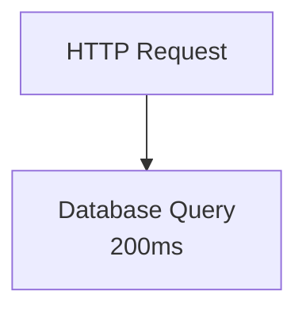

*[Agentic AI Academy](../../README.md) · Section 5 — Production & Mastery · Lesson 5.3*

# Observability for AI Agents
**Last Updated:** 2026-04-13

> *Your agent gave a wrong answer, took 40 seconds, and cost $3 for one
> request — and you have no idea which of those three facts is actually
> the problem. Observability is how you find out.*

---

## Learning Outcomes

By the end of this page, you will be able to:

- Name the three pillars of observability and explain what each one tells
  you that the others cannot
- Describe what a trace looks like inside an agentic system and why it is
  different from tracing a conventional API
- Define the metrics that matter most for AI agent health: latency, token
  usage, cost, error rate, and quality drift
- Explain what structured logging is and why unstructured logs fail you
  at scale
- Design a basic alerting strategy that catches real problems without
  drowning the team in noise
- Name at least three observability toolkits purpose-built for AI agents
  and describe what each one does well
- Read a trace, a dashboard, and an alert and draw a conclusion from each

---

## 1. Why This Matters (In Our Systems)

A user files a support ticket: "Your agent gave me completely wrong
information about my account balance." You open your logs. You see one line:

```
INFO  2026-04-13 14:32:01  agent_request completed
```

That is it. No input. No output. No which tools were called. No how long
each step took. No what model was used. No what the model was actually
asked.

You cannot debug this. You cannot reproduce it. You cannot tell the user
what went wrong, and you cannot prevent it happening again. You are flying
blind in a machine with moving parts you built yourself.

This is the observability gap — and it is the single most common reason AI
agent projects fail in production, not because the agent is wrong, but
because the team cannot tell *when* it is wrong, *why*, or *how often*.

Traditional software is deterministic. Given the same input, it produces
the same output. AI agents are probabilistic. The same question, asked
twice, may produce different answers, take different code paths, call
different tools, and cost different amounts. That non-determinism makes
observability not just useful but essential. You cannot reason about a
system you cannot see.

---

## 2. Intuition and Mental Models

**The flight data recorder analogy.**

Modern aircraft do not crash and leave investigators guessing. Every
instrument reading, every control input, every system state is recorded
continuously. When something goes wrong, investigators replay the exact
sequence of events. Observability is your agent's flight data recorder —
not just for crashes, but for every flight.

**The three windows into your system.**

Imagine your agent is a black box. You have three windows:

- **Logs** are a journal — a timestamped narrative of what happened, in
  order. High detail, hard to aggregate. Good for "what exactly occurred
  during this one request."
- **Metrics** are a dashboard of gauges — numbers that update over time.
  Low detail, easy to aggregate and alert on. Good for "is this system
  healthy right now, and was it healthy last week?"
- **Traces** are a map of a journey — showing every step taken during one
  request, how long each step took, and how steps relate to each other.
  Good for "why was this specific request slow, and where did it spend
  its time?"

These are called the **three pillars of observability**. Each answers
questions the others cannot. Logs tell you what. Metrics tell you how much
and how often. Traces tell you where and why.

Now add a fourth concept that matters specifically to AI systems:

- **Evaluations** are quality checks — did the agent's output actually
  meet the standard? Unlike the first three pillars (which measure
  mechanical behavior), evaluations measure correctness and usefulness.

---

## 3. Core Concepts and Terminology

**Structured logging** — Writing logs as machine-readable key-value pairs
(JSON) rather than free-form sentences. Instead of:

```
Agent finished processing user request in 3.2 seconds
```

You write:

```json
{
  "event": "agent_request_complete",
  "user_id": "u_8821",
  "session_id": "s_4490",
  "duration_ms": 3200,
  "input_tokens": 840,
  "output_tokens": 312,
  "model": "gpt-4o",
  "tools_called": ["lookup_order", "get_policy"],
  "status": "success"
}
```

The second form can be searched, filtered, aggregated, and alerted on.
The first form can only be read.

**Trace** — A record of a single request's complete journey through the
system, composed of individual **spans**. Each span represents one unit of
work: one LLM call, one tool execution, one database query. Spans nest
inside each other, forming a tree that shows the full causal chain.

**Span** — The atomic unit of a trace. Has a name, a start time, a
duration, a status (success / error), and optional attributes (metadata).

**Trace ID** — A unique identifier that follows a request through every
service, function, and tool it touches. The thread that connects all the
spans into one story.

**Metric** — A numeric measurement captured over time. Examples: requests
per minute, average latency, total tokens used today, error rate, cost
per request.

**Alert** — A rule that fires a notification when a metric crosses a
threshold. The art is calibrating thresholds so alerts are signal, not
noise.

**Evaluation (Eval)** — A programmatic quality check on agent output.
Can be rule-based ("does the response contain a citation?"), model-based
("rate this response for factual accuracy on a scale of 1–5"), or human-
in-the-loop.

**Feedback loop** — Connecting production observations back to development.
If evals show quality degrading after a prompt change, the feedback loop
ensures the team knows before users file tickets.

---

## 4. How It Works (What Actually Matters)

### Why Agent Tracing is Different

In a conventional web API, a trace looks like this:



One request, one downstream call, done. In an AI agent, a single user
message might produce:

```mermaid
flowchart TD
    UserMsg([User Message\n"What's my refund status?"]) --> LLM1[LLM Call 1 — Plan the steps\n1,200ms]
    LLM1 --> Tool1[Tool: lookup_order\nid=9921 — 340ms]
    LLM1 --> Tool2[Tool: get_refund_policy\n180ms]
    UserMsg --> LLM2[LLM Call 2 — Generate response\n980ms]
    LLM2 --> Tool3[Tool: send_confirmation_email\n210ms]
```

Five spans. Multiple LLM calls. Parallel and sequential tool use. If the
total request takes 5 seconds, you need the trace to know that LLM Call 1
was the bottleneck — not the database, not the email service.

Without this breakdown, optimization is guesswork.

### What to Log at Each Layer

| Layer              | What to capture                                              |
|--------------------|--------------------------------------------------------------|
| Request intake     | user_id, session_id, input text (with PII handling), timestamp |
| LLM call           | model name, input tokens, output tokens, latency, prompt version |
| Tool call          | tool name, input args (sanitized), output summary, latency, success/fail |
| Agent decision     | chosen action, reasoning (if available), alternatives considered |
| Final response     | output text (or hash), latency end-to-end, cost estimate     |
| Error events       | error type, stack trace, which step failed, retry count      |

> ⚠️ **Counterintuitive:** Logging the raw prompt and raw response feels
> like the obvious thing to do. But prompts and responses often contain PII,
> sensitive business data, or user secrets. Log summaries, hashes, or
> redacted versions unless you have an explicit data governance policy
> covering full content retention.

### The Metrics That Actually Matter for AI Agents

**Mechanical health:**
- `latency_p50`, `latency_p95`, `latency_p99` — the middle and tail of
  your response time distribution. p95 and p99 are where users feel pain.
- `error_rate` — percentage of requests ending in failure.
- `tool_call_failure_rate` — which tools are flaky?
- `retry_rate` — how often is the agent having to retry steps?

**Cost and efficiency:**
- `tokens_per_request` (input + output, tracked separately)
- `cost_per_request` (estimated from token counts and model pricing)
- `cache_hit_rate` — what fraction of requests returned a cached response?

**Quality:**
- `eval_score` — output from your automated quality checks, tracked over
  time. A drop here after a deployment is the signal that matters most.
- `user_feedback_rate` — thumbs up/down, escalation rate, abandonment.
- `hallucination_flag_rate` — if you have a factual accuracy checker.

### Alerting Without Noise

The trap most teams fall into: alerting on everything, and then ignoring
all alerts because every page is a false alarm.

Alert design principles:
- Alert on **symptoms**, not causes. "p95 latency > 8 seconds" is a
  symptom. "LLM call taking longer" is a cause — find it with a trace after
  the alert fires.
- Set thresholds from **data**, not intuition. Run for two weeks, observe
  your baseline, then set alerts at 2–3x the normal value.
- Every alert must have a **runbook link** — what does the on-call engineer
  do when this fires?
- Review and prune alerts quarterly. Stale alerts erode trust faster than
  silence does.

---

## 5. Worked Examples and Realistic Scenarios

### Scenario 1: Finding a Cost Spike

Your team gets an AWS bill that is three times the estimate. You open your
cost-per-request metric dashboard. You see that costs spiked on Tuesday at
2pm and have been elevated since.

You narrow to Tuesday 2pm. You find that `tokens_per_request` jumped from
an average of 800 to 4,200 output tokens. You query your logs filtered by
`output_tokens > 3000`. You find hundreds of requests from one session type:
the "detailed report" agent flow.

You pull a trace from that session. You see that the prompt was changed in
a deploy at 1:58pm — a new instruction that said "provide comprehensive
detail in all responses." That single word change quadrupled output length
and cost.

**Without structured logs and metrics:** you would stare at a bill and
have no starting point.
**With them:** root cause in under 20 minutes.

---

### Scenario 2: Quality Drift After a Prompt Change

Your eval dashboard shows that factual accuracy scores have been declining
over the past five days — from 91% to 78%. No one on the team flagged a
change. You check your deployment log (you are logging prompt versions,
right?) and see that the system prompt was updated six days ago to improve
tone.

You run a diff. The updated prompt removed a sentence that instructed the
model to cite its sources. Without that instruction, the model stopped
grounding answers in the retrieved documents. Accuracy fell.

**Without evals tracked over time:** you find out when users complain —
weeks later, with reputational damage already done.
**With them:** you catch it in days and roll back.

---

### Scenario 3: A Flaky Tool Nobody Noticed

Your `lookup_inventory` tool has a `tool_call_failure_rate` of 12% — but
because the agent retries automatically, users rarely see an error. The
retries add 800ms to those requests, pushing p95 latency over your SLA.

You would never find this in user complaints (the agent "works") and you
would never find it in error logs (failures are swallowed by retries).
Tool-level metrics surface it immediately.

---

## 6. Practical Usage and Toolkits

### Purpose-Built AI Observability Toolkits

These tools understand agents natively — they know about LLM calls, token
counts, tool use, and eval scoring. They are faster to start with than
building on general-purpose observability infrastructure.

**LangSmith** (by LangChain)
- Automatic tracing for LangChain-based agents; works with others via SDK
- Built-in eval framework with human and automated scoring
- Prompt version tracking and comparison
- Best for: teams already in the LangChain ecosystem; quickest path to
  traces with zero config

**Langfuse** (open source)
- Framework-agnostic tracing via SDK or OpenTelemetry
- Self-hostable (important for data-sensitive environments)
- Eval workflows, user feedback capture, cost tracking
- Best for: teams who need data residency control or are not using LangChain

**Arize Phoenix** (open source)
- Strong focus on evaluation and LLM quality metrics
- Runs locally — good for development-time observability before production
- OpenTelemetry-native; integrates with production stacks
- Best for: teams who want to instrument during development, not just after

**OpenTelemetry (OTel)** — not AI-specific, but the foundation
- The open standard for traces, metrics, and logs
- All of the above tools can export to OTel backends
- If you are in a mature engineering org with existing observability
  infrastructure (Datadog, Grafana, Honeycomb), OTel is the bridge
- Best for: organizations that need AI observability to fit into an
  existing observability platform

### Getting Started in Under an Hour

With Langfuse (self-hostable, framework-agnostic):

```python
from langfuse import Langfuse
from langfuse.decorators import observe, langfuse_context

langfuse = Langfuse()

@observe()  # this decorator captures the full function as a span
def run_agent(user_input: str) -> str:
    # log custom metadata to the current span
    langfuse_context.update_current_observation(
        input=user_input,
        metadata={"session_id": "s_001", "user_tier": "premium"}
    )

    response = call_your_agent(user_input)

    langfuse_context.update_current_observation(
        output=response,
        usage={"input": 840, "output": 312}  # token counts
    )
    return response
```

Four lines of decoration. Every call now appears as a trace in your
Langfuse dashboard with timing, input, output, and token usage. That is
the minimum viable observability starting point.

---

## 7. Common Pitfalls and Misconceptions

**"We have logging, so we have observability."**
Logging is one pillar. Without metrics you cannot spot trends. Without
traces you cannot diagnose individual failures. All three are required;
each covers what the others miss.

**"We'll add observability after launch."**
Retrofitting observability into an uninstrumented codebase is significantly
harder than building it in from the start. You also have no baseline data —
no way to know what "normal" looks like. Instrument from day one.

**"Logging everything is safer than logging too little."**
Logging everything creates two problems: cost (log storage is not free at
scale) and compliance risk (you may be retaining PII or sensitive content
you are not permitted to store). Log the right things, with a clear data
retention policy.

**"If there are no user complaints, the agent is working."**
Users do not complain about every bad answer — they quietly stop using the
product. Quality metrics and evals catch degradation that user complaints
miss, often weeks earlier.

**"Alerts mean something is broken."**
Alerts mean a threshold was crossed. That threshold might be wrong. An
alert firing does not mean a user was harmed. An alert not firing does not
mean everything is fine. Build the discipline of reviewing alert accuracy
regularly.

---

## 8. Trade-offs, Scale, and Edge Cases

**Verbosity vs. cost.** Detailed structured logs with full inputs and
outputs are maximally useful for debugging. They are also expensive to
store and potentially risky from a data governance perspective. Calibrate
log verbosity by environment: verbose in staging, targeted in production.

**Sampling vs. completeness.** At high volume, tracing 100% of requests
is expensive. Sampling (tracing 10% of requests, or 100% of errors) reduces
cost but means you may miss rare failure patterns. Prioritize: always trace
errors, always trace slow requests (tail-based sampling), sample the rest.

**Evals are only as good as their design.** An eval that checks for
"response length > 50 words" tells you nothing about quality. Designing
evals that actually measure what matters is a discipline in itself — and
bad evals give false confidence, which is worse than no evals.

**Observability data as a privacy surface.** Your traces contain user
inputs, agent reasoning, and tool outputs. This data is as sensitive as
any other user data in your system. Apply the same access controls,
retention limits, and encryption standards.

---

## 9. Self-Check Questions

1. A user reports that the agent "seemed confused" during a session yesterday.
   What would you look at first, and in what order, to reconstruct what
   happened?

2. Your p95 latency is 12 seconds. You want to bring it under 5 seconds.
   What observability data would you need to identify where to optimize, and
   how would you get it?

3. You deploy a new prompt version on a Friday. What metric or signal would
   tell you by Monday whether the change improved or degraded quality — and
   how quickly could you detect a problem?

4. Your team proposes logging the full text of every user message and every
   agent response for debugging. What questions would you ask before agreeing?

5. You are instrumenting a new tool your agent can call. What attributes
   would you capture on the span for that tool call to make it maximally
   useful for future debugging?

---

## 10. What to Learn Next

- **Evaluation Design for AI Agents** — Evals are only mentioned briefly
  here; the discipline of writing evals that actually catch quality problems
  is a full topic and the next most important skill after basic observability.
- **Cost Attribution and FinOps for AI** — Once you can measure cost per
  request, the next step is attributing that cost to features, teams, and
  users — essential for running AI products economically.
- **Incident Response for AI Systems** — What to do when an alert fires;
  how to run a postmortem for a non-deterministic system where "the same
  bug" may not reproduce.
- **OpenTelemetry Deep Dive** — If your organization already has an
  observability platform, OTel is how you connect AI-specific tooling to it;
  understanding the standard unlocks the whole ecosystem.

---

## References

### Core References
- OpenTelemetry specification — opentelemetry.io/docs/specs
- Langfuse documentation — langfuse.com/docs
- LangSmith documentation — docs.smith.langchain.com
- Arize Phoenix — phoenix.arize.com
- Google SRE Book, Chapter 6: Monitoring Distributed Systems —
  sre.google/sre-book/monitoring-distributed-systems (the foundational
  text on symptoms vs. causes in alerting — still the best framing)

### Supplementary Reading
- "Observability Engineering" — Charity Majors, Liz Fong-Jones, George Miranda
  (O'Reilly) — the canonical book on modern observability; most important
  insight: observability is about asking new questions of your running system,
  not just answering known ones — AI agents make this principle more urgent,
  not less
- Honeycomb blog on high-cardinality observability — honeycomb.io/blog —
  most important insight: for non-deterministic systems, you need to be able
  to slice and filter on arbitrary dimensions at query time, not just at
  dashboard design time

---

## Summary

Observability for AI agents rests on four instruments: logs (what happened),
metrics (how often and how much), traces (why and where), and evaluations
(was it actually good?). Each answers questions the others cannot, and
skipping any one of them leaves you with a blind spot that will eventually
become an incident you cannot explain. The tooling to get started is mature
and fast to integrate — Langfuse, LangSmith, and Arize Phoenix can give
you traces and quality metrics within an hour. The harder part is the
discipline: logging the right things, calibrating alerts to signal rather
than noise, and treating quality drift as a metric to be measured, not a
complaint to be waited for.

## Self-Assessment Checklist
- [ ] I can explain this clearly to a teammate without looking at the page
- [ ] I know when to use it and when to reach for something else
- [ ] I can spot related mistakes in a code review
- [ ] I know what I'd read next to go deeper

## Suggested Next Pages
- [[Evaluation Design for AI Agents]] — *observability tells you something
  is wrong; evals tell you what "right" actually means — you need both*
- [[Cost Attribution and FinOps for AI]] — *once you can see cost per
  request, this page teaches you how to own and govern it*
- [[Incident Response for AI Systems]] — *when your observability stack
  fires an alert, this page is what you do next*
- [[OpenTelemetry for AI Workloads]] — *the standard that connects every
  tool on this page to your broader engineering infrastructure*

---

← [5.2 — Deployment and Scaling](<5.2 Deployment and scaling.md>) &nbsp;|&nbsp; [5.4 — Bringing It All Together →](<5.4-Bringing-it-all-together.md>)
