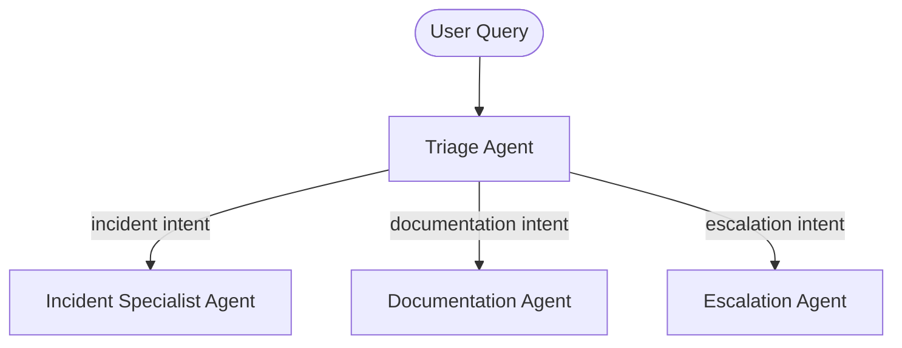

*[Agentic AI Academy](../../README.md) · Section 5 — Production & Mastery · Lesson 5.4*

# 5.4 Bringing It All Together — From Prototype to Production Agent
**Last Updated:** 2026-04-13

> *Every concept in this academy was a gear. This page shows you the machine.*

---

## Learning Outcomes

By the end of this page, you will be able to:

- Trace how a naive LLM call evolves into a production-grade agentic system through deliberate, requirement-driven iterations
- Identify *which* capability to add at each maturity stage — and why adding it too early hurts as much as adding it too late
- Map the course modules (1.1–5.3) onto real architectural decisions in a working system
- Recognize the signs that your current architecture is approaching its limits and needs the next evolution
- Design an iteration roadmap for a new agentic system, starting from a defensible v0

---

## 1. Why This Matters (In Our Systems)

Here's a trap we fall into constantly: a proof-of-concept wows the demo, gets greenlit, and then the team scrambles to bolt on reliability, memory, security, and observability *after* users are already angry.

The concepts in this academy weren't designed to be read in isolation. They're load-bearing pieces of the same structure. An agent without memory frustrates users. An agent without evaluation drifts silently. An agent without tracing becomes a black box at 2am when something goes wrong.

This page answers the question every engineer asks when they finish a course like this: *"Okay, but where do I actually start — and when do I add the next thing?"*

The answer is: **you iterate, but you iterate deliberately.**

---

## 2. Intuition & Mental Models

Think of building an agentic system like building a city.

You don't pour the subway tunnels before anyone lives there. You start with a road and a few buildings. When traffic gets bad, you add traffic lights. When the population grows, you add public transit. When crime rises, you add infrastructure for safety.

Each addition is a response to a *real, observed constraint* — not a speculative one. The mistake is either building the subway on day one (over-engineered, expensive, premature) or never building it at all (the city chokes).

Agentic systems work the same way. Your first version earns you user feedback and production signal. That signal tells you which gear to add next. The course modules are your catalogue of gears. This page teaches you the *sequence*.

---

## 3. The Use Case: Engineering Support Agent

We'll follow a single product — an **internal engineering support agent** — from its simplest form to a mature, production system.

The agent's job: help engineers answer questions, navigate internal docs, debug incidents, and escalate issues. You'll recognise this as a realistic problem that touches every module in the course.

---

## 4. How It Matures — Iteration by Iteration

### v0 — The Honest Starting Point

**What you build:** A single LLM call. A system prompt, a user message, a response.

```python
response = llm.chat(
    system="You are a helpful engineering assistant.",
    user=user_query
)
```

**What this teaches you:** Whether the use case is viable. Whether users actually ask the questions you assumed they would.

**What breaks:** The model hallucinates internal processes. It has no knowledge of your systems. Every session starts cold. It has no memory of anything.

**Modules in play:** [[1.1 How LLMs Work]], [[1.2 Prompt Engineering for Developers]]

---

### v1 — Ground It in Real Knowledge

**Trigger:** Users complain the agent is confidently wrong about internal tooling.

**What you add:** A vector store of internal docs. The agent retrieves relevant chunks before responding.

```python
chunks = vector_store.search(user_query, top_k=5)
context = format_chunks(chunks)
response = llm.chat(system=system_prompt, context=context, user=user_query)
```

**What this teaches you:** RAG dramatically reduces hallucinations on known topics. But retrieval quality is now the bottleneck — garbage in, garbage out.

> ⚠️ **Counterintuitive:** Adding more documents to your vector store can *reduce* answer quality if your chunking strategy is poor. More signal isn't better signal.

**Modules in play:** [[1.3 Embeddings & Vector Search]], [[2.4 Retrieval-Augmented Generation]]

---

### v2 — Give It Hands

**Trigger:** Users want the agent to *do* things — look up a ticket status, check deployment logs, create a Jira issue.

**What you add:** Tool definitions. The agent can now call functions and incorporate their results.

```python
tools = [get_ticket_status, search_runbooks, create_incident]
response = llm.chat_with_tools(system=system_prompt, tools=tools, user=user_query)
```

**What this teaches you:** Tool use changes the risk profile of your agent. A reading agent can be wrong. An acting agent can cause damage. This is when guardrails start mattering.

**Modules in play:** [[2.1 What are Agents]], [[2.2 Agent Design Patterns and Tool Use]]

---

### v3 — Give It Memory

**Trigger:** Users report that the agent "forgets" things mid-conversation. It can't track a multi-step debugging session.

**What you add:** A memory architecture — short-term (conversation buffer), medium-term (session summaries), and long-term (user preferences persisted across sessions).

```python
memory = load_user_memory(user_id)
conversation = ConversationBuffer(max_tokens=4000)
# ...at end of session
save_summary(user_id, conversation.summarize())
```

**What this teaches you:** Memory is a spectrum, not a binary. Different tiers serve different timescales. Choosing which memories to persist is itself a design decision.

**Modules in play:** [[2.3 Memory Architecture for Agents]]

---

### v4 — Orchestrate It Properly

**Trigger:** The single-agent loop is getting complex. You've got 15 tools, nested conditions, and engineers adding edge-case logic directly to the prompt. It's becoming unmaintainable.

**What you add:** A framework that handles the agent loop cleanly. You separate concerns: planning, tool execution, memory management.

**What this teaches you:** Frameworks give you structure in exchange for flexibility. Choose one that matches your orchestration pattern — not the one with the most GitHub stars.

**Modules in play:** [[3.1 Frameworks and orchestration landscape]]

---

### v5 — Split the Responsibilities

**Trigger:** One agent trying to do everything is producing mediocre results on specialised tasks. Incident diagnosis quality is poor. Runbook search quality is good. They need different prompts, different tools, different retrieval strategies.

**What you add:** A multi-agent architecture. A routing/triage agent classifies the intent and dispatches to specialist agents.



**What this teaches you:** Multi-agent systems trade simplicity for specialisation. You now have coordination overhead. Communication protocols between agents matter — a lot.

> ⚠️ **Counterintuitive:** Multi-agent systems can be *less* reliable than single-agent systems if you don't design for failure at the coordination layer. Each hop is a new failure point.

**Modules in play:** [[4.1 Multi-Agent architectures]], [[4.2 Agent Communication protocols]]

---

### v6 — Measure What Actually Matters

**Trigger:** The system *feels* better after v5 but you can't prove it. A regression slips through and users notice before you do.

**What you add:** An evaluation harness. Golden datasets per agent. Tracing on every LLM call and tool invocation. Dashboards for latency, tool call success rate, and retrieval hit rate.

```python
@trace(name="incident_agent")
def run_incident_agent(query: str) -> AgentResponse:
    ...
```

**What this teaches you:** You cannot improve what you cannot measure. Evals are not optional — they are how you prevent the system from quietly getting worse.

**Modules in play:** [[4.3 Evaluation and Tracing]]

---

### v7 — Make It Resilient

**Trigger:** The system works great until it doesn't. An LLM provider has a 5-minute outage. A tool call hangs. A cascade of retries overwhelms a downstream service.

**What you add:** Circuit breakers, retry logic with exponential backoff, fallback responses, timeout budgets.

**What this teaches you:** Reliability is an emergent property, not a single feature. You design for failure *before* it happens.

**Modules in play:** [[4.4 Reliability Patterns]]

---

### v8 — Harden for Production

**Trigger:** The agent is being used by 200 engineers. Security reviews flag prompt injection risks. Compliance asks about data retention. Scaling review shows the vector store is a bottleneck at peak load.

**What you add:**
- Input/output sanitisation and prompt injection defences ([[5.1 Agent Security and Safety]])
- Horizontal scaling, async tool execution, caching for common retrievals ([[5.2 Deployment and scaling]])
- Structured logs, distributed traces, anomaly alerting ([[5.3 AI Agent Observability]])

**What this teaches you:** Production readiness is not a single milestone. It's a continuous investment.

---

## 5. The Maturity Map

| Iteration | Capability Added | Course Module | Trigger Signal |
|-----------|-----------------|---------------|----------------|
| v0 | Basic LLM call | 1.1, 1.2 | Concept validated |
| v1 | RAG + Vector Search | 1.3, 2.4 | Hallucinations on known topics |
| v2 | Tool Use | 2.1, 2.2 | Users want actions, not just answers |
| v3 | Memory Architecture | 2.3 | Sessions feel stateless |
| v4 | Framework & Orchestration | 3.1 | Agent loop becoming unmaintainable |
| v5 | Multi-Agent Split | 4.1, 4.2 | Quality degrades across intents |
| v6 | Eval & Tracing | 4.3 | Regressions are invisible |
| v7 | Reliability Patterns | 4.4 | Production failures cascade |
| v8 | Security, Scale, Observability | 5.1, 5.2, 5.3 | Real users, real stakes |

---

## 6. Practical Decision Guidance

**When to add the next layer:**
- You have *evidence* of the problem, not just intuition about it
- The current architecture is visibly straining under real usage
- The cost of *not* adding it is higher than the cost of the complexity it introduces

**When NOT to:**
- You're still pre-launch and speculating
- You haven't validated the previous layer works
- You're adding it because it's interesting, not because it's needed

> ⚠️ **Counterintuitive:** The most common failure mode isn't under-engineering — it's adding v5 capabilities to a v1 problem. Multi-agent complexity on a use case that one well-prompted agent could handle is a productivity killer.

---

## 7. Common Pitfalls

**"We'll add evals later."** — You won't. And by the time you try, you won't have a baseline to compare against. Add at least a minimal golden set at v1.

**Skipping the framework and wiring everything by hand.** — Fine at v0 and v1. A serious liability at v4+.

**Multi-agent too early.** — Most people assume complexity requires many agents. The reality is that one well-designed agent with good tooling handles most use cases better. Reach for multi-agent when *specialisation quality* is the actual problem.

**Treating memory as a solved problem.** — What you store, how long you store it, and how you retrieve it are all design decisions with real consequences for cost, privacy, and quality.

---

## 8. Self-Check Questions

1. If retrieval quality degrades silently in production, how would your current architecture surface that?
2. A user reports the agent "forgot" something from last week. Which memory tier failed, and how would you fix it?
3. Your triage agent is routing 30% of queries to the wrong specialist. Is this an evaluation problem, a prompt problem, or an architecture problem — and how do you tell the difference?
4. A new compliance requirement says user queries cannot be retained beyond 24 hours. Which parts of your architecture need to change?
5. At what point in your current system would a single LLM provider outage cause total failure — and what's your mitigation?

---

## 9. What to Learn Next

- **Platform Engineering for AI** — Once you have a mature agent, the question becomes how you standardise deployment, secrets management, and monitoring across *multiple* agents in your org.
- **Agent Fine-tuning & Distillation** — When RAG and prompt engineering hit their ceiling, fine-tuning on your domain data is the next lever.
- **Human-in-the-Loop Design** — Production agents often need graceful escalation paths to humans. Designing that handoff well is its own discipline.

---

## References

### Core References
- [Anthropic Agent SDK Documentation](https://docs.anthropic.com)
- [LangGraph — Stateful Agent Orchestration](https://langchain-ai.github.io/langgraph/)
- [OpenTelemetry for AI Systems](https://opentelemetry.io)

### Supplementary Reading
- *"Building Effective Agents"* — Anthropic Engineering Blog. Key insight: most production agents are simpler than you'd expect; the sophistication is in the scaffolding, not the model call.
- *"The Bitter Lesson"* (Sutton) — A useful reminder that scale often beats clever architecture; relevant when deciding how much complexity to add vs. how much to invest in data quality.

---

## Summary

This page walked one agentic system — an internal engineering support agent — from a single LLM call to a production-grade, multi-agent, observable, resilient system. Each capability was added in response to a real, observed need — not speculation. The course modules you've studied aren't theoretical; they're the exact tools you'd reach for at each inflection point. The skill isn't knowing all of them — it's knowing *which one the situation actually calls for*.

## Self-Assessment Checklist
- [ ] I can explain this clearly to a teammate without looking at the page
- [ ] I know when to use it and when to reach for something else
- [ ] I can spot related mistakes in a code review
- [ ] I know what I'd read next to go deeper

## Suggested Next Pages
- [[5.1 Agent Security and Safety]] — *Production agents with real users need threat models; this is the first thing to harden before external exposure*
- [[4.3 Evaluation and Tracing]] — *If you take one thing from this capstone: add evals earlier than feels necessary, and this page shows you how*
- [[Agentic AI Learning Path]] — *Return to the map now that you've seen the territory — it reads differently the second time*

---

← [5.3 — AI Agent Observability](<5.3 AI Agent Observability.md>)
