# Fintropi AI Learning Agent — Low Level Design

| Field | Value |
|---|---|
| Document | LearningAgent_LLD.md |
| Version | 1.0 |
| Date | 2026-06-01 |
| Status | Approved for Implementation |
| Author | Generated via Claude Code |

---

## Table of Contents

1. [Scope & Objectives](#1-scope--objectives)
2. [System Context](#2-system-context)
3. [Data Model](#3-data-model)
4. [Architecture](#4-architecture)
5. [Base Interfaces](#5-base-interfaces-python)
6. [Service Layer](#6-service-layer)
7. [Learning Types — Detailed Spec](#7-learning-types--detailed-spec)
8. [API Contracts](#8-api-contracts)
9. [Pipeline Integration](#9-pipeline-integration-c-changes)
10. [Angular UI Components](#10-angular-ui-components)
11. [Configuration Reference](#11-configuration-reference)
12. [Error Handling](#12-error-handling)
13. [Phased Implementation Plan](#13-phased-implementation-plan)
14. [Appendix — Flowcharts](#14-appendix--flowcharts)

---

## 1. Scope & Objectives

### What this system does

A nightly batch agent that reads user correction signals from `ApplicationAudit` and `ApproverMapping.Remark`, identifies recurring patterns, and applies learned rules back into the invoice extraction and approval pipeline.

### Five learning types in scope

| ID | Name | Scope | Signal Source |
|---|---|---|---|
| L1 | GL/COA Default | Supplier | `ApplicationAudit` field corrections |
| L2 | Extraction Prompt Update | Supplier | `ApplicationAudit` field corrections |
| L3 | Description → COA Mapping | Tenant | `ApplicationAudit` line-item corrections |
| L5 | Approval Pre-flight Rules | Tenant | `ApproverMapping.Remark` |
| L6 | Confidence Threshold | Supplier | Correction rate over invoice volume |

### Design constraints

- All signals come from existing audit tables — no new data capture required for v1
- Multi-tenant isolation enforced: tenant-scope learnings never cross tenant boundaries
- Human review gate is configurable per tenant (on/off toggle)
- Every applied change is fully reversible via admin UI
- Adding a new learning type must require zero changes to existing files

### Assumptions

1. `ApplicationAudit.PropertyName` format for line items is `"Items N FieldName"` (e.g. `"Items 2 AccountCode"`) — from `JsonDiffHelper`
2. GPT-4o is available via the existing Azure OpenAI endpoint already wired in `Fintropi.AIAgent`
3. `Supplier.InvoiceDataExtractionPrompt` is the live field read by the Python extraction agent — no code change needed for L2 to take effect
4. EF Core migrations are run per-tenant schema via `Add-Migration` on `Fintropi_TenantDBContext`
5. `LearningBatchRun` table lives in the **master** schema (spans tenants), all others in tenant schema

---

## 2. System Context

### Component diagram

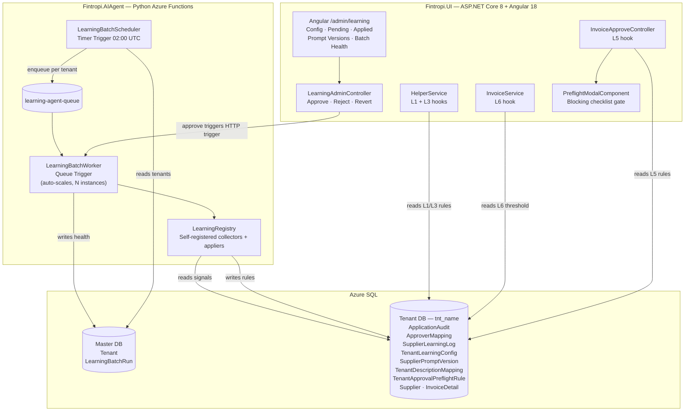

---

### Nightly execution sequence

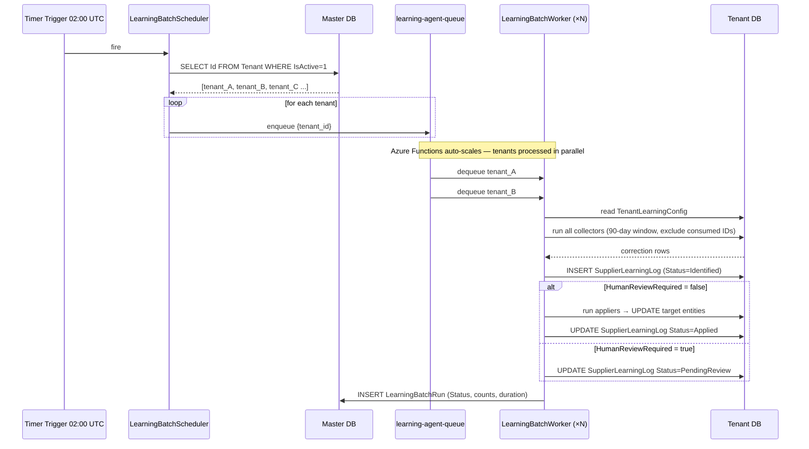

---

## 3. Data Model

### 3.1 Entity Relationship Diagram

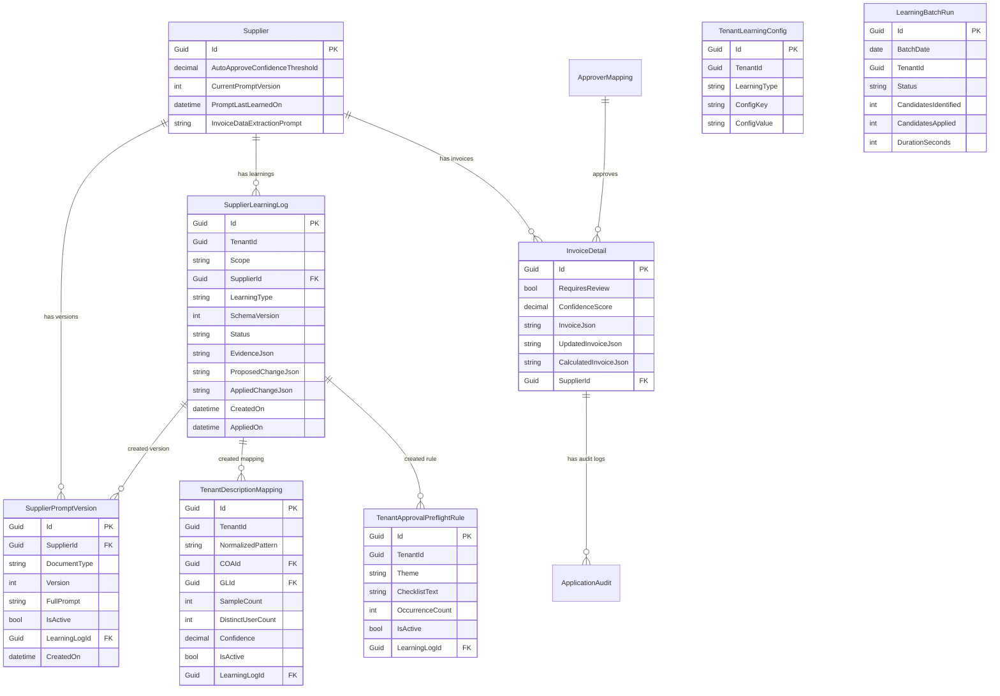

---

### 3.2 SupplierLearningLog — Status State Machine

Every learning log entry moves through a defined set of states. No backward transitions except `Applied → Reverted`.

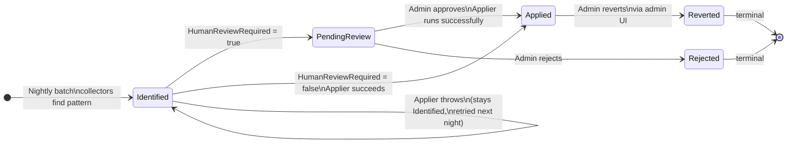

**Valid transitions summary:**

| From | To | Trigger |
| --- | --- | --- |
| — | Identified | Nightly batch collector finds pattern |
| Identified | PendingReview | `HumanReviewRequired = true` |
| Identified | Applied | `HumanReviewRequired = false`, applier succeeds |
| PendingReview | Applied | Admin clicks Approve, applier succeeds |
| PendingReview | Rejected | Admin clicks Reject |
| Applied | Reverted | Admin clicks Revert |

---

### 3.3 DDL — New Tables (Tenant Schema)

```sql
-- SupplierLearningLog
CREATE TABLE [tnt_schema].[SupplierLearningLog] (
    [Id]                  UNIQUEIDENTIFIER NOT NULL DEFAULT NEWSEQUENTIALID(),
    [TenantId]            UNIQUEIDENTIFIER NOT NULL,
    [Scope]               NVARCHAR(20)     NOT NULL,   -- 'Supplier' | 'Tenant' | 'Global'
    [SupplierId]          UNIQUEIDENTIFIER NULL,
    [LearningType]        NVARCHAR(100)    NOT NULL,
    [SchemaVersion]       INT              NOT NULL DEFAULT 1,
    [Status]              NVARCHAR(30)     NOT NULL,   -- 'Identified' | 'PendingReview' |
                                                       -- 'Applied' | 'Rejected' | 'Reverted'
    [EvidenceJson]        NVARCHAR(MAX)    NOT NULL,
    [ProposedChangeJson]  NVARCHAR(MAX)    NOT NULL,
    [AppliedChangeJson]   NVARCHAR(MAX)    NULL,
    [TriggeredBy]         NVARCHAR(100)    NOT NULL DEFAULT 'NightlyBatch',
    [ApprovedBy]          NVARCHAR(450)    NULL,
    [RejectedBy]          NVARCHAR(450)    NULL,
    [RevertedBy]          NVARCHAR(450)    NULL,
    [Notes]               NVARCHAR(1000)   NULL,
    [CreatedOn]           DATETIME2        NOT NULL DEFAULT GETUTCDATE(),
    [AppliedOn]           DATETIME2        NULL,
    [RevertedOn]          DATETIME2        NULL,
    CONSTRAINT [PK_SupplierLearningLog] PRIMARY KEY ([Id]),
    CONSTRAINT [FK_SupplierLearningLog_Supplier]
        FOREIGN KEY ([SupplierId]) REFERENCES [tnt_schema].[Supplier]([Id])
        ON DELETE SET NULL
);
CREATE INDEX [IX_SupplierLearningLog_Supplier_Type_Status]
    ON [tnt_schema].[SupplierLearningLog] ([SupplierId], [LearningType], [Status]);
CREATE INDEX [IX_SupplierLearningLog_Tenant_Status]
    ON [tnt_schema].[SupplierLearningLog] ([TenantId], [Status]);

-- SupplierPromptVersion
CREATE TABLE [tnt_schema].[SupplierPromptVersion] (
    [Id]             UNIQUEIDENTIFIER NOT NULL DEFAULT NEWSEQUENTIALID(),
    [SupplierId]     UNIQUEIDENTIFIER NOT NULL,
    [DocumentType]   NVARCHAR(20)     NOT NULL,  -- 'Invoice' | 'CreditNote' | 'Statement'
    [Version]        INT              NOT NULL,
    [FullPrompt]     NVARCHAR(MAX)    NOT NULL,
    [IsActive]       BIT              NOT NULL DEFAULT 0,
    [LearningLogId]  UNIQUEIDENTIFIER NULL,
    [CreatedOn]      DATETIME2        NOT NULL DEFAULT GETUTCDATE(),
    [CreatedBy]      NVARCHAR(450)    NOT NULL DEFAULT 'LearningAgent',
    CONSTRAINT [PK_SupplierPromptVersion] PRIMARY KEY ([Id]),
    CONSTRAINT [FK_SupplierPromptVersion_Supplier]
        FOREIGN KEY ([SupplierId]) REFERENCES [tnt_schema].[Supplier]([Id])
        ON DELETE CASCADE,
    CONSTRAINT [FK_SupplierPromptVersion_LearningLog]
        FOREIGN KEY ([LearningLogId]) REFERENCES [tnt_schema].[SupplierLearningLog]([Id])
        ON DELETE SET NULL
);
CREATE UNIQUE INDEX [UX_SupplierPromptVersion_Supplier_Type_Version]
    ON [tnt_schema].[SupplierPromptVersion] ([SupplierId], [DocumentType], [Version]);
CREATE INDEX [IX_SupplierPromptVersion_Active]
    ON [tnt_schema].[SupplierPromptVersion] ([SupplierId], [DocumentType], [IsActive]);

-- TenantDescriptionMapping
CREATE TABLE [tnt_schema].[TenantDescriptionMapping] (
    [Id]                 UNIQUEIDENTIFIER NOT NULL DEFAULT NEWSEQUENTIALID(),
    [TenantId]           UNIQUEIDENTIFIER NOT NULL,
    [NormalizedPattern]  NVARCHAR(500)    NOT NULL,
    [COAId]              UNIQUEIDENTIFIER NULL,
    [GLId]               UNIQUEIDENTIFIER NULL,
    [SampleCount]        INT              NOT NULL DEFAULT 0,
    [DistinctUserCount]  INT              NOT NULL DEFAULT 0,
    [Confidence]         DECIMAL(18,5)    NOT NULL DEFAULT 0,
    [IsActive]           BIT              NOT NULL DEFAULT 1,
    [LearningLogId]      UNIQUEIDENTIFIER NOT NULL,
    [CreatedOn]          DATETIME2        NOT NULL DEFAULT GETUTCDATE(),
    [ModifiedOn]         DATETIME2        NULL,
    CONSTRAINT [PK_TenantDescriptionMapping] PRIMARY KEY ([Id]),
    CONSTRAINT [FK_TenantDescriptionMapping_COA]
        FOREIGN KEY ([COAId]) REFERENCES [tnt_schema].[ChartOfAccount]([Id])
        ON DELETE SET NULL,
    CONSTRAINT [FK_TenantDescriptionMapping_GL]
        FOREIGN KEY ([GLId]) REFERENCES [tnt_schema].[GeneralLedger]([Id])
        ON DELETE SET NULL,
    CONSTRAINT [FK_TenantDescriptionMapping_LearningLog]
        FOREIGN KEY ([LearningLogId]) REFERENCES [tnt_schema].[SupplierLearningLog]([Id])
        ON DELETE NO ACTION
);
CREATE INDEX [IX_TenantDescriptionMapping_Pattern_Active]
    ON [tnt_schema].[TenantDescriptionMapping] ([NormalizedPattern], [IsActive]);

-- TenantApprovalPreflightRule
CREATE TABLE [tnt_schema].[TenantApprovalPreflightRule] (
    [Id]               UNIQUEIDENTIFIER NOT NULL DEFAULT NEWSEQUENTIALID(),
    [TenantId]         UNIQUEIDENTIFIER NOT NULL,
    [Theme]            NVARCHAR(50)     NOT NULL,  -- 'WRONG_SUPPLIER' | 'AMOUNT_MISMATCH' |
                                                   -- 'MISSING_COST_CENTRE' | 'MISSING_GL_CODE' |
                                                   -- 'DUPLICATE' | 'WRONG_DATE' |
                                                   -- 'TAX_INCORRECT' | 'PO_MISMATCH' | 'OTHER'
    [ChecklistText]    NVARCHAR(200)    NOT NULL,
    [OccurrenceCount]  INT              NOT NULL DEFAULT 0,
    [SampleRemarksJson] NVARCHAR(MAX)   NULL,
    [IsActive]         BIT              NOT NULL DEFAULT 1,
    [LearningLogId]    UNIQUEIDENTIFIER NOT NULL,
    [CreatedOn]        DATETIME2        NOT NULL DEFAULT GETUTCDATE(),
    [ModifiedOn]       DATETIME2        NULL,
    CONSTRAINT [PK_TenantApprovalPreflightRule] PRIMARY KEY ([Id]),
    CONSTRAINT [FK_TenantApprovalPreflightRule_LearningLog]
        FOREIGN KEY ([LearningLogId]) REFERENCES [tnt_schema].[SupplierLearningLog]([Id])
        ON DELETE NO ACTION
);
CREATE UNIQUE INDEX [UX_TenantApprovalPreflightRule_TenantTheme]
    ON [tnt_schema].[TenantApprovalPreflightRule] ([TenantId], [Theme])
    WHERE [IsActive] = 1;

-- TenantLearningConfig  (also in tenant schema)
CREATE TABLE [tnt_schema].[TenantLearningConfig] (
    [Id]           UNIQUEIDENTIFIER NOT NULL DEFAULT NEWSEQUENTIALID(),
    [TenantId]     UNIQUEIDENTIFIER NOT NULL,
    [LearningType] NVARCHAR(100)    NOT NULL,
    [ConfigKey]    NVARCHAR(100)    NOT NULL,
    [ConfigValue]  NVARCHAR(500)    NOT NULL,
    [CreatedOn]    DATETIME2        NOT NULL DEFAULT GETUTCDATE(),
    [ModifiedOn]   DATETIME2        NULL,
    CONSTRAINT [PK_TenantLearningConfig] PRIMARY KEY ([Id])
);
CREATE UNIQUE INDEX [UX_TenantLearningConfig_TypeKey]
    ON [tnt_schema].[TenantLearningConfig] ([TenantId], [LearningType], [ConfigKey]);
```

---

### 3.3 DDL — New Tables (Master Schema)

```sql
-- LearningBatchRun  (master DB, not tenant schema)
CREATE TABLE [dbo].[LearningBatchRun] (
    [Id]                   UNIQUEIDENTIFIER NOT NULL DEFAULT NEWSEQUENTIALID(),
    [BatchDate]            DATE             NOT NULL,
    [TenantId]             UNIQUEIDENTIFIER NOT NULL,
    [Status]               NVARCHAR(20)     NOT NULL,  -- 'Success' | 'Failed' |
                                                       -- 'Skipped' | 'PartialFailure'
    [CandidatesIdentified] INT              NOT NULL DEFAULT 0,
    [CandidatesApplied]    INT              NOT NULL DEFAULT 0,
    [CandidatesPending]    INT              NOT NULL DEFAULT 0,
    [CandidatesRejected]   INT              NOT NULL DEFAULT 0,
    [ErrorMessage]         NVARCHAR(MAX)    NULL,
    [DurationSeconds]      INT              NOT NULL DEFAULT 0,
    [CreatedOn]            DATETIME2        NOT NULL DEFAULT GETUTCDATE(),
    CONSTRAINT [PK_LearningBatchRun] PRIMARY KEY ([Id])
);
CREATE INDEX [IX_LearningBatchRun_TenantDate]
    ON [dbo].[LearningBatchRun] ([TenantId], [BatchDate] DESC);
CREATE INDEX [IX_LearningBatchRun_DateStatus]
    ON [dbo].[LearningBatchRun] ([BatchDate] DESC, [Status]);
```

---

### 3.4 DDL — Modified Existing Entities

```sql
-- Supplier: three new columns
ALTER TABLE [tnt_schema].[Supplier]
    ADD [AutoApproveConfidenceThreshold] DECIMAL(18,5) NULL,
        [CurrentPromptVersion]           INT           NOT NULL DEFAULT 1,
        [PromptLastLearnedOn]            DATETIME2     NULL;

-- InvoiceDetail: one new column
ALTER TABLE [tnt_schema].[InvoiceDetail]
    ADD [RequiresReview] BIT NOT NULL DEFAULT 0;
CREATE INDEX [IX_InvoiceDetail_RequiresReview]
    ON [tnt_schema].[InvoiceDetail] ([RequiresReview])
    WHERE [RequiresReview] = 1;
```

---

### 3.5 Seed Data — Default TenantLearningConfig Rows

Inserted once per tenant on onboarding (or backfilled for existing tenants in Phase 1 migration):

```sql
INSERT INTO [tnt_schema].[TenantLearningConfig]
    ([Id], [TenantId], [LearningType], [ConfigKey], [ConfigValue])
VALUES
-- Global flags
(NEWID(), @TenantId, 'Global', 'AgentEnabled',        'true'),
(NEWID(), @TenantId, 'Global', 'HumanReviewRequired', 'true'),
-- L1: GL Default
(NEWID(), @TenantId, 'GLDefault',           'IsEnabled',       'true'),
(NEWID(), @TenantId, 'GLDefault',           'MinCorrections',  '3'),
(NEWID(), @TenantId, 'GLDefault',           'LookbackDays',    '90'),
-- L2: Extraction Prompt
(NEWID(), @TenantId, 'ExtractionPrompt',    'IsEnabled',       'true'),
(NEWID(), @TenantId, 'ExtractionPrompt',    'MinCorrections',  '3'),
(NEWID(), @TenantId, 'ExtractionPrompt',    'LookbackDays',    '90'),
-- L3: Description Mapping
(NEWID(), @TenantId, 'DescriptionMapping',  'IsEnabled',       'true'),
(NEWID(), @TenantId, 'DescriptionMapping',  'MinCorrections',  '3'),
(NEWID(), @TenantId, 'DescriptionMapping',  'MinDistinctUsers','2'),
(NEWID(), @TenantId, 'DescriptionMapping',  'LookbackDays',    '90'),
-- L5: Preflight Rules
(NEWID(), @TenantId, 'PreflightRules',      'IsEnabled',       'true'),
(NEWID(), @TenantId, 'PreflightRules',      'MinOccurrences',  '5'),
(NEWID(), @TenantId, 'PreflightRules',      'LookbackDays',    '90'),
-- L6: Confidence Threshold
(NEWID(), @TenantId, 'ConfidenceThreshold', 'IsEnabled',          'true'),
(NEWID(), @TenantId, 'ConfidenceThreshold', 'CorrectionRateThreshold', '0.20'),
(NEWID(), @TenantId, 'ConfidenceThreshold', 'MinInvoiceVolume',   '5'),
(NEWID(), @TenantId, 'ConfidenceThreshold', 'LookbackDays',       '90'),
(NEWID(), @TenantId, 'ConfidenceThreshold', 'DefaultThreshold',   '0.75'),
(NEWID(), @TenantId, 'ConfidenceThreshold', 'MaxThreshold',       '0.95');
```

---

## 4. Architecture

### 4.1 Registry Pattern — Self-Registration Flow

Each learning type registers itself at Python import time. The batch runner discovers all registered types dynamically — it never needs to be modified when a new learning type is added.

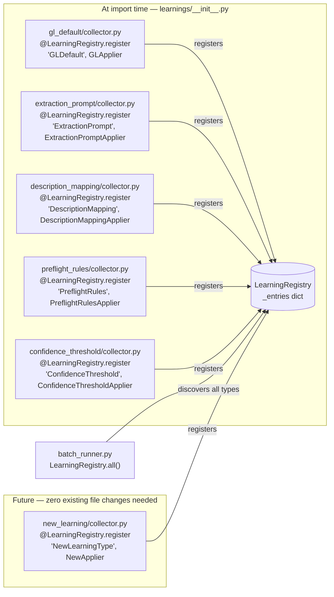

---

### 4.2 File Structure

```
Fintropi.AIAgent/
  function_app.py                    ← add 2 new trigger registrations
  learning/
    __init__.py                      ← imports all learnings (triggers self-registration)
    registry.py                      ← LearningRegistry class — NEVER changes
    batch_runner.py                  ← run_for_tenant() — NEVER changes
    base/
      __init__.py
      base_collector.py              ← BaseSignalCollector (ABC)
      base_applier.py                ← BaseApplier (ABC)
      tenant_context.py              ← TenantContext dataclass
      learning_candidate.py          ← LearningCandidate dataclass
    learnings/
      __init__.py                    ← imports each learning folder (triggers registration)
      gl_default/
        __init__.py
        collector.py                 ← GLSignalCollector — self-registers as 'GLDefault'
        applier.py                   ← GLApplier
      extraction_prompt/
        __init__.py
        collector.py                 ← ExtractionPromptCollector
        applier.py                   ← ExtractionPromptApplier
      description_mapping/
        __init__.py
        collector.py                 ← DescriptionMappingCollector
        applier.py                   ← DescriptionMappingApplier
      preflight_rules/
        __init__.py
        collector.py                 ← PreflightRulesCollector
        applier.py                   ← PreflightRulesApplier
      confidence_threshold/
        __init__.py
        collector.py                 ← ConfidenceThresholdCollector
        applier.py                   ← ConfidenceThresholdApplier
    services/
      __init__.py
      learning_log_service.py        ← CRUD for SupplierLearningLog
      prompt_version_service.py      ← save / activate / diff for SupplierPromptVersion
      tenant_config_service.py       ← read TenantLearningConfig with defaults fallback
      batch_run_service.py           ← write LearningBatchRun rows
      db_service.py                  ← shared DB connection helper (reuse existing pattern)
```

---

### 4.3 Azure Function Registrations (`function_app.py` additions)

```python
# Add to existing function_app.py

@app.timer_trigger(
    schedule="0 0 2 * * *",     # 02:00 UTC daily
    arg_name="timer",
    run_on_startup=False
)
def learning_batch_scheduler(timer: func.TimerRequest) -> None:
    from learning.batch_runner import enqueue_all_tenants
    enqueue_all_tenants()

@app.queue_trigger(
    queue_name="learning-agent-queue",
    connection="QueueConnectionString",
    arg_name="msg"
)
def learning_batch_worker(msg: func.QueueMessage) -> None:
    import json
    from learning.batch_runner import run_for_tenant
    payload = json.loads(msg.get_body().decode())
    run_for_tenant(tenant_id=payload["tenant_id"])
```

---

### 4.4 Registry Implementation

```python
# learning/registry.py

class LearningRegistry:
    _entries: dict[str, tuple[type, type]] = {}

    @classmethod
    def register(cls, learning_type: str, applier_cls: type):
        """Decorator. Applied to collector class at module import time."""
        def decorator(collector_cls: type) -> type:
            cls._entries[learning_type] = (collector_cls, applier_cls)
            return collector_cls
        return decorator

    @classmethod
    def all(cls) -> list[tuple[str, type, type]]:
        """Returns (learning_type, CollectorCls, ApplierCls) for all registered types."""
        return [(t, c, a) for t, (c, a) in cls._entries.items()]

    @classmethod
    def get(cls, learning_type: str) -> tuple[type, type]:
        """Returns (CollectorCls, ApplierCls) or raises KeyError."""
        if learning_type not in cls._entries:
            raise KeyError(f"No learning type registered: {learning_type}")
        return cls._entries[learning_type]
```

---

### 4.5 Batch Runner

```python
# learning/batch_runner.py
import json, logging
import learning.learnings  # side-effect: triggers all self-registrations

from learning.registry import LearningRegistry
from learning.services.tenant_config_service import TenantConfigService
from learning.services.learning_log_service import LearningLogService
from learning.services.batch_run_service import BatchRunService
from learning.base.tenant_context import TenantContext

logger = logging.getLogger(__name__)

def enqueue_all_tenants() -> None:
    """Called by timer trigger. Enqueues one message per active tenant."""
    from learning.services.db_service import get_master_db
    db = get_master_db()
    tenants = db.query("SELECT Id FROM Tenant WHERE IsActive = 1 AND IsDeleted = 0")
    queue = get_queue_client("learning-agent-queue")
    for tenant in tenants:
        payload = json.dumps({"tenant_id": str(tenant.Id)})
        queue.send_message(base64_encode(payload))
    logger.info(f"Enqueued {len(tenants)} tenant(s) for learning batch")

def run_for_tenant(tenant_id: str) -> None:
    """Called by queue trigger. Processes one tenant end-to-end."""
    start = time.time()
    ctx = TenantContext.load(tenant_id)

    if ctx.config.get("Global", "AgentEnabled", default="true").lower() != "true":
        BatchRunService.record(tenant_id, status="Skipped", duration=0)
        return

    all_candidates, errors = [], []
    for learning_type, CollectorCls, _ in LearningRegistry.all():
        type_config = ctx.config.for_type(learning_type)
        if type_config.get("IsEnabled", "true").lower() != "true":
            continue
        try:
            collector = CollectorCls(type_config)
            candidates = collector.collect(ctx)
            all_candidates.extend(candidates)
        except Exception as e:
            logger.error(f"Collector {learning_type} failed for tenant {tenant_id}: {e}")
            errors.append(str(e))

    log_service = LearningLogService(ctx)
    log_service.write_identified(all_candidates)

    applied_count = 0
    human_review = ctx.config.get("Global", "HumanReviewRequired", "true").lower() == "true"
    if not human_review:
        for candidate in all_candidates:
            try:
                _, ApplierCls = LearningRegistry.get(candidate.learning_type)
                ApplierCls().apply(candidate, ctx)
                applied_count += 1
            except Exception as e:
                logger.error(f"Applier {candidate.learning_type} failed: {e}")
                errors.append(str(e))

    status = "Success" if not errors else ("PartialFailure" if applied_count > 0 else "Failed")
    BatchRunService.record(
        tenant_id=tenant_id,
        status=status,
        candidates_identified=len(all_candidates),
        candidates_applied=applied_count,
        candidates_pending=len(all_candidates) - applied_count if human_review else 0,
        error_message="; ".join(errors) if errors else None,
        duration=int(time.time() - start)
    )
```

---

## 5. Base Interfaces (Python)

### 5.1 TenantContext

```python
# learning/base/tenant_context.py
from dataclasses import dataclass, field

@dataclass
class TenantContext:
    tenant_id: str
    tenant_name: str
    connection_string: str
    config: 'TenantConfigService'
    db: 'TenantDbAccessor'         # thin wrapper over pyodbc / sqlalchemy

    @classmethod
    def load(cls, tenant_id: str) -> 'TenantContext':
        """Loads tenant record from master DB and builds context."""
        master_db = get_master_db()
        tenant = master_db.query_one(
            "SELECT * FROM Tenant WHERE Id = :id AND IsActive = 1", id=tenant_id
        )
        config = TenantConfigService(tenant_id, decrypt(tenant.ConnectionString))
        db     = TenantDbAccessor(decrypt(tenant.ConnectionString), tenant.TableSchema)
        return cls(
            tenant_id=tenant_id,
            tenant_name=tenant.TenantName,
            connection_string=decrypt(tenant.ConnectionString),
            config=config,
            db=db
        )
```

---

### 5.2 LearningCandidate

```python
# learning/base/learning_candidate.py
from dataclasses import dataclass, field

@dataclass
class LearningCandidate:
    learning_type:      str
    scope:              str            # 'Supplier' | 'Tenant' | 'Global'
    entity_id:          str            # SupplierId (Supplier/Global) or TenantId (Tenant)
    schema_version:     int
    evidence:           dict           # type-specific — serialised → EvidenceJson
    proposed_change:    dict           # type-specific — serialised → ProposedChangeJson
    consumed_audit_ids: list[str] = field(default_factory=list)
    log_id:             str | None = None   # set after write_identified()
```

---

### 5.3 BaseSignalCollector

```python
# learning/base/base_collector.py
from abc import ABC, abstractmethod

class BaseSignalCollector(ABC):
    SCHEMA_VERSION: int = 1
    DEFAULT_CONFIG: dict[str, str] = {}

    def __init__(self, config: dict[str, str]):
        self.config = config

    @abstractmethod
    def collect(self, ctx: TenantContext) -> list[LearningCandidate]:
        """
        Query ApplicationAudit / ApproverMapping for correction signals.
        Exclude audit IDs already consumed by applied SupplierLearningLog entries.
        Return one LearningCandidate per identified pattern.
        """
        ...

    def _get_consumed_ids(self, ctx: TenantContext, learning_type: str,
                          entity_id: str) -> set[str]:
        """Returns set of audit IDs already consumed by applied rules of this type."""
        rows = ctx.db.query("""
            SELECT JSON_VALUE(value, '$') AS AuditId
            FROM SupplierLearningLog sll
            CROSS APPLY OPENJSON(sll.EvidenceJson, '$.consumed_audit_ids')
            WHERE sll.LearningType = :lt
              AND sll.Status IN ('Applied', 'PendingReview')
              AND (sll.SupplierId = :eid OR sll.TenantId = :eid)
        """, lt=learning_type, eid=entity_id)
        return {r.AuditId for r in rows}
```

---

### 5.4 BaseApplier

```python
# learning/base/base_applier.py
from abc import ABC, abstractmethod

class BaseApplier(ABC):

    @abstractmethod
    def apply(self, candidate: LearningCandidate, ctx: TenantContext) -> None:
        """
        Write the proposed change to the database.
        Update SupplierLearningLog.Status = 'Applied' and AppliedChangeJson.
        Must be idempotent: calling twice must not create duplicate state.
        """
        ...

    @abstractmethod
    def revert(self, log_entry: 'SupplierLearningLog', ctx: TenantContext) -> None:
        """
        Undo the applied change using AppliedChangeJson.
        Update SupplierLearningLog.Status = 'Reverted'.
        """
        ...
```

---

## 6. Service Layer

### 6.1 LearningLogService (Python)

```python
# learning/services/learning_log_service.py

class LearningLogService:
    def __init__(self, ctx: TenantContext):
        self.ctx = ctx

    def write_identified(self, candidates: list[LearningCandidate]) -> None:
        """Writes all candidates as Status=Identified. Sets candidate.log_id."""
        for c in candidates:
            row_id = str(uuid4())
            self.ctx.db.execute("""
                INSERT INTO SupplierLearningLog
                    (Id, TenantId, Scope, SupplierId, LearningType, SchemaVersion,
                     Status, EvidenceJson, ProposedChangeJson, TriggeredBy, CreatedOn)
                VALUES
                    (:id, :tid, :scope, :sid, :lt, :sv,
                     'Identified', :ev, :pc, 'NightlyBatch', GETUTCDATE())
            """,
            id=row_id, tid=self.ctx.tenant_id, scope=c.scope,
            sid=c.entity_id if c.scope == 'Supplier' else None,
            lt=c.learning_type, sv=c.schema_version,
            ev=json.dumps({**c.evidence,
                           "consumed_audit_ids": c.consumed_audit_ids}),
            pc=json.dumps(c.proposed_change))
            c.log_id = row_id

    def mark_pending_review(self, log_id: str) -> None:
        self.ctx.db.execute(
            "UPDATE SupplierLearningLog SET Status='PendingReview' WHERE Id=:id",
            id=log_id)

    def mark_applied(self, log_id: str, applied_change: dict,
                     approved_by: str | None = None) -> None:
        self.ctx.db.execute("""
            UPDATE SupplierLearningLog
            SET Status='Applied', AppliedChangeJson=:ac,
                AppliedOn=GETUTCDATE(), ApprovedBy=:ab
            WHERE Id=:id
        """, ac=json.dumps(applied_change), ab=approved_by, id=log_id)

    def mark_rejected(self, log_id: str, rejected_by: str) -> None:
        self.ctx.db.execute(
            "UPDATE SupplierLearningLog SET Status='Rejected', RejectedBy=:rb WHERE Id=:id",
            rb=rejected_by, id=log_id)

    def mark_reverted(self, log_id: str, reverted_by: str) -> None:
        self.ctx.db.execute(
            "UPDATE SupplierLearningLog SET Status='Reverted', RevertedBy=:rb, RevertedOn=GETUTCDATE() WHERE Id=:id",
            rb=reverted_by, id=log_id)
```

---

### 6.2 PromptVersionService (Python)

```python
# learning/services/prompt_version_service.py

class PromptVersionService:
    def __init__(self, ctx: TenantContext):
        self.ctx = ctx

    def save(self, supplier_id: str, document_type: str, version: int,
             full_prompt: str, is_active: bool,
             learning_log_id: str | None = None,
             created_by: str = 'LearningAgent') -> None:
        self.ctx.db.execute("""
            INSERT INTO SupplierPromptVersion
                (Id, SupplierId, DocumentType, Version, FullPrompt,
                 IsActive, LearningLogId, CreatedOn, CreatedBy)
            VALUES (NEWID(), :sid, :dt, :v, :fp, :ia, :llid, GETUTCDATE(), :cb)
        """, sid=supplier_id, dt=document_type, v=version, fp=full_prompt,
        ia=1 if is_active else 0, llid=learning_log_id, cb=created_by)

    def activate(self, supplier_id: str, document_type: str, version: int) -> str:
        """Activates target version, deactivates all others. Returns the full prompt."""
        self.ctx.db.execute("""
            UPDATE SupplierPromptVersion
            SET IsActive = CASE WHEN Version = :v THEN 1 ELSE 0 END
            WHERE SupplierId = :sid AND DocumentType = :dt
        """, v=version, sid=supplier_id, dt=document_type)

        row = self.ctx.db.query_one("""
            SELECT FullPrompt FROM SupplierPromptVersion
            WHERE SupplierId=:sid AND DocumentType=:dt AND Version=:v
        """, sid=supplier_id, dt=document_type, v=version)

        self.ctx.db.execute("""
            UPDATE Supplier
            SET InvoiceDataExtractionPrompt=:fp,
                CurrentPromptVersion=:v,
                PromptLastLearnedOn=GETUTCDATE()
            WHERE Id=:sid
        """, fp=row.FullPrompt, v=version, sid=supplier_id)
        return row.FullPrompt
```

---

### 6.3 TenantConfigService (Python)

```python
# learning/services/tenant_config_service.py

class TenantConfigService:
    def __init__(self, tenant_id: str, connection_string: str):
        self._tenant_id = tenant_id
        self._conn = connection_string
        self._rows: dict[tuple, str] = {}
        self._load()

    def _load(self) -> None:
        rows = db_query(self._conn, """
            SELECT LearningType, ConfigKey, ConfigValue
            FROM TenantLearningConfig WHERE TenantId = :tid
        """, tid=self._tenant_id)
        self._rows = {(r.LearningType, r.ConfigKey): r.ConfigValue for r in rows}

    def get(self, learning_type: str, key: str, default: str = "") -> str:
        return self._rows.get((learning_type, key), default)

    def for_type(self, learning_type: str) -> dict[str, str]:
        """Returns merged dict: CollectorCls.DEFAULT_CONFIG + tenant DB overrides."""
        from learning.registry import LearningRegistry
        CollectorCls, _ = LearningRegistry.get(learning_type)
        merged = dict(CollectorCls.DEFAULT_CONFIG)
        for (lt, key), val in self._rows.items():
            if lt == learning_type:
                merged[key] = val
        return merged
```

---

### 6.4 IPreflightCheckService (C# — new interface)

```csharp
// Fintropi.UI/Services/Learning/IPreflightCheckService.cs
public interface IPreflightCheckService
{
    Task<IReadOnlyList<PreflightRuleDto>> GetActiveRulesAsync(Guid tenantId);
    Task LogAcknowledgementAsync(Guid invoiceId, IEnumerable<Guid> acknowledgedRuleIds,
                                  string userId);
}

public record PreflightRuleDto(Guid Id, string Theme, string ChecklistText);
```

```csharp
// Fintropi.UI/Services/Learning/PreflightCheckService.cs
public class PreflightCheckService : IPreflightCheckService
{
    private readonly Fintropi_TenantDBContext _db;
    private readonly IApplicationAuditService _auditService;

    public async Task<IReadOnlyList<PreflightRuleDto>> GetActiveRulesAsync(Guid tenantId)
        => await _db.TenantApprovalPreflightRules
            .Where(r => r.TenantId == tenantId && r.IsActive)
            .Select(r => new PreflightRuleDto(r.Id, r.Theme, r.ChecklistText))
            .ToListAsync();

    public async Task LogAcknowledgementAsync(Guid invoiceId,
        IEnumerable<Guid> acknowledgedRuleIds, string userId)
    {
        var audits = acknowledgedRuleIds.Select(ruleId => new ApplicationAudit
        {
            EntityType  = "INVOICE_DETAILS",
            EntityId    = invoiceId,
            Action      = "PREFLIGHT_ACKNOWLEDGED",
            PropertyName = ruleId.ToString(),
            NewValue    = "acknowledged",
            PerformedBy = userId,
            ProcessStartTimeStamp = DateTime.UtcNow
        });
        await _auditService.PersistManyAsync(audits);
    }
}
```

---

### 6.5 ILearningAdminService (C# — new interface)

Called by the admin API to approve, reject, and revert learning log entries.

```csharp
// Fintropi.UI/Services/Learning/ILearningAdminService.cs
public interface ILearningAdminService
{
    Task<PagedResult<LearningLogDto>> GetPendingAsync(Guid tenantId, int page, int pageSize);
    Task<PagedResult<LearningLogDto>> GetAppliedAsync(Guid tenantId, int page, int pageSize);
    Task ApproveAsync(Guid logId, string approvedBy);
    Task RejectAsync(Guid logId, string rejectedBy);
    Task RevertAsync(Guid logId, string revertedBy);
    Task<IReadOnlyList<PromptVersionDto>> GetPromptVersionsAsync(Guid supplierId);
    Task ActivatePromptVersionAsync(Guid supplierId, string documentType, int version, string activatedBy);
    Task<IReadOnlyList<BatchHealthDto>> GetBatchHealthAsync(Guid tenantId, int days);
}
```

### Admin Approve / Reject / Revert — Sequence Diagram

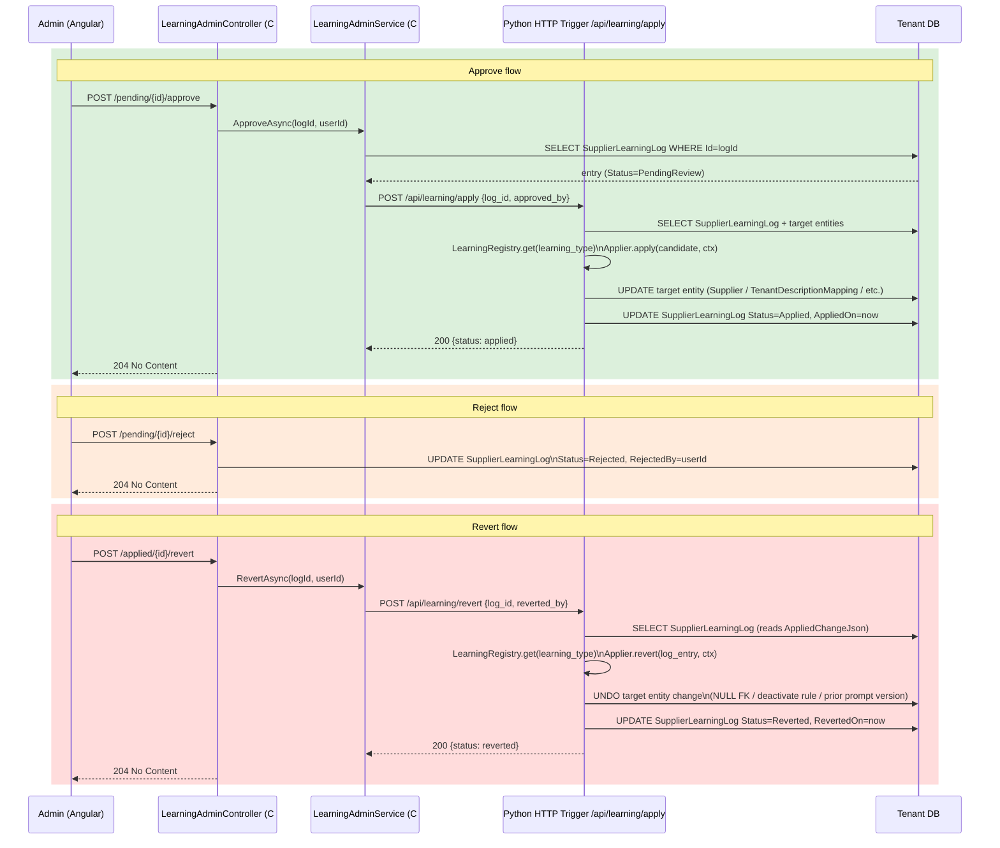

---

The `ApproveAsync` implementation calls the Python learning applier via an HTTP trigger on the Azure Function (avoids reimplementing applier logic in C#):

```csharp
public async Task ApproveAsync(Guid logId, string approvedBy)
{
    var log = await _db.SupplierLearningLogs.FindAsync(logId)
        ?? throw new NotFoundException(logId);
    if (log.Status != "PendingReview")
        throw new InvalidOperationException($"Cannot approve log with status {log.Status}");

    // Call Python applier via HTTP trigger
    var response = await _httpClient.PostAsJsonAsync(
        $"{_aiAgentBaseUrl}/api/learning/apply",
        new { log_id = logId, approved_by = approvedBy });
    response.EnsureSuccessStatusCode();
}
```

---

## 7. Learning Types — Detailed Spec

### 7.1 Learning 1 — GL/COA Default

**Config keys:** `MinCorrections` (int, default 3), `LookbackDays` (int, default 90)

**EvidenceJson schema v1:**
```json
{
  "schema_version": 1,
  "field": "AccountCode",
  "display_value": "5010 - IT Equipment",
  "correction_count": 4,
  "consumed_audit_ids": ["guid1", "guid2", "guid3", "guid4"]
}
```

**ProposedChangeJson schema:**
```json
{
  "field": "AccountCode",
  "resolved_id": "guid-of-coa-record",
  "display_value": "5010 - IT Equipment"
}
```

**Signal query:**
```sql
SELECT
    inv.SupplierId,
    ia.PropertyName,
    ia.NewValue,
    COUNT(*)              AS CorrectionCount,
    STRING_AGG(CAST(ia.Id AS NVARCHAR(36)), ',') AS AuditIds
FROM ApplicationAudit ia
JOIN InvoiceDetail inv ON inv.Id = ia.EntityId
WHERE ia.Action = 'UPDATED'
  AND ia.PropertyName IN ('AccountCode','GLCode','PC','CC')
  AND ia.ProcessStartTimeStamp >= DATEADD(day, -:lookback_days, GETUTCDATE())
  AND ia.Id NOT IN (
      SELECT JSON_VALUE(val.value, '$')
      FROM SupplierLearningLog sll
      CROSS APPLY OPENJSON(sll.EvidenceJson, '$.consumed_audit_ids') val
      WHERE sll.LearningType = 'GLDefault'
        AND sll.Status IN ('Applied', 'PendingReview')
        AND sll.SupplierId = inv.SupplierId
  )
GROUP BY inv.SupplierId, ia.PropertyName, ia.NewValue
HAVING COUNT(*) >= :min_corrections
```

**Resolve NewValue to Guid:**
```python
def _resolve_id(self, field: str, display_value: str, ctx: TenantContext) -> str | None:
    table_map = {
        "AccountCode": ("ChartOfAccount", "Name"),
        "GLCode":      ("GeneralLedger",  "Description"),
        "PC":          ("ProfitCenter",   "Name"),
        "CC":          ("CostCenter",     "Name"),
    }
    table, col = table_map[field]
    # display_value format: "CODE - Name" or just "Name"
    name_part = display_value.split(' - ', 1)[-1] if ' - ' in display_value else display_value
    row = ctx.db.query_one(
        f"SELECT Id FROM {table} WHERE {col} = :n AND IsDeleted = 0", n=name_part)
    return str(row.Id) if row else None
```

**Apply:**
```python
FIELD_MAP = {"AccountCode": "AccountCodeId", "GLCode": "GLId",
             "PC": "PCId", "CC": "CCId"}

def apply(self, candidate: LearningCandidate, ctx: TenantContext) -> None:
    col = FIELD_MAP[candidate.evidence["field"]]
    ctx.db.execute(
        f"UPDATE Supplier SET [{col}] = :val WHERE Id = :sid",
        val=candidate.proposed_change["resolved_id"],
        sid=candidate.entity_id)
    LearningLogService(ctx).mark_applied(
        candidate.log_id,
        applied_change={"field": col, "set_to": candidate.proposed_change["resolved_id"],
                        "previous": None}
    )

def revert(self, log_entry, ctx: TenantContext) -> None:
    change = json.loads(log_entry.AppliedChangeJson)
    ctx.db.execute(
        f"UPDATE Supplier SET [{change['field']}] = NULL WHERE Id = :sid",
        sid=log_entry.SupplierId)
    LearningLogService(ctx).mark_reverted(log_entry.Id, reverted_by=log_entry.RevertedBy)
```

**C# pipeline hook — HelperService.BuildCalculatedJsonAsync:**
```csharp
// Before calling Python post-processing agent:
var supplier = await _db.Suppliers.FindAsync(invoice.SupplierId);
if (supplier?.AccountCodeId.HasValue == true)
{
    calculatedJson["accountCodeId"] = supplier.AccountCodeId;
    calculatedJson["AccountCode"]   = await ResolveCodeInfoAsync(supplier.AccountCodeId.Value);
}
// Repeat for GLId, PCId, CCId
// Only call post-processing agent for fields not already filled
```

---

### 7.2 Learning 2 — Extraction Prompt Update

**Config keys:** `MinCorrections` (int, default 3), `LookbackDays` (int, default 90)

**Tracked fields:** `InvoiceDate`, `SupplierInvoiceId`, `VendorName`, `Currency`, `DueDate`

**EvidenceJson schema v1:**
```json
{
  "schema_version": 1,
  "corrections": [
    {
      "field": "InvoiceDate",
      "samples": [
        {"old": "Dec 31 2024", "new": "2024-12-31", "count": 3}
      ]
    }
  ],
  "consumed_audit_ids": ["guid1", "guid2", "guid3"]
}
```

**ProposedChangeJson schema:**
```json
{
  "from_version": 2,
  "addendum": "- For this supplier, InvoiceDate appears in the top-right corner labelled 'Invoice Date' in DD/MMM/YYYY format. Always convert to ISO 8601 (YYYY-MM-DD)."
}
```

**Signal query:**
```sql
SELECT inv.SupplierId, ia.PropertyName,
       ia.OldValue, ia.NewValue, COUNT(*) AS CorrectionCount,
       STRING_AGG(CAST(ia.Id AS NVARCHAR(36)), ',') AS AuditIds
FROM ApplicationAudit ia
JOIN InvoiceDetail inv ON inv.Id = ia.EntityId
WHERE ia.Action = 'UPDATED'
  AND ia.PropertyName IN ('InvoiceDate','SupplierInvoiceId','VendorName','Currency','DueDate')
  AND ia.ProcessStartTimeStamp >= DATEADD(day,-:lookback_days,GETUTCDATE())
  AND ia.Id NOT IN ( ... consumed IDs ... )
GROUP BY inv.SupplierId, ia.PropertyName, ia.OldValue, ia.NewValue
HAVING COUNT(*) >= :min_corrections
```

**GPT-4o prompt for addendum generation:**
```python
ADDENDUM_PROMPT = """
You are improving an invoice extraction prompt for a specific supplier.

Current extraction prompt:
---
{current_prompt}
---

Users have consistently corrected these fields after AI extraction. Each entry
shows what the AI extracted (old) and what users corrected it to (new), with
how many times this happened:

{corrections_table}

Write a concise addendum of up to 4 bullet points. Each bullet should give
specific, actionable guidance for this supplier's document format — such as
where on the document a field appears, what label surrounds it, or what format
it uses. Do not repeat guidance already present in the current prompt above.
Do not mention user corrections or that this was learned — write as if it is
original guidance.
"""
```

**Apply — full versioning sequence:**
```python
def apply(self, candidate: LearningCandidate, ctx: TenantContext) -> None:
    supplier = ctx.db.query_one("SELECT * FROM Supplier WHERE Id=:id",
                                id=candidate.entity_id)
    current_version = supplier.CurrentPromptVersion or 1
    current_prompt  = supplier.InvoiceDataExtractionPrompt or ""

    addendum = self._generate_addendum(current_prompt, candidate.evidence["corrections"])
    new_prompt = (current_prompt + f"\n\n## Learned {date.today()}\n{addendum}").strip()

    pv = PromptVersionService(ctx)
    # Archive current as inactive
    pv.save(supplier_id=candidate.entity_id, document_type="Invoice",
            version=current_version, full_prompt=current_prompt,
            is_active=False, learning_log_id=candidate.log_id)
    # Save new as active
    pv.save(supplier_id=candidate.entity_id, document_type="Invoice",
            version=current_version + 1, full_prompt=new_prompt,
            is_active=True, learning_log_id=candidate.log_id)
    # Update live field
    ctx.db.execute("""
        UPDATE Supplier
        SET InvoiceDataExtractionPrompt=:p,
            CurrentPromptVersion=:v,
            PromptLastLearnedOn=GETUTCDATE()
        WHERE Id=:sid
    """, p=new_prompt, v=current_version + 1, sid=candidate.entity_id)

    LearningLogService(ctx).mark_applied(
        candidate.log_id,
        applied_change={"from_version": current_version,
                        "to_version": current_version + 1,
                        "addendum": addendum}
    )

def revert(self, log_entry, ctx: TenantContext) -> None:
    change = json.loads(log_entry.AppliedChangeJson)
    PromptVersionService(ctx).activate(
        supplier_id=str(log_entry.SupplierId),
        document_type="Invoice",
        version=change["from_version"]
    )
    LearningLogService(ctx).mark_reverted(log_entry.Id, log_entry.RevertedBy)
```

### L2 — Prompt Versioning Sequence

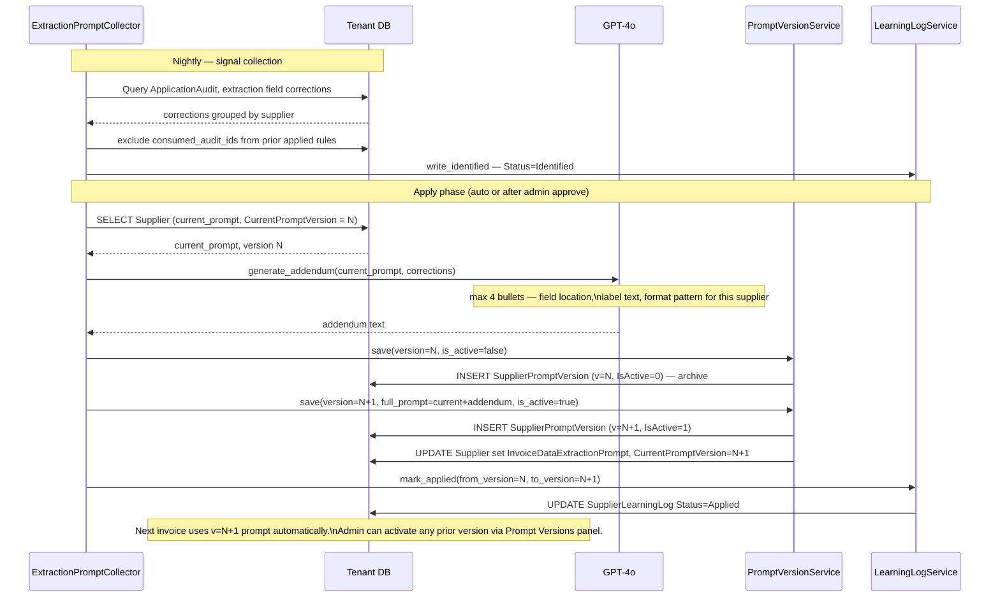

---

### 7.3 Learning 3 — Tenant Description → COA Mapping

**Config keys:** `MinCorrections` (int, default 3), `MinDistinctUsers` (int, default 2), `LookbackDays` (int, default 90)

**Normalization function:**
```python
import re

STOP_WORDS = {'the','for','of','and','a','an','to','in','on','with','from','by'}

def normalize_description(text: str) -> str:
    text = text.lower().strip()
    text = re.sub(r'[^\w\s]', '', text)      # remove punctuation
    text = re.sub(r'\d+', 'NUM', text)        # normalize numbers
    text = re.sub(r'\s+', ' ', text)           # collapse whitespace
    tokens = [w for w in text.split() if w not in STOP_WORDS]
    return ' '.join(tokens)
```

**Item index parser:**
```python
import re

def parse_item_index(property_name: str) -> int | None:
    """'Items 2 AccountCode' → 2"""
    m = re.match(r'^Items\s+(\d+)\s+', property_name)
    return int(m.group(1)) if m else None
```

**Signal collection (two-step):**
```python
def collect(self, ctx: TenantContext) -> list[LearningCandidate]:
    min_c = int(self.config["MinCorrections"])
    min_u = int(self.config["MinDistinctUsers"])
    days  = int(self.config["LookbackDays"])

    # Step 1: get line-item AccountCode corrections
    audits = ctx.db.query("""
        SELECT ia.Id, ia.EntityId, ia.PropertyName,
               ia.NewValue, ia.PerformedBy
        FROM ApplicationAudit ia
        WHERE ia.Action = 'UPDATED'
          AND ia.PropertyName LIKE 'Items%AccountCode'
          AND ia.ProcessStartTimeStamp >= DATEADD(day,-:days,GETUTCDATE())
          AND ia.Id NOT IN ( ... consumed IDs ... )
    """, days=days)

    # Step 2: resolve description from UpdatedInvoiceJson
    enriched = []
    for audit in audits:
        idx = parse_item_index(audit.PropertyName)
        if idx is None:
            continue
        inv = ctx.db.query_one(
            "SELECT UpdatedInvoiceJson FROM InvoiceDetail WHERE Id=:id",
            id=audit.EntityId)
        if not inv:
            continue
        items = json.loads(inv.UpdatedInvoiceJson or '{}').get("Items", [])
        if idx < len(items):
            desc = normalize_description(items[idx].get("Description", ""))
            if desc:
                enriched.append({**audit.__dict__, "normalized_desc": desc})

    # Step 3: group by (normalized_desc, coa_display)
    groups: dict[tuple, list] = defaultdict(list)
    for a in enriched:
        groups[(a["normalized_desc"], a["NewValue"])].append(a)

    candidates = []
    for (desc, coa_display), rows in groups.items():
        total = len(rows)
        distinct_users = len({r["PerformedBy"] for r in rows})
        if total >= min_c and distinct_users >= min_u:
            coa_id = self._resolve_coa_id(coa_display, ctx)
            if coa_id:
                candidates.append(LearningCandidate(
                    learning_type="DescriptionMapping", scope="Tenant",
                    entity_id=ctx.tenant_id, schema_version=self.SCHEMA_VERSION,
                    evidence={"normalized_pattern": desc, "coa_display": coa_display,
                              "sample_count": total, "distinct_users": distinct_users},
                    proposed_change={"normalized_pattern": desc, "coa_id": coa_id},
                    consumed_audit_ids=[r["Id"] for r in rows]
                ))
    return candidates
```

**Confidence calculation:**
```python
# Confidence = sample_count / total_occurrences_of_this_description_in_period
total_occurrences = ctx.db.query_one("""
    SELECT COUNT(*) AS cnt
    FROM ApplicationAudit ia
    JOIN InvoiceDetail inv ON inv.Id = ia.EntityId
    WHERE ia.PropertyName LIKE 'Items%AccountCode'
      AND ia.ProcessStartTimeStamp >= DATEADD(day,-:days,GETUTCDATE())
      -- filter by normalized description would require JSON parsing in SQL —
      -- compute in Python after fetching
""")
confidence = sample_count / max(total_occurrences.cnt, 1)
```

**C# pipeline hook — HelperService.BuildCalculatedJsonAsync:**
```csharp
// After AI assigns GL codes, per line item:
var items = calculatedJson["Items"] as JArray ?? new JArray();
var mappings = await _db.TenantDescriptionMappings
    .Where(m => m.IsActive)
    .ToListAsync();

foreach (var item in items)
{
    var raw = item["Description"]?.ToString() ?? "";
    var normalized = NormalizeDescription(raw);
    var match = mappings.FirstOrDefault(m => m.NormalizedPattern == normalized);
    if (match != null)
    {
        if (match.COAId.HasValue) item["accountCodeId"] = match.COAId;
        if (match.GLId.HasValue)  item["glCodeId"]      = match.GLId;
    }
}

// Normalization must match Python exactly:
private static string NormalizeDescription(string text)
{
    text = text.ToLowerInvariant().Trim();
    text = Regex.Replace(text, @"[^\w\s]", "");
    text = Regex.Replace(text, @"\d+", "NUM");
    text = Regex.Replace(text, @"\s+", " ");
    var stopWords = new HashSet<string>{"the","for","of","and","a","an","to","in","on","with","from","by"};
    return string.Join(" ", text.Split(' ').Where(w => !stopWords.Contains(w)));
}
```

---

### 7.4 Learning 5 — Approval Pre-flight Rules

**Config keys:** `MinOccurrences` (int, default 5), `LookbackDays` (int, default 90)

**Themes enum (string constants):**
```python
class PreflightTheme:
    WRONG_SUPPLIER       = "WRONG_SUPPLIER"
    AMOUNT_MISMATCH      = "AMOUNT_MISMATCH"
    MISSING_COST_CENTRE  = "MISSING_COST_CENTRE"
    MISSING_GL_CODE      = "MISSING_GL_CODE"
    DUPLICATE            = "DUPLICATE"
    WRONG_DATE           = "WRONG_DATE"
    TAX_INCORRECT        = "TAX_INCORRECT"
    PO_MISMATCH          = "PO_MISMATCH"
    OTHER                = "OTHER"
```

**GPT-4o classification prompt:**
```python
CLASSIFY_PROMPT = """
Classify each invoice rejection remark below into exactly one category.
For each remark, also generate a short checklist question (max 15 words) that
a reviewer should ask themselves before submitting an invoice for approval.
The question should be actionable and specific.

Categories:
- WRONG_SUPPLIER: remark indicates the wrong supplier is assigned
- AMOUNT_MISMATCH: remark indicates invoice amount is wrong or doesn't match PO
- MISSING_COST_CENTRE: remark indicates cost centre is missing or wrong
- MISSING_GL_CODE: remark indicates GL account code is missing or wrong
- DUPLICATE: remark indicates this invoice is a duplicate
- WRONG_DATE: remark indicates invoice date or due date is wrong
- TAX_INCORRECT: remark indicates VAT or tax amount is wrong
- PO_MISMATCH: remark indicates PO number is wrong or missing
- OTHER: does not fit above categories

Remarks and occurrence counts (JSON array):
{remarks_json}

Return a JSON array:
[
  {{
    "remark": "original remark text",
    "category": "CATEGORY_NAME",
    "checklist_question": "question text",
    "occurrences": N
  }}
]
Return ONLY the JSON array, no other text.
"""
```

**Apply:**
```python
def apply(self, candidate: LearningCandidate, ctx: TenantContext) -> None:
    theme = candidate.proposed_change["theme"]
    # Upsert: update if theme already exists, insert if not
    existing = ctx.db.query_one("""
        SELECT Id, OccurrenceCount FROM TenantApprovalPreflightRule
        WHERE TenantId=:tid AND Theme=:theme AND IsActive=1
    """, tid=ctx.tenant_id, theme=theme)

    if existing:
        ctx.db.execute("""
            UPDATE TenantApprovalPreflightRule
            SET ChecklistText=:ct, OccurrenceCount=:oc,
                SampleRemarksJson=:sr, ModifiedOn=GETUTCDATE()
            WHERE Id=:id
        """, ct=candidate.proposed_change["checklist_text"],
        oc=candidate.evidence["total_occurrences"],
        sr=json.dumps(candidate.evidence["sample_remarks"]),
        id=existing.Id)
    else:
        ctx.db.execute("""
            INSERT INTO TenantApprovalPreflightRule
                (Id, TenantId, Theme, ChecklistText, OccurrenceCount,
                 SampleRemarksJson, IsActive, LearningLogId, CreatedOn)
            VALUES (NEWID(),:tid,:theme,:ct,:oc,:sr,1,:llid,GETUTCDATE())
        """, tid=ctx.tenant_id, theme=theme,
        ct=candidate.proposed_change["checklist_text"],
        oc=candidate.evidence["total_occurrences"],
        sr=json.dumps(candidate.evidence["sample_remarks"]),
        llid=candidate.log_id)

def revert(self, log_entry, ctx: TenantContext) -> None:
    change = json.loads(log_entry.AppliedChangeJson)
    ctx.db.execute("""
        UPDATE TenantApprovalPreflightRule
        SET IsActive=0, ModifiedOn=GETUTCDATE()
        WHERE LearningLogId=:llid
    """, llid=log_entry.Id)
    LearningLogService(ctx).mark_reverted(log_entry.Id, log_entry.RevertedBy)
```

### L5 — Pre-flight Collection and Application Sequence

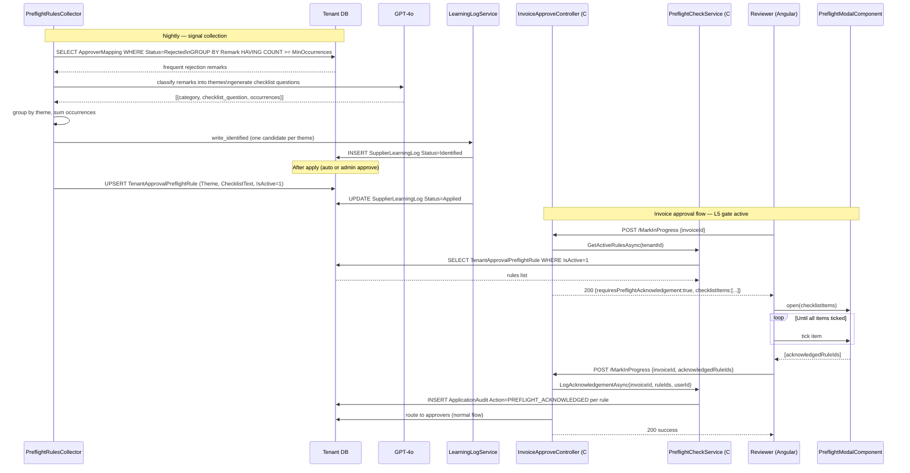

---

### 7.5 Learning 6 — Confidence Threshold

**Config keys:** `CorrectionRateThreshold` (decimal, default 0.20), `MinInvoiceVolume` (int, default 5), `LookbackDays` (int, default 90), `DefaultThreshold` (decimal, default 0.75), `MaxThreshold` (decimal, default 0.95)

**Threshold formula:**
```python
DEFAULT   = float(config["DefaultThreshold"])   # 0.75
MAX_T     = float(config["MaxThreshold"])        # 0.95
RATE_T    = float(config["CorrectionRateThreshold"])  # 0.20

if correction_rate > RATE_T:
    # Scale up: higher correction rate → stricter threshold
    new_threshold = round(min(DEFAULT + (correction_rate * 0.5), MAX_T), 4)
elif correction_rate < 0.05 and current_threshold > DEFAULT:
    # Supplier improving — gradually relax threshold
    new_threshold = round(max(current_threshold - 0.05, DEFAULT), 4)
else:
    continue  # no meaningful change needed
```

**C# pipeline hook — InvoiceService (AI callback):**

Called when `AIAgentController.UpdateAgentProcessedData` receives the AI extraction result:

```csharp
// In InvoiceService.UpdateAgentProcessedDataAsync():
var supplier = await _db.Suppliers.FindAsync(invoice.SupplierId);
var threshold = supplier?.AutoApproveConfidenceThreshold ?? 0.75m;

if (invoice.ConfidenceScore < threshold)
{
    invoice.RequiresReview = true;
    await _applicationAuditService.LogAsync(new ApplicationAudit {
        EntityType   = "INVOICE_DETAILS",
        EntityId     = invoice.Id,
        Action       = "REVIEW_FLAGGED",
        PropertyName = "ConfidenceScore",
        OldValue     = invoice.ConfidenceScore.ToString(),
        NewValue     = $"BelowThreshold:{threshold}",
        PerformedBy  = "LearningAgent"
    });
}
```

---

## 8. API Contracts

### 8.1 New Endpoints — Learning Admin Controller

```
Base route: /api/admin/learning
Auth: [Authorize(AuthenticationSchemes = "Bearer", Roles = "Admin")]
```

**GET /config**
```json
Response 200:
[
  { "learningType": "Global",  "configKey": "AgentEnabled",        "configValue": "true" },
  { "learningType": "Global",  "configKey": "HumanReviewRequired", "configValue": "true" },
  { "learningType": "GLDefault","configKey": "MinCorrections",      "configValue": "3"    },
  ...
]
```

**PUT /config**
```json
Request:
{ "learningType": "GLDefault", "configKey": "MinCorrections", "configValue": "5" }

Response 204: No Content
```

**GET /pending?page=1&pageSize=20**
```json
Response 200:
{
  "items": [
    {
      "id": "guid",
      "scope": "Supplier",
      "learningType": "GLDefault",
      "supplierName": "Dell UK",
      "evidenceSummary": "AccountCode corrected 4 times → '5010 - IT Equipment'",
      "proposedChangeSummary": "Set AccountCodeId = guid-5010",
      "createdOn": "2026-06-01T02:14:00Z"
    }
  ],
  "total": 7,
  "page": 1,
  "pageSize": 20
}
```

**POST /pending/{id}/approve** — Response 204

**POST /pending/{id}/reject** — Response 204

**GET /applied?page=1&pageSize=20** — Same shape as /pending, filtered to Status=Applied

**POST /applied/{id}/revert** — Response 204

**GET /supplier/{supplierId}/prompt-versions**
```json
Response 200:
[
  {
    "version": 3,
    "isActive": true,
    "createdOn": "2026-06-01T02:15:00Z",
    "createdBy": "LearningAgent",
    "fullPrompt": "...",
    "addendumSummary": "Learned 2026-06-01: InvoiceDate format guidance"
  },
  {
    "version": 2,
    "isActive": false,
    ...
  }
]
```

**POST /supplier/{supplierId}/prompt-versions/{version}/activate**
```json
Request: { "documentType": "Invoice" }
Response 204
```

**GET /batch-health?days=14**
```json
Response 200:
[
  {
    "batchDate": "2026-06-01",
    "tenantId": "guid",
    "tenantName": "acme",
    "status": "Success",
    "candidatesIdentified": 3,
    "candidatesApplied": 0,
    "candidatesPending": 3,
    "durationSeconds": 18
  }
]
```

---

### 8.2 Modified Endpoint — InvoiceApproveController.MarkInProgress

```csharp
// POST /api/invoiceapprove/MarkInProgress
// Existing behaviour: routes invoice to approval
// Modified: checks preflight rules first

Response (preflight rules exist and not yet acknowledged):
HTTP 200
{
  "requiresPreflightAcknowledgement": true,
  "invoiceId": "guid",
  "checklistItems": [
    { "id": "rule-guid-1", "theme": "AMOUNT_MISMATCH",
      "text": "Does the invoice total match the purchase order?" },
    { "id": "rule-guid-2", "theme": "MISSING_GL_CODE",
      "text": "Have GL codes been assigned to all line items?" }
  ]
}

// Client must re-POST with acknowledgedRuleIds after reviewer ticks all items:
Request (second call):
{
  "invoiceId": "guid",
  "acknowledgedRuleIds": ["rule-guid-1", "rule-guid-2"]
}

// If acknowledgedRuleIds present and complete → proceeds with normal approval routing
// Response: existing MarkInProgress success response
```

### MarkInProgress — Two-Call Sequence

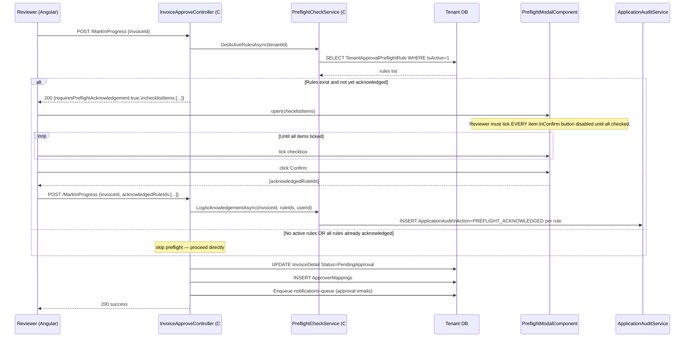

---

### 8.3 New HTTP Trigger — Python Learning Apply

```
POST /api/learning/apply
Auth: internal API key (X-Functions-Key header)
Called by: C# LearningAdminService.ApproveAsync
```

```json
Request:
{ "log_id": "guid", "approved_by": "user-id" }

Response 200:
{ "status": "applied", "log_id": "guid" }

Response 400:
{ "error": "Log entry not in PendingReview state" }

Response 500:
{ "error": "Applier failed: <message>" }
```

---

## 9. Pipeline Integration (C# Changes)

### 9.1 HelperService.BuildCalculatedJsonAsync

**File:** `Fintropi.UI/Services/InvoiceHelper/HelperService.cs`

Insert two check blocks before the Python post-processing call:

```csharp
public async Task<Dictionary<string, object>> BuildCalculatedJsonAsync(
    InvoiceDetail invoice, Guid tenantId)
{
    var supplier = await _db.Suppliers.FindAsync(invoice.SupplierId);
    var baseJson = JsonSerializer.Deserialize<Dictionary<string, object>>(
        invoice.UpdatedInvoiceJson ?? invoice.InvoiceJson ?? "{}");

    // ── L1: Apply supplier-level GL defaults ────────────────────────────
    if (supplier != null)
    {
        if (supplier.AccountCodeId.HasValue)
            baseJson["accountCodeId"] = supplier.AccountCodeId.Value;
        if (supplier.GLId.HasValue)
            baseJson["glCodeId"] = supplier.GLId.Value;
        if (supplier.PCId.HasValue)
            baseJson["pcCodeId"] = supplier.PCId.Value;
        if (supplier.CCId.HasValue)
            baseJson["ccCodeId"] = supplier.CCId.Value;
    }

    // ── L3: Apply tenant description mappings per line item ─────────────
    var mappings = await _db.TenantDescriptionMappings
        .Where(m => m.TenantId == tenantId && m.IsActive)
        .ToListAsync();

    if (mappings.Any() && baseJson.TryGetValue("Items", out var itemsObj))
    {
        var items = (itemsObj as JArray) ?? JArray.Parse(itemsObj.ToString()!);
        foreach (var item in items)
        {
            var desc = item["Description"]?.ToString() ?? "";
            var normalized = NormalizeDescription(desc);
            var match = mappings.FirstOrDefault(m => m.NormalizedPattern == normalized);
            if (match != null)
            {
                if (match.COAId.HasValue) item["accountCodeId"] = match.COAId.Value;
                if (match.GLId.HasValue)  item["glCodeId"]      = match.GLId.Value;
            }
        }
        baseJson["Items"] = items;
    }

    // ── Continue to Python post-processing for remaining uncoded fields ──
    return await CallPostProcessingAgentAsync(baseJson, invoice, tenantId);
}
```

---

### 9.2 InvoiceApproveController.MarkInProgress

**File:** `Fintropi.UI/Controllers/InvoiceApproveController.cs`

```csharp
[HttpPost("MarkInProgress")]
[Authorize(AuthenticationSchemes = "Bearer")]
public async Task<IActionResult> MarkInProgress([FromBody] MarkInProgressDto dto)
{
    var tenantId = _tenantResolverService.TenantId;

    // ── L5: Preflight check ─────────────────────────────────────────────
    var rules = await _preflightCheckService.GetActiveRulesAsync(tenantId);
    if (rules.Any())
    {
        if (dto.AcknowledgedRuleIds == null || !rules.All(r =>
                dto.AcknowledgedRuleIds.Contains(r.Id)))
        {
            return Ok(new {
                requiresPreflightAcknowledgement = true,
                invoiceId = dto.InvoiceId,
                checklistItems = rules.Select(r => new {
                    id = r.Id, theme = r.Theme, text = r.ChecklistText
                })
            });
        }
        // Log acknowledgement
        await _preflightCheckService.LogAcknowledgementAsync(
            dto.InvoiceId,
            dto.AcknowledgedRuleIds,
            User.FindFirstValue(ClaimTypes.NameIdentifier)!);
    }

    // ── Existing approval routing logic (unchanged below) ───────────────
    return await _approvalService.MarkInProgressAsync(dto);
}
```

**MarkInProgressDto — add one field:**
```csharp
public class MarkInProgressDto
{
    public Guid InvoiceId { get; set; }
    // ... existing fields ...
    public IEnumerable<Guid>? AcknowledgedRuleIds { get; set; }  // NEW
}
```

---

### 9.3 Service Registration

**File:** `Fintropi.UI/Extensions/ApplicationServiceExtensions.cs`

```csharp
// Add alongside existing service registrations:
services.AddScoped<IPreflightCheckService, PreflightCheckService>();
services.AddScoped<ILearningAdminService, LearningAdminService>();
```

---

## 10. Angular UI Components

### 10.1 Route

```typescript
// In app-routing.module.ts (admin guard already exists):
{
  path: 'admin/learning',
  component: LearningAdminComponent,
  canActivate: [AdminGuard]
}
```

### 10.2 LearningAdminComponent Structure

```
LearningAdminComponent
  ├── LearningConfigPanelComponent
  │     ├── Table of TenantLearningConfig rows grouped by LearningType
  │     └── Inline edit cells, Save button per row
  ├── PendingReviewPanelComponent
  │     ├── Table: Scope | Type | Summary | Evidence Count | Date
  │     └── Per-row: Approve button, Reject button, Expand evidence modal
  ├── AppliedRulesPanelComponent
  │     ├── Table: Scope | Type | Summary | Applied Date | Applied By
  │     └── Per-row: Revert button
  ├── PromptVersionsPanelComponent
  │     ├── Supplier selector dropdown
  │     ├── Version list: Version# | Active? | Date | By
  │     ├── Side-by-side diff view (selected vs active)
  │     └── Activate button on each non-active version
  └── BatchHealthPanelComponent
        ├── Date range selector (default: last 14 days)
        └── Grid: Date × Tenant, coloured cells (green/amber/red/grey)
            Tooltip: candidates identified / applied / pending / duration
```

### 10.3 PreflightModalComponent

Inserted into the existing invoice approval flow:

```typescript
// invoice-approval.component.ts — intercept MarkInProgress response
async submitForApproval(): Promise<void> {
  const result = await this.approvalService.markInProgress(this.invoiceId);

  if (result.requiresPreflightAcknowledgement) {
    const dialogRef = this.dialog.open(PreflightModalComponent, {
      data: { checklistItems: result.checklistItems },
      disableClose: true
    });
    const acknowledged = await dialogRef.afterClosed().toPromise();
    if (!acknowledged) return;  // user cancelled

    // Re-submit with acknowledged rule IDs
    await this.approvalService.markInProgress(this.invoiceId, {
      acknowledgedRuleIds: acknowledged
    });
  }
}
```

```typescript
// preflight-modal.component.ts
@Component({ ... })
export class PreflightModalComponent {
  checklistItems: PreflightItem[];
  checked: Set<string> = new Set();

  get allChecked(): boolean {
    return this.checklistItems.every(i => this.checked.has(i.id));
  }

  confirm(): void {
    this.dialogRef.close([...this.checked]);
  }
}
```

---

## 11. Configuration Reference

| LearningType | ConfigKey | Type | Default | Valid Range | Effect |
|---|---|---|---|---|---|
| Global | AgentEnabled | bool | true | true/false | Skips entire tenant if false |
| Global | HumanReviewRequired | bool | true | true/false | Auto-apply if false |
| GLDefault | IsEnabled | bool | true | true/false | Skip this learning type |
| GLDefault | MinCorrections | int | 3 | 1–20 | Min corrections to trigger |
| GLDefault | LookbackDays | int | 90 | 7–365 | Rolling window for signals |
| ExtractionPrompt | IsEnabled | bool | true | true/false | |
| ExtractionPrompt | MinCorrections | int | 3 | 1–20 | |
| ExtractionPrompt | LookbackDays | int | 90 | 7–365 | |
| DescriptionMapping | IsEnabled | bool | true | true/false | |
| DescriptionMapping | MinCorrections | int | 3 | 1–20 | |
| DescriptionMapping | MinDistinctUsers | int | 2 | 1–10 | Min unique users |
| DescriptionMapping | LookbackDays | int | 90 | 7–365 | |
| PreflightRules | IsEnabled | bool | true | true/false | |
| PreflightRules | MinOccurrences | int | 5 | 2–50 | Min rejections per theme |
| PreflightRules | LookbackDays | int | 90 | 7–365 | |
| ConfidenceThreshold | IsEnabled | bool | true | true/false | |
| ConfidenceThreshold | CorrectionRateThreshold | decimal | 0.20 | 0.01–0.99 | Rate that triggers tightening |
| ConfidenceThreshold | MinInvoiceVolume | int | 5 | 3–100 | Min invoices for rate to be valid |
| ConfidenceThreshold | LookbackDays | int | 90 | 7–365 | |
| ConfidenceThreshold | DefaultThreshold | decimal | 0.75 | 0.50–0.99 | Fallback when no supplier threshold set |
| ConfidenceThreshold | MaxThreshold | decimal | 0.95 | 0.80–0.99 | Upper bound on tightening |

---

## 12. Error Handling

### Batch Run — Status Outcome State Diagram

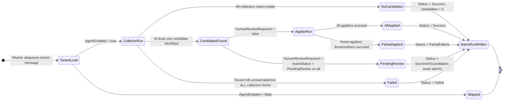

### GPT-4o failure handling

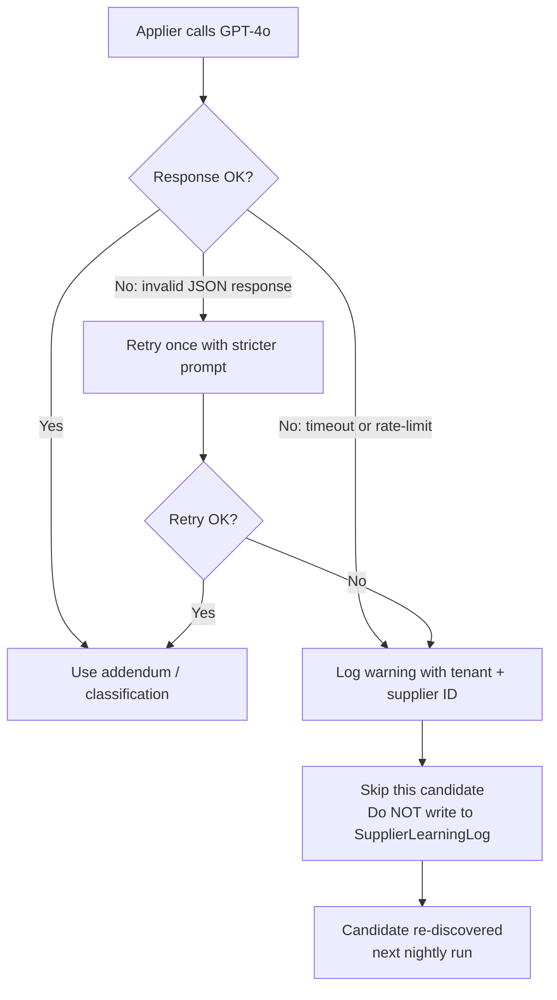

---

### Collector failures

Each collector runs in a `try/except` in `batch_runner.py`. A collector failure:
- Logs the error with tenant ID, learning type, and exception detail
- Does **not** stop other collectors from running
- Contributes an error message to the `LearningBatchRun` record
- Results in `Status = PartialFailure` if other collectors succeed

### Applier failures (auto-apply mode)

Each applier runs in a `try/except`. An applier failure:
- Leaves the `SupplierLearningLog` entry at `Status = Identified`
- Logs error with log ID and learning type
- Does not prevent other candidates from being applied

### GPT-4o failures (L2 and L5)

```python
try:
    addendum = self._generate_addendum(...)
except (OpenAIError, TimeoutError) as e:
    logger.warning(f"GPT-4o call failed for {candidate.entity_id}: {e}")
    # Skip this candidate — do not write to SupplierLearningLog
    # Will be picked up in the next nightly run
    return None
```

If GPT-4o rate-limits: the Azure Function will retry via queue poison-message handling (max 5 retries with exponential backoff, then DLQ).

### Concurrent apply (admin approves two items simultaneously)

`SupplierLearningLog.Status` transitions are protected by a SQL `WHERE Status = 'PendingReview'` clause in the apply update. If two admin users click Approve simultaneously, only one will match the WHERE clause; the second will get a 409 Conflict from the API.

### DB connection failure

If the tenant DB is unreachable, `TenantContext.load()` raises an exception caught by `batch_runner.run_for_tenant()`, which records `Status = Failed` in `LearningBatchRun` and returns. Other tenants are unaffected (queue-based isolation).

---

## 13. Phased Implementation Plan

### Phase 1 — Framework (Weeks 1–2)

**Goal:** All plumbing in place. No learning behaviour yet. Proves nightly runs work end-to-end.

| Task | Owner | Notes |
|---|---|---|
| EF Core migrations for all 5 new tables | Backend | Tenant schema + master schema |
| `ALTER TABLE` migrations for Supplier and InvoiceDetail | Backend | |
| Seed `TenantLearningConfig` default rows for existing tenants | Backend | One-time migration script |
| `registry.py`, `batch_runner.py`, all base classes | AI team | |
| `LearningBatchScheduler` + `LearningBatchWorker` registered in `function_app.py` | AI team | Worker iterates registry, writes nothing, logs run |
| `LearningBatchRun` writer (`batch_run_service.py`) | AI team | |
| `LearningAdminService` C# skeleton + new controller | Backend | |
| Admin UI: Batch Health panel only | Frontend | Shows `LearningBatchRun` grid |
| Service registration in `ApplicationServiceExtensions.cs` | Backend | |

**Acceptance criteria:**
- `LearningBatchRun` rows appear for each active tenant after 02:00 UTC
- Status = Success, CandidatesIdentified = 0
- Batch Health panel visible to Admin role users

---

### Phase 2 — Learning 1 + 6 (Weeks 3–4)

**Goal:** First two learnings apply. No GPT-4o calls. Low risk.

| Task | Notes |
|---|---|
| `gl_default/collector.py` + `applier.py` (self-register) | |
| `confidence_threshold/collector.py` + `applier.py` | |
| `learning_log_service.py` full implementation | |
| C# hook in `HelperService.BuildCalculatedJsonAsync` for L1 | Pre-fill from Supplier FK fields |
| C# hook in `InvoiceService` AI callback for L6 | Set `RequiresReview` flag |
| Admin UI: Pending Review + Applied Rules panels | Approve/Reject/Revert wired |
| `ILearningAdminService.ApproveAsync` calls Python HTTP trigger | |

**Acceptance criteria:**
- Supplier with 3+ AccountCode corrections shows up in Pending Review
- Approve → Supplier.AccountCodeId updated → next invoice from that supplier pre-fills COA
- Invoice with ConfidenceScore < Supplier.AutoApproveConfidenceThreshold gets RequiresReview=true
- Revert removes AccountCodeId FK from Supplier

---

### Phase 3 — Learning 2 (Weeks 5–6)

**Goal:** Prompt versioning and GPT-4o addendum generation.

| Task | Notes |
|---|---|
| `extraction_prompt/collector.py` + `applier.py` | |
| `prompt_version_service.py` (save / activate) | |
| Python HTTP trigger `/api/learning/apply` | Called by C# on Approve |
| Admin UI: Prompt Versions panel with diff view | |
| Activate prior version endpoint wired in UI | |

**Acceptance criteria:**
- Supplier with 3+ extraction field corrections generates a GPT-4o addendum
- `SupplierPromptVersion` records visible in admin UI with full text
- Activate version N → `Supplier.InvoiceDataExtractionPrompt` reverts correctly
- Next invoice from that supplier uses the updated prompt

---

### Phase 4 — Learning 3 (Weeks 7–8)

**Goal:** Tenant-level description mapping.

| Task | Notes |
|---|---|
| `description_mapping/collector.py` + `applier.py` | Item-index resolver is most complex part |
| C# `NormalizeDescription()` helper (must match Python exactly) | Unit test both implementations against same inputs |
| C# hook in `HelperService.BuildCalculatedJsonAsync` for L3 | After L1 pre-fill, before AI call |
| Description mapping rows visible in Applied Rules panel | |

**Acceptance criteria:**
- Line item with 3+ corrections by 2+ users to same COA creates a `TenantDescriptionMapping` row
- Next invoice with matching description has COA pre-filled before post-processing
- Normalization produces identical output in Python and C# for 10 test cases

---

### Phase 5 — Learning 5 (Weeks 9–10)

**Goal:** Rejection remarks → pre-flight checklist.

| Task | Notes |
|---|---|
| `preflight_rules/collector.py` + `applier.py` | |
| `IPreflightCheckService` + `PreflightCheckService` | |
| `InvoiceApproveController.MarkInProgress` modification | Intercept with preflight check |
| `MarkInProgressDto.AcknowledgedRuleIds` field | |
| Angular `PreflightModalComponent` | Blocking, checkbox per item |
| `PREFLIGHT_ACKNOWLEDGED` audit log entries | |
| Admin UI: Preflight rules visible in Applied Rules panel | Theme + ChecklistText + OccurrenceCount |

**Acceptance criteria:**
- Tenant with 5+ rejections of same theme gets an active `TenantApprovalPreflightRule`
- Reviewer sees modal with checklist before submitting for approval
- Cannot proceed without ticking all items
- Acknowledgement visible in `ApplicationAudit` per invoice
- Revert deactivates the rule → modal no longer appears

---

### Implementation Timeline

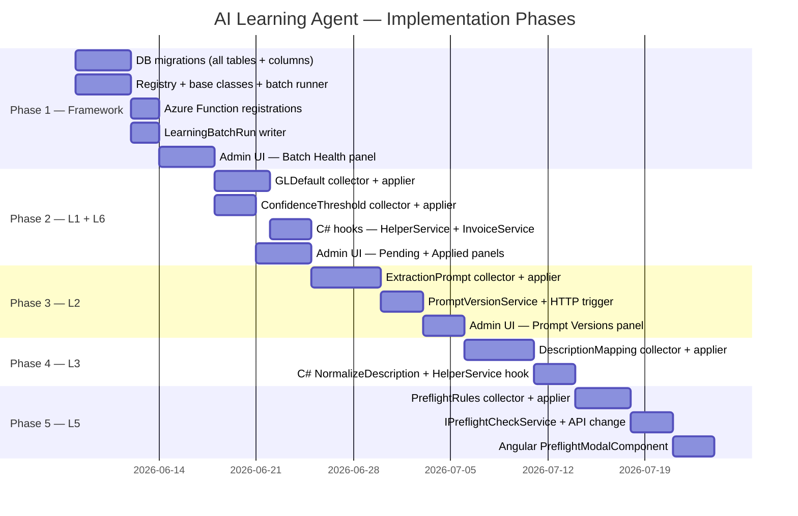

---

## 14. Appendix — Flowcharts

### Agent Orchestration

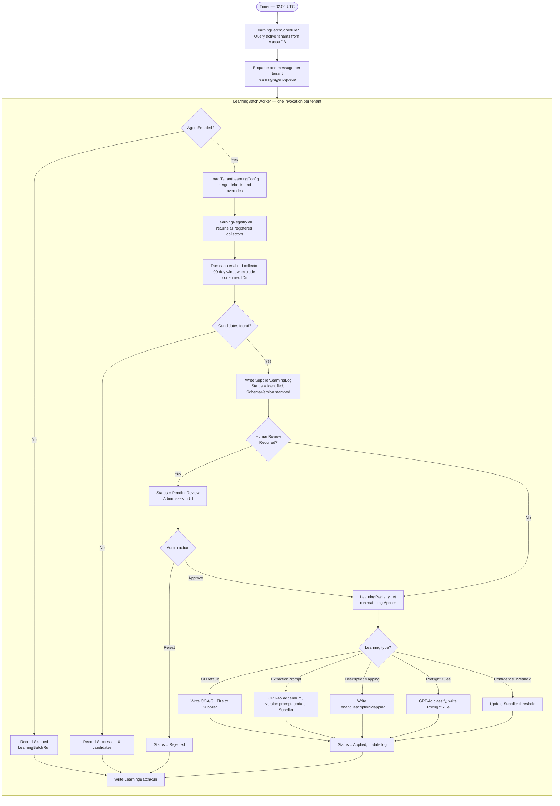

### Pipeline Integration

```mermaid
flowchart TD
    INV([Invoice arrives]) --> EX[AI Extraction — Python Function]
    EX --> SP[Read Supplier.InvoiceDataExtractionPrompt]
    SP -->|L2 versioned prompt lives here| GPT[GPT-4o + Document Intelligence]
    GPT --> IJ[InvoiceJson stored]
    IJ --> CS{Supplier GL defaults set?}
    CS -- Yes -->|L1| GLD[Pre-fill COA/GL/PC/CC from Supplier FKs]
    CS -- No --> AIG[AI assigns GL codes — post-processing agent]
    GLD & AIG --> DM{Line-item description matches TenantDescriptionMapping?}
    DM -- Yes -->|L3| DMR[Override item COA/GL from tenant mapping]
    DM -- No --> DMR
    DMR --> CJ[CalculatedInvoiceJson stored]
    CJ --> CC{ConfidenceScore >= Supplier threshold?}
    CC -- No -->|L6| RR[RequiresReview = true, flagged in invoice list]
    CC -- Yes --> NF[Normal flow]
    RR & NF --> AR[Reviewer submits for approval]
    AR --> PF{Active preflight rules for tenant?}
    PF -- Yes -->|L5| CM[Checklist modal — reviewer ticks all items]
    CM --> AK{All acknowledged?}
    AK -- No --> CM
    AK -- Yes --> SB[Submit — log PREFLIGHT_ACKNOWLEDGED]
    PF -- No --> SB
    SB --> AN([Approvers notified])
```

---

*End of document — LearningAgent_LLD.md v1.0*
