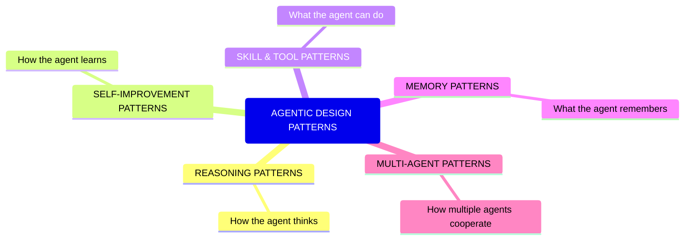

# Day 1 — What Is an Agentic Design Pattern?

> **Today's one idea:** Design patterns are a vocabulary of reusable solutions — and naming a pattern is the first act of architectural thinking.
> **Reading time:** ~35 min · **Prereqs:** None
> **Primary source for today:** Karpathy, *Software 2.0* (2017) — as a framing lens; GoF *Design Patterns* (1994) Introduction — for the pattern concept itself.

---

## The hook

In 1994, four authors published a book called *Design Patterns: Elements of Reusable Object-Oriented Software*. Before it, programmers across the world kept independently inventing the same solutions to the same problems — and not knowing it. Someone in Tokyo was writing a "Factory" to decouple object creation from object usage. Someone in Berlin was writing the exact same thing and calling it a "Maker." Someone in New York called it a "Builder." They couldn't share insights because they had no shared words.

The Gang of Four named 23 patterns. Overnight, a programmer could say *"use a Factory here"* and be understood — not just the mechanism, but the *problem* it solves, the *trade-offs* it makes, and the *situations* where it breaks.

The same shift is happening in agent systems right now. In 2022, a paper said "use ReAct." In 2023, another said "use Reflexion." In 2024, Anthropic published a guide naming five agent workflow patterns. The vocabulary is forming. This course is your complete dictionary.

---

## Building the intuition

### What is a pattern, really?

Christopher Alexander, the architect who invented the pattern concept in 1977, gave the clearest definition:

> "Each pattern describes a problem which occurs over and over again in our environment, and then describes the core of the solution to that problem, in such a way that you can use this solution a million times over, without ever doing it the same way twice."

Three parts: **problem**, **solution**, **context**. The context is what makes it a pattern and not an algorithm. An algorithm tells you exactly what to do. A pattern tells you what *kind* of solution fits a *kind* of problem — leaving implementation details to you.

A concrete analogy: "put the kitchen near the dining room" is an architectural pattern. It doesn't tell you the kitchen's dimensions or the dining table's material. It says: *these two rooms have a relationship that recurs in human dwellings, and there's a reason for placing them close together*. Once you know the pattern, you can apply it in a studio apartment or a palace.

### The three elements of every pattern

```
Pattern = Context + Force + Solution

Context:  The situation in which the problem arises.
Force:    The tension or constraint that makes the problem hard.
Solution: The structural arrangement that resolves the force.
```

Let's apply this to a real agent pattern — **ReAct** — even though we haven't formally studied it yet:

- **Context:** An agent must answer a question that requires fetching information from external sources.
- **Force:** The model can't look things up on its own; it must reason about *what* to look up while also *doing* the lookup. Separating these entirely loses the connection between reasoning and action.
- **Solution:** Interleave the reasoning trace with tool calls — each reasoning step can inform the next action, and each action result can inform the next reasoning step.

You don't need to know the implementation yet. You already understand *why the problem is hard* and *what shape the solution takes*. That's the value of the pattern vocabulary.

### Why naming matters

Naming does three things for you:

1. **Communication:** "Use ReAct here" is a complete sentence. "Have the model think about what to search for, then search, then think about the result, then maybe search again, then answer" is a paragraph — and it's ambiguous.

2. **Debugging:** When a system using ReAct breaks, you know *which pattern broke* and therefore *what to check*. "The reasoning and action are drifting apart" is a more precise diagnosis than "the agent is acting weird."

3. **Design:** When faced with a new agent task, patterns give you a menu of proven starting points. You're not designing from scratch; you're asking "which pattern fits here, and which trade-offs does it make?"

### The five pattern families

Agent design patterns cluster into five families. Think of these as drawers in a filing cabinet — every pattern you'll learn lives in one of them.



This course covers patterns in each family. By the end, you'll be able to look at any agent system and label every architectural choice with its pattern name — like an architect reading a blueprint.

---

## The formal picture

### Christopher Alexander's pattern template

Alexander's original template has these fields. We use a simplified version throughout this course:

| Field | Question it answers |
|-------|-------------------|
| **Name** | What do we call this solution? |
| **Context** | When does this problem arise? |
| **Force** | Why is the naive solution insufficient? |
| **Solution** | What structural arrangement resolves the force? |
| **Consequences** | What does this solution cost? What does it enable? |
| **Related patterns** | What other patterns does this one reference or replace? |

Every day in this course, when we introduce a new pattern, we will fill in this template — explicitly or implicitly.

### What a pattern is NOT

- **Not an algorithm.** An algorithm has fixed steps and a deterministic outcome. A pattern is a structural arrangement with variable implementation.
- **Not a rule.** Rules are prescriptive: "always do X." Patterns are descriptive: "in context C, solution S resolves force F."
- **Not a guarantee.** Applying the right pattern doesn't guarantee success. It gives you a proven starting point and a framework for diagnosing failure.
- **Not a checklist.** Patterns interact. Applying ReAct and Reflexion together creates different dynamics than applying either alone.

---

## Where it breaks / what it is not

**The naming trap.** The moment a pattern gets a name, it gets cargo-culted. Developers add "ReAct" to their system without understanding what force it resolves — and wonder why it doesn't help. The antidote is always to ask: *what problem does this pattern exist to solve, and does that problem actually appear in my system?*

**Pattern proliferation.** The AI agent field is young. Not every named "pattern" in a blog post is a genuine pattern — some are implementation choices masquerading as patterns, some are marketing terms. In this course, we only study patterns that: (a) appear in peer-reviewed work or production systems, and (b) have a clear context/force/solution structure.

**Missing context.** A design pattern from the GoF world can break subtly when applied to agents. GoF patterns assume deterministic code. Agents introduce LLM non-determinism, latency, and token costs. Every pattern we study will note which classical assumptions it violates.

---

## Try it yourself

**Exercise 1 — Check your understanding:**
Write down the three parts of a pattern (context, force, solution) for this scenario: *An agent must answer complex questions that require multiple sequential lookups, but you need to be able to explain its reasoning.*

**Exercise 2 — Apply it:**
Think of an agent system you've built or used. Pick one architectural decision in it (e.g., "I gave it a search tool," "I added a memory store"). Now try to express it in pattern form: what was the context, the force, and the solution? You don't need a name for it — the structure is the point.

**Exercise 3 — Stretch:**
The GoF pattern "Observer" (one object notifies many others of state changes) is a pattern from classical software. Can you think of an analogous pattern in multi-agent systems? Describe the context, force, and solution.

<details>
<summary>Hint for Exercise 1</summary>
The force is the key. What makes this problem hard? The agent can't just look things up — it needs to reason about *what* to look up and *why*. And you need the reasoning visible. What structural arrangement satisfies both?
</details>

<details>
<summary>Worked solution for Exercise 1</summary>

**Context:** An agent must answer multi-step questions requiring external lookups, and the reasoning must be auditable.

**Force:** Pure retrieval (look up, return) loses the reasoning that connects steps. Pure reasoning (think it through) can't access live information. Separating them entirely means the reasoning can't adapt to what was found.

**Solution:** Interleave reasoning steps and retrieval actions in the same sequence — each step visible in the output, each retrieval result feeding the next reasoning step. (This is exactly ReAct, which you'll implement on Day 9.)
</details>

---

## Connect it back

You came in knowing that agents exist and roughly how they work. You leave today with a single, precise tool: the pattern template. Every new pattern in this course will arrive as a (context, force, solution) triple, and you'll be able to ask: *does my system have this problem? Does this solution fit?*

Tomorrow we zoom in: what *exactly* are the components of an agent system? What is the "anatomy" that patterns operate on? That's the cognitive architecture map — and it's the coordinate system for the next 32 days.

**One question you can now answer that you couldn't this morning:** Why is "just call it ReAct" a more useful statement than "have the model reason between actions"?

---

## Suggested readings for today

**Required if you have 15 extra minutes:**
Karpathy, *Software 2.0* (2017) — https://karpathy.medium.com/software-2-0-a64152b37c35
Read the whole thing (10 min). It reframes *why* agent systems are architecturally different from classical software: they are trained, not written. This changes everything about how patterns compose and fail.

**If you want the deep version:**
- GoF, *Design Patterns: Elements of Reusable Object-Oriented Software* (1994, Addison-Wesley) — Introduction only (pp. 1–31). The clearest description of the pattern concept, context, and force in software. Ignore the Java — the ideas transfer perfectly.
- Andrew Ng, *What's Next for AI Agentic Workflows* (TED AI Conference, 2024) — ted.com, 15 min. A bird's-eye view of the four pattern families we'll study; great framing before you dive into the details.

---

## Navigation

← **Back to course overview:** [README](../../../README.md)
→ **Next:** [Day 2 — The Cognitive Architecture Map](./day-02-cognitive-architecture-map.md)
