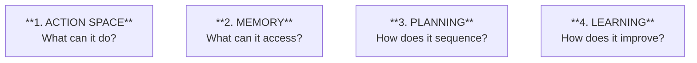
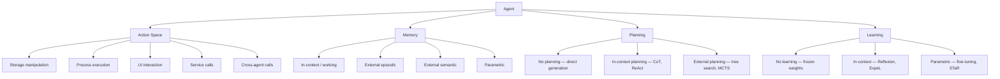

# Day 2 — The Cognitive Architecture Map

> **Today's one idea:** Every agent system decomposes into four orthogonal components — action, memory, planning, and learning — and locating each component tells you which patterns can help.
> **Reading time:** ~40 min · **Prereqs:** Day 1
> **Primary source for today:** Sumers, Yao, Narasimhan, Griffiths — *Cognitive Architectures for Language Agents* (TMLR 2024, arXiv:2309.02427), Section 2 · Karpathy — *Intro to Large Language Models* (YouTube, Nov 2023), timestamps 45:00–57:00.

---

## The hook

You've built an agent. It works on one task, fails mysteriously on another. You add memory — now it works but gets confused by stale facts. You add more tools — now it gets overwhelmed and picks the wrong one. You're debugging blind because you don't have a map of the system you're in.

This is the same problem doctors faced before anatomy was formalized. When a patient collapsed, you had symptoms but no systematic way to locate the cause. Once anatomy gave you a coordinate system — organs, systems, connections — diagnosis became possible. You could say "the problem is in the hepatic portal system" instead of "the liver area is unhappy."

Today we build the anatomy textbook for agents. Once you have this map, you can look at any agent system — any paper, any product, any codebase — and immediately locate: *what component is responsible for this behavior? Which pattern addresses that component?*

---

## Building the intuition

### Karpathy's LLM-as-OS

Before the formal taxonomy, here is the mental model that will serve you best day-to-day. Andrej Karpathy, in his November 2023 lecture, mapped the LLM agent to an operating system:

| OS Concept | Agent Equivalent |
| --- | --- |
| CPU | The LLM — does the computation |
| RAM | Context window — fast, limited, expensive |
| L1/L2 cache | KV cache — recently computed tokens |
| Disk / SSD | External storage (files, vector DBs) |
| I/O peripherals | Tools (search, code executor, APIs) |
| System calls | Tool calls / function calling |
| Network | Cross-agent calls / multi-agent layer |

This analogy is not decorative — it is diagnostic. Every bottleneck in agent design has an OS parallel:

- **"The agent keeps forgetting things between runs"** → Volatile RAM. Solution: write to disk (external memory).
- **"The agent is too slow"** → CPU-bound. Solution: parallelize (multi-agent).
- **"The context keeps filling up"** → RAM overflow. Solution: compress or offload to disk (memory management patterns).
- **"The agent picks the wrong tool"** → Bad I/O driver. Solution: better tool descriptions (skill design pattern).
- **"The agent works for simple tasks but breaks on complex ones"** → Insufficient working memory. Solution: external planning state or sub-task delegation.

Before you study a pattern, ask: *which OS component is this pattern addressing?* The answer tells you what class of problem it solves.

### The four components

Now let's name the components more precisely. Sumers et al. (2024) propose a taxonomy of four orthogonal dimensions. Think of these as axes in a design space — any agent lives at a specific point on each axis.



**Component 1: Action Space**
What the agent is allowed to do. This determines the ceiling of its capability. An agent with only a text-generation action can never browse the web. An agent with a code-execution action can compute anything computable.

Sub-types (Sumers et al. categorization):
```
Storage manipulation    → read/write files, databases, email
Process execution       → terminal commands, code interpreters
UI interaction          → web browser, desktop GUI, scraping
Service calls           → REST APIs, IoT sensors, data streams
Cross-agent calls       → spawn subagents, query specialists
```

**Component 2: Memory**
What information the agent can access, beyond its weights. This has four sub-types (we'll study each in Module 5):

```
In-context (working)    → the context window right now
External episodic       → past trajectories, retrieved via similarity
External semantic       → knowledge bases, documents, vector stores
Parametric              → what's baked into the weights (slowest to update)
```

**Component 3: Planning**
How the agent sequences actions toward a goal. This ranges from zero (direct generation: input → output in one step) to full deliberative search (Tree of Thoughts, LATS). Most production agents live somewhere in between.

**Component 4: Learning**
How the agent improves across episodes. This ranges from zero (frozen weights, no feedback loop) to full fine-tuning. The self-improvement patterns we study in Module 3 are solutions in this dimension.

---

## The formal picture

The complete taxonomy as a reference diagram:



### How patterns map to components

This is the key table. Every pattern in this course addresses at least one component. Knowing the component tells you what class of problem the pattern solves.

| Pattern | Primary Component | Secondary Component |
|---------|------------------|-------------------|
| ReAct | Planning | Action space |
| Chain-of-Thought | Planning | — |
| Reflexion | Learning (in-context) | Memory (episodic) |
| Self-Refine | Planning | — |
| Skill Library | Action space | Memory (external) |
| Orchestrator-Worker | Action space | Planning |
| Critic-Actor | Learning (in-context) | Planning |
| Memory Taxonomy | Memory | — |

When you can fill in this table for every pattern you know, you understand the field structurally — not just as a list of tricks.

---

## Where it breaks / what it is not

**The learning column is usually empty in production.** Most deployed agents have frozen weights. "Learning" in production almost always means in-context learning (Reflexion, ExpeL) or external memory accumulation — not gradient updates. This is a deliberate architectural choice: parametric updates are expensive, slow, and risky to deploy. Don't confuse "the agent improves" with "the weights are updated."

**Planning and reasoning are often conflated.** "The agent has CoT" is not a planning system — it's a structured reasoning mechanism. Planning, in the formal sense, requires a model of future states and a way to evaluate them. ReAct does planning. CoT alone does not. The distinction matters when you're choosing between Day 6 (CoT) and Day 13 (LATS) for a given task.

**The four components are orthogonal — but their implementations aren't.** The context window is used simultaneously by memory (what to remember), planning (the reasoning trace), and action (the tool call format). A change to your prompting strategy affects all three. This coupling is a constant source of subtle bugs.

---

## Try it yourself

**Exercise 1 — Check your understanding:**
Map an agent you've used (LangChain ReAct agent, AutoGen assistant, Claude with tools, etc.) onto the four-component taxonomy. For each component, write one sentence describing what the agent uses for it.

**Exercise 2 — Apply the OS model:**
You observe that your agent works fine for 5 steps but starts hallucinating on step 6. Using the LLM-as-OS analogy, what is the most likely component causing this? What pattern category addresses it?

**Exercise 3 — Stretch:**
The taxonomy has four components: action, memory, planning, learning. Can you think of an agent task where three of the four components are irrelevant — only one matters? What is the task, and which component?

<details>
<summary>Hint for Exercise 2</summary>
If the agent works fine for 5 steps but breaks at step 6, something changed between step 5 and step 6. What accumulates over steps in an LLM agent?
</details>

<details>
<summary>Worked solution for Exercise 2</summary>
Context window (RAM) is the most likely cause. By step 6, the context has accumulated 5 rounds of thought/action/observation, plus the original prompt. The model's effective attention may be degrading on the original instruction, or the context is approaching its limit. This is a Memory (in-context / working) problem. The patterns that address it: scratchpad compression (Day 24), external episodic memory (Day 25), and — if the task can be decomposed — the Orchestrator-Worker pattern (Day 27), which limits each worker's context to a focused sub-task.
</details>

---

## Connect it back

[Yesterday](./day-01-what-is-a-design-pattern.md) we defined what a pattern is: a named (context, force, solution) triple. Today we built the coordinate system — the four components — that tells us *where in the agent* the pattern operates.

Tomorrow we zoom in on Component 1 (Action Space) in detail, because tool use is both the most immediately practical topic and the foundation for every reasoning pattern that follows.

**One question you can now answer that you couldn't this morning:** Someone says "our agent has memory issues." Without this map, that's vague. With it, you can ask: *which kind of memory — in-context, external, or parametric — and which patterns address that type?*

---

## Suggested readings for today

**Required if you have 15 extra minutes:**
Karpathy, *Intro to Large Language Models* (YouTube, Nov 2023) — timestamps 45:00–57:00.
Watch this 12-minute segment. Karpathy introduces the OS analogy live, with clear diagrams. It reinforces today's mental model better than any text description.

**If you want the deep version:**
- Sumers et al., *Cognitive Architectures for Language Agents* (TMLR 2024, arXiv:2309.02427) — Section 2 (the taxonomy, ~8 pages). The formal version of today's map, with a literature review showing how 20+ existing agent systems map onto these four components. Read this after you have a week under your belt — it will make much more sense then.
- Ng, *What's Next for AI Agentic Workflows* (TED AI, 2024) — ted.com, 15 min total. The first 8 minutes directly cover the four pattern families and why each exists. A good second pass on the material from Day 1.

---

## Navigation

← **Previous:** [Day 1 — What Is an Agentic Design Pattern?](./day-01-what-is-a-design-pattern.md)
→ **Next:** [Day 3 — Tool Use as First-Class Primitive](./day-03-tool-use-primitive.md)
