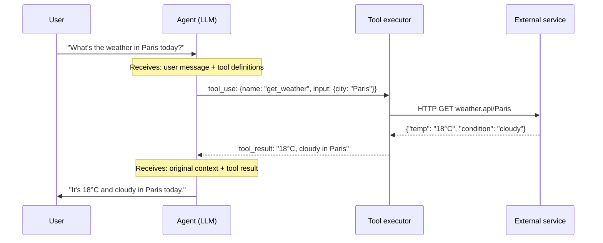

# Day 3 — Tool Use as First-Class Primitive

> **Today's one idea:** An agent's power is determined by its action space — and tools define that space. Everything else (reasoning, memory, planning) exists to decide *which tool to call* and *with what arguments*.
> **Reading time:** ~40 min · **Prereqs:** Day 2
> **Primary source for today:** Anthropic, *Building Effective Agents* (Dec 2024) — "The augmented LLM" section · Huyen, *AI Engineering* (2025) — Chapter 7 (Tool Use).

---

## The hook

Give an LLM a math problem without tools. Ask it: *What is 3847 × 2931?* It will produce an answer with complete confidence. That answer will often be wrong.

Now give it a calculator tool. Same problem. It calls `calculator(3847 * 2931)`, gets back `11,276,457`, and returns it. Correct, every time.

The model didn't get smarter. The tool didn't make it smarter. What changed is the **division of labor**: the LLM decides *what to compute*; the calculator handles *how to compute it*. The LLM is doing what it is good at (reasoning about what operation to perform). The calculator is doing what it is good at (precise arithmetic).

This is the fundamental insight behind tool use: an LLM-based agent's intelligence is best deployed on the *decision layer*, not the *execution layer*. Tools handle execution. The more precisely you define what tools are available, the more precisely the agent can decide.

---

## Building the intuition

### The action space defines the ceiling

[On Day 2](./day-02-cognitive-architecture-map.md) we saw that an agent's action space is Component 1 of the cognitive architecture. Now we make this concrete.

An agent with **no tools** can only generate text. Its "actions" are all the words it can produce. It cannot fetch live information, cannot run code, cannot store anything persistently, cannot talk to another agent. No matter how sophisticated its reasoning, its ceiling is the knowledge baked into its weights at training time.

An agent with a **web search tool** can access any publicly available information from the last crawl. Its ceiling just jumped by several orders of magnitude.

An agent with **code execution** can compute anything computable, given enough time. Its ceiling is now Turing-complete.

The tools define the ceiling. Patterns determine how close you get to the ceiling.

### The separation of concerns principle

Classical software has a principle: separate what you *decide* from what you *do*. A controller decides; a service executes. This principle applies directly to agents:

```
Agent's LLM  →  decides what to do  →  "I should search for X"
Tool         →  does the thing       →  actually searches for X
Agent's LLM  →  reasons about result →  "The search says Y, so next I should..."
```

This separation is why tool use is a *primitive* — a building block, not a feature. Without it, the LLM is doing both deciding and "executing" in the same forward pass, which is like a CEO who is also their own accountant, lawyer, and delivery driver. Possible. Inefficient. Error-prone.

### The action space taxonomy (in practice)

From [Day 2](./day-02-cognitive-architecture-map.md) we have five categories. Let's make each concrete with a real example:

| Category | Real tool examples |
| --- | --- |
| Storage manipulation | `read_file()`, `write_db()`, `send_email()` |
| Process execution | `run_python()`, `bash_command()`, `docker_run()` |
| UI interaction | `browser_navigate()`, `click()`, `screenshot()` |
| Service calls | `web_search()`, `get_weather()`, `call_api()` |
| Cross-agent calls | `spawn_agent()`, `query_specialist()`, `delegate()` |

The five categories aren't just organizational — they have different risk profiles. Storage manipulation tools can corrupt data. Process execution tools can crash systems. Cross-agent calls can create infinite loops. The patterns that handle these risks (guardrails, Day 32) are precisely calibrated to each category.

---

## The formal picture

### How function calling works under the hood

Tool use in modern LLM APIs follows a standard protocol. Understanding it lets you reason about what the model can and cannot know about your tools.



The model never sees the tool implementation — only its **name**, **description**, and **input schema**. This is critical: if your description is ambiguous, the model makes its best guess. If your schema is wrong, the call fails. Tool design is interface design.

### A minimal working example

Here is a complete, runnable tool-calling agent in Python:

```python
import anthropic
import json

client = anthropic.Anthropic()

# ── Tool definitions (the contract the LLM sees) ──────────────────
tools = [
    {
        "name": "web_search",
        "description": (
            "Search the web for current information about a topic. "
            "Use this when the question requires facts you may not know "
            "or that may have changed since your training cutoff."
        ),
        "input_schema": {
            "type": "object",
            "properties": {
                "query": {
                    "type": "string",
                    "description": "A precise search query string."
                }
            },
            "required": ["query"]
        }
    },
    {
        "name": "calculator",
        "description": (
            "Evaluate a mathematical expression and return the result. "
            "Always use this for arithmetic — never compute in your head."
        ),
        "input_schema": {
            "type": "object",
            "properties": {
                "expression": {
                    "type": "string",
                    "description": "A valid Python arithmetic expression, e.g. '3847 * 2931'"
                }
            },
            "required": ["expression"]
        }
    }
]

# ── Tool executor (your actual implementations) ───────────────────
def execute_tool(name: str, inputs: dict) -> str:
    if name == "calculator":
        try:
            result = eval(inputs["expression"])  # safe for arithmetic only
            return str(result)
        except Exception as e:
            return f"Error: {e}"
    if name == "web_search":
        # Stub — replace with real search API
        return f"[Search results for '{inputs['query']}' would appear here]"
    return f"Unknown tool: {name}"

# ── The agent loop ────────────────────────────────────────────────
def run_agent(user_message: str) -> str:
    messages = [{"role": "user", "content": user_message}]

    while True:
        response = client.messages.create(
            model="claude-3-5-sonnet-20241022",
            max_tokens=1024,
            tools=tools,
            messages=messages
        )

        # Case 1: model wants to call tools
        if response.stop_reason == "tool_use":
            tool_results = []
            for block in response.content:
                if block.type == "tool_use":
                    result = execute_tool(block.name, block.input)
                    tool_results.append({
                        "type": "tool_result",
                        "tool_use_id": block.id,
                        "content": result
                    })
            # Feed results back and continue the loop
            messages.append({"role": "assistant", "content": response.content})
            messages.append({"role": "user", "content": tool_results})

        # Case 2: model is done
        else:
            for block in response.content:
                if hasattr(block, "text"):
                    return block.text

# Run it
answer = run_agent("What is 3847 multiplied by 2931?")
print(answer)
```

**What to notice:**
1. The `tools` list is the only thing the LLM sees about your tools — description and schema, nothing else.
2. The agent loop runs `while True` — it terminates only when `stop_reason == "end_turn"`. This is the ReAct loop before we give it a name (Day 8 makes this explicit).
3. `execute_tool` is completely separate from the LLM. The model decides; the function executes.

---

## Where it breaks / what it is not

**Too many tools degrades performance.** Multiple studies (and Anthropic's own engineering notes) show that giving an LLM more than 5–7 tools at once measurably reduces tool-selection accuracy. The model has to simultaneously attend to all tool descriptions while reasoning about the task. Design around this: scope tools tightly, prune unused tools per task, or use a router that pre-selects relevant tools. (This is the Skill Design Pattern, Day 19.)

**Vague descriptions are bugs.** The model's tool selection is entirely driven by the description you write. "Do stuff with files" is a broken tool description. "Read the contents of a file at a given path, returning the text as a UTF-8 string" is a working one. Treat every `description` field as API documentation you will be held accountable for.

**No error information = hallucinated continuation.** If a tool call fails silently (returns empty string, swallowed exception), the model will often fabricate what the result "should" have been and continue confidently. Always return error information explicitly: `"Error: file not found at path /data/report.csv"`. A model that knows it failed can try a different approach. A model that thinks it succeeded cannot.

**Tool use is not the same as tool reliability.** The model can call your tool correctly (right name, right schema) and still produce a wrong answer if the tool's output is misleading or the model misinterprets it. Tool use gives you a reliable *channel* — it doesn't guarantee useful *signal*.

---

## Try it yourself

**Exercise 1 — Check your understanding:**
Write the tool definition (name, description, input_schema) for a `read_file` tool. Your description should be precise enough that the model knows exactly when to use it and what to expect back.

**Exercise 2 — Apply it:**
Run the code above (or adapt it). Give the agent: *"What is 17% of 4820?"* Observe the tool call in the response. Now modify the calculator description to say "Use this only for addition and subtraction" — and ask the same question. What changes?

**Exercise 3 — Stretch:**
The action space taxonomy has five categories. For a customer support agent, design one tool per category. For each, write the name and a one-sentence description. Then: which tool in your list is the highest-risk? Why?

<details>
<summary>Hint for Exercise 1</summary>
Think about: What is the one job this tool does? What does it need as input (just a path, or also encoding, line range)? What does it return on success? What should it say on failure? The description should answer all four questions in two sentences.
</details>

<details>
<summary>Worked solution for Exercise 1</summary>

```python
{
    "name": "read_file",
    "description": (
        "Read the entire contents of a file at the given absolute path "
        "and return the text as a UTF-8 string. "
        "If the file does not exist or cannot be read, returns an error message "
        "beginning with 'Error:'."
    ),
    "input_schema": {
        "type": "object",
        "properties": {
            "path": {
                "type": "string",
                "description": "Absolute file path, e.g. '/data/report.csv'"
            }
        },
        "required": ["path"]
    }
}
```

Key design decisions: (1) "absolute path" removes ambiguity about relative paths. (2) The error format `"Error: ..."` tells the model what a failure looks like, so it can handle it rather than hallucinate. (3) "entire contents" sets expectations — no pagination, no truncation implied.
</details>

---

## Connect it back

[Yesterday's cognitive architecture map](./day-02-cognitive-architecture-map.md) gave us four components. Today we went deep on Component 1 (Action Space), because it is the most concrete and the one that determines everything else. The patterns in the Reasoning module (Days 6–14) are all about how the agent *decides which tool to call and when*. The Skill & Tool patterns (Days 19–22) are about *designing tools that are worth calling*. Both modules are empty without today's foundation.

Tomorrow we step back and read a complete agent execution — putting action, memory, and (implicit) planning together in a real trace. After that, you'll have seen enough of the system that the pattern names will have genuine meaning.

**One question you can now answer that you couldn't this morning:** Why does giving an LLM a calculator tool improve arithmetic accuracy — when the LLM's reasoning ability hasn't changed at all?

---

## Suggested readings for today

**Required if you have 15 extra minutes:**
Anthropic, *Building Effective Agents* (Dec 2024) — https://www.anthropic.com/research/building-effective-agents
Read the "Augmented LLM" section (~5 min). It defines the minimal agent building block — LLM + retrieval + tools + memory — in the most precise language currently available from practitioners.

**If you want the deep version:**
- Huyen, *AI Engineering* (O'Reilly, 2025) — Chapter 7. The most thorough engineering treatment of tool use: latency, error handling, tool selection strategies, and how tool use interacts with context limits. Best read after completing Module 4 (Days 19–22) when you have the pattern vocabulary to interpret the examples.
- Schick et al., *Toolformer* (NeurIPS 2023, arXiv:2302.04761) — Sections 1–2 (~6 pages). A preview of Day 21: what happens when an LLM learns *when* to use tools from self-generated data, rather than being told by prompt. The contrast with today's prompt-defined tools illuminates the design trade-off.

---

## Navigation

← **Previous:** [Day 2 — The Cognitive Architecture Map](./day-02-cognitive-architecture-map.md)
→ **Next:** [Day 4 — Reading an Agent Trace](./day-04-reading-agent-trace.md)
