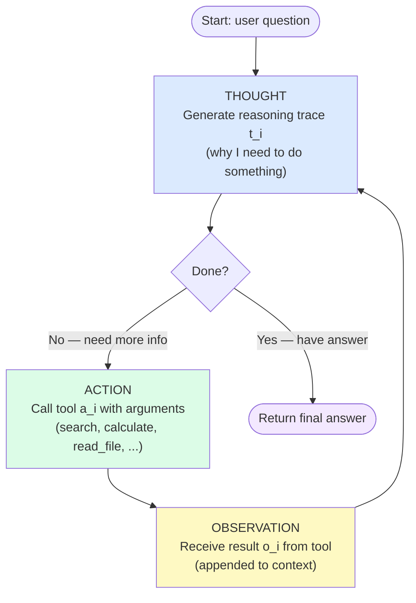

# Day 8 — ReAct: Interleaving Thought and Action

> **Today's one idea:** Interleaving natural-language reasoning traces with tool calls creates a tighter feedback loop than either reasoning or acting alone — each thought informs the next action, and each observation informs the next thought.
> **Reading time:** ~40 min · **Prereqs:** Day 6 (CoT), Day 3 (Tool Use)
> **Primary source for today:** Yao et al., *ReAct: Synergizing Reasoning and Acting in Language Models* (ICLR 2023, arXiv:2210.03629) — Sections 1, 2, and 4.

---

## The hook

Imagine two agents solving the same research question: *"What year was the Eiffel Tower completed, and how many years ago was that?"*

**Agent A — Pure Reasoner (CoT only):**
> "The Eiffel Tower was completed in 1889. Today is probably around 2023. So it was completed 2023 − 1889 = 134 years ago."

Looks fine. But what if today is actually 2026? The agent's training data has a cutoff. Its arithmetic might be off by a year or two. And it "knows" 1889 from memory — what if that's wrong? There's no mechanism to check.

**Agent B — Pure Actor (tool calls only, no reasoning trace):**
```
search("Eiffel Tower completion year") → "1889"
calculate("2026 - 1889") → "137"
Answer: "137 years ago."
```

Better grounded. But this agent has no visible reasoning — it just executes a fixed pipeline. If the search returns ambiguous results ("the Eiffel Tower was originally built in 1887–1889"), it has no way to reason about which date to use.

**Agent C — ReAct:**
```
Thought: I need the year the Eiffel Tower was completed to answer this.
Action: search("Eiffel Tower completion year")
Obs: "The Eiffel Tower was completed in March 1889."
Thought: The completion year is 1889. Now I need today's year for the subtraction.
Action: search("current year")
Obs: "The current year is 2026."
Thought: 2026 - 1889 = 137. I have both facts verified. I can answer.
Answer: The Eiffel Tower was completed in 1889, which was 137 years ago.
```

Agent C's reasoning informs its actions (it knows *why* it's searching, and what it needs), and its observations inform its reasoning (it uses the actual retrieved date, not a memorized one). This is the ReAct loop — and it's the foundational pattern that almost every production agent uses today.

---

## Building the intuition

### The two failure modes it solves

**Pure CoT fails on grounding.** A model reasoning without tool access is limited to its training data. It can be wrong about facts, wrong about recent events, and wrong about precise calculations — and it will be confidently wrong, because the reasoning process has no external checkpoint.

**Pure tool use fails on adaptability.** A pipeline that executes fixed tool calls without reasoning can't adapt to unexpected results. If a search returns ambiguous data, a pure actor can't decide which interpretation to use. It also can't plan its sequence of actions dynamically — it follows a script.

**ReAct solves both** by making reasoning and tool use mutually reinforcing:
- The reasoning trace explains *why* each tool is being called
- The tool results directly update the reasoning trace
- The updated trace conditions the next tool call

This creates a *grounded reasoning loop*: every conclusion is checkable, and every tool call is intentional.

### The detective analogy

A good detective doesn't just theorize at a whiteboard (pure reasoning). They also don't just collect evidence blindly without thinking (pure acting). They do both, interleaved: form a hypothesis → gather evidence that tests it → update the hypothesis → gather more evidence.

Sherlock Holmes doesn't say "I have thought about this and conclude the butler did it." He says "The mud on the boots suggests the East River bank. I'll check the dock records. The dock records show a boat registered to the butler's cousin. I now suspect the butler has an alibi — I should verify it." Each thought informs the next action. Each action result informs the next thought.

ReAct is this detective process, formalized.

### The two properties that make it work

**Property 1 — Thoughts are grounded.** Because every thought is followed by a real observation, the agent can't stay in a reasoning loop disconnected from reality. When it says "I need to check X," it checks X. The trace self-corrects.

**Property 2 — Actions are intentional.** Because every action is preceded by a thought, the agent always knows *why* it's calling a tool. When a tool returns something unexpected, the agent's next thought can reason about the discrepancy rather than blindly continuing.

---

## The formal picture

### The ReAct algorithm



Formally, ReAct generates a trace:

$$\tau = (t_1, a_1, o_1,\ t_2, a_2, o_2,\ \ldots,\ t_n, a_{final})$$

where:
- $t_i$ = thought (language model output, reasoning)
- $a_i$ = action (tool name + arguments)
- $o_i$ = observation (tool output, appended verbatim to context)

**The crucial mechanism:** every element of $\tau$ is appended to the model's context window. When the model generates $t_{i+1}$, it conditions on the complete history $(t_1, a_1, o_1, \ldots, t_i, a_i, o_i)$. The full trace is the context.

### Comparing the three approaches

| Approach | Input context for final answer | Grounded? | Adaptive? |
|----------|-------------------------------|-----------|-----------|
| Direct generation | Question only | ✗ | ✗ |
| CoT only | Question + reasoning chain | ✗ | ✓ |
| Tool calls only | Question + observations | ✓ | ✗ |
| **ReAct** | **Question + thoughts + observations** | **✓** | **✓** |

### What a ReAct trace looks like in practice

Here is a more complex example — a task requiring three tool calls where the reasoning must adapt to each observation:

```
Question: "Who is the current CEO of the company that makes the iPhone, 
           and what university did they attend?"

[THOUGHT 1]
I need to find the CEO of the company that makes the iPhone. 
The iPhone is made by Apple. Let me search for Apple's current CEO.

[ACTION 1] search(query="Apple CEO 2026")
[OBS 1]    "Tim Cook has been Apple's CEO since August 2011."

[THOUGHT 2]
Tim Cook is Apple's CEO. Now I need to find what university he attended.
Let me search for his educational background.

[ACTION 2] search(query="Tim Cook education university")
[OBS 2]    "Tim Cook earned a BS in Industrial Engineering from Auburn 
            University in 1982, and an MBA from Duke University's Fuqua 
            School of Business in 1988."

[THOUGHT 3]
I have both pieces of information I need: Tim Cook is Apple's CEO,
and he attended Auburn University (undergraduate) and Duke University (MBA).
I can now compose a complete answer.

[ANSWER]
Tim Cook is the current CEO of Apple (the company that makes the iPhone). 
He attended Auburn University for his undergraduate degree (BS in Industrial 
Engineering, 1982) and Duke University's Fuqua School of Business for his MBA (1988).
```

Notice: Thought 1 immediately reasons about the company behind the iPhone (connecting "iPhone" to "Apple") before searching. Thought 2 uses the observation directly ("Tim Cook is Apple's CEO") to identify what information is still missing. Thought 3 confirms the task is complete before generating the final answer. This is the pattern working as designed.

---

## Where it breaks / what it is not

**Infinite loops.** Without a clear termination condition, the agent can loop indefinitely: search → observe → think "I should search again" → search the same thing → observe → ... The fix: explicit stopping criteria ("if I have found all required facts, answer immediately") and a hard step limit in the control loop.

**Context accumulation.** Every thought and observation is appended to the context window. A 20-step ReAct trace consumes far more tokens than the original question. Around step 15+, the model's attention to the original question degrades. Memory patterns (Module 5) address this — but the naive ReAct loop has a hard length limit.

**Wrong tool selection.** When multiple tools are available, the model may call the wrong one — a calculator when it should search, or a file reader when it should search. This is a tool design problem (Day 19) and a context problem (too many tools at once). It shows up in the trace as Action not matching Thought.

**Observation poisoning.** If a tool returns misleading or erroneous information, the model tends to trust it and reason from it. Unlike a human, it doesn't naturally cross-check tool results against each other. The Reflexion pattern (Day 11) partially addresses this by allowing the agent to reflect on failed trajectories.

**ReAct is not a planning system.** It does not build a plan upfront and execute it. It decides the next action one step at a time, conditioned on what it has seen so far. This is fine for linear tasks. For tasks requiring lookahead or backtracking, Tree of Thoughts (Day 12) and LATS (Day 13) are more appropriate.

---

## Try it yourself

**Exercise 1 — Check your understanding:**
Draw the ReAct loop from memory: nodes, edges, labels. Then answer: what is in the model's context window at the moment it generates Thought 3 in a three-step trace?

**Exercise 2 — Apply it:**
Take the multi-hop question: *"What is the GDP per capita of the most populous country in the European Union?"* Write out what a correct ReAct trace should look like — every Thought, Action, and Observation — before running any code. Then compare your predicted trace to what the model actually produces on Day 9.

**Exercise 3 — Stretch:**
ReAct as described has no memory between separate runs. If you run the same agent on 100 different questions, each run starts fresh. Name two ways you could add cross-run memory to the ReAct pattern (you'll implement one of these on Day 11).

<details>
<summary>Hint for Exercise 1</summary>
The context at Thought 3 contains: the original question, then in order: Thought 1, Action 1, Observation 1, Thought 2, Action 2, Observation 2. All of it. The model is conditioning its third thought on everything it has seen and done so far.
</details>

<details>
<summary>Worked solution for Exercise 2</summary>

Expected trace structure:

```
[THOUGHT 1]
I need to find the most populous country in the EU, then look up its GDP per capita.
Let me start with the population question.

[ACTION 1] search(query="most populous country in the European Union 2024")
[OBS 1]    "Germany is the most populous EU member state with approximately 
            84 million people."

[THOUGHT 2]
Germany is the most populous EU country. Now I need Germany's GDP per capita.

[ACTION 2] search(query="Germany GDP per capita 2024")
[OBS 2]    "Germany's GDP per capita was approximately $54,000 USD in 2024."

[THOUGHT 3]
I have both facts. Germany is the most populous EU country, and its GDP per 
capita is approximately $54,000. I can answer.

[ANSWER]
Germany is the most populous country in the European Union (approximately 84 
million people). Its GDP per capita is approximately $54,000 USD.
```

If the model gets confused (e.g., searches for "EU most populous" and gets a list, then needs another search to confirm Germany specifically), you'll see an extra step. That's fine — the pattern adapts.
</details>

---

## Connect it back

[Day 6's CoT](./day-06-chain-of-thought.md) gave us the Thought. [Day 3's Tool Use](../../01-foundations/days/day-03-tool-use-primitive.md) gave us the Action and Observation. ReAct is what happens when you put them together in a loop. The trace structure you learned to read on [Day 4](../../01-foundations/days/day-04-reading-agent-trace.md) — Thought, Action, Observation — is exactly the ReAct trace.

Tomorrow you implement this from scratch in Python. The implementation is deliberately short — the goal is to make the loop tangible, debuggable, and extensible. You will add a real search tool stub, a real termination condition, and you will run it on a question that requires multiple hops.

**One question you can now answer that you couldn't this morning:** Why is a CoT agent that also has tool access still not the same as a ReAct agent — even if both produce a reasoning trace?

---

## Suggested readings for today

**Required if you have 15 extra minutes:**
Yao et al., *ReAct* (arXiv:2210.03629) — Section 2 (method, 2 pages).
This is the complete pattern definition from the original paper. Read it after today's page to see how the formal description maps to the intuition you've just built. Figure 1 is especially clear.

**If you want the deep version:**
- Yao et al., *ReAct* (arXiv:2210.03629) — Section 4 (analysis, 3 pages). Error analysis of real ReAct traces — it catalogs exactly the failure modes mentioned in "Where it breaks." Each failure type is illustrated with a real trace excerpt.
- Anthropic, *Building Effective Agents* (Dec 2024) — "Workflows" section. Anthropic's production framing of the same loop, with emphasis on when to use fixed pipelines vs. dynamic ReAct-style agents.

---

## Navigation

← **Previous:** [Day 7 — Self-Consistency](./day-07-self-consistency.md)
→ **Next:** [Day 9 — Implementing ReAct from Scratch](./day-09-react-implementation.md)
