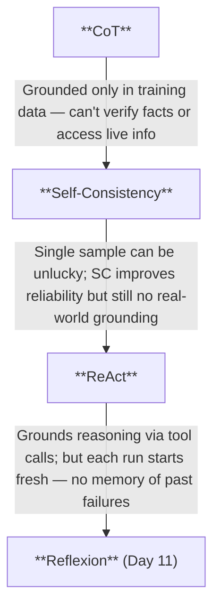

# Day 10 — Rest & Synthesize II

> **Today's one idea:** *(No new material. Today you consolidate Days 6–9.)*
> **Reading time:** ~30 min of active recall · **Prereqs:** Days 6–9
> **Primary source for today:** Your own traces from Day 9's code.

---

## What this day is for

Days 6–9 introduced four tightly related things:

1. **Chain-of-Thought** — make reasoning visible
2. **Self-Consistency** — make it more reliable by sampling
3. **ReAct (concept)** — interleave reasoning with action
4. **ReAct (implementation)** — build the actual loop

The relationship between them is the thing to consolidate today. They're not four separate techniques — they're one progression: each one extends the previous by solving a specific limitation.

```
CoT                → Thoughts visible, but grounded only in training data
Self-Consistency   → Thoughts more reliable, but still no real-world grounding
ReAct              → Grounded AND reasoning-guided, but no memory of failure
Reflexion (Day 11) → Grounded AND reasoning-guided AND learns from failure
```

By the end of today, this progression should feel like a single narrative, not a list.

---

## Synthesis exercises

Work through these in order. 5–7 minutes each.

---

### Exercise 1 — The progression diagram

Without opening any previous page, draw a diagram connecting CoT → Self-Consistency → ReAct. For each arrow, write one sentence explaining what problem the next pattern solves that the previous one could not.

<details>
<summary>Check your answer</summary>



If your diagram captures these three transitions, you have the correct mental model.
</details>

---

### Exercise 2 — Trace anatomy test

Below is a raw trace with all labels removed. Label every line as one of: THOUGHT / ACTION / OBS / ANSWER. Then identify: (a) how many complete think-act-observe cycles occurred, and (b) whether there are any "trace smells."

```
Line 1:  I need to find the year the Berlin Wall fell to answer this question.

Line 2:  web_search(query="year Berlin Wall fell")

Line 3:  "The Berlin Wall fell on November 9, 1989."

Line 4:  The Berlin Wall fell in 1989. Now I need to calculate how many years 
         ago that was from 2026.

Line 5:  calculator(expression="2026 - 1989")

Line 6:  "37"

Line 7:  2026 minus 1989 equals 37. The Berlin Wall fell 37 years ago.

Line 8:  The Berlin Wall fell in 1989, which was 37 years ago as of 2026.
```

<details>
<summary>Answers</summary>

```
Line 1:  [THOUGHT 1]
Line 2:  [ACTION 1] — web_search
Line 3:  [OBS 1]
Line 4:  [THOUGHT 2]
Line 5:  [ACTION 2] — calculator
Line 6:  [OBS 2]
Line 7:  [THOUGHT 3] — integrates OBS 2, recognizes task complete
Line 8:  [ANSWER]
```

**Two complete cycles.** Cycle 1: THOUGHT 1 → ACTION 1 → OBS 1. Cycle 2: THOUGHT 2 → ACTION 2 → OBS 2. Then termination.

**Trace smells?** None. The agent: correctly uses the calculator (doesn't compute "2026 − 1989" mentally), grounds the completion year via search (doesn't rely on training data), and terminates cleanly after getting both facts.
</details>

---

### Exercise 3 — Rebuild the implementation from memory

Open a blank file. Without looking at Day 9, write the `react_agent()` function skeleton — not the complete implementation, but:

1. The function signature
2. The `while` loop structure (or equivalent)
3. The two branches: tool_use and end_turn
4. What gets appended to `messages` in each branch
5. The termination conditions (both: task complete and max_steps exceeded)

Compare to [Day 9](./day-09-react-implementation.md) only after you've written your version. Note every line you got wrong — those are your knowledge gaps.

---

### Exercise 4 — Pattern comparison table

Fill in this table from memory. Mark each cell with: ✓ (yes), ✗ (no), or ~ (partial).

| | Reasoning visible? | Grounded in real-world? | Learns from failure? | Multi-step? |
|-|-------------------|------------------------|---------------------|------------|
| Direct generation | | | | |
| CoT | | | | |
| Self-Consistency | | | | |
| ReAct | | | | |

<details>
<summary>Answers</summary>

| | Reasoning visible? | Grounded in real-world? | Learns from failure? | Multi-step? |
|-|-------------------|------------------------|---------------------|------------|
| Direct generation | ✗ | ✗ | ✗ | ✗ |
| CoT | ✓ | ✗ | ✗ | ~ (within one response) |
| Self-Consistency | ✓ | ✗ | ✗ | ~ (parallel chains) |
| ReAct | ✓ | ✓ | ✗ | ✓ |

The "Learns from failure?" column is ✗ for everything so far. That's the gap Day 11 fills.
</details>

---

### Exercise 5 — Diagnose this agent

An agent is running a ReAct loop on the question: *"What are the top 5 countries by GDP in 2024?"*

After 8 steps, you examine the trace and find:
- Steps 1–4: four separate web searches with slightly different queries ("top 5 GDP countries 2024", "world GDP ranking 2024", "biggest economies 2024", "highest GDP nations 2024")
- Steps 5–8: the same four searches repeated

The agent never reaches an ANSWER.

Diagnose: what is wrong? Name the trace smell. Identify which component of the ReAct loop is malfunctioning. Propose one specific fix to the implementation.

<details>
<summary>Worked solution</summary>

**Trace smell:** Repetitive action loop (from [Day 4](../../01-foundations/days/day-04-reading-agent-trace.md)'s smell catalog). Steps 5–8 are literal repeats of 1–4.

**What's malfunctioning:** The termination condition. The agent receives search results (presumably with GDP data) but never decides to answer. Two possible causes:
1. The system prompt doesn't clearly instruct "when you have found the information, answer immediately"
2. The search stub is returning placeholder text (no real data), so the model doesn't recognize it as a satisfactory answer

**Fix:** Two changes:
1. Add explicit stopping instruction to the system prompt: "When you have the information needed to fully answer the question, provide your final answer immediately. Do not search for confirmation."
2. Connect a real search API so observations contain actual GDP data, not stubs.

For production robustness, also add: if the last N observations are identical, force termination and return whatever is known so far.
</details>

---

## What you should be able to do by the end of today

- [ ] Draw the CoT → Self-Consistency → ReAct progression with the transition reason for each arrow
- [ ] Label any agent trace as T/A/O events and identify smells
- [ ] Write the core `react_agent()` loop from memory (function structure, two branches, message append)
- [ ] Fill in the four-pattern comparison table without looking
- [ ] Diagnose a looping agent and propose a specific fix

---

## Looking ahead

Day 11 introduces Reflexion — the first pattern that adds **cross-run learning**. ReAct gives you a grounded reasoning loop within a single run. Reflexion adds a memory of what went wrong in previous runs. After Day 11, the comparison table's "Learns from failure?" column gets its first checkmark.

Days 12–13 then introduce deliberate search over reasoning paths — what happens when one linear chain of thought isn't enough and you need to explore and backtrack.

---

## Navigation

← **Previous:** [Day 9 — Implementing ReAct from Scratch](./day-09-react-implementation.md)
→ **Next:** [Day 11 — Reflexion: Verbal Reinforcement](./day-11-reflexion.md)
