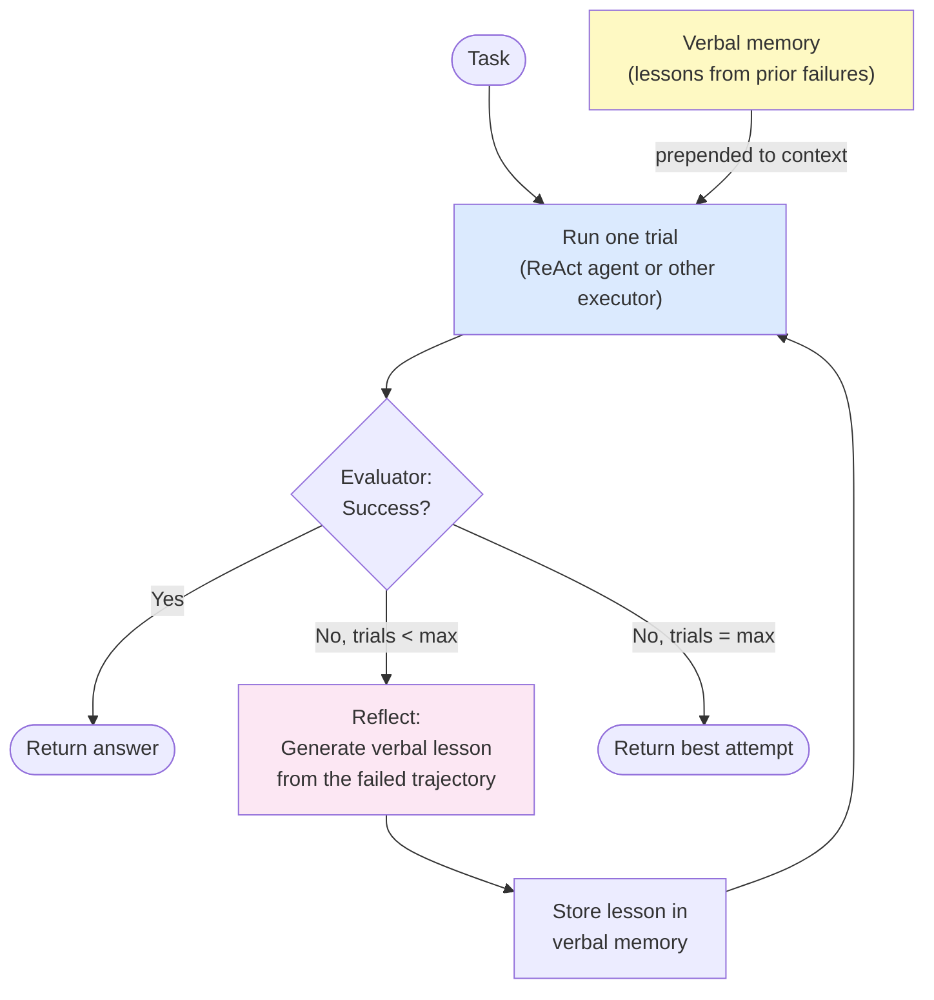

# Day 11 — Reflexion: Verbal Reinforcement

> **Today's one idea:** An agent that writes a natural-language critique of what went wrong in a past run, and prepends that lesson to its next attempt, can self-improve across episodes without any gradient updates.
> **Reading time:** ~40 min · **Prereqs:** Day 9 (ReAct implementation)
> **Primary source for today:** Shinn, Cassano, Gopinath, Narasimhan, Yao — *Reflexion: Language Agents with Verbal Reinforcement Learning* (NeurIPS 2023, arXiv:2303.11366) — Sections 2 and 3.

---

## The hook

You've just run your ReAct agent on a coding task. It failed. You look at the trace: the agent took a reasonable approach but made a subtle error on step 4 — it assumed the wrong type for a function parameter, which cascaded into a wrong output.

What do you do? In classical ML, you'd collect this failure as a training example and fine-tune. Expensive. Slow. Requires careful data curation. And you need to do it for every type of mistake.

What a human does: write a note. *"Next time: check parameter types before assuming. The function signature says `int` but the input was a `str` — always verify."* Next attempt, you read the note, and you don't make the same mistake.

Reflexion is this. Instead of gradient descent, it uses *verbal descent*: the agent generates a natural-language lesson from each failure, stores it as text, and adds it to the context of the next attempt. No training. No parameter updates. Just a growing note card of hard-won lessons.

Shinn et al. showed this increases pass rates on coding benchmarks (HumanEval) from 67% to 88% across trials — by doing nothing more sophisticated than appending text.

---

## Building the intuition

### Why verbal memory works

ReAct gives an agent a grounded reasoning loop. But each run starts completely fresh — the agent has no knowledge of past attempts. If it fails on trial 1 by misreading a search result, it might make the same mistake on trial 2.

Reflexion adds a **persistent verbal memory** that spans runs. The key insight is that large language models are *extremely good at reading and acting on natural-language instructions*. A well-written verbal lesson — "Do not trust the first search result. Cross-check numerical facts with a second source." — conditions the model's behavior far more reliably than you might expect, because the lesson is literally in the model's context when it attempts the next run.

Think of it as the difference between:
- **Fine-tuning:** update the model's weights to encode the lesson (slow, expensive, risky)
- **Verbal reinforcement:** write the lesson into the context (fast, free, reversible)

Verbal reinforcement is weaker than fine-tuning — it doesn't persist past the context window and it can be overridden by conflicting signals. But for many practical tasks, it's 80% of the benefit at 1% of the cost.

### The three memory components

Shinn et al. define three memory types in Reflexion, corresponding directly to the [Day 23 taxonomy](../05-memory/days/day-23-memory-taxonomy.md):

| Memory Type | Description |
| --- | --- |
| Short-term (working) | The current trajectory (context window). Cleared at the end of each trial. |
| Episodic (persistent) | The verbal lessons from past failures. A list of strings, prepended to each new trial's context. Persists across trials. |
| Semantic (external) | External knowledge stores (optional). Not always used; relevant for knowledge-intensive tasks where retrieval helps. |

The novel element is episodic memory: a list of verbal lessons that grows across trials and conditions future behavior.

---

## The formal picture

### The Reflexion algorithm



**The three actors:**

1. **Actor** — runs a trial (typically a ReAct agent). Produces a trajectory and a result.
2. **Evaluator** — scores the result (correct / incorrect, pass / fail). Can be a test suite, a reward model, or another LLM.
3. **Self-reflector** — takes the failed trajectory and generates a verbal lesson. This is just another LLM call.

### The reflection prompt

The self-reflector prompt follows this structure:

```
You are an expert at reflecting on failed attempts to improve future performance.

Task: {task_description}

Previous attempt trajectory:
{full_trajectory_of_failed_run}

Outcome: FAILED — {error_description}

Write a short (2–4 sentence) lesson that identifies what went wrong and 
what should be done differently on the next attempt. Be specific and actionable.
```

The output is the verbal lesson — a string like:

> "The error occurred because I assumed the API returned results in alphabetical order, but it actually returns by relevance. Next time, explicitly sort the results before selecting the top item."

### A working Reflexion implementation

```python
import anthropic

client = anthropic.Anthropic()

# ── Reuse react_agent() from Day 9 ─────────────────────────────────────────

def reflect_on_failure(task: str, trajectory: str, error: str) -> str:
    """
    Given a failed trajectory, generate a verbal lesson for the next trial.
    This is the Self-Reflector component of Reflexion.
    """
    response = client.messages.create(
        model="claude-3-5-sonnet-20241022",
        max_tokens=256,
        messages=[{
            "role": "user",
            "content": (
                f"You are reflecting on a failed attempt to help improve future performance.\n\n"
                f"Task: {task}\n\n"
                f"What happened (trajectory summary):\n{trajectory}\n\n"
                f"Why it failed: {error}\n\n"
                f"Write 2–4 sentences identifying the specific mistake and what to do "
                f"differently next time. Be concrete and actionable, not vague."
            )
        }]
    )
    return response.content[0].text.strip()


def evaluate_result(task: str, result: str) -> tuple[bool, str]:
    """
    Evaluate whether the agent's result solves the task.
    Returns (success: bool, error_description: str).

    Replace with a real evaluator: test suite, LLM-as-judge, regex check, etc.
    This stub always returns failure for demonstration.
    """
    # Stub — replace with real evaluation logic
    # E.g. for coding: run unit tests
    #      for QA: check against a gold answer
    #      for general: use an LLM evaluator
    return False, "Stub evaluator: always returns failure. Replace with real logic."


def build_context_with_memory(task: str, verbal_memory: list[str]) -> str:
    """
    Prepend verbal lessons from past failures to the task.
    This is the episodic memory injection step.
    """
    if not verbal_memory:
        return task

    lessons = "\n".join(f"  {i+1}. {lesson}" for i, lesson in enumerate(verbal_memory))
    return (
        f"LESSONS FROM PREVIOUS FAILED ATTEMPTS:\n"
        f"{lessons}\n\n"
        f"Apply these lessons carefully in your approach.\n\n"
        f"TASK:\n{task}"
    )


def reflexion_agent(
    task: str,
    max_trials: int = 3,
    verbose: bool = True
) -> str:
    """
    A Reflexion agent: ReAct + verbal reinforcement learning across trials.

    For each failed trial:
      1. Extract what went wrong (reflection)
      2. Store as a verbal lesson (episodic memory)
      3. Prepend lessons to the next trial's context

    Args:
        task:       The task description.
        max_trials: Maximum number of attempts before giving up.
        verbose:    Print trial summaries.

    Returns:
        The best answer found, or a failure message.
    """
    verbal_memory: list[str] = []
    best_result = None

    for trial_num in range(1, max_trials + 1):
        if verbose:
            print(f"\n{'='*50}")
            print(f"TRIAL {trial_num} / {max_trials}")
            if verbal_memory:
                print(f"Carrying {len(verbal_memory)} lesson(s) from prior failures.")
            print('='*50)

        # Inject verbal memory into the task context
        contextual_task = build_context_with_memory(task, verbal_memory)

        # Run one trial with the ReAct agent
        # (import react_agent from day-09, or paste it here)
        result = react_agent(contextual_task, max_steps=8, verbose=verbose)
        best_result = result

        # Evaluate
        success, error = evaluate_result(task, result)

        if success:
            if verbose:
                print(f"\n✓ SUCCESS on trial {trial_num}")
            return result

        if verbose:
            print(f"\n✗ Trial {trial_num} failed: {error}")

        # Reflect and store lesson (skip after last trial — no next attempt)
        if trial_num < max_trials:
            # Build a trajectory summary for the reflector
            # (in production: capture the actual trace from react_agent)
            trajectory_summary = f"Agent produced result: '{result}'. Error: {error}"
            lesson = reflect_on_failure(task, trajectory_summary, error)

            verbal_memory.append(lesson)

            if verbose:
                print(f"\nLesson learned: {lesson}")

    if verbose:
        print(f"\nFailed after {max_trials} trials.")
    return best_result or "No result produced."


# ── Example ────────────────────────────────────────────────────────────────────

if __name__ == "__main__":
    # Replace evaluate_result() with real logic to see Reflexion working.
    # E.g., for a math problem, check if the numeric answer matches.
    task = "What is the total population of the G7 countries?"
    reflexion_agent(task, max_trials=3, verbose=True)
```

### What the verbal lessons look like in practice

From Shinn et al.'s HumanEval experiments, verbal lessons after failed coding trials look like:

> *"I implemented the function correctly for positive integers but failed to handle the edge case where the input is 0. Next time, explicitly test my solution against boundary values (0, negative numbers, empty lists) before returning."*

> *"I misread the problem specification: it asked for the last occurrence, not the first. Next time, re-read the exact wording of the specification before starting the implementation."*

These lessons are specific, actionable, and directly target the failure mode. Generic lessons ("be more careful next time") don't improve performance. Specific ones do.

---

## Where it breaks / what it is not

**Verbal lessons can be wrong.** The self-reflector is an LLM — it can misdiagnose the failure. If the lesson is "I should search less," when the real problem was a faulty computation, the next trial gets worse, not better. Reflexion has no mechanism to validate that its lessons are correct. This is a fundamental limitation.

**Lessons compound but don't generalize.** Each lesson addresses a specific failure in a specific trial. After many trials, the verbal memory becomes a long list of specific caveats that may contradict each other. Reflexion doesn't distill lessons into generalizable principles — that's closer to what ExpeL (Day 17) does.

**Context window has a hard limit.** Each lesson adds tokens to every future trial's context. After ~10 lessons, the prepended memory may be longer than the actual task description. In practice, Reflexion is most useful for 2–5 trials — not indefinite self-improvement.

**Reflexion requires an evaluator.** The pattern only triggers reflection when a trial *fails*. This means you need a clear success/failure signal. ReAct on open-ended creative tasks has no obvious evaluator, making Reflexion inapplicable without engineering an LLM-as-judge evaluator (Day 28).

---

## Try it yourself

**Exercise 1 — Check your understanding:**
Explain the difference between Reflexion and fine-tuning in terms of *where the lesson is stored*. Use the cognitive architecture taxonomy from Day 2 to categorize each approach.

**Exercise 2 — Apply it:**
Modify `evaluate_result()` in the code above to evaluate a specific task: "What is 17 factorial?" The correct answer is 355,687,428,096,000. If the agent's answer is within 1% of this, return success. Run `reflexion_agent()` with your evaluator. Does the lesson from trial 1 help trial 2?

**Exercise 3 — Stretch:**
Reflexion's self-reflector generates a lesson from the trajectory. What if the trajectory is very long (20+ steps) and the failure happened early? Design a modified reflector prompt that ensures the lesson focuses on the specific failure point, not just the final outcome.

<details>
<summary>Hint for Exercise 1</summary>
In the Day 2 taxonomy, memory has four types. Fine-tuning stores information in parametric memory (the weights). Where does a verbal lesson live? Is it in-context, external, or somewhere else?
</details>

<details>
<summary>Worked solution for Exercise 1</summary>
Fine-tuning stores the lesson in **parametric memory** — the model's weights. This is persistent across all future runs, across all contexts, indefinitely. But it requires gradient computation, a training dataset, infrastructure, and careful validation to avoid degrading unrelated capabilities.

Reflexion stores the lesson in **external episodic memory** — a list of strings that is retrieved and prepended to the context. It is persistent across trials within one session, but not across sessions unless you explicitly save `verbal_memory` to disk. It requires no training infrastructure and is immediately reversible (delete the lesson string). But it consumes context window tokens and doesn't generalize beyond its literal wording.

The trade-off: parametric memory is permanent and zero-cost at inference time; episodic memory is cheap to create but costs tokens every run.
</details>

---

## Connect it back

[Day 9's ReAct](./day-09-react-implementation.md) gave you a grounded reasoning loop within one run. Reflexion wraps that loop in a trial-and-error meta-loop, adding a memory that spans across runs. In the comparison table from Day 10, this is the first checkmark in "Learns from failure?"

Reflexion is also the first **self-improvement pattern** you've seen — the pivot point into Module 3 (Days 15–18). Self-Refine (Day 15) does something similar but within a *single* run rather than across trials. STaR (Day 16) encodes the lessons into the weights instead of the context. ExpeL (Day 17) mines many past trajectories at once, not just one at a time.

Tomorrow: instead of a linear thought chain that can be wrong, what if the agent could explore multiple candidate thoughts and pick the best? That's Tree of Thoughts.

**One question you can now answer that you couldn't this morning:** An agent fails three times on the same task with slightly different approaches, and you've captured all three traces. How would you use Reflexion to help it on the fourth attempt — and what would you need to implement that's not in today's code?

---

## Suggested readings for today

**Required if you have 15 extra minutes:**
Shinn et al., *Reflexion* (arXiv:2303.11366) — Section 3 (framework, 3 pages).
Section 3.1 defines the three memory components formally; Section 3.2 shows the reflection prompt format; Section 3.3 maps the pattern to different task types (decision-making, coding, QA). Essential for seeing how the same pattern applies across domains.

**If you want the deep version:**
- Shinn et al., Section 4 (experiments) — the HumanEval results (88% vs 67% pass rate) are in Table 1; the ablation in Table 2 shows how much of the improvement comes from reflection vs. just more trials. The answer is surprising.
- Madaan et al., *Self-Refine* (arXiv:2303.17651) — Section 1 (introduction, 1 page). Preview of Day 15: same core idea (LLM critiques its own output) but within a single run rather than across trials. Reading the intro now will let you spot the design choice on Day 15.

---

## Navigation

← **Previous:** [Day 10 — Rest & Synthesize II](./day-10-rest-synthesize-ii.md)
→ **Next:** [Day 12 — Tree of Thoughts](./day-12-tree-of-thoughts.md)
