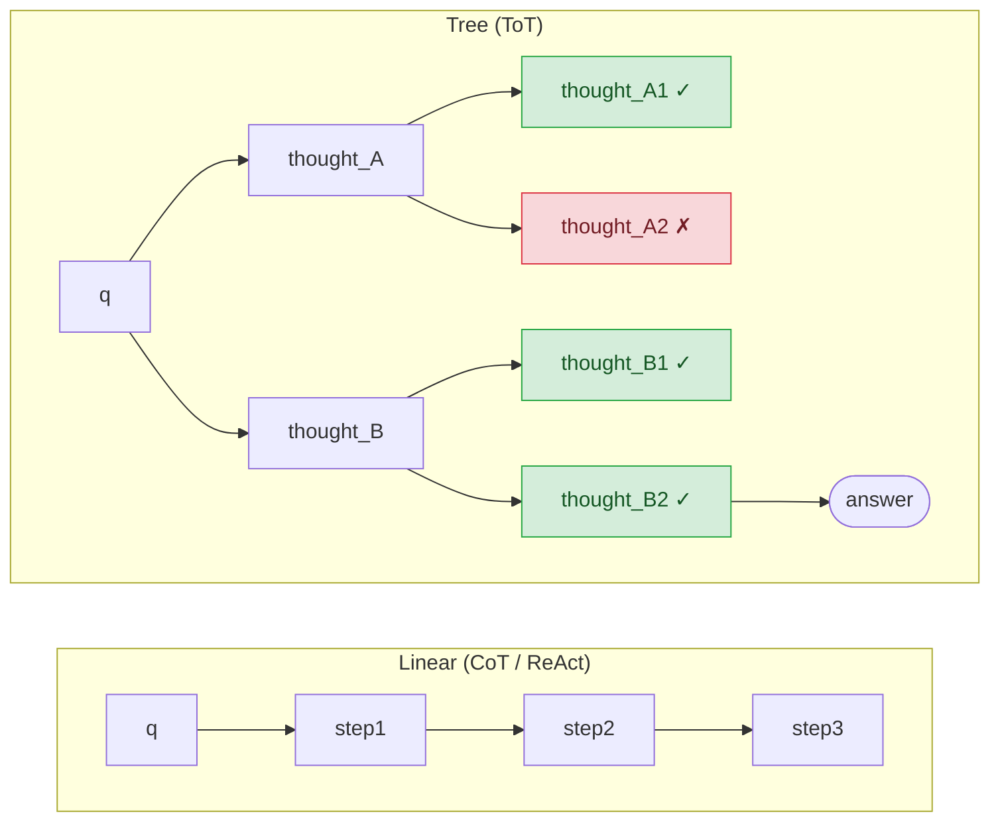

# Day 12 — Tree of Thoughts

> **Today's one idea:** Deliberate search over a tree of partial reasoning states — exploring multiple candidate thoughts, evaluating each, and pruning dead ends — solves problems that a single linear reasoning chain cannot.
> **Reading time:** ~45 min · **Prereqs:** Day 7 (Self-Consistency), Day 11 (Reflexion)
> **Primary source for today:** Yao, Yu, Zhao, Shafran, Griffiths, Cao, Narasimhan — *Tree of Thoughts: Deliberate Problem Solving with Large Language Models* (NeurIPS 2023, arXiv:2305.10601) — Sections 2 and 3.

---

## The hook

Consider the Game of 24: using four numbers (e.g., 4, 9, 10, 13) and the four arithmetic operations, make 24. You can only use each number once.

A standard CoT agent — even with Self-Consistency sampling 20 paths — solves this 4% of the time.

A human who solves this doesn't just think "4 × 9 = 36, not useful, abandon." They think like a chess player: *try a move, see where it leads, backtrack if stuck, try a different move*. They explore a tree of partial solutions and prune bad branches early — rather than committing to one path and hoping.

Tree of Thoughts (ToT) gives this chess-player ability to a language model. It achieves 74% on the same task.

The difference isn't cleverness — it's search structure. CoT is depth-first with no backtracking. ToT is deliberate tree search: breadth-first or depth-first, with evaluation at each node to decide which branches are worth pursuing.

---

## Building the intuition

### Why linear reasoning fails on hard problems

[CoT](./day-06-chain-of-thought.md) and [ReAct](./day-08-react.md) both generate one linear reasoning path. The model makes a decision at each step and commits. If step 3 is wrong, steps 4–10 are built on a wrong foundation, and the error compounds.

[Self-Consistency](./day-07-self-consistency.md) samples multiple paths — but independently. Each path is still a committed linear chain. Self-Consistency can't share information across paths or backtrack within a path.

For tasks where the solution space requires exploration — where you might need to try an approach, discover it's wrong, and try a different one from the same starting point — you need a tree structure with backtracking.



In the tree, the agent can: explore multiple children from the same node, evaluate each, prune low-scoring branches, and backtrack to a higher node if needed. This is deliberate search.

### The four components of ToT

Yao et al. define four things you need to specify for any ToT system:

**1. Thought decomposition:** How do you break the problem into individual "thoughts" (steps)? 
- For a multi-step math problem: each operation is a thought.
- For writing: each paragraph or sentence is a thought.
- For planning: each sub-goal is a thought.

**2. Thought generation:** How do you generate candidate thoughts at each node?
- *Sampling:* generate k thoughts independently (like Self-Consistency at each node)
- *Proposing:* ask the model to enumerate k distinct thoughts in one call

**3. State evaluation:** How do you score each thought?
- *Value function:* ask an LLM "how promising is this partial solution on a scale of 1–10?"
- *Vote:* generate multiple completions from this state and take the majority
- *Heuristic:* domain-specific rule (e.g., "closer to 24 is better")

**4. Search algorithm:** How do you traverse the tree?
- **BFS (Breadth-First Search):** explore all nodes at depth d before going to d+1. Best when the depth is fixed and you want to compare all candidates at each level.
- **DFS (Depth-First Search):** go deep on the most promising path; backtrack on failure. Best for tasks with variable-depth solutions.

---

## The formal picture

### The data structure

```
Node:
  content: str          # the thought text
  parent:  Node | None  # parent in the tree
  children: list[Node]  # generated children
  score:   float        # evaluator score (0.0–1.0)
  depth:   int          # distance from root

Tree:
  root:    Node         # the original problem
  current: Node         # node being expanded
```

Visually, for the Game of 24 problem "4, 9, 10, 13":

```
                    [4, 9, 10, 13]
                   /              \
          [4+9=13, remaining: 10,13]    [4*9=36, remaining: 10,13]
         score: 0.3                     score: 0.7
                                       /               \
                          [36-10=26, remaining: 13]   [36/10, not integer]
                          score: 0.6                    score: 0.1 → PRUNE
                                |
                          [26-13=13 ≠ 24]
                          score: 0.0 → BACKTRACK
```

The evaluator scores each node. Branches with low scores are pruned. The algorithm backtracks to higher nodes when a branch fails.

### A BFS ToT implementation

```python
from __future__ import annotations
from dataclasses import dataclass, field
import anthropic

client = anthropic.Anthropic()


@dataclass
class ThoughtNode:
    content:  str
    parent:   "ThoughtNode | None" = None
    children: list["ThoughtNode"]  = field(default_factory=list)
    score:    float                 = 0.0
    depth:    int                   = 0

    def path_from_root(self) -> list[str]:
        """Return the reasoning path from root to this node."""
        path, node = [], self
        while node is not None:
            path.append(node.content)
            node = node.parent
        return list(reversed(path))


def generate_thoughts(problem: str, current_path: list[str], n: int = 3) -> list[str]:
    """
    Generate n candidate next thoughts given the current reasoning path.
    This is the 'thought generation' component of ToT.
    """
    path_str = "\n".join(f"Step {i+1}: {s}" for i, s in enumerate(current_path))
    prompt = (
        f"Problem: {problem}\n\n"
        f"Reasoning so far:\n{path_str if path_str else '(none yet)'}\n\n"
        f"Generate {n} distinct, specific next reasoning steps. "
        f"Each step should be different and explore a different direction. "
        f"Format: number each step on its own line. "
        f"Do not evaluate them — just generate."
    )
    response = client.messages.create(
        model="claude-3-5-sonnet-20241022",
        max_tokens=512,
        messages=[{"role": "user", "content": prompt}]
    )
    lines = response.content[0].text.strip().splitlines()
    # Parse numbered lines: "1. ..." or "1) ..."
    thoughts = []
    for line in lines:
        line = line.strip()
        if line and (line[0].isdigit() or line.startswith("-")):
            # Strip leading "1. " or "- "
            thought = line.lstrip("0123456789.-) ").strip()
            if thought:
                thoughts.append(thought)
    return thoughts[:n]


def evaluate_thought(problem: str, path: list[str]) -> float:
    """
    Score a partial reasoning path on a scale of 0–1.
    This is the 'state evaluation' component of ToT.
    Higher = more promising.
    """
    path_str = "\n".join(f"Step {i+1}: {s}" for i, s in enumerate(path))
    prompt = (
        f"Problem: {problem}\n\n"
        f"Partial reasoning path:\n{path_str}\n\n"
        f"Rate how promising this partial path is for solving the problem. "
        f"Consider: Is it making progress? Is it on the right track? "
        f"Does it avoid dead ends?\n\n"
        f"Respond with ONLY a number between 0.0 (useless) and 1.0 (very promising)."
    )
    response = client.messages.create(
        model="claude-3-5-sonnet-20241022",
        max_tokens=16,
        messages=[{"role": "user", "content": prompt}]
    )
    try:
        return float(response.content[0].text.strip())
    except ValueError:
        return 0.5  # default if parsing fails


def tot_bfs(
    problem: str,
    max_depth:    int   = 4,
    branching:    int   = 3,
    beam_width:   int   = 2,
    score_cutoff: float = 0.3,
) -> str:
    """
    Tree of Thoughts with BFS and beam search.

    At each depth level:
      1. Expand the top-k nodes (beam_width)
      2. Generate branching_factor children per node
      3. Score all children
      4. Prune below score_cutoff
      5. Keep top beam_width for the next level

    Args:
        problem:      The problem statement.
        max_depth:    Maximum tree depth before forcing a final answer.
        branching:    Number of thoughts generated per node.
        beam_width:   Number of nodes to keep at each depth level.
        score_cutoff: Prune any node scoring below this threshold.

    Returns:
        The best reasoning path found, as a formatted string.
    """
    root = ThoughtNode(content=problem, depth=0)
    current_level = [root]

    for depth in range(1, max_depth + 1):
        print(f"\n[Depth {depth}] Expanding {len(current_level)} node(s)...")
        next_level: list[ThoughtNode] = []

        for node in current_level:
            path = node.path_from_root()[1:]  # exclude the root (problem statement)
            thoughts = generate_thoughts(problem, path, n=branching)

            for thought_text in thoughts:
                child = ThoughtNode(
                    content=thought_text,
                    parent=node,
                    depth=depth
                )
                child.score = evaluate_thought(problem, path + [thought_text])
                node.children.append(child)
                print(f"  [{child.score:.2f}] {thought_text[:80]}...")
                next_level.append(child)

        # Prune low-scoring nodes
        next_level = [n for n in next_level if n.score >= score_cutoff]

        if not next_level:
            print("  All branches pruned. Stopping early.")
            break

        # Beam search: keep only the top beam_width nodes
        next_level.sort(key=lambda n: n.score, reverse=True)
        current_level = next_level[:beam_width]

    # Return the best path found
    best = max(current_level, key=lambda n: n.score)
    path = best.path_from_root()

    return "\n".join(f"Step {i}: {s}" for i, s in enumerate(path))


if __name__ == "__main__":
    problem = (
        "A farmer needs to cross a river with a fox, a chicken, and a bag of grain. "
        "The boat can only carry the farmer and one item. "
        "If left alone, the fox will eat the chicken, and the chicken will eat the grain. "
        "How can the farmer get all three items across?"
    )
    print(f"Problem: {problem}\n")
    result = tot_bfs(problem, max_depth=4, branching=3, beam_width=2)
    print(f"\nBest reasoning path found:\n{result}")
```

### Beam search vs. pure BFS

Pure BFS keeps *all* nodes at each level — exponential growth. Beam search keeps only the top-k by score. This is the practical version: you set `beam_width=2` to explore 2 branches at each depth, making it `branching^depth` → `beam_width^depth` calls. Far more tractable.

---

## Where it breaks / what it is not

**Combinatorial cost.** Even with beam search, ToT is dramatically more expensive than CoT. `branching=3, depth=4, beam_width=2` = roughly 3+6+6+6 = ~21 LLM calls for the generation step alone, plus evaluation calls. This is 10–30× the cost of CoT. Use it only when task complexity justifies it.

**Evaluator quality is the bottleneck.** Everything depends on the evaluator accurately scoring partial paths. An LLM evaluator that scores "promising" paths poorly will prune the right answer and keep dead ends. Designing a reliable evaluator for your specific task domain is often the hardest part of building a ToT system.

**ToT doesn't help when all paths are equivalent.** For tasks where any reasonable starting step leads to the same answer (most factual Q&A), ToT adds cost without benefit. It shines specifically on combinatorial or creative problems where early decisions *matter* for reaching a solution.

**State space explosion for long horizons.** Even with pruning, very deep trees (depth > 6–8) become intractable. LATS (Day 13) addresses this by using Monte Carlo rollouts to *simulate* deep paths cheaply, then only fully exploring the most promising ones.

---

## Try it yourself

**Exercise 1 — Check your understanding:**
Draw a ToT tree (by hand) for this problem: "Write a four-word slogan for a coffee brand." Show depth 1 (three candidate first words), depth 2 (two candidate second words per branch), and which branches you would prune at each level. What does your evaluator function look like for this task?

**Exercise 2 — Apply it:**
Run the code above on a small puzzle problem. Vary `beam_width` (try 1, 2, 3) and observe how the number of API calls and result quality change. At what beam_width does the quality plateau?

**Exercise 3 — Stretch:**
The current evaluator prompt asks the LLM to score on a 0–1 scale — but LLMs are notoriously poorly calibrated as value estimators. Design an alternative evaluator strategy for a specific task (e.g., solving a logic puzzle) that uses *task-specific heuristics* rather than open-ended LLM scoring. What would make it more reliable?

<details>
<summary>Hint for Exercise 1</summary>
For a creative task, the "evaluator" needs a concrete criterion. Rather than "is this promising?" (too vague), try: "does this word fit a coffee brand's tone (energizing, warm, quality)?" — score each word 1–3 on each criterion, average. This is still LLM-based but gives the evaluator something specific to assess.
</details>

---

## Connect it back

[Self-Consistency (Day 7)](./day-07-self-consistency.md) sampled multiple independent paths and voted. ToT explores paths *interactively* — sharing state between paths, pruning early, and backtracking. The progression: CoT (one path) → Self-Consistency (many parallel paths) → ToT (one interconnected search tree).

[Tomorrow (Day 13)](./day-13-lats.md), we add Monte Carlo rollouts to the tree: instead of just scoring partial paths based on their current state, we *simulate* completions to estimate how promising they are. This is LATS — the most complete reasoning+acting+planning pattern in the course.

**One question you can now answer that you couldn't this morning:** Self-Consistency and ToT both explore multiple reasoning paths. What is the fundamental architectural difference between them — and what class of problem does that difference matter for?

---

## Suggested readings for today

**Required if you have 15 extra minutes:**
Yao et al., *Tree of Thoughts* (arXiv:2305.10601) — Section 2 (framework, 3 pages) and Section 3.1 (Game of 24, 2 pages).
Section 2 defines the four components precisely; Section 3.1 is the clearest worked example in the paper — every detail of the ToT implementation for Game of 24 is explained.

**If you want the deep version:**
- Yao et al., Section 3.2 (Creative Writing task) and Section 3.3 (Mini Crosswords). Two more worked examples showing how the four components change for different task types. Reading all three examples (24, writing, crosswords) gives you an intuition for how to adapt ToT to new tasks.

---

## Navigation

← **Previous:** [Day 11 — Reflexion: Verbal Reinforcement](./day-11-reflexion.md)
→ **Next:** [Day 13 — LATS: Language Agent Tree Search](./day-13-lats.md)
