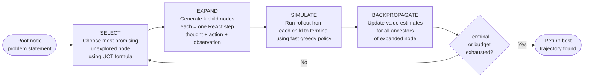

# Day 13 — LATS: Language Agent Tree Search

> **Today's one idea:** Combining tree search with Monte Carlo rollouts and real environment feedback gives an agent the ability to plan deliberately through an interactive world — unifying reasoning, acting, and planning in a single framework.
> **Reading time:** ~40 min · **Prereqs:** Day 12 (ToT), Day 9 (ReAct implementation)
> **Primary source for today:** Zhou, Yan, Shlapentokh-Rothman, Wang, Wang — *Language Agent Tree Search Unifies Reasoning Acting and Planning in Language Models* (2023, arXiv:2310.04406) — Sections 2 and 3.

---

## The hook

Tree of Thoughts is a powerful reasoning engine — but it has a limitation: it operates purely in the space of *thoughts*. The agent thinks about possibilities; it doesn't *act* in the world and observe what happens.

Now imagine a task like debugging a program. You don't just think about what the bug might be — you run the code, observe the error, hypothesize a fix, apply it, run again, observe. The environment gives you feedback on each action. Your reasoning needs to be grounded in those observations, and you need to be able to backtrack: "that fix made it worse; revert to the previous version and try a different approach."

ToT can't do this. ReAct can act and observe — but it has no tree structure, no ability to backtrack or explore alternatives.

LATS is the synthesis: a tree search where each node is a (thought, action, observation) triplet — a ReAct step — not just a thought. The agent explores a tree of *trajectories* through the environment, uses Monte Carlo rollouts to estimate the value of each path, and applies tree search to find the best sequence of actions.

This is what AlphaGo does for board games. LATS does it for language agents.

---

## Building the intuition

### The three things LATS combines

```
ReAct  +  Tree of Thoughts  +  Monte Carlo Tree Search (MCTS)
  ↓              ↓                         ↓
Act in      Explore multiple         Estimate path
the world   trajectories             value with rollouts
```

Each component solves one limitation of the others:

- **ReAct without a tree:** acts, but commits to one path. Can't backtrack.
- **ToT without actions:** explores, but can't ground in real environment feedback.
- **MCTS without language:** searches, but needs a discrete state space and a value function — neither natural for language tasks.

LATS provides all three at once.

### Monte Carlo rollouts: the key addition

The expensive part of tree search is *evaluation*: how promising is this partial trajectory? In ToT (Day 12), we asked an LLM to score the current state — which is cheap but often inaccurate.

LATS uses **Monte Carlo rollouts**: from the current state, run a *simulated* completion to the end (a "rollout"), observe the outcome, and use that outcome as the value estimate. You can run several rollouts and average their outcomes for a more stable estimate.

```
Current state (depth 3):  [thought1, action1, obs1, thought2, action2, obs2, thought3]
                                          ↓ rollout (run to completion)
Simulated completion:     [action3_sim, obs3_sim, ..., final_outcome_sim]
Value estimate:            Did the simulated run succeed? score → 0 or 1 (or continuous)
```

Rollouts are cheaper than full exploration because you use a fast policy (greedy generation, no tree search) for the simulated part. The full search only happens for the nodes you decide to expand.

---

## The formal picture

### The LATS algorithm



**UCT (Upper Confidence bound for Trees):** the node selection formula that balances exploration vs. exploitation:

$$UCT(v) = \frac{W(v)}{N(v)} + c \sqrt{\frac{\ln N(parent)}{N(v)}}$$

where:
- $W(v)$ = total value accumulated at node $v$ across all rollouts
- $N(v)$ = number of times node $v$ has been visited
- $c$ = exploration constant (higher = more exploration of untried nodes)
- First term = exploitation: how good is this node on average?
- Second term = exploration: bonus for rarely-visited nodes

This formula ensures the search doesn't get stuck on one promising-but-local path — it keeps exploring alternatives.

### LATS vs. ToT: key differences

| | ToT | LATS |
|--|-----|------|
| Node content | Thought only | Thought + Action + Observation |
| Evaluation | Static LLM scoring | Monte Carlo rollouts |
| Environment interaction | None | Yes — real tool calls |
| Backtracking | Yes (within thoughts) | Yes (within trajectories) |
| Search algorithm | BFS / DFS | MCTS with UCT |
| Best for | Pure reasoning tasks | Interactive, multi-step tasks |

### A simplified LATS sketch

A full MCTS implementation is substantial (100+ lines). Here is the conceptual core, with the key data structures and the search loop:

```python
from __future__ import annotations
from dataclasses import dataclass, field
from math import log, sqrt
import anthropic

client = anthropic.Anthropic()

# ── Node ──────────────────────────────────────────────────────────────────────

@dataclass
class LATSNode:
    """One node in the LATS search tree.

    Each node represents a (thought, action, observation) step —
    i.e., one ReAct cycle — in a trajectory through the environment.
    """
    thought:     str
    action:      str = ""
    observation: str = ""
    parent:      "LATSNode | None" = None
    children:    list["LATSNode"]  = field(default_factory=list)
    visits:      int   = 0
    total_value: float = 0.0
    depth:       int   = 0

    @property
    def value(self) -> float:
        """Average value across all rollouts through this node."""
        return self.total_value / self.visits if self.visits > 0 else 0.0

    def uct_score(self, exploration_c: float = 1.4) -> float:
        """UCT selection score — balance exploitation and exploration."""
        if self.visits == 0:
            return float("inf")  # unvisited nodes always selected first
        parent_visits = self.parent.visits if self.parent else self.visits
        exploitation = self.value
        exploration  = exploration_c * sqrt(log(parent_visits) / self.visits)
        return exploitation + exploration

    def trajectory(self) -> list["LATSNode"]:
        """Full path from root to this node."""
        path, node = [], self
        while node is not None:
            path.append(node)
            node = node.parent
        return list(reversed(path))


# ── Core MCTS operations ───────────────────────────────────────────────────────

def select_leaf(root: LATSNode) -> LATSNode:
    """Walk the tree, always choosing the child with the highest UCT score."""
    node = root
    while node.children:
        node = max(node.children, key=lambda n: n.uct_score())
    return node


def expand(node: LATSNode, problem: str, n_children: int = 3) -> list[LATSNode]:
    """
    Generate n_children child nodes from the current node.
    Each child = one ReAct step (thought + action + observation).
    In a real implementation: call the LLM to generate the thought,
    then execute the action, then get the observation from the environment.
    """
    children = []
    for i in range(n_children):
        # Stub: in production, generate thought via LLM, execute action, observe
        child = LATSNode(
            thought=f"[Thought at depth {node.depth + 1}, branch {i+1}]",
            action=f"[Action {i+1}]",
            observation=f"[Observation {i+1}]",
            parent=node,
            depth=node.depth + 1
        )
        node.children.append(child)
        children.append(child)
    return children


def rollout(node: LATSNode, problem: str, max_depth: int = 5) -> float:
    """
    Simulate a fast (greedy) completion from this node.
    Return a value in [0.0, 1.0]: 1.0 = success, 0.0 = failure.
    In production: run the task to completion using greedy generation
    and evaluate the outcome with your task evaluator.
    """
    # Stub — return a random-ish value for demonstration
    # Replace with: run_greedy_completion(node.trajectory(), max_depth) → evaluate()
    depth_bonus = 1.0 - (node.depth / 10.0)  # deeper = harder
    return max(0.0, depth_bonus)


def backpropagate(node: LATSNode, value: float) -> None:
    """Propagate the rollout value up to the root."""
    current = node
    while current is not None:
        current.visits      += 1
        current.total_value += value
        current = current.parent


# ── Main LATS search loop ──────────────────────────────────────────────────────

def lats_search(
    problem:      str,
    iterations:   int = 20,
    n_children:   int = 3,
    max_rollout:  int = 5,
) -> LATSNode:
    """
    LATS search: iteratively select, expand, simulate, and backpropagate.

    Returns the leaf node with the highest value after all iterations.
    """
    root = LATSNode(thought=problem, depth=0)

    for i in range(iterations):
        # 1. Select the most promising unexplored leaf
        leaf = select_leaf(root)

        # 2. Expand (generate children = new ReAct steps)
        if leaf.depth < max_rollout:
            children = expand(leaf, problem, n_children)
            # 3. Simulate from each child
            for child in children:
                value = rollout(child, problem, max_rollout)
                # 4. Backpropagate
                backpropagate(child, value)
        else:
            # Leaf is at max depth — evaluate directly
            value = rollout(leaf, problem, 0)
            backpropagate(leaf, value)

    # Find the best terminal node
    def best_leaf(node: LATSNode) -> LATSNode:
        if not node.children:
            return node
        return max((best_leaf(c) for c in node.children), key=lambda n: n.value)

    return best_leaf(root)


if __name__ == "__main__":
    problem = "Debug this Python function: it returns wrong results for negative inputs."
    best = lats_search(problem, iterations=15, n_children=3)
    print(f"Best trajectory found (value={best.value:.3f}):")
    for step in best.trajectory():
        print(f"  Depth {step.depth}: {step.thought[:60]}")
```

The `# Stub` comments mark the three places you replace with real logic: thought generation via LLM, action execution via tools, and outcome evaluation via your task evaluator.

---

## Where it breaks / what it is not

**Cost scales with iterations × children.** At `iterations=20, n_children=3`, you generate 60+ nodes and run 60 rollouts. Each rollout is itself a complete agent run. LATS can consume 100–200× the tokens of a single ReAct run. It is a last resort for tasks where simpler patterns have failed, not a default choice.

**Rollout quality determines search quality.** If your rollout policy (greedy completion) is terrible, the value estimates are noisy and the search explores randomly. LATS assumes the rollout policy produces *informative* (if imperfect) value signals. If the policy hallucinates completely, MCTS degenerates to random search.

**Environments must be resettable.** Each rollout simulates a completion from a partial state. In an interactive environment (web browser, file system, database), you need to be able to reset to the partial state before running each rollout. In stateful environments without reset capability, rollouts are destructive. This is a hard deployment constraint.

**LATS is overkill for linear tasks.** For a question-answering task that requires 3 tool calls in a fixed sequence, LATS adds enormous complexity for no benefit. Use LATS when: (a) tasks require backtracking, (b) early decisions significantly affect later options, and (c) the evaluation signal is clear.

---

## Try it yourself

**Exercise 1 — Check your understanding:**
Explain the difference between LATS's node expansion and ToT's node expansion. What additional real-world information does a LATS node contain that a ToT node does not?

**Exercise 2 — Apply it:**
In the code above, replace the `rollout` stub with a deterministic value: return `1.0` if the node's depth is even, `0.0` if odd. Run the search and observe which nodes get selected. Does the UCT formula correctly balance exploitation vs. exploration? What changes if you set the exploration constant `c=0` vs. `c=2.0`?

**Exercise 3 — Stretch:**
LATS requires a way to simulate completions from partial states — but many real environments are stateful and can't be reset cheaply (e.g., a file system after writes). Design a LATS variant that avoids environmental rollouts entirely, using only an LLM's *imagination* of what would happen (simulated observations without actually calling tools). What are the failure modes of this approach?

<details>
<summary>Hint for Exercise 2</summary>
With c=0, UCT reduces to pure greedy: always pick the node with the highest average value. Watch which nodes get selected repeatedly. With c=2.0, the exploration bonus is large — the search should visit many different branches, including ones that haven't been explored yet. Compare the spread of selected nodes under each setting.
</details>

---

## Connect it back

You've now completed the full reasoning pattern arc:

```
CoT          → make reasoning explicit
Self-Consistency → sample multiple linear paths
ReAct        → ground reasoning in real observations
Reflexion    → learn verbally from past failures
ToT          → search a tree of reasoning states
LATS         → search a tree of full trajectories through an environment
```

Each pattern solved a specific limitation of the one before it. LATS is the most powerful — and most expensive — of the six. [Tomorrow (Day 14)](./day-14-thinking-fast-slow.md) closes the module with the question you should always ask first: *which of these six do I actually need for this task?*

**One question you can now answer that you couldn't this morning:** LATS is to ReAct what ToT is to CoT. Explain this analogy precisely — what structural change does each pair represent?

---

## Suggested readings for today

**Required if you have 15 extra minutes:**
Zhou et al., *LATS* (arXiv:2310.04406) — Section 2 (background, 1 page) and Section 3 (algorithm, 3 pages).
Section 3 describes the select/expand/simulate/backpropagate loop with the exact formulas. Figure 2 is the clearest diagram of how LATS extends MCTS to language agents.

**If you want the deep version:**
- Zhou et al., Section 4 (experiments) — results on HotpotQA, programming tasks, and WebShop. The comparison between CoT, ReAct, ToT, and LATS on the same benchmarks is the most informative single table in the course for understanding when to use each pattern.
- Silver et al., *Mastering the Game of Go with Deep Neural Networks and Tree Search* (Nature 2016, doi:10.1038/nature16961) — the AlphaGo paper. Not required reading, but if MCTS clicked for you today, this is where it reached peak form. Section 3 (MCTS algorithm) will feel familiar.

---

## Navigation

← **Previous:** [Day 12 — Tree of Thoughts](./day-12-tree-of-thoughts.md)
→ **Next:** [Day 14 — Thinking Fast and Slow: Choosing Your Reasoning Mode](./day-14-thinking-fast-slow.md)
