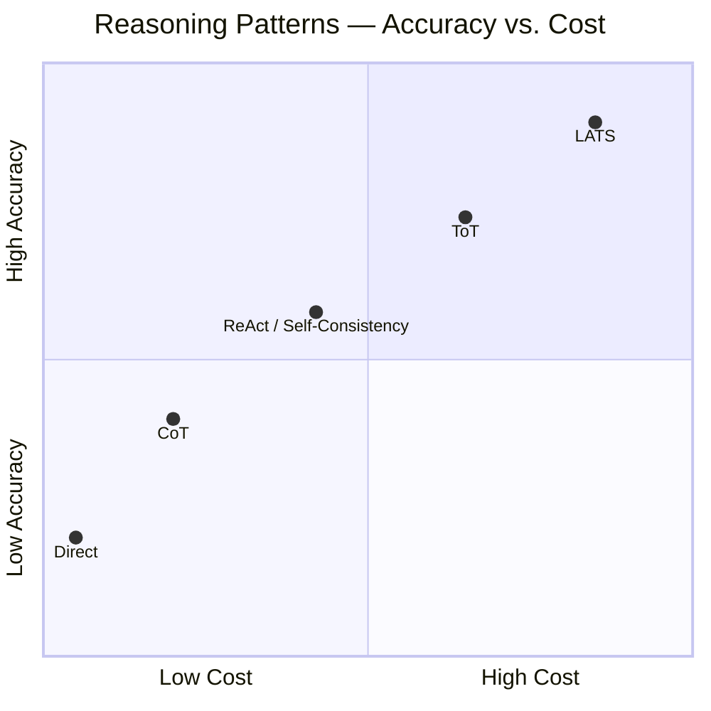
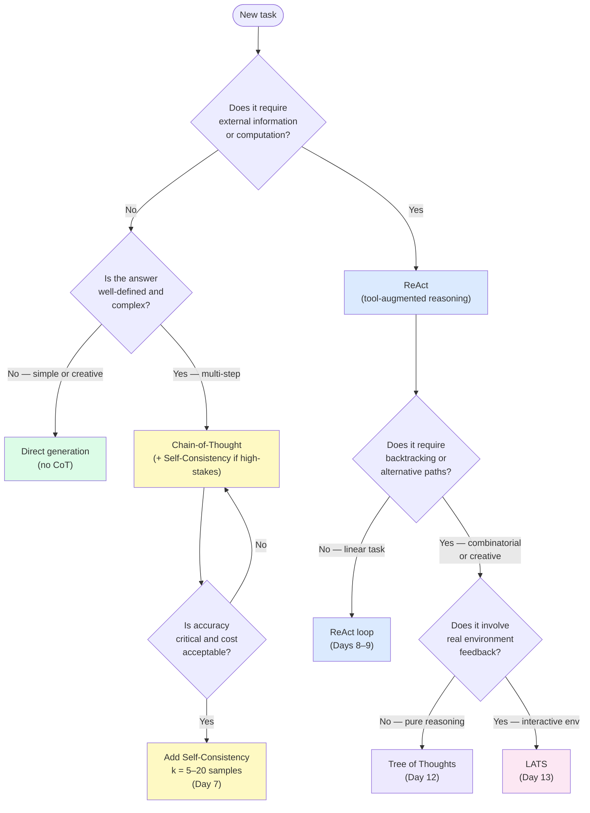

# Day 14 — Thinking Fast and Slow: Choosing Your Reasoning Mode

> **Today's one idea:** Every reasoning pattern has a cost-accuracy profile, and the first architectural decision is which mode to engage — direct generation, CoT, ReAct, or tree search — based on the task's actual requirements.
> **Reading time:** ~35 min · **Prereqs:** Days 6–13 (all reasoning patterns)
> **Primary source for today:** Kahneman, *Thinking, Fast and Slow* (2011, Farrar Straus Giroux) — Part I ("Two Systems"), Ch. 1–2 · Karpathy, *Intro to Large Language Models* (YouTube, Nov 2023) — timestamp ~50:00.

---

## The hook

Daniel Kahneman won the Nobel Prize in Economics for a simple observation about human cognition: we have two thinking systems.

**System 1** operates automatically, quickly, with little effort. When you read "2 + 2 =", the answer "4" appears in your mind instantly — you didn't *decide* to compute it. When you see a friend's face, you recognize it in milliseconds. System 1 is your fast, pattern-matching, intuitive mode.

**System 2** is slow, deliberate, effortful. When you compute 17 × 24 in your head, you consciously direct your attention through a sequence of steps. When you carefully read a contract, you activate System 2. System 2 is expensive — it tires, it requires concentration, and it can't run in parallel.

Here's the key insight: **most of the time, System 1 is right**. Evolution optimized for fast approximate answers. But for novel, complex, or high-stakes problems, System 1 leads you astray — you need System 2's deliberate effort.

Andrej Karpathy has pointed out that this maps directly onto LLM agent design. The patterns we've studied are the agent's System 1 and System 2:

| System | Agent equivalent | When it applies |
|--------|-----------------|-----------------|
| System 1 | Direct generation (no CoT) | Simple, well-worn tasks |
| System 1+ | Chain-of-Thought | Tasks with decomposable reasoning |
| System 2 | ReAct, Self-Consistency | Tasks requiring grounding or reliability |
| Deep System 2 | ToT, LATS | Tasks requiring search and backtracking |

The meta-skill of agent architecture is knowing *which system to engage for which task*.

---

## Building the intuition

### The cost-accuracy trade-off

Every reasoning mode sits on a cost-accuracy curve. The curve is not universal — it shifts depending on the task — but the shape is consistent:



Moving right along the curve adds cost. The question is always: *does this task require the next level of sophistication, or am I paying for headroom I don't need?*

Most tasks in production don't need LATS. A well-designed CoT prompt solves the majority of reasoning tasks in production at 1/100th the cost of a tree search. The mistake is using a chainsaw to cut butter.

### The decision framework

Here is a practical flowchart for choosing a reasoning mode:



### Five patterns, five questions

For each task you encounter, answer these five questions in order:

**Q1: Does the task require information the model doesn't have?**
→ Yes: start at ReAct (minimum). No: stay in the left branch (CoT or direct).

**Q2: Is the task multi-step and decomposable?**
→ Yes: use CoT. No: use direct generation. (Multi-step means: solving it requires a sequence of dependent reasoning steps, not just a single inference.)

**Q3: Is accuracy on the final answer critical?**
→ Yes: add Self-Consistency (k=5–20). No: single CoT pass is fine.

**Q4: Can the agent solve this in a linear sequence of steps?**
→ Yes: standard ReAct. No (requires exploration, backtracking): upgrade to ToT or LATS.

**Q5: Does the task involve real environment state changes between steps?**
→ Yes: LATS. No (pure reasoning with backtracking): ToT.

---

## The formal picture

### The full pattern catalog to date

| Pattern | Mode | Cost (relative) | Best for | Avoid when |
|---------|------|-----------------|---------|-----------|
| Direct generation | System 1 | 1× | Simple Q&A, formatting, creative tasks | Multi-step reasoning required |
| CoT | System 1+ | 1.2× | Multi-step arithmetic, logic, commonsense | Model is small (<10B params) |
| Self-Consistency | System 2 | 5–20× | High-stakes CoT where errors are costly | Open-ended outputs; tight latency budget |
| ReAct | System 2 | 3–10× (steps vary) | Any task needing real-world information | Stateless tasks solvable from memory |
| Reflexion | System 2 + memory | 3–10× per trial, × trials | Tasks with a clear success/failure signal | No evaluator available |
| ToT | Deep System 2 | 10–30× | Combinatorial, creative, or planning tasks | Linear tasks; tight cost budget |
| LATS | Deep System 2 | 50–200× | Interactive environments; backtracking critical | Stateless or linear tasks |

**Read this table as ranges, not absolutes.** A 2-step ReAct with fast tools may cost less than 3-sample Self-Consistency. The table conveys order of magnitude.

### The two most common mistakes

**Mistake 1 — Over-engineering by default.** Adding ToT or LATS to a task that needs one search + one calculation is cargo-culting complexity. The trace runs 200 LLM calls where 3 would do. Always start with the simplest pattern and upgrade only when it fails.

**Mistake 2 — Under-engineering for high-stakes tasks.** Using direct generation for a medical information synthesis task where accuracy matters is the opposite error. The cost of a wrong answer often vastly exceeds the cost of Self-Consistency sampling.

The discipline is asking: *what is the cost of a wrong answer vs. the cost of the more expensive pattern?* If a wrong answer costs $1,000 and Self-Consistency costs $0.50 extra, the math is simple.

---

## Where it breaks / what it is not

**The framework is a heuristic, not an algorithm.** The five questions above don't cover every edge case. A task might be partially linear and partially combinatorial. A task might seem simple but hide implicit multi-step reasoning. The framework gives you a principled starting point — not an oracle.

**"Complex" is not the same as "needs System 2."** Writing a poem is complex, but a single direct generation pass often produces excellent results. "Complexity" in the System 1/2 sense means specifically: *benefits from decomposed, sequential reasoning*. Pure creative tasks often don't.

**The cost curve shifts as models improve.** As frontier models get larger and better, direct generation solves more tasks that previously required CoT. The patterns don't become obsolete — they remain the right tools for genuinely hard tasks — but the threshold for "hard enough to need CoT" rises over time.

---

## Try it yourself

**Exercise 1 — Check your understanding:**
Use the decision flowchart above to choose a reasoning mode for each task:
- (a) "What's the capital of France?"
- (b) "Write a 200-word product description for a noise-cancelling headphone."
- (c) "What was Apple's revenue in Q3 2024?"
- (d) "Solve this logic puzzle: [3-step constraint satisfaction problem]"
- (e) "Debug this 50-line Python function that passes 3 of 5 unit tests."

**Exercise 2 — Apply it:**
Take a real task from your work. Run it with direct generation, then with CoT, then with ReAct (if it needs grounding). Measure: (a) answer quality, (b) token cost, (c) latency. Does the quality improvement justify the cost increase for your specific use case?

**Exercise 3 — Stretch:**
Kahneman shows that humans often apply System 1 to tasks that require System 2 — leading to predictable errors (the "bat and ball" problem, etc.). Design a task that would cause an LLM agent to use direct generation when it should use CoT, and show the failure mode. What prompt or system design would force it into the correct mode?

<details>
<summary>Answers for Exercise 1</summary>

(a) "Capital of France" → **Direct generation.** Single-fact retrieval, no steps needed, high confidence from training data.

(b) Product description → **Direct generation** (possibly CoT if you want to explicitly reason about features → benefits → tone). Creative task, System 1 often works well.

(c) Apple revenue Q3 2024 → **ReAct.** Requires live data (training cutoff). Single search + answer — no backtracking needed.

(d) 3-step logic puzzle → **CoT + Self-Consistency** (if accuracy critical) or **ToT** (if the puzzle requires backtracking to find the solution). Depends on whether the solution space is linear or requires exploration.

(e) Debugging Python → **LATS** (in principle) or **ReAct with code execution** (in practice). The task requires: read code → hypothesize bug → run tests → observe → update hypothesis → fix. This is an interactive environment with backtracking potential. A ReAct loop with a code execution tool is the practical minimum; LATS adds value if multiple debugging approaches need to be explored in parallel.
</details>

---

## Connect it back

This page closes Module 2. You've built the complete single-agent reasoning toolkit:

```
Day 6:  CoT             — visible reasoning
Day 7:  Self-Consistency — reliable reasoning
Day 8–9: ReAct          — grounded reasoning
Day 11: Reflexion       — learning from failure
Day 12: ToT             — search over reasoning
Day 13: LATS            — search over trajectories
Day 14: Fast/Slow       — choosing the right tool
```

The through-line: each pattern solved one specific limitation of the ones before it. Today's meta-pattern — choosing the right level of reasoning — is the capstone skill that makes all the others useful.

[Module 3](../../03-self-improvement/overview.md) begins tomorrow with **Self-Refine** — the first pattern that focuses not on *how to reason* but on *how to improve an answer that's already been generated*. It's the bridge between reasoning patterns and the self-improvement module.

**One question you can now answer that you couldn't this morning:** A colleague says "we should add Tree of Thoughts to our customer support agent." What three questions do you ask before agreeing?

---

## Suggested readings for today

**Required if you have 15 extra minutes:**
Kahneman, *Thinking, Fast and Slow* (2011, Farrar Straus and Giroux) — Chapter 1 ("The Characters of the Story", ~15 pages).
The first chapter introduces System 1 and System 2 with concrete examples. Every analogy in today's page comes from here. Reading it reinforces the mental model in a way that sticks.

**If you want the deep version:**
- Karpathy, *Intro to Large Language Models* (YouTube, Nov 2023) — timestamp 50:00–57:00. Karpathy explicitly maps System 1/2 onto LLM behavior and discusses which tasks need which mode. 7 minutes, very direct.
- Zhou et al., *LATS* (arXiv:2310.04406) — Table 3 (comparison across methods). The side-by-side comparison of CoT, CoT-SC, ReAct, ToT, and LATS on the same benchmark is the empirical grounding for today's cost-accuracy trade-off discussion.

---

## Navigation

← **Previous:** [Day 13 — LATS: Language Agent Tree Search](./day-13-lats.md)
→ **Next:** [Day 15 — Self-Refine: Iterative Self-Feedback](../../03-self-improvement/days/day-15-self-refine.md)
