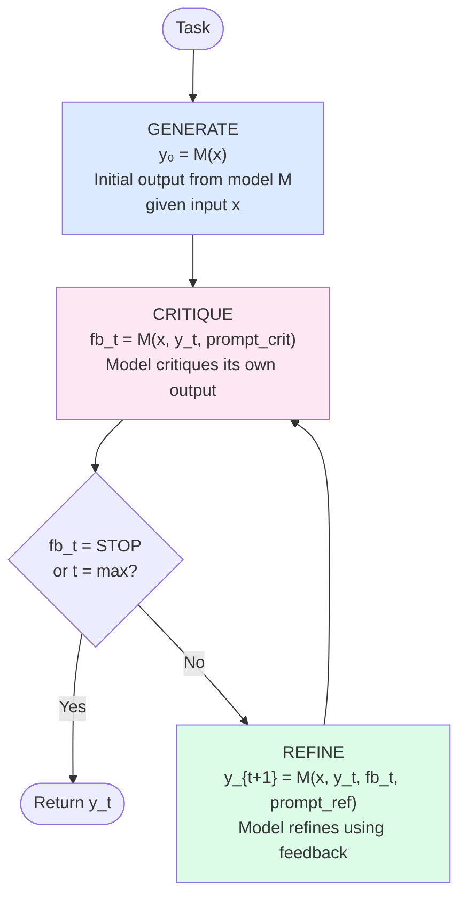

# Day 15 — Self-Refine: Iterative Self-Feedback

> **Today's one idea:** An agent can significantly improve any output by running a tight generate → critique → refine loop within a single session — no external feedback, no additional training, no memory of past runs required.
> **Reading time:** ~40 min · **Prereqs:** Day 11 (Reflexion), Day 14 (Thinking Fast and Slow)
> **Primary source for today:** Madaan, Tandon, Gupta et al. — *Self-Refine: Iterative Refinement with Self-Feedback* (NeurIPS 2023, arXiv:2303.17651) — Sections 2 and 3.

---

## The hook

No writer submits a first draft. Every professional knows: write, then edit. The first pass gets the ideas down; the second pass fixes the structure; the third pass polishes the language. The editing pass isn't done by a different person with different skills — it's done by the same person with a different *goal*: not "create" but "critique and improve."

In 2023, Madaan et al. asked: can an LLM do the same thing with its own outputs? Generate a response, then critique that response in the same forward pass style, then refine it based on the critique — in a loop?

The answer was yes. And the improvements were dramatic: Self-Refine improved output quality on code optimization by 13%, on dialogue response by 14%, and on math reasoning by 15% — all without any additional training data or model updates. The LLM is acting as its own editor.

The key difference from [Reflexion (Day 11)](../02-reasoning-patterns/days/day-11-reflexion.md): Reflexion critiques a *completed, failed run* to improve the *next run*. Self-Refine critiques an *intermediate output* to improve it *in the same run*. Reflexion is between-run learning; Self-Refine is within-run improvement.

---

## Building the intuition

### The editor's perspective

When you edit your own writing, you switch modes. As a writer, you're asking "what do I want to say?" As an editor, you're asking "is this saying it clearly, correctly, concisely?" The two modes are in tension — that's why editing your own work is hard and why some writers wait a day before editing.

LLMs don't need to wait. A single model is capable of playing both roles in quick succession:

1. **Generator:** Answer the question, solve the problem, write the code — whatever the task is. Don't meta-evaluate. Just produce.

2. **Critic:** Now read the output with fresh eyes. What's wrong? What's imprecise? What's missing? What's redundant? Be specific — "this is wrong because X" is useful; "this could be better" is not.

3. **Refiner:** Given the original task and the critique, produce an improved version. Not a completely different output — an improved version of the same output.

4. **Repeat** until the critic says "this is good" or a maximum iteration count is reached.

The insight from Madaan et al.: a model that has generated output X now has *more context* for generating a critique of X than a separate critic model would — because it "knows" what it was trying to do when it generated X. This is why self-feedback works even better than expected.

### What makes a good critique

The quality of the loop depends almost entirely on the quality of the critique. A generic critique ("this output could be improved") gives the refiner nothing to work with. A specific critique ("step 3 incorrectly assumes `n` is positive; the loop will fail for `n = -1`") guides a targeted improvement.

Madaan et al. found that critiques are most effective when they:
1. **Identify a specific flaw** (not just note that the output is imperfect)
2. **Explain why it's a flaw** (the reasoning, not just the label)
3. **Are task-specific** (a code critique looks different from a writing critique)

The critique prompt template varies by task type — you can't use the same critique prompt for code review and essay feedback.

---

## The formal picture

### The Self-Refine algorithm



In notation:
- $x$ = the original task
- $y_0 = M(x)$ = initial output
- $fb_t = M(x, y_t, p_{crit})$ = feedback on output $y_t$
- $y_{t+1} = M(x, y_t, fb_t, p_{ref})$ = refined output
- Stop when $fb_t =$ "STOP" or $t = t_{max}$

Three separate prompts drive the three roles:
- **$p_{gen}$**: "Solve this task."
- **$p_{crit}$**: "Critique this solution. Be specific. Say STOP if it's already correct."
- **$p_{ref}$**: "Given the critique, improve the solution."

You can use the same model for all three (the standard approach) or different models for critic and generator (a common production variant).

### A complete working implementation

```python
import anthropic

client = anthropic.Anthropic()

# ── Prompt templates ───────────────────────────────────────────────────────────
# Tune these per task domain. The critique prompt is the most important one.

def make_critique_prompt(task: str, output: str, domain: str = "general") -> str:
    domain_guidance = {
        "code": (
            "Focus on: correctness (edge cases, off-by-one errors, type errors), "
            "efficiency (unnecessary loops, redundant calls), and readability."
        ),
        "writing": (
            "Focus on: clarity (is every sentence clear?), accuracy (any factual errors?), "
            "conciseness (any redundancy?), and tone (appropriate for the audience?)."
        ),
        "math": (
            "Focus on: each reasoning step (is it logically valid?), "
            "arithmetic (check every calculation), and the final answer."
        ),
        "general": (
            "Focus on: accuracy, completeness, clarity, and any logical errors."
        ),
    }
    guidance = domain_guidance.get(domain, domain_guidance["general"])
    return (
        f"Task: {task}\n\n"
        f"Current output:\n{output}\n\n"
        f"Critique this output. {guidance}\n\n"
        f"Be specific: identify what is wrong and why. "
        f"If the output is already correct and cannot be meaningfully improved, "
        f"respond with exactly 'STOP' and nothing else."
    )


def make_refine_prompt(task: str, output: str, feedback: str) -> str:
    return (
        f"Task: {task}\n\n"
        f"Previous output:\n{output}\n\n"
        f"Critique of that output:\n{feedback}\n\n"
        f"Produce an improved version that addresses every point in the critique. "
        f"Preserve what was correct. Change only what the critique identified as wrong."
    )


# ── The Self-Refine loop ────────────────────────────────────────────────────────

def self_refine(
    task:           str,
    domain:         str = "general",
    max_iterations: int = 3,
    verbose:        bool = True,
) -> str:
    """
    Self-Refine: generate → critique → refine loop.

    Args:
        task:           The task to solve.
        domain:         'code', 'writing', 'math', or 'general' — tunes the critique.
        max_iterations: Maximum refinement cycles.
        verbose:        Print each generation, critique, and refinement.

    Returns:
        The final (best) output after all refinement cycles.
    """

    def call(prompt: str, max_tokens: int = 1024) -> str:
        response = client.messages.create(
            model="claude-3-5-sonnet-20241022",
            max_tokens=max_tokens,
            messages=[{"role": "user", "content": prompt}]
        )
        return response.content[0].text.strip()

    # ── Step 1: Generate ────────────────────────────────────────────────────────
    output = call(task)
    if verbose:
        print(f"\n{'─'*60}")
        print(f"[Generation 0 — Initial]\n{output}")

    # ── Steps 2+: Critique → Refine → Critique → ... ──────────────────────────
    for iteration in range(1, max_iterations + 1):
        # Critique
        critique_prompt = make_critique_prompt(task, output, domain)
        feedback = call(critique_prompt, max_tokens=512)

        if verbose:
            print(f"\n{'─'*60}")
            print(f"[Critique {iteration}]\n{feedback}")

        # Stopping condition
        if feedback.strip().upper() == "STOP":
            if verbose:
                print(f"\nStopping at iteration {iteration} — critique says output is correct.")
            break

        # Refine
        refine_prompt = make_refine_prompt(task, output, feedback)
        output = call(refine_prompt)

        if verbose:
            print(f"\n{'─'*60}")
            print(f"[Refined Output {iteration}]\n{output}")

    return output


# ── Examples ──────────────────────────────────────────────────────────────────

if __name__ == "__main__":

    # Example 1: Code
    code_task = """
    Write a Python function `find_second_largest(nums: list[int]) -> int`
    that returns the second largest unique integer in the list.
    It should raise ValueError if the list has fewer than 2 unique elements.
    """
    print("=== CODE TASK ===")
    result = self_refine(code_task, domain="code", max_iterations=3)

    # Example 2: Writing
    writing_task = (
        "Write a 3-sentence explanation of how a neural network learns, "
        "suitable for a business executive with no technical background."
    )
    print("\n\n=== WRITING TASK ===")
    result = self_refine(writing_task, domain="writing", max_iterations=2)
```

### What to observe when you run it

**The critique gets more specific each iteration.** On iteration 1, the critique often catches obvious structural problems ("the function doesn't handle empty lists"). On iteration 2, it catches subtler ones ("the function handles empty lists but the docstring says nothing about that edge case"). Critiques self-deepen.

**Refinements respect prior work.** A good refinement prompt says "change only what the critique identified." Without that constraint, the model may rewrite the whole output — fixing the identified flaw but introducing new ones. The `make_refine_prompt` function above enforces targeted editing.

**STOP is rare but meaningful.** When the model genuinely says STOP, the output has usually converged — further iterations don't improve it. If STOP never triggers and you always run to max_iterations, your critique prompt may not have a clear "good enough" standard.

---

## Where it breaks / what it is not

**Critic-generator alignment failure.** The critic can identify a flaw that the generator doesn't know how to fix. "This code is O(n²) and should be O(n log n)" is valid feedback, but if the model doesn't know the efficient algorithm, the refined output will change the code without actually improving the complexity. The loop terminates with a cosmetically different but still O(n²) solution.

**Critique-introduced errors.** The refiner may fix the critiqued issue but break something that was previously correct. This is the classic "edit made it worse" problem. Self-Refine has no mechanism to detect regression — it can't compare iteration 2 to iteration 0 and choose the better one. Adding a "pick the best of k versions" step after the loop mitigates this.

**No convergence guarantee.** The loop can oscillate: iteration 1 fixes problem A, creating problem B; iteration 2 fixes problem B, re-introducing problem A. This oscillation is common in math tasks. A hard iteration limit is the only guard.

**Self-Refine ≠ Reflexion.** The core difference: Self-Refine refines within a single run (no memory needed, no evaluator needed). Reflexion learns across runs (requires episodic memory and a success/failure signal). They are complementary — you can run Self-Refine within each trial of a Reflexion loop.

---

## Try it yourself

**Exercise 1 — Check your understanding:**
Without looking at the code, write the three-step loop in pseudocode. Then answer: at which step is the task description most important — generation, critique, or refinement? Why?

**Exercise 2 — Apply it:**
Run the code on the code task. Deliberately give the first-generation code a subtle bug (modify the task to make it likely). Does the critique catch it? Does the refinement fix it? Run 3 iterations and track whether each iteration improves, maintains, or regresses quality.

**Exercise 3 — Stretch:**
The critique prompt is domain-specific in the code above. Design a critique prompt for a **SQL query task** — the model must generate a SQL SELECT statement, and the critique must check for: correctness (does it answer the question?), safety (no unintended full-table scans, no missing WHERE clauses), and style (proper aliasing, readable formatting). Write the full `domain_guidance["sql"]` string.

<details>
<summary>Hint for Exercise 1</summary>
Think about what each step needs from the task description. Generation needs it to know what to produce. Critique needs it to know what "correct" looks like. Refinement needs it to anchor the revision. At which step is the gap between "what was produced" and "what was asked for" most important to close?
</details>

<details>
<summary>Worked solution for Exercise 1</summary>

Pseudocode:
```
output = generate(task)
for i in 1..max_iterations:
    feedback = critique(task, output)
    if feedback == "STOP":
        break
    output = refine(task, output, feedback)
return output
```

The task description is most critical at the **critique step**. The critique must compare the actual output against what was asked for and identify the gap. Generation has a single framing of the task; refinement follows a specific critique. But the critique step must independently assess: "Given what was asked, what is wrong with what was produced?" Without the full task description in the critique prompt, the critic can only judge internal consistency, not correctness relative to the goal.
</details>

---

## Connect it back

[Reflexion (Day 11)](../02-reasoning-patterns/days/day-11-reflexion.md) critiques a completed, failed run to improve the next attempt. Today's Self-Refine critiques an intermediate output to improve it *before* the run is complete. They compose naturally: use Self-Refine within each trial of a Reflexion loop.

Self-Refine is the first of four self-improvement patterns, sitting at the "within-run, no memory" end of the spectrum. Tomorrow: STaR — the other end. An LLM that fine-tunes on its own self-generated reasoning examples to permanently improve its reasoning ability.

**One question you can now answer that you couldn't this morning:** A colleague says "we should use Reflexion to improve our code generation agent." You say "actually Self-Refine might be better here." What's the key question you'd ask to determine which one fits?

---

## Suggested readings for today

**Required if you have 15 extra minutes:**
Madaan et al., *Self-Refine* (arXiv:2303.17651) — Section 2 (method, 2 pages) and Figure 1.
Figure 1 is the clearest single-diagram summary of the pattern. Section 2 defines the three prompts ($p_{gen}$, $p_{crit}$, $p_{ref}$) and the stopping condition precisely.

**If you want the deep version:**
- Madaan et al., Section 4 (results) — Table 1 shows quality improvements across 7 diverse tasks. The variation across tasks (big improvement on code, smaller on dialogue) reveals when the critic is most useful and why.
- Madaan et al., Section 5.1 (analysis: does Self-Refine help at all iterations?) — addresses whether running more iterations always helps. The answer is instructive and directly relevant to choosing `max_iterations` in production.

---

## Navigation

← **Previous:** [Day 14 — Thinking Fast and Slow](../../02-reasoning-patterns/days/day-14-thinking-fast-slow.md)
→ **Next:** [Day 16 — STaR: Self-Taught Reasoner](./day-16-star.md)
