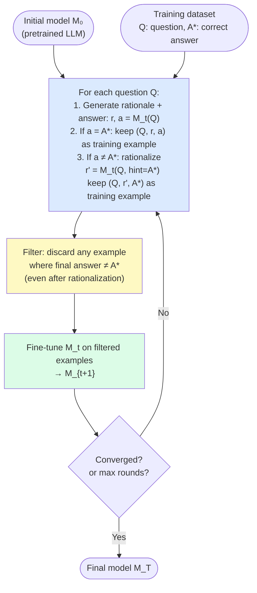

# Day 16 — STaR: Self-Taught Reasoner

> **Today's one idea:** An LLM can bootstrap its own reasoning capability by generating rationales for problems it solves correctly, filling in rationales for problems it gets wrong using the correct answer as a hint, then fine-tuning on the filtered set — and repeating.
> **Reading time:** ~40 min · **Prereqs:** Day 15 (Self-Refine), Day 6 (Chain-of-Thought)
> **Primary source for today:** Zelikman, Wu, Mu, Goodman — *STaR: Self-Taught Reasoner Bootstrapping Reasoning With Reasoning* (NeurIPS 2022, arXiv:2203.14465) — Sections 2 and 3.

---

## The hook

Imagine you are self-studying mathematics with a textbook. You work through problems and check your answers against the answer key. When you get a problem right, you write down how you solved it. When you get a problem wrong, you look at the answer and work backward: "given that the answer is 42, why would that be? ... oh, I see — I forgot to carry the 1." You then write down that corrected reasoning.

At the end of the week, you have a notebook of solution methods — both successful and corrected ones. You study that notebook until the reasoning patterns become second nature. Then you tackle harder problems and repeat.

This is almost exactly STaR. Zelikman et al. replaced "notebook study" with gradient descent and "looking at the answer key and reasoning backward" with a trick they call **rationalization**. The result: a language model that teaches itself to reason by examining its own correct and corrected answers.

---

## Building the intuition

### The bootstrapping problem

[CoT (Day 6)](../02-reasoning-patterns/days/day-06-chain-of-thought.md) improves reasoning — but it assumes the model already has enough reasoning capability to produce useful rationales. If the model is bad at arithmetic, its CoT rationales for arithmetic will be bad, which means there's nothing useful to learn from them.

STaR solves this with a bootstrapping loop. Start with whatever capability the model has now. Use it to generate rationales. Only keep the ones that led to correct answers. Fine-tune on those. The model gets slightly better. Now it can solve problems that it couldn't before — and those solutions produce new training rationales. Fine-tune again. Repeat.

Small gains compound. A model that can solve 20% of a problem set after round 1 can solve 40% after round 3. Each round produces more training signal, which produces more capability, which produces more signal.

### The rationalization trick

There's one obstacle: the model gets many problems wrong on round 1. Wrong answers have no rationale worth learning from — the reasoning is faulty. But Zelikman et al. noticed something: if you tell the model the correct answer and ask it to construct a rationale for *why* that answer is correct, it often produces a valid reasoning chain.

This is called **rationalization**: condition the rationale generation on the known correct answer.

```
Normal CoT:
Q: "A bat and a ball cost $1.10 together. The bat costs $1.00 more than
    the ball. How much does the ball cost?"
A: Let's think step by step. [model generates reasoning] → answer: $0.10  (wrong)

Rationalization (conditioned on correct answer = $0.05):
Q: same
Hint: The correct answer is $0.05.
A: Let's think about why the ball costs $0.05...
   [model generates valid backward reasoning] → rationale for $0.05  (useful!)
```

The rationalized rationale is not guaranteed to be the "true" reasoning path — but it is a valid path, and that's enough to train on.

---

## The formal picture

### The STaR algorithm



**Key design choices:**

1. **Only fine-tune on correct final answers.** Even rationalized examples must produce the correct answer — this is the quality filter that prevents the model from learning wrong reasoning.

2. **Include both self-generated and rationalized rationales.** Self-generated rationales are "pure" — the model solved the problem itself. Rationalized ones are "corrected" — the model was shown the answer. Training on both is critical: pure rationales have higher signal quality; rationalized ones provide coverage for problems the model can't yet solve.

3. **Repeat until convergence.** Each round adds new training examples because the improved model can now solve problems it previously couldn't. The loop runs until the model stops improving (diminishing returns) or a fixed number of rounds.

### Data collection: the Python side

You can't fine-tune with a simple API call — it requires compute infrastructure (LoRA, full fine-tune, or a fine-tuning endpoint). But the *data collection* phase of STaR is straightforward to implement. This is the part you can do right now:

```python
import anthropic
import json
from dataclasses import dataclass

client = anthropic.Anthropic()


@dataclass
class STaRExample:
    question:  str
    rationale: str
    answer:    str
    source:    str  # "self_generated" or "rationalized"


def generate_rationale(question: str) -> tuple[str, str]:
    """
    Generate a CoT rationale and extract the final answer.
    Returns (rationale, answer).
    """
    response = client.messages.create(
        model="claude-3-5-sonnet-20241022",
        max_tokens=512,
        messages=[{
            "role": "user",
            "content": (
                f"{question}\n\n"
                "Let's think step by step. "
                "At the end, write 'Final answer: [answer]'."
            )
        }]
    )
    text = response.content[0].text.strip()
    # Extract final answer
    answer = ""
    for line in reversed(text.splitlines()):
        line = line.strip()
        if line.lower().startswith("final answer:"):
            answer = line.split(":", 1)[1].strip()
            break
    return text, answer


def rationalize(question: str, correct_answer: str) -> str:
    """
    Rationalization: given the correct answer, construct a valid rationale.
    This is the STaR trick for problems the model gets wrong.
    """
    response = client.messages.create(
        model="claude-3-5-sonnet-20241022",
        max_tokens=512,
        messages=[{
            "role": "user",
            "content": (
                f"{question}\n\n"
                f"The correct answer is: {correct_answer}\n\n"
                "Construct a step-by-step reasoning chain that leads to this answer. "
                "Show each step clearly. End with 'Final answer: {correct_answer}'."
            )
        }]
    )
    return response.content[0].text.strip()


def collect_star_data(
    dataset: list[dict],    # each entry: {"question": str, "answer": str}
    n_rounds: int = 3,
) -> list[STaRExample]:
    """
    Run n_rounds of STaR data collection.

    In a real STaR loop, you would fine-tune between rounds.
    Here we simulate by collecting data from all rounds — in production,
    each round uses the fine-tuned model from the previous round.

    Returns all collected training examples.
    """
    all_examples: list[STaRExample] = []

    for round_num in range(1, n_rounds + 1):
        print(f"\n=== Round {round_num} ===")
        round_correct = 0
        round_rationalized = 0

        for item in dataset:
            question      = item["question"]
            correct_answer = str(item["answer"]).strip().lower()

            # Step 1: Generate rationale + answer
            rationale, generated_answer = generate_rationale(question)
            generated_answer_normalized = generated_answer.strip().lower()

            # Step 2a: Correct answer → use self-generated rationale
            if generated_answer_normalized == correct_answer:
                all_examples.append(STaRExample(
                    question  = question,
                    rationale = rationale,
                    answer    = item["answer"],
                    source    = "self_generated"
                ))
                round_correct += 1

            # Step 2b: Wrong answer → rationalize from correct answer
            else:
                rationalized_rationale = rationalize(question, item["answer"])
                all_examples.append(STaRExample(
                    question  = question,
                    rationale = rationalized_rationale,
                    answer    = item["answer"],
                    source    = "rationalized"
                ))
                round_rationalized += 1

        print(f"  Self-generated: {round_correct} | Rationalized: {round_rationalized}")
        # In a real implementation: fine_tune(model, all_examples) before next round

    return all_examples


# ── Example dataset (replace with your real dataset) ──────────────────────────
if __name__ == "__main__":
    dataset = [
        {"question": "If a train travels 60 mph for 2.5 hours, how far does it go?",
         "answer": "150 miles"},
        {"question": "What is 15% of 80?",
         "answer": "12"},
        {"question": "A rectangle has length 7 and width 4. What is its area?",
         "answer": "28"},
    ]

    examples = collect_star_data(dataset, n_rounds=2)
    print(f"\nCollected {len(examples)} training examples")
    print(f"  Self-generated: {sum(1 for e in examples if e.source == 'self_generated')}")
    print(f"  Rationalized:   {sum(1 for e in examples if e.source == 'rationalized')}")

    # Save for fine-tuning
    with open("star_training_data.jsonl", "w") as f:
        for ex in examples:
            f.write(json.dumps({
                "question": ex.question,
                "rationale": ex.rationale,
                "answer": ex.answer,
                "source": ex.source
            }) + "\n")
    print("Saved to star_training_data.jsonl")
```

### What the fine-tuning step looks like

Once you have the JSONL file, fine-tuning uses a supervised objective: given question Q, predict the rationale R and answer A. The training format:

```
Input:  "{question}\nLet's think step by step."
Target: "{rationale}\nFinal answer: {answer}"
```

This can be done with:
- **LoRA** (via `peft` + `transformers` for open models like Llama 3, Mistral)
- **Full fine-tuning** (expensive, for teams with GPU clusters)
- **Anthropic fine-tuning API** (when available for your model tier)
- **OpenAI fine-tuning** (for GPT models)

The key: after fine-tuning, the model's weights encode the reasoning patterns, not just the answers. This is what makes STaR's improvement *parametric* — it persists without any context overhead.

---

## Where it breaks / what it is not

**Rationalization noise.** When the model constructs a rationale for an answer it got wrong, the rationale is sometimes circular ("the answer is 42 because... 42 is the answer") or subtly incorrect (valid-looking steps that don't actually justify the answer). These low-quality rationales, if included in training, can degrade the model. Zelikman et al. address this by filtering: only keep examples where the final generated answer matches the gold label.

**Distribution shift between rounds.** The model fine-tuned in round 1 may be slightly different from round 0 in ways that make some previously-solved problems harder. Round 2 data collection with the round-1 model may include different problems than round 1, causing oscillation. In practice, this means diminishing returns after 3–5 rounds for most tasks.

**Requires a labeled dataset.** Unlike Self-Refine (which needs no labels) and Reflexion (which needs only a success/failure signal), STaR requires correct answers for training. This limits applicability to domains where ground truth is available: math, coding (unit tests), factual QA (gold answers). Open-ended tasks like creative writing can't use STaR directly.

**STaR improves one capability, not all.** Fine-tuning on arithmetic rationales improves arithmetic. It may not improve coding, or may slightly hurt performance on tasks far from the fine-tuning distribution. It is a targeted improvement tool, not a general-purpose upgrade.

---

## Try it yourself

**Exercise 1 — Check your understanding:**
Explain the rationalization trick in one paragraph. Why is it necessary? What would happen to the STaR loop if you only used self-generated (non-rationalized) rationales?

**Exercise 2 — Apply it:**
Run `collect_star_data` on a small dataset (3–5 math word problems). Inspect the resulting JSONL file. Look at both a `self_generated` and a `rationalized` example. Is the rationalized reasoning valid? Does it lead to the correct answer? What quality differences do you notice?

**Exercise 3 — Stretch:**
STaR requires correct answer labels. Design a variant for a task with no ground-truth labels — specifically: improving the **style** of code (not its correctness, but its readability). What would you use as the "correct answer" equivalent? How would you define the filter criterion?

<details>
<summary>Hint for Exercise 1</summary>
Think about what happens when the model gets a problem wrong. The self-generated rationale is wrong — the model reasoned incorrectly to the wrong answer. If you train on wrong rationales, what does the model learn? The rationalization trick avoids this by... what exactly?
</details>

<details>
<summary>Worked solution for Exercise 1</summary>
STaR collects training examples by having the model generate CoT rationales and checking whether the answer is correct. For problems the model gets right, the self-generated rationale is a valid training example (correct reasoning → correct answer). For problems the model gets wrong, the self-generated rationale is invalid — training on it would reinforce incorrect reasoning. 

Rationalization solves this: given the correct answer as a hint, the model constructs a valid reasoning chain that leads to it. This may not be the "true" path the model would have used to derive the answer independently, but it is a valid path — and training on valid reasoning chains is what improves the model's reasoning capability.

Without rationalization, the training set only contains problems the model already gets right — a shrinking supply of new learning signal as the model improves. With rationalization, every problem in the dataset contributes a training example, including the hard ones the model can't solve yet. This dramatically accelerates the bootstrapping.
</details>

---

## Connect it back

[Self-Refine (Day 15)](./day-15-self-refine.md) improved outputs within a single run — ephemeral improvement, nothing stored. [Reflexion (Day 11)](../02-reasoning-patterns/days/day-11-reflexion.md) stored verbal lessons in the context. Today's STaR stores improvement in the *weights* — permanent, cost-free at inference time, but expensive to produce.

You now have three points on the self-improvement spectrum:

```
Self-Refine  ←────────────────────────────────────→  STaR
Within-run                                    Parametric
No storage                                    Weights updated
Free (3× generation cost)                     Expensive (training run)
Temporary                                     Permanent
```

Tomorrow: ExpeL fills the middle of this spectrum. No weight updates, but more durable than a context string.

**One question you can now answer that you couldn't this morning:** Your team wants to deploy an agent that gets better at answering customer support tickets over time. They have 500 historical tickets with correct resolutions. Should they use Reflexion, STaR, or Self-Refine? What's your recommendation and the key constraint you'd flag?

---

## Suggested readings for today

**Required if you have 15 extra minutes:**
Zelikman et al., *STaR* (arXiv:2203.14465) — Section 2 (method, 3 pages).
Section 2 is the complete algorithm: Figure 1 shows the loop, Section 2.2 describes rationalization, Section 2.3 describes the fine-tuning objective. Read it with the flowchart from today's page in mind.

**If you want the deep version:**
- Zelikman et al., Section 3 (experiments) — Table 1 shows arithmetic benchmark results across rounds. The progression from round 0 to round 3 is the empirical evidence for bootstrapping; the rationalization ablation in Table 2 shows exactly how much it contributes.
- Zelikman et al., Section 4 (related work) — places STaR relative to RLHF, self-training, and knowledge distillation. If you're familiar with any of these, this section clarifies how STaR differs in a technically precise way.

---

## Navigation

← **Previous:** [Day 15 — Self-Refine: Iterative Self-Feedback](./day-15-self-refine.md)
→ **Next:** [Day 17 — ExpeL: Experiential Learning from Trajectories](./day-17-expel.md)
