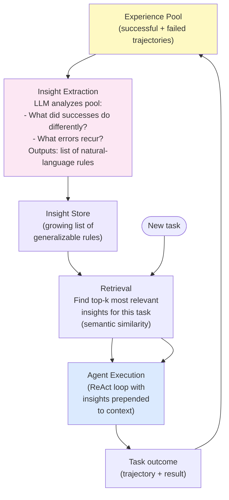

# Day 17 — ExpeL: Experiential Learning from Trajectories

> **Today's one idea:** An agent that mines its own successful and failed past trajectories to extract generalizable natural-language rules, then retrieves relevant rules at inference time, improves across episodes without any fine-tuning.
> **Reading time:** ~40 min · **Prereqs:** Day 16 (STaR), Day 11 (Reflexion)
> **Primary source for today:** Zhao, Huang, Xu, Lin, Liu, Huang — *ExpeL: LLM Agents Are Experiential Learners* (2024, arXiv:2308.10144) — Sections 3 and 4.

---

## The hook

A chess grandmaster doesn't just know the rules — they carry decades of pattern recognition: openings that tend to fail, endgame positions they've navigated before, opponent tendencies they've learned to exploit. This isn't in a book. It's in *experience*.

The crucial thing about this experience: it isn't stored as individual game recordings. It's stored as **compressed insights** — "when I push my h-pawn in this structure, my king gets exposed" — that apply across many specific games. The grandmaster doesn't replay memory game 312 during a match; they retrieve the relevant insight from it.

[Reflexion (Day 11)](../02-reasoning-patterns/days/day-11-reflexion.md) is closer to replaying game recordings: after each failure, you write a verbal lesson specific to that run. ExpeL does what the grandmaster does: **mine many past trajectories at once**, distill them into generalizable insights, and retrieve the relevant ones for new tasks.

The result: an agent that gets better with every task it completes — not by updating its weights, and not just by keeping a growing list of one-off lessons, but by building a compressed, retrievable knowledge base from lived experience.

---

## Building the intuition

### Reflexion's limitation

Reflexion generates one lesson per failed trial: "I made mistake X in run 3, so next time avoid X." The lesson is specific to that run. After 10 runs you have 10 lessons — a growing context load, with potentially overlapping or contradicting entries, and no cross-run synthesis.

ExpeL asks: what if, instead of one lesson per run, you analyzed *all past runs together* and extracted the **patterns** that appear across them?

```
Reflexion approach:
  Run 1 failed → "Lesson: always check the file exists before reading"
  Run 4 failed → "Lesson: always check the file exists before reading"
  Run 7 failed → "Lesson: always check the file exists before reading"
  → Three separate context entries saying the same thing

ExpeL approach:
  Runs 1, 4, 7 all failed with file-not-found → 
  Insight: "File access operations fail when paths are not verified first.
            Always call file_exists() before read_file()."
  → One compressed, generalizable rule
```

The compression makes ExpeL scale: as the experience pool grows, the insight set grows slowly (new experience either confirms existing insights or adds genuinely new ones). Reflexion's context grows linearly.

### Three components

ExpeL has three modular components:

**Component 1 — Experience Collection:** Run tasks and store the full trajectories (success and failure), along with the outcome.

**Component 2 — Insight Extraction:** An LLM analyzes the experience pool and extracts natural-language insights. Crucially, it analyzes *comparisons*: "what did successful runs do that failed runs didn't?" This contrastive analysis produces sharper, more actionable insights than analyzing each run individually.

**Component 3 — Retrieval-Augmented Execution:** For each new task, retrieve the most relevant insights from the pool and prepend them to the agent's context. The agent then runs as normal (e.g., a ReAct loop), but conditioned on accumulated wisdom.

---

## The formal picture

### The ExpeL architecture



### Insight extraction: the contrastive prompt

The quality of the extracted insights depends on the extraction prompt. The key is to prompt the LLM to compare successes and failures — not just describe what happened in each run:

```python
EXTRACTION_PROMPT = """
You are analyzing past agent trajectories to extract generalizable insights.

SUCCESSFUL TRAJECTORIES (these reached the correct answer):
{successful_trajectories}

FAILED TRAJECTORIES (these did not reach the correct answer):
{failed_trajectories}

Compare the successful and failed trajectories. Extract 3–7 generalizable rules
that distinguish good from bad agent behavior. Each rule should:
- Be specific and actionable (not vague like "be more careful")
- Apply across multiple situations, not just one specific case
- Be phrased as a directive: "When X, do Y" or "Always/Never Z"

Format as a numbered list.
"""
```

### A working ExpeL system

```python
import anthropic
import json
from dataclasses import dataclass, field

client = anthropic.Anthropic()


@dataclass
class Trajectory:
    task:     str
    trace:    str   # the full thought/action/observation log
    outcome:  str   # "success" or "failure"
    result:   str   # the agent's final answer


@dataclass
class ExperiencePool:
    trajectories: list[Trajectory] = field(default_factory=list)
    insights:     list[str]        = field(default_factory=list)

    def add(self, trajectory: Trajectory) -> None:
        self.trajectories.append(trajectory)

    @property
    def successes(self) -> list[Trajectory]:
        return [t for t in self.trajectories if t.outcome == "success"]

    @property
    def failures(self) -> list[Trajectory]:
        return [t for t in self.trajectories if t.outcome == "failure"]


def extract_insights(pool: ExperiencePool, max_per_side: int = 5) -> list[str]:
    """
    Mine the experience pool for generalizable insights.
    Uses contrastive analysis: compare successes vs. failures.
    """
    if len(pool.successes) == 0 and len(pool.failures) == 0:
        return []

    # Format trajectories (truncate to keep prompt manageable)
    def fmt(trajectories: list[Trajectory], limit: int) -> str:
        selected = trajectories[-limit:]  # most recent
        parts = []
        for i, t in enumerate(selected, 1):
            parts.append(
                f"--- Trajectory {i} (Task: {t.task[:80]}) ---\n"
                f"{t.trace[:600]}...\n"
                f"Outcome: {t.outcome.upper()}"
            )
        return "\n\n".join(parts) if parts else "(none yet)"

    prompt = (
        "You are analyzing past agent trajectories to extract generalizable insights.\n\n"
        f"SUCCESSFUL TRAJECTORIES:\n{fmt(pool.successes, max_per_side)}\n\n"
        f"FAILED TRAJECTORIES:\n{fmt(pool.failures, max_per_side)}\n\n"
        "Compare the successful and failed trajectories. Extract 3–7 generalizable rules "
        "that distinguish good from bad agent behavior. Each rule should:\n"
        "- Be specific and actionable\n"
        "- Apply across multiple situations\n"
        "- Be phrased as a directive: 'When X, always Y' or 'Never Z'\n\n"
        "Output a numbered list of rules only."
    )

    response = client.messages.create(
        model="claude-3-5-sonnet-20241022",
        max_tokens=512,
        messages=[{"role": "user", "content": prompt}]
    )
    raw = response.content[0].text.strip()

    # Parse numbered list
    insights = []
    for line in raw.splitlines():
        line = line.strip()
        if line and line[0].isdigit():
            insight = line.lstrip("0123456789.) ").strip()
            if insight:
                insights.append(insight)
    return insights


def retrieve_relevant_insights(
    insights:  list[str],
    new_task:  str,
    top_k:     int = 3,
) -> list[str]:
    """
    Find the top-k most relevant insights for a new task.
    Uses an LLM to rank relevance (replace with embedding similarity for scale).
    """
    if not insights:
        return []

    numbered = "\n".join(f"{i+1}. {ins}" for i, ins in enumerate(insights))
    prompt = (
        f"New task: {new_task}\n\n"
        f"Available insights:\n{numbered}\n\n"
        f"Which {top_k} insights are most relevant to this new task? "
        f"Reply with only the numbers, comma-separated (e.g., '2, 5, 7')."
    )

    response = client.messages.create(
        model="claude-3-5-sonnet-20241022",
        max_tokens=32,
        messages=[{"role": "user", "content": prompt}]
    )
    raw = response.content[0].text.strip()

    # Parse comma-separated indices
    selected = []
    for token in raw.replace(",", " ").split():
        try:
            idx = int(token.strip(".,")) - 1
            if 0 <= idx < len(insights):
                selected.append(insights[idx])
        except ValueError:
            pass
    return selected[:top_k]


def inject_insights_and_run(
    task:     str,
    insights: list[str],
) -> str:
    """
    Run a task with relevant insights prepended to the context.
    In production: pass these to your ReAct agent's system prompt.
    """
    if insights:
        insight_block = (
            "INSIGHTS FROM PAST EXPERIENCE:\n"
            + "\n".join(f"- {ins}" for ins in insights)
            + "\n\nApply these insights as you work on the task below.\n\n"
        )
    else:
        insight_block = ""

    # Placeholder: call your react_agent(insight_block + task) here
    augmented_task = insight_block + f"TASK:\n{task}"
    # return react_agent(augmented_task)   ← plug in Day 9's implementation
    return f"[Would run ReAct with {len(insights)} insights injected]"


# ── Putting it together ────────────────────────────────────────────────────────

def expel_agent(
    new_task:    str,
    pool:        ExperiencePool,
    top_k:       int = 3,
    verbose:     bool = True,
) -> str:
    """
    ExpeL: retrieve relevant insights, run task, update experience pool.
    """
    # Step 1: Extract / refresh insights
    if len(pool.trajectories) > 0 and len(pool.trajectories) % 5 == 0:
        # Re-extract insights every 5 new trajectories
        pool.insights = extract_insights(pool)
        if verbose:
            print(f"\n[Insights refreshed: {len(pool.insights)} rules]")

    # Step 2: Retrieve relevant insights for this task
    relevant = retrieve_relevant_insights(pool.insights, new_task, top_k)
    if verbose and relevant:
        print(f"\n[Retrieved {len(relevant)} relevant insight(s):]")
        for r in relevant:
            print(f"  • {r}")

    # Step 3: Run the task with insights
    result = inject_insights_and_run(new_task, relevant)

    # Step 4: Record the trajectory (in production: capture full trace)
    # Stub: record a placeholder trajectory
    pool.add(Trajectory(
        task    = new_task,
        trace   = "[trace would be captured here]",
        outcome = "success",  # replace with real evaluator
        result  = result
    ))

    return result


# ── Example usage ──────────────────────────────────────────────────────────────

if __name__ == "__main__":
    pool = ExperiencePool()

    # Seed with some past trajectories
    pool.add(Trajectory(
        task    = "Find the population of Germany",
        trace   = "THOUGHT: I should search for this.\nACTION: web_search('Germany population')\nOBS: 84 million",
        outcome = "success",
        result  = "Germany's population is approximately 84 million."
    ))
    pool.add(Trajectory(
        task    = "What is the GDP of Brazil?",
        trace   = "THOUGHT: I'll try to recall this.\nACTION: None taken.\nANSWER: $1 trillion",
        outcome = "failure",   # wrong — didn't use search
        result  = "$1 trillion"
    ))

    # Extract initial insights
    pool.insights = extract_insights(pool)
    print("Extracted insights:")
    for ins in pool.insights:
        print(f"  • {ins}")

    # Run a new task with ExpeL
    result = expel_agent(
        new_task = "What is the current unemployment rate in Japan?",
        pool     = pool,
        verbose  = True
    )
    print(f"\nResult: {result}")
```

### Insight extraction vs. Reflexion lessons: a comparison

| | Reflexion | ExpeL |
|-|-----------|-------|
| When extracted | After each failed run | Periodically, from many runs |
| Scope | One run's failure | Cross-run patterns |
| Format | Specific lesson | Generalizable rule |
| Storage | Context string (grows linearly) | Insight list (grows slowly) |
| Retrieval | Prepend all | Retrieve top-k semantically |
| Fine-tuning? | No | No |

---

## Where it breaks / what it is not

**Garbage in, garbage out.** Insight quality is bounded by trajectory quality. If the agent's past runs are all equally bad (same failure mode repeatedly), the extraction LLM has nothing contrastive to analyze. ExpeL works best when the experience pool contains a mix of successes and different types of failures.

**The retrieval bottleneck.** Today's implementation uses an LLM to rank insight relevance — fine for small insight sets, too slow at scale. Production ExpeL uses embedding-based similarity search (e.g., cosine similarity over OpenAI or Anthropic embeddings) to retrieve relevant insights in milliseconds.

**ExpeL doesn't generalize across domains.** Insights about file system tasks don't help with math tasks. An insight pool mixed across domains dilutes retrieval quality. In production, maintain separate pools per task domain.

**Not a replacement for fine-tuning on critical tasks.** ExpeL's insights are retrieved into context, which costs tokens every run. STaR's improvements are in the weights, which cost nothing at inference. For a high-volume task where the same skills are used thousands of times per day, STaR's permanent improvement pays for itself. ExpeL is better for diverse, low-frequency tasks where fine-tuning is impractical.

---

## Try it yourself

**Exercise 1 — Check your understanding:**
Explain the key difference between Reflexion and ExpeL in terms of *how knowledge from past failures is represented*. Which one scales better with the number of past episodes? Why?

**Exercise 2 — Apply it:**
Run `extract_insights` with 3 "success" trajectories and 2 "failure" trajectories that you write by hand (describe simple agent runs in plain text). Look at the extracted insights. Are they specific? Actionable? Do they reflect the actual differences between your successes and failures?

**Exercise 3 — Stretch:**
In the current implementation, insights are re-extracted every 5 trajectories (a hard-coded schedule). Design a smarter triggering policy: when should insight extraction run? What signals would tell you the current insight set is stale and needs updating? Think about: what changes in the experience pool that would make current insights less relevant?

<details>
<summary>Hint for Exercise 1</summary>
Reflexion stores one specific lesson per run — the list grows by 1 entry each time. ExpeL stores compressed insights that represent patterns across many runs — the list grows only when genuinely new patterns emerge. Think about what happens to context size and signal quality as the number of past episodes grows from 5 to 50 to 500.
</details>

<details>
<summary>Worked solution for Exercise 1</summary>
Reflexion stores each lesson as a specific text entry tied to one past run: "In run 5, I failed because X." After 50 runs, the context contains 50 specific lessons — potentially O(50) tokens just for the lessons block, with redundancy (the same mistake captured 5 different times) and noise (contradictory lessons).

ExpeL stores compressed, contrastive insights: "When X, always do Y" — extracted by comparing many runs. After 50 runs, you might have 7–10 insights that represent the *patterns* across those runs. The list grows slowly because new runs mostly confirm existing insights rather than adding new ones.

ExpeL scales better because: (1) context overhead grows sublinearly with experience, (2) redundant lessons are compressed into one rule, (3) retrieval of top-k relevant insights keeps the per-task overhead bounded regardless of pool size.
</details>

---

## Connect it back

You have now seen all four points on the self-improvement spectrum:

```
Self-Refine   →  within-run, ephemeral, 0 extra storage
Reflexion     →  cross-run, specific lessons in context, O(n) storage
ExpeL         →  cross-run, compressed insights retrieved, O(log n) storage
STaR          →  cross-run, parametric (weights), O(1) at inference
```

[Tomorrow (Day 18)](./day-18-rest-synthesize-iii.md) is Rest & Synthesize: map all four patterns together, connect them to the Day 2 memory taxonomy, and practice choosing the right one for different deployment scenarios.

After Day 18, the course shifts from *how agents improve* to *what agents can do* — the Skills & Tools module.

**One question you can now answer that you couldn't this morning:** Your production agent runs 1,000 diverse tasks per week. After 4 weeks, you want to give it the benefit of what it's learned. You have no GPU budget for fine-tuning. Which pattern do you use, and what infrastructure does it need?

---

## Suggested readings for today

**Required if you have 15 extra minutes:**
Zhao et al., *ExpeL* (arXiv:2308.10144) — Section 3 (method, ~4 pages).
Section 3.1 describes experience collection; Section 3.2 the contrastive insight extraction; Section 3.3 the retrieval-augmented agent execution. Figure 2 shows the full architecture clearly.

**If you want the deep version:**
- Zhao et al., Section 4 (experiments) — Table 1 compares ExpeL to ReAct, Reflexion, and other baselines across three tasks. The improvement over Reflexion is the key result to understand: *why* does cross-run synthesis beat per-run lessons?
- Park et al., *Generative Agents* (arXiv:2304.03442) — Section 3 (agent architecture). A complementary view of episodic memory in agents: the Generative Agents paper uses a "memory stream" + reflection mechanism that overlaps conceptually with ExpeL's trajectory mining. Reading Section 3 after today helps see the same idea from a different angle.

---

## Navigation

← **Previous:** [Day 16 — STaR: Self-Taught Reasoner](./day-16-star.md)
→ **Next:** [Day 18 — Rest & Synthesize III: The Self-Improvement Spectrum](./day-18-rest-synthesize-iii.md)
