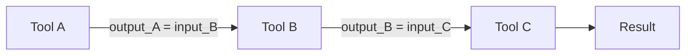
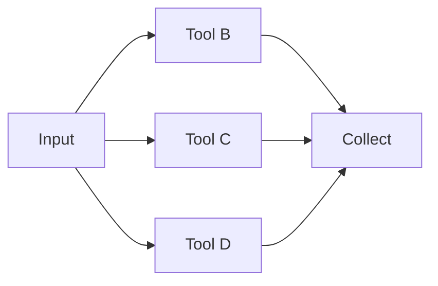
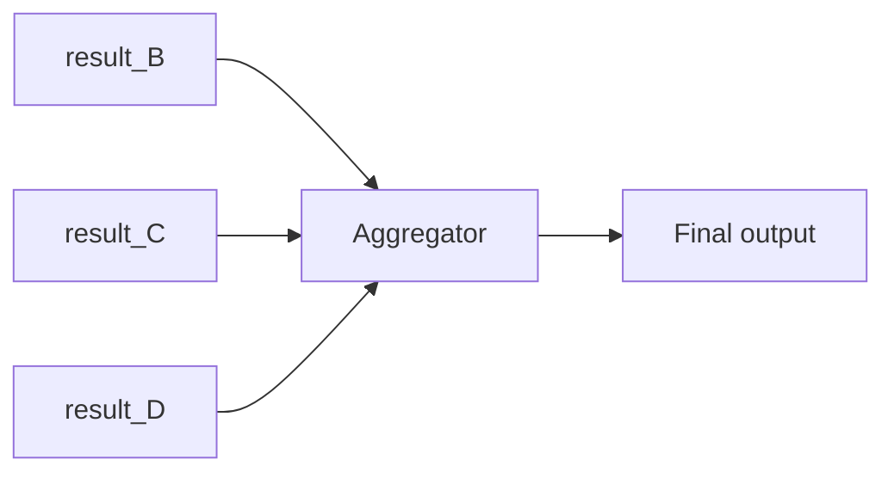
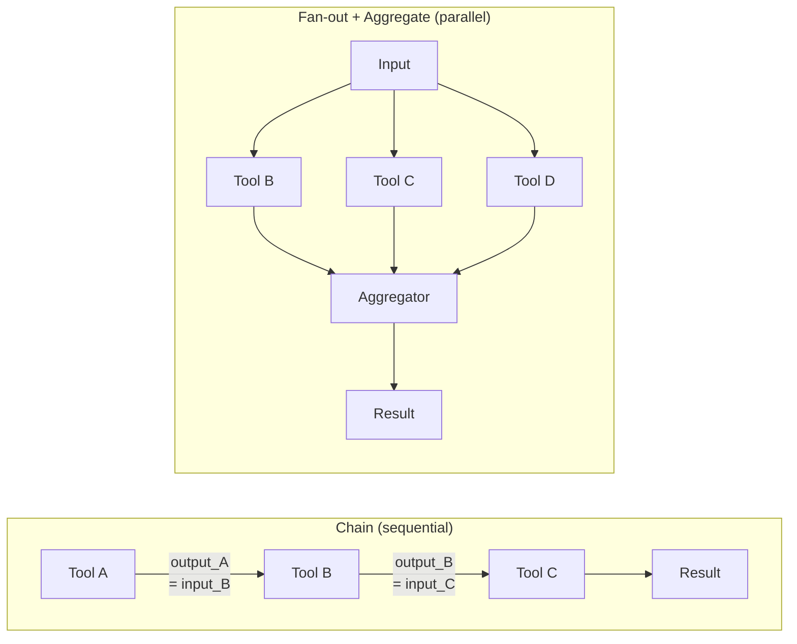

# Day 20 — Atomic Tool Design + Composition Patterns

> **Today's one idea:** Each tool does exactly one job and fails loudly; complex agent behaviors emerge from three structural compositions — chain, fan-out, and aggregate — applied to these atomic building blocks.
> **Reading time:** ~40 min · **Prereqs:** Day 19 (Skill Design Pattern)
> **Primary source for today:** Anthropic, *Building Effective Agents* (Dec 2024) — "Workflows" section · Huyen, *AI Engineering* (O'Reilly, 2025) — Ch. 7.

---

## The hook

Unix was designed around one principle: *do one thing and do it well*. `ls` lists files. `grep` filters lines. `sort` sorts. `wc` counts. None of them does the other's job.

But the power isn't in any one command — it's in the pipe: `ls | grep ".py" | sort | wc -l` counts all Python files, sorted. Four atomic tools composed into something complex. You didn't need a single `count-sorted-python-files` command. You composed the tools you already had.

Agent tool design follows the same principle. Atomic tools compose into complex behaviors through three structural patterns. Understanding these patterns is the difference between an agent that can only do what you explicitly programmed and one that can assemble novel capabilities from its existing toolkit.

---

## Building the intuition

### Why atomic design matters for composition

[Day 19](./day-19-skill-design-pattern.md) established that a good skill has single responsibility. Here is why that property is *specifically necessary for composition*:

If Tool A does tasks 1 and 2, and Tool B does tasks 2 and 3, then:
- You can't use just task 1 from Tool A without also doing task 2
- If you chain Tool A → Tool B, task 2 runs twice
- You can't easily chain Tool A (task 1 output) into Tool B (task 3 input) because they're designed around task 2

Atomic tools have no internal coupling. Chain, fan-out, and aggregate work cleanly because each tool's input and output are precisely defined and minimal.

### The three structural compositions

**Composition 1 — Chain**

The output of one tool is the direct input to the next. Steps are sequential and dependent.



Use chain when: steps must happen in order, each step depends on the previous result, and there's a single thread of execution.

Example: `fetch_article_text` → `summarize_text` → `translate_to_spanish`

**Composition 2 — Fan-out**

One input triggers multiple tools running in parallel. Results are collected.



Use fan-out when: multiple independent sub-tasks address the same input, order doesn't matter, and parallelism is available.

Example: For a research question, simultaneously: `web_search("topic A")` + `web_search("topic B")` + `search_arxiv("topic")` → collect all results.

**Composition 3 — Aggregate**

Multiple inputs (from fan-out or independent sources) are combined by one tool into a single output.



Use aggregate when: you have multiple partial results that must be synthesized, voted on, or ranked.

Example: Three search results → `synthesize_sources` → one answer. Or: five Self-Consistency outputs → `majority_vote` → one answer.

Fan-out and aggregate are almost always paired: you fan out to collect diverse inputs, then aggregate to synthesize them.

---

## The formal picture

### All three compositions in one diagram



### Implementing all three in Python

```python
import asyncio
import anthropic
from typing import Any

client = anthropic.Anthropic()


# ── Utility: call LLM ──────────────────────────────────────────────────────────

def llm(prompt: str, max_tokens: int = 1024) -> str:
    response = client.messages.create(
        model="claude-3-5-sonnet-20241022",
        max_tokens=max_tokens,
        messages=[{"role": "user", "content": prompt}]
    )
    return response.content[0].text.strip()


# ── Atomic skills (each does exactly one thing) ────────────────────────────────

def fetch_text(url: str) -> str:
    """Stub: fetch the text content of a URL."""
    return f"[Text content of {url} — replace with real HTTP fetch]"

def summarize(text: str, max_sentences: int = 3) -> str:
    """Summarize text to at most max_sentences sentences."""
    return llm(
        f"Summarize the following in at most {max_sentences} sentences:\n\n{text}"
    )

def translate(text: str, target_language: str) -> str:
    """Translate text to target_language."""
    return llm(f"Translate this to {target_language}:\n\n{text}")

def web_search(query: str) -> str:
    """Stub: return search results for query."""
    return f"[Search results for: '{query}' — replace with real search API]"

def extract_key_facts(text: str) -> list[str]:
    """Extract the 3 most important facts from text as a list."""
    raw = llm(
        f"List the 3 most important facts from this text. "
        f"One fact per line, no numbering:\n\n{text}"
    )
    return [line.strip() for line in raw.splitlines() if line.strip()]

def synthesize_sources(sources: list[str], question: str) -> str:
    """Synthesize multiple source texts to answer a question."""
    combined = "\n\n---\n\n".join(
        f"Source {i+1}:\n{src}" for i, src in enumerate(sources)
    )
    return llm(
        f"Question: {question}\n\n"
        f"Answer using ONLY the information in the sources below. "
        f"If the sources conflict, note the disagreement.\n\n{combined}"
    )


# ── Composition 1: Chain ───────────────────────────────────────────────────────

def chain_fetch_summarize_translate(url: str, target_language: str) -> str:
    """
    Chain: fetch → summarize → translate
    Each step's output feeds the next step's input.
    """
    text       = fetch_text(url)                       # Step 1
    summary    = summarize(text, max_sentences=3)       # Step 2: depends on Step 1
    translated = translate(summary, target_language)    # Step 3: depends on Step 2
    return translated


# ── Composition 2: Fan-out ─────────────────────────────────────────────────────

def fanout_multi_search(queries: list[str]) -> list[str]:
    """
    Fan-out: run multiple searches in parallel.

    In synchronous Python, we run them sequentially (still independent).
    In production with async, these would be truly parallel.
    """
    results = []
    for query in queries:
        result = web_search(query)  # each independent of the others
        results.append(result)
    return results

# Async version (truly parallel — use in production)
async def fanout_async(queries: list[str]) -> list[str]:
    """Truly parallel fan-out using asyncio."""
    async def search_async(q: str) -> str:
        # Replace with an async HTTP call in production
        return await asyncio.to_thread(web_search, q)

    return await asyncio.gather(*[search_async(q) for q in queries])


# ── Composition 3: Aggregate ───────────────────────────────────────────────────

def aggregate_and_answer(question: str, sources: list[str]) -> str:
    """
    Aggregate: combine multiple source texts into one answer.
    """
    return synthesize_sources(sources, question)


# ── Full fan-out + aggregate pipeline ─────────────────────────────────────────

def research_question(question: str, search_queries: list[str]) -> str:
    """
    Full pipeline: fan-out to multiple searches → aggregate into one answer.
    This is a common production pattern for research agents.
    """
    print(f"Running {len(search_queries)} parallel searches...")
    search_results = fanout_multi_search(search_queries)         # fan-out

    print("Synthesizing results...")
    answer = aggregate_and_answer(question, search_results)      # aggregate

    return answer


# ── Example ────────────────────────────────────────────────────────────────────

if __name__ == "__main__":
    # Chain example
    print("=== CHAIN ===")
    result = chain_fetch_summarize_translate(
        url="https://example.com/article",
        target_language="French"
    )
    print(result)

    # Fan-out + Aggregate example
    print("\n=== FAN-OUT + AGGREGATE ===")
    answer = research_question(
        question="What are the main causes of the 2008 financial crisis?",
        search_queries=[
            "2008 financial crisis causes housing bubble",
            "2008 financial crisis mortgage-backed securities failure",
            "Lehman Brothers collapse 2008 causes"
        ]
    )
    print(answer)
```

### Choosing the right composition

| Situation | Composition |
|-----------|-------------|
| Steps must happen in order; each depends on the previous | Chain |
| Multiple independent sub-tasks from the same input | Fan-out |
| Multiple results that need to be combined | Aggregate |
| Complex task with both sequential and parallel steps | Chain + Fan-out + Aggregate nested |

The last row is the most common production case. A research pipeline might: (1) Chain: parse question → generate sub-queries; (2) Fan-out: search all sub-queries; (3) Aggregate: synthesize results; (4) Chain: format output → deliver.

---

## Where it breaks / what it is not

**Chain failure propagation.** In a chain, a failure at step 2 means steps 3–N never run — and the agent may not know what happened. Always design chains with explicit error states at each step. If step 2 returns `{"error": "source_unavailable"}`, step 3 should detect this and either abort gracefully or substitute a fallback.

**Fan-out cost multiplication.** Running 10 searches in parallel is cheaper in latency but not in total cost — you're paying for 10 searches. For expensive tool calls (LLM calls, paid APIs), fan-out cost can spiral. Cap fan-out width explicitly.

**Aggregation quality depends on aggregator design.** `synthesize_sources` above is an LLM call — it can hallucinate connections between sources, overweight one source, or miss conflicts. The aggregator is often the most error-prone step in a fan-out/aggregate pipeline. Test it with adversarial inputs (conflicting sources, empty sources, one relevant + many irrelevant).

**Composition doesn't replace planning.** These three patterns are structural — they describe *how* tools connect, not *when* to use them or *which* tools to pick. That's still the agent's job. You can have perfect composition patterns and a bad agent that uses them in the wrong order for the wrong reasons.

---

## Try it yourself

**Exercise 1 — Check your understanding:**
Draw the fan-out + aggregate pipeline for this task: "Compare the reviews of three competing products." Label every node with: skill name, input, output. Where does the agent's reasoning happen, and where does the composition happen?

**Exercise 2 — Apply it:**
Run `research_question` with real queries (replace the search stub with a real search API). Observe: does the synthesized answer suffer from any of the aggregation failure modes listed above (hallucinated connections, missed conflicts)?

**Exercise 3 — Stretch:**
A chain where step 2 fails does nothing for steps 3–N. Design a *resilient chain* that continues even when a step fails: it skips the failed step, notes the gap, and continues with what's available. What does the output look like when step 2 fails? How does the agent know?

<details>
<summary>Hint for Exercise 1</summary>
The three product review searches are the fan-out (three parallel `web_search` calls with different product names). The "compare" step is the aggregate (`compare_reviews(result_A, result_B, result_C)`). The agent's reasoning lives in the "decide to search for these three products" and "decide what comparison dimensions matter" — not in the tools themselves.
</details>

<details>
<summary>Worked solution for Exercise 3</summary>

```python
def resilient_chain(steps: list[callable], input_data: Any) -> dict:
    """
    A chain that continues past failures.
    Returns: {"result": final_output, "gaps": [list of failed step names]}
    """
    current = input_data
    gaps = []

    for step in steps:
        result = step(current)

        # Check for error signal
        if isinstance(result, dict) and "error" in result:
            gaps.append({
                "step": step.__name__,
                "error": result["error"],
                "input_was": str(current)[:100]
            })
            # Continue with previous value — next step gets the un-updated input
            # (or a specific "partial result" marker)
            current = {"partial": current, "gap": result["error"]}
        else:
            current = result

    return {"result": current, "gaps": gaps}
```

The output when step 2 fails: `current` carries a `{"partial": original_step_1_output, "gap": "source_unavailable"}` marker into step 3. Step 3 must be designed to handle this: either `if "gap" in input: skip_gracefully()` or just process whatever is in `input["partial"]`. The `gaps` list in the final result tells the agent (and the engineer) exactly what failed.
</details>

---

## Connect it back

[Day 19](./day-19-skill-design-pattern.md) gave you the design rules for individual skills. Today gave you the structural vocabulary for combining them. Together, these two days answer the question: *how do you build an action space that scales?*

[Tomorrow (Day 21)](./day-21-toolformer.md) introduces a different angle: instead of you designing when to use each tool, what if the model learned it by itself?

**One question you can now answer that you couldn't this morning:** An agent has five atomic search tools, each for a different source. When should you chain them (one after another) vs. fan-out (all at once)? What does the task structure tell you?

---

## Suggested readings for today

**Required if you have 15 extra minutes:**
Anthropic, *Building Effective Agents* (Dec 2024) — "Workflows" section (all five workflow patterns).
The five patterns (prompt chaining, routing, parallelization, orchestrator-workers, evaluator-optimizer) are Anthropic's production taxonomy of agent architectures. Today's three compositions map directly onto prompt chaining (chain), parallelization (fan-out + aggregate), and parts of orchestrator-workers.

**If you want the deep version:**
- Huyen, *AI Engineering* (O'Reilly, 2025) — Chapter 7, specifically the section on "Chaining LLM calls." The engineering treatment of latency optimization and failure propagation in multi-step pipelines — the production perspective on today's composition patterns.

---

## Navigation

← **Previous:** [Day 19 — The Skill Design Pattern](./day-19-skill-design-pattern.md)
→ **Next:** [Day 21 — Toolformer: Self-Taught Tool Use](./day-21-toolformer.md)
