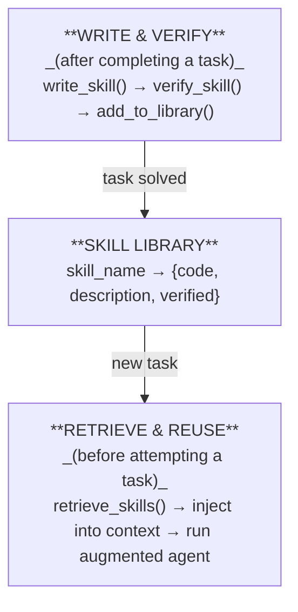

# Day 22 — The Skill Library Pattern

> **Today's one idea:** A persistent, growing library of verified, reusable skills lets an agent tackle novel tasks by composing what it already knows — turning each completed task into a permanent capability, not a one-time solution.
> **Reading time:** ~45 min · **Prereqs:** Day 21 (Toolformer), Day 17 (ExpeL)
> **Primary source for today:** Wang, Zhu, Liu et al. — *Voyager: An Open-Ended Embodied Agent with Large Language Models* (2023, arXiv:2305.16291) — Sections 3.2 and 3.3.

---

## The hook

A senior engineer doesn't solve every problem from scratch. They have a mental — and sometimes literal — library: "I've solved rate-limiting before; here's the pattern." "I've handled this type of database deadlock; here's the fix." Each problem solved enriches the library. Novel problems are increasingly rare because they're solved by composing known patterns.

A junior engineer solves each problem as if it were new. Even if they've solved "rate-limiting" five times before, they re-derive the solution each time. Their capability doesn't compound.

Most LLM agents are junior engineers. Each run starts fresh. Solve a task → discard everything → start over. The knowledge that enabled the solution — the specific tool call sequence, the edge case handling, the verified approach — evaporates.

The Skill Library pattern makes agents behave like senior engineers. Wang et al. introduced this explicitly in Voyager (2023): an agent playing Minecraft that writes code skills, verifies them by execution, stores them in a library, and retrieves relevant skills for new tasks. After 100 tasks, it can do things a fresh agent couldn't attempt — because it is standing on the shoulders of 100 previous solutions.

---

## Building the intuition

### What makes a skill library different from memory

[ExpeL (Day 17)](../../03-self-improvement/days/day-17-expel.md) stored *insights* — natural language rules extracted from past trajectories. The Skill Library stores *executable skills* — code (or structured tool call sequences) that can be directly run.

The distinction matters enormously:

```
ExpeL insight:
  "Always verify file existence before reading. Use file_exists() first."
  → The agent must still figure out how to act on this

Skill Library skill:
  def safe_read_file(path: str) -> str:
      if not os.path.exists(path):
          return f"Error: file not found at {path}"
      with open(path, 'r') as f:
          return f.read()
  # Verified: tested and confirmed to work
  → The agent can call this directly
```

Insights inform reasoning. Skills extend the action space. A skill library is a growing action space — every solved problem adds a new reusable capability.

### The three components of Voyager's Skill Library

**Component 1 — Skill Writing.** When the agent solves a task, it writes the solution as a reusable code skill: a named function with clear inputs, outputs, and internal logic. The skill is not just the solution to this specific task — it's generalized to be reusable for similar tasks.

**Component 2 — Skill Verification.** Before a skill enters the library, it is tested. In Voyager's Minecraft setting, this means executing the code and checking whether it achieves the intended effect. Failed skills are not added — or are added with a "failed" flag and the failure reason for debugging.

**Component 3 — Skill Retrieval.** When facing a new task, the agent queries the library: "which of my existing skills are relevant to this task?" Retrieved skills are injected into the context as available tools, augmenting the agent's action space for this specific task.



---

## The formal picture

### The Skill Library data structure

Each skill in the library has five fields:

```python
@dataclass
class Skill:
    name:        str         # unique, verb-object: "navigate_to_waypoint", "craft_iron_sword"
    description: str         # what it does; when to use it; what it needs and returns
    code:        str         # the actual executable implementation
    verified:    bool        # True if the skill passed verification
    usage_count: int = 0     # how many times it's been retrieved and used
    tags:        list[str] = field(default_factory=list)  # searchable labels
```

### The full Skill Library implementation

```python
import json
import hashlib
from dataclasses import dataclass, field, asdict
from pathlib import Path
import anthropic

client = anthropic.Anthropic()


@dataclass
class Skill:
    name:        str
    description: str
    code:        str
    verified:    bool       = False
    usage_count: int        = 0
    tags:        list[str]  = field(default_factory=list)
    created_for: str        = ""   # original task that produced this skill


class SkillLibrary:
    """
    A persistent, growing library of verified executable skills.

    Backed by a JSON file so it survives between sessions.
    Supports: add, retrieve (by semantic similarity), verify, and list.
    """

    def __init__(self, storage_path: str = "skill_library.json"):
        self.path   = Path(storage_path)
        self.skills: dict[str, Skill] = {}
        self._load()

    # ── Persistence ─────────────────────────────────────────────────────────────

    def _load(self) -> None:
        if self.path.exists():
            raw = json.loads(self.path.read_text())
            self.skills = {
                name: Skill(**data) for name, data in raw.items()
            }

    def _save(self) -> None:
        self.path.write_text(
            json.dumps({name: asdict(s) for name, s in self.skills.items()}, indent=2)
        )

    # ── Write ────────────────────────────────────────────────────────────────────

    def add_skill(self, skill: Skill) -> bool:
        """Add a skill to the library. Returns True if added, False if duplicate."""
        if skill.name in self.skills:
            existing = self.skills[skill.name]
            # Update if the new version is verified and the old isn't
            if skill.verified and not existing.verified:
                self.skills[skill.name] = skill
                self._save()
                return True
            return False
        self.skills[skill.name] = skill
        self._save()
        return True

    # ── Verify ───────────────────────────────────────────────────────────────────

    def verify_skill(self, skill_name: str, test_inputs: dict | None = None) -> tuple[bool, str]:
        """
        Verify a skill by executing it in a sandboxed namespace.

        For production: use Docker or a sandboxed executor.
        This implementation uses a restricted exec() for demonstration.

        Returns: (success: bool, message: str)
        """
        if skill_name not in self.skills:
            return False, f"Skill '{skill_name}' not found in library."

        skill = self.skills[skill_name]
        namespace: dict = {}

        try:
            # Execute the skill definition
            exec(skill.code, namespace)   # noqa: S102 — use sandbox in production

            # Check the function is defined
            if skill.name not in namespace:
                return False, f"Skill code does not define a function named '{skill.name}'."

            # If test inputs provided, run a smoke test
            if test_inputs is not None:
                result = namespace[skill.name](**test_inputs)
                if result is None:
                    return False, "Skill returned None — expected a value."

            # Mark as verified
            skill.verified = True
            self._save()
            return True, "Skill verified successfully."

        except SyntaxError as e:
            return False, f"Syntax error in skill code: {e}"
        except Exception as e:
            return False, f"Skill execution failed: {type(e).__name__}: {e}"

    # ── Retrieve ─────────────────────────────────────────────────────────────────

    def retrieve_relevant(self, task: str, top_k: int = 3) -> list[Skill]:
        """
        Find the top_k skills most relevant to the given task.

        Uses LLM-based semantic matching.
        For production at scale: replace with embedding similarity search.
        """
        verified_skills = [s for s in self.skills.values() if s.verified]
        if not verified_skills:
            return []

        # Build a concise index of available skills
        index = "\n".join(
            f"{i+1}. {s.name}: {s.description[:120]}"
            for i, s in enumerate(verified_skills)
        )

        response = client.messages.create(
            model="claude-3-5-sonnet-20241022",
            max_tokens=64,
            messages=[{
                "role": "user",
                "content": (
                    f"New task: {task}\n\n"
                    f"Available skills:\n{index}\n\n"
                    f"Which {top_k} skills (by number) are most useful for this task? "
                    f"Reply with only comma-separated numbers, e.g.: '2, 5, 7'"
                )
            }]
        )

        selected = []
        for token in response.content[0].text.replace(",", " ").split():
            try:
                idx = int(token.strip(".,")) - 1
                if 0 <= idx < len(verified_skills):
                    s = verified_skills[idx]
                    s.usage_count += 1
                    selected.append(s)
            except ValueError:
                pass

        self._save()
        return selected[:top_k]

    # ── Inspect ──────────────────────────────────────────────────────────────────

    def list_skills(self, verified_only: bool = True) -> list[Skill]:
        skills = list(self.skills.values())
        if verified_only:
            skills = [s for s in skills if s.verified]
        return sorted(skills, key=lambda s: s.usage_count, reverse=True)

    def __len__(self) -> int:
        return len(self.skills)


# ── Skill generation ──────────────────────────────────────────────────────────

def generate_skill_from_solution(task: str, solution_trace: str) -> Skill | None:
    """
    After an agent solves a task, generalize the solution into a reusable skill.

    Takes the task description and the agent's solution trace,
    and asks the LLM to write a generalized, reusable Python function.
    """
    response = client.messages.create(
        model="claude-3-5-sonnet-20241022",
        max_tokens=1024,
        messages=[{
            "role": "user",
            "content": (
                f"An agent just solved this task:\n\n"
                f"TASK: {task}\n\n"
                f"SOLUTION TRACE:\n{solution_trace}\n\n"
                f"Write a reusable Python function that generalizes this solution. "
                f"The function should:\n"
                f"1. Have a descriptive name (verb_object format, e.g. 'parse_date_range')\n"
                f"2. Accept parameters for anything task-specific\n"
                f"3. Return a clear value (not print)\n"
                f"4. Include a one-line docstring describing its purpose\n"
                f"5. Handle obvious edge cases\n\n"
                f"Output format (JSON only, no markdown):\n"
                f'{{"name": "...", "description": "...", "code": "...", "tags": [...]}}'
            )
        }]
    )

    raw = response.content[0].text.strip()
    # Strip markdown fences if present
    if raw.startswith("```"):
        raw = "\n".join(raw.splitlines()[1:-1])

    try:
        data = json.loads(raw)
        return Skill(
            name        = data["name"],
            description = data["description"],
            code        = data["code"],
            tags        = data.get("tags", []),
            verified    = False,
            created_for = task
        )
    except (json.JSONDecodeError, KeyError) as e:
        print(f"Failed to parse skill JSON: {e}\nRaw: {raw[:200]}")
        return None


# ── Agent with Skill Library ──────────────────────────────────────────────────

def run_with_skill_library(
    task:    str,
    library: SkillLibrary,
    verbose: bool = True,
) -> str:
    """
    Run an agent with the skill library augmenting its context.

    1. Retrieve relevant skills from the library
    2. Inject skill code into the system prompt as available functions
    3. Run the agent
    4. Generalize the solution into a new skill and add to the library
    """

    # Step 1: Retrieve relevant skills
    relevant = library.retrieve_relevant(task, top_k=3)

    if verbose and relevant:
        print(f"\n[Library retrieved {len(relevant)} skill(s):]")
        for s in relevant:
            print(f"  • {s.name}: {s.description[:80]}")

    # Step 2: Build system prompt with available skills
    skill_block = ""
    if relevant:
        skill_defs = "\n\n".join(s.code for s in relevant)
        skill_block = (
            f"You have these pre-built, verified skills available. "
            f"Use them directly rather than re-implementing:\n\n"
            f"```python\n{skill_defs}\n```\n\n"
        )

    system_prompt = (
        f"{skill_block}"
        f"Solve the task step by step. "
        f"Use your available skills when relevant. "
        f"Show your reasoning."
    )

    # Step 3: Run the agent (simplified — use full ReAct loop in production)
    response = client.messages.create(
        model="claude-3-5-sonnet-20241022",
        max_tokens=1024,
        system=system_prompt,
        messages=[{"role": "user", "content": task}]
    )
    solution = response.content[0].text.strip()

    # Step 4: Generalize solution → new skill → add to library
    new_skill = generate_skill_from_solution(task, solution)
    if new_skill:
        added = library.add_skill(new_skill)
        if added:
            success, msg = library.verify_skill(new_skill.name)
            if verbose:
                status = "✓ verified" if success else f"✗ failed: {msg}"
                print(f"\n[New skill '{new_skill.name}' {status}]")

    return solution


# ── Example ───────────────────────────────────────────────────────────────────

if __name__ == "__main__":
    library = SkillLibrary("my_skill_library.json")
    print(f"Library loaded: {len(library)} skill(s)\n")

    # Task 1: builds a skill from scratch
    result1 = run_with_skill_library(
        task    = "Given a list of integers, return the sum of all even numbers.",
        library = library,
        verbose = True
    )
    print(f"\nResult:\n{result1}")

    print(f"\n{'='*60}")

    # Task 2: may retrieve the skill from Task 1 if relevant
    result2 = run_with_skill_library(
        task    = "I have [4, 7, 2, 11, 8, 3] — what is the sum of the even numbers?",
        library = library,
        verbose = True
    )
    print(f"\nResult:\n{result2}")

    print(f"\n{'='*60}")
    print(f"Library now contains {len(library)} skill(s):")
    for s in library.list_skills():
        print(f"  [{s.usage_count}× used] {s.name}: {s.description[:70]}")
```

### How the library compounds

The power of the Skill Library pattern is in the *compounding effect* across tasks:

```
Task 1: "Sum even numbers in a list"
  → Builds: sum_even_numbers(nums: list[int]) → int   [verified]

Task 2: "What is the average of the even numbers in [4,7,2,11,8]?"
  → Retrieves: sum_even_numbers
  → Builds: average_even_numbers(nums: list[int]) → float   [verified]
  (reuses the existing sum skill rather than reimplementing it)

Task 3: "Count and sum the even numbers in a CSV column"
  → Retrieves: sum_even_numbers, average_even_numbers
  → Builds: analyze_csv_column_evens(path: str, column: str) → dict   [verified]
  (composes two existing skills into a new one)
```

After 50 tasks, the library contains 20–30 verified, composable skills. The agent's effective action space has grown 20× from its initial state.

### The Voyager connection: skills as code in Minecraft

In Voyager, Wang et al. applied this exact pattern to a Minecraft agent. The agent:
1. Autonomously explores and sets its own curriculum (easy tasks first)
2. Writes JavaScript code skills to accomplish each task (e.g., `mineWood()`, `craftPickaxe()`)
3. Verifies skills by execution in the game environment
4. Retrieves relevant skills (by GPT-4 embedding similarity) for new tasks

The result: Voyager discovers 3.3× more unique items, travels 2.3× more distance, and unlocks technology tree milestones 15.3× faster than a state-of-the-art baseline — because it compounds capability across tasks rather than starting fresh each time.

The pattern transfers directly to non-game agents: replace Minecraft actions with Python functions, replace game execution with unit tests or sandboxed execution, replace the curriculum with task queues.

---

## Where it breaks / what it is not

**Skill quality degrades over time.** A skill written to solve Task 17 may rely on assumptions that don't hold for Task 52. If the skill is never updated — only used — it can become subtly wrong. Production skill libraries need a "skill health" mechanism: flag skills that fail on new tasks, trigger re-verification, and deprecate skills that can't be repaired.

**Retrieval failures compound.** If the retrieval mechanism returns irrelevant skills, the agent's context is polluted with unhelpful code. Worse: a plausible-sounding but wrong skill may cause the agent to confidently produce incorrect results. Always verify that retrieved skills are actually relevant before injecting them into the context.

**The library has no internal consistency.** Skills `sum_even_numbers` and `sum_evens` may be duplicates. Skill A may assume integer inputs; Skill B may assume floats. Without an active deduplication and normalization step, the library grows noisy over time. Voyager addresses this by using GPT-4 to check for semantic duplicates before adding new skills.

**Skill libraries are task-domain specific.** A library built for data processing tasks has nothing useful for web scraping tasks. In production, maintain separate libraries per domain, or use fine-grained tags to filter retrieval to the relevant domain.

---

## Try it yourself

**Exercise 1 — Check your understanding:**
Explain the difference between a Skill Library and ExpeL's insight store. Both store knowledge from past experience. What exactly is stored differently, and how does that change what the agent can do with the retrieved knowledge?

**Exercise 2 — Apply it:**
Run the code above on two related tasks (the example tasks work). After both tasks, inspect `my_skill_library.json`. What was written? Is the second skill different from the first? Does it reference or build on the first? Run a third task manually designed to benefit from both existing skills — does the retrieval find them?

**Exercise 3 — Stretch:**
The current implementation stores skills as raw Python code and verifies them with `exec()`. Design a safer verification strategy for a production system where you can't trust the generated code. What constraints would you enforce? What sandboxing approach would you use? What test harness would you build around it?

<details>
<summary>Hint for Exercise 1</summary>
Think about what the agent does with each type of knowledge after retrieval. ExpeL insights are injected as natural language — the agent reads them and incorporates them into its reasoning. Skill Library code is injected as executable functions — the agent calls them directly. What capability does each type enable that the other doesn't?
</details>

<details>
<summary>Worked solution for Exercise 1</summary>
ExpeL stores **insights** — compressed natural-language rules extracted from past trajectories. When retrieved, they condition the agent's reasoning: "remember to check file existence before reading." The agent must still figure out *how* to act on the insight — it provides guidance, not execution.

The Skill Library stores **executable skills** — verified, parameterized code functions. When retrieved, they extend the agent's action space: the agent can call `safe_read_file(path)` directly, without re-implementing the file existence check or writing any new code. The skill is a reusable *capability*, not just a lesson.

The key difference: ExpeL improves *how the agent reasons*. The Skill Library expands *what the agent can do*. They compose naturally: use ExpeL for strategic insights ("approach this class of task by doing X before Y") and the Skill Library for tactical execution ("here's the verified code for X and Y").
</details>

---

## Connect it back

Module 04 is now complete. The four-day arc:

```
Day 19: DESIGN — what makes a skill worth building (properties, contracts)
Day 20: COMPOSE — how to combine skills (chain, fan-out, aggregate)
Day 21: LEARN   — how a model discovers when to use skills (Toolformer)
Day 22: PERSIST — how a growing library compounds capability (Skill Library)
```

This arc answers the question from Day 3 completely: *how do you build an action space that grows with the agent's capability?* Start with well-designed atomic skills. Compose them in structured patterns. Teach the model to use them. And persist what works in a library that every future task can draw from.

[Module 05 (Memory)](../../05-memory/overview.md) begins with Day 23 — the taxonomy of agent memory. The Skill Library is actually an example of **external semantic memory** (reusable knowledge indexed by description). Day 23 will formalize this and give you the vocabulary to place every memory mechanism you've seen in this course on the same map.

**One question you can now answer that you couldn't this morning:** An agent has successfully solved 200 tasks using a Skill Library. A new task arrives that seems novel but is actually a combination of two tasks the library has skills for. Walk through exactly what happens in the agent's execution — where does the library help, and what does the agent still have to figure out on its own?

---

## Suggested readings for today

**Required if you have 15 extra minutes:**
Wang et al., *Voyager* (arXiv:2305.16291) — Section 3.3 (skill library, 2 pages).
This section describes the exact implementation: how skills are stored as JavaScript functions, how retrieval uses GPT-4 embeddings, and how the curriculum drives skill acquisition. The Minecraft context makes every design decision concrete and inspectable.

**If you want the deep version:**
- Wang et al., Section 4 (experiments) — Table 1 shows the compounding capability gain: Voyager after 160 iterations vs. baseline. The key result is not just "it's better" — it's that the capability gap *widens* over time. That widening is the Skill Library pattern in action.
- Wang et al., Section 3.2 (automatic curriculum) — the mechanism that drives skill acquisition: the agent self-proposes tasks at the edge of its current capability, creating a natural progression. This is directly applicable to non-game agents as a task scheduling strategy.
- Microsoft Semantic Kernel — Plugin system — https://learn.microsoft.com/en-us/semantic-kernel/concepts/plugins/ — A production-grade Skill Library implementation with versioning, dependency injection, and telemetry. The `KernelFunction` and `KernelPlugin` types are the production version of today's `Skill` and `SkillLibrary` dataclasses.

---

## Navigation

← **Previous:** [Day 21 — Toolformer: Self-Taught Tool Use](./day-21-toolformer.md)
→ **Next:** [Day 23 — Memory Taxonomy](../../05-memory/days/day-23-memory-taxonomy.md)
