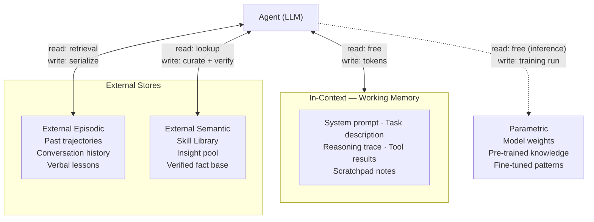

# Day 23 — Memory Taxonomy

> **Today's one idea:** Agent memory has four stores — in-context, external episodic, external semantic, and parametric — each with different read/write costs, decay rates, and capacity limits. The right design chooses the right store for each type of information.
> **Reading time:** ~40 min · **Prereqs:** Day 2 (Cognitive Architecture Map), Day 11 (Reflexion), Day 22 (Skill Library)
> **Primary source for today:** Sumers et al., "Cognitive Architectures for Language Agents" (arXiv:2309.02427, 2024) — Section 3 "Memory."

---

## The hook

Senior engineers solve new problems faster than juniors, even when neither has seen the exact problem before. The senior's edge isn't raw intelligence — it's memory structure. They've stored:

- **What worked** in similar situations (episodic)
- **Why it worked** as generalizable principles (semantic)
- **How to do it** as an intuition they don't consciously think about (parametric)

Agents have the same four stores available. The difference between an agent that plateaus and one that compounds is whether those stores are designed intentionally.

---

## Building the intuition

### The four stores

Every piece of information an agent holds lives in one of four places:

| Store | Where it lives | Read cost | Write cost | Capacity | Decay |
|-------|---------------|-----------|------------|----------|-------|
| **In-context (working)** | Context window | Zero | Tokens | ~200K tokens | Session end |
| **External episodic** | Vector DB / file system | Retrieval (~ms) | Serialization | Unlimited | None |
| **External semantic** | Structured store (JSON, DB) | Lookup | Curation + verify | Unlimited | None |
| **Parametric** | Model weights | Zero | Fine-tuning run | Fixed (weights) | None |

**In-context (working memory):** Everything currently in the prompt. Zero latency, no infrastructure. But it's expensive (tokens cost money) and ephemeral (gone when the session ends). You cannot grow it past the context limit.

**External episodic:** Past experiences stored outside the model — task trajectories, conversation logs, past reasoning chains. Read by retrieval (similarity search or chronological lookup). Write by serializing the experience. Persists across sessions. The agent's diary.

**External semantic:** Structured, indexed knowledge — skill libraries, fact stores, rule sets. Different from episodic in that it is not raw experience but *processed* knowledge. Read by lookup or search. Write by deliberate curation, often with a verification step (like `verify_skill()` from Day 22).

**Parametric:** Knowledge baked into the model's weights through training or fine-tuning. Read is free — it's just what the model knows. Write requires a fine-tuning run. STaR (Day 16) updates parametric memory. Everything else updates the other three stores.

### How the patterns you've already seen use memory

Every pattern in this course has been implicitly using one or more of these stores:

| Pattern | Primary memory store | What is stored |
|---------|---------------------|---------------|
| Chain-of-Thought | In-context | Reasoning trace (intermediate steps) |
| Self-Consistency | In-context (multi-sample) | N candidate answers for majority vote |
| ReAct | In-context | T/A/O trace |
| Reflexion | External episodic | Verbal lessons across trials |
| Self-Refine | In-context | Previous drafts + critique feedback |
| STaR | Parametric | Fine-tuned reasoning patterns in weights |
| ExpeL | External semantic | Distilled, indexed insight rules |
| Skill Library | External semantic | Verified, executable skill functions |

The taxonomy doesn't introduce new patterns — it gives you a unified lens to see the memory architecture underneath everything you've already built.

### The trade-off: cost vs persistence

Two dimensions determine which store fits which information:

```
Write cost
    ↑
    │  Parametric  ── full training run, months of amortization
    │
    │  External episodic/semantic  ── retrieval infra, serialization
    │
    │  In-context  ── only token cost, no infrastructure
    └────────────────────────────────────────────────────→
                                   Persistence across sessions
```

High persistence costs more to write. In-context is cheap to write but doesn't persist. Parametric persists forever but requires a full training run to update.

The practical heuristic:
- Information needed only for this task → **in-context**
- Specific past experience to learn from → **external episodic**
- General verified knowledge to reuse → **external semantic**
- Broadly applicable pattern worth baking in forever → **parametric**

The distinction between episodic and semantic is especially important: Reflexion's `verbal_memory` (Day 11) is episodic — it stores what happened in trial N as raw experience. ExpeL's `insight_pool` (Day 17) is semantic — it stores the *distilled rule* extracted from comparing many trials. Both are external, but one is experience-ordered and one is knowledge-ordered.

---

## The formal picture

### The four stores in one diagram



The dashed line to Parametric reflects that this write path is outside the agent's runtime — it happens offline, in a fine-tuning pipeline.

### Implementing all four stores

```python
import json
import os
from dataclasses import dataclass, field
from typing import Any
import anthropic

client = anthropic.Anthropic()


def llm(prompt: str, max_tokens: int = 1024) -> str:
    response = client.messages.create(
        model="claude-3-5-sonnet-20241022",
        max_tokens=max_tokens,
        messages=[{"role": "user", "content": prompt}]
    )
    return response.content[0].text.strip()


# ── Store 1: In-Context (Working Memory) ──────────────────────────────────────
# No class needed — it's the messages list and system prompt.
# The "design" is how you structure what goes into the context.

def build_working_memory_context(
    task: str,
    established_facts: list[str],
    open_questions: list[str],
    working_notes: list[str],
) -> str:
    """Render the context window as a structured working memory space."""
    sections = [f"## Task\n{task}"]
    if established_facts:
        sections.append(
            "## Established Facts\n" + "\n".join(f"- {f}" for f in established_facts)
        )
    if open_questions:
        sections.append(
            "## Open Questions\n" + "\n".join(f"- {q}" for q in open_questions)
        )
    if working_notes:
        # Only the most recent 5 — older notes get compressed (see Day 24)
        sections.append(
            "## Working Notes (most recent last)\n"
            + "\n".join(f"- {n}" for n in working_notes[-5:])
        )
    return "\n\n".join(sections)


# ── Store 2: External Episodic ─────────────────────────────────────────────────

@dataclass
class Episode:
    task:      str
    outcome:   str
    success:   bool
    key_steps: list[str]


class EpisodicStore:
    """File-backed episodic store. Production: replace with a vector DB."""

    def __init__(self, path: str = "episodes.json"):
        self.path = path
        self._episodes: list[Episode] = self._load()

    def _load(self) -> list[Episode]:
        if not os.path.exists(self.path):
            return []
        with open(self.path) as f:
            return [Episode(**e) for e in json.load(f)]

    def _save(self) -> None:
        with open(self.path, "w") as f:
            json.dump(
                [{"task": e.task, "outcome": e.outcome,
                  "success": e.success, "key_steps": e.key_steps}
                 for e in self._episodes],
                f, indent=2,
            )

    def write(self, episode: Episode) -> None:
        self._episodes.append(episode)
        self._save()

    def retrieve(self, task: str, top_k: int = 3) -> list[Episode]:
        """Retrieve relevant past episodes. Stub: returns most recent k.
        Production: embed task → similarity search over embedded episodes."""
        return self._episodes[-top_k:]


# ── Store 3: External Semantic ─────────────────────────────────────────────────

class SemanticStore:
    """
    Key-value store for verified, structured knowledge.
    Unlike episodic, entries are curated facts or skills — not raw experience.
    """

    def __init__(self, path: str = "semantic_store.json"):
        self.path = path
        self._store: dict[str, Any] = self._load()

    def _load(self) -> dict[str, Any]:
        if not os.path.exists(self.path):
            return {}
        with open(self.path) as f:
            return json.load(f)

    def _save(self) -> None:
        with open(self.path, "w") as f:
            json.dump(self._store, f, indent=2)

    def write(self, key: str, value: Any) -> None:
        self._store[key] = value
        self._save()

    def read(self, key: str) -> Any | None:
        return self._store.get(key)

    def keys(self) -> list[str]:
        return list(self._store.keys())


# ── Store 4: Parametric ────────────────────────────────────────────────────────
# Read:  just call the model — it already knows what it knows.
# Write: fine-tuning pipeline (see Day 16, STaR). No class needed here.

def read_parametric(question: str) -> str:
    """Read from parametric memory — ask the model without any retrieval context."""
    return llm(question)


# ── Example: choosing the right store for each piece of information ────────────

if __name__ == "__main__":
    episodic = EpisodicStore("episodes.json")
    semantic  = SemanticStore("semantic_store.json")

    # Write a specific past experience → episodic
    episodic.write(Episode(
        task="Summarize a 5000-word technical paper",
        outcome=(
            "Used chunked summarization: split into 500-word chunks, "
            "summarize each, then synthesize the chunk summaries."
        ),
        success=True,
        key_steps=["chunk_text()", "summarize_chunk()", "synthesize_summaries()"],
    ))

    # Write a verified, general fact → semantic
    semantic.write("max_safe_context_tokens", 180_000)
    semantic.write("preferred_summary_chunk_size", 500)

    # Read: episodic → past experience for a similar task
    similar = episodic.retrieve("summarize a long document")
    print("Past experience:", similar[0].outcome if similar else "none")

    # Read: semantic → verified configuration value
    chunk_size = semantic.read("preferred_summary_chunk_size")
    print("Chunk size from semantic store:", chunk_size)

    # Read: parametric → model's baked-in knowledge (no retrieval)
    answer = read_parametric("What is the difference between abstractive and extractive summarization?")
    print("Parametric answer:", answer[:100], "...")
```

---

## Where it breaks / what it is not

**The stores aren't mutually exclusive.** A skill in the Skill Library is external semantic. But the reasoning that led to writing it was in-context working memory during the task that generated it. If you fine-tune a model on a large skill library, it becomes parametric. The taxonomy is a design tool, not a law of physics.

**Retrieval quality determines episodic value.** An episodic store is only as good as its retrieval. Store 1000 episodes and retrieve the wrong 3, and you've added noise, not signal. Invest in good embeddings and recall evaluation before scaling the store. Day 25 goes deeper on this.

**Parametric updates are slow and expensive.** Fine-tuning is the slowest, costliest write in the taxonomy. Use it only for knowledge that is stable, general, and high-value enough to justify a training run. Don't think of it as a fast feedback loop — it is the opposite.

**Working memory overflow is a silent failure.** When the context window fills, something gets truncated. If you don't control *what* gets truncated, you lose important information without knowing it. Day 24 addresses this directly.

---

## Try it yourself

**Exercise 1 — Check your understanding:**
Map each of these to a memory store: (a) the T/A/O trace in a ReAct step; (b) Reflexion's `verbal_memory` list; (c) ExpeL's `insight_pool`; (d) STaR's fine-tuned model; (e) a Skill Library entry. For each, state what makes that store the right choice.

**Exercise 2 — Apply it:**
Add a `retrieve_relevant()` method to `EpisodicStore` that uses the LLM to score each stored episode's relevance to the current task (0.0–1.0), then returns the top-k by score. What is the latency cost of this approach compared to vector similarity search? When would each be appropriate?

**Exercise 3 — Stretch:**
Design the full memory architecture for an agent that: (a) handles 1000 customer support tickets per day, (b) improves its response quality over time, (c) never gives the same wrong answer twice, and (d) retains verified solutions for reuse. Which store handles each requirement? Where are the write points in the agent loop?

<details>
<summary>Answer for Exercise 1</summary>

- **(a) In-context** — the ReAct T/A/O trace is just tokens in the current context window. Zero write cost, zero read cost, gone at session end.
- **(b) External episodic** — stored as a list that grows across trials; retrieved by recency (most recent lessons first). It is experience-ordered, not knowledge-ordered.
- **(c) External semantic** — distilled rules indexed for fast retrieval; curated from comparing successes vs failures. Knowledge-ordered, not experience-ordered. This is the key distinction from (b).
- **(d) Parametric** — fine-tuning literally updates the model's weights. The "memory" lives in the parameters.
- **(e) External semantic** — verified, structured, indexed by name and tags. Not a raw experience log; a curated knowledge base.

The subtle distinction between (b) and (c): Reflexion's verbal_memory stores *what went wrong in trial N* as a raw lesson. ExpeL's insight_pool stores the *generalized rule extracted from comparing many trials*. Both are external, but one is an experience diary and one is a processed knowledge base.
</details>

---

## Connect it back

[Day 2](../../01-foundations/days/day-02-cognitive-architecture-map.md) placed memory on the cognitive architecture map without detailing its structure. This day fills in that detail.

[Tomorrow (Day 24)](./day-24-scratchpad-working-memory.md) dives into the most immediate store — in-context working memory — and shows how to design it deliberately rather than letting it fill randomly.

**One question you can now answer that you couldn't this morning:** Reflexion and ExpeL both improve an agent's performance over time by storing and retrieving past information. Why are they in different memory stores? What is the functional difference between a verbal lesson and a distilled rule?

---

## Suggested readings for today

**Required if you have 15 extra minutes:**
Sumers et al., "Cognitive Architectures for Language Agents" (arXiv:2309.02427, 2024) — Section 3 "Memory and Storage."
This is the formal taxonomy this day is built on. The four stores map directly onto Sumers' terminology. Table 1 in the paper is the reference version of the store comparison table above.

**If you want the deep version:**
- Huyen, *AI Engineering* (O'Reilly, 2025) — Chapter 6, "RAG and Agents." The engineering implementation of external memory with vector databases: how to choose an embedding model, set up retrieval infrastructure, and evaluate recall@k.

---

## Navigation

← **Previous:** [Day 22 — The Skill Library Pattern](../../04-skills-and-tools/days/day-22-skill-library.md)
→ **Next:** [Day 24 — Scratchpad & Working Memory](./day-24-scratchpad-working-memory.md)
