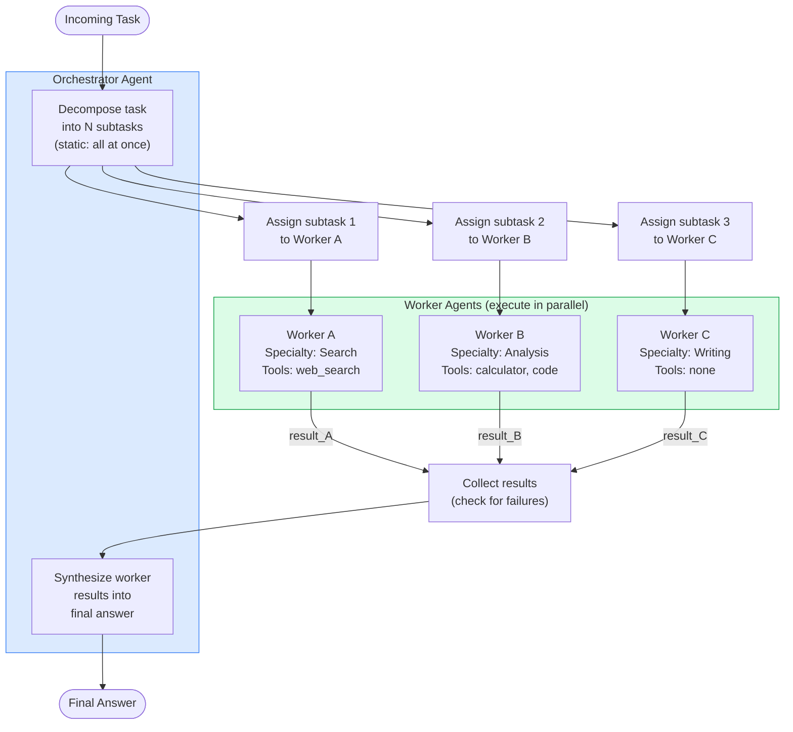

# Day 27 — Orchestrator-Worker Pattern

> **Today's one idea:** One orchestrator decomposes a task and delegates to specialized workers; workers execute independently; the orchestrator synthesizes their results. The pattern that makes agent specialization and parallelism possible.
> **Reading time:** ~40 min · **Prereqs:** [Day 20 (Tool Composition)](../../04-skills-and-tools/days/day-20-tool-design-composition.md), [Day 9 (ReAct implementation)](../../02-reasoning-patterns/days/day-09-react-implementation.md)
> **Primary sources for today:** Wu et al., *AutoGen: Enabling Next-Gen LLM Applications via Multi-Agent Conversation* (arXiv:2308.08155, 2023) · Anthropic, *Building Effective Agents* (Dec 2024) — "Orchestrator-workers" section.

---

## The hook

A general contractor doesn't do all the work. When you hire one to build an addition on your house, they show up on day one, look at the plans, and spend most of the project on the phone. They hire an electrician for the wiring, a plumber for the pipes, a framer for the walls, a drywaller for the finish. Each specialist knows their domain cold — the electrician has run ten thousand circuits; the framer can read a structural load in seconds. The contractor knows none of these trades as well as the specialists do.

But here's the thing: the contractor is the only reason the house gets built. The electrician doesn't know the plumber needs to rough in pipes before the walls close. The framer doesn't know the electrician needs access to the panel from the basement. The contractor holds the plan, resolves conflicts, keeps the schedule, and writes the check at the end.

Neither the contractor nor any individual specialist could build the house alone. The contractor without specialists is just a person with a plan. The specialists without the contractor are tradespeople who show up at the wrong time in the wrong order.

That is the Orchestrator-Worker pattern. One agent holds the plan. Multiple specialized agents do the work. The orchestrator's job is coordination and synthesis — not execution.

---

## Building the intuition

### The two roles

Every multi-agent system built on this pattern has two distinct types of agents with non-overlapping responsibilities.

The **orchestrator** does three things and only three things: it decomposes an incoming task into subtasks, it assigns each subtask to the right worker, and it synthesizes the workers' results into a final answer. The orchestrator never executes a subtask itself. If it does, you've blurred the boundary and lost the pattern's benefits.

The **worker** does one thing: it executes a single subtask within its specialty and returns a result. The worker knows nothing about the other subtasks, the other workers, or the final goal. It receives a single piece of work, completes it, and reports back. Isolation is the whole point — a worker that knows about the other workers will start coordinating with them, and now you have a very expensive chat group instead of a clean delegation structure.

The analogy holds precisely: the electrician doesn't ask the plumber when to show up. The contractor schedules them. If the electrician needs to know about the plumbing layout, it's the contractor's job to relay that information as part of the electrician's briefing — not the plumber's job to call the electrician directly.

### Static vs dynamic decomposition

There are two fundamentally different ways to run the orchestration loop, and choosing between them is one of the most consequential design decisions you'll make.

**Static decomposition** means the orchestrator plans all subtasks upfront, before any worker has run. The full task list is generated in one shot, all workers run (possibly in parallel), and then synthesis happens. This is the approach in today's code. It is cheaper, faster, and simpler to reason about. The tradeoff: the orchestrator is committing to a plan without knowing what the workers will find.

**Dynamic decomposition** means the orchestrator generates the next subtask after seeing the previous worker's result. The plan evolves as information arrives. This is more powerful for tasks where the next step depends on what you learned in the previous step — a research task where the first result reveals a new direction to investigate, for example. The tradeoff: it's inherently sequential (you can't parallelize if each subtask depends on the last), and it requires more orchestrator calls, which is more expensive.

A useful heuristic: use static decomposition when the subtasks are independent by nature (parallel questions about a topic), and dynamic decomposition when the subtasks are investigative (follow-up questions that depend on prior answers). Most production systems start with static and move to dynamic only when they hit cases where static gets the plan wrong.

### Worker specialization

Specialization is what makes workers better than a single generalist agent doing everything sequentially. Specialization takes three forms.

**Tool specialization:** A worker has access to a specific set of tools its specialty requires. A "Searcher" worker has a web search tool. An "Executor" worker has a code interpreter. An "Analyst" worker has a database query tool. The orchestrator doesn't need these tools — it only needs the ability to call workers and read their results.

**Domain specialization via system prompt:** Even without different tools, a system prompt focused tightly on one domain makes a worker dramatically better in that domain. "You are an expert technical writer focused on clarity and precision" produces better prose than a general system prompt. Narrow system prompts mean the worker isn't distracted by considerations outside its specialty.

**Model specialization:** You don't have to use the same model for all workers. A large, expensive model for the orchestrator (it holds the plan and does synthesis — both hard tasks). A smaller, cheaper model for a binary classification worker (is this subtask relevant or not?). A fast model for formatting workers. Model-level specialization is a production cost-optimization strategy that becomes available the moment you separate orchestration from execution.

### Failure handling: when a worker goes wrong

In a single-agent loop, a tool error means the agent tries again or asks the user. In an orchestrator-worker system, a worker failure is a different kind of problem: the orchestrator now has a gap in the results it needs to synthesize.

The `run` method in today's code tracks a `failed` list — the IDs of subtasks that didn't complete successfully. The orchestrator has three options when synthesis time arrives with a non-empty `failed` list:

1. **Proceed with partial results.** Synthesize using whatever succeeded. Note the gap explicitly. Good when the failed subtask was supplementary.

2. **Retry the failed subtask.** Call the same worker again with the same subtask. Good when the failure was transient (rate limit, network error).

3. **Reassign to a different worker.** If Worker A failed, try Worker B with the same task. Good when the failure was domain-specific (Worker A was the wrong specialist).

The wrong move is to silently swallow the failure and synthesize as though all subtasks succeeded. The synthesized result will contain hallucinated coverage of the missing area. Make failure visible in the output.

---

## The formal picture

### The orchestration loop



### Data structures

The two key structures are `SubTask` (a unit of work passed to a worker) and the result map the orchestrator builds during synthesis.

```
SubTask
├── id: int              (stable identity, referenced in synthesis)
├── description: str     (the full text given to the worker)
├── assigned_worker: str (name, resolved by orchestrator during decompose)
├── result: str          (populated by worker.execute())
└── success: bool        (False on exception; orchestrator checks this)

OrchestratorAgent
├── workers: list[WorkerAgent]
└── _index: dict[str, WorkerAgent]   (name → worker, for O(1) lookup)

WorkerAgent
├── name: str        (used by orchestrator for assignment)
└── specialty: str   (injected into system prompt)
```

### A complete working implementation

```python
import json
import anthropic
from dataclasses import dataclass, field

client = anthropic.Anthropic()


def llm(prompt: str, system: str = "", max_tokens: int = 1024) -> str:
    kwargs = {
        "model": "claude-3-5-sonnet-20241022",
        "max_tokens": max_tokens,
        "messages": [{"role": "user", "content": prompt}],
    }
    if system:
        kwargs["system"] = system
    return client.messages.create(**kwargs).content[0].text.strip()


@dataclass
class SubTask:
    id: int
    description: str
    assigned_worker: str = ""
    result: str = ""
    success: bool = False


class WorkerAgent:
    def __init__(self, name: str, specialty: str):
        self.name = name
        self.specialty = specialty

    def execute(self, subtask: SubTask) -> SubTask:
        result = llm(
            subtask.description,
            system=f"You are a specialized agent for: {self.specialty}. Complete the subtask thoroughly and concisely.",
            max_tokens=512,
        )
        subtask.result = result
        subtask.success = True
        subtask.assigned_worker = self.name
        return subtask


class OrchestratorAgent:
    def __init__(self, workers: list):  # list[WorkerAgent]
        self.workers = workers
        self._index = {w.name: w for w in workers}

    def _worker_list(self) -> str:
        return "\n".join(f"- {w.name}: {w.specialty}" for w in self.workers)

    def decompose(self, task: str) -> list:  # list[SubTask]
        raw = llm(
            f"Break this task into 2–4 concrete subtasks that can be done independently.\n\n"
            f"Task: {task}\n\n"
            f"Available workers:\n{self._worker_list()}\n\n"
            f"Return a JSON array. Each element: "
            f'{{"id": int, "description": str, "assigned_worker": str}}\n'
            f"Assign each subtask to the most appropriate worker by name.",
            max_tokens=512,
        )
        start, end = raw.find("["), raw.rfind("]") + 1
        items = json.loads(raw[start:end])
        return [SubTask(**item) for item in items]

    def synthesize(self, subtasks: list, original_task: str) -> str:
        results_text = "\n\n".join(
            f"Subtask {st.id} ({st.assigned_worker}): {st.description}\nResult: {st.result}"
            for st in subtasks if st.success
        )
        failed_ids = [st.id for st in subtasks if not st.success]
        gap_note = (
            f"\n\nNote: Subtasks {failed_ids} failed and are not included above."
            if failed_ids else ""
        )
        return llm(
            f"Original task: {original_task}\n\n"
            f"Worker results:\n{results_text}{gap_note}\n\n"
            f"Synthesize these into a coherent, comprehensive final answer.",
            max_tokens=1024,
        )

    def run(self, task: str) -> dict:
        print(f"[Orchestrator] Decomposing: {task[:60]}...")
        subtasks = self.decompose(task)

        failed = []
        for st in subtasks:
            worker = self._index.get(st.assigned_worker) or self.workers[0]
            st.assigned_worker = worker.name
            print(f"  [Worker: {worker.name}] {st.description[:60]}...")
            try:
                worker.execute(st)
            except Exception as e:
                st.result = f"error: {e}"
                st.success = False
                failed.append(st.id)

        answer = self.synthesize(subtasks, task)
        return {"answer": answer, "subtasks": len(subtasks), "failed": failed}


if __name__ == "__main__":
    workers = [
        WorkerAgent("Searcher", "finding and summarizing factual information from memory"),
        WorkerAgent("Analyst", "comparing, contrasting, and drawing conclusions from data"),
        WorkerAgent("Writer", "formatting, structuring, and polishing text for clarity"),
    ]
    orch = OrchestratorAgent(workers)
    result = orch.run(
        "Write a structured comparison of three consensus mechanisms used in blockchains: "
        "Proof of Work, Proof of Stake, and Delegated Proof of Stake. "
        "Cover energy use, security model, and decentralization trade-offs."
    )
    print("\n=== FINAL ANSWER ===")
    print(result["answer"])
    if result["failed"]:
        print(f"\nWarning: {len(result['failed'])} subtask(s) failed: {result['failed']}")
```

### Reading the decompose output

The orchestrator calls `llm` once during `decompose` and parses the resulting JSON. A typical decompose response for the blockchain comparison task above looks like this:

```
[
  {"id": 1, "description": "Summarize Proof of Work: energy use, security model, decentralization",
   "assigned_worker": "Searcher"},
  {"id": 2, "description": "Summarize Proof of Stake and Delegated Proof of Stake on the same three dimensions",
   "assigned_worker": "Searcher"},
  {"id": 3, "description": "Compare all three mechanisms across energy, security, and decentralization; identify trade-offs",
   "assigned_worker": "Analyst"},
  {"id": 4, "description": "Format the comparison as a structured document with headers and a summary table",
   "assigned_worker": "Writer"}
]
```

Subtasks 1 and 2 are independent — they could run in parallel. Subtask 3 logically depends on 1 and 2, but in this static decomposition the orchestrator doesn't enforce that dependency: it runs all workers sequentially and trusts that the Analyst's LLM has enough knowledge to answer without the Searcher's output. This is the core tradeoff of static decomposition: you gain simplicity, you lose information flow between workers.

### Retrofitting parallelism

The current `run` loop is sequential. Replacing it with `concurrent.futures.ThreadPoolExecutor` gives true parallel execution with minimal code change:

```python
import concurrent.futures

def run_parallel(self, task: str) -> dict:
    print(f"[Orchestrator] Decomposing: {task[:60]}...")
    subtasks = self.decompose(task)

    def execute_one(st: SubTask) -> SubTask:
        worker = self._index.get(st.assigned_worker) or self.workers[0]
        st.assigned_worker = worker.name
        print(f"  [Worker: {worker.name}] {st.description[:50]}...")
        try:
            worker.execute(st)
        except Exception as e:
            st.result = f"error: {e}"
            st.success = False
        return st

    with concurrent.futures.ThreadPoolExecutor(max_workers=len(subtasks)) as pool:
        subtasks = list(pool.map(execute_one, subtasks))

    failed = [st.id for st in subtasks if not st.success]
    answer = self.synthesize(subtasks, task)
    return {"answer": answer, "subtasks": len(subtasks), "failed": failed}
```

The GIL doesn't hurt here — each worker is I/O-bound (waiting on the Anthropic API), so threads give real concurrency. For CPU-bound workers (running local models), use `ProcessPoolExecutor` instead.

---

## Where it breaks / what it is not

**The orchestrator's decomposition quality determines everything.** The workers are only as useful as the subtasks they receive. If the decomposition is wrong — wrong granularity, wrong assignment, subtasks that overlap or leave gaps — the workers will dutifully execute bad plans and produce results the synthesis step can't reconcile. There is no mechanism in this pattern for workers to push back on a bad subtask. The orchestrator is a single point of failure for plan quality. This is why the orchestrator must use the most capable available model, not a cheaper one.

**Workers cannot coordinate mid-execution.** In the static decomposition pattern, Worker A cannot tell Worker B "I found something that changes how you should approach subtask 3." Workers are isolated. This is by design — isolation is what makes parallelism safe and results predictable. But it means the pattern breaks on tasks where the sub-problems are genuinely interdependent. The fix is dynamic decomposition (the orchestrator sees Worker A's result before generating subtask 3), but that removes the parallelism.

**Synthesis can hallucinate connections between worker results.** The synthesizer is an LLM asked to weave together N independent documents into a coherent answer. If Worker A says "X is efficient" and Worker B says "X is inefficient" (because they were looking at different dimensions of X), the synthesizer may produce a confident claim about X's efficiency without flagging the contradiction. Test your synthesis prompt against adversarial inputs: deliberately give it contradictory worker results and check whether it detects or silently resolves the conflict.

**The pattern is not a pipeline.** In a pipeline (chain composition from Day 20), the output of step 1 is the input to step 2. In Orchestrator-Worker, the workers run independently and their outputs are combined at the end — the workers don't see each other's work. Using this pattern for tasks that are genuinely sequential (where each step needs the previous step's result) produces lower-quality outputs than a simple chain would, because the workers will have to guess what the other workers found rather than receiving it as input.

---

## Try it yourself

**Exercise 1 — Check your understanding:**

Without running the code, trace through what happens when `decompose` returns a subtask with `assigned_worker: "Validator"` but no worker named "Validator" exists in the `_index`. What line of code handles this? Is the fallback sensible? What would a better fallback policy look like?

<details>
<summary>Hint for Exercise 1</summary>

Find the line `worker = self._index.get(st.assigned_worker) or self.workers[0]`. What does `.get()` return when the key is absent? What does Python's `or` do with that value? Now ask: is `self.workers[0]` a meaningful fallback, or just the least-wrong option available?
</details>

<details>
<summary>Worked solution for Exercise 1</summary>

`self._index.get("Validator")` returns `None` when "Validator" is not in the index. Python's `or` short-circuits: `None or self.workers[0]` evaluates to `self.workers[0]`, so the first worker in the list executes the subtask instead.

The fallback is fragile. `self.workers[0]` is whatever worker happens to be first in the list — in the example code, that's "Searcher." A subtask intended for a validator now gets executed by a Searcher, with no indication in the output that the assignment was wrong.

A better fallback policy has three parts:

1. Log a warning so the engineer knows the orchestrator generated an unrecognized worker name.
2. Either skip the subtask (mark `st.success = False` with an explicit `assignment_failed` reason) or re-assign using a routing heuristic (which worker's specialty is closest to the subtask description?).
3. Surface the misassignment in the `failed` list so the synthesizer can note the gap.

```python
worker = self._index.get(st.assigned_worker)
if worker is None:
    print(f"  [Warning] No worker named '{st.assigned_worker}' — skipping subtask {st.id}")
    st.result = f"skipped: no worker named '{st.assigned_worker}'"
    st.success = False
    failed.append(st.id)
    continue
```
</details>

---

**Exercise 2 — Apply it:**

Run the provided code with the blockchain comparison task. Then run it again with this task:

```
"Analyze the Python function below and produce: (1) a docstring, (2) a list of edge cases,
(3) a suggested refactor for readability.

def process(items):
    r = []
    for i in items:
        if i > 0:
            r.append(i * 2)
    return r"
```

For the second task, observe: does the orchestrator assign subtasks to appropriate workers? Does the synthesized output successfully combine the docstring, edge cases, and refactor into a coherent review document?

<details>
<summary>Hint for Exercise 2</summary>

For the code review task, the orchestrator should ideally assign the docstring subtask to the Writer worker, the edge cases to the Analyst, and the refactor to either Analyst or Searcher (since there's no "Coder" worker). If all three go to the same worker, the decomposition has collapsed into a single-agent call dressed up as multi-agent — a common failure mode when the available workers don't match the task's natural specializations.
</details>

<details>
<summary>Worked solution for Exercise 2</summary>

The decomposition for the code review task typically produces:

```
Subtask 1 → Analyst: "Analyze the function and identify all edge cases (empty list, negative values, zero, large inputs)"
Subtask 2 → Writer: "Write a clear docstring for the function describing its purpose, parameters, return value, and edge cases"
Subtask 3 → Analyst: "Suggest a refactored version for readability (better naming, list comprehension, type hints)"
```

A good synthesized output interleaves these: opens with the docstring (the most immediately useful artifact), follows with the edge case analysis (which the docstring should reflect), and closes with the refactor. If the synthesis just concatenates the three results without weaving them together, the synthesis prompt needs to be more directive: "Produce a single coherent code review document, not three separate sections."

The key observation: the Writer worker produces the best docstring because its system prompt focuses on clarity and precision. If all three subtasks went to Analyst, the docstring quality drops noticeably.
</details>

---

**Exercise 3 — Stretch:**

Implement **dynamic decomposition**: after each worker completes, the orchestrator calls `llm` to decide whether to (a) generate the next subtask based on what the worker found, or (b) move directly to synthesis if enough information has been gathered.

Your implementation should handle the blockchain comparison task. The orchestrator should generate subtask 2 only after seeing subtask 1's result — and it should have the option to skip subtask 2 entirely if subtask 1's result was already comprehensive enough.

<details>
<summary>Hint for Exercise 3</summary>

The core change is in `run`: instead of calling `decompose` once upfront, call `llm` in a loop. At each iteration, give the orchestrator the original task, the history of completed subtasks so far, and ask: "What is the next subtask, which worker should handle it, and why? Or say DONE if you have enough to synthesize." Parse the response to determine whether to continue or synthesize.
</details>

<details>
<summary>Worked solution for Exercise 3</summary>

```python
def run_dynamic(self, task: str, max_steps: int = 5) -> dict:
    completed: list[SubTask] = []
    failed: list[int] = []

    for step in range(1, max_steps + 1):
        history = "\n\n".join(
            f"Subtask {st.id} ({st.assigned_worker}): {st.description}\nResult: {st.result}"
            for st in completed
        ) or "None yet."

        decision_raw = llm(
            f"Task: {task}\n\n"
            f"Completed subtasks so far:\n{history}\n\n"
            f"Available workers:\n{self._worker_list()}\n\n"
            f"Decide: is there a useful next subtask to run, or is there enough to synthesize?\n"
            f'Return JSON: {{"action": "subtask" | "done", '
            f'"description": str, "assigned_worker": str}}\n'
            f'Use action "done" if you have enough information.',
            max_tokens=256,
        )
        start, end = decision_raw.find("{"), decision_raw.rfind("}") + 1
        decision = json.loads(decision_raw[start:end])

        if decision["action"] == "done":
            print(f"  [Orchestrator] Sufficient information after {step - 1} subtasks.")
            break

        st = SubTask(
            id=step,
            description=decision["description"],
            assigned_worker=decision.get("assigned_worker", ""),
        )
        worker = self._index.get(st.assigned_worker) or self.workers[0]
        st.assigned_worker = worker.name
        print(f"  [Dynamic step {step}] Worker: {worker.name} — {st.description[:55]}...")
        try:
            worker.execute(st)
            completed.append(st)
        except Exception as e:
            st.result = f"error: {e}"
            st.success = False
            failed.append(st.id)

    answer = self.synthesize(completed, task)
    return {"answer": answer, "subtasks": len(completed), "failed": failed}
```

The critical difference from static: the orchestrator has the Worker A result in context when it decides whether Worker B's subtask is still necessary. This costs more (one extra `llm` call per subtask instead of one upfront) but produces better plans for tasks where early results change the picture.
</details>

---

## Connect it back

[Day 20 (Tool Composition)](../../04-skills-and-tools/days/day-20-tool-design-composition.md) introduced fan-out + aggregate as a structural composition: one input branches into parallel tool calls, results are collected and combined. Orchestrator-Worker is fan-out + aggregate applied at the agent level — the workers are agents rather than atomic tools, and the aggregator is itself an intelligent LLM rather than a deterministic combiner. Every principle from Day 20 applies here: atomic worker responsibilities, clean interfaces, explicit failure signals.

[Day 9 (ReAct implementation)](../../02-reasoning-patterns/days/day-09-react-implementation.md) showed you how a single agent interleaves reasoning and tool use in a tight loop. An orchestrator running dynamic decomposition is a ReAct agent whose "tools" are worker agents rather than API calls. The decompose decision (`action: "subtask"` or `action: "done"`) is the ReAct thought; the worker call is the action; the worker result is the observation.

Tomorrow: the Critic-Actor pattern. Where Orchestrator-Worker is about delegation and parallelism, Critic-Actor is about quality gates — a separate agent evaluating output before it is accepted, with three structured verdicts that make the feedback actionable.

**One question you can now answer that you couldn't this morning:** Your manager asks why you'd use multiple agents instead of just running a single large model with a long system prompt. What do you say?

---

## Suggested readings for today

**Required if you have 15 extra minutes:**
Anthropic, *Building Effective Agents* (Dec 2024) — the "Orchestrator-workers" section (two pages, very direct). Read specifically for the decision heuristic: when does the complexity of multi-agent coordination pay off vs. adding cost for no benefit?

**If you want the deep version:**
Wu et al., *AutoGen: Enabling Next-Gen LLM Applications via Multi-Agent Conversation* (arXiv:2308.08155, 2023) — Sections 2 and 3. AutoGen is the paper that formalized agent conversation patterns as a design space. Section 2 defines the `ConversableAgent` abstraction (the base of both orchestrator and worker). Section 3 shows six real applications, each using a different conversation topology — the orchestrator-worker topology appears as the "task-solving" pattern. The paper's contribution is making explicit that the *conversation structure* (who talks to whom, and when) is itself a design variable, not a given.

---

## Navigation

← **Previous:** [Day 26 — Rest & Synthesize IV](../../05-memory/days/day-26-rest-synthesize-iv.md)
→ **Next:** [Day 28 — Critic-Actor Pattern](./day-28-critic-actor.md)
