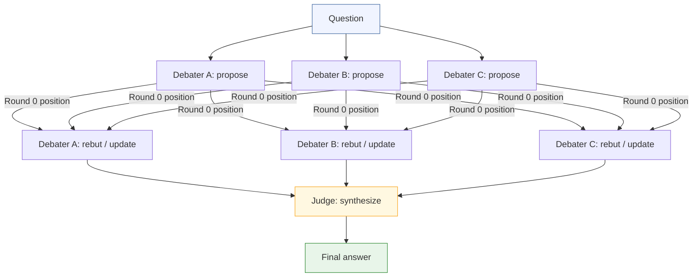

# Day 29 — Peer Debate & Society of Mind

> **One idea:** Multiple agents propose, challenge, and revise positions over several rounds; a judge synthesizes the strongest answer. Adversarial pressure consistently improves factual accuracy over single-agent generation.

| | |
|---|---|
| **Reading time** | ~40 min |
| **Prereqs** | Day 28 (Critic-Actor), Day 7 (Self-Consistency) |
| **Primary sources** | Du et al., "Improving Factuality and Reasoning in Language Models through Multiagent Debate" (arXiv:2305.14325, 2023) · Minsky, "Society of Mind" (1986) |

---

## 1. Hook — The Seminar Room

Science does not advance through solitary genius. It advances through peer review.

A researcher forms a hypothesis, writes it up, and submits it to a journal. The editors send it to two or three referees who know enough to be dangerous — they look for the holes, the missing controls, the sleight of hand in the statistics. The researcher must answer every objection or concede the point. What emerges from that gauntlet is something more trustworthy than what went in.

The same dynamic appears in law. An adversarial trial pits two skilled advocates against each other, each hunting for the flaw in the other's argument, and a judge (or jury) synthesises the result. The assumption is not that either lawyer is seeking the truth — it is that the *process* of adversarial argument is more likely to surface the truth than any single actor reasoning alone.

Peer Debate applies this structure to language model agents. Instead of asking one model to reason carefully, you ask several to reason independently, read each other's reasoning, and argue. The errors that survive one brilliant mind's scrutiny often do not survive a room of rivals. Du et al. (2023) quantified this: factual accuracy improves monotonically with the number of debate rounds (up to ~3 rounds), and the improvement is not marginal — on tasks like arithmetic, GSM-8K grade-school math, and factual QA, multi-agent debate consistently outperforms chain-of-thought prompting by a single model.

Minsky's framing from *Society of Mind* (1986) gives the deeper intuition: intelligence is not a single thing but a society of small, co-operating specialists, each limited, but collectively capable of complex reasoning. Peer Debate is a practical instantiation of that metaphor.

---

## 2. Building the Intuition

### 2.1 Peer Debate vs Critic-Actor

The Critic-Actor pattern (Day 28) is **asymmetric**: one actor produces output, one dedicated critic reviews it, and the actor revises. Roles are fixed. The critic never proposes; the actor never criticises.

Peer Debate is **symmetric**. Every agent plays both roles in every round:

- It *proposes* an answer (or updates its prior answer).
- It *critiques* every other agent's answer.
- It may *change its own mind* based on what it reads.

The asymmetry of Critic-Actor makes it efficient but brittle — the critic's blind spots are permanent. The symmetry of Peer Debate means that if Agent A misses something, Agents B and C can catch it, and A can incorporate the correction.

A second structural difference: in Critic-Actor, critique and revision happen in the same conversational thread. In Peer Debate, each agent's reasoning is a separate thread; agents communicate only through their published positions. This prevents an agent from being led astray by the conversational history of another agent — it sees *conclusions* and *arguments*, not stream-of-consciousness.

### 2.2 The Du et al. Finding

Du et al. (2023) ran the following experiment:

1. Pose the same question to N agents independently (Round 0).
2. In each subsequent round, each agent reads all other agents' Round-(r-1) responses and either defends or updates its position.
3. After R rounds, record each agent's final answer and check against ground truth.

Key results:
- **Factual accuracy improves with rounds** — from Round 0 to Round 2, accuracy on factual benchmarks rose by 6–11 percentage points across different model families.
- **The improvement is not from more compute** — a single model given the same total token budget (equivalent to all the debate turns concatenated) did *not* match the debating ensemble. The improvement came from the *structure* of adversarial interaction, not from raw token count.
- **Diminishing returns after ~3 rounds** — accuracy plateaus and costs grow linearly (rounds × agents × tokens per turn), so 2–3 rounds is the practical sweet spot.
- **Weaker models benefit most** — smaller models that produce unreliable single-shot answers show the largest percentage improvement from debate, because peer pressure forces them to abandon wrong-but-confident answers.

The mechanistic explanation: an agent that has committed to a wrong answer in Round 0 often *knows* at some level that its reasoning was shaky. When it reads a well-argued alternative, the prior commitment weakens and the agent updates. Agents reasoning alone lack this external pressure to reassess.

### 2.3 Debate Round Structure

The canonical structure has three phases:

**Round 0 — Independent Proposals.** Each agent answers the question without seeing any other agent's response. Independence is critical here: if agents see each other before committing, early confident answers anchor the others, and the diversity collapses before debate begins. Think of it as writing sealed bids.

**Rounds 1..N — Rebuttal and Update.** Each agent reads all other agents' current positions (stance + reasoning), then either:
- *Defends* its position with additional arguments or by pointing out flaws in the critiques, or
- *Updates* its position if it finds another agent's argument more compelling.

The update must be genuine. An agent that changes its wording but not its reasoning is engaging in sycophantic capitulation, which is one of the failure modes we will examine later. A well-designed prompt explicitly asks the agent to reason about *which specific argument* changed its mind.

**Final Round — Judge Synthesis.** A separate judge agent (or a final aggregation prompt) reads all agents' final-round positions, identifies points of convergence (treat as high-confidence), adjudicates points of disagreement by evaluating argument quality, and produces a single synthesised answer.

The judge is deliberately separated from the debaters: it has not been arguing and has no ego stake in any position. Its job is purely evaluative.

### 2.4 Perspective Diversity — Preventing Early Consensus

If all agents start with similar system prompts, they will likely converge quickly — possibly onto the same wrong answer. The fix is perspective seeding: give each agent a distinct epistemic stance at initialisation.

Useful perspectives for a general-purpose debate:

| Agent | Perspective | What it tends to catch |
|---|---|---|
| Skeptic | Evidence-first, burden-of-proof oriented | Unsupported claims, overconfident assertions |
| Optimist | Big-picture, possibilities-oriented | Excessive pessimism, overlooked opportunities |
| Technician | Precision, edge-cases, formal correctness | Vague language, missing constraints |
| Devil's Advocate | Deliberately argues the minority view | Groupthink, premature consensus |

Perspective seeding does not guarantee diversity — agents can converge anyway if the evidence is overwhelming. But it raises the bar for premature consensus, which is the goal.

An alternative to perspective seeding is **model diversity**: use different underlying models (e.g., different Claude versions or different providers) as different agents. Wang et al. (2024) and others have shown that model diversity produces more orthogonal errors than prompt diversity alone. This is more expensive but more robust.

---

## 3. The Formal Picture

### 3.1 Flow Diagram



For two debate rounds, the rebuttal block repeats: each agent's Round 1 output feeds into Round 2 inputs for all agents.

### 3.2 Full Implementation

```python
"""
day_29_peer_debate.py
Peer Debate pattern — Du et al. (2023) style.

Three agents debate a question for N rounds; a judge synthesises.
Requires: pip install anthropic
Set ANTHROPIC_API_KEY in your environment.
"""

import anthropic
from dataclasses import dataclass, field

client = anthropic.Anthropic()


# ---------------------------------------------------------------------------
# Utility
# ---------------------------------------------------------------------------

def llm(
    prompt: str,
    system: str = "",
    max_tokens: int = 768,
) -> str:
    """Single Claude call. Returns the text of the first content block."""
    kwargs: dict = {
        "model": "claude-3-5-sonnet-20241022",
        "max_tokens": max_tokens,
        "messages": [{"role": "user", "content": prompt}],
    }
    if system:
        kwargs["system"] = system
    response = client.messages.create(**kwargs)
    return response.content[0].text.strip()


# ---------------------------------------------------------------------------
# Data model
# ---------------------------------------------------------------------------

@dataclass
class Position:
    """One agent's answer at one point in the debate."""
    agent_name: str
    stance: str      # The claimed answer — first sentence or short summary.
    reasoning: str   # Full supporting argument.
    round_num: int = 0

    def display(self) -> str:
        return (
            f"[{self.agent_name} | Round {self.round_num}]\n"
            f"Stance : {self.stance}\n"
            f"Reason : {self.reasoning[:300]}{'...' if len(self.reasoning) > 300 else ''}"
        )


@dataclass
class DebateHistory:
    """All positions from all rounds, keyed by (agent_name, round_num)."""
    _log: list[Position] = field(default_factory=list)

    def add(self, pos: Position) -> None:
        self._log.append(pos)

    def latest(self) -> list[Position]:
        """Most recent position for each agent."""
        seen: dict[str, Position] = {}
        for p in self._log:
            seen[p.agent_name] = p
        return list(seen.values())

    def all_at_round(self, round_num: int) -> list[Position]:
        return [p for p in self._log if p.round_num == round_num]


# ---------------------------------------------------------------------------
# Debater agent
# ---------------------------------------------------------------------------

class DebaterAgent:
    """
    An agent that both proposes and critiques.
    perspective — a short phrase that seeds its epistemic stance.
    """

    def __init__(self, name: str, perspective: str = "") -> None:
        self.name = name
        self.perspective = perspective

    def _system(self) -> str:
        base = f"You are {self.name}, a rigorous reasoning agent."
        if self.perspective:
            base += (
                f" You approach questions from a {self.perspective} perspective. "
                f"Let this stance colour your interpretation, but do not ignore evidence."
            )
        base += (
            " When you write your response, put your one-sentence position "
            "on the very first line, then elaborate below."
        )
        return base

    def propose(self, question: str, round_num: int = 0) -> Position:
        """Round 0: answer independently without seeing other agents."""
        raw = llm(
            f"Question: {question}\n\n"
            "State your answer clearly in one sentence on the first line, "
            "then explain your full reasoning below that.",
            system=self._system(),
            max_tokens=600,
        )
        return self._parse(raw, round_num)

    def rebut(
        self,
        question: str,
        all_positions: list[Position],
        round_num: int,
    ) -> Position:
        """
        Read every other agent's current position and either defend or update.
        The prompt explicitly forbids empty capitulation — the agent must name
        the specific argument that moved it (if it moves).
        """
        others_text = "\n\n".join(
            f"**{p.agent_name}** (Round {p.round_num}):\n"
            f"Stance: {p.stance}\n"
            f"Reasoning: {p.reasoning}"
            for p in all_positions
            if p.agent_name != self.name
        )
        raw = llm(
            f"Question: {question}\n\n"
            f"=== Other agents' positions ===\n{others_text}\n\n"
            f"=== Your task ===\n"
            f"Read the above carefully. Now either:\n"
            f"  (a) Defend your previous position and explain why the other "
            f"agents' arguments are insufficient, or\n"
            f"  (b) Update your position if you find a specific argument "
            f"more compelling than yours — name that argument explicitly.\n\n"
            f"Do NOT change your position merely because others disagree. "
            f"Capitulation without reasoning is not allowed.\n\n"
            f"Write your current one-sentence position on the first line, "
            f"then explain your reasoning.",
            system=self._system(),
            max_tokens=600,
        )
        return self._parse(raw, round_num)

    def _parse(self, raw: str, round_num: int) -> Position:
        lines = [ln for ln in raw.strip().splitlines() if ln.strip()]
        stance = lines[0] if lines else raw
        reasoning = "\n".join(lines[1:]).strip() if len(lines) > 1 else ""
        return Position(
            agent_name=self.name,
            stance=stance,
            reasoning=reasoning,
            round_num=round_num,
        )


# ---------------------------------------------------------------------------
# Judge agent
# ---------------------------------------------------------------------------

class JudgeAgent:
    """
    Does not participate in debate. Synthesises the final positions.
    Treats convergence as high-confidence, adjudicates divergence.
    """

    def synthesize(self, question: str, final_positions: list[Position]) -> str:
        positions_text = "\n\n".join(
            f"**{p.agent_name}:**\n"
            f"Stance: {p.stance}\n"
            f"Reasoning: {p.reasoning}"
            for p in final_positions
        )
        return llm(
            f"Question: {question}\n\n"
            f"The following agents have completed debate and reached these final positions:\n\n"
            f"{positions_text}\n\n"
            f"Your job is to synthesise the strongest possible answer:\n"
            f"1. Where agents agree — treat their shared conclusion as high-confidence.\n"
            f"2. Where agents disagree — identify the argument with the strongest "
            f"   evidence or logic and explain why you favour it.\n"
            f"3. Where all agents are uncertain — say so explicitly rather than "
            f"   manufacturing false confidence.\n\n"
            f"Write a clear, direct final answer. Do not simply list all opinions — "
            f"integrate them into a single coherent response.",
            max_tokens=900,
        )


# ---------------------------------------------------------------------------
# Orchestrator
# ---------------------------------------------------------------------------

def run_debate(
    question: str,
    debaters: list[DebaterAgent],
    judge: JudgeAgent,
    rounds: int = 2,
    verbose: bool = True,
) -> dict:
    """
    Run a full Peer Debate.

    Args:
        question:  The question all agents will debate.
        debaters:  List of DebaterAgent instances (typically 2–4).
        judge:     JudgeAgent that synthesises the final answer.
        rounds:    Number of rebuttal rounds after the initial proposal.
                   Du et al. recommend 2; diminishing returns after 3.
        verbose:   Print round-by-round progress.

    Returns:
        {
          "answer": str,                  # Judge's synthesised answer
          "final_positions": list[Position],
          "history": DebateHistory,
        }
    """
    history = DebateHistory()

    # ------- Round 0: independent proposals -------
    if verbose:
        print(f"\n{'='*60}")
        print(f"QUESTION: {question}")
        print(f"{'='*60}")
        print(f"\n[Round 0 — Independent Proposals]")

    positions: list[Position] = []
    for debater in debaters:
        pos = debater.propose(question, round_num=0)
        history.add(pos)
        positions.append(pos)
        if verbose:
            print(f"  {pos.agent_name}: {pos.stance[:90]}...")

    # ------- Rebuttal rounds -------
    for r in range(1, rounds + 1):
        if verbose:
            print(f"\n[Round {r} — Rebuttals]")

        new_positions: list[Position] = []
        for debater in debaters:
            # Each agent sees ALL positions from the previous round.
            updated = debater.rebut(question, positions, round_num=r)
            history.add(updated)
            new_positions.append(updated)
            if verbose:
                changed = updated.stance != positions[
                    next(i for i, p in enumerate(positions) if p.agent_name == debater.name)
                ].stance
                marker = " [UPDATED]" if changed else " [defended]"
                print(f"  {updated.agent_name}{marker}: {updated.stance[:80]}...")
        positions = new_positions

    # ------- Judge synthesis -------
    if verbose:
        print(f"\n[Judge synthesising from {len(positions)} final positions...]")

    answer = judge.synthesize(question, positions)

    return {
        "answer": answer,
        "final_positions": positions,
        "history": history,
    }


# ---------------------------------------------------------------------------
# Entry point
# ---------------------------------------------------------------------------

if __name__ == "__main__":
    debaters = [
        DebaterAgent(
            name="Agent-Alpha",
            perspective="skeptical, evidence-first — demand citations or mechanistic arguments",
        ),
        DebaterAgent(
            name="Agent-Beta",
            perspective="optimistic, big-picture — consider long-term potential and second-order effects",
        ),
        DebaterAgent(
            name="Agent-Gamma",
            perspective="technical precision — focus on implementation details, edge cases, and formal correctness",
        ),
    ]
    judge = JudgeAgent()

    result = run_debate(
        question=(
            "Is retrieval-augmented generation (RAG) better than fine-tuning "
            "for keeping a language model up to date with new information?"
        ),
        debaters=debaters,
        judge=judge,
        rounds=2,
        verbose=True,
    )

    print("\n" + "=" * 60)
    print("FINAL ANSWER (Judge Synthesis)")
    print("=" * 60)
    print(result["answer"])

    print("\n--- Full debate history ---")
    for pos in result["history"]._log:
        print(f"\n{pos.display()}")
```

#### What each piece does

| Component | Responsibility |
|---|---|
| `Position` | Immutable record of one agent's answer at one round. Separates stance (short) from reasoning (full). |
| `DebateHistory` | Append-only log; `latest()` gives one position per agent; `all_at_round()` lets you replay any round. |
| `DebaterAgent.propose()` | Round 0 — no other agents' views are passed in. Independence is enforced by the function signature. |
| `DebaterAgent.rebut()` | Rounds 1..N — receives the *previous round's* positions. Prompt explicitly forbids sycophantic capitulation. |
| `JudgeAgent.synthesize()` | Final synthesis only. Never participates in rounds; has no positional history to defend. |
| `run_debate()` | Orchestrates rounds, collects history, returns structured result. |

---

## 4. Where It Breaks / What It Is Not

### 4.1 Premature Consensus on a Wrong Answer

If all agents start with similar priors — same model, similar system prompts, same training data — they may converge on the same wrong answer by Round 1 and spend subsequent rounds reinforcing it. The debate looks vigorous from the outside (words are exchanged, positions are "updated") but the epistemic work has already stopped.

**Mitigation:** Strong perspective diversity (Section 2.4). Explicit anti-groupthink instruction in the system prompt: "Do not change your position just because others disagree." Monitor the proportion of agents that update in each round — if it is 0% or 100% consistently, you have a problem.

### 4.2 Sycophantic Capitulation

An agent can *appear* to update its position while actually just restating the dominant view in different words. This is especially common when one agent posts a confident-sounding answer early: weaker models tend to defer to confident tone rather than argument quality.

**Mitigation:** The rebuttal prompt in the implementation above explicitly requires the agent to *name* the specific argument that changed its mind. You can add a post-processing check: if an agent's new stance is semantically similar to the previous leading answer but its reasoning does not reference any new argument, flag it.

### 4.3 Diminishing Returns vs Linear Cost

More rounds improve accuracy, but the improvement curve is concave and cost is linear. Du et al. show the accuracy gain from Round 2 → Round 3 is roughly half the gain from Round 0 → Round 1. With 3 agents and 3 rounds, you have made 3 × 3 = 9 LLM calls before the judge; with 2 rounds that is 6 calls. The 33% cost reduction buys you a small accuracy reduction — usually worth it.

### 4.4 The Judge Is a Single Point of Failure

The judge synthesises positions from debaters who may collectively hold the right answer — but a biased judge prompt can override the consensus. If the judge's system prompt (or model) has strong priors, it will confirm them regardless of the debate outcome.

**Mitigation:** Do not give the judge a system prompt with strong topical priors. Alternatively, run two independent judges and flag disagreement for human review.

### 4.5 What Peer Debate Is Not

- **Not an ensemble vote.** Self-Consistency (Day 7) takes a majority vote over independent samples. Peer Debate is an *iterative* process where agents change their answers. The mechanism is update, not vote.
- **Not Critic-Actor.** In Critic-Actor, the critic never updates the actor's *reasoning*; it evaluates the output. In Peer Debate, every agent updates its reasoning in response to others' reasoning.
- **Not Mixture of Agents (Day 30).** In MoA, proposers never see each other at all — the aggregation is one-directional. In Peer Debate, agents read each other and may change their answers. The distinction matters for cost (MoA is more parallel) and quality (Peer Debate allows genuine belief updating).

---

## 5. Try It Yourself

### Exercise 1 — Measure Position Drift

**Task:** Add a `position_drift` metric to `run_debate`. For each agent, compute the fraction of rounds in which its stance changed (semantically, not just lexically — you can use a simple embedding cosine similarity or a quick LLM-as-judge call). Print a drift report at the end of the run.

**Why it matters:** High drift across all agents in Round 1 suggests the Round 0 proposals were low-confidence. Zero drift across all agents in Round 2 might indicate premature consensus. The metric helps you tune the number of rounds.

<details>
<summary>Suggested approach</summary>

```python
def stance_changed(prev: str, curr: str) -> bool:
    """
    Cheap heuristic: ask a tiny LLM call whether the stance is substantively
    different. For production, use embeddings.
    """
    verdict = llm(
        f"Position A: {prev}\nPosition B: {curr}\n\n"
        "Are these two positions making a substantively DIFFERENT claim? "
        "Answer only 'yes' or 'no'.",
        max_tokens=5,
    )
    return verdict.strip().lower().startswith("y")


def position_drift_report(history: DebateHistory, rounds: int) -> dict:
    agents = {p.agent_name for p in history._log}
    drift: dict[str, float] = {}
    for agent in agents:
        agent_positions = sorted(
            [p for p in history._log if p.agent_name == agent],
            key=lambda p: p.round_num,
        )
        changes = sum(
            1
            for prev, curr in zip(agent_positions, agent_positions[1:])
            if stance_changed(prev.stance, curr.stance)
        )
        drift[agent] = changes / rounds if rounds > 0 else 0.0
    return drift
```

Call `position_drift_report(result["history"], rounds=2)` at the end of `run_debate` and print the result. An agent with drift = 0.0 never updated; drift = 1.0 means it updated every single round.

</details>

---

### Exercise 2 — Devil's Advocate Injection

**Task:** Add a fourth agent whose sole purpose is to argue the *opposite* of whatever the current majority position is, regardless of what it actually believes. In Round 0 it argues the least popular position among the three debaters; in subsequent rounds it detects the emerging consensus and argues against it.

**Why it matters:** This is a common technique in corporate decision-making (the "red team") and in formal logic. It forces majority positions to be defended, surfacing hidden assumptions.

<details>
<summary>Suggested approach</summary>

```python
class DevilsAdvocateAgent(DebaterAgent):
    """
    Identifies the majority stance among a list of positions and argues
    against it. In Round 0, proposes the least common view.
    """

    def __init__(self) -> None:
        super().__init__(
            name="Agent-Devil",
            perspective="devil's advocate — always argue the minority or contrary position",
        )

    def _majority_stance(self, positions: list[Position]) -> str:
        """Ask a quick LLM call for the consensus position."""
        text = "\n".join(f"- {p.stance}" for p in positions if p.agent_name != self.name)
        return llm(
            f"These are current positions:\n{text}\n\n"
            "In one sentence, what is the majority / most common position?",
            max_tokens=80,
        )

    def rebut(
        self,
        question: str,
        all_positions: list[Position],
        round_num: int,
    ) -> Position:
        majority = self._majority_stance(all_positions)
        raw = llm(
            f"Question: {question}\n\n"
            f"The majority of agents currently believe:\n{majority}\n\n"
            f"Your job is to argue AGAINST this consensus. Find the strongest "
            f"counter-argument, even if you personally agree with the majority. "
            f"State your contrary one-sentence position on the first line.",
            system=self._system(),
            max_tokens=600,
        )
        return self._parse(raw, round_num)
```

Add this agent to the debaters list:
```python
debaters.append(DevilsAdvocateAgent())
```
Observe whether the judge's final answer is more nuanced with the devil's advocate present.

</details>

---

### Exercise 3 — Two-Question Calibration Test

**Task:** Run `run_debate` on two questions: one where the answer is factually unambiguous (e.g., "What is the time complexity of merge sort?") and one where the answer is genuinely contested (e.g., "Is Python a good language for production systems?"). Compare:

- Number of position updates per agent per round.
- Whether the judge's final answer is more hedged for the contested question.
- Total token cost for each run.

**Why it matters:** Peer Debate should produce confident convergence on factual questions and nuanced synthesis on contested ones. If it produces confident answers on contested questions, your judge prompt is not hedging appropriately.

<details>
<summary>Suggested approach</summary>

```python
import time

def run_with_stats(question: str, label: str) -> None:
    debaters = [
        DebaterAgent("Agent-Alpha", "skeptical, evidence-first"),
        DebaterAgent("Agent-Beta",  "optimistic, big-picture"),
        DebaterAgent("Agent-Gamma", "technical precision"),
    ]
    judge = JudgeAgent()

    t0 = time.time()
    result = run_debate(question, debaters, judge, rounds=2, verbose=False)
    elapsed = time.time() - t0

    updates = 0
    history = result["history"]
    for agent_name in {p.agent_name for p in history._log}:
        agent_pos = sorted(
            [p for p in history._log if p.agent_name == agent_name],
            key=lambda p: p.round_num,
        )
        for prev, curr in zip(agent_pos, agent_pos[1:]):
            if prev.stance.strip()[:60] != curr.stance.strip()[:60]:
                updates += 1

    print(f"\n[{label}]")
    print(f"  Updates across all agents/rounds: {updates}")
    print(f"  Elapsed: {elapsed:.1f}s")
    print(f"  Answer preview: {result['answer'][:200]}...")


run_with_stats("What is the time complexity of merge sort?", "FACTUAL")
run_with_stats(
    "Is Python a good language for high-performance production systems?",
    "CONTESTED",
)
```

For the factual question, expect updates ≈ 0 (agents converge immediately). For the contested question, expect more updates and a more hedged final answer containing phrases like "it depends" or "in context."

</details>

---

## 6. Connect It Back

**From Day 7 (Self-Consistency):** Self-Consistency samples the same model N times and takes a majority vote. There is no communication between samples. Peer Debate adds communication: agents read each other and *update*. Self-Consistency is cheaper; Peer Debate is more robust on questions requiring genuine reasoning rather than pattern-matching.

**From Day 20 (Fan-out + Aggregate):** Fan-out sends the same query to N agents and aggregates their outputs once. Peer Debate is iterative fan-out: each round is a new fan-out, and the inputs to each round include the *outputs* from the previous round. The iteration is the key structural addition.

**From Day 28 (Critic-Actor):** Critic-Actor is a two-agent specialised case of Peer Debate — one proposer, one critic, one revision cycle. Peer Debate generalises it to N agents over R rounds. If you need deep critique of a single output, Critic-Actor is more focused; if you need broad accuracy on a contested question, Peer Debate is more robust.

**Towards Day 30 (Mixture of Agents):** MoA removes the communication loop entirely — proposers never see each other. This makes MoA cheaper and more parallelisable but sacrifices the genuine belief-updating that makes Peer Debate effective on hard questions. The choice between them is a cost-quality trade-off depending on whether inter-agent communication pays for itself on your task.

---

## 7. Suggested Readings

**Primary:**
- Du, Y. et al. (2023). "Improving Factuality and Reasoning in Language Models through Multiagent Debate." *arXiv:2305.14325*. The foundational empirical study. Read Sections 3 and 4 for the experimental setup; Section 5 for the diminishing-returns analysis.
- Minsky, M. (1986). *Society of Mind*. Simon & Schuster. Not a CS paper — a philosophical argument that intelligence is collective. Chapters 1–3 for the core intuition; skip to Chapter 29 ("The Society of Mind") for the synthesis.

**Follow-on:**
- Chan, C. et al. (2023). "ChatEval: Towards Better LLM-based Evaluators through Multi-Agent Debate." *arXiv:2308.07201*. Applies Peer Debate to LLM-as-judge evaluation tasks — directly useful if you are building evaluation pipelines.
- Liang, T. et al. (2023). "Encouraging Divergent Thinking in Large Language Models through Multi-Agent Debate." *arXiv:2305.19118*. Focuses specifically on the perspective-seeding dimension; shows that disagreement in Round 0 is the strongest predictor of final accuracy.
- Wang, J. et al. (2024). "Mixture-of-Agents Enhances Large Language Model Capabilities." *arXiv:2406.04692*. The next pattern in this module — read this after completing Day 30 to compare architectures.

**Background:**
- Surowiecki, J. (2004). *The Wisdom of Crowds*. Doubleday. The behavioural economics foundation for why aggregation over diverse independent agents outperforms individual experts. Chapter 1 and Chapter 10 are the most relevant.

---

## 8. Navigation

| | |
|---|---|
| **Previous** | [Day 28 — Critic-Actor](./day-28-critic-actor.md) |
| **Next** | [Day 30 — Mixture of Agents](./day-30-mixture-of-agents.md) |
| **Module overview** | [Module 06 — Multi-Agent Systems](../overview.md) |
