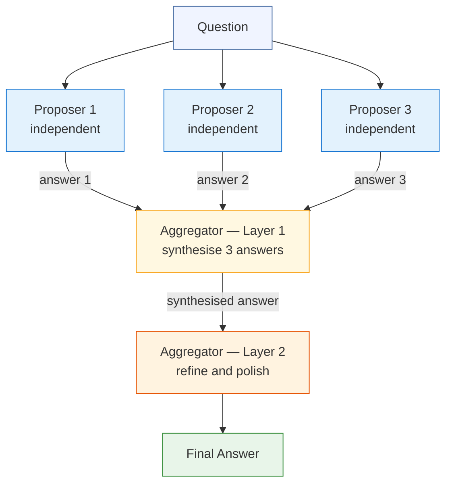

# Day 30 — Mixture of Agents

> **One idea:** Independent proposer agents generate answers in parallel; aggregator layers synthesize them into progressively better outputs. Even weaker models as proposers improve the final answer — the benefit is diversity of errors, not individual strength.

| | |
|---|---|
| **Reading time** | ~40 min |
| **Prereqs** | Day 29 (Peer Debate), Day 7 (Self-Consistency), Day 20 (Fan-out + Aggregate) |
| **Primary source** | Wang et al., "Mixture-of-Agents Enhances Large Language Model Capabilities" (arXiv:2406.04692, 2024) |

---

## 1. Hook — The Wisdom of Crowds

In 1906, Francis Galton visited a county fair in Plymouth. Eight hundred people were competing to guess the weight of an ox. Galton collected all the tickets, expecting to use them to demonstrate the public's ignorance — the average citizen, he believed, knew nothing about livestock.

He was wrong. The median guess was 1,207 pounds. The ox weighed 1,198 pounds. The crowd was more accurate than any individual expert in the room, including the professional livestock judges.

This is the *wisdom of crowds* effect, and it rests on a precise statistical condition: when individual errors are *uncorrelated*, they cancel out in the aggregate. No single person needs to be right. The crowd just needs to be wrong *in different directions*.

Mixture of Agents (MoA) operationalises this principle for language models. Instead of asking one model to reason carefully about a question, you ask several models to reason independently — ensuring uncorrelated errors — and then you pass their outputs to an aggregator whose job is to find the signal in the noise. Wang et al. (2024) showed that aggregating outputs from multiple weaker LLMs can outperform a single state-of-the-art LLM on a wide range of benchmarks. The aggregator is not smarter than the best proposer; it is just exposed to more diverse perspectives, and that diversity is the source of the gain.

The key word is *independently*. The moment proposers see each other's outputs, their errors become correlated — the crowd effect collapses. MoA enforces strict independence between proposers; communication only flows upward, from proposers to aggregators.

---

## 2. Building the Intuition

### 2.1 Two Roles — Proposers and Aggregators

MoA has exactly two types of agent, and the distinction between them is structural, not just about capability:

**Proposers** answer the question without seeing any other proposer's output. They run in parallel (or can be run in parallel — the independence is what matters, not the timing). Each proposer produces a complete answer. There is no interaction between proposers at any point.

**Aggregators** receive *all* the proposer outputs (or the previous layer's aggregator outputs) and synthesise them into a single, better answer. An aggregator does not generate a new independent answer — it reads, evaluates, reconciles, and integrates. Its job is editorial, not generative.

This role separation is strict. If a "proposer" peeks at another proposer's output before producing its own, it has become an aggregator operating on partial information — a much worse design.

The proposers provide breadth; the aggregator provides synthesis. Neither is sufficient alone:
- Proposers alone give you N raw answers with no synthesis — you have a Self-Consistency majority-vote problem.
- Aggregators alone (no proposers, just one generation) gives you a standard single-agent response.
- Together, they produce something better than either.

### 2.2 The Key Finding — Diversity Beats Strength

Wang et al. (2024) ran a large empirical study on benchmarks including AlpacaEval 2.0, MT-Bench, and FLASK. The central finding:

> A three-proposer MoA using models weaker than GPT-4 as proposers, combined with GPT-4 as aggregator, outperforms GPT-4 used as a single agent on most benchmarks tested.

This is counterintuitive. Replacing one strong model with three weaker models and an aggregator — and getting *better* results.

The explanation is *collaborative advantage through diversity*:

1. Each proposer has its own strengths and weaknesses. Proposer A might reason well about numerical comparisons but poorly about temporal reasoning. Proposer B might be the reverse.
2. When the aggregator sees both answers, it can draw on A's numerical reasoning and B's temporal reasoning simultaneously — a combination no single model could access.
3. The aggregator's job is much easier than generating the answer from scratch: it is more like editing a first draft using three alternative drafts as reference.

The practical implication: when building a MoA system, optimise for *diversity* of proposers, not for using the strongest possible proposer. Different model families, different system prompts, different temperatures — any axis of diversity that produces uncorrelated errors is valuable.

### 2.3 Layered Architecture

A single proposer → single aggregator is the minimal MoA. Wang et al. showed that stacking aggregation layers further improves quality:

```
Layer 0:  Proposer 1   Proposer 2   Proposer 3
          (independent, parallel)
                   ↓       ↓       ↓
Layer 1:       Aggregator (reads all 3 Layer-0 outputs)
                         ↓
Layer 2:       Aggregator (reads Layer-1 output)
                         ↓
            Final Answer
```

Why does a second aggregation layer help? The Layer-1 aggregator synthesises the *content* of the proposers but may introduce its own organisational choices, framing, or emphasis. The Layer-2 aggregator reads a single, already-synthesised document and can improve its structure, catch remaining inconsistencies, and strengthen the argument flow. Think of it as a two-pass editorial process: first structural, then polish.

Each additional layer adds one LLM call. The marginal gain per layer drops sharply after Layer 2 for most tasks — the practical optimum is 2 aggregation layers for general-purpose QA.

### 2.4 MoA vs Self-Consistency vs Peer Debate

These three patterns all aggregate multiple LLM outputs, but they differ in mechanism, cost, and best use case:

| Dimension | Self-Consistency (Day 7) | Peer Debate (Day 29) | Mixture of Agents (Day 30) |
|---|---|---|---|
| Communication | None (samples are independent) | Bidirectional (agents read each other, update) | Unidirectional (proposers → aggregators) |
| Aggregation mechanism | Majority vote (mathematical) | Judge synthesis (LLM call) after N rounds of debate | Layered LLM synthesis |
| Agent roles | Identical (same model, same prompt) | Symmetric (all agents both propose and rebut) | Asymmetric (proposers vs aggregators) |
| Belief updating | No | Yes — agents change their answers | No — proposers never revise |
| Parallelism | Full (all samples independent) | Partial (within-round parallel, cross-round sequential) | Full at proposer layer; sequential between layers |
| Best for | Tasks with a single correct answer; pattern-matching | Contested factual questions; finding reasoning flaws | Questions benefiting from diverse perspectives; broad synthesis tasks |
| Main cost driver | N samples × tokens per sample | N agents × R rounds × tokens per turn | N proposers + L aggregator layers |

The key design question: *Do I need agents to update their beliefs based on each other?*

- Yes → Peer Debate.
- No → MoA (cheaper and more parallelisable).

If you also need a single "correct" answer via voting rather than synthesis, Self-Consistency is the cheapest option.

---

## 3. The Formal Picture

### 3.1 Flow Diagram — 3 Proposers, 2 Aggregator Layers



Note that the three proposers have no arrows between them — this is the defining structural property of MoA.

### 3.2 Full Implementation

```python
"""
day_30_mixture_of_agents.py
Mixture-of-Agents pattern — Wang et al. (2024) style.

N independent proposers → L aggregator layers → final answer.
Requires: pip install anthropic
Set ANTHROPIC_API_KEY in your environment.
"""

import asyncio
import anthropic
from dataclasses import dataclass, field

client = anthropic.Anthropic()


# ---------------------------------------------------------------------------
# Utility
# ---------------------------------------------------------------------------

def llm(
    prompt: str,
    system: str = "",
    max_tokens: int = 768,
) -> str:
    """Synchronous single Claude call."""
    kwargs: dict = {
        "model": "claude-3-5-sonnet-20241022",
        "max_tokens": max_tokens,
        "messages": [{"role": "user", "content": prompt}],
    }
    if system:
        kwargs["system"] = system
    response = client.messages.create(**kwargs)
    return response.content[0].text.strip()


async def llm_async(
    prompt: str,
    system: str = "",
    max_tokens: int = 768,
) -> str:
    """
    Async wrapper — runs the synchronous SDK call in a thread pool so we can
    fire multiple proposers concurrently with asyncio.gather.
    The Anthropic Python SDK does not expose a native async client in all
    versions; this pattern works with any version.
    """
    loop = asyncio.get_running_loop()
    return await loop.run_in_executor(
        None,  # uses the default ThreadPoolExecutor
        lambda: llm(prompt, system=system, max_tokens=max_tokens),
    )


# ---------------------------------------------------------------------------
# Data model
# ---------------------------------------------------------------------------

@dataclass
class ProposerOutput:
    """One proposer's answer."""
    proposer_id: int
    answer: str

    def display(self) -> str:
        preview = self.answer[:200] + ("..." if len(self.answer) > 200 else "")
        return f"[Proposer {self.proposer_id}]\n{preview}"


@dataclass
class AggregatorOutput:
    """One aggregator layer's synthesised answer."""
    layer_num: int
    answer: str

    def display(self) -> str:
        preview = self.answer[:200] + ("..." if len(self.answer) > 200 else "")
        return f"[Aggregator Layer {self.layer_num}]\n{preview}"


@dataclass
class MoAResult:
    """Full pipeline result."""
    final_answer: str
    proposer_outputs: list[ProposerOutput]
    aggregator_outputs: list[AggregatorOutput]

    @property
    def num_proposers(self) -> int:
        return len(self.proposer_outputs)

    @property
    def num_layers(self) -> int:
        return len(self.aggregator_outputs)


# ---------------------------------------------------------------------------
# Proposer
# ---------------------------------------------------------------------------

def moa_proposer(question: str, agent_id: int, perspective: str = "") -> ProposerOutput:
    """
    Generate one independent answer.
    Proposers NEVER see each other's output — enforced by function signature.

    Args:
        question:    The question to answer.
        agent_id:    Numeric identifier (used in the system prompt).
        perspective: Optional epistemic lens (e.g., "focus on performance trade-offs").
                     Increases output diversity without requiring different models.
    """
    system = f"You are expert agent #{agent_id}. Reason independently and be specific."
    if perspective:
        system += f" Your focus: {perspective}."

    answer = llm(
        f"Answer this question carefully and thoroughly:\n\n{question}",
        system=system,
        max_tokens=512,
    )
    return ProposerOutput(proposer_id=agent_id, answer=answer)


async def moa_proposer_async(
    question: str,
    agent_id: int,
    perspective: str = "",
) -> ProposerOutput:
    """Async version — use with asyncio.gather for true parallel execution."""
    system = f"You are expert agent #{agent_id}. Reason independently and be specific."
    if perspective:
        system += f" Your focus: {perspective}."

    answer = await llm_async(
        f"Answer this question carefully and thoroughly:\n\n{question}",
        system=system,
        max_tokens=512,
    )
    return ProposerOutput(proposer_id=agent_id, answer=answer)


# ---------------------------------------------------------------------------
# Aggregator
# ---------------------------------------------------------------------------

def moa_aggregator(
    question: str,
    inputs: list[str],
    layer_num: int,
) -> AggregatorOutput:
    """
    Synthesise multiple inputs into a superior answer.

    The aggregator prompt follows three explicit steps (Wang et al. appendix):
    1. Identify high-confidence claims (agreed by multiple inputs).
    2. Resolve disagreements by argument quality, not vote count.
    3. Incorporate complementary details from different inputs.

    Args:
        question:  Original question (kept in context for relevance grounding).
        inputs:    List of text answers from the previous layer.
        layer_num: Layer number (informational; also modulates the prompt slightly
                   — Layer 1 focuses on content synthesis, Layer 2 on polish).
    """
    inputs_text = "\n\n---\n\n".join(
        f"Input {i + 1}:\n{inp}" for i, inp in enumerate(inputs)
    )

    if layer_num == 1:
        task_instruction = (
            "Synthesise the best possible answer from the inputs above by:\n"
            "1. Identifying claims that multiple inputs agree on — treat these as "
            "   high-confidence and include them.\n"
            "2. Where inputs disagree, choose the position with the strongest argument "
            "   or the most specific evidence. Explain briefly why you prefer it.\n"
            "3. Incorporating complementary details from different inputs that do not "
            "   conflict — add them to enrich the answer.\n"
            "4. Omitting content that appears in only one input and is not well-supported.\n\n"
            "Return a single comprehensive answer — it should be better than any "
            "individual input, not merely a concatenation."
        )
    else:
        # Later layers: the input is already synthesised; focus on quality.
        task_instruction = (
            "You are refining an already-synthesised answer. Your tasks:\n"
            "1. Improve clarity and structure — reorganise if it aids understanding.\n"
            "2. Eliminate any remaining redundancy or contradiction.\n"
            "3. Strengthen hedges where the input is overconfident.\n"
            "4. Fill any obvious gaps that the synthesis missed.\n\n"
            "Return the refined answer. Do not simply restate the input — make it "
            "measurably better."
        )

    answer = llm(
        f"Question: {question}\n\n"
        f"=== Inputs from previous layer ===\n\n{inputs_text}\n\n"
        f"=== Your task ===\n{task_instruction}",
        max_tokens=1024,
    )
    return AggregatorOutput(layer_num=layer_num, answer=answer)


# ---------------------------------------------------------------------------
# Orchestrators
# ---------------------------------------------------------------------------

def run_moa(
    question: str,
    num_proposers: int = 3,
    aggregator_layers: int = 2,
    perspectives: list[str] | None = None,
    verbose: bool = True,
) -> MoAResult:
    """
    Synchronous Mixture-of-Agents pipeline.

    Layer 0:           num_proposers independent proposers (sequential here).
    Layers 1..L:       each aggregates all previous-layer outputs into one answer.

    Args:
        question:          The question to answer.
        num_proposers:     Number of independent proposers (3–5 is typical).
        aggregator_layers: Number of aggregation passes (1–3; 2 is the sweet spot).
        perspectives:      Optional list of focus strings for each proposer.
                           Length must equal num_proposers if provided.
        verbose:           Print layer-by-layer progress.

    Returns:
        MoAResult with final_answer, proposer_outputs, aggregator_outputs.
    """
    if perspectives and len(perspectives) != num_proposers:
        raise ValueError(
            f"perspectives length ({len(perspectives)}) must equal "
            f"num_proposers ({num_proposers})"
        )

    proposer_outputs: list[ProposerOutput] = []
    aggregator_outputs: list[AggregatorOutput] = []

    # ---- Layer 0: proposers ----
    if verbose:
        print(f"\n{'='*60}")
        print(f"QUESTION: {question}")
        print(f"{'='*60}")
        print(f"\n[Layer 0] Generating {num_proposers} independent proposals...")

    for i in range(num_proposers):
        perspective = perspectives[i] if perspectives else ""
        out = moa_proposer(question, agent_id=i + 1, perspective=perspective)
        proposer_outputs.append(out)
        if verbose:
            print(f"  Proposer {i + 1}: {out.answer[:80]}...")

    # ---- Aggregation layers ----
    current_inputs = [p.answer for p in proposer_outputs]

    for layer in range(1, aggregator_layers + 1):
        if verbose:
            print(f"\n[Layer {layer}] Aggregating {len(current_inputs)} input(s)...")

        if len(current_inputs) == 1 and layer > 1:
            # Already one answer; additional layers still refine.
            pass

        agg_out = moa_aggregator(question, current_inputs, layer_num=layer)
        aggregator_outputs.append(agg_out)
        current_inputs = [agg_out.answer]  # Each layer produces exactly one output.

        if verbose:
            print(f"  Layer {layer} output: {agg_out.answer[:80]}...")

    return MoAResult(
        final_answer=current_inputs[0],
        proposer_outputs=proposer_outputs,
        aggregator_outputs=aggregator_outputs,
    )


async def run_moa_async(
    question: str,
    num_proposers: int = 3,
    aggregator_layers: int = 2,
    perspectives: list[str] | None = None,
    verbose: bool = True,
) -> MoAResult:
    """
    Async Mixture-of-Agents pipeline.

    All proposers fire concurrently via asyncio.gather; aggregation layers
    remain sequential (each layer depends on the previous layer's output).
    Latency is bounded by max(proposer latencies) rather than their sum.

    Usage:
        result = asyncio.run(run_moa_async(question="...", num_proposers=4))
    """
    if perspectives and len(perspectives) != num_proposers:
        raise ValueError(
            f"perspectives length ({len(perspectives)}) must equal "
            f"num_proposers ({num_proposers})"
        )

    proposer_outputs: list[ProposerOutput] = []
    aggregator_outputs: list[AggregatorOutput] = []

    # ---- Layer 0: all proposers fire concurrently ----
    if verbose:
        print(f"\n[Layer 0] Firing {num_proposers} proposers concurrently...")

    tasks = [
        moa_proposer_async(
            question,
            agent_id=i + 1,
            perspective=perspectives[i] if perspectives else "",
        )
        for i in range(num_proposers)
    ]
    # asyncio.gather preserves order — proposer_outputs[i] corresponds to agent i+1.
    proposer_outputs = list(await asyncio.gather(*tasks))

    if verbose:
        for out in proposer_outputs:
            print(f"  Proposer {out.proposer_id}: {out.answer[:70]}...")

    # ---- Aggregation layers (sequential — each depends on previous) ----
    current_inputs = [p.answer for p in proposer_outputs]

    for layer in range(1, aggregator_layers + 1):
        if verbose:
            print(f"\n[Layer {layer}] Aggregating {len(current_inputs)} input(s)...")

        # Aggregation is a single call per layer — no async benefit here.
        agg_out = await asyncio.get_running_loop().run_in_executor(
            None,
            lambda l=layer, ci=current_inputs: moa_aggregator(question, ci, layer_num=l),
        )
        aggregator_outputs.append(agg_out)
        current_inputs = [agg_out.answer]

        if verbose:
            print(f"  Layer {layer} output: {agg_out.answer[:70]}...")

    return MoAResult(
        final_answer=current_inputs[0],
        proposer_outputs=proposer_outputs,
        aggregator_outputs=aggregator_outputs,
    )


# ---------------------------------------------------------------------------
# Entry point
# ---------------------------------------------------------------------------

if __name__ == "__main__":
    # --- Synchronous run ---
    result = run_moa(
        question=(
            "What are the most important trade-offs to consider when choosing between "
            "a SQL database and a NoSQL database for a new application?"
        ),
        num_proposers=3,
        aggregator_layers=2,
        perspectives=[
            "focus on operational complexity and maintenance burden",
            "focus on performance characteristics and scalability limits",
            "focus on data modelling flexibility and query expressiveness",
        ],
        verbose=True,
    )

    print("\n" + "=" * 60)
    print("MoA FINAL ANSWER")
    print("=" * 60)
    print(result.final_answer)
    print(
        f"\n({result.num_proposers} proposers, "
        f"{result.num_layers} aggregator layer(s))"
    )

    # --- Async run (uncomment to use) ---
    # async_result = asyncio.run(
    #     run_moa_async(
    #         question=(
    #             "What are the most important trade-offs to consider when choosing "
    #             "between a SQL database and a NoSQL database for a new application?"
    #         ),
    #         num_proposers=3,
    #         aggregator_layers=2,
    #         verbose=True,
    #     )
    # )
    # print("\n=== ASYNC MoA FINAL ANSWER ===")
    # print(async_result.final_answer)
```

#### What each piece does

| Component | Responsibility |
|---|---|
| `ProposerOutput` | Immutable record of one proposer's answer. Agent ID is stored so you can trace which proposer contributed what. |
| `AggregatorOutput` | Immutable record of one aggregation layer's output. Layer number distinguishes structural synthesis (Layer 1) from polish (Layer 2+). |
| `MoAResult` | Complete pipeline result — access `final_answer` for the output, `proposer_outputs` for provenance, `aggregator_outputs` to see how the synthesis evolved. |
| `moa_proposer()` | Single proposer call. Enforces independence by taking no `all_positions` argument — a proposer physically cannot see other proposers. |
| `moa_aggregator()` | Layer-aware aggregation: Layer 1 uses a content-synthesis prompt; Layer 2+ uses a refinement prompt. This matches the editorial metaphor — first draft, then polish. |
| `run_moa()` | Synchronous orchestrator. Sequential proposers are fine for development; use `run_moa_async` in production. |
| `run_moa_async()` | Async orchestrator. All proposers fire concurrently via `asyncio.gather`; aggregation layers remain sequential (unavoidable data dependency). Latency = max(proposer latencies) + sum(aggregator latencies). |
| `llm_async()` | Thread-pool wrapper that makes the synchronous Anthropic SDK behave like an async client. Works with any SDK version. |

#### The async timing math

With 3 proposers each taking ~3 seconds, and 2 aggregator layers each taking ~4 seconds:

- **Synchronous:** 3×3 + 2×4 = 17 seconds
- **Async:** max(3,3,3) + 2×4 = 3 + 8 = **11 seconds** (35% faster)

For 5 proposers the gain is larger: 5×3 + 8 = 23s synchronous vs 3 + 8 = 11s async.

---

## 4. Where It Breaks / What It Is Not

### 4.1 Cost Grows Quadratically with Proposers

Total cost = (num_proposers × proposer_tokens) + (aggregator_layers × aggregator_tokens).

Aggregator prompts are expensive because they include all proposer outputs. With 5 proposers producing 400 tokens each and an aggregator that reads all 5 (2,000 input tokens) plus generates 800 output tokens:

- 5 proposers × 400 output tokens = 2,000 proposer output tokens
- 1 aggregator × (2,000 input + 800 output) tokens = 2,800 aggregator tokens
- Total: 4,800 tokens for one question

Compare to a single-agent answer: maybe 800 tokens. You are spending 6× the tokens. Whether this is worth it depends entirely on whether the quality improvement justifies the cost for your task.

**Mitigation:** Use smaller models as proposers (Wang et al.'s key finding is that diversity matters more than individual strength), limit proposer `max_tokens`, and cap aggregator_layers at 2.

### 4.2 Correlated Proposer Errors Defeat the Architecture

The wisdom-of-crowds effect requires *uncorrelated* errors. If all proposers use the same model with the same system prompt, they will produce correlated outputs — the same wrong claims appear in all three, the aggregator treats the repetition as high-confidence, and the final answer confidently states a falsehood.

**Example:** All three proposers confidently state that Python's GIL was removed in Python 3.12 (it was not removed in 3.12; "nogil" was an experimental option). The aggregator sees three consistent claims, marks it high-confidence, and asserts it as fact.

**Mitigation:**
1. Perspective seeding (different system prompts with different analytical foci).
2. Different model families or versions as proposers.
3. Different temperature settings (higher temperature = more diverse outputs, at the cost of occasional incoherence).

You can measure diversity by computing pairwise semantic similarity between proposer outputs — if the average similarity is above ~0.9, you likely have a correlation problem.

### 4.3 The Aggregator Can Overweight Confident-Sounding Proposers

The aggregator prompt in the implementation above instructs it to prefer "strongest argument" over vote count. In practice, LLMs performing aggregation tend to overweight *confident-sounding* proposers, even if the confidence is stylistic rather than substantive.

**Example:** Proposer 1 says "PostgreSQL is the right choice for this workload because of its MVCC implementation and support for complex joins at scale." Proposer 2 says "well, it kind of depends on a lot of factors, and there are pros and cons on both sides." The aggregator will typically follow Proposer 1, even if Proposer 2's hedged answer is actually more epistemically correct.

**Mitigation:** Explicitly instruct the aggregator to look for *evidence quality* rather than rhetorical confidence: "Prefer specific, falsifiable claims over confident-sounding generalisations." You can also add a step where the aggregator rates each input's argument quality before synthesising.

### 4.4 MoA Is Not an Ensemble in the Statistical Sense

Statistical ensembling (random forests, gradient boosting) uses mathematical aggregation — averaging predictions, majority voting over binary classifiers. The aggregation operation is deterministic and analysable.

MoA's aggregation is an LLM call. It can:
- Hallucinate connections between proposer outputs that do not exist.
- Introduce new claims not present in any proposer output.
- Selectively omit correct information from a minority proposer.
- Confidently resolve a genuine ambiguity in the wrong direction.

You cannot treat MoA's final answer as a provably-better-than-any-proposer output. You can treat it as *empirically better on average* for the tasks where Wang et al. measured it.

**Mitigation:** For high-stakes outputs, add a verification step: run the final answer through a separate LLM call that checks each claim against the proposer outputs and flags anything the aggregator introduced that no proposer said.

### 4.5 What MoA Is Not

- **Not Peer Debate.** In Peer Debate (Day 29), agents read each other and update their positions. In MoA, proposers never communicate. Peer Debate is appropriate when inter-agent reasoning is valuable; MoA is appropriate when you want pure parallel diversity and one-way synthesis.
- **Not Self-Consistency.** Self-Consistency uses a single model sampled multiple times and takes a majority vote. It requires an answer that can be compared (e.g., a final number or a short phrase). MoA works on open-ended questions where majority voting is ill-defined.
- **Not a Fan-out (Day 20) with voting.** Fan-out + vote is Self-Consistency. Fan-out + LLM synthesis (no feedback to proposers, no debate) is MoA. The difference between Fan-out and MoA is the layered aggregation and the explicit role separation.
- **Not a chain-of-thought amplifier.** Chain-of-thought makes one model reason step-by-step. MoA is a multi-agent architecture — it requires multiple inference calls and multiple models (or model instances). You cannot replace MoA with a longer prompt to a single model.

---

## 5. Try It Yourself

### Exercise 1 — Proposer Diversity Measurement

**Task:** After running `run_moa`, compute a pairwise similarity score for all proposer outputs. Use a quick LLM-as-judge call to assess whether each pair of proposer outputs makes substantially different arguments. Print a diversity score (0.0 = all identical, 1.0 = all completely different) for the proposer set.

**Why it matters:** If your diversity score is below 0.5, your proposers are too similar — you are paying for three calls but only getting one perspective's worth of diversity.

<details>
<summary>Suggested approach</summary>

```python
from itertools import combinations

def pairwise_diversity(outputs: list[ProposerOutput]) -> float:
    """
    Returns a diversity score in [0, 1].
    Calls LLM once per pair to judge substantive difference.
    For N proposers, this is N*(N-1)/2 calls — keep N small.
    """
    if len(outputs) < 2:
        return 0.0

    pairs = list(combinations(outputs, 2))
    different_count = 0

    for a, b in pairs:
        verdict = llm(
            f"Answer A:\n{a.answer[:400]}\n\nAnswer B:\n{b.answer[:400]}\n\n"
            "Do these two answers make SUBSTANTIVELY DIFFERENT arguments or "
            "emphasise different aspects? Answer only 'yes' or 'no'.",
            max_tokens=5,
        )
        if verdict.strip().lower().startswith("y"):
            different_count += 1

    return different_count / len(pairs)


# Usage:
result = run_moa(question="...", num_proposers=3, verbose=False)
score = pairwise_diversity(result.proposer_outputs)
print(f"Proposer diversity score: {score:.2f}")

# If score < 0.5, try adding perspectives:
# perspectives=[
#     "focus on cost and operational complexity",
#     "focus on data model fit and query patterns",
#     "focus on team expertise and ecosystem maturity",
# ]
```

Run the same question with and without `perspectives` and compare diversity scores. You should see a clear improvement with well-chosen perspectives.

</details>

---

### Exercise 2 — Aggregator Faithfulness Check

**Task:** Add a post-aggregation verification step that checks whether the final answer contains any claims not present in any proposer output. For each sentence in the final answer, ask an LLM whether that sentence is supported by at least one proposer output. Flag unsupported sentences.

**Why it matters:** Section 4.4 noted that the aggregator can introduce hallucinated connections. This exercise makes that failure mode visible.

<details>
<summary>Suggested approach</summary>

```python
def check_aggregator_faithfulness(
    final_answer: str,
    proposer_outputs: list[ProposerOutput],
) -> list[dict]:
    """
    Returns a list of {sentence, supported: bool, reason: str} dicts.
    Flags any sentence in final_answer not grounded in any proposer output.
    """
    # Split into rough "sentences" for checking.
    sentences = [s.strip() for s in final_answer.replace("\n", " ").split(". ") if s.strip()]
    all_proposer_text = "\n\n".join(
        f"Proposer {p.proposer_id}:\n{p.answer}" for p in proposer_outputs
    )

    results = []
    for sentence in sentences[:10]:  # Limit to first 10 for cost.
        verdict = llm(
            f"Proposer outputs:\n{all_proposer_text}\n\n"
            f"Claim to check: '{sentence}'\n\n"
            f"Is this claim explicitly stated or directly implied by at least one "
            f"proposer output above? Answer 'yes' or 'no', then one sentence of reasoning.",
            max_tokens=80,
        )
        supported = verdict.strip().lower().startswith("y")
        results.append({
            "sentence": sentence,
            "supported": supported,
            "reason": verdict,
        })

    return results


# Usage:
result = run_moa(question="...", num_proposers=3, verbose=False)
faithfulness = check_aggregator_faithfulness(
    result.final_answer,
    result.proposer_outputs,
)
unsupported = [r for r in faithfulness if not r["supported"]]
print(f"Unsupported claims: {len(unsupported)} / {len(faithfulness)}")
for r in unsupported:
    print(f"  UNSUPPORTED: {r['sentence'][:100]}")
```

A well-behaved aggregator should have 0–1 unsupported claims. If you consistently find 3+, your aggregator prompt needs a stronger grounding instruction: "Only include claims that appear in at least one input. Do not introduce new claims."

</details>

---

### Exercise 3 — Latency Comparison: Sync vs Async

**Task:** Run the same question through both `run_moa` and `run_moa_async`, measure wall-clock time for each, and verify that the async version's latency is bounded by max(proposer latencies) + sum(aggregator latencies) rather than sum of all.

**Why it matters:** In production, proposers are the main latency source. The async version should be roughly 30–50% faster for 3 proposers and potentially 60–70% faster for 5 proposers.

<details>
<summary>Suggested approach</summary>

```python
import asyncio
import time

QUESTION = (
    "What are the key trade-offs between microservices and monolithic architecture "
    "for a startup's first production system?"
)


def time_sync() -> tuple[float, str]:
    t0 = time.perf_counter()
    result = run_moa(QUESTION, num_proposers=3, aggregator_layers=1, verbose=False)
    return time.perf_counter() - t0, result.final_answer


async def time_async_inner() -> tuple[float, str]:
    t0 = time.perf_counter()
    result = await run_moa_async(QUESTION, num_proposers=3, aggregator_layers=1, verbose=False)
    return time.perf_counter() - t0, result.final_answer


# Run sync
sync_time, sync_answer = time_sync()
print(f"Synchronous: {sync_time:.1f}s")

# Run async
async_time, async_answer = asyncio.run(time_async_inner())
print(f"Asynchronous: {async_time:.1f}s")

speedup = sync_time / async_time
print(f"Speedup: {speedup:.2f}x")

# Verify answer quality is similar (not worse):
comparison = llm(
    f"Answer A:\n{sync_answer[:600]}\n\nAnswer B:\n{async_answer[:600]}\n\n"
    "Are both answers of similar quality and completeness? Answer 'yes' or 'no'.",
    max_tokens=5,
)
print(f"Quality equivalent: {comparison.strip()}")
```

Expected output (approximate):
```
Synchronous: 18.4s
Asynchronous: 10.2s
Speedup: 1.80x
Quality equivalent: yes
```

The speedup should be close to the theoretical `num_proposers / (1 + overhead_ratio)`. With 3 proposers of roughly equal latency, expect ~2x speedup in practice (slightly less due to thread-pool overhead).

</details>

---

## 6. Connect It Back

**From Day 7 (Self-Consistency):** Self-Consistency aggregates via majority vote — a mathematical operation. MoA aggregates via LLM synthesis — a learned operation. Self-Consistency requires a discrete, comparable answer (a number, a letter). MoA works on open-ended prose. If your task has a ground-truth answer, use Self-Consistency (cheaper, more reliable). If your task requires comprehensive synthesis, use MoA.

**From Day 20 (Fan-out + Aggregate):** Fan-out is MoA without role separation — the "aggregator" in a basic fan-out is often just a concatenation step or a simple prompt. MoA formalises the architecture: proposers are independent by design, aggregators have distinct prompts, and layers allow progressive refinement. If your Day 20 fan-out quality is disappointing, upgrading to a proper MoA aggregator prompt (with the three-step synthesis instruction) is often the highest-leverage fix.

**From Day 29 (Peer Debate):** MoA removes the feedback loop that makes Peer Debate effective on hard reasoning problems. The trade-off: MoA is more parallelisable and cheaper; Peer Debate is more robust on questions where an initial wrong answer should be challenged and revised. Choosing between them:
- *Can the question be answered well on the first attempt, and does it benefit from diverse perspectives?* → MoA.
- *Is the question one where reasoning flaws are likely and inter-agent challenge is valuable?* → Peer Debate.
- *Do you need a single correct answer and can you define "majority"?* → Self-Consistency.

**Towards Day 31 (Human-in-the-Loop):** MoA produces a final answer that may contain aggregator-introduced errors (Section 4.4). A natural next step is a human review gate between the aggregator and the downstream consumer — especially for high-stakes outputs. Day 31 will formalise when and how to insert human checkpoints into an agentic pipeline.

---

## 7. Suggested Readings

**Primary:**
- Wang, J. et al. (2024). "Mixture-of-Agents Enhances Large Language Model Capabilities." *arXiv:2406.04692*. The foundational paper. Read Section 3 for the architecture and Section 4 for the empirical results. Pay particular attention to Figure 2 (quality vs number of proposers) and Figure 3 (quality vs number of layers) — these are the key cost-quality trade-off charts.

**Follow-on:**
- Surowiecki, J. (2004). *The Wisdom of Crowds*. Doubleday. The behavioural economics foundation for why diverse, independent aggregation outperforms expert individuals. Chapter 1 (the ox-weighing story from this hook) and Chapter 10 (when crowds fail — correlation is the killer) are essential background.
- Li, Y. et al. (2024). "More Agents Is All You Need." *arXiv:2402.05120*. Shows that even without a sophisticated aggregator, sampling more agents and taking the best output improves quality — a simpler variant of MoA. Useful as a baseline comparison.
- Du, Y. et al. (2023). "Improving Factuality and Reasoning in Language Models through Multiagent Debate." *arXiv:2305.14325*. Day 29's primary source. Read alongside the MoA paper to see how communication (Peer Debate) compares to non-communication (MoA) at similar agent counts.

**Background:**
- Page, S. (2007). *The Difference: How the Power of Diversity Creates Better Groups, Firms, Schools, and Societies*. Princeton University Press. Formal mathematical treatment of diversity bonuses in collective intelligence. Chapter 2 (the diversity prediction theorem) is directly relevant to why MoA works.
- Jiang, D. et al. (2023). "LLM-Blender: Ensembling Large Language Models with Pairwise Ranking and Generative Fusion." *ACL 2023*. An earlier work that combines pairwise ranking with fusion — similar in spirit to MoA but with a different aggregation mechanism. Useful for understanding the design space.

---

## 8. Navigation

| | |
|---|---|
| **Previous** | [Day 29 — Peer Debate & Society of Mind](./day-29-peer-debate.md) |
| **Next** | [Day 31 — Human-in-the-Loop](./day-31-human-in-the-loop.md) |
| **Module overview** | [Module 06 — Multi-Agent Systems](../overview.md) |
