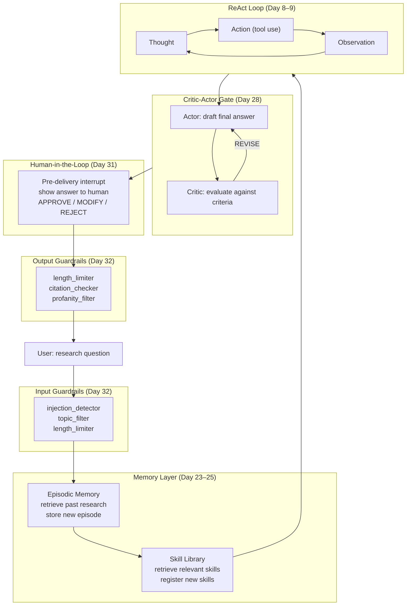

# Day 33 — Capstone: Research Assistant Agent

> **Today's one idea:** A production-grade agent is not a pattern — it is a composition of patterns, each solving one specific problem in the system. The capstone asks you to design that composition, implement its skeleton, and defend every architectural decision.
> **Reading time:** ~90 min (design + implementation + reflection) · **Prereqs:** Days 1–32
> **No new concepts.** Everything here appeared in an earlier day. Today's job is assembly and reflection.

---

## What you're building

A **Research Assistant Agent** that accepts a research question and returns a thoroughly sourced, quality-verified answer. It must:

1. Use a **ReAct loop** for reasoning and tool use
2. Pull from a **Skill Library** for reusable search and analysis functions
3. Remember **past research sessions** via episodic memory, so it improves over time
4. Gate final output quality through a **Critic-Actor loop**
5. Pause for **human approval** before the final answer is delivered
6. Run behind **guardrails** that validate inputs and constrain tool use

This is not a toy. The patterns are the ones you've implemented; the integration is the engineering.

---

## Step 1 — Design

Before writing code, draw the architecture. Below is the reference design. Read it carefully, then close it and redraw it from memory as your first exercise.

### Component map



### Pattern-to-problem mapping

| Problem | Pattern used | Day introduced |
|---------|-------------|----------------|
| How does the agent reason and use tools? | ReAct | Day 8–9 |
| How does it access reusable search patterns? | Skill Library | Day 22 |
| How does it learn from past research sessions? | Episodic Memory | Day 25 |
| How is output quality assured without constant human review? | Critic-Actor | Day 28 |
| How does the human stay in control of final output? | Human-in-the-Loop (pre-delivery) | Day 31 |
| How is the system safe to deploy? | Guardrails (input + action + output) | Day 32 |

---

## Step 2 — Implementation skeleton

The following code is the wiring diagram in Python. It is a working skeleton — stubs replace real external APIs, but all the integration logic is real. Your job is to fill in the stubs with real implementations using the code you wrote in earlier days.

```python
"""
Day 33 — Research Assistant Agent: Integration Skeleton

Patterns integrated:
- ReAct loop (Day 9)
- Skill Library (Day 22)
- Episodic Memory (Day 25)
- Critic-Actor (Day 28)
- Human-in-the-Loop (Day 31)
- Guardrails (Day 32)
"""
import json
import os
import time
from dataclasses import dataclass, field
from enum import Enum
from typing import Callable, Any
import anthropic

client = anthropic.Anthropic()


# ── Utilities ──────────────────────────────────────────────────────────────────

def llm(prompt: str, system: str = "", max_tokens: int = 1024) -> str:
    kwargs = {
        "model": "claude-3-5-sonnet-20241022",
        "max_tokens": max_tokens,
        "messages": [{"role": "user", "content": prompt}],
    }
    if system:
        kwargs["system"] = system
    return client.messages.create(**kwargs).content[0].text.strip()


# ════════════════════════════════════════════════════════════════════════════════
# LAYER 1: GUARDRAILS (Day 32)
# ════════════════════════════════════════════════════════════════════════════════

Rail = Callable[[str], tuple[bool, str]]


def injection_detector(content: str) -> tuple[bool, str]:
    patterns = ["ignore previous", "disregard your system", "new persona", "forget everything"]
    lower = content.lower()
    for p in patterns:
        if p in lower:
            return False, f"Blocked: prompt injection pattern detected ('{p}')."
    return True, content


def length_limiter(max_chars: int) -> Rail:
    def _rail(content: str) -> tuple[bool, str]:
        if len(content) > max_chars:
            return True, content[:max_chars] + "... [truncated]"
        return True, content
    _rail.__name__ = f"length_{max_chars}"
    return _rail


def topic_filter_research(content: str) -> tuple[bool, str]:
    """Only allow research / information queries."""
    off_topic_signals = ["delete", "rm -rf", "drop table", "sudo", "password", "credit card"]
    lower = content.lower()
    for signal in off_topic_signals:
        if signal in lower:
            return False, "Blocked: request contains off-topic or dangerous content."
    return True, content


def apply_rails(content: str, rails: list, stage: str) -> tuple[bool, str]:
    for rail in rails:
        passed, result = rail(content)
        if not passed:
            print(f"  [guardrail:{stage}] {rail.__name__} BLOCKED")
            return False, result
        content = result
    return True, content


INPUT_RAILS  = [injection_detector, topic_filter_research, length_limiter(4000)]
OUTPUT_RAILS = [length_limiter(8000)]


# ════════════════════════════════════════════════════════════════════════════════
# LAYER 2: MEMORY — EPISODIC (Day 25)
# ════════════════════════════════════════════════════════════════════════════════

@dataclass
class Episode:
    question:  str
    answer:    str
    key_facts: list  # list[str]
    success:   bool


class EpisodicMemory:
    def __init__(self, path: str = "research_episodes.json"):
        self.path = path
        self._episodes: list = self._load()

    def _load(self) -> list:
        if not os.path.exists(self.path):
            return []
        with open(self.path) as f:
            return [Episode(**e) for e in json.load(f)]

    def _save(self) -> None:
        with open(self.path, "w") as f:
            json.dump([
                {"question": e.question, "answer": e.answer,
                 "key_facts": e.key_facts, "success": e.success}
                for e in self._episodes
            ], f, indent=2)

    def store(self, episode: Episode) -> None:
        self._episodes.append(episode)
        self._save()

    def retrieve(self, question: str, top_k: int = 2) -> list:
        if not self._episodes:
            return []
        if len(self._episodes) <= top_k:
            return self._episodes

        # LLM-based relevance scoring
        candidates = "\n".join(f"{i}: {e.question}" for i, e in enumerate(self._episodes))
        raw = llm(
            f"Current question: {question}\n\n"
            f"Rate relevance of each past question (0.0–1.0). "
            f"Return ONLY comma-separated scores:\n{candidates}",
            max_tokens=64,
        )
        try:
            scores = [float(s.strip()) for s in raw.split(",")]
            ranked = sorted(zip(scores, self._episodes), key=lambda x: x[0], reverse=True)
            return [ep for _, ep in ranked[:top_k]]
        except (ValueError, IndexError):
            return self._episodes[-top_k:]

    def format_context(self, episodes: list) -> str:
        if not episodes:
            return ""
        parts = ["## Relevant Past Research"]
        for ep in episodes:
            status = "✓" if ep.success else "✗"
            facts = "\n".join(f"  - {f}" for f in ep.key_facts[:3])
            parts.append(f"**[{status}] Prior question:** {ep.question}\n**Key facts found:**\n{facts}")
        return "\n\n".join(parts)


# ════════════════════════════════════════════════════════════════════════════════
# LAYER 3: MEMORY — SKILL LIBRARY (Day 22)
# ════════════════════════════════════════════════════════════════════════════════

@dataclass
class Skill:
    name:        str
    description: str
    tool_def:    dict   # the Anthropic tool definition dict
    verified:    bool   = False
    usage_count: int    = 0


class SkillLibrary:
    def __init__(self):
        # Seed with built-in research skills
        self._skills: list = [
            Skill(
                name="search_web",
                description="Search the web for factual information on a topic.",
                tool_def={
                    "name": "search_web",
                    "description": "Search the web for information. Use for factual lookups, recent events, or data.",
                    "input_schema": {
                        "type": "object",
                        "properties": {"query": {"type": "string", "description": "The search query."}},
                        "required": ["query"],
                    },
                },
                verified=True,
            ),
            Skill(
                name="summarize_sources",
                description="Synthesize multiple text sources into a coherent summary.",
                tool_def={
                    "name": "summarize_sources",
                    "description": "Synthesize multiple source texts into a coherent answer. Use after gathering raw search results.",
                    "input_schema": {
                        "type": "object",
                        "properties": {
                            "sources":   {"type": "array", "items": {"type": "string"}},
                            "question":  {"type": "string"},
                        },
                        "required": ["sources", "question"],
                    },
                },
                verified=True,
            ),
        ]

    def retrieve(self, task: str, top_k: int = 3) -> list:
        return [s for s in self._skills if s.verified][:top_k]

    def tool_definitions(self, skills: list) -> list:
        return [s.tool_def for s in skills]


# ════════════════════════════════════════════════════════════════════════════════
# LAYER 4: REACT LOOP (Day 9)
# ════════════════════════════════════════════════════════════════════════════════

def execute_tool(name: str, inputs: dict) -> str:
    """Stub tool executor. Replace with real implementations."""
    if name == "search_web":
        return (
            f"[Search results for '{inputs.get('query', '')}'] "
            "Stub: replace with real web search API call."
        )
    if name == "summarize_sources":
        sources = inputs.get("sources", [])
        question = inputs.get("question", "")
        return llm(
            f"Question: {question}\n\nSources:\n" +
            "\n\n---\n\n".join(sources),
            max_tokens=512,
        )
    return f"[Unknown tool: {name}]"


def react_loop(
    task: str,
    tools: list,
    max_steps: int = 8,
    verbose: bool = True,
) -> tuple[str, list]:
    """
    ReAct agent loop. Returns (final_answer, trajectory).
    trajectory is a list of strings for episodic storage.
    """
    messages = [{"role": "user", "content": task}]
    trajectory = []

    for step in range(1, max_steps + 1):
        response = client.messages.create(
            model="claude-3-5-sonnet-20241022",
            max_tokens=1024,
            tools=tools,
            messages=messages,
        )

        if response.stop_reason == "tool_use":
            tool_results = []
            for block in response.content:
                if block.type == "tool_use":
                    result = execute_tool(block.name, block.input)
                    step_str = f"[Step {step}] Action: {block.name}({json.dumps(block.input)[:80]}) → {result[:100]}"
                    trajectory.append(step_str)
                    if verbose:
                        print(f"  {step_str}")
                    tool_results.append({
                        "type": "tool_result",
                        "tool_use_id": block.id,
                        "content": result,
                    })
            messages.append({"role": "assistant", "content": response.content})
            messages.append({"role": "user",      "content": tool_results})
        else:
            answer = next((b.text for b in response.content if hasattr(b, "text")), "")
            trajectory.append(f"[Final] {answer[:200]}")
            return answer, trajectory

    return "Max steps reached without a final answer.", trajectory


# ════════════════════════════════════════════════════════════════════════════════
# LAYER 5: CRITIC-ACTOR GATE (Day 28)
# ════════════════════════════════════════════════════════════════════════════════

class Verdict(Enum):
    ACCEPT = "ACCEPT"
    REVISE = "REVISE"
    REJECT = "REJECT"


RESEARCH_CRITERIA = [
    "Directly answers the research question",
    "Makes no claims without a stated basis",
    "Does not mix up unrelated concepts",
    "Structured clearly: findings, then conclusion",
    "Under 500 words",
]


def critique(question: str, answer: str) -> dict:
    raw = llm(
        f"Research question: {question}\n\n"
        f"Draft answer:\n{answer}\n\n"
        f"Evaluate against these criteria:\n"
        + "\n".join(f"- {c}" for c in RESEARCH_CRITERIA)
        + '\n\nReturn JSON: {"verdict": "ACCEPT"|"REVISE"|"REJECT", '
          '"reasoning": "one sentence", '
          '"specific_issues": ["..."], '
          '"suggestions": ["..."]}',
        max_tokens=512,
    )
    start, end = raw.find("{"), raw.rfind("}") + 1
    return json.loads(raw[start:end])


def critic_actor_gate(question: str, draft: str, max_rounds: int = 3) -> str:
    critique_result = None
    current_draft = draft

    for round_num in range(1, max_rounds + 1):
        if critique_result is not None:
            issues = "\n".join(f"- {i}" for i in critique_result.get("specific_issues", []))
            suggestions = "\n".join(f"- {s}" for s in critique_result.get("suggestions", []))
            current_draft = llm(
                f"Research question: {question}\n\n"
                f"Previous draft had issues:\n{issues}\n\n"
                f"Suggestions:\n{suggestions}\n\n"
                f"Rewrite the answer addressing all issues.",
                max_tokens=1024,
            )

        critique_result = critique(question, current_draft)
        verdict = critique_result.get("verdict", "ACCEPT")
        print(f"  [Critic-Actor Round {round_num}] {verdict} — {critique_result.get('reasoning', '')}")

        if verdict == "ACCEPT":
            return current_draft

    return current_draft  # best effort after max rounds


# ════════════════════════════════════════════════════════════════════════════════
# LAYER 6: HUMAN-IN-THE-LOOP (Day 31)
# ════════════════════════════════════════════════════════════════════════════════

def human_pre_delivery_gate(question: str, answer: str) -> str:
    """
    Show the answer to a human before final delivery.
    Returns the final (possibly modified) answer.
    """
    print("\n" + "═" * 60)
    print("[HUMAN REVIEW — Pre-delivery gate]")
    print(f"Question: {question}")
    print(f"\nProposed answer:\n{answer}")
    print("═" * 60)
    choice = input("(a)pprove / (m)odify / (r)eject: ").strip().lower()

    if choice == "a":
        return answer
    elif choice == "m":
        print("Provide your modified answer (end with a line containing only 'END'):")
        lines = []
        while True:
            line = input()
            if line.strip() == "END":
                break
            lines.append(line)
        return "\n".join(lines)
    else:
        return "[Answer rejected by human reviewer. Please rephrase your question.]"


# ════════════════════════════════════════════════════════════════════════════════
# TOP-LEVEL AGENT LOOP
# ════════════════════════════════════════════════════════════════════════════════

def research_assistant(
    question: str,
    episodic: EpisodicMemory,
    skill_lib: SkillLibrary,
    require_human_approval: bool = True,
) -> str:
    print(f"\n{'═' * 60}")
    print(f"Research Assistant — Question: {question[:60]}...")
    print('═' * 60)

    # ── 1. Input guardrails ────────────────────────────────────────────────────
    print("\n[1/6] Input guardrails...")
    passed, question = apply_rails(question, INPUT_RAILS, "input")
    if not passed:
        return question  # the error message

    # ── 2. Episodic memory retrieval ───────────────────────────────────────────
    print("\n[2/6] Retrieving past research...")
    past_episodes = episodic.retrieve(question, top_k=2)
    past_context = episodic.format_context(past_episodes)
    if past_context:
        print(f"  Found {len(past_episodes)} relevant past session(s).")
    else:
        print("  No relevant past sessions found.")

    # ── 3. Skill library retrieval ─────────────────────────────────────────────
    print("\n[3/6] Loading skills...")
    skills = skill_lib.retrieve(question, top_k=3)
    tools = skill_lib.tool_definitions(skills)
    print(f"  Loaded {len(tools)} skill(s): {[t['name'] for t in tools]}")

    # ── 4. ReAct research loop ─────────────────────────────────────────────────
    print("\n[4/6] Researching...")
    task = question
    if past_context:
        task = f"{past_context}\n\n## Current Research Question\n{question}"

    draft_answer, trajectory = react_loop(task, tools, max_steps=6, verbose=True)

    # ── 5. Critic-Actor quality gate ───────────────────────────────────────────
    print("\n[5/6] Critic-Actor quality gate...")
    final_answer = critic_actor_gate(question, draft_answer, max_rounds=3)

    # ── 6. Human-in-the-loop pre-delivery gate ────────────────────────────────
    if require_human_approval:
        print("\n[6/6] Human pre-delivery review...")
        final_answer = human_pre_delivery_gate(question, final_answer)
    else:
        print("\n[6/6] Human review skipped (require_human_approval=False).")

    # ── Output guardrails ──────────────────────────────────────────────────────
    passed, final_answer = apply_rails(final_answer, OUTPUT_RAILS, "output")
    if not passed:
        return final_answer

    # ── Store episode for future retrieval ─────────────────────────────────────
    key_facts = [line.strip("- •").strip() for line in final_answer.splitlines() if line.strip()][:5]
    episodic.store(Episode(
        question=question,
        answer=final_answer[:500],
        key_facts=key_facts,
        success="rejected" not in final_answer.lower(),
    ))

    return final_answer


# ── Entry point ────────────────────────────────────────────────────────────────

if __name__ == "__main__":
    episodic  = EpisodicMemory("research_episodes.json")
    skill_lib = SkillLibrary()

    answer = research_assistant(
        question=(
            "What are the primary mechanisms by which large language models "
            "can fail to generalize to out-of-distribution inputs?"
        ),
        episodic=episodic,
        skill_lib=skill_lib,
        require_human_approval=False,  # set True for interactive use
    )

    print("\n" + "═" * 60)
    print("FINAL ANSWER")
    print("═" * 60)
    print(answer)
```

---

## Step 3 — Annotate your design

For each integration point below, write one sentence explaining *why* that pattern is there — not what it does, but what problem it solves that nothing else in the system handles.

| Integration point | Your annotation |
|------------------|----------------|
| Input guardrails run before episodic retrieval | |
| Episodic memory injects before the ReAct loop, not after | |
| Skill Library provides tool definitions, not the ReAct loop itself | |
| Critic-Actor runs on the draft answer, not within the ReAct loop | |
| Human-in-the-Loop gate runs after Critic-Actor | |
| Output guardrails run last, after human review | |

After writing your annotations, compare with the reference below.

<details>
<summary>Reference annotations</summary>

| Integration point | Explanation |
|------------------|-------------|
| Input guardrails run before episodic retrieval | Injection or off-topic input would corrupt the retrieval query and poison the episodic context. Guard the entry point first. |
| Episodic memory injects before the ReAct loop, not after | The agent needs past research context *during* reasoning, not as a postscript. Injecting it into the task prompt means the ReAct loop can actively build on prior findings. |
| Skill Library provides tool definitions, not the ReAct loop itself | The ReAct loop should be agnostic to which specific tools are available. The library is the source of truth for the current tool set; swapping tools doesn't require changing the loop. |
| Critic-Actor runs on the draft answer, not within the ReAct loop | The ReAct loop produces raw research; the Critic-Actor gate assesses *presentation quality*. These are different concerns. If the critic ran within the loop, it would interrupt reasoning rather than evaluate the finished product. |
| Human-in-the-Loop gate runs after Critic-Actor | The human reviews the quality-gated answer, not the raw draft. Running HITL first would waste human attention on output that the critic would have caught anyway. |
| Output guardrails run last, after human review | The human might modify the answer. Any modification must also pass output rails — the guardrail must wrap the final content, not just the agent's draft. |
</details>

---

## Step 4 — Reflection questions

Answer these before looking at the discussion notes:

1. This system has six layers. Which two layers would you keep if you had to cut four? Why those two?

2. The `critic_actor_gate` uses static criteria (`RESEARCH_CRITERIA`). How would the system behave differently if the criteria were dynamically generated from the question itself?

3. The episodic store grows unboundedly. At 10,000 episodes, the LLM-based retrieval in `retrieve()` makes 10,000-entry scoring calls. Describe a retrieval architecture that scales to 10,000 episodes without LLM-based scoring.

4. The Skill Library seeds two skills at startup. Describe what a `grow_skill_library()` function would do: what triggers it, what it generates, and how the generated skill is verified before being added.

5. The `require_human_approval=False` flag bypasses the HITL gate. Under what conditions is it safe to set this? What monitoring would you add if HITL were disabled in production?

<details>
<summary>Discussion notes</summary>

**Q1 — Two layers to keep:**
The strongest answer is **Guardrails + Critic-Actor**. Guardrails protect the system from external attack; Critic-Actor protects the output from internal quality failure. Without guardrails, the system is exploitable. Without the Critic-Actor gate, quality depends entirely on the ReAct loop's first pass. Episodic memory and HITL add value but can be added incrementally. The Skill Library is useful but a static tool list works at small scale.

**Q2 — Dynamic criteria:**
If criteria are generated from the question ("Does the answer cite a specific paper?", "Does it distinguish between X and Y?"), the critic becomes much more targeted — it evaluates the answer against what this *specific question* needed, not a generic quality rubric. Risk: the LLM generating criteria may produce criteria that are impossible to meet (too strict) or trivial (too loose). You'd want a separate validator for the criteria themselves.

**Q3 — Scaling episodic retrieval:**
Replace LLM-based scoring with embedding-based similarity search:
1. Embed each episode's `question` field at write time using a fast embedding model (e.g., `text-embedding-3-small`)
2. Store embeddings in a vector database (FAISS, Chroma, Pinecone)
3. At retrieval time: embed the current question → nearest-neighbor search → O(log n) retrieval
This cuts retrieval from O(n) LLM calls to one embedding call + one vector search.

**Q4 — Growing the skill library:**
Trigger: after any successful ReAct loop where the trajectory contains a repeated action pattern (the same tool call type appears 3+ times). The pattern suggests the agent is doing something reusable.
Generate: ask the LLM to generalize the specific trajectory into an abstract function with typed inputs and outputs.
Verify: run the generated function on 2-3 test inputs; check that it runs without error and produces plausible output (same verification as Day 22's `verify_skill()`).
Only add to the library after verification passes.

**Q5 — Safe conditions for HITL=False:**
Safe when: (a) all output goes into a system (not directly to end users), (b) the Critic-Actor gate is tight and well-calibrated, (c) guardrails cover the key failure modes, (d) every output is logged and sampled for human review asynchronously.
Monitoring to add: output quality sampling (1% of outputs reviewed weekly), anomaly detection on output length/format distribution, alert on >N consecutive Critic-Actor REVISE/REJECT cycles (signal that something systemic is wrong).
</details>

---

## Step 5 — Extend it

Pick one extension and implement it:

**Extension A (easier):** Add a **Peer Debate layer** between the ReAct loop and the Critic-Actor gate. Two debater agents argue about the ReAct draft; a judge synthesizes before the critic evaluates. Does this improve the critic's ACCEPT rate?

**Extension B (harder):** Replace the static `SkillLibrary` with a growing library that writes new skills to disk after every successful ReAct session. Use Day 22's `generate_skill_from_solution()` to generalize the trajectory into a reusable skill. Run the system on 5 questions in sequence and observe what the library looks like after all 5.

**Extension C (hardest):** Implement the full async version of the ReAct loop using `asyncio` and a parallel fan-out for skill retrieval. Profile: how much does parallel skill retrieval reduce end-to-end latency compared to sequential? At what number of skills does the benefit become measurable?

---

## What you've built

Across 33 days and seven modules, you went from "what is a design pattern" to implementing and composing:

| Module | Component | Key pattern |
|--------|-----------|-------------|
| 01 — Foundations | Action space | Tool use primitive |
| 02 — Reasoning | Planning | ReAct, ToT, LATS |
| 03 — Self-Improvement | Learning | Reflexion, ExpeL, STaR |
| 04 — Skills & Tools | Action space (designed) | Skill Library |
| 05 — Memory | Memory | Episodic retrieval, Scratchpad |
| 06 — Multi-Agent | Collaboration + Safety | Critic-Actor, Guardrails |
| 07 — Capstone | Integration | This system |

The capstone system you built today is not a toy. Add real search APIs, a vector database for episodic retrieval, and a proper UI for the HITL gate, and it is a deployable research assistant. The patterns are production patterns. The architecture is production architecture.

What you have now that you didn't have on Day 1: *a vocabulary and a toolkit* for reasoning about agent systems — not just using them.

---

## Navigation

← **Previous:** [Module 06 — Multi-Agent Patterns](../../06-multi-agent/overview.md)
→ **Course Home:** [README](../../../README.md)
