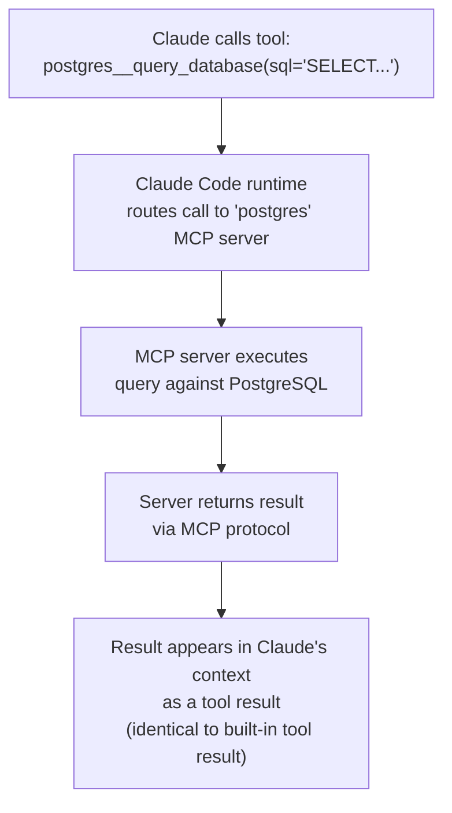

*[Claude Code 101](../../README.md) · Day 6 of 14*

# Day 6 — MCP Servers + The Full Wiring Diagram

> **Today's one idea:** MCP servers extend Claude's reach to any external system; and with that, you now have everything needed to draw the complete wiring diagram of how all four layers interact.
> **Reading time:** ~60 min · **Prereqs:** [Day 5](day-05-behavior-gates-hooks.md)
> **Primary source for today:** Model Context Protocol Specification — modelcontextprotocol.io; Claude Code Docs — "MCP integration"

---

## The hook

Claude Code ships with a fixed set of built-in tools: `Read`, `Edit`, `Write`, `Bash`, `Glob`, `Grep`, `Agent`. These are enough for most file-level engineering tasks.

But real software engineering rarely lives entirely on the filesystem. Your team uses Linear for issue tracking. Your database has 200 tables — you want Claude to query the schema directly rather than reading migration files. You want Claude to check Datadog for recent error rates before suggesting a hotfix. You need Claude to fetch the current OpenAPI spec from a staging server.

Without MCP, you work around this: you paste snippets of query results into the chat, copy-paste from Linear, manually provide schema dumps. Claude is capable but artificially blind to the systems around it.

MCP — the Model Context Protocol — is the standard that closes this gap. It is a plugin specification: build (or install) an MCP server, point Claude Code at it, and the server's capabilities appear in Claude's tool list as if they were built in. Claude queries your database the same way it reads a file. It fetches a Linear ticket the same way it reads a bash command result.

Today you learn how MCP works, how to configure it, and — in the second half — you use everything from Days 1–6 to draw the full wiring diagram: the complete picture of how a message you type becomes a tool call becomes a file change, with every layer of the stack labeled.

---

## Building the intuition

### Claude's tool surface as a power outlet

Think of Claude's tool capability as a power outlet. The built-in tools — `Read`, `Edit`, `Bash`, etc. — are the appliances that come in the box. They are enough to power a home.

MCP servers are new appliances you plug in. The outlet (the protocol) is standardized — any MCP-compliant server works with any MCP-compliant client. You do not need to modify Claude Code to add a new capability; you build or install a server that speaks the protocol, and the capability becomes available.

The practical implication: anything you can expose as a function (query this database, fetch this URL, search this index, list these tickets) can be made into a tool Claude uses fluently.

### The three primitives MCP exposes

Every MCP server exposes up to three kinds of things:

**Tools** — functions Claude can call. A tool takes parameters and returns a result. This is the most common primitive.
```
Tool: query_database
Input: { "sql": "SELECT * FROM tasks WHERE status = 'open' LIMIT 10" }
Output: [{ "id": 1, "title": "Fix auth bug", "status": "open" }, ...]
```

**Resources** — read-only data sources Claude can access. Like files, but served by the MCP server rather than the filesystem.
```
Resource: postgres://taskflow/schema
Content: (the full database schema as text)
```

**Prompts** — pre-built prompt templates the server exposes. Less commonly used in engineering workflows.

For most engineering use cases, you will use Tools and occasionally Resources.

---

## The formal picture

### Configuring an MCP server in settings.json

MCP servers are declared in `settings.json` under the `mcpServers` key:

```json
{
  "mcpServers": {
    "postgres": {
      "command": "npx",
      "args": ["-y", "@modelcontextprotocol/server-postgres", "postgresql://localhost/taskflow"],
      "env": {
        "PGPASSWORD": "${env:PGPASSWORD}"
      }
    },
    "filesystem": {
      "command": "npx",
      "args": ["-y", "@modelcontextprotocol/server-filesystem", "/home/user/projects/taskflow"]
    },
    "github": {
      "command": "npx",
      "args": ["-y", "@modelcontextprotocol/server-github"],
      "env": {
        "GITHUB_PERSONAL_ACCESS_TOKEN": "${env:GITHUB_TOKEN}"
      }
    }
  }
}
```

Each entry:
- **Key** (`"postgres"`, `"filesystem"`) — the name shown in Claude's tool list prefix
- **`command`** — how to launch the server (typically `npx`, `python`, `node`, or a binary path)
- **`args`** — arguments passed to the command (usually the package name + config)
- **`env`** — environment variables for the server process; always use `${env:VAR}` for secrets

### How MCP tool calls work

When Claude uses an MCP tool, the flow is:



From Claude's perspective, `postgres__query_database` is indistinguishable from `Read` or `Bash`. The MCP layer is transparent.

### Three MCP servers worth installing for TaskFlow

**1. PostgreSQL server** — query the live schema and data
```json
"postgres": {
  "command": "npx",
  "args": ["-y", "@modelcontextprotocol/server-postgres",
           "postgresql://localhost/taskflow_dev"]
}
```
Claude gains: `list_tables`, `describe_table`, `query` tools.
Use case: "What indexes exist on the tasks table?" — Claude queries directly instead of reading migration files.

**2. Filesystem server** (extended access outside cwd)
```json
"filesystem": {
  "command": "npx",
  "args": ["-y", "@modelcontextprotocol/server-filesystem",
           "/home/user/projects/taskflow", "/home/user/.config/taskflow"]
}
```
Claude gains: file read/write/list scoped to those directories only.
Use case: Give Claude access to config directories outside the project root without using broad `Bash` permissions.

**3. GitHub server** — read issues, PRs, commit history
```json
"github": {
  "command": "npx",
  "args": ["-y", "@modelcontextprotocol/server-github"],
  "env": { "GITHUB_PERSONAL_ACCESS_TOKEN": "${env:GITHUB_TOKEN}" }
}
```
Claude gains: `list_issues`, `get_issue`, `list_pull_requests`, `get_pull_request_diff` tools.
Use case: "What issues are blocking the v2.1 milestone?" — Claude reads GitHub directly without you copy-pasting.

### MCP server security model

MCP servers run as separate processes with their own permissions. Key security facts:

- An MCP server can only do what it is programmed to do — Claude cannot "break out" of an MCP server's defined tools
- Credentials for MCP servers should always use `${env:VAR}` — never hardcode in settings.json
- MCP tools go through the same hook system as built-in tools — your `PreToolUse` guards work on MCP tool calls too
- The `permissions.deny` list in settings.json can block MCP tool calls: `"postgres__query(DROP *)"` would block destructive queries

---

## The full wiring diagram

You now have all four layers. Here is the complete picture of what happens from the moment you type a message to the moment a file changes on disk:

```mermaid
flowchart TD
    A["SESSION START<br/>CLAUDE.md files loaded → context (Layer 1)<br/>settings.json → permissions + hooks + MCP servers"] --> B
    B["USER MESSAGE RECEIVED<br/>'Review task service for service layer violations'<br/>Skill trigger matched → /review loaded (Layer 3)"] --> C
    C["CLAUDE REASONS<br/>Reads CLAUDE.md + skill instructions<br/>Decides: call Read(task_service.py)"] --> D
    D["PRETOOLUSE HOOK (Layer 2)<br/>pre-bash-guard.sh<br/>Read tool — no dangerous pattern → Exit 0"] --> E
    E["TOOL EXECUTES<br/>Read(task_service.py)<br/>File content appended to context"] --> F
    F["POSTTOOLUSE HOOK (Layer 2)<br/>post-edit-lint.sh<br/>Read, not Edit/Write → Exit 0"] --> G
    G["CLAUDE REASONS<br/>Applies /review checklist (Layer 3)<br/>Checks CLAUDE.md service layer rules (Layer 1)<br/>Finds violation → decides: call Edit"] --> H
    H["PRETOOLUSE HOOK (Layer 2)<br/>pre-bash-guard.sh<br/>Edit tool — no dangerous pattern → Exit 0"] --> I
    I["TOOL EXECUTES<br/>Edit(task_service.py)<br/>File changed on disk"] --> J
    J["POSTTOOLUSE HOOK (Layer 2)<br/>flake8 on edited file → passes<br/>secret-scan.sh → passes → Exit 0"] --> K
    K["CLAUDE FINAL RESPONSE<br/>Review report per /review skill format<br/>No more tool calls → Stop event fires"] --> L
    L["STOP HOOK (Layer 2)<br/>pre-stop-tests.sh runs pytest<br/>All tests pass → Exit 0<br/>Session completes"]
```



**Where MCP fits:** If the review task needed database schema information, Claude would have called `postgres__describe_table("tasks")` between the "Claude reasons" and "tool executes" steps — routed to the MCP server, result returned identically to a built-in tool.

**The four layers in the diagram:**

| Layer | Where it appears |
|-------|-----------------|
| **Layer 1 — Project Memory** | Session start (CLAUDE.md load) + every reasoning step (Claude reads conventions) |
| **Layer 2 — Behavior Gates** | Before and after every tool execution (PreToolUse, PostToolUse, Stop) |
| **Layer 3 — Workflows** | Skill auto-activation on message receipt + skill instructions during reasoning |
| **Layer 4 — Orchestration** | Would appear if Claude spawned sub-agents (Agent tool calls) |

---

## Where it breaks / what it is not

**MCP servers are processes — they add startup latency.** Each configured MCP server starts when the session starts. Five MCP servers with slow startup = slow session initialization. Only configure servers you actually use in this project.

**MCP does not bypass hooks.** You may assume that MCP tool calls are "external" and bypass your PreToolUse guards. They do not — all tool calls, including MCP ones, flow through the hook system. This is a feature: your `pre-bash-guard.sh` does not need modification to also guard MCP tools.

**MCP server credentials in settings.json are project-scoped.** Your `settings.json` is committed to the repository. Any credential in it (even via `${env:VAR}`) is visible to everyone who clones the project. Use personal access tokens with minimal scope, and rotate them if they are ever exposed.

**Not everything needs an MCP server.** If you need Claude to check one specific API endpoint once a month, write a bash script and add it to the allow list — that is simpler than building or configuring an MCP server. MCP earns its overhead when a capability is used frequently across multiple sessions.

---

## Try it yourself

**Exercise 1 — Trace a database query through the wiring diagram (comprehension check)**

Using the wiring diagram above, trace what happens when:
- Claude decides to call `postgres__describe_table("tasks")`
- The MCP server returns the schema
- Claude uses that schema to suggest a missing index

At which steps do the four layers each play a role? Which hooks fire, and what do they check?

---

**Exercise 2 — Configure an MCP server for TaskFlow**

Add the `@modelcontextprotocol/server-postgres` MCP server to TaskFlow's `settings.json`. Assume:
- Local DB URL: `postgresql://localhost:5432/taskflow_dev`
- Password is in `${env:PGPASSWORD}`

Then write a `PreToolUse` hook that blocks any MCP postgres tool call containing `DROP` or `TRUNCATE`. Test your pattern matching with these inputs:
- `postgres__query({"sql": "SELECT * FROM tasks"})` → should allow
- `postgres__query({"sql": "DROP TABLE tasks"})` → should block
- `postgres__describe_table({"table": "tasks"})` → should allow

---

**Exercise 3 — Complete your wiring diagram (synthesis)**

Draw (or describe in structured text) the complete wiring diagram for your own project or for TaskFlow, including:
- Which CLAUDE.md layers exist and what each contains
- Which skills are configured and their trigger conditions
- Which hooks are active and what each checks
- Which MCP servers are configured and what tools they expose
- The permission model (what is always allowed, what requires confirmation, what is denied)

If you cannot fill in a section, that is a gap in your configuration — note it for later days.

---

## Connect it back

[Days 1–5](day-01-how-claude-code-works.md) built the four layers individually. Today you assembled them into a complete system and traced a real workflow end-to-end. The wiring diagram is the mental model you carry for the rest of the course.

Tomorrow is the densest single page in the course: the token economy. Four optimization levers — hygiene, compaction, caching, and sub-agents — packed into one hour. After tomorrow, everything you build in Days 8–13 will be optimized from the start, not retrofitted.

Sharp question to carry into Day 7: you have a TaskFlow session where Claude reads 15 files, runs 3 test suites, and produces a refactoring plan. The context window is at 60% after 30 minutes. What do you do — and when should you have done it earlier?

---

## Suggested readings for today

**Required if you have 15 extra minutes:**
- Model Context Protocol, "Architecture overview" — modelcontextprotocol.io/docs/concepts/architecture `[VERIFY URL]`. Read the client-server separation section. Understanding that MCP servers are independent processes (not Claude plugins) changes how you reason about their security and performance characteristics.

**If you want the deep version:**
- Claude Code Documentation, "MCP integration" — the complete reference for `mcpServers` configuration syntax, including transport types (stdio vs. SSE) and troubleshooting connection issues. `[VERIFY at docs.anthropic.com/en/docs/claude-code]`
- MCP server registry (if available at modelcontextprotocol.io) — the list of officially supported servers for common systems (Postgres, GitHub, Slack, filesystem, web search). Check what is available before building a custom server.

---

← [Day 5 — Behavior Gates: Hooks as Deterministic Guardrails](day-05-behavior-gates-hooks) &nbsp;|&nbsp; [Day 6b — MCP Server Setup: Installing and Building →](day-06b-mcp-server-setup)
