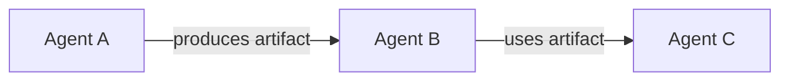
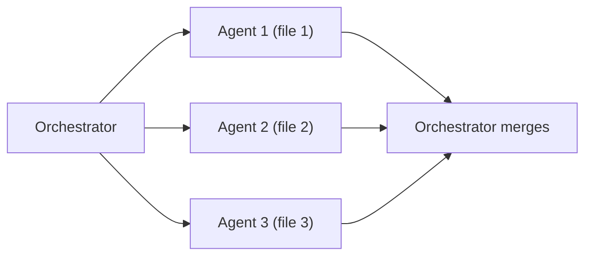
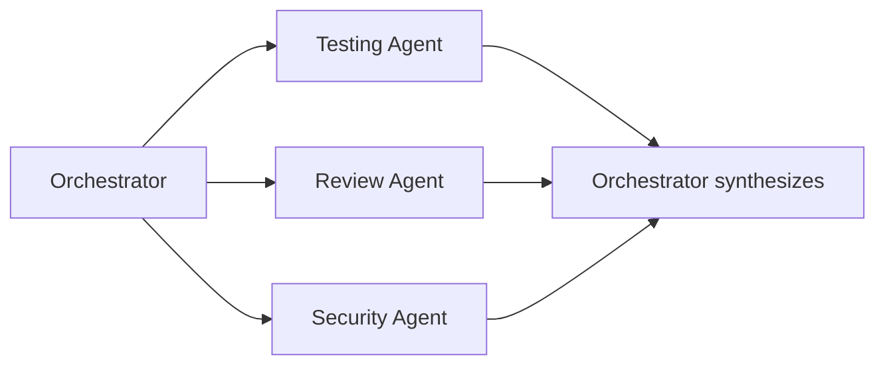
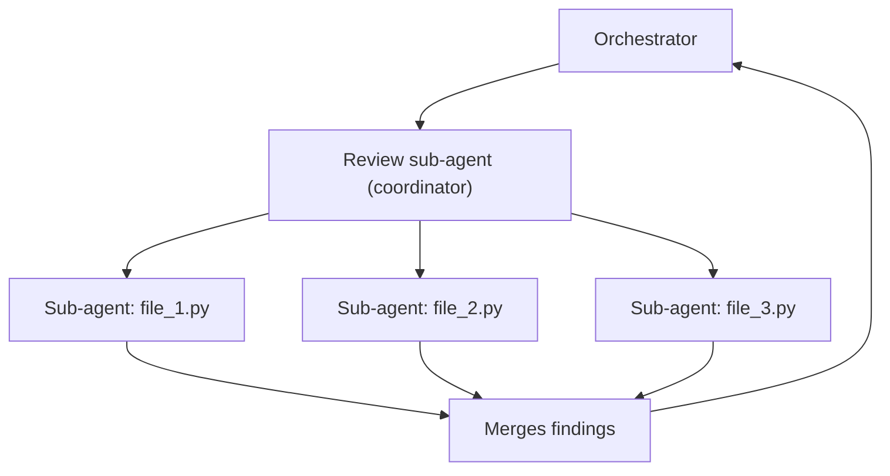

*[Claude Code 101](../../README.md) · Day 12 of 14*

# Day 12 — Team Orchestration: Orchestrator, Map-Reduce, Isolated Context

> **Today's one idea:** When you spawn parallel sub-agents with isolated contexts, Claude stops being a tool and starts being a team — each agent focused, each context clean, the orchestrator synthesizing results no single agent could have produced alone.
> **Reading time:** ~60 min · **Prereqs:** [Day 7](day-07-token-economy.md), [Day 11](day-11-bug-investigation-fixing.md)
> **Primary source for today:** *"Building Effective Agents"*, Anthropic Engineering Blog — "Orchestrator and subagents" section

---

## The hook

The v2.1 release is two days away. You need to:

1. Run the full regression test suite and fix any failures
2. Review all files changed in the last sprint for architectural violations
3. Run a security scan and fix any HIGH severity findings
4. Verify the `openapi.yaml` matches all current route handlers
5. Update the changelog

Five tasks. Serially, with one Claude session handling each: 45+ minutes, a context window that fills with cross-task noise, and each subsequent task reading through the output of all previous ones before doing its work.

Or: five parallel sub-agents, each with an isolated context containing only what it needs for its specific task. Wall-clock time: the longest single task (~15 minutes). No cross-contamination. Each agent returns a structured result to the orchestrator, which synthesizes a release readiness report.

The second approach is not just faster. It produces better results because each agent can reason without noise from unrelated tasks. The regression agent does not have code review output in its context. The security agent does not have test results in its context. Each starts clean, works focused, returns precise output.

This is the mental model shift: **you stop thinking about what to tell one Claude, and start thinking about how to decompose work across a team of Claudes.**

---

## Building the intuition

### The staffing agency model

Imagine you run a staffing agency. You have specialists: a tester, a code reviewer, a security analyst, a documentation writer, an architect. When a project arrives, you do not assign it to one person and tell them to do everything. You decompose it, assign each piece to the right specialist, run them in parallel where possible, and compile their reports.

That is the orchestrator pattern. You are the agency director. The orchestrator Claude is your project manager. The sub-agents are the specialists.

Each specialist:
- Receives a focused brief (their specific task + only the context they need)
- Has no visibility into what other specialists are doing
- Returns a structured result in a specified format
- Does not need to know why their piece matters — just what they need to do

The isolation is a feature, not a limitation. It means:
- Each agent reasons clearly within its own scope
- A mistake in one agent does not corrupt another's context
- Results are independently verifiable
- The same agent pattern can be reused for different projects

### The three orchestration patterns

**Pattern 1: Pipeline (sequential with handoffs)**
Use when Task B requires the output of Task A.



Example: Generate tests → Run tests → Fix failures. Each step depends on the previous.

**Pattern 2: Map-Reduce (parallel fan-out, then merge)**
Use when the same operation applies to N independent items.



Example: Review 10 changed files in parallel. Each agent reviews one file independently. Orchestrator compiles all findings into one report.

**Pattern 3: Specialist pool (parallel different tasks)**
Use when N different tasks are genuinely independent.



Example: The release checklist above. Each agent has a different specialty and a different toolset.

---

## The formal picture

### The orchestrator skill: TaskFlow v2.1 release check

```markdown
---
description: Run the full v2.1 release readiness check: tests, review, security, API contract, and changelog. Use parallel sub-agents for each domain.
---

# v2.1 Release Readiness Check

Run five parallel sub-agents. Wait for all to complete.
Then synthesize their results into the release report below.

---

**Sub-agent 1 — TEST SUITE**
Task: Run the full test suite and report results.
Instructions:
  1. Run: `cd backend && python -m pytest tests/ -q --tb=short 2>&1`
  2. Run: `cd frontend && npm test -- --run 2>&1`
Return JSON:
{
  "domain": "tests",
  "status": "PASS" | "FAIL",
  "backend": { "passed": N, "failed": N, "failures": ["test::name", ...] },
  "frontend": { "passed": N, "failed": N, "failures": [...] }
}

---

**Sub-agent 2 — CODE REVIEW (Map-Reduce)**
Task: Review all Python files changed since the last release tag.
Instructions:
  1. Run: `git diff v2.0..HEAD --name-only -- "*.py"` to get changed files
  2. For each changed Python file, apply the /review checklist
  3. Collect all BLOCKING findings only (ignore SUGGESTIONS and STYLE NOTES)
Return JSON:
{
  "domain": "review",
  "status": "PASS" | "FAIL",
  "blocking_findings": [
    { "file": "path", "line": N, "rule": "CLAUDE.md rule text", "issue": "description" }
  ]
}

---

**Sub-agent 3 — SECURITY SCAN**
Task: Run bandit and report actionable findings.
Instructions:
  1. Run: `cd backend && python -m bandit -r app/ -f json -ll 2>&1`
  2. Parse the JSON output for HIGH and MEDIUM severity findings
Return JSON:
{
  "domain": "security",
  "status": "PASS" | "FAIL",
  "findings": [
    { "severity": "HIGH"|"MEDIUM", "file": "path", "line": N, "issue": "description", "cwe": "..." }
  ]
}

---

**Sub-agent 4 — API CONTRACT**
Task: Verify openapi.yaml matches all current route handlers.
Instructions:
  1. List all endpoints defined in `app/api/v1/*.py` by reading each file
  2. List all endpoints defined in `docs/openapi.yaml`
  3. Report any endpoints in the code that are missing from openapi.yaml
  4. Report any endpoints in openapi.yaml that are missing from the code
Return JSON:
{
  "domain": "api_contract",
  "status": "PASS" | "FAIL",
  "in_code_not_in_spec": ["METHOD /path", ...],
  "in_spec_not_in_code": ["METHOD /path", ...]
}

---

**Sub-agent 5 — CHANGELOG**
Task: Verify the CHANGELOG.md has a v2.1 entry.
Instructions:
  1. Read CHANGELOG.md
  2. Check if a "## v2.1" or "## [2.1" section exists
  3. If it exists, list the features/fixes it documents
  4. If it does not exist, generate a draft based on `git log v2.0..HEAD --oneline`
Return JSON:
{
  "domain": "changelog",
  "status": "PASS" | "FAIL" | "DRAFT_GENERATED",
  "entry_exists": true | false,
  "draft": "..." | null
}

---

## Synthesis

After all five agents complete, produce this release report:

## TaskFlow v2.1 Release Readiness

**Overall Status: 🟢 READY | 🟡 READY WITH WARNINGS | 🔴 BLOCKED**

| Domain | Status | Summary |
|--------|--------|---------|
| Tests | PASS/FAIL | N passed, N failed |
| Code Review | PASS/FAIL | N blocking findings |
| Security | PASS/FAIL | N HIGH, N MEDIUM |
| API Contract | PASS/FAIL | N mismatches |
| Changelog | PASS/FAIL | Entry exists / Draft generated |

### Blocking Issues (must fix before release)
[List all FAIL status domains with their specific findings]

### Warnings (should fix but not blocking)
[MEDIUM security findings, minor mismatches]

### Ready to Release
[What is confirmed clean]
```

### The isolated context principle

Each sub-agent starts with a fresh context. It receives:
1. Its specific task instructions (from the orchestrator's message)
2. The CLAUDE.md (loaded automatically at session start)
3. Only the files it reads during its work

It does NOT receive:
- The outputs of sibling sub-agents
- The orchestrator's full reasoning history
- Files read by other sub-agents

This isolation is not a constraint to work around — it is the design. An isolated context means:
- The security agent cannot be confused by the test output
- The review agent cannot be anchored by what the security agent found
- Each agent's findings are independent and cross-checkable

When the orchestrator synthesizes, it is the first point at which all findings come together. The synthesis is the orchestrator's job, not the sub-agents'. Do not give sub-agents each other's outputs.

### Map-Reduce applied to the review sub-agent

Sub-agent 2 above is itself a Map-Reduce: it gets a list of changed files and runs `/review` on each. You can nest this pattern:



For large review batches (10+ files), this nested pattern keeps each innermost agent's context under 5K tokens. For small batches (1-3 files), the coordinator handles them serially without further spawning.

### Passing context correctly to sub-agents

Sub-agents are isolated, but they need the right starting information. The rule: **pass facts, not history.**

Good: "The task ID is 42. Find why `TaskService.update_task(42, ...)` is failing. Read `app/services/task_service.py` first."

Bad: "I've been investigating a bug for 30 minutes and we tried approach A and B and then noticed the error occurs when... [2000 tokens of history]"

The good version gives the sub-agent facts. The bad version burdens it with your investigation history, most of which is not relevant to what it needs to do.

---

## Where it breaks / what it is not

**Sub-agents for tasks that are not independent.** If Task B reads the output of Task A, they cannot run in parallel — they must run in sequence. The orchestrator must wait for Agent A to complete before launching Agent B with Agent A's result. Attempting to parallelize dependent tasks produces incoherent results.

**Orchestrator context overload.** If you have 20 sub-agents each returning 5K tokens of results, the orchestrator's context hits 100K tokens before it does any synthesis. Design sub-agent return formats to be compact: structured JSON summaries, not raw tool output. The sub-agent summarizes; the orchestrator synthesizes.

**Orphaned sub-agents.** If you start parallel sub-agents and the orchestrator session ends (crash, timeout), the sub-agents may continue running without a coordinator to collect their results. Always design sub-agents to produce output that can be re-read if the orchestrator needs to restart.

**Over-orchestration.** Not every task needs sub-agents. A simple bug fix, a single file review, a one-question investigation — these are all faster and cheaper as single focused sessions. Sub-agents earn their coordination overhead when the task genuinely decomposes into parallel work worth more than ~5 tool calls each.

---

## Try it yourself

**Exercise 1 — Pattern identification (comprehension check)**

For each scenario, identify which orchestration pattern applies (Pipeline, Map-Reduce, or Specialist Pool) and why:

1. "Review the 8 files changed in the last PR, then summarize all blocking findings."
2. "Generate tests for `task_service.py`, run them, fix any failures, then run the full suite."
3. "Simultaneously: check test coverage, audit type hints across all service files, and verify all migrations have a corresponding rollback."
4. "For each of the 15 open GitHub issues, determine if it is reproducible in the current codebase."

---

**Exercise 2 — Write a Map-Reduce skill**

Write a skill called `/sprint-review` that:
1. Gets the list of all Python files changed in the current sprint: `git diff main...HEAD --name-only -- "*.py"`
2. Spawns one sub-agent per file (max 5 in parallel; batch the rest)
3. Each sub-agent applies the `/review` checklist to its assigned file
4. Orchestrator collects all BLOCKING findings and produces a sprint review report

Handle the case where more than 5 files changed — describe how you batch the work.

---

**Exercise 3 — Design the release pipeline (stretch)**

TaskFlow's release process currently takes a developer ~2 hours manually. Design a `/release-check` skill that:
1. Identifies which tasks can be parallelized (Specialist Pool)
2. Identifies which tasks must be sequential (Pipeline)
3. Specifies the exact sub-agent instructions and return formats for each
4. Describes how the orchestrator synthesizes a release decision (GO / NO-GO)

The output should be a complete skill file ready to commit to `.claude/commands/`.

---

## Connect it back

[Day 7](day-07-token-economy.md) introduced sub-agents as a token optimization. Today you saw them as an architectural pattern — the difference between a tool for saving tokens and a model for how teams of agents coordinate to produce results no single agent could.

Tomorrow is the last workflow day: CI/CD integration and team collaboration. You will see how hooks fire on git events, how CLAUDE.md lives in the repo as a shared artifact, and how everything from Day 1 through today becomes team infrastructure rather than individual tooling.

---

## Suggested readings for today

**Required if you have 15 extra minutes:**
- *"Building Effective Agents"*, Anthropic Engineering Blog — the sections "Orchestrator and subagents" and "Parallelization." These are the canonical source for the patterns on this page, written by the engineers who built the system. anthropic.com/engineering/building-effective-agents `[VERIFY URL]`

**If you want the deep version:**
- *"Building Effective Agents"* in full — the complete blog post covers all agentic patterns used in this course (tool use, long-running tasks, multi-agent coordination). Reading it end-to-end after Day 12 connects every pattern you have learned to the engineering principles behind them.
- Claude Code Documentation, "Sub-agents" — the technical reference for how `Agent` tool calls work, what isolation guarantees exist, and how to pass context to sub-agents. Essential reading before implementing the `/sprint-review` skill.

---

← [Day 11 — Bug Investigation + Fixing](day-11-bug-investigation-fixing) &nbsp;|&nbsp; [Day 13 — CI/CD Integration + Team Collaboration →](day-13-cicd-team-collaboration)
