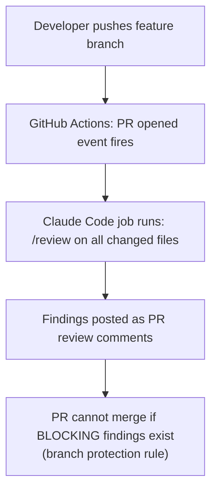

*[Claude Code 101](../../README.md) · Day 13 of 14*

# Day 13 — CI/CD Integration + Team Collaboration

> **Today's one idea:** When CLAUDE.md lives in the repository and hooks fire on git events, Claude Code graduates from a personal tool to team infrastructure — consistent for every developer, every session, without anyone having to remember to configure it.
> **Reading time:** ~60 min · **Prereqs:** [Day 5](day-05-behavior-gates-hooks.md), [Day 12](day-12-team-orchestration.md)
> **Primary source for today:** *Accelerate* (Forsgren, Humble & Kim), Ch. 4 "Technical Practices"; *Software Engineering at Google* (Winters et al.), Ch. 24 "Continuous Integration"

---

## The hook

Your team adopted Claude Code four weeks ago. Individual productivity is up. But you have noticed something: the quality of Claude's output varies across developers. Alice has a detailed `CLAUDE.md` and three skills; Bob has the default setup; Carlos has a stale `CLAUDE.md` from a tutorial that contradicts current project conventions. Every developer is running a different version of Claude.

This is not a Claude problem. It is a configuration-as-personal-tool problem. When configuration lives in individuals' environments — not in the repository — you get configuration drift. The further you drift, the less reliable the team's shared output becomes.

The solution is the same principle that solved this problem for code, for tests, and for infrastructure: version control + automation. Put the configuration in the repository. Run it in CI. Make it impossible to accidentally run Claude Code without the project's conventions in effect.

Today you wire up the four layers to GitHub Actions and establish the team conventions that turn individual Claude Code setups into a shared team platform.

---

## Building the intuition

### Configuration drift: the silent quality killer

Consider three versions of a team's Claude Code setup at week 8:

```
Developer A (joined week 1):
  ✓ CLAUDE.md with all current conventions
  ✓ 3 skills: /review, /test-gen, /fix
  ✓ 4 hooks: lint, guard, secret-scan, test-gate
  ✓ settings.json with deny rules

Developer B (joined week 4):
  ✓ CLAUDE.md (outdated — missing service layer rules added in week 6)
  ✗ No skills
  ✓ 1 hook: lint only
  ✗ No deny rules

Developer C (joined week 7):
  ✓ CLAUDE.md (current)
  ✗ No skills
  ✗ No hooks
  ✗ No settings.json
```

Three developers. Three different levels of guardrails. Claude's behavior varies significantly across them — not because Claude is inconsistent, but because the context and constraints Claude receives are inconsistent.

The fix: the entire Claude Code configuration lives in the repository. When a developer clones the project, they get:
- `.claude/CLAUDE.md` — current, versioned, reviewed
- `.claude/settings.json` — current deny rules, auto-approved tools
- `.claude/commands/` — all skills, the same version for everyone
- `.claude/hooks/` — all hook scripts, executable, tested

No setup required. No drift. New developer joins, clones the repo, runs Claude Code — and immediately has the same configuration as everyone else.

### CI/CD: Claude as an automated team member

Hooks respond to Claude's own tool events. But Claude Code can also be invoked non-interactively from CI pipelines — triggered by git events, running skills headlessly, reporting findings as PR comments.

The value: the same `/review` skill that a developer runs manually against a single file can also run automatically against every file in every PR — without human intervention.



Now code review is not optional, not forgotten when deadlines approach, not dependent on reviewer availability. It is a required CI gate — the same way tests are a required CI gate.

---

## The formal picture

### Repository structure for team Claude Code

```
taskflow/
├── .claude/
│   ├── CLAUDE.md            ← Committed. Team's shared briefing.
│   ├── settings.json        ← Committed. Shared permissions and hook config.
│   ├── CLAUDE.local.md      ← Gitignored. Personal overrides per developer.
│   ├── commands/
│   │   ├── review.md        ← Committed. Shared /review skill.
│   │   ├── test-gen.md      ← Committed. Shared /test-gen skill.
│   │   ├── fix.md           ← Committed. Shared /fix skill.
│   │   └── assets/
│   │       └── review-checklist.md
│   └── hooks/
│       ├── pre-bash-guard.sh     ← Committed + chmod +x
│       ├── post-edit-lint.sh     ← Committed + chmod +x
│       ├── secret-scan.sh        ← Committed + chmod +x
│       └── pre-stop-tests.sh     ← Committed + chmod +x
└── .github/
    └── workflows/
        ├── ci.yml                ← Standard CI
        └── claude-review.yml     ← Claude Code PR review
```

Add to `.gitignore`:
```
.claude/CLAUDE.local.md
```

### The GitHub Actions workflow for automated review

```yaml
# .github/workflows/claude-review.yml

name: Claude Code PR Review

on:
  pull_request:
    types: [opened, synchronize]
    paths:
      - 'backend/**/*.py'
      - 'frontend/**/*.ts'
      - 'frontend/**/*.tsx'

jobs:
  claude-review:
    runs-on: ubuntu-latest
    permissions:
      pull-requests: write
      contents: read

    steps:
      - uses: actions/checkout@v4
        with:
          fetch-depth: 0  # Full history for git diff

      - name: Set up Python
        uses: actions/setup-python@v5
        with:
          python-version: '3.11'

      - name: Install dependencies
        run: |
          cd backend
          pip install -r requirements.txt
          pip install flake8 bandit

      - name: Install Claude Code CLI
        run: npm install -g @anthropic-ai/claude-code

      - name: Get changed Python files
        id: changed-files
        run: |
          CHANGED=$(git diff --name-only origin/${{ github.base_ref }}...HEAD \
                    -- '*.py' | head -20)
          echo "files=$CHANGED" >> $GITHUB_OUTPUT

      - name: Run Claude review on changed files
        id: claude-review
        env:
          ANTHROPIC_API_KEY: ${{ secrets.ANTHROPIC_API_KEY }}
        run: |
          REVIEW_OUTPUT=""
          for FILE in ${{ steps.changed-files.outputs.files }}; do
            echo "Reviewing: $FILE"
            RESULT=$(claude --print "/review $FILE" 2>&1)
            REVIEW_OUTPUT="$REVIEW_OUTPUT\n\n## $FILE\n$RESULT"
          done
          # Write to file (avoids shell escaping issues)
          printf "$REVIEW_OUTPUT" > review_output.txt

      - name: Post review as PR comment
        uses: actions/github-script@v7
        with:
          script: |
            const fs = require('fs');
            const reviewOutput = fs.readFileSync('review_output.txt', 'utf8');

            // Only post if there are BLOCKING findings
            if (reviewOutput.includes('### BLOCKING')) {
              await github.rest.pulls.createReview({
                owner: context.repo.owner,
                repo: context.repo.repo,
                pull_number: context.payload.pull_request.number,
                body: `## Claude Code Review\n\n${reviewOutput}`,
                event: 'REQUEST_CHANGES'
              });
            } else {
              await github.rest.pulls.createReview({
                owner: context.repo.owner,
                repo: context.repo.repo,
                pull_number: context.payload.pull_request.number,
                body: `## Claude Code Review\n\nNo blocking issues found.\n\n${reviewOutput}`,
                event: 'APPROVE'
              });
            }
```

### The headless Claude Code invocation pattern

The `claude --print` flag runs Claude non-interactively — it executes the skill, prints the output, and exits. This is the key that makes CI integration possible:

```bash
# Run a skill non-interactively, print output to stdout
claude --print "/review app/services/task_service.py"

# Run a skill with a question
claude --print "What files were changed in the last commit?"

# Run a skill and capture to variable
RESULT=$(claude --print "/test-gen app/services/task_service.py")
```

The `--print` mode:
- Uses the project's `.claude/CLAUDE.md` and `settings.json` automatically
- Executes hooks as normal
- Returns the output as text to stdout
- Exits with code 0 on success, non-zero on error

### Team conventions that make shared configuration work

Shared configuration requires team agreements. These belong in the project `CLAUDE.md` itself — so Claude enforces them:

```markdown
## Team Configuration Rules

### When to update CLAUDE.md
- After any architecture decision or convention change
- After any production incident that reveals a missing rule
- NOT for sprint-specific context (use the Active Work section)
- ALWAYS get a second pair of eyes on CLAUDE.md changes (treat like code)

### When to add a new skill
- When a task recurs more than once per sprint across multiple developers
- When a task requires more than 5 instructions to prompt correctly
- Skills are code — add tests if the skill involves shell execution

### When to add a hook
- When a CLAUDE.md rule has been violated by Claude more than once
- When a forbidden action needs enforcement, not just instruction
- Never duplicate: if settings.json deny covers it, don't add a hook

### Skill naming conventions
- Verbs for action skills: /review, /fix, /test-gen, /deploy-check
- Nouns for query skills: /architecture, /status, /coverage
- No abbreviations: /test-gen not /tg

### Hook performance budget
- PostToolUse hooks must complete in < 2 seconds
- Stop hooks must complete in < 10 seconds
- If a check takes longer, move it to CI, not a hook
```

### The onboarding checklist for new developers

Add this to your repository's `CONTRIBUTING.md`:

```markdown
## Claude Code Setup (5 minutes)

1. **Install Claude Code CLI:**
   ```bash
   npm install -g @anthropic-ai/claude-code
   ```

2. **Set your API key:**
   ```bash
   export ANTHROPIC_API_KEY=your_key_here
   # Add to ~/.bashrc or ~/.zshrc
   ```

3. **Personal overrides (optional):**
   ```bash
   cp .claude/CLAUDE.local.md.example .claude/CLAUDE.local.md
   # Edit with your local database port, personal preferences, etc.
   ```

4. **Make hooks executable:**
   ```bash
   chmod +x .claude/hooks/*.sh
   ```

5. **Verify setup:**
   ```bash
   claude --print "What project are we working on?"
   # Should respond with TaskFlow project details from CLAUDE.md
   ```

That's it. The rest — CLAUDE.md, settings.json, skills, hooks — are already in the repository.
```

### CLAUDE.md governance: treating configuration like code

The `CLAUDE.md` is as important as your codebase. It should be subject to the same governance:

| Practice | Code | CLAUDE.md |
|----------|------|-----------|
| Version control | Yes | Yes |
| Code review for changes | Yes | Yes |
| Changelog/commit message | Yes | Yes |
| Testing | Tests | Spot-check behavior after changes |
| Ownership | Team | Team (not one person's preferences) |
| Merge to main via PR | Yes | Yes |

A useful CI check: run a linting script that validates the `CLAUDE.md` structure — checks that all required sections exist, that forbidden action rules are formatted correctly, and that no secrets were accidentally added.

```bash
# .github/workflows/claude-config-lint.yml (simplified)

- name: Lint CLAUDE.md structure
  run: |
    python scripts/lint_claude_md.py .claude/CLAUDE.md
    # Script checks: Project Facts, Architecture, Conventions,
    # FORBIDDEN sections all exist; no AWS/GH/OpenAI key patterns
```

---

## Where it breaks / what it is not

**CI review is slow and expensive for large PRs.** Running `/review` on 30 changed files in CI takes time and costs tokens. Mitigate with: only review files changed by the PR (not the full codebase), batch files into parallel sub-agent reviews (Day 12's Map-Reduce pattern), and cache common CLAUDE.md content for the 5-minute TTL.

**Automated review as a substitute for human review.** Claude Code CI review is a first-pass filter — it catches systematic, rule-based violations. It does not replace human judgment on architecture decisions, product tradeoffs, or code that is technically correct but wrong for the business context. Position it as "Claude reviews before humans" not "Claude reviews instead of humans."

**The CLAUDE.md that reflects one developer's preferences.** When one developer owns the `CLAUDE.md`, it accumulates their personal preferences alongside team conventions. The line blurs. Review CLAUDE.md changes as carefully as API changes — question every new rule: "Is this a team convention or an individual preference?"

**Secrets in the CI environment.** The `ANTHROPIC_API_KEY` in GitHub Actions must be a project secret, not a personal token. Rotate it if it leaks. The CI workflow should use a service account key with minimal permissions, not a developer's personal key.

---

## Try it yourself

**Exercise 1 — Audit your team's configuration drift (comprehension check)**

For a team you work with (or hypothetically for TaskFlow), answer:
1. Is `.claude/CLAUDE.md` committed to the repository?
2. Are skills committed and shared, or personal?
3. Are hook scripts committed, or set up manually?
4. How would a new developer joining today set up Claude Code?
5. How long would it take? What could go wrong?

Map your answers to the configuration drift spectrum (from "every developer is different" to "configuration is fully in the repo").

---

**Exercise 2 — Write the CI workflow for test generation**

Extend the GitHub Actions setup above with a second workflow that:
1. Triggers when a new Python file is added to `app/services/` (pull request event)
2. Runs `/test-gen` on the new file
3. Commits the generated test file to the PR branch (or posts it as a review comment)
4. Reports how many test cases were generated

Write the complete `.github/workflows/claude-test-gen.yml` file.

---

**Exercise 3 — Write the CLAUDE.md governance policy (stretch)**

Write a one-page team policy for CLAUDE.md governance that covers:
1. Who can propose changes (anyone) and who approves them (tech lead + one peer)
2. What triggers a required CLAUDE.md update (incident, architecture decision, convention change)
3. How to test a CLAUDE.md change before merging (what behavior do you verify?)
4. How often to audit for stale content (quarterly? sprint-end?)

Make it concrete enough that a new team lead could apply it without asking you questions.

---

## Connect it back

[Day 1](day-01-how-claude-code-works.md) established that Claude starts blank. Today closes the loop: with configuration in the repository, CI automation, and team governance, no developer ever starts truly blank — the project's accumulated knowledge, conventions, and guardrails arrive automatically in every session.

You have built the full stack. Tomorrow is the capstone — no new concepts, no scaffolding. A new project brief, a blank `.claude/` directory, and everything you have learned in 13 days.

---

## Suggested readings for today

**Required if you have 15 extra minutes:**
- *Accelerate* (Forsgren, Humble & Kim), Chapter 4 "Technical Practices" — the section on "Continuous integration" and "Trunk-based development." The data behind why automation and shared configuration (not individual heroics) predict software delivery performance. Directly applicable to the CI/CD integration above.

**If you want the deep version:**
- *Software Engineering at Google*, Chapter 24 "Continuous Integration" — Google's internal philosophy on what CI is (and is not), what belongs in CI vs. pre-commit hooks vs. local dev. Maps directly onto the decision of which Claude Code checks to put in hooks vs. CI jobs.
- *Accelerate*, Chapter 5 "Architecture" — the sections on "loosely coupled architecture" and "team autonomy." Understanding why teams with shared configuration AND individual autonomy (the global/project/local CLAUDE.md hierarchy) outperform teams with centralized control.

---

← [Day 12 — Team Orchestration](day-12-team-orchestration) &nbsp;|&nbsp; [Day 14 — Capstone: Build It from Scratch →](day-14-capstone)
