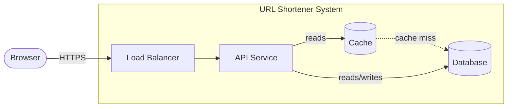

*[Grokking System Design](../../../README.md) · Module 1 — Design Methodology · Day 1*

# Day 1 — How to Approach Any System Design Problem

> **Today's one idea:** Every system design starts with the same four steps — clarify functional requirements, define non-functional requirements, estimate capacity, sketch the data flow — and skipping any one of them produces a design that solves the wrong problem at the wrong scale.
>
> **Reading time:** ~35 min · **Prereqs:** None
>
> **Primary source for today:** Xu, Alex. *System Design Interview*, Vol. 1, ByteByteGo, 2020 — Chapter 1, "Scale from Zero to Millions of Users."

---

## The Hook

You are in a whiteboard interview at a fintech company. The interviewer says: "Design a payment processing system."

You open a marker and face a blank whiteboard. Where do you start?

Most developers do one of three things:
1. Draw a box labelled "API" and connect it to a box labelled "Database."
2. Spend three minutes asking clarifying questions, get nervous, then draw anyway.
3. Ask "does it need to be scalable?" — receive the answer "yes" — and draw a microservices diagram they saw on a blog.

None of these produce a good design. The first produces a design for the wrong system. The second produces a design for the wrong scale. The third produces a design that solves the wrong problem with the right-sounding architecture.

The blank page problem is not a creativity problem. It is a process problem. Today you get the process.

---

## Building the Intuition

Think about planning a new city, not building a house.

Before a city planner draws a single road, they answer three questions:
1. **Who lives here and what do they need to do?** (functional requirements)
2. **What makes the city good for them?** Safety, transit speed, cost of living — measurable criteria. (non-functional requirements)
3. **How many people are we planning for?** A city for 10,000 people has different infrastructure than one for 10 million. (capacity estimation)

Only after answering all three do they sketch a city layout. And that first sketch — the data flow — is not the final design. It is the first sanity check: does this layout even serve the people we described?

System design works exactly the same way. The four steps below are not a checklist to rush through. They are a forcing function that prevents you from building the wrong thing at the wrong scale.

### Step 1: Clarify Functional Requirements

Functional requirements are what the system must *do*. They are features, operations, and behaviours visible to users.

The discipline here is **scope control**. Every feature you add to scope is a constraint on every architectural decision that follows. Ask:
- What are the core operations? (usually 2–4 for any system)
- What is explicitly out of scope?
- Who are the users — humans, other systems, both?

**URL shortener example:**
- In scope: shorten a long URL to a short code; redirect a short code to the original URL.
- Out of scope (for now): user accounts, link expiry, analytics dashboard.
- Users: anonymous humans via a web browser.

Notice the "for now" qualifier. Scope is not permanent — it is a design-time snapshot. "For now" captures the assumption so you can revisit it later.

### Step 2: Define Non-Functional Requirements

Non-functional requirements (NFRs) are how well the system must do what it does. They are the "-ilities": availability, reliability, scalability, durability, latency, throughput, consistency, security.

The critical discipline here is **quantification**. "Fast" is not an NFR. "p99 redirect latency < 100ms" is an NFR. "Highly available" is not an NFR. "99.9% availability (≤8.7 hours downtime per year)" is an NFR.

Here is a practical cheat sheet for the most important NFRs in system design:

| NFR | Typical questions to ask | Example answer |
|-----|--------------------------|----------------|
| **Availability** | How much downtime is acceptable per year? | 99.9% = 8.7h/year; 99.99% = 52min/year |
| **Latency** | What is the acceptable p50 and p99 response time? | p99 redirect < 100ms |
| **Throughput** | How many operations per second must the system sustain? | 100K redirects/sec at peak |
| **Durability** | Can we lose data? How much? (RPO) | 0 data loss — every URL must survive a server crash |
| **Consistency** | Must all users see the latest data immediately? | Eventual consistency for reads is acceptable |
| **Scale** | What is the expected load now? In 3 years? | 100M URLs created today; 1B in 3 years |

**URL shortener example:**
- Availability: 99.9% (8.7 hours of downtime per year is acceptable for a convenience tool)
- Latency: redirect p99 < 50ms (slower than this and users notice)
- Durability: no data loss (a shortened URL that stops working is a broken promise)
- Consistency: eventual — it is acceptable if a newly created short link takes 1–2 seconds to be visible globally
- Scale: 100M new URLs per day, 10:1 read:write ratio → 1B redirects per day

### Step 3: Estimate Capacity

Capacity estimation is back-of-the-envelope math. The goal is not precision — it is **ruling out entire solution classes** before you draw a single box.

If your system needs 100TB of storage, SQLite is off the table. If your system needs 100K writes per second, a single relational database instance is off the table. You need these numbers before you pick a database, not after.

**The three numbers you always compute:**

**QPS (Queries Per Second):**
```
QPS = daily_requests / 86,400
```
- 1 million requests/day  → ~12 QPS
- 100 million requests/day → ~1,200 QPS
- 10 billion requests/day  → ~116,000 QPS (116K QPS)

**Storage:**
```
storage_per_year = records_per_day × bytes_per_record × 365
```
- URL shortener: 100M URLs/day × 500 bytes/URL × 365 = ~18TB/year

**Bandwidth:**
```
bandwidth = peak_QPS × average_response_size_bytes
```
- URL shortener reads: 116K QPS × 500 bytes = ~55 MB/s

**URL shortener example — full estimation:**

| Metric | Calculation | Result |
|--------|-------------|--------|
| Write QPS | 100M/day ÷ 86,400 | ~1,200 writes/sec |
| Read QPS | 1B/day ÷ 86,400 | ~11,600 reads/sec |
| Storage/day | 100M × 500B | 50 GB/day |
| Storage/year | 50GB × 365 | ~18 TB/year |
| Read bandwidth | 11,600 × 500B | ~5.5 MB/s |

**What these numbers tell us:**
- 11,600 reads/sec is manageable for a single well-configured database — but not without a cache (100ms query × 11,600 = beyond a single DB's comfortable range).
- 18TB/year rules out in-memory-only storage.
- A 10:1 read:write ratio signals that we should optimise the read path (caching) more than the write path.

### Step 4: Sketch the Data Flow

The data flow sketch is not an architecture diagram. It is a sanity check: given the functional requirements and the capacity numbers, what is the minimum viable set of components, and how do they connect?

Draw it as a path that data takes through the system, not as a final architecture:



This sketch answers the question: "Does this structure even make sense for a 10:1 read-heavy URL resolution system?" It does — API service sits behind a load balancer, reads hit the cache first, cache misses fall through to the database. The write path (creating new short URLs) goes directly to the database.

This is the starting point for Day 3's C4 Container diagram. For now, it is just enough to validate that your requirements and your structure are consistent.

---

## The Formal Picture

The four steps form a structured intake process. Here is the formal definition:

**Step 1 — Functional Requirements:**
A set of *user stories* or *operations* of the form "the system shall [action] [actor]." Each must be verifiable. Example: "The system shall redirect a short code to its original URL in under 100ms at p99."

**Step 2 — Non-Functional Requirements:**
A set of *quality attributes*, each expressed as a *measurable constraint*. Formally: `[attribute] shall be [value] under [condition]`. Example: "Availability shall be ≥99.9% measured over any rolling 30-day window."

**Step 3 — Capacity Estimation:**
A set of *numerical bounds* that constrain the solution space:
- `QPS_write` = daily_writes / 86,400
- `QPS_read` = daily_reads / 86,400
- `storage_year` = records_per_day × bytes_per_record × 365
- `bandwidth` = peak_QPS × avg_response_bytes

Accuracy to within an order of magnitude is sufficient for design purposes.

**Step 4 — Data Flow Sketch:**
An informal diagram showing the primary path data takes through the system — from user to storage and back. Contains: entry point, at least one service, at least one storage component. Does not contain: class names, table schemas, API contracts. Those come in the LLD.

---

## Where It Breaks / What It Is Not

**"I don't have time for four steps in an interview."** You do. Steps 1–3 take 5–8 minutes total. Step 4 is where you start drawing. The alternative — drawing without these steps — produces boxes that your interviewer will immediately challenge. Four minutes of methodology buys you 25 minutes of defensible design.

**"The numbers don't need to be exact."** Correct — but they need to be in the right order of magnitude. The difference between 1,000 QPS and 100,000 QPS is the difference between a single database and a sharded cluster. Get that wrong and the rest of the design is wrong too.

**"Functional and non-functional requirements are the same thing."** They are not. Functional: "users can upload a file." Non-functional: "file upload must complete within 5 seconds for files up to 100MB." The functional requirement says *what*. The non-functional requirement says *how well*. Both are required. Neither subsumes the other.

**"The data flow sketch is the HLD."** No. The data flow sketch is a sanity check. The HLD (which you will learn on Day 18) adds component names, Azure service annotations, data flow labels, quality attribute decisions, and open questions. The sketch is the seed of the HLD, not the HLD itself.

**Over-scoping non-functional requirements for the actual system.** The most common mistake: designing for 99.999% availability when the system is an internal reporting dashboard used by 50 people. Every 9 you add costs money, adds complexity, and reduces developer velocity. Match your NFRs to your actual users.

---

## Try It Yourself

### Exercise 1 — Requirements for a File Storage Service
You are designing a Dropbox-like file storage service for a 500-person company (internal use only, not consumer-facing).

List:
- 3 functional requirements (core operations only)
- 4 non-functional requirements with specific numbers

<details>
<summary>Hint</summary>

For functional requirements: think about the three core operations any file storage service must support. For non-functional requirements: start with availability (what's the cost of downtime for an internal tool?), then durability (can we lose uploaded files?), then latency (how fast must uploads and downloads feel?), then scale (500 users × average file size × uploads per day).

</details>

<details>
<summary>Worked Solution</summary>

**Functional requirements:**
1. Users can upload files up to 2GB.
2. Users can download their files by filename or file ID.
3. Users can share a file with another user by email address (read-only access).

**Non-functional requirements:**
1. **Availability:** 99.5% (internal tool — 43 hours/year downtime acceptable; no SLA)
2. **Durability:** zero data loss after upload confirmation (RPO = 0; if we acknowledge the upload, it must survive a single server failure)
3. **Latency:** upload throughput ≥ 10 MB/s for files up to 2GB (500 users, ~20 concurrent uploads is realistic)
4. **Scale:** 500 users × 10 uploads/day × 10MB average = 50GB/day written; retained for 3 years = ~55TB total storage

</details>

---

### Exercise 2 — Capacity Estimation for a Twitter-Scale System
A microblogging service has 500 million registered users, of whom 50 million post once per day. Each post is 200 bytes of text. Posts are read 20 times on average.

Calculate:
- Write QPS
- Read QPS
- Storage per year

<details>
<summary>Hint</summary>

Daily writes = 50M. Daily reads = 50M × 20 = 1B. Use `QPS = daily / 86,400`. For storage: writes per day × bytes per record × 365.

</details>

<details>
<summary>Worked Solution</summary>

| Metric | Calculation | Result |
|--------|-------------|--------|
| Write QPS | 50M / 86,400 | ~580 writes/sec |
| Read QPS | 1B / 86,400 | ~11,600 reads/sec |
| Storage/year | 50M × 200B × 365 | ~3.65 TB/year |

**What this tells you:**
- 11,600 reads/sec at 20:1 read-to-write ratio → strong case for caching (same conclusion as the URL shortener).
- 3.65 TB/year for text only — manageable with a single large database for the first few years, but metadata (user IDs, timestamps, likes) will add 3–5× overhead → plan for ~15–20 TB/year total.
- 580 writes/sec is well within a single well-tuned relational database. No sharding needed at this scale for writes.

</details>

---

### Exercise 3 (Stretch) — Reasoning About Availability
A team is debating whether their system needs 99.9% or 99.99% availability. The system is an e-commerce checkout service.

What are the engineering implications of the jump from 99.9% to 99.99%? What does this change in the design?

<details>
<summary>Hint</summary>

Convert percentages to downtime hours. Then ask: what does "four nines" require that "three nines" does not? Think about database failover time, deployment strategy, and redundancy.

</details>

<details>
<summary>Worked Solution</summary>

| Availability | Downtime per year | Downtime per month |
|-------------|-------------------|--------------------|
| 99.9% | 8.76 hours | ~43 minutes |
| 99.99% | 52 minutes | ~4.4 minutes |

**Implications of the jump:**

- **Database failover:** A standard Azure SQL failover (leader to replica) takes 20–30 seconds. At 99.9%, one failover per month stays within budget. At 99.99%, a 30-second failover already consumes ~10% of your monthly downtime budget — you need automatic failover under 5 seconds, which requires active-active or a faster failover mechanism (Azure SQL Hyperscale, Cosmos DB multi-region).

- **Deployments:** Blue-green or canary deployments become mandatory at 99.99% — a rolling restart that takes 2 minutes per instance would consume 2× the monthly budget.

- **Cost:** 99.99% typically requires at least two regions (active-passive minimum), doubling infrastructure cost for data replication alone.

**Decision for a checkout service:** 99.99% is likely justified — every minute of checkout downtime is lost revenue and brand damage. But this means the team must budget for multi-region deployment, automatic failover, and zero-downtime deployments from day one.

</details>

---

## Connect It Back

Today you learned that system design is not an act of inspiration — it is a four-step process that converts a vague brief into a constrained design space. The first two steps (functional + non-functional requirements) define what the system is. The third step (capacity estimation) defines what it must withstand. The fourth step (data flow sketch) is the first attempt to answer: "is there a structure that satisfies all of the above?"

Tomorrow on Day 2, you will learn the decision framework that determines *which* structure to pick from the many that could satisfy your requirements. The data flow sketch from today gives you a starting point; Day 2 gives you the criteria for evaluating every option.

**The question you should be able to answer now that you couldn't this morning:**

*If someone says "design a system that handles 1 billion requests per day," what is the first thing you calculate, and what does the answer tell you?*

---

## Suggested Readings for Today

**Required if you have 15 extra minutes:**
Xu, *System Design Interview* Vol. 1, Chapter 1 — "Scale from Zero to Millions of Users" (pp. 1–28). This chapter builds the same system from the bottom up (single server → database → cache → CDN → multiple servers) rather than from the top down. Reading it after today's page gives you both directions through the same design space.

**If you want the deep version:**

- Kleppmann, *Designing Data-Intensive Applications*, Chapter 1 — "Reliable, Scalable, and Maintainable Applications" (pp. 3–23). The definitive treatment of non-functional requirements for data systems. Kleppmann's definitions of reliability (tolerating faults), scalability (coping with growth), and maintainability (operating the system over time) are the formal versions of Step 2's NFR vocabulary. Worth 30 minutes of your time before Day 4.

- Malan, David J. "Scalability." CS75 Harvard, 2012. YouTube search: `CS75 Lecture 9 Scalability Harvard David Malan`. Timestamp 0:00–20:00 — the first 20 minutes narrate exactly the scaling journey your data flow sketch will grow into over the next 11 days. Best watched before starting Module 2.

---

[Day 2 — Trade-Off Analysis: The Framework for Every Design Decision →](day-02-trade-off-analysis.md)
