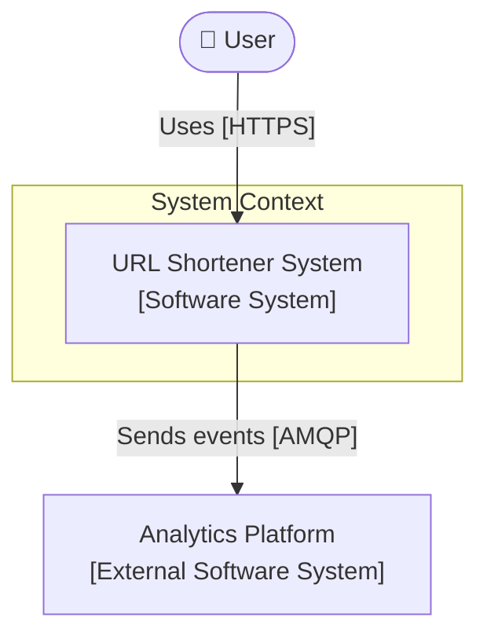
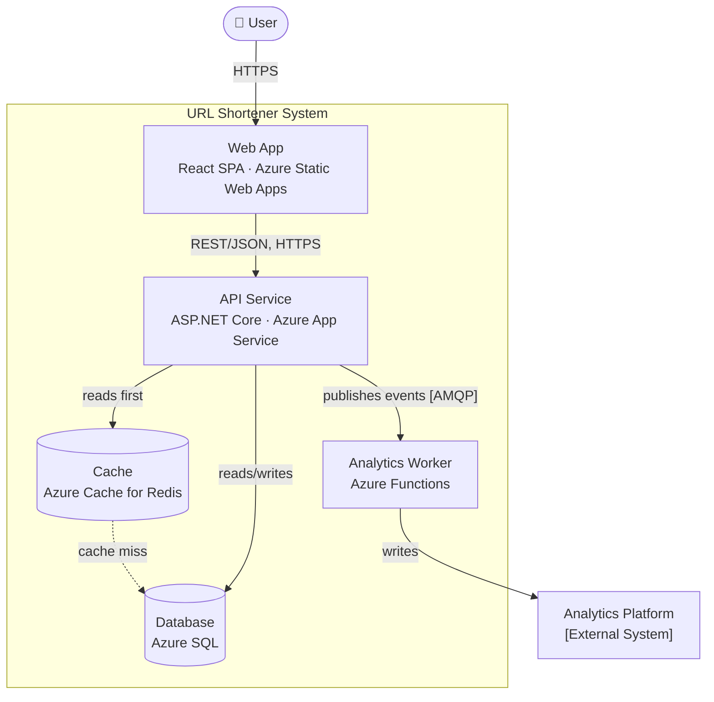
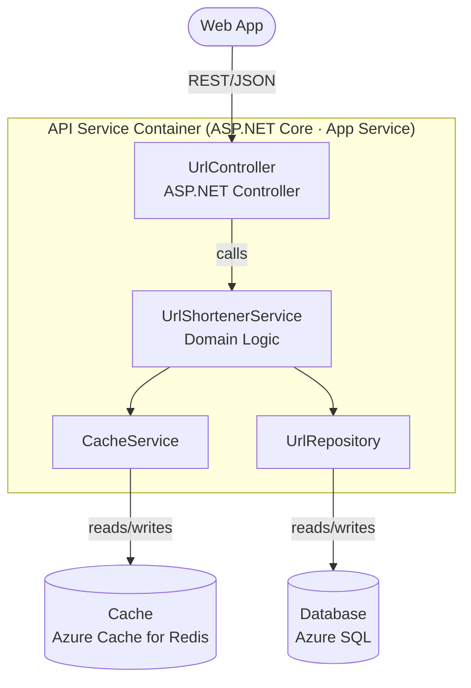

*[Grokking System Design](../../../README.md) · Module 1 — Design Methodology · Day 3*

# Day 3 — Drawing Systems: C4 and the System Design Vocabulary

> **Today's one idea:** Four zoom levels — Context, Container, Component, Code — give you exactly the right level of detail for any audience, and a shared vocabulary (Person, Software System, Container, Component, Relationship) means every box you draw carries unambiguous meaning.
>
> **Reading time:** ~35 min · **Prereqs:** Day 1
>
> **Primary source for today:** Brown, Simon. "The C4 Model for Software Architecture." c4model.com — the "Notation" and "FAQ" sections.

---

## The Hook

You have just finished designing a URL shortener in your head. Now you need to explain it to three different people in the same room:

- **Junior developer:** "I need to implement the redirect endpoint. What calls what?"
- **Product manager:** "I need to understand how this fits with our existing analytics system."
- **CTO:** "I need to decide whether this architecture is sound before we commit resources."

Three people. Three completely different questions. Three different levels of detail required.

You open a diagramming tool and draw... one diagram. It shows every service, every database, every class, and every arrow. It takes 45 minutes to draw and 10 minutes to explain to each person. The CTO glazes over after minute two. The product manager cannot locate "analytics" in the diagram. The junior developer asks which of the 23 boxes they need to implement.

The diagram failed not because it was wrong — but because it tried to be everything to everyone at once.

C4 solves this by giving you four zoom levels. Today you learn to use them.

---

## Building the Intuition

Open Google Maps on your phone. Search for a city you have never been to.

At the **country level** zoom, you see major cities and motorways. Nothing else. This level answers: "Where is this city relative to everything else?"

Zoom in to the **city level** and you see neighbourhoods, parks, and main roads. Still no individual buildings. This level answers: "How is this city organised?"

Zoom in to the **street level** and individual buildings appear. This level answers: "Where exactly is this place?"

Zoom into **satellite view** and you can see the car park, the entrance, and the rooftop HVAC units. This level answers: "What does this building actually look like?"

Each zoom level is correct for its purpose. You do not show HVAC units on a country map — that is noise. You do not navigate a city using only a country map — that is useless.

**C4 is Google Maps for software.**

- **Level 1 (Context):** Your system and its world. Who uses it? What external systems does it talk to?
- **Level 2 (Container):** The deployable units inside your system. What are the moving parts and how do they communicate?
- **Level 3 (Component):** The internal structure of one container. How is one service or application organised inside?
- **Level 4 (Code):** Class-level detail. Your IDE does this for you — you rarely draw it.

For system design (HLDs and most LLDs), you need **Level 1 and Level 2 always**. You need **Level 3 for the most complex container**. You almost never draw Level 4.

---

## Building the Vocabulary

Before drawing anything, you need to know what each element means. C4 has five:

### Person
A human actor who uses the system. In C4, people are drawn as a stick figure or a named box with a person icon.

- ✅ "User", "Admin", "Customer Service Agent"
- ❌ "System" (a system is not a person)

### Software System
The thing you are building (or an external system you depend on). At Level 1, your system is a single box — a black box. You have not opened it yet.

- ✅ "URL Shortener System", "Payment Gateway (external)", "Azure Active Directory"
- ❌ "Database" (a database is a Container, not a System — unless it is an external system you do not own)

### Container
A separately deployable unit: a web application, a mobile app, an API service, a database, a message broker, a serverless function.

The word "Container" in C4 does **not** mean Docker container. It means "a deployable, runnable unit that hosts code or stores data."

- ✅ "ASP.NET Core API [Azure App Service]", "React SPA [Azure Static Web Apps]", "Azure SQL Database", "Azure Service Bus"
- ❌ "UserService class" (that is a Component, not a Container)
- ❌ "Middleware" (middleware lives *inside* a Container — it is not separately deployable)

### Component
A named, well-defined grouping of related functionality inside a Container.

- ✅ "UrlShortenerService", "CacheRepository", "AnalyticsEventPublisher" (inside the API Container)
- ❌ "API" (too vague — that is the whole Container, not a Component)

### Relationship
An arrow between two elements, labelled with: *what* flows across it and *how* (the technology or protocol).

- ✅ "reads/writes [SQL over TCP]", "publishes events to [AMQP]", "calls [REST/HTTPS]"
- ❌ An unlabelled arrow (meaningless — a reader cannot know what flows across it or why)

---

## The Formal Picture

### Level 1: System Context Diagram

**Purpose:** Show the system in its environment. No internal structure visible.
**Audience:** Anyone — including non-technical stakeholders.
**What it answers:** What is this system and who/what interacts with it?



**Rules:**
- Your system is one box. Do not open it.
- Show every Person and every external Software System it interacts with.
- Label every arrow with the *purpose* of the interaction, not the technical detail.

---

### Level 2: Container Diagram

**Purpose:** Show the deployable units inside your system and how they communicate.
**Audience:** Technical stakeholders and developers.
**What it answers:** What are the running processes and storage? How do they connect?



**Rules:**
- Every box is a separately deployable unit. Include the technology (ASP.NET Core, React) and the Azure service (App Service, Static Web Apps).
- Every arrow has a label with the protocol.
- Do not show classes, methods, or table schemas — those belong in Level 3 or the LLD.

---

### Level 3: Component Diagram (one container only)

**Purpose:** Show the internal structure of *one* Container.
**Audience:** The developers implementing that specific container.
**What it answers:** How is this container organised internally?

For the API Service container:



---

### The Structurizr DSL: C4 as Code

Instead of drawing C4 diagrams manually, you can write them as code using the **Structurizr DSL** — a free, open-source tool at https://structurizr.com/dsl.

This is important for .NET teams because:
1. Diagrams-as-code live in source control alongside your application code.
2. They are diffable — you can see exactly what changed in a PR.
3. They render automatically without Visio, draw.io, or Miro.

Here is the complete Level 1 + Level 2 for the URL shortener:

```dsl
workspace {
  model {
    # People
    user = person "User" "A person who wants to shorten or resolve a URL."

    # External Systems
    analyticsSystem = softwareSystem "Analytics Platform" {
      tags "External System"
      description "Third-party analytics service for click tracking."
    }

    # Your System
    urlShortener = softwareSystem "URL Shortener" {
      description "Shortens long URLs and redirects users to the original."

      webApp = container "Web App" {
        technology "React, Azure Static Web Apps"
        description "Single-page application served to the browser."
        tags "Browser"
      }

      apiService = container "API Service" {
        technology "ASP.NET Core 8, Azure App Service"
        description "Handles URL creation, validation, and redirect resolution."
      }

      cache = container "Cache" {
        technology "Azure Cache for Redis"
        description "Stores hot URL mappings for fast redirect resolution."
        tags "Database"
      }

      database = container "Database" {
        technology "Azure SQL Database"
        description "Persistent store for all URL mappings."
        tags "Database"
      }

      analyticsWorker = container "Analytics Worker" {
        technology "Azure Functions (.NET 8 isolated)"
        description "Consumes redirect events and forwards to the analytics platform."
      }
    }

    # Relationships — Level 1
    user -> urlShortener "Shortens and resolves URLs via" "HTTPS"
    urlShortener -> analyticsSystem "Sends click events to" "HTTPS/JSON"

    # Relationships — Level 2
    user -> webApp "Uses" "HTTPS"
    webApp -> apiService "Calls" "REST/JSON, HTTPS"
    apiService -> cache "Reads/writes URL mappings" "Redis protocol"
    apiService -> database "Reads/writes URL records" "SQL over TCP"
    apiService -> analyticsWorker "Publishes redirect events to" "AMQP (Service Bus)"
    analyticsWorker -> analyticsSystem "Forwards events to" "HTTPS/JSON"
  }

  views {
    systemContext urlShortener "Level1-Context" {
      include *
      autoLayout
      title "URL Shortener — System Context"
    }

    container urlShortener "Level2-Containers" {
      include *
      autoLayout
      title "URL Shortener — Container Diagram"
    }

    styles {
      element "Person" {
        shape Person
        background #08427b
        color #ffffff
      }
      element "Software System" {
        background #1168bd
        color #ffffff
      }
      element "External System" {
        background #999999
        color #ffffff
      }
      element "Container" {
        background #438dd5
        color #ffffff
      }
      element "Database" {
        shape Cylinder
      }
      element "Browser" {
        shape WebBrowser
      }
    }
  }
}
```

Paste this into https://structurizr.com/dsl and you will see both diagrams rendered. Save it as `architecture.dsl` in your repository.

---

## Where It Breaks / What It Is Not

**Mixing zoom levels on one diagram.** The most common mistake. A Level 2 diagram that includes class names from inside a container is unreadable by a product manager and incomplete for a developer. Pick a zoom level; stay there.

**Unlabelled arrows.** An arrow without a label — "what flows here and how" — communicates nothing. An arrow between `API Service` and `Database` with no label could mean synchronous SQL reads, async change feed consumption, or fire-and-forget events. Label every arrow.

**Treating C4 as the LLD.** C4 Level 2 shows Container names and protocols. It does not show API contracts, table schemas, sequence flows, or error handling. Those are Low-Level Design content. C4 is the HLD grammar; your LLD supplements it with precision.

**"Does every system need all four levels?"** No. Level 4 (code) is almost never drawn — your IDE generates it. Level 3 is drawn only for the most complex Container. Most systems need Level 1 + Level 2, and Level 3 for one or two containers where the internal structure matters for LLD purposes.

**The "Container" naming confusion.** C4 "Container" ≠ Docker container. A Container in C4 is any separately deployable unit — including a database, a message broker, or a desktop application. If your team uses the word "container" to mean Docker, use "C4 Container" and "Docker container" explicitly until the distinction is natural.

---

## Try It Yourself

### Exercise 1 — Context Diagram for a Ride-Sharing App
Draw the Level 1 Context Diagram (as text or ASCII art) for a ride-sharing application. Identify:
- All Person types (different roles of users)
- All external Software Systems the ride-sharing system depends on

<details>
<summary>Hint</summary>

A ride-sharing app has at least two human actor types. Think about what external systems it must integrate with: payment processing, mapping/directions, push notifications, identity verification. Each of these is an external Software System.

</details>

<details>
<summary>Worked Solution</summary>

```
People:
  [Rider]     — requests rides and pays
  [Driver]    — accepts rides and receives payment

External Software Systems:
  [Payment Gateway]        — processes card payments (e.g. Stripe)
  [Maps & Directions API]  — provides routing and ETAs (e.g. Azure Maps)
  [Push Notification Service] — sends alerts to mobile apps (e.g. Azure Notification Hubs)
  [Identity Verification Service] — verifies driver licences and backgrounds

Level 1 Context:

[Rider] ──requests rides via──► [Ride-Sharing System] ◄──accepts rides via── [Driver]
                                        │
              ┌─────────────────────────┼────────────────────────────┐
              ▼                         ▼                            ▼
  [Payment Gateway]         [Maps & Directions API]    [Push Notification Service]
  (external)                (external)                 (external)
                                        │
                             [Identity Verification]
                             (external)
```

</details>

---

### Exercise 2 — Container Diagram
Expand your Level 1 diagram to Level 2. What Containers (deployable units) exist inside the Ride-Sharing System? Include at least: the rider-facing mobile app, the driver-facing mobile app, an API service, a dispatch service, and a database.

<details>
<summary>Hint</summary>

Think about what is separately deployable. The rider app and driver app are separate deployable units (different App Store entries). The API service and dispatch service might both be Azure App Services — but they are separately deployed, so they are separate Containers. What does the dispatch service store its state in?

</details>

<details>
<summary>Worked Solution</summary>

```
Containers inside [Ride-Sharing System]:

┌─────────────────────────────────────────────────────────────────┐
│                      Ride-Sharing System                        │
│                                                                 │
│ [Rider Mobile App]     [Driver Mobile App]                      │
│  React Native / iOS     React Native / iOS                      │
│  & Android              & Android                               │
│       │ REST/HTTPS            │ REST/HTTPS                      │
│       └──────────┬────────────┘                                 │
│                  ▼                                              │
│         [API Gateway]                                           │
│         Azure API Management                                    │
│                  │ routes to                                    │
│       ┌──────────┴─────────────┐                                │
│       ▼                        ▼                                │
│  [Ride API Service]    [Dispatch Service]                       │
│  ASP.NET Core          ASP.NET Core                             │
│  Azure App Service     Azure Container Apps                     │
│       │                        │                                │
│       │ reads/writes           │ reads/writes                   │
│       ▼                        ▼                                │
│  [Main Database]       [Location Store]                         │
│  Azure SQL             Azure Cosmos DB                          │
│  (trips, users,        (real-time driver                        │
│   payments)            positions, geospatial)                   │
│                                │                                │
│                        publishes to [AMQP]                      │
│                                ▼                                │
│                     [Event Bus]                                 │
│                     Azure Service Bus                           │
└─────────────────────────────────────────────────────────────────┘
```

Note the choice of Cosmos DB for real-time driver locations — geospatial queries and rapid point updates at high frequency. This is the trade-off framework from Day 2 in action: for this specific access pattern (frequent point updates, geospatial radius queries), Cosmos DB (with its geospatial indexing) is a better fit than Azure SQL.

</details>

---

### Exercise 3 (Stretch) — C4 as Code
Convert your Level 1 Context Diagram from Exercise 1 into Structurizr DSL. Paste it into https://structurizr.com/dsl and verify it renders correctly.

<details>
<summary>Hint</summary>

Start with the `workspace { model { ... } views { ... } }` skeleton from the URL shortener example above. Replace the elements with your ride-sharing actors and systems. The `systemContext` view renders the Level 1 diagram.

</details>

<details>
<summary>Worked Solution</summary>

```dsl
workspace {
  model {
    rider = person "Rider" "A person who requests rides."
    driver = person "Driver" "A person who accepts and completes rides."

    paymentGateway = softwareSystem "Payment Gateway" {
      tags "External System"
      description "Processes card payments."
    }

    mapsApi = softwareSystem "Maps & Directions API" {
      tags "External System"
      description "Provides routing, ETAs, and geolocation."
    }

    pushService = softwareSystem "Push Notification Service" {
      tags "External System"
      description "Delivers push notifications to mobile devices."
    }

    identityVerification = softwareSystem "Identity Verification Service" {
      tags "External System"
      description "Verifies driver licences and background checks."
    }

    rideSharing = softwareSystem "Ride-Sharing System" {
      description "Connects riders with nearby drivers."
    }

    rider -> rideSharing "Requests rides via" "HTTPS (mobile app)"
    driver -> rideSharing "Accepts rides via" "HTTPS (mobile app)"
    rideSharing -> paymentGateway "Processes payments via" "HTTPS/REST"
    rideSharing -> mapsApi "Requests routing and ETAs from" "HTTPS/REST"
    rideSharing -> pushService "Sends notifications via" "HTTPS/REST"
    rideSharing -> identityVerification "Verifies driver identity via" "HTTPS/REST"
  }

  views {
    systemContext rideSharing "Level1" {
      include *
      autoLayout
    }

    styles {
      element "Person" { shape Person; background #08427b; color #ffffff }
      element "Software System" { background #1168bd; color #ffffff }
      element "External System" { background #999999; color #ffffff }
    }
  }
}
```

</details>

---

## Connect It Back

On Day 1, you learned to define what a system must do and at what scale. On Day 2, you learned to choose between competing designs using a trade-off framework. Today you learned to *draw* those designs at the right level of detail for the right audience.

From here, every building block day in Modules 2–3 will include a Level 2 Container snippet showing where that building block sits in a system. Every design day in Module 5 will produce a full Level 1 + Level 2 diagram as the HLD. The C4 grammar you learned today is the language you will speak for the rest of the course.

Tomorrow on Day 4, you will encounter the first building block: the relational database. You already know its quality attributes (consistency, queryability) and you know how to draw it as a Container. Day 4 opens the lid and asks: what happens inside, and when does it stop being enough?

**The question you should be able to answer now that you couldn't this morning:**

*A colleague draws a diagram with a box labelled "Database" connected to a box labelled "Service" with an unlabelled arrow. What two things is the diagram missing, and why does each matter?*

*(Answer: (1) The technology — "Database" could mean Azure SQL, Cosmos DB, Redis, or Blob Storage; the technology determines what operations are possible. (2) The arrow label — without it, you cannot know whether this is a synchronous SQL read, an async change-feed subscription, or a REST call to a database proxy.)*

---

## Suggested Readings for Today

**Required if you have 15 extra minutes:**
Brown, Simon. c4model.com — read the "Notation" page (~10 min) and the "FAQ" page (~5 min). The FAQ answers the three most common questions: "What counts as a Container?", "Do I need all four levels?", and "How is this different from UML?" Reading these before Day 4 removes any remaining ambiguity about what belongs at each zoom level.

**If you want the deep version:**

- Brown, Simon. *Software Architecture for Developers, Volume 2: Visualise, Document and Explore Your Software Architecture.* Leanpub, 2018. Available at leanpub.com — Chapter 4 ("Common Problems with Software Architecture Diagrams") catalogs 15 common diagramming mistakes and how C4 prevents them. Worth 20 minutes after completing the exercises.

- Structurizr documentation: https://docs.structurizr.com/dsl/language — the complete DSL reference. Bookmark this; you will return to it every time you write a Level 2 diagram for an HLD.

---

← [Day 2 — Trade-Off Analysis: The Framework for Every Design Decision](day-02-trade-off-analysis.md) &nbsp;|&nbsp; [Day 4 — Relational Databases: Indexing, Replication, and the Sharding Decision →](../../02-storage-building-blocks/days/day-04-relational-databases.md)
