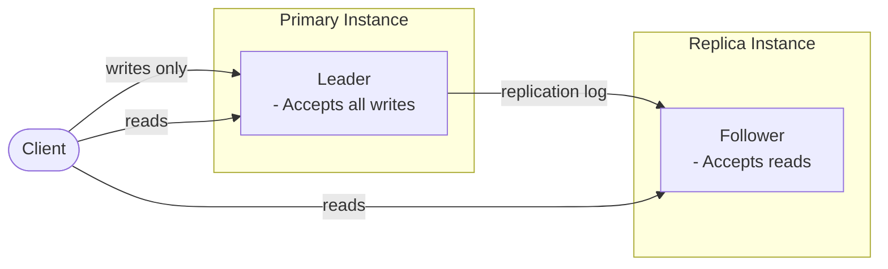
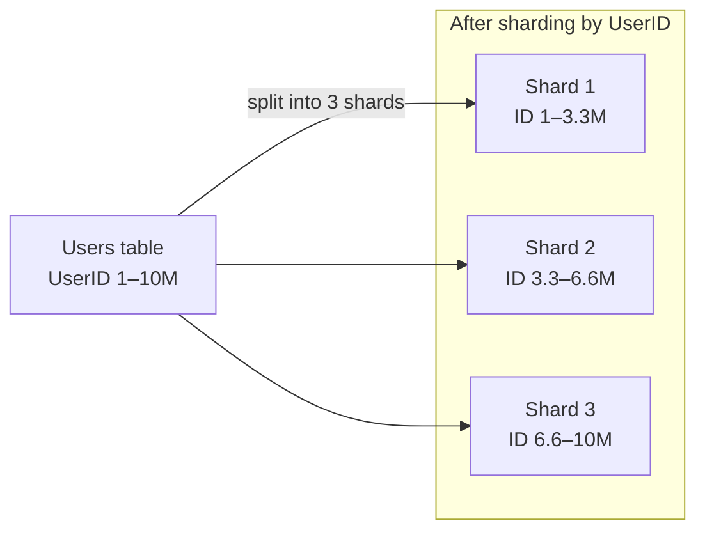

*[Grokking System Design](../../../README.md) · Module 2 — Storage Building Blocks · Day 4*

# Day 4 — Relational Databases: Indexing, Replication, and the Sharding Decision

> **Today's one idea:** A relational database buys you ACID transactions and flexible queries; the moment you shard it you sacrifice JOINs and cross-shard transactions — so sharding is a last resort chosen only when the trade-off analysis from [Day 2](../../01-design-methodology/days/day-02-trade-off-analysis.md) shows no other path to the required scale.
>
> **Reading time:** ~40 min · **Prereqs:** Days 1, 2
>
> **Primary source for today:** Kleppmann, Martin. *Designing Data-Intensive Applications.* O'Reilly, 2017 — Chapter 3 ("Storage and Retrieval," pp. 69–101) and Chapter 5 ("Replication," pp. 151–167).

---

## The Hook

You have been using Azure SQL for years. You know how to write queries, set up Entity Framework Core migrations, and add indexes when a query is slow. But one day a DBA opens a performance report and says:

> "This table has 800 million rows. Single-instance writes are saturating the CPU. We need to shard."

And you realise: you have been using the database without understanding it. You know *what* it does, but not *why* it works — and not *when* it stops working.

Today changes that. By the end, you will understand three things that every system designer needs about relational databases: how indexes make queries fast, how replication buys availability, and why sharding is a commitment so costly that you delay it as long as possible.

---

## Building the Intuition

### Indexes: The Filing Cabinet Analogy

Imagine a library with one million books, shelved in no particular order. You want "Designing Data-Intensive Applications" by Kleppmann. Without a catalogue, you check every shelf. That is an O(N) operation — one million comparisons in the worst case.

Now add a catalogue: an alphabetical card index by author name. You flip to K, then Kl, then Kle. Three comparisons for one million books. That is O(log N) — the power of a sorted index.

A database index works exactly like this catalogue. When you write `CREATE INDEX ix_users_email ON Users(Email)`, you are telling the database to maintain a sorted structure (a B-tree) on the `Email` column. Queries like `WHERE Email = 'alice@example.com'` now take O(log N) time instead of scanning every row.

**The B-tree in one picture:**

```
                    [Root Node]
                   M - T
                  /    |    \
           [A–M]   [M–T]   [T–Z]
           /   \   /   \   /   \
         ...   ... ...  ... ...  ...
                    ↕
              [Leaf Nodes: sorted rows / row pointers]
```

Every lookup starts at the root, compares the search key to find the right branch, and descends to a leaf node. For one million rows, the tree is ~20 levels deep — 20 comparisons, not one million.

**Azure SQL index types:**
- **Clustered index:** The table *is* the B-tree. Rows are physically stored in index order. Every Azure SQL table has exactly one clustered index (on the primary key by default). Range queries on the clustered key (e.g., `WHERE OrderDate BETWEEN ...`) are very fast.
- **Non-clustered index:** A separate B-tree that stores the indexed column values + a pointer to the clustered row. You can have many non-clustered indexes. Each one speeds up queries but slows down writes (the index must be updated on every INSERT/UPDATE/DELETE).

**The write trade-off:** Every index you add improves read speed and hurts write speed. A table with 10 non-clustered indexes updates 11 data structures on every write. This is why OLTP tables (high write frequency) carry fewer indexes than OLAP tables (high read frequency, rare writes).

---

### Replication: Multiple Copies for Availability

A single database instance is a single point of failure. One hardware failure and your data is unavailable — or worse, lost. Replication solves this by maintaining copies of the data on multiple nodes.

**Leader-follower replication (Azure SQL's model):**



The leader accepts all writes. It maintains a write-ahead log (WAL) that records every change. Followers replay this log to stay synchronised. Reads can go to either leader or follower — but reads from followers may be slightly stale (replication lag).

**What Azure SQL's Always On gives you:**
- **Synchronous replica (same region):** the leader waits for the replica to acknowledge the write before confirming to the client. Zero data loss, but adds ~1–2ms write latency.
- **Geo-redundant backup:** asynchronous replica in a different Azure region. Some lag (seconds to minutes), but protects against a full regional outage.
- **Automatic failover:** if the primary fails, Azure promotes the synchronous replica to primary. Failover takes 20–30 seconds.

**The consistency trade-off:** Reading from a follower gives you lower latency and higher read throughput — but you may read data that is a few milliseconds (or seconds for async replicas) behind the leader. This is called *replication lag*. For most applications this is fine. For systems where "read your own writes" is required (e.g., you update your profile and immediately read it back), you must route reads to the leader or use session consistency guarantees.

---

### Sharding: When One Machine Is Not Enough

Even with replication, your writes still go to a single leader. A single Azure SQL instance handles roughly 5,000–15,000 writes per second under normal OLTP conditions (depending on row size, index count, and hardware tier). If your write QPS exceeds this — or if your data size exceeds what one instance can store cost-effectively — you need to split the data across multiple database instances.

This is **sharding** (also called horizontal partitioning).

**The core idea:**



Each shard is a full, independent database instance. Queries that touch one shard are as fast as before. But:

**What sharding breaks:**
1. **JOINs across shards are gone.** A `JOIN Users ON Orders WHERE Users.UserID = Orders.UserID` is trivial in a single database. Across shards, the application must fetch data from multiple databases and join it in memory — expensive, complex, and error-prone.
2. **Cross-shard transactions require coordination.** ACID guarantees do not extend across database boundaries. A distributed transaction spanning two shards requires a two-phase commit protocol (covered on [Day 14](../../04-distributed-systems-reality/days/day-14-distributed-transactions.md)) — which is slow and adds failure modes.
3. **Shard key choice is permanent (or very painful to change).** Once you choose a shard key (e.g., `UserID`), resharding requires migrating massive amounts of data.

**The hotspot problem:** If you shard by a monotonically increasing key (e.g., `CreatedAt` or an auto-increment `OrderID`), all new writes go to the latest shard. That shard is a *hot partition* — it receives all the write load while the others sit idle.

Solution: use a **hash-based shard key**. Hash the shard key value and take `hash(UserID) % number_of_shards`. This distributes writes evenly across shards. The downside: range queries across all users (e.g., "all users who registered this week") now require querying all shards — a *scatter-gather* query.

**Before sharding, exhaust these options in order:**

| Option | What it buys | When it runs out |
|--------|-------------|------------------|
| Add indexes | Faster reads, no scale improvement for writes | Already done |
| Query optimisation | Reduce unnecessary work | Already done |
| Vertical scaling (bigger VM) | More CPU, RAM, IOPS | ~$5K/month tier is the ceiling before cost becomes prohibitive |
| Read replicas | Scale read QPS | Writes still go to one primary |
| Caching (Day 6) | Dramatically reduce read load on the database | Cannot help with write-heavy workloads |
| **Sharding** | Scale write QPS and storage | Last resort — use only when all above are insufficient |

---

## The Formal Picture

### Index Complexity

For a B-tree index on a table of N rows:
- **Read:** O(log N) — traverse the tree from root to leaf
- **Write (INSERT/UPDATE/DELETE):** O(log N) — find the correct leaf position + rebalance if necessary
- **Space:** O(N) — the index is proportional to the number of indexed rows

For Azure SQL, the clustered index is the table itself; every secondary (non-clustered) index stores a copy of the indexed columns plus the clustered key to look up the full row.

### Replication Modes

**Synchronous replication:**
- Leader waits for at least one follower to acknowledge write before returning success.
- Guarantees: zero data loss on leader failure (if the synchronous follower is promoted).
- Cost: every write incurs network round-trip latency to the follower (~1–5ms in-region).

**Asynchronous replication:**
- Leader returns success after writing to its own WAL; followers replay the log independently.
- Guarantees: lower write latency.
- Cost: if the leader fails before the follower catches up, the most recent writes are lost (RPO > 0).

Azure SQL uses synchronous replication for the in-region HA replica (Business Critical tier) and asynchronous for geo-redundant replicas (active geo-replication).

### The Sharding Formula

For hash-based sharding across S shards:

```
shard_number = hash(shard_key) % S
```

Where `hash()` is a deterministic hash function (e.g., FNV-1a, MurmurHash3). The same shard key always maps to the same shard. This enables single-shard lookups in O(1) — you know exactly which shard to query without interrogating all of them.

**Consistent hashing** (covered formally on [Day 13](../../04-distributed-systems-reality/days/day-13-cap-theorem.md)) extends this to handle adding or removing shards without rehashing all data.

---

## Decision Guide

### Choose Azure SQL (relational) when:
- ✅ ACID transactions are required — financial records, booking systems, inventory management
- ✅ Data has clear relational structure and meaningful foreign key relationships
- ✅ Complex queries with JOINs are the primary access pattern
- ✅ Write QPS is below ~10,000/sec and storage is below ~4TB in the near term
- ✅ Your team uses EF Core — the productivity advantage is real and measurable
- ✅ Audit trails, row-level security, or compliance requirements are in scope

### Don't choose Azure SQL when:
- ❌ Schema changes very frequently or varies significantly per record → consider Cosmos DB (document model, [Day 5](day-05-nosql.md))
- ❌ Write QPS > 10,000/sec and growing → consider Cosmos DB with autoscale RUs, or a purpose-built time-series or event store
- ❌ Primary access is by exact key with no JOINs needed → consider Azure Cache for Redis ([Day 6](day-06-caching.md)) or Azure Table Storage ([Day 5](day-05-nosql.md))
- ❌ You need multi-region active writes with < 10ms global latency → Cosmos DB with multi-region writes
- ❌ You are storing large binary objects (images, videos, documents) → Azure Blob Storage ([Day 7](day-07-blob-cdn-search.md))

### Azure SQL vs. Cosmos DB — the short version:

| Question | Lean Azure SQL | Lean Cosmos DB |
|----------|---------------|----------------|
| Do you need JOINs? | Yes | No |
| Is the schema fixed? | Yes | No |
| Is strong consistency required? | Yes | Tunable |
| Is write QPS > 10K/sec? | No | Yes |
| Is the data globally distributed? | No | Yes |
| Is the team familiar with SQL? | Yes | Doesn't matter |

---

## Where It Breaks / What It Is Not

**"Just add an index."** Adding an index is not free. A table with 15 non-clustered indexes that receives 5,000 writes/sec is writing to 15 B-trees simultaneously — every write is 15× more expensive than a no-index table. Always profile which indexes are actually used before adding new ones. Azure SQL's `sys.dm_db_index_usage_stats` shows exactly this.

**"Replication solves write scaling."** It does not. Replication scales reads — you can route read queries to replicas. But all writes still go to a single leader. If your bottleneck is write throughput, replication does not help.

**"Sharding is just a config option."** Sharding is an application-level responsibility in Azure SQL (unless you use Cosmos DB, which handles it transparently). Your application code must know which shard to talk to, handle cross-shard queries, and manage cross-shard consistency. This is significant engineering work — typically weeks of implementation and testing.

**"Cosmos DB eliminates sharding complexity."** Cosmos DB handles partitioning transparently, but it imposes the same underlying constraint: queries that cross partition boundaries are expensive (cross-partition fan-out). You still need to choose a partition key carefully. The difference is that Cosmos DB manages the physical shards; you just choose the key.

**"Every table needs a clustered index on the primary key."** This is the Azure SQL default, and it is usually right — but not always. For append-only log tables where you always read in chronological order, the `CreatedAt` timestamp is a better clustered index than a GUID primary key (GUIDs are random, causing fragmentation in the B-tree).

---

## Try It Yourself

### Exercise 1 — Index Design
A .NET API queries an `Orders` table (50 million rows) in three different ways:
1. `WHERE CustomerId = @id ORDER BY OrderDate DESC` — customer order history page
2. `WHERE Status = 'Pending' AND OrderDate < DATEADD(day, -7, GETUTCDATE())` — background job to find overdue orders
3. `WHERE OrderId = @id` — single order lookup (OrderId is the primary key / clustered index)

Query 3 is already fast (clustered index). Design the non-clustered indexes for queries 1 and 2.

<details>
<summary>Hint</summary>

For query 1: the leading column of the index should match the `WHERE` clause equality condition (`CustomerId`), then include the sort column (`OrderDate DESC`). For query 2: think about selectivity — `Status = 'Pending'` may match 20% of rows (low selectivity); `OrderDate < 7 days ago` narrows it further. Which column should lead?

</details>

<details>
<summary>Worked Solution</summary>

**Query 1:** `CREATE NONCLUSTERED INDEX ix_orders_customer ON Orders(CustomerId, OrderDate DESC)`

- Leading column `CustomerId` satisfies the equality filter, dramatically reducing the scan.
- Including `OrderDate DESC` as the second column means the result is already sorted — no sort step required.
- EF Core equivalent: `modelBuilder.Entity<Order>().HasIndex(o => new { o.CustomerId, o.OrderDate });`

**Query 2:** `CREATE NONCLUSTERED INDEX ix_orders_status_date ON Orders(OrderDate, Status) WHERE Status = 'Pending'`

- The `WHERE Status = 'Pending'` clause is a *filtered index* — it only indexes pending orders. This dramatically reduces index size if most orders are not pending.
- `OrderDate` leads because it is more selective in combination: pending + old date is a small set.
- Alternatively, if `Pending` orders are always a small percentage, leading with `Status` works too. Profile both.

**Trade-off accepted:** Two additional non-clustered indexes mean every INSERT and UPDATE to the Orders table writes to 3 B-trees (1 clustered + 2 non-clustered). At 500 orders/sec this is fine. At 50,000 orders/sec, consider whether the background job (query 2) could be served by a read replica instead.

</details>

---

### Exercise 2 — The Vertical Scaling Ceiling
Your system currently handles 2,000 write operations per second on a single Azure SQL instance (General Purpose, 8 vCores). The product team forecasts 4× growth over 18 months (→ 8,000 writes/sec).

Using the "exhaust options in order" framework, what steps do you take before considering sharding?

<details>
<summary>Hint</summary>

Work through the table in the "Building the Intuition" section. Check: indexing (already done?), query optimisation (profiled?), vertical scaling (what does moving to 32 vCores buy?), read replicas (does growth affect reads too?), caching (what fraction of writes could become reads if a cache absorbed repeated lookups?).

</details>

<details>
<summary>Worked Solution</summary>

**Step 1 — Vertical scaling:** Upgrade from General Purpose 8 vCores to Business Critical 32 vCores. Azure SQL Business Critical uses SSDs, in-memory OLTP capabilities, and has higher baseline write throughput (~10,000–20,000 writes/sec depending on workload). This alone may cover 4× growth. Cost: ~4× higher than the current tier.

**Step 2 — Read replicas:** If 40% of the 8,000 projected operations are reads disguised as writes (e.g., read-modify-write patterns), route those reads to a Business Critical read-only replica. This reduces load on the primary.

**Step 3 — Caching:** Profile the most frequently written records. If 60% of writes are updating the same hot rows (e.g., `inventory_count` for popular products), a Redis-based buffer (write-behind pattern) can batch those updates and reduce the write throughput to the database. See [Day 6](day-06-caching.md).

**Step 4 — Partition the schema, not the rows:** If the schema mixes high-write tables (e.g., `Events`) with low-write tables (e.g., `Users`), move the high-write tables to a separate Azure SQL instance. This is not sharding — it is *vertical partitioning* by table, and preserves JOINs within each partition.

**Only after all four steps are exhausted:** Consider sharding. By that point you likely also want to evaluate whether Cosmos DB with autoscale RUs is a better fit than manually managed Azure SQL shards.

</details>

---

### Exercise 3 (Stretch) — Shard Key Selection
You are sharding an e-commerce `Orders` table (1 billion rows, 20,000 writes/sec) across 4 Azure SQL shards. Three shard key candidates:

- **Option A:** `OrderId` (auto-incrementing integer)
- **Option B:** `CustomerId` (UUID, randomly distributed)
- **Option C:** `CreatedAt` (timestamp)

For each, explain the access pattern implications and identify which creates a hot partition problem.

<details>
<summary>Hint</summary>

For each candidate, ask: (1) where do new writes go — one shard or distributed? (2) what is the most common query pattern and does it map to a single shard? (3) what cross-shard scatter-gather queries does this force?

</details>

<details>
<summary>Worked Solution</summary>

**Option A — OrderId (auto-increment):** Creates a severe hot partition. All new orders get the highest OrderId values, which always hash to the same range in a range-based scheme, or distribute unevenly under modulo until the ID space fills up. Modulo sharding: `OrderId % 4` distributes writes evenly initially, but range queries (`WHERE OrderId BETWEEN x AND y`) always go to all 4 shards (scatter-gather). **Verdict: avoid as a shard key for range queries; acceptable if all lookups are by exact OrderId.**

**Option B — CustomerId (UUID, random):** Excellent write distribution — UUIDs are random, so `hash(CustomerId) % 4` spreads writes evenly. Most important query: "get all orders for customer X" — this maps to exactly one shard. **Verdict: best choice for this workload.** Dominant trade-off: cross-customer queries (e.g., "all orders for all customers in region Y") require scatter-gather across all 4 shards. Acceptable if those queries are rare or run as batch jobs.

**Option C — CreatedAt (timestamp):** Creates a hot partition identical to Option A. All writes go to the "current time" shard. **Verdict: catastrophically wrong for high-write OLTP.** Timestamp sharding is only reasonable for archival workloads where old shards become cold and are moved to cheaper storage.

</details>

---

## Connect It Back

On [Day 2](../../01-design-methodology/days/day-02-trade-off-analysis.md) you learned that every design decision is a trade-off between quality attributes. Today you saw that trade-off in a very specific form: every index you add trades write speed for read speed; every replication follower trades write latency for availability; every shard you add trades cross-entity query flexibility for write throughput and storage scale.

Tomorrow on Day 5, you will encounter the four NoSQL data models — each of which makes a more extreme version of one of today's trade-offs. Document databases trade JOIN flexibility for schema flexibility. Key-value stores trade all query expressiveness for sub-millisecond lookup speed. Understanding today's relational model is what makes tomorrow's NoSQL trade-offs legible.

**The question you should be able to answer now that you couldn't this morning:**

*Your Azure SQL query is slow. You add a non-clustered index on the `WHERE` clause column and the query is now fast — but your DBA warns that inserts slowed down by 15%. Is this a bug or expected behaviour? Why?*

---

## Suggested Readings for Today

**Required if you have 15 extra minutes:**
Kleppmann, *DDIA*, Chapter 3, pp. 69–79 — "Data Structures That Power Your Database." The B-tree vs. LSM-tree comparison here is the clearest single-source explanation of why different index structures have different read/write profiles. Reading this makes Azure SQL's clustered index behaviour (B-tree) and Cosmos DB's underlying storage engine (LSM-tree, optimised for writes) both make sense.

**If you want the deep version:**

- Kleppmann, *DDIA*, Chapter 5, pp. 151–167 — "Leaders and Followers." The formal treatment of leader-follower replication: replication logs, handling node failures, replication lag, and read-after-write consistency. This is what Azure SQL's Always On availability groups implement.

- Xu, *System Design Interview* Vol. 1, Chapter 1, pp. 6–10 — "Database Replication" section. A concise diagram-heavy walkthrough of the same concepts above — useful as a quick visual reference after reading Kleppmann.

- Malan, CS75 Scalability lecture, timestamp ~40:00–55:00 — The vertical-then-horizontal scaling narrative from a real system's perspective. Directly maps to the "exhaust options in order" table in this page's Building the Intuition section.

---

← [Day 3 — Drawing Systems: C4 and the System Design Vocabulary](../../01-design-methodology/days/day-03-c4-model-vocabulary.md) &nbsp;|&nbsp; [Day 5 — NoSQL: Document, Key-Value, Wide-Column, and Graph →](day-05-nosql.md)
