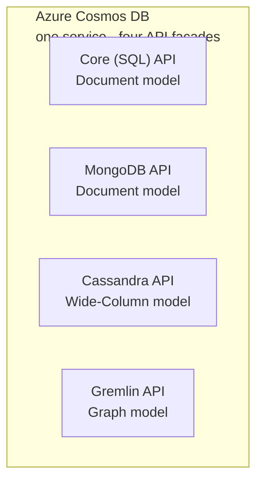

*[Grokking System Design](../../../README.md) · Module 2 — Storage Building Blocks · Day 5*

# Day 5 — NoSQL: Document, Key-Value, Wide-Column, and Graph — When Each Wins

> **Today's one idea:** "NoSQL" is not a single thing — it is four completely different data models each optimising a specific access pattern that relational databases handle poorly at scale, and applying the [trade-off framework from Day 2](../../01-design-methodology/days/day-02-trade-off-analysis.md) to your *access pattern*, not your team's familiarity, is the only defensible way to choose between them.
>
> **Reading time:** ~40 min · **Prereqs:** Days 2, 4
>
> **Primary source for today:** Kleppmann, Martin. *Designing Data-Intensive Applications.* O'Reilly, 2017 — Chapter 2, "Data Models and Query Languages," pp. 27–63.

---

## The Hook

A developer joins a new project. The tech lead says: "We're using MongoDB."

The developer asks why.

"Because it's flexible. You don't need a schema."

Three months later, the same developer is debugging a production incident. The application is running complex queries that join "documents" by embedding references and resolving them in application code. The queries take 800ms. There are three different shapes of the same document type in the database because "we were moving fast." The lack of a schema did not eliminate complexity — it moved it into the application.

Meanwhile, a different team chose Azure Table Storage for a similar project. It is blazing fast for key lookups and costs almost nothing. But they needed a range query last month and it took six hours to implement a workaround.

Both teams chose NoSQL. Both teams chose wrong — not because NoSQL was wrong, but because they did not choose *which* NoSQL, or *why*.

Today you learn to make that choice correctly.

---

## Building the Intuition

The word "NoSQL" is a historical accident — it originally meant "not only SQL" and was a catch-all for any database that was not relational. But underneath that label live four completely different animals, each built for a different problem:

| Model | The Analogy | Primary Access Pattern |
|-------|-------------|----------------------|
| **Document** | A JSON file drawer | Read/write whole entities by ID or simple filter |
| **Key-Value** | A dictionary / hashmap | Read/write by exact key, sub-millisecond |
| **Wide-Column** | A spreadsheet designed at write time | Append-heavy, known query shape at design time |
| **Graph** | A map of relationships | Traverse connections between entities |

The reason none of these replaced relational databases is that *each sacrifices something the relational model gives you for free*. Understanding what each sacrifices — and when that sacrifice is acceptable — is the entire decision.

---

## The Four Models

### 1. Document Databases

**What it is:** Stores data as self-contained JSON (or BSON, or XML) documents. Each document can have a different shape. There is no fixed schema enforced by the database.

**The access pattern it optimises:** Reading or writing a complete entity — an order with its line items, a user profile with their preferences, a product with its variants. The entity arrives and departs as a single document, with no need to JOIN multiple tables.

**In Azure:** Cosmos DB Core (SQL) API and Cosmos DB for MongoDB API.

**Why it is fast for its use case:**
```
Relational — "Get order #12345 with all line items":
  SELECT o.*, li.* FROM Orders o
  JOIN LineItems li ON li.OrderId = o.OrderId
  WHERE o.OrderId = 12345
  → 2 table reads + 1 join

Document — "Get order #12345":
  db.orders.find({ orderId: "12345" })
  → 1 document read (line items are embedded in the document)
```

One disk read vs. two plus a join. For entity-centric access patterns, documents win.

**What it gives up:** Cross-document JOINs. If you need to find all orders for a customer across all customers and correlate with their account status, you either embed everything (document bloat) or reference documents (forcing application-side joins — which is slower and harder). The relational model handles this trivially with a JOIN.

**The "flexible schema" trap:** Schema-less does not mean schema-free. It means the *database* does not enforce the schema — *your application* does. When you upgrade a field name, you now have three generations of documents with different shapes in production. This is not simpler than a migration; it is a migration distributed invisibly through your data.

---

### 2. Key-Value Stores

**What it is:** A giant dictionary: `key → value`. The value is opaque — the database does not inspect or index it. Operations: `GET(key)`, `SET(key, value)`, `DELETE(key)`.

**The access pattern it optimises:** Sub-millisecond lookup by exact key. Caching, session storage, leaderboards, rate limiting counters, distributed locks.

**In Azure:** Azure Cache for Redis (rich operations on values), Azure Table Storage (cheap, durable, simple).

**Why it is fast:**
- No query planning (there is only one operation: key lookup)
- In-memory storage (Redis): every operation is RAM speed, not disk speed
- No schema parsing or validation overhead

**Redis goes beyond simple GET/SET.** Redis is technically a key-value store, but values can be typed: strings, lists, hashes, sorted sets, bitmaps, streams. This typing is what makes Redis useful for more than just caching:

```
# Leaderboard (sorted set — ZADD is O(log N))
ZADD leaderboard 1500 "alice"    # alice scored 1500
ZADD leaderboard 2300 "bob"      # bob scored 2300
ZRANK leaderboard "alice"        # → rank 1 (0-indexed from bottom)
ZRANGE leaderboard 0 9 REV WITHSCORES  # top 10 players

# Rate limiting (atomic increment + TTL)
INCR rate:user:alice:2024-01-15:14  # increment this minute's counter
EXPIRE rate:user:alice:2024-01-15:14 60  # expire after 60 seconds

# Session store (hash)
HSET session:abc123 userId 42 role admin expiresAt 1705320000
HGETALL session:abc123  # retrieve all session fields
```

**What it gives up:** Range queries, filtering, and relationships. You cannot ask Redis "find all users who registered between date X and date Y" — there is no way to query by value without scanning every key. If you need those queries, you need a different store (relational or document).

---

### 3. Wide-Column Stores

**What it is:** Organises data as rows identified by a *row key*, where each row can have a different set of columns grouped into *column families*. The key insight: the schema is designed around the query, not around the data.

**The access pattern it optimises:** High-volume append workloads, time-series data, and scenarios where queries are known at design time and data can be denormalised to fit them.

**In Azure:** Cosmos DB for Apache Cassandra API.

**The time-series example:**

In a relational model, storing IoT sensor readings:
```sql
CREATE TABLE SensorReadings (
  SensorId   VARCHAR(36),
  Timestamp  DATETIME,
  Temperature FLOAT,
  Humidity    FLOAT,
  PRIMARY KEY (SensorId, Timestamp)
)
```

In Cassandra/wide-column:
```cql
CREATE TABLE sensor_readings_by_hour (
  sensor_id   TEXT,
  hour        TIMESTAMP,
  readings    MAP<TIMESTAMP, FROZEN<reading_value>>,
  PRIMARY KEY (sensor_id, hour)
) WITH CLUSTERING ORDER BY (hour DESC);
```

The Cassandra schema is designed specifically for the query "get the last N hours of readings for sensor X." The data is pre-sorted and co-located on disk exactly as you will read it. Writes are appends (fast). Reads are sequential scans of pre-sorted data (fast). Ad-hoc queries are painful (slow or impossible).

**What it gives up:** Ad-hoc queries. In Cassandra, "I want to query a column I did not design into the partition key" requires either a full-table scan or a separate denormalised table. This is why Cassandra developers say "design your tables around your queries" — the query comes first, the schema is derived from it.

---

### 4. Graph Databases

**What it is:** Stores data as *nodes* (entities) and *edges* (relationships), each with properties. The native query is *traversal*: "start at this node, follow these edge types, find all connected nodes."

**The access pattern it optimises:** Systems where the *relationship* between entities is the primary query axis.

**In Azure:** Cosmos DB for Gremlin (Apache TinkerPop).

**Why relational struggles with graph queries:**

A social network "friends of friends" query in SQL:
```sql
-- People who are friends with Alice's friends (2 hops)
SELECT DISTINCT u3.Name
FROM Users u1
JOIN Friendships f1 ON u1.UserId = f1.UserId1
JOIN Users u2 ON f1.UserId2 = u2.UserId
JOIN Friendships f2 ON u2.UserId = f2.UserId1
JOIN Users u3 ON f2.UserId2 = u3.UserId
WHERE u1.Name = 'Alice' AND u3.UserId != u1.UserId
```

In Gremlin (graph query language):
```groovy
g.V().has('name', 'Alice')   // Start at Alice
  .out('friend')              // Hop 1: her friends
  .out('friend')              // Hop 2: their friends
  .dedup()                    // Remove duplicates
  .values('name')             // Return names
```

The Gremlin query is not just shorter — it is faster. Graph databases store edges as direct pointers between nodes (index-free adjacency), so each hop is O(1). The SQL query requires four table scans and three joins that grow with N², not linearly.

**What it gives up:** Large-scale analytics. If you need to aggregate across all nodes ("average age of all users"), a graph database scans every node — there is no index for that. Analytical workloads belong in relational or columnar stores.

**When graph is justified:** Fraud detection (transaction networks), recommendation engines (product co-purchase graphs), social networks, and knowledge graphs. These are the cases where multi-hop relationship traversal is the primary access pattern.

---

## The Cosmos DB API Selection Framework

Azure Cosmos DB is a single managed service that implements all four models behind different API facades. This is powerful but creates a selection decision: which API?



**Decision flow:**

```
Are you migrating from an existing MongoDB deployment?
  Yes → Cosmos DB for MongoDB API (wire-compatible; minimise code changes)
  No ↓

Are you migrating from an existing Cassandra deployment?
  Yes → Cosmos DB for Cassandra API
  No ↓

Is the primary query traversal of relationships (fraud, social, recommendations)?
  Yes → Cosmos DB for Gremlin API
  No ↓

Default: Cosmos DB Core (SQL) API
  - Full SQL-like query language over JSON documents
  - Best Azure portal tooling, best .NET SDK support
  - Change feed built in (event streaming from writes — used in CQRS patterns)
```

**Partition key selection in Cosmos DB:** This is the Cosmos equivalent of the shard key decision from [Day 4](day-04-relational-databases.md). The partition key determines how data is distributed across physical partitions. Rules:
1. Choose a key with **high cardinality** (many distinct values) — prevents hot partitions
2. Choose a key that **appears in most queries** — avoids cross-partition fan-out
3. For an e-commerce orders container: `customerId` is usually the right partition key (each customer's orders land on one partition; most queries are "orders for customer X")

---

## Decision Guide

### Choose Document (Cosmos DB Core API) when:
- ✅ Data is naturally hierarchical (order + line items, post + comments) and read/written as a unit
- ✅ Schema varies across records (product catalogue with different attribute sets per category)
- ✅ You need flexible queries over JSON fields but not multi-document JOINs
- ✅ You need global distribution with tunable consistency ([Day 13](../../04-distributed-systems-reality/days/day-13-cap-theorem.md))
- ✅ You want the change feed for event-driven patterns ([Day 10](../../03-compute-communication-building-blocks/days/day-10-async-messaging.md))

### Choose Key-Value (Azure Cache for Redis) when:
- ✅ Sub-millisecond latency is required
- ✅ The access pattern is always by exact key
- ✅ You need specialised data structures: sorted sets (leaderboards), pub/sub, distributed locks
- ✅ Data is derived or cacheable (can be reconstructed from a durable source)

### Choose Key-Value (Azure Table Storage) when:
- ✅ You need durable key-value storage at very low cost (much cheaper than Cosmos DB)
- ✅ Access is always by PartitionKey + RowKey (exact lookup or partition scan)
- ✅ The data volume is large but query complexity is minimal

### Choose Wide-Column (Cosmos DB Cassandra API) when:
- ✅ Write-heavy append workload (IoT telemetry, event logging, audit trails)
- ✅ Queries are known at design time and can be modelled as partition key + clustering key
- ✅ Migrating from an existing Apache Cassandra deployment

### Choose Graph (Cosmos DB Gremlin API) when:
- ✅ The primary query is multi-hop relationship traversal (2–10 hops)
- ✅ Use case is fraud detection, recommendations, social graphs, or knowledge graphs
- ✅ Relationship density is high (each node connects to many others)

### The "just use SQL" default:
If none of the above clearly applies — use Azure SQL. The productivity advantage of EF Core + LINQ + mature tooling is real. Do not pay the NoSQL complexity tax unless you have a concrete requirement that SQL cannot meet at your scale.

---

## Where It Breaks / What It Is Not

**"NoSQL scales; SQL doesn't."** Both scale. Azure SQL scales to hundreds of thousands of read QPS with replicas and caching. Cosmos DB Serverless scales to zero cost at zero traffic. The relevant question is not "which scales?" but "which scales for *this specific access pattern* at *this specific cost*?"

**"Schema-less means no data problems."** Schema-less means schema-invisible. The schema lives in your application code and your team's collective memory. When a new developer joins and reads the database directly, there is no schema to read. This is a maintainability liability, not an asset. Cosmos DB's schema validation (via JSON Schema constraints) and .NET's `JsonSerializerOptions` are partial mitigations.

**"Embedding is always better than referencing in documents."** Embedding (putting related data inside a parent document) optimises for read performance. Referencing (storing a foreign key) optimises for write performance and avoids document bloat. A product document that embeds all 5,000 customer reviews is reading 5,000 reviews on every product page load. Embed what you always read together; reference what you sometimes need.

**"Cosmos DB is expensive."** It is expensive when over-provisioned or when the access pattern doesn't justify it. Azure Table Storage (key-value, durable) costs roughly 1/10th of Cosmos DB for the same data volume. If your access pattern is simple key lookups on cold data, Table Storage is the right choice.

---

## Try It Yourself

### Exercise 1 — Access Pattern to Data Model
For each of the following systems, identify the most appropriate data model (relational, document, key-value, wide-column, or graph) and justify your choice using the quality attributes from [Day 2](../../01-design-methodology/days/day-02-trade-off-analysis.md).

1. An e-commerce product catalogue where each product category has different attributes (electronics have voltage specs; clothing has size charts; food has nutritional info).
2. A fraud detection system that needs to identify whether two users share a device, a phone number, and a billing address within a transaction network.
3. A financial transactions ledger that records 50,000 writes per second, retains records for 7 years, and is queried by account ID + date range.

<details>
<summary>Hint</summary>

For (1): the varying attributes per category are a strong signal. For (2): what is the primary query? "Find all nodes connected to this suspicious account within 3 hops." For (3): write rate + known query shape at design time.

</details>

<details>
<summary>Worked Solution</summary>

**(1) Product catalogue → Document (Cosmos DB Core API)**
The varying attributes per category make a fixed relational schema either extremely wide (100+ nullable columns) or normalised into an EAV (Entity-Attribute-Value) anti-pattern. A document model stores each product as a JSON document with its own attribute set. Access pattern: "get product by ID" or "filter products by category + price range" — both map naturally to Cosmos DB queries. Partition key: `categoryId`.

**(2) Fraud detection → Graph (Cosmos DB Gremlin API)**
The query "are these two users connected via shared devices, phones, or addresses within 3 hops?" is a multi-hop traversal. In SQL, 3 hops requires 6 JOINs across potentially billions of rows — performance degrades to O(N²) or worse. In a graph database, each hop is O(1) per edge (index-free adjacency). The relationship *is* the data.

**(3) Financial ledger → Wide-Column (Cosmos DB Cassandra API)**
50,000 writes/sec is write-heavy. The query is always "transactions for account X between date Y and Z" — a known access pattern at design time. This maps perfectly to Cassandra's partition key (`accountId`) + clustering column (`transactionDate DESC`). Azure SQL could handle this with sharding, but the known query shape and append-only nature makes Cassandra a natural fit. Cosmos DB Cassandra API handles 7-year retention via TTL policies.

</details>

---

### Exercise 2 — Cosmos DB API and Partition Key
You are designing the data model for a multi-tenant SaaS application. Each tenant has users, and each user has activity events (login, page views, exports). You need to:
- Retrieve all activity for a specific user in the last 30 days
- Retrieve all users in a tenant
- Count total events per tenant per day (for billing)

Choose the Cosmos DB API and partition key for the `ActivityEvents` container.

<details>
<summary>Hint</summary>

There is a tension: "events per user" suggests partitioning by `userId`, but "events per tenant" suggests `tenantId`. Consider which query is more frequent, and whether a composite key or two separate containers solves the tension.

</details>

<details>
<summary>Worked Solution</summary>

**API:** Cosmos DB Core (SQL) API — no migration constraint, best .NET tooling, SQL queries work well for this document structure.

**Partition key design:**

The tension between `userId` and `tenantId` is a classic hot-partition vs. cross-partition trade-off.

**Option A — Partition by `userId`:**
- "Events for user X last 30 days" → single partition, fast.
- "Events for tenant T" → cross-partition fan-out, slow.
- "Events per tenant per day" → requires cross-partition aggregation, expensive.

**Option B — Partition by `tenantId`:**
- "Events for tenant T" → single partition, fast.
- "Events for user X" → single partition (user belongs to one tenant), fast if you filter by `userId` within the partition.
- Risk: a large tenant (100K users, millions of events) becomes a *logical hot partition* — all their data lands in one partition, hitting the 20GB per logical partition limit.

**Recommended: Composite partition key `tenantId_userId`:**
```json
{
  "partitionKey": "tenant-123_user-456",
  "userId": "user-456",
  "tenantId": "tenant-123",
  "eventType": "login",
  "timestamp": "2024-01-15T14:23:00Z"
}
```
- "Events for user X" → single partition query (partition key = `tenantId_userId`), fast.
- "Events for tenant T" → cross-partition fan-out, but use the Cosmos DB change feed + an Azure Function to maintain a pre-aggregated `DailyBillingSummary` container (partition key: `tenantId`). Billing queries hit the summary container, not the events container.

This is the **CQRS pattern** at the data layer: write events with a user-level partition key (optimised for per-user queries); maintain a read-optimised projection (summary container) for tenant-level billing. You will see this pattern formally on [Day 10](../../03-compute-communication-building-blocks/days/day-10-async-messaging.md).

</details>

---

### Exercise 3 (Stretch) — When Relational is Still Right
A team is building a healthcare appointment booking system. Patients book appointments with doctors at clinics. The tech lead proposes Cosmos DB because "it scales."

Make the case for Azure SQL using the trade-off framework. What quality attributes favour SQL, and what is the dominant trade-off you accept?

<details>
<summary>Hint</summary>

What are the most important quality attributes for a booking system? Think about: can two patients book the same appointment slot? What happens to the data if a doctor moves to a different clinic? How complex are the queries ("show all of Dr. Smith's appointments on Tuesday")?

</details>

<details>
<summary>Worked Solution</summary>

**Quality attribute priority for a healthcare booking system:**
1. **Consistency (highest):** Double-booking an appointment slot is a critical failure. This requires a transaction that checks availability and creates the booking atomically — a classic ACID use case.
2. **Queryability:** "All appointments for Dr. Smith on Tuesday," "all appointments a patient has upcoming," "all patients with appointments at Clinic X this month" — these are multi-entity JOINs across Patients, Doctors, Clinics, and Appointments.
3. **Data integrity:** A doctor who leaves a clinic should not leave dangling appointments — foreign key constraints enforce this at the database level.
4. **Scalability (lower priority):** Healthcare appointment volume is bounded. A medium-sized practice handles hundreds, not millions, of appointments per day.

**The case for Azure SQL:**
```
Trade-off Matrix (Weight: Consistency=5, Queryability=4, Integrity=3, Scalability=2)

                    Azure SQL    Cosmos DB
Consistency         3 (ACID)     2 (tunable)
Queryability        3 (JOINs)    2 (no cross-doc JOIN)
Data Integrity      3 (FK)       1 (no FK enforcement)
Scalability         2            3

Weighted Total:     (3×5)+(3×4)+(3×3)+(2×2) = 15+12+9+4 = 40
                    (2×5)+(2×4)+(1×3)+(3×2) = 10+8+3+6  = 27
```

**Decision:** Azure SQL, by a wide margin.

**Dominant trade-off accepted:** If the system ever needed to scale beyond ~10,000 bookings per second globally, Azure SQL would need sharding. Given healthcare appointment volume, that constraint is irrelevant for any foreseeable future. We accept the scalability ceiling because the consistency and queryability wins are non-negotiable for this domain.

**ADR one-liner:** "We chose Azure SQL over Cosmos DB because appointment booking requires atomic slot-locking transactions and multi-entity JOINs that the document model cannot provide; we accept the scalability ceiling as the system will never exceed ~1,000 concurrent writes."

</details>

---

## Connect It Back

On [Day 4](day-04-relational-databases.md) you learned that the relational model's power — JOINs, ACID, flexible queries — comes with write-scale limits and a fixed schema requirement. Today you learned that each NoSQL model trades that power for something specific: document databases trade JOINs for schema flexibility and entity-centric access; key-value stores trade all query expressiveness for sub-millisecond speed; wide-column stores trade ad-hoc queries for write-heavy append performance; graph databases trade analytics for multi-hop traversal.

Tomorrow on [Day 6](day-06-caching.md), you add the building block that sits *in front of* your storage layer — the cache. A cache does not replace any of today's four models; it reduces the load on whichever one you chose. The decision about *what* to cache, *where* to cache it, and *when* to invalidate it is as nuanced as any of today's data model decisions.

**The question you should be able to answer now that you couldn't this morning:**

*A colleague says "we should use Cosmos DB for our new service because it's more flexible than Azure SQL." What is the first question you ask — and why is it a question about queries, not about schema?*

---

## Suggested Readings for Today

**Required if you have 15 extra minutes:**
Kleppmann, *DDIA*, Chapter 2, pp. 27–42 — "Relational Model Versus Document Model." This section is the clearest single-source treatment of why document models exist and what they sacrifice. Reading pp. 38–42 ("Which data model leads to simpler application code?") directly addresses the "Cosmos DB is simpler" myth.

**If you want the deep version:**

- Kleppmann, *DDIA*, Chapter 2, pp. 49–63 — "Graph-Like Data Models." The formal treatment of graph databases, the property graph model, and the Cypher/SPARQL/Datalog query languages. Worth reading before any project involving recommendation engines or fraud detection.

- Chang et al., "Bigtable: A Distributed Storage System for Structured Data." Sections 1–3 (pp. 1–5). This is the paper behind Cassandra and the Cosmos DB Cassandra API. Reading the "Data Model" section explains why wide-column was designed the way it is — the access pattern motivation is explicit in the paper.

- Microsoft Docs: "Choose an API in Azure Cosmos DB." https://learn.microsoft.com/en-us/azure/cosmos-db/choose-api — Microsoft's own decision guide with a comparison table. Useful as a cross-reference after today's page.

---

← [Day 4 — Relational Databases: Indexing, Replication, and the Sharding Decision](day-04-relational-databases.md) &nbsp;|&nbsp; [Day 6 — Caching: What to Cache, Where to Cache, and When Not To →](day-06-caching.md)
