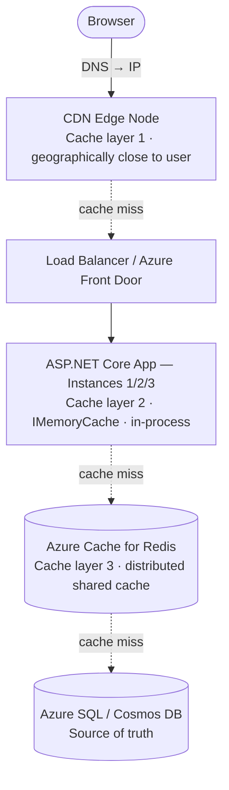
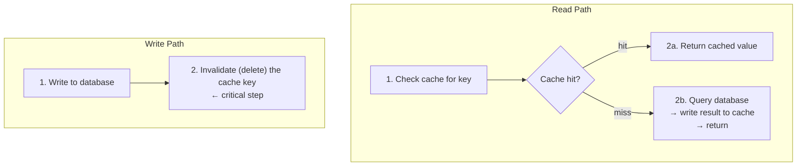
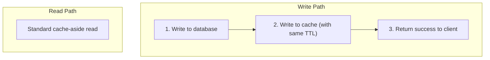
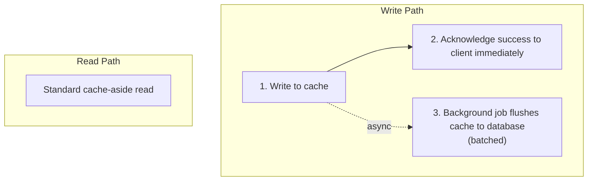

*[Grokking System Design](../../../README.md) · Module 2 — Storage Building Blocks · Day 6*

# Day 6 — Caching: What to Cache, Where to Cache, and When Not To

> **Today's one idea:** A cache is a bet that the same data will be requested again before it changes — the placement strategy, the invalidation pattern, and the eviction policy determine whether that bet pays off or creates a failure mode harder than the slow database you were trying to fix.
>
> **Reading time:** ~40 min · **Prereqs:** Days 2, 4, 5
>
> **Primary source for today:** Xu, Alex. *System Design Interview*, Vol. 1, ByteByteGo, 2020 — Chapter 15, "Design a Cache System" (pp. 261–284).

---

## The Hook

Your team runs an e-commerce platform. 50,000 products in the catalogue. Three million page views per day. You pull up the database monitoring dashboard and see this:

- CPU: 87% sustained
- Slow queries log: 4,000 queries over 500ms in the last hour
- Top query (by frequency): `SELECT * FROM Products WHERE ProductId = @id` — called 2.8 million times per day

You add indexes. CPU drops to 79%. Still red.

Your DBA says: "Add more read replicas."

Your senior engineer says: "Add a cache."

They are both right — but in a different order, and for different reasons. The read replica scales your *read capacity*. The cache eliminates the reads entirely for data that has not changed.

Here is what nobody tells you: a cache done wrong creates a *harder* problem than a slow database. A slow database is slow consistently. A cache with broken invalidation serves *wrong data confidently* — and confident wrong answers are worse than slow right answers.

Today you learn to do it right.

---

## Building the Intuition

### The Bet

Every cache is a bet:

> "I believe this data will be requested again before it changes, and the cost of storing a copy is less than the cost of computing it again."

When the bet is right, the cache pays off: faster response, less database load, lower cost. When the bet is wrong, you pay the cache penalty: stale data in front of users, invalidation complexity in your code, and a second system to operate and monitor.

The decision of *whether* to cache, *where* to put the cache, and *what invalidation strategy to use* is the same trade-off framework from [Day 2](../../01-design-methodology/days/day-02-trade-off-analysis.md) — just applied to a specific building block.

### The Request Path: Where Can a Cache Live?

A request from a user's browser to your database travels through multiple layers. A cache can be inserted at any of them:



Each layer has a different trade-off:

| Layer | Speed | Shared Across Instances? | Capacity | Best For |
|-------|-------|--------------------------|----------|---------|
| CDN | Sub-10ms globally | Yes (edge-shared) | Unlimited (paid) | Static assets, public API responses |
| IMemoryCache (.NET) | Sub-microsecond | No (per-instance) | Limited by pod RAM | Hot data for single-instance services |
| Azure Cache for Redis | Sub-millisecond | Yes | Configurable | Sessions, distributed state, leaderboards |
| Database query cache | Variable | Yes | Limited | Rarely justified (see "Where it breaks") |

For most Azure .NET services, the practical question is: **IMemoryCache vs. Azure Cache for Redis**.

Use `IMemoryCache` when:
- Your service runs as a single instance, **or**
- The cached data is instance-specific (local computation results), **or**
- You can tolerate different instances serving slightly different data for a few seconds

Use Azure Cache for Redis when:
- Your service scales to multiple instances (App Service scale-out, AKS pods), **and**
- Consistency across instances matters (e.g., you update a user's session and need every instance to see the update)

---

## The Three Invalidation Patterns

Choosing *when* to write to the cache is as important as choosing *where* to put it.

### Pattern 1: Cache-Aside (Lazy Loading)

The most common pattern. The application manages the cache explicitly.



**.NET implementation with Azure Cache for Redis:**

```csharp
public async Task<Product> GetProductAsync(string productId)
{
    var cacheKey = $"product:{productId}";

    // Step 1: try the cache
    var cached = await _redis.GetStringAsync(cacheKey);
    if (cached is not null)
        return JsonSerializer.Deserialize<Product>(cached)!;

    // Step 2: cache miss — query the database
    var product = await _db.Products
        .FirstOrDefaultAsync(p => p.ProductId == productId);

    if (product is null) return null!;

    // Step 3: populate the cache with a TTL
    var options = new DistributedCacheEntryOptions
    {
        AbsoluteExpirationRelativeToNow = TimeSpan.FromMinutes(10)
    };
    await _redis.SetStringAsync(
        cacheKey,
        JsonSerializer.Serialize(product),
        options);

    return product;
}

public async Task UpdateProductAsync(Product product)
{
    // Write to database first
    _db.Products.Update(product);
    await _db.SaveChangesAsync();

    // Invalidate the cache — do NOT update it here
    // (updating risks a race condition; invalidation is safer)
    await _redis.RemoveAsync($"product:{product.ProductId}");
}
```

**Why invalidate instead of update?** Updating the cache on write creates a race condition: two concurrent writes could race to update the cache, leaving the older write's value cached after the newer write. Deleting the cache key is atomic — the next read will miss and re-populate from the now-correct database.

**Trade-offs:**
- ✅ Only caches data that is actually requested (no wasted memory)
- ✅ Cache failures are transparent — the system falls back to the database
- ❌ Cache misses add database latency (the double-read problem)
- ❌ Briefly stale data possible if invalidation is missed or delayed

---

### Pattern 2: Write-Through

Write to the database and the cache simultaneously on every write.



**Trade-offs:**
- ✅ Cache is always consistent with the database for recently-written data
- ✅ No cold-start problem — data is in the cache as soon as it is written
- ❌ Every write is slower (two writes: database + cache)
- ❌ Cache may fill with cold data that is never read again (you wrote it, but nobody ever read it)
- ❌ If the cache write fails after the database write, you have an inconsistency

**When write-through is right:** Systems where read-after-write consistency is critical and the write latency overhead is acceptable — e.g., a user updates their profile and immediately lands on the profile page, which must show the new data.

---

### Pattern 3: Write-Behind (Write-Back)

Write to the cache only; flush to the database asynchronously.



**Trade-offs:**
- ✅ Writes are extremely fast (in-memory only)
- ✅ Database write load is reduced (batching multiple writes into one)
- ❌ **Data loss risk:** if the cache crashes before the background flush, writes are lost
- ❌ Highest implementation complexity of the three patterns
- ❌ Cache becomes a primary store, not a secondary one — changing its reliability requirements

**When write-behind is right:** Very rare in Azure .NET workloads. Most appropriate for append-only, high-volume, loss-tolerant data: analytics events, metrics aggregations, game activity logs. For anything where a user would notice data loss, write-behind is not appropriate.

---

## Eviction Policies

A cache has finite memory. When it fills, the cache must evict entries to make room. The eviction policy determines *which* entries are removed.

**LRU (Least Recently Used):**
Evict the entry that was accessed least recently. The assumption: if you have not needed it recently, you probably won't need it soon.

```
Cache state (4 slots): [A, B, C, D]  (A = most recent, D = least recent)
Request for E (not in cache):
→ Evict D (least recently used)
→ Add E: [E, A, B, C]
```

**Best for:** General-purpose caches with relatively uniform access frequency. Azure Cache for Redis uses LRU by default.

**LFU (Least Frequently Used):**
Evict the entry accessed the fewest times overall. The assumption: frequently accessed items are likely to be accessed again.

```
Access counts: A=100, B=3, C=50, D=1
Cache full, need to add E:
→ Evict D (lowest access count: 1)
```

**Best for:** Workloads with a clear Pareto distribution — a small number of "celebrity" items that are accessed far more than the rest (e.g., top-10 trending products in a large catalogue). LFU keeps these celebrities in cache even if they were not accessed in the last minute.

**TTL (Time-To-Live):**
Every entry expires after a fixed duration, regardless of access frequency. The cache does not need to track access patterns — entries simply disappear when their clock runs out.

```csharp
// In .NET: set TTL when adding to cache
options.AbsoluteExpirationRelativeToNow = TimeSpan.FromMinutes(15);
```

**Best for:** Data with a known freshness requirement — price quotes valid for 15 minutes, weather data updated every hour, session tokens that expire after 24 hours. TTL prevents unbounded staleness without requiring explicit invalidation.

**In practice:** Most Azure Cache for Redis configurations use LRU as the base policy combined with per-entry TTLs. You evict old entries when memory is full (LRU), and you also enforce maximum freshness per entry (TTL). Both work together.

---

## The Cache Stampede Problem

You have a popular product page. The product data is cached with a 10-minute TTL. At 2pm, the TTL expires. At that exact moment, 8,000 users request the product page simultaneously.

All 8,000 find a cache miss. All 8,000 query the database. The database receives 8,000 simultaneous identical queries and falls over.

This is the **cache stampede** (also called **thundering herd**). It is the most common production incident caused by caching.

**Three mitigations:**

**Mitigation 1 — TTL Jitter (simplest):**
Instead of a fixed TTL, add randomness: `TTL = base_ttl + random(0, jitter)`. Different entries expire at different times, spreading the refresh load.

```csharp
var jitter = TimeSpan.FromSeconds(Random.Shared.Next(0, 60));
options.AbsoluteExpirationRelativeToNow = TimeSpan.FromMinutes(10) + jitter;
```

**Mitigation 2 — Mutex/Lock on Miss:**
Only one request is allowed to query the database on a miss; the rest wait. In .NET, `IMemoryCache.GetOrCreateAsync` implements this natively with a per-key lock.

```csharp
// IMemoryCache — built-in lock prevents stampede
var product = await _memoryCache.GetOrCreateAsync(
    $"product:{productId}",
    async entry =>
    {
        entry.AbsoluteExpirationRelativeToNow = TimeSpan.FromMinutes(10);
        return await _db.Products.FindAsync(productId);
    });
// Only one database call happens even if 1,000 requests miss simultaneously
```

For Redis (distributed cache), you need a distributed lock (Redis `SET key value NX PX timeout`). The `StackExchange.Redis` library supports this.

**Mitigation 3 — Background Refresh (most robust):**
A background job refreshes popular cache entries before they expire. The cache entry is never cold — it is always warm because the background job re-populated it a few seconds before the TTL ran out.

```csharp
// Pseudocode — background Hosted Service
while (true)
{
    foreach (var hotKey in _hotKeys) // maintain a list of frequently-accessed keys
    {
        var ttl = await _redis.KeyTimeToLiveAsync(hotKey);
        if (ttl < TimeSpan.FromMinutes(1)) // refresh when < 1 minute remains
        {
            var freshData = await _db.GetFreshDataAsync(hotKey);
            await _redis.SetStringAsync(hotKey, Serialize(freshData),
                new DistributedCacheEntryOptions
                {
                    AbsoluteExpirationRelativeToNow = TimeSpan.FromMinutes(10)
                });
        }
    }
    await Task.Delay(TimeSpan.FromSeconds(30));
}
```

---

## Decision Guide

### Cache this:
- ✅ Data that changes infrequently: product catalogue, user profiles, configuration, reference data
- ✅ Data that is expensive to compute: aggregated reports, recommendation lists, search results
- ✅ Data that has high read-to-write ratio (>10:1 reads per write)
- ✅ Session tokens, authentication results (short TTL, high frequency)

### Do not cache this:
- ❌ Data that is unique per user and never shared — user-specific real-time data has no cache benefit
- ❌ Data that must be strongly consistent — if the user just paid, they must see their new balance, not a 10-minute-old cached value
- ❌ Data that changes on every request — caching a `LastUpdated` timestamp that changes with every write defeats the cache
- ❌ Large binary objects — use Azure Blob Storage + CDN instead ([Day 7](day-07-blob-cdn-search.md))

### Choose IMemoryCache (.NET in-process) when:
- ✅ Single-instance deployment **or** per-instance data is acceptable
- ✅ Sub-microsecond access is required (no network hop)
- ✅ Data size fits comfortably within pod RAM (<100MB typically)

### Choose Azure Cache for Redis when:
- ✅ Multi-instance deployment (scale-out)
- ✅ Shared state across instances: session, rate limits, distributed locks
- ✅ Rich data structures needed: sorted sets, pub/sub, streams
- ✅ Cache size exceeds what one instance's RAM can hold

---

## Where It Breaks / What It Is Not

**Cache invalidation is hard.** Phil Karlton famously said there are only two hard things in computer science: cache invalidation and naming things. He was right about both. The most common cache bug is stale data served to users because an update path forgot to invalidate. Audit every code path that writes to your source of truth and confirm it also invalidates the relevant cache keys.

**"The cache will handle it."** A cache is not a substitute for a properly indexed and tuned database. Cache hit rates of 99% mean 1% of requests still hit the database — at 100,000 QPS, that is 1,000 database requests per second. Your database must handle the miss rate at full query throughput.

**Cache warming.** After a deployment or a Redis restart, your cache is cold — every request is a miss until the cache fills up again. This can cause a temporary thundering herd against your database. Warm the cache with pre-fetched hot data before routing production traffic to a new instance.

**Cost of Redis.** Azure Cache for Redis is priced by tier and cache size. A C3 Standard (6GB) instance costs ~$120/month. For a simple key-value cache on a small workload, `IMemoryCache` is free. Do not pay the Redis tax unless you need distributed access or Redis-specific data structures.

---

## Try It Yourself

### Exercise 1 — Cache Strategy for a Product Catalogue
An e-commerce platform (1 million products, 500K daily active users) serves product detail pages. 80% of daily views are for the top 5,000 products ("celebrity products"). Product prices update daily at midnight. Product descriptions update rarely (once per week on average).

Design the caching strategy:
1. Which layer(s) of the request path should you cache at?
2. Which invalidation pattern?
3. What TTL?
4. What eviction policy?

<details>
<summary>Hint</summary>

The 80/20 access pattern (80% of views on 5% of products) is a Pareto distribution — which eviction policy handles this best? For TTL: price changes daily, description changes weekly — can you cache them separately with different TTLs? For layers: static product images vs. dynamic price data have very different cache requirements.

</details>

<details>
<summary>Worked Solution</summary>

**Layer 1 — CDN for product images and static HTML fragments:**
Product images do not change. Cache them at the CDN (Azure Front Door) with a long TTL (30 days) or until the product image is explicitly updated (cache-tag-based invalidation). This eliminates image load from your origin completely.

**Layer 2 — Azure Cache for Redis for product data, split by volatility:**

```
Cache key: product:detail:{productId}
  Content: name, description, category, images (changes weekly)
  TTL: 6 hours + jitter (0–30 min)
  Invalidation: cache-aside; invalidate on product description update

Cache key: product:price:{productId}
  Content: current price, discount, stock status (changes daily at midnight)
  TTL: 30 minutes + jitter (shorter because price matters for checkout decisions)
  Invalidation: explicit invalidation at midnight price update batch
```

Separating volatile data (price) from stable data (description) prevents the price refresh from invalidating the expensive-to-populate description cache.

**Eviction policy: LFU**
The Pareto distribution (top 5,000 products get 80% of traffic) means celebrity products should stay in cache even after a few minutes without access. LFU retains high-frequency items; LRU would evict a popular product that happened to have a 3-minute quiet spell.

**Stampede mitigation:** Daily midnight price refresh updates 1 million cache entries in batch — spread the refresh over 60 minutes with jitter, or use a background refresh pattern to avoid a cold cache at midnight.

**Expected outcome:** Cache hit rate > 90% for product detail reads, reducing database read QPS from 500K/day to ~50K/day for the product catalogue.

</details>

---

### Exercise 2 — Spot the Cache Bug
A team implements cache-aside for their user profile service. Here is their update method:

```csharp
public async Task UpdateUserAsync(User user)
{
    // Update cache first for fast read-after-write
    var serialized = JsonSerializer.Serialize(user);
    await _redis.SetStringAsync($"user:{user.UserId}", serialized,
        new DistributedCacheEntryOptions
        {
            AbsoluteExpirationRelativeToNow = TimeSpan.FromMinutes(30)
        });

    // Then update the database
    _db.Users.Update(user);
    await _db.SaveChangesAsync();
}
```

Identify the bug and explain the failure scenario.

<details>
<summary>Hint</summary>

What happens if the database write fails after the cache write succeeds?

</details>

<details>
<summary>Worked Solution</summary>

**Bug:** Cache-before-database write order.

**Failure scenario:**
1. `UpdateUserAsync` is called with `user.Email = "new@example.com"`
2. Cache is updated successfully: Redis now has the new email
3. `_db.SaveChangesAsync()` throws a `DbUpdateConcurrencyException` (another process updated the same row)
4. The exception propagates up; the calling code retries or returns an error

**Result:** The database still has `old@example.com`. The cache has `new@example.com`. For the next 30 minutes, every read of this user's profile returns the wrong email — until the TTL expires and the cache re-populates from the database.

**Fix:** Always write to the database first; invalidate (do not update) the cache after a successful database write:

```csharp
public async Task UpdateUserAsync(User user)
{
    // 1. Write to database — if this fails, nothing is corrupted
    _db.Users.Update(user);
    await _db.SaveChangesAsync(); // throws on failure; cache untouched

    // 2. Invalidate cache — next read will re-populate from database
    await _redis.RemoveAsync($"user:{user.UserId}");
    // Even if this line fails, the worst case is a 30-minute stale read
    // — a much smaller blast radius than permanent corruption
}
```

The key principle: **the database is the source of truth; the cache is a derived projection**. Writes go to the source of truth first. The cache is invalidated *after* the source of truth is updated.

</details>

---

### Exercise 3 (Stretch) — Estimate Cache Size
Your product catalogue has 1 million products. Each product document (serialised JSON) is approximately 2KB. You want to cache the top 10% of products (by access frequency) in Redis.

1. How much Redis memory do you need?
2. Given Azure Cache for Redis Standard tier pricing (~$0.02/GB-hour), what is the monthly cost?
3. At what cache hit rate does caching become cost-effective, assuming a database read costs 5ms of CPU and your service processes 10,000 product reads per second?

<details>
<summary>Hint</summary>

Memory: 10% of 1M products × 2KB + Redis overhead (~30%). Cost: GB × hours_per_month × $/GB-hour. For (3): calculate the CPU time saved by cache hits vs. the cost of the Redis tier.

</details>

<details>
<summary>Worked Solution</summary>

**Memory calculation:**
- 100,000 products × 2KB = 200MB of raw data
- Redis overhead (key metadata, encoding, LFU counters): ~30% → 200MB × 1.3 = **~260MB**
- Choose the C1 Standard tier (1GB) for comfortable headroom

**Monthly cost:**
- C1 Standard (1GB): ~$0.02/GB-hour × 1GB × 730 hours/month = **~$14.60/month**

**Break-even hit rate calculation:**
- Without cache: 10,000 reads/sec × 5ms = 50 seconds of CPU per second = 50 CPU cores dedicated to database reads
- With cache at hit rate H:
  - Cache hits: 10,000 × H reads/sec handled in ~0.1ms (Redis) = 1,000 × H ms/sec of CPU
  - Cache misses: 10,000 × (1-H) reads/sec × 5ms = 50,000 × (1-H) ms/sec of CPU
  - Total CPU per second: `[1,000×H + 50,000×(1-H)]` ms
- Without cache baseline: 50,000ms of CPU per second

**At H = 80% hit rate:**
- CPU used: (1,000 × 0.8) + (50,000 × 0.2) = 800 + 10,000 = 10,800ms/sec
- CPU saved: 50,000 – 10,800 = 39,200ms/sec (78% reduction)
- At ~$0.10/CPU-core-hour on Azure: 39 cores × $0.10 × 730h/month = **~$2,847/month saved**
- Cache cost: $14.60/month
- **Net benefit: ~$2,832/month for a $14.60 investment at 80% hit rate**

The cache pays for itself 190× over at realistic hit rates. The question is not "is caching worth it?" — at this scale, it clearly is. The question is "what is the minimum hit rate where it's worth the operational complexity?" — roughly 5–10% in this scenario.

</details>

---

## Connect It Back

You now have the first three storage building blocks: relational databases ([Day 4](day-04-relational-databases.md)) as your strongly consistent, queryable foundation; NoSQL ([Day 5](day-05-nosql.md)) as the family of specialised models for access patterns SQL handles poorly; and the cache as the speed layer that sits in front of either — reducing load and latency for data that fits the re-use bet.

Tomorrow on [Day 7](day-07-blob-cdn-search.md), you add the final three storage building blocks: blob storage for large binary objects, CDN for geographically distributed static content, and search for full-text relevance queries. Together, Days 4–7 give you the complete storage decision map you will use in every system design from [Day 17](../../05-designing-real-systems/days/day-17-url-shortener.md) onward.

**The question you should be able to answer now that you couldn't this morning:**

*A product detail page loads in 800ms. You add a Redis cache with cache-aside. The first request after deployment still takes 800ms. The second request takes 3ms. What happened on the first request, and what does this tell you about the importance of cache warming before routing production traffic to a new instance?*

---

## Suggested Readings for Today

**Required if you have 15 extra minutes:**
Xu, *System Design Interview* Vol. 1, Chapter 15, pp. 261–272 — "Cache." Xu's treatment of cache strategies, eviction policies, and consistency is concise and diagram-heavy. The "Read-through / Write-through / Write-behind / Refresh-ahead" section (pp. 265–268) complements today's three patterns with two additional strategies worth knowing.

**If you want the deep version:**

- Microsoft Docs: "Caching guidance — Azure Architecture Center." https://learn.microsoft.com/en-us/azure/architecture/best-practices/caching — Microsoft's own best-practices guide for caching in Azure, including specific guidance for `IMemoryCache`, `IDistributedCache`, and Azure Cache for Redis in ASP.NET Core.

- Microsoft Docs: "Cache-Aside pattern." https://learn.microsoft.com/en-us/azure/architecture/patterns/cache-aside — The formal Cloud Design Pattern entry with sequence diagrams. Bookmark this — you will reference it when writing LLD sequence diagrams in [Module 5](../../05-designing-real-systems/overview.md).

- Nygard, *Release It!*, Chapter 4 — "Stability Patterns." The section on "steady state" includes a discussion of cache usage as a stability risk (runaway resource consumption when the cache fails). A reminder that caches can be failure modes, not just performance improvements.

---

← [Day 5 — NoSQL: Document, Key-Value, Wide-Column, and Graph](day-05-nosql.md) &nbsp;|&nbsp; [Day 7 — Blob Storage, CDN, and Search →](day-07-blob-cdn-search.md)
