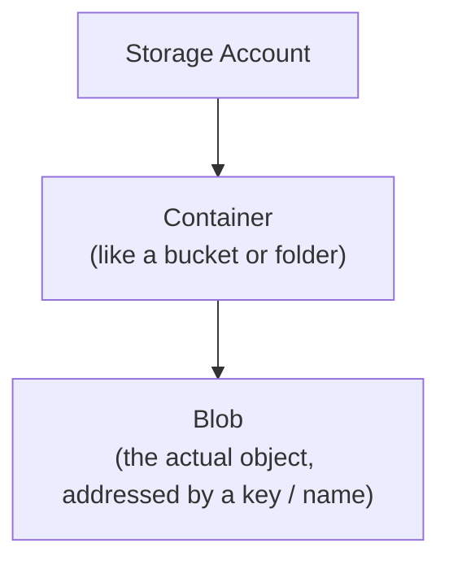
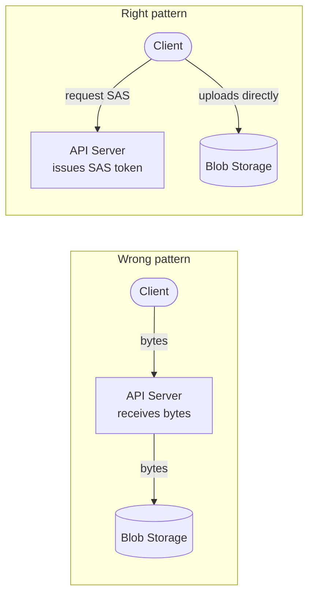
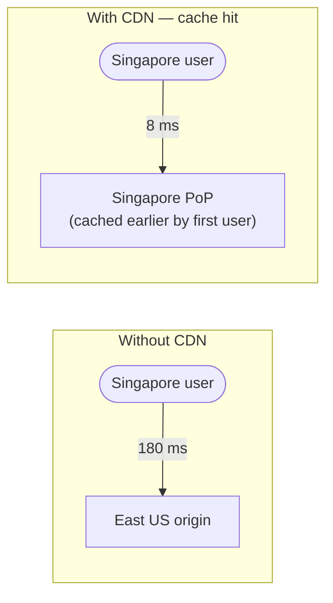

*[Grokking System Design](../../../README.md) · Module 2 — Storage Building Blocks · Day 7*

# Day 7 — Blob Storage, CDN, and Search

> **Today's one idea:** Blob storage externalises large objects from your database; a CDN pushes content to the edge; a search index inverts the query model — three distinct building blocks, each solving a different read problem that relational and NoSQL databases were never designed for.
> **Reading time:** ~40 min · **Prereqs:** Day 2 (trade-off framework), Day 4 (relational databases), Day 5 (NoSQL)
> **Primary source for today:** Kleppmann, *Designing Data-Intensive Applications*, Ch. 3 (storage engines and indexes) — specifically the "Full-text search and fuzzy indexes" section — and the Azure Architecture Center: [CDN and Front Door](https://learn.microsoft.com/en-us/azure/architecture/best-practices/cdn)

---

## The Hook (3 min)

Picture a travel booking app. Users upload passport scans and profile photos. Destination pages load hero images and video trailers. A search bar lets you type "beach resort under $200."

Your team's first instinct: store everything in the database. Passport scans go into a `VARBINARY(MAX)` column. A `LIKE '%beach%'` query hunts for resorts.

Three months later:

- Your database backup takes 4 hours because it's dragging 800 GB of binary blobs through the backup pipeline.
- A user in Singapore waits 3.2 seconds for a hero image that lives on a server in East US.
- The `LIKE '%beach resort%'` query returns nothing for "beachside resort" or "seaside retreat" — exact substring match only.

These are three separate problems. Each has a building block designed specifically for it:

| Problem | Wrong tool | Right tool |
|---------|-----------|------------|
| Large binary objects clog the DB | `VARBINARY(MAX)` in SQL | **Blob Storage** |
| Static assets served from one region | App server | **CDN / Front Door** |
| Keyword search with ranking and fuzzy matching | `LIKE '%..%'` | **Search index** |

Today you build the mental model for all three — and a Decision Guide that maps each problem to its Azure service.

---

## Building the Intuition

### Part 1 — Blob Storage: the flat filing cabinet

A relational database is a *structured* store. Every row has a schema, every column a type, and the engine works hard to let you JOIN, filter, and aggregate across millions of rows. That machinery is expensive — and completely wasted on a JPEG.

A blob store is the opposite: a flat, key-value filing cabinet for opaque bytes. There is no schema, no JOIN, no query by content. There is one operation: *"give me the bytes at this key."* In exchange for that simplicity, you get:

- **Unlimited size** — objects from 1 byte to hundreds of terabytes.
- **Cheap at rest** — blob storage costs a fraction of database storage per GB.
- **Direct HTTP access** — every blob has a URL. Clients can download (or upload) directly without routing through your API server.

**Azure Blob Storage** organises objects into three levels:



A passport scan might live at:

```
https://myapp.blob.core.windows.net/documents/users/user-42/passport.jpg
```

**Storage tiers** — the filing cabinet has four drawers, each cheaper and slower than the last:

| Tier | Monthly cost | Retrieval latency | Use when |
|------|-------------|-------------------|----------|
| Hot | ~$0.018/GB | Milliseconds | Active files — profile photos, current invoices |
| Cool | ~$0.01/GB | Milliseconds | Infrequently accessed — last quarter's reports |
| Cold | ~$0.004/GB | Milliseconds | Rarely accessed — compliance archives, old backups |
| Archive | ~$0.00099/GB | Hours (rehydration) | Long-term retention — legal hold, audit trails |

> **Lifecycle management** lets you write rules like: *"move to Cool after 30 days, Archive after 365 days."* Set it once; Azure handles the rest.

**The direct-upload pattern** — the most important architectural decision for blob storage:



A **Shared Access Signature (SAS) token** is a cryptographically signed URL that grants time-limited permission to perform one operation on one blob — for example, write access to `documents/users/user-42/passport.jpg` for the next 5 minutes. Your API server generates it without transmitting the file itself. The client uploads directly to Azure; your server never handles the bytes.

Why this matters:
- Your API servers don't become bandwidth bottlenecks.
- Large uploads don't consume API server threads.
- You can scale blob throughput independently of application logic.

```csharp
// Generate a write-only SAS token (valid 5 minutes)
BlobClient blobClient = containerClient.GetBlobClient($"users/{userId}/passport.jpg");

BlobSasBuilder sasBuilder = new()
{
    BlobContainerName = containerClient.Name,
    BlobName           = blobClient.Name,
    Resource           = "b",          // "b" = blob, "c" = container
    ExpiresOn          = DateTimeOffset.UtcNow.AddMinutes(5)
};
sasBuilder.SetPermissions(BlobSasPermissions.Write | BlobSasPermissions.Create);

Uri sasUri = blobClient.GenerateSasUri(sasBuilder);
// Return sasUri.ToString() to the client — they POST directly to it
```

---

### Part 2 — CDN: moving content to where users are

A CDN (Content Delivery Network) is a globally distributed set of **edge nodes** (Points of Presence, PoPs). When a user in Tokyo requests an asset, the CDN checks whether a nearby PoP has a cached copy. If yes, it serves from 8ms away instead of routing to your East US origin server at 180ms.



**Azure Front Door** is Azure's premium CDN + global load balancer. It combines:
- Edge caching (static and dynamic acceleration)
- WAF (Web Application Firewall) at the edge
- Intelligent routing (latency-based, weighted)
- TLS termination globally

**What to put on a CDN:**

| Good CDN candidate | Poor CDN candidate |
|-------------------|--------------------|
| Static assets: images, JS, CSS, fonts | Personalised responses (user-specific JSON) |
| Public API responses that rarely change | Responses with sensitive data |
| Video/audio streams | Real-time data (live scores, stock prices) |
| Software downloads | POST/PUT/DELETE requests |

**Cache-Control headers drive CDN behaviour.** Your origin server sets them; the CDN obeys them:

```http
Cache-Control: public, max-age=86400, s-maxage=604800
```

- `max-age=86400` — browser caches for 1 day.
- `s-maxage=604800` — CDN edge caches for 7 days (overrides `max-age` for shared caches).
- `public` — safe for any cache (browser, proxy, CDN) to store.

**Cache busting** — when you deploy a new version of `app.js`, CDN nodes still hold the old version until `s-maxage` expires. The standard solution: embed a content hash in the filename.

```
Before: /static/app.js            → CDN caches for 7 days
After:  /static/app.a3f91b4c.js  → different URL, CDN fetches fresh
```

Your bundler (Vite, Webpack) does this automatically. Point the CDN at your origin; the hash in the filename is your invalidation strategy.

**When to purge explicitly** — for assets whose URL cannot change (e.g., `/api/config.json`, `/logo.png`), you can call Azure Front Door's purge API to evict the cached copy immediately:

```bash
az afd endpoint purge \
  --resource-group myRG \
  --profile-name myFrontDoor \
  --endpoint-name myEndpoint \
  --content-paths "/logo.png" "/api/config.json"
```

Use purge sparingly — it's a sledgehammer. Prefer content-addressed filenames for assets you control.

---

### Part 3 — Search: inverting the query

When a user types "beach resort Bali under $200" into a search bar, they want *relevance* — results ranked by how well they match the intent, not exact substring matches.

SQL's `LIKE '%beach resort%'` fails in three ways:
1. It doesn't match "beachside resort" or "seaside retreat" (no stemming, no synonyms).
2. It can't rank results by relevance — it's binary: match or no match.
3. It can't use an index for leading wildcards (`LIKE '%beach%'`), so it scans every row.

A **search index** solves all three by *inverting* the data structure.

**The inverted index — the key idea:**

When you index a document, the search engine tokenises its text and builds a map from every *token* (word or n-gram) to the list of documents containing it.

**Source documents:**

| Doc | Text |
| --- | ---- |
| Doc 1 | "Beach resort in Bali with ocean views" |
| Doc 2 | "Luxury beachside hotel Maldives" |
| Doc 3 | "Mountain retreat Bali" |

**Inverted index:**

| Token | Documents |
| ----- | --------- |
| "beach" | Doc 1 |
| "resort" | Doc 1 |
| "bali" | Doc 1, Doc 3 |
| "beachside" | Doc 2 |
| "ocean" | Doc 1 |
| "mountain" | Doc 3 |

A query for "beach" looks up the token in O(1) and retrieves the document list — no full table scan.

**Analysers** transform text before indexing (and again at query time):

```
Input:  "Beach Resorts"
         ↓ lowercase
        "beach resorts"
         ↓ stemming
        "beach resort"   ← stored in index
```

This is why "resorts" matches "resort" and vice versa — they share a stem. Synonym expansion goes further: "seaside" → "beach" means "seaside hotel" returns beach results.

**Azure AI Search** (formerly Cognitive Search) is Azure's managed search service. Its core concepts:

| Concept | What it is |
|---------|-----------|
| **Index** | The inverted index — like a table, but optimised for text queries |
| **Field** | A column in the index — `searchable`, `filterable`, `sortable`, `facetable` attributes set per field |
| **Analyser** | How text is tokenised — `en.microsoft` for English, `standard` (Lucene) as default |
| **Indexer** | A crawler that pulls from a data source (Blob Storage, SQL, Cosmos DB) on a schedule |
| **Scoring profile** | Boosts relevance for certain fields — e.g., title matches score 3× higher than body matches |

**A minimal index definition (REST):**

```json
{
  "name": "resorts-index",
  "fields": [
    { "name": "id",          "type": "Edm.String",  "key": true,  "searchable": false },
    { "name": "name",        "type": "Edm.String",  "searchable": true,  "analyzer": "en.microsoft" },
    { "name": "description", "type": "Edm.String",  "searchable": true,  "analyzer": "en.microsoft" },
    { "name": "country",     "type": "Edm.String",  "filterable": true,  "facetable": true },
    { "name": "pricePerNight","type": "Edm.Double",  "filterable": true,  "sortable": true }
  ]
}
```

**Query:** "beach resort under $200 in Bali"

```
search=beach resort
filter=country eq 'Bali' and pricePerNight le 200
orderby=search.score() desc
```

The engine searches the inverted index for "beach" and "resort", filters by country and price, and returns results ranked by relevance score — in milliseconds, across millions of documents.

---

## The Formal Picture

### Blob Storage access tiers — cost model

Total monthly cost per GB = storage cost + (retrieval operations × op cost) + (data retrieval × per-GB cost).

Archive tier has near-zero storage cost but charges for rehydration (moving back to Hot/Cool before reading). For data read once a year, Archive wins. For data read once a month, Hot wins. The break-even is roughly:

```
Hot vs Cool:   ~30 reads/month per GB
Cool vs Cold:  ~10 reads/month per GB
Cold vs Archive: ~1 read/month per GB
```

### CDN cache hit ratio

```
Cache Hit Ratio = cache_hits / (cache_hits + cache_misses)
```

A ratio below 80% suggests assets are either too personalised, TTLs are too short, or query strings create false cache misses. Fix by:
1. Stripping irrelevant query parameters at the CDN layer (e.g., tracking params like `utm_source`).
2. Normalising cache keys (lowercase URL, canonical query string order).
3. Increasing `s-maxage` for stable assets.

### Search relevance scoring — BM25

Azure AI Search uses **BM25** (Best Match 25) as its default scoring algorithm. The intuition:

- A term appearing in a short document is more significant than the same term in a long document.
- The first few occurrences of a term matter more than the 50th (diminishing returns).
- Rare terms (low document frequency) carry more signal than common terms.

You don't need to implement BM25 — you need to know that **scoring profiles let you tune it**: boost fields that matter more (title > body), boost freshness (recent listings rank higher), boost geographic proximity.

---

## Where It Breaks / What It Is Not

**Blob Storage is not a database.** You cannot query by content ("find all invoices over $1,000"). You can only retrieve by key. If you need metadata queries, store metadata in a database and store the blob URL as a field.

**CDN is not a silver bullet for dynamic content.** An authenticated user's home page feed is unique per user — the CDN can't cache it. Edge caching helps static and semi-static content. For dynamic personalised responses, look at edge compute (Azure Front Door Rules Engine) or cache individual components rather than full pages.

**Search is not a primary store.** A search index is a *derived* view — it's populated by indexing your primary data. It can lag behind (indexers run on schedules, typically minutes). Never make business logic depend on search results being up-to-the-second consistent. Write to your primary store; let the indexer catch up.

**Full-text search is not structured filtering.** If users filter by exact values ("country = France", "price < 200"), a database with proper indexes is often faster and cheaper. Search adds value when the query is *fuzzy*, *natural language*, or *relevance-ranked*. Use both: filter with SQL/Cosmos DB, rank with Azure AI Search.

---

## Try It Yourself

**Exercise 1 — Classify the access pattern**

For each scenario, identify the right building block (Blob Storage / CDN / Azure AI Search / SQL or Cosmos DB). Justify your choice.

a) A legal app stores PDF contracts. Each contract belongs to one client. Clients download their own contracts by clicking a link. Average file size: 2 MB. Access frequency: once per contract, then rarely.

b) A news site serves the same hero image for each article to all readers globally. The image changes when an article is updated.

c) An e-commerce app lets users search product descriptions with natural language — "comfortable running shoes for wide feet."

d) A dashboard shows a user's order history. Each order has customer ID, total, status, date.

<details>
<summary>Hints</summary>

a) The key question: is this binary data that clients need to download? Is it accessed infrequently?
b) The key question: is this the same for everyone, served globally, and rarely changes?
c) The key question: does the query require fuzzy matching and relevance ranking?
d) The key question: is this structured, query-by-field, with relationships?

</details>

<details>
<summary>Worked answer</summary>

a) **Blob Storage (Cool tier).** PDFs are binary objects. Cool tier suits infrequent access. Use SAS tokens so clients download directly without routing through the API server.

b) **CDN / Azure Front Door.** Same content for all users, geographically distributed, stable between edits. Set a long `s-maxage` and use purge on update, or embed a hash in the filename.

c) **Azure AI Search.** Natural language, fuzzy match, relevance ranking — the inverted index handles what SQL `LIKE` cannot. Index your product catalogue; Azure AI Search fields handle stemming ("running" → "run") and synonym expansion.

d) **SQL / Cosmos DB.** Structured data, filtered by customer ID, sorted by date, with aggregations (total). This is exactly what a relational or document database is built for.

</details>

---

**Exercise 2 — SAS token design**

Your team is building a feature where users can upload profile photos. The photo must go directly from the browser to Blob Storage (no API server in the upload path).

a) What permissions should the SAS token grant? What should its expiry be?

b) After upload completes, the client notifies your API with the blob URL. What should the API do before storing that URL in the database?

<details>
<summary>Hints</summary>

a) Minimum viable permissions. Should a write token also let the user read other blobs?
b) The client told you a URL exists — but can you trust it?

</details>

<details>
<summary>Worked answer</summary>

a) **Write + Create only, not Read or Delete.** Expiry: 5–10 minutes. A short expiry limits exposure if the token leaks. `Write | Create` is the minimum to upload a new blob; `Read` is unnecessary for an upload-only flow, and `Delete` would be dangerous.

b) **Verify the blob exists and is owned by this user.** The client could pass a fabricated URL pointing to another user's blob. Before storing the URL:
1. Parse the URL to confirm it's under your own storage account and the expected container/path prefix (e.g., `users/{userId}/`).
2. Call the Blob SDK to confirm the blob exists and retrieve its content-type.
3. Reject if content-type is not an accepted image type (JPEG, PNG, WebP).

Never blindly trust a URL the client provides. Validate on the server side.

</details>

---

**Exercise 3 — Search field design**

You are designing an Azure AI Search index for a job listings platform. Users search for jobs like "senior .NET developer remote Azure."

Define the field configuration for these attributes: `jobTitle`, `description`, `requiredSkills` (list of strings), `location`, `salaryRangeMin`, `salaryRangeMax`, `postedDate`.

For each field, set: `searchable`, `filterable`, `sortable`, `facetable`.

<details>
<summary>Hints</summary>

- `searchable` → full-text inverted index; useful for text the user might type.
- `filterable` → exact match conditions (`filter=location eq 'Remote'`); useful for structured constraints.
- `sortable` → ordering results (`orderby=postedDate desc`); only one value per field.
- `facetable` → aggregate and count distinct values to build "filter panels" in the UI.

</details>

<details>
<summary>Worked answer</summary>

```json
[
  { "name": "id",             "type": "Edm.String",                "key": true },
  { "name": "jobTitle",       "type": "Edm.String",  "searchable": true,  "filterable": true,  "sortable": true,  "facetable": false, "analyzer": "en.microsoft" },
  { "name": "description",    "type": "Edm.String",  "searchable": true,  "filterable": false, "sortable": false, "facetable": false, "analyzer": "en.microsoft" },
  { "name": "requiredSkills", "type": "Collection(Edm.String)", "searchable": true, "filterable": true, "facetable": true },
  { "name": "location",       "type": "Edm.String",  "searchable": false, "filterable": true,  "sortable": false, "facetable": true  },
  { "name": "salaryRangeMin", "type": "Edm.Double",  "searchable": false, "filterable": true,  "sortable": true,  "facetable": false },
  { "name": "salaryRangeMax", "type": "Edm.Double",  "searchable": false, "filterable": true,  "sortable": true,  "facetable": false },
  { "name": "postedDate",     "type": "Edm.DateTimeOffset", "searchable": false, "filterable": true, "sortable": true, "facetable": false }
]
```

**Reasoning:**
- `jobTitle`: searchable (typed in the query box) + filterable (exact role filter) + sortable (rank by title alphabetically if needed).
- `description`: searchable only — too long to filter/sort; no facet.
- `requiredSkills`: collection type; searchable (skill keywords in free text) + filterable + facetable (build a "Filter by skill" panel showing counts).
- `location`: not searchable (users filter "Remote" exactly, not free-text); filterable + facetable (build a location panel).
- Salary fields: filterable for range queries; sortable for "highest salary first."
- `postedDate`: filterable ("last 7 days") + sortable ("newest first"); no free-text search needed.

</details>

---

## Connect It Back

This page completes the storage arc. Look at what you now have:

| Access pattern | Building block |
|---------------|---------------|
| Structured, relational, JOINs | Azure SQL |
| Flexible schema, partition by entity | Cosmos DB (Core SQL / MongoDB API) |
| Time-series, append-heavy | Cosmos DB (Cassandra API) |
| Graph traversal | Cosmos DB (Gremlin API) |
| Re-read hot data fast | Azure Cache for Redis |
| Large binary objects | Azure Blob Storage |
| Globally distributed static reads | Azure Front Door / CDN |
| Fuzzy, ranked full-text search | Azure AI Search |

Every system design question will mix several of these. A social media app needs Cosmos DB for posts, Blob Storage for photos, CDN for profile images, Redis for the news feed, and Azure AI Search for the people-search bar. The skill is not memorising the list — it's recognising *which access pattern is in play* and reaching for the right tool.

**Tomorrow** (Day 8) you move from storage to compute: where does your code run, and how does traffic reach it? The load balancer is the entry point — and it's the first place a system can become a single point of failure.

**Question you should be able to answer now:** *A startup stores user-generated videos in their PostgreSQL database as bytea columns. What three specific problems will this cause at scale, and which building block solves each?*

---

## Decision Guide — Blob, CDN, and Search

### Blob Storage

**Use Azure Blob Storage when:**
- Data is binary or unstructured (images, video, PDF, audio, logs, backups).
- Objects are large (KB to TB) and your database would bloat storing them inline.
- Clients need direct download/upload without routing bytes through your API server (use SAS tokens).
- You need tiered cost management — lifecycle policies move objects automatically.

**Don't use Blob Storage when:**
- You need to query by content or metadata — store metadata in SQL/Cosmos DB, store the blob URL as a field.
- You need strongly consistent transactions across object creation and metadata update — use SQL and store the blob URL atomically.

### CDN / Azure Front Door

**Use a CDN when:**
- Content is the same for all (or most) users — static assets, public API responses, software downloads.
- Your users are globally distributed and latency matters.
- You want to reduce origin server load by serving from edge caches.

**Don't use a CDN when:**
- Responses are personalised per user (cache would serve the wrong user's data).
- Content is real-time (live scores, stock tickers) — cached values will be stale.
- You need request-level authentication at your origin — CDN bypasses many auth headers unless explicitly configured.

### Azure AI Search

**Use Azure AI Search when:**
- Users need fuzzy, stemmed, or natural-language keyword search.
- You need relevance ranking (not just filter/sort).
- You need faceted navigation ("filter by skill: Python (142), Java (89)...").
- `LIKE '%keyword%'` on your database table is causing full table scans.

**Don't use Azure AI Search when:**
- Queries are exact-value filters ("customer_id = 42") — a database index is simpler and cheaper.
- You need real-time consistency — the indexer lags (minutes); don't use search results in business logic.
- Your dataset is small (< ~10K documents) — a database with a full-text index is sufficient.

### Quick-pick matrix

| You need to… | Azure service |
|--------------|--------------|
| Store a 500 MB video upload | Blob Storage (Hot → Cool lifecycle) |
| Serve a logo to users in 40 countries | Azure Front Door (CDN) |
| Let users search "comfortable hiking boots" | Azure AI Search |
| Store order history with customer JOINs | Azure SQL |
| Cache the 100 most-read product pages | Azure Cache for Redis |
| Store time-series sensor readings at scale | Cosmos DB (Cassandra API) |

---

## Suggested Readings for Today

**Required if you have 15 extra minutes:**
Kleppmann, *Designing Data-Intensive Applications* (O'Reilly, 2017) — Chapter 3, section "Full-text search and fuzzy indexes" (pp. 88–90). Kleppmann explains the Lucene inverted index structure and why it makes full-text search fundamentally different from B-tree queries. Read this after today's page to see the formal underpinning of what Azure AI Search is built on.

**If you want the deep version:**

1. Azure Architecture Center — "Content Delivery Networks" best practices guide: [https://learn.microsoft.com/en-us/azure/architecture/best-practices/cdn](https://learn.microsoft.com/en-us/azure/architecture/best-practices/cdn). Covers cache-control header strategy, query string handling, dynamic site acceleration, and when to use Azure Front Door vs Azure CDN Standard. Read after today if you're designing a globally distributed app.

2. Azure AI Search documentation — "Relevance and ranking in Azure AI Search": [https://learn.microsoft.com/en-us/azure/search/index-similarity-and-scoring](https://learn.microsoft.com/en-us/azure/search/index-similarity-and-scoring). Explains BM25 scoring, scoring profiles, and semantic ranking (AI-powered re-ranking). Read this before you implement a search experience where result quality matters.

3. Xu, *System Design Interview*, Vol. 1 (Byte Code LLC, 2020) — Chapter 11, "Design a News Feed System." The news feed design requires blob storage for images, CDN for media delivery, and a search component. Excellent capstone read that ties together Days 4–7 in one concrete design.

---

← [Day 6 — Caching: What to Cache, Where to Cache, and When Not To](day-06-caching.md) &nbsp;|&nbsp; [Day 8 — Load Balancing →](../../03-compute-communication-building-blocks/days/day-08-load-balancing.md)
