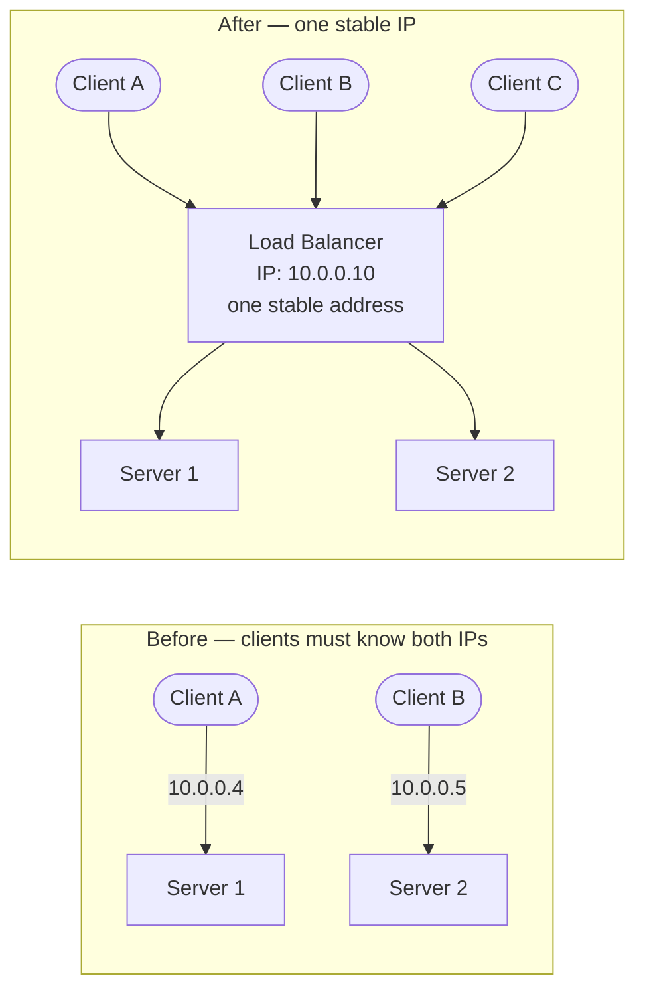
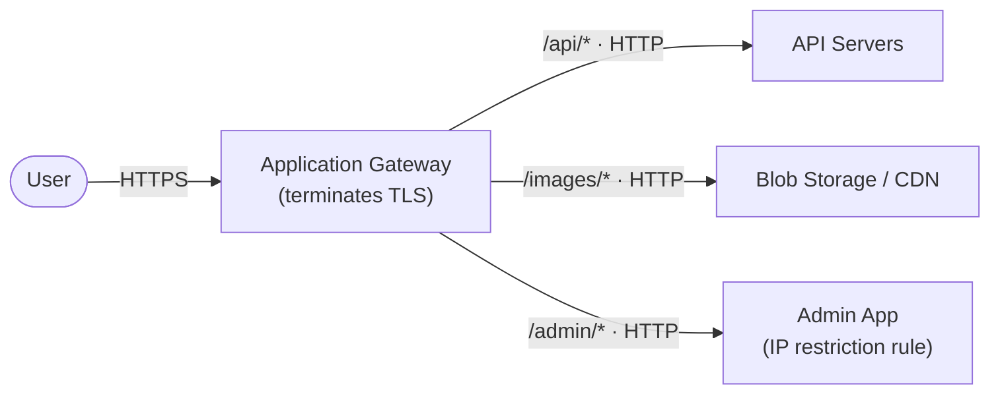
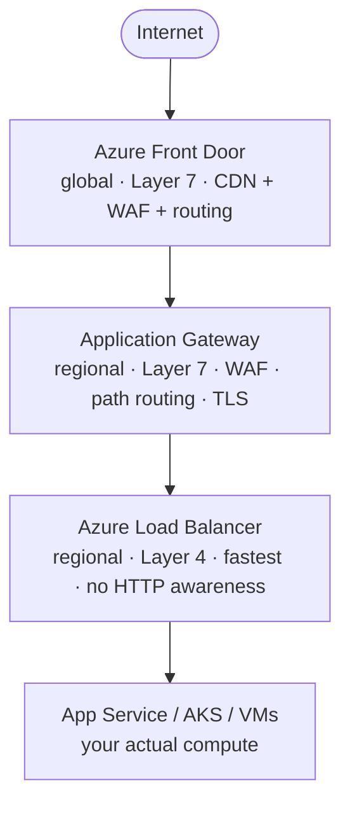

*[Grokking System Design](../../../README.md) · Module 3 — Compute and Communication Building Blocks · Day 8*

# Day 8 — Load Balancing

> **Today's one idea:** A load balancer is not just a traffic splitter — it is the first resilience layer in your system, and the Azure service you pick (Application Gateway, Front Door, or Load Balancer) depends on which layer of the request path needs to be resilient.
> **Reading time:** ~38 min · **Prereqs:** Day 1 (methodology), Day 2 (trade-off framework), Day 4 (relational databases — replication as a model for redundancy)
> **Primary source for today:** Xu, *System Design Interview*, Vol. 1 (Byte Code LLC, 2020) — Chapter 1, "Scale From Zero to Millions of Users," section "Load balancer"

---

## The Hook (3 min)

It is 11 PM on Black Friday. Your e-commerce app is running on a single Azure App Service instance. Traffic spikes 40×. The instance runs out of memory. It crashes.

Every request now hits a dead server. Your users see a white screen. Your on-call engineer scrambles to restart the instance. It takes 4 minutes. You lose $340,000 in sales in those 4 minutes.

The fix is not "get a bigger server." A bigger server still crashes at high enough load. And a single server — however big — is a **single point of failure (SPOF)**: one component whose failure takes down the entire system.

The fix is *redundancy plus routing*: run multiple servers, and put something in front of them that can detect failures and route around them. That something is a **load balancer**.

---

## Building the Intuition

### From one server to many

Adding a second server solves nothing if clients still talk directly to either server. You'd need clients to know both IP addresses, know which one is alive, and know when to switch. That logic doesn't belong in the client.

A load balancer gives clients a **single stable address**. It accepts every incoming request and forwards each one to one of N healthy backend servers. Clients don't know how many servers exist, and they don't need to.



Now when Server 1 crashes, the load balancer detects it (via health checks) and routes all traffic to Server 2. Clients see no change — the IP they're talking to hasn't moved.

### Health checks

A load balancer polls each backend on a configurable interval:

```
Every 10 seconds:
  LB → Server 1: GET /health  →  200 OK         ✓ healthy
  LB → Server 2: GET /health  →  connection timeout  ✗ unhealthy

Action: stop routing to Server 2 until it recovers
```

Your API must expose a health endpoint. A good health endpoint checks:
1. The process is running (trivial — the endpoint responded).
2. The database connection pool is alive (critical — can the app actually serve requests?).
3. Dependencies (Redis, downstream APIs) are reachable.

```csharp
// ASP.NET Core health check — registered in Program.cs
builder.Services.AddHealthChecks()
    .AddSqlServer(connectionString, name: "sql",  tags: ["db"])
    .AddRedis(redisConnectionString,  name: "redis", tags: ["cache"]);

app.MapHealthChecks("/health", new HealthCheckOptions
{
    ResponseWriter = UIResponseWriter.WriteHealthCheckUIResponse
});
```

### Routing algorithms

Once the load balancer knows which backends are healthy, it must choose one for each request. The common algorithms:

| Algorithm | How it works | Best for |
|-----------|-------------|----------|
| **Round Robin** | Requests cycle through servers in order (1, 2, 3, 1, 2, 3…) | Homogeneous servers, roughly equal request cost |
| **Least Connections** | Send to the server with the fewest active connections | Variable-duration requests (some fast, some slow) |
| **IP Hash** | Hash the client IP → always the same server | Stateful apps where session is pinned to a server |
| **Weighted Round Robin** | Some servers get more requests (e.g., 2:1 ratio) | Mixed server sizes |

**Session affinity** (aka "sticky sessions") is a trap. If your app stores session state on the server (in-memory), then you must always route the same client to the same server. This defeats the resilience benefit — if that server crashes, the session is gone. The correct fix is to *move session state out of the server* — into Redis ([(Day 6)](../day-06-caching.md)'s distributed cache) — and then you can use any routing algorithm.

### Layer 4 vs Layer 7

Load balancers operate at different layers of the network stack:

**Layer 4 (Transport layer):** Routes by IP address and TCP/UDP port. Fast — it doesn't inspect the HTTP content. Can't make routing decisions based on URL path, headers, or cookies.

**Layer 7 (Application layer):** Reads the HTTP request. Can route based on path (`/api` → service A, `/static` → service B), host header (virtual hosting), or cookie. Also terminates TLS — the LB holds the TLS certificate and forwards unencrypted traffic to backends inside the private network.



### Azure's load balancing services — the right tool for the right layer

This is the most common source of confusion in Azure architecture reviews. There are four overlapping services. Here is how they differ:



| Service | Layer | Scope | Use when |
|---------|-------|-------|----------|
| **Azure Front Door** | 7 | Global (multi-region) | Global apps, CDN + WAF + routing in one, multi-region failover |
| **Application Gateway** | 7 | Regional (one region) | Single-region apps needing path-based routing, WAF, TLS offload |
| **Azure Load Balancer** | 4 | Regional | Pure TCP load balancing, non-HTTP protocols, ultra-low latency |
| **Traffic Manager** | DNS | Global | DNS-level failover between regions (not a true LB — it redirects DNS) |

> **The 90% case for .NET on Azure:** A single-region web API uses **Application Gateway** (or the built-in load balancer of Azure App Service). A multi-region app uses **Azure Front Door** in front of regional Application Gateways.

---

## The Formal Picture

### Scalability geometry

Without a load balancer, scaling is *vertical only* — you scale by replacing the server with a bigger one. With a load balancer, you gain *horizontal* scaling — you scale by adding more servers of the same size.

```
Vertical:  1 × 64-core server      → single point of failure, capacity ceiling
Horizontal: 8 × 8-core servers     → survive any single node failure,
            behind a load balancer    add more nodes without downtime
```

**Total capacity = N × per-node capacity** — and you add capacity by incrementing N, with no downtime.

### Health check math

If a health check runs every 10 seconds and requires 3 consecutive failures before marking a server unhealthy, the **worst-case detection time** is 30 seconds. During those 30 seconds, 30 seconds × (requests/second) requests are routed to a broken server. Design your health check interval and failure threshold to match your SLA.

### The sticky session trap — formal version

Let S be the number of servers. If session state is pinned to server i, then P(session lost on node failure) = 1/S per session. With Redis as the session store, P(session lost) = 0 (assuming Redis has replication). This is why stateless server design is a prerequisite for true horizontal scaling.

---

## Where It Breaks / What It Is Not

**The load balancer itself is a SPOF** — unless it is also redundant. Azure-managed load balancers (Front Door, Application Gateway v2, Azure Load Balancer) are all highly available by design; Azure runs redundant instances behind the scenes. You never manage this yourself. But if you deploy your own Nginx/HAProxy VM as a load balancer, *you* are responsible for making it redundant.

**Load balancing ≠ auto-scaling.** A load balancer routes traffic to existing servers. It does not provision new ones. Auto-scaling (Azure VMSS, App Service scale rules, AKS HPA) adds or removes servers based on load metrics. The two work together: the load balancer distributes traffic, auto-scaling adjusts the pool size.

**DNS-based load balancing (Traffic Manager) has propagation delay.** DNS TTLs mean clients may cache the old IP for minutes after failover. Don't use Traffic Manager as your only failover mechanism if your RTO is under 5 minutes. Use it as a coarse-grained global director alongside proper Application Gateway / Front Door failover.

---

## Try It Yourself

**Exercise 1 — Map to an Azure service**

For each scenario, identify the right Azure load balancing service. Justify using the layer / scope / features framework.

a) A .NET REST API deployed to Azure App Service in West Europe. Needs TLS termination, path-based routing (`/v1` and `/v2`), and a WAF rule to block SQL injection attempts.

b) A UDP-based gaming backend running on VMs. Needs to distribute packets across 10 VMs as fast as possible. No HTTP, no WAF.

c) A global SaaS product deployed in East US, West Europe, and Southeast Asia. Traffic should be routed to the nearest healthy region, with automatic failover if a region goes down.

<details>
<summary>Hints</summary>

a) "TLS termination + path routing + WAF" — which service operates at Layer 7 with WAF included, regional scope?
b) "UDP + Layer 4 + lowest latency" — which service doesn't touch HTTP at all?
c) "Global + multi-region failover" — which service has PoPs worldwide and routes by proximity?

</details>

<details>
<summary>Worked answer</summary>

a) **Application Gateway (with WAF SKU).** Layer 7, regional, supports TLS termination + path-based routing + WAF in a single service. App Service's built-in load balancer doesn't offer WAF.

b) **Azure Load Balancer.** Layer 4 — routes TCP and UDP by IP/port without inspecting content. The only Azure option that handles non-HTTP protocols at this level. Ultra-low overhead.

c) **Azure Front Door.** Global scope, 200+ PoPs, routes by latency to the nearest healthy backend. Health probes detect regional failures and redirect traffic automatically. Includes WAF and CDN as bonuses.

</details>

---

**Exercise 2 — Design a health endpoint**

Your .NET 8 API connects to Azure SQL, Azure Cache for Redis, and calls a third-party payment processor via HTTP.

a) What should your `/health` endpoint check? For each check, what should happen if it fails — should the load balancer remove this instance from rotation?

b) The payment processor's API is slow and occasionally times out. If you include it in your health check, what problem does that cause? How do you solve it?

<details>
<summary>Hints</summary>

a) Think about which dependencies are *required* for your app to serve any request vs. optional/degraded.
b) A health check failure causes the LB to remove the instance. What happens to your app if the payment processor is slow but your app can still serve most requests?

</details>

<details>
<summary>Worked answer</summary>

a) **Check:** Azure SQL (required — without DB, no requests can be served). **Action on failure:** remove from LB rotation. **Check:** Redis (required if caching is critical path; optional if app can fall back to DB). **Action:** depends on fallback strategy. **Don't check:** third-party payment processor in the primary health endpoint (see b).

b) **Problem:** If the payment processor is slow/down, your health check times out, the LB marks your instance unhealthy and removes it from rotation — even though your app can serve 90% of requests (everything except payment). You've just taken yourself down to protect a feature that wasn't needed.

**Solution:** Use ASP.NET Core health check **tags** to separate readiness checks from liveness checks:
```csharp
// Liveness: is the process alive? (no external dependencies)
app.MapHealthChecks("/health/live", new HealthCheckOptions
{
    Predicate = _ => false  // Always return healthy if process is running
});

// Readiness: can I serve requests? (critical dependencies only)
app.MapHealthChecks("/health/ready", new HealthCheckOptions
{
    Predicate = check => check.Tags.Contains("critical")
});
```
Configure the load balancer to use `/health/ready`. The payment processor check lives in a `/health/detailed` endpoint for monitoring only — it does not affect LB routing.

</details>

---

**Exercise 3 — Spot the SPOF**

Review this architecture description and identify every single point of failure:

> "We run two App Service instances behind an Application Gateway. Application Gateway connects to Azure SQL with one primary replica in East US. Redis is a single-node Azure Cache for Redis (Basic SKU). Blob Storage stores user uploads. The Application Gateway has a single public IP."

<details>
<summary>Worked answer</summary>

1. **Azure SQL — single primary, no read replicas.** If the primary fails, no reads or writes until failover completes. Fix: Enable Always On with at least one synchronous secondary; use Business Critical or General Purpose tier with zone redundancy.

2. **Redis Basic SKU — single node, no replication.** If the Redis node restarts (for patching, for example), the entire cache is lost and all requests fall through to SQL simultaneously (cache stampede). Fix: Use Standard or Premium SKU (Redis replication + automatic failover).

3. **Application Gateway single public IP** — Azure Application Gateway v2 is zone-redundant *if* you deploy it with zone redundancy enabled. The public IP (Standard SKU) is also zone-redundant. These are NOT SPOFs if configured correctly, but worth flagging in a review.

4. **The App Service instances themselves** — Two instances is the minimum for redundancy. If both are in the same Availability Zone, a zone failure takes both down. Fix: Enable zone redundancy in App Service Plan (minimum 3 instances across 3 zones).

5. **Blob Storage** — Azure Blob Storage with LRS (Locally Redundant Storage) replicates within one datacenter. A datacenter fire takes it down. Fix: Use ZRS (Zone-Redundant Storage) or GRS. *This is NOT a SPOF by default in production — ZRS is the minimum recommendation.*

**The two critical fixes:** Redis Basic → Standard, and Azure SQL without zone redundancy → Business Critical with zone redundancy enabled.

</details>

---

## Connect It Back

Module 2 told you where data lives. Day 8 tells you how requests reach the servers that handle that data. The load balancer is the entry point — the first thing a request touches and the last thing that can save you when a backend fails.

Notice the pattern: every building block so far has the same structure. A single-node version (one server, one database, one cache node) that works at small scale, and a distributed version (multiple servers, read replicas, Redis cluster) that survives failures. The load balancer is the mechanism that makes the distributed version coherent from the outside.

**Tomorrow** (Day 9) you move one layer in: the load balancer delivered the request to your server — now what protocol should your API speak? REST, GraphQL, or gRPC? The answer is not preference — it's the client's access pattern.

**Question you should now be able to answer:** *A startup is running a single App Service instance with no load balancer. They add a second instance and put Application Gateway in front of them. They immediately see that logged-in users keep getting logged out. What is the most likely cause, and what is the correct fix?*

---

## Suggested Readings for Today

**Required if you have 15 extra minutes:**
Xu, *System Design Interview* Vol. 1 — Chapter 1, "Scale From Zero to Millions of Users" (pp. 5–20). Xu walks through the exact progression from single server → DB separation → load balancer → read replicas → cache → CDN. It is the most efficient narrative summary of everything Days 4–8 cover in sequence.

**If you want the deep version:**

1. Microsoft Azure Architecture Center — "Load-balancing options": [https://learn.microsoft.com/en-us/azure/architecture/guide/technology-choices/load-balancing-overview](https://learn.microsoft.com/en-us/azure/architecture/guide/technology-choices/load-balancing-overview). Contains the canonical decision flowchart for Front Door vs. Application Gateway vs. Load Balancer vs. Traffic Manager. Bookmark this — you will reference it in every design review.

2. ASP.NET Core health checks documentation: [https://learn.microsoft.com/en-us/aspnet/core/host-and-deploy/health-checks](https://learn.microsoft.com/en-us/aspnet/core/host-and-deploy/health-checks). Full reference for the `AddHealthChecks()` builder API, tag-based filtering, custom health check implementations, and integration with readiness/liveness probes in AKS.

3. Nygard, *Release It!* 2nd ed. (Pragmatic Bookshelf, 2018) — Chapter 4, "Stability Patterns," section "Bulkheads." Nygard's bulkhead pattern is the load-balancing-level equivalent of resilience: isolating pools of servers so a failure in one pool doesn't drain capacity from another. Directly applicable to App Service deployment slots and AKS node pools.

---

← [Day 7 — Blob Storage, CDN, and Search](../../02-storage-building-blocks/days/day-07-blob-cdn-search.md) &nbsp;|&nbsp; [Day 9 — API Design →](day-09-api-design.md)
