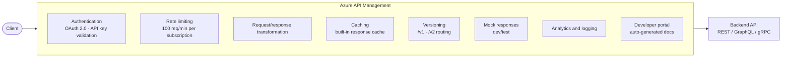

*[Grokking System Design](../../../README.md) · Module 3 — Compute and Communication Building Blocks · Day 9*

# Day 9 — API Design

> **Today's one idea:** REST, GraphQL, and gRPC are not competing style preferences — they are three different trade-off profiles, each optimised for a different client access pattern; and Azure API Management is the operational layer that sits in front of all of them.
> **Reading time:** ~40 min · **Prereqs:** Day 1 (methodology), Day 2 (trade-off framework), Day 8 (load balancing — how requests reach your API)
> **Primary source for today:** Kleppmann, *Designing Data-Intensive Applications* (O'Reilly, 2017) — Chapter 4, "Encoding and Evolution," sections on REST and RPC

---

## The Hook (3 min)

A team ships a REST API for a mobile app. The home screen needs: user profile, last 5 orders, and unread notification count.

The REST API has three endpoints:
- `GET /users/{id}` → user profile
- `GET /users/{id}/orders?limit=5` → last 5 orders
- `GET /users/{id}/notifications/unread/count` → unread count

The mobile app makes three sequential network calls to render one screen. On a 3G connection in Indonesia, each call takes 400ms. The home screen takes 1.2 seconds to load.

The backend team adds a `/home-screen` endpoint that bundles all three. Now there are four endpoints and a `homeScreen` object that nobody documents.

Six months later, the same team ships a web dashboard. It needs user profile and billing history — no notifications. The `home-screen` endpoint returns data the web client doesn't need. The team adds a fifth endpoint.

The API is now a growing list of bespoke endpoints shaped by whoever asked last. This is called **over-fetching** (getting too much) and **under-fetching** (needing multiple round trips to get enough) — the canonical failure modes of poorly designed REST.

There is a better way. But "better" depends on which problem you're solving.

---

## Building the Intuition

### REST — the resource model

REST (Representational State Transfer) organises an API around *resources* — nouns that map to your data model. Each resource has a URL. You act on it with HTTP verbs.

```
GET    /orders/{id}       → fetch order
POST   /orders            → create order
PUT    /orders/{id}       → replace order
PATCH  /orders/{id}       → partially update order
DELETE /orders/{id}       → delete order
```

**Why this works:**
- HTTP is universal. Every language, every browser, every client can speak it.
- Stateless: each request carries all the context it needs. No server-side session required.
- Cacheable: `GET` responses can be cached at every layer (browser, CDN, load balancer).
- Human-readable URLs are discoverable.

**Why this breaks:**

*Over-fetching:* `GET /users/{id}` returns name, email, address, phone, preferences, account tier, avatar URL — even if the client only needed the name and email for a greeting.

*Under-fetching:* To display an order with customer name and product images, the client calls `GET /orders/{id}`, then `GET /users/{orderId.customerId}`, then `GET /products/{item.productId}` for each line item. This is the **N+1 problem** — 1 order + N product calls.

*REST is the right choice when:* your clients are diverse (browsers, mobile, third-party integrators), your data model maps cleanly to resources, and responses can be cached aggressively.

---

### GraphQL — the query model

GraphQL flips the contract. Instead of the server defining what each endpoint returns, the **client specifies exactly what it needs** in a typed query language.

The home-screen problem, solved:

```graphql
query HomeScreen($userId: ID!) {
  user(id: $userId) {
    name
    avatarUrl
  }
  orders(userId: $userId, limit: 5) {
    id
    total
    status
    placedAt
  }
  unreadNotificationCount(userId: $userId)
}
```

One request. Exactly the fields the client needs. No `home-screen` endpoint, no bespoke bundling.

The web dashboard sends a different query — same single endpoint (`POST /graphql`), different fields requested. The server returns only what was asked for.

**GraphQL schema** defines the type system. Think of it as a contract:

```graphql
type Query {
  user(id: ID!): User
  orders(userId: ID!, limit: Int): [Order]
  unreadNotificationCount(userId: ID!): Int
}

type User {
  id: ID!
  name: String!
  avatarUrl: String
  email: String!
}

type Order {
  id: ID!
  total: Float!
  status: OrderStatus!
  placedAt: DateTime!
}
```

**Why GraphQL works:**
- Eliminates over-fetching and under-fetching in one move.
- Single endpoint → simpler client code, single versioning surface.
- Strongly typed schema is self-documenting and enables IDE completion.
- Subscriptions (`subscription` type) add real-time push over WebSocket.

**Why GraphQL breaks:**

*Caching is hard.* All queries go to `POST /graphql`. HTTP caches key on URL + method. POST is not cacheable by default. You need query-level or resolver-level caching inside the server.

*The N+1 problem moves server-side.* A query `{ orders { customer { name } } }` triggers one DB call per order to fetch the customer. The DataLoader pattern batches these — but you must implement it.

*Attack surface.* Clients can craft deeply nested queries that join every table. Add query depth limits and complexity analysis.

*GraphQL is the right choice when:* you have multiple clients (mobile, web, partner integrations) with different data needs, your data model is a graph of interconnected entities, and you can afford the implementation complexity.

---

### gRPC — the procedure model

gRPC (Google Remote Procedure Call) is not about resources or queries — it is about **calling a function on a remote server** as if it were local. You define a `.proto` file that describes your service in Protocol Buffers:

```protobuf
syntax = "proto3";

service OrderService {
  rpc GetOrder (GetOrderRequest) returns (Order);
  rpc ListOrders (ListOrdersRequest) returns (stream Order);  // server streaming
  rpc CreateOrder (CreateOrderRequest) returns (Order);
}

message GetOrderRequest {
  string order_id = 1;
}

message Order {
  string id = 1;
  float  total = 2;
  string status = 3;
  int64  placed_at_unix = 4;
}
```

The protobuf compiler generates strongly-typed client and server stubs in any language. Your .NET service implements the interface; the generated client in the calling service calls it like a local method.

**Why gRPC works:**

*Binary encoding.* Protocol Buffers serialize to compact binary — 3–10× smaller than JSON. Critical for high-frequency inter-service calls.

*HTTP/2.* gRPC runs over HTTP/2 by default, enabling multiplexed streams (multiple requests over one connection), bidirectional streaming, and header compression.

*Streaming.* A single RPC can stream a response (server → client), stream requests (client → server), or both simultaneously. REST can't do bidirectional streaming natively.

*Strong typing.* The `.proto` file is the API contract. Breaking changes are caught at compile time, not at 3 AM.

**Why gRPC breaks:**

*Not browser-native.* Browsers can't make native gRPC calls (they don't control HTTP/2 framing). gRPC-Web is a workaround, but it requires a proxy. gRPC is designed for service-to-service calls.

*Human-unfriendly.* Binary encoding means you can't `curl` a gRPC endpoint and read the response. Debugging requires tools like `grpcurl`.

*gRPC is the right choice when:* you are building service-to-service communication inside a private network, performance and type safety matter more than browser compatibility, and you want streaming (e.g., real-time order status from a fulfilment service).

---

### The decision matrix

| Dimension | REST | GraphQL | gRPC |
|-----------|------|---------|------|
| Client types | Any (browsers, mobile, partners) | Multiple front-end clients | Internal services |
| Protocol | HTTP/1.1 or 2, text (JSON) | HTTP/1.1 or 2, text (JSON) | HTTP/2, binary (protobuf) |
| Payload size | Medium | Precise (no over-fetch) | Smallest |
| Caching | Excellent (HTTP cache) | Complex | None (stateful streams) |
| Streaming | Workarounds (SSE, WebSocket) | Subscriptions (WebSocket) | Native (bidirectional) |
| Browser support | Native | Native | Needs gRPC-Web proxy |
| Schema / contract | OpenAPI spec (optional) | Required (typed schema) | Required (`.proto` file) |
| When to choose | Public API, third-party integrations, standard CRUD | Multiple clients, different data needs, graph data | Internal microservices, high-throughput, streaming |

> **The 90% case for .NET on Azure:** public and partner-facing APIs use REST + Azure API Management. Internal service-to-service calls in AKS or Azure Container Apps use gRPC. Mobile-first products with multiple client types consider GraphQL (with Hot Chocolate or HotChocolate on .NET).

---

### Azure API Management — the operational layer

Regardless of whether your API speaks REST, GraphQL, or gRPC, Azure API Management (APIM) sits in front and handles the cross-cutting concerns that every production API needs:



**APIM policies** are XML snippets that run in the request/response pipeline. A rate-limiting policy:

```xml
<policies>
  <inbound>
    <!-- 100 calls per 60 seconds per subscription key -->
    <rate-limit-by-key calls="100"
                       renewal-period="60"
                       counter-key="@(context.Subscription.Id)" />
    <validate-jwt header-name="Authorization"
                  failed-validation-httpcode="401">
      <openid-config url="https://login.microsoftonline.com/{tenant}/.well-known/openid-configuration" />
    </validate-jwt>
  </inbound>
</policies>
```

**Key APIM concepts:**

| Concept | What it is |
|---------|-----------|
| **Product** | A bundle of APIs exposed under one subscription key (e.g., "Free tier: 100 req/day") |
| **Subscription** | A key issued to a developer/app to access a Product |
| **Policy** | XML transformation applied at inbound / backend / outbound / on-error phase |
| **Revision** | A non-breaking change to an API (add a field) — tested before promoting |
| **Version** | A breaking change (`/v1` → `/v2`) — both versions run simultaneously during transition |

---

## The Formal Picture

### REST maturity model (Richardson)

Leonard Richardson defined four levels of REST maturity:

- **Level 0 — The Swamp of POX:** One URL, all operations via POST. (`POST /api` with `{"action": "getUser", "id": 42}`) — Not REST.
- **Level 1 — Resources:** Separate URLs per resource (`/users/42`). No consistent use of HTTP verbs.
- **Level 2 — HTTP Verbs:** Correct use of GET/POST/PUT/DELETE. Status codes carry meaning (200 OK, 404 Not Found, 409 Conflict). *Most production REST APIs are here.*
- **Level 3 — Hypermedia (HATEOAS):** Responses include links to next valid actions. Rarely implemented in practice.

When someone says "RESTful API," they typically mean Level 2.

### Protocol Buffers encoding (intuition)

JSON encodes `{"id": "ord-42", "total": 99.99}` as ~28 bytes of human-readable text.

Protocol Buffers encode the same data as ~12 bytes of binary — roughly 2× smaller on this trivial example, 3–10× smaller on real payloads with repeated structures. The key: field numbers (integers) replace field names (strings). Field 1 is `id`, field 2 is `total` — the schema defines the mapping; the wire format omits the names entirely.

---

## Where It Breaks / What It Is Not

**REST is not "simple."** REST done well — consistent status codes, proper use of PUT vs PATCH, versioning strategy, pagination, error contract — is a serious engineering discipline. REST done poorly is a collection of inconsistent POST endpoints.

**GraphQL is not free.** The resolver execution model, DataLoader batching, and query complexity limits all require careful implementation. A naive GraphQL server is easier to abuse than a naive REST API (one deeply nested query can JOIN every table). Plan for query depth limits and cost analysis from day one.

**gRPC is not a microservices silver bullet.** gRPC is a transport mechanism — it doesn't solve service discovery, retries, circuit breaking, or distributed tracing. Those concerns live in a service mesh (Dapr, Linkerd, Istio) or in your application code.

**APIM is not a silver bullet for security.** APIM validates tokens and enforces rate limits at the gateway. It does not replace authentication inside your backend service. A backend exposed directly (bypassing APIM) is unprotected. Always add network-level restrictions so backends accept traffic only from APIM's IP range.

---

## Try It Yourself

**Exercise 1 — Choose the right protocol**

For each scenario, choose REST, GraphQL, or gRPC. Justify using the decision matrix.

a) A public booking API for a travel company. Third-party developers (airlines, hotels, travel agents) will integrate with it. Must be documented, versioned, and discoverable.

b) An internal pricing service called by 5 other microservices 10,000 times per second. Needs to return a single float (the computed price) as fast as possible.

c) A mobile app (iOS + Android + web) for a social network. Each client shows a different combination of post, follower count, and recommendation data on the home screen.

<details>
<summary>Worked answer</summary>

a) **REST + Azure APIM.** Third-party integrators expect REST. APIM provides the developer portal, API keys, versioning, and documentation automatically. Public APIs with diverse, unknown clients are REST's strongest use case.

b) **gRPC.** Service-to-service, internal, high throughput, returns a scalar value. Binary encoding + HTTP/2 streaming reduce per-call overhead. The `.proto` contract catches breaking changes at compile time.

c) **GraphQL.** Three different clients with different data shapes for the same underlying data. GraphQL eliminates the bespoke `/home-screen-ios`, `/home-screen-android`, `/home-screen-web` proliferation. The schema models the social graph naturally.

</details>

---

**Exercise 2 — API versioning strategy**

Your v1 REST API has `GET /products/{id}` returning `{ "name": "...", "price": 99.99 }`. You need to add a `currency` field (breaking for clients that don't expect it) and rename `price` to `priceAmount` (breaking for clients that depend on `price`).

a) Which of these changes is actually breaking? Which is additive (non-breaking)?

b) Describe the versioning strategy: what does the URL look like, how long do you maintain v1, and what does Azure APIM's revision vs. version feature handle?

<details>
<summary>Worked answer</summary>

a) **Adding `currency`: non-breaking.** Clients that ignore unknown fields (most JSON parsers) are unaffected. Clients that want `currency` can start reading it. **Renaming `price` → `priceAmount`: breaking.** Any client that reads `response.price` now gets `undefined`. This requires a new version.

b) **URL:** `/v1/products/{id}` → keep v1 alive. Introduce `/v2/products/{id}` with `priceAmount` + `currency`.

**APIM Revision:** for non-breaking changes (adding `currency` to v1). A revision is tested in isolation, then promoted to current — clients on the same `/v1` URL get the change seamlessly.

**APIM Version:** for breaking changes (`price` → `priceAmount`). APIM routes `/v1/...` and `/v2/...` to different backends. Maintain both until client migration is complete, then deprecate v1 (add a `Sunset` response header, then remove).

</details>

---

**Exercise 3 — APIM policy design**

Write an APIM inbound policy (XML) that:
1. Validates a Bearer JWT token from Azure AD.
2. Allows a maximum of 500 requests per minute per subscription.
3. Adds a response header `X-Api-Version: 2` on all outbound responses.

<details>
<summary>Hint</summary>

The three policy elements needed: `<validate-jwt>`, `<rate-limit-by-key>`, `<set-header>`. `<set-header>` lives in the `<outbound>` section, not `<inbound>`.

</details>

<details>
<summary>Worked answer</summary>

```xml
<policies>
  <inbound>
    <base />

    <!-- 1. Validate Azure AD Bearer JWT -->
    <validate-jwt header-name="Authorization"
                  failed-validation-httpcode="401"
                  failed-validation-error-message="Unauthorized">
      <openid-config url="https://login.microsoftonline.com/{tenant-id}/v2.0/.well-known/openid-configuration" />
      <audiences>
        <audience>api://{your-app-id}</audience>
      </audiences>
    </validate-jwt>

    <!-- 2. Rate limit: 500 calls per 60 seconds per subscription -->
    <rate-limit-by-key calls="500"
                       renewal-period="60"
                       counter-key="@(context.Subscription.Id)"
                       increment-condition="@(context.Response.StatusCode < 400)" />
  </inbound>

  <backend>
    <base />
  </backend>

  <outbound>
    <base />
    <!-- 3. Add version header to every response -->
    <set-header name="X-Api-Version" exists-action="override">
      <value>2</value>
    </set-header>
  </outbound>

  <on-error>
    <base />
  </on-error>
</policies>
```

Note: `increment-condition` on the rate limit ensures only successful calls count toward the quota (errors don't burn your client's budget).

</details>

---

## Connect It Back

Day 8 delivered the request to your server. Day 9 defines the contract by which that request is understood. Together they form the **external interface** of your system.

Now look back at Module 2 — the storage building blocks — through this lens. REST maps cleanly to CRUD on relational resources. GraphQL maps to traversing a document graph (Cosmos DB). gRPC maps to high-frequency reads of cached aggregates (Redis). The protocol you pick is not independent of the storage you pick; they shape each other.

**Tomorrow** (Day 10) you push further inside the system. Not every operation should be synchronous. When a user places an order, do you really want the HTTP response to wait for inventory check, payment processing, email confirmation, and fraud scoring — all in one 3-second chain? A message queue breaks that chain.

**Question you should now be able to answer:** *A team proposes using gRPC for their public partner API because "it's faster." What three specific objections would you raise, and what would you recommend instead?*

---

## Suggested Readings for Today

**Required if you have 15 extra minutes:**
Kleppmann, *DDIA* — Chapter 4, "Encoding and Evolution," section "Modes of Dataflow → Dataflow Through Services: REST and RPC" (pp. 131–136). Kleppmann explains why RPC is fundamentally different from local procedure calls (network failures, latency, retries) and why REST's stateless model is not just a style choice but a resilience property.

**If you want the deep version:**

1. Fielding, R. T., "Architectural Styles and the Design of Network-based Software Architectures," PhD dissertation, UC Irvine, 2000 — Chapter 5, "Representational State Transfer (REST)." [https://www.ics.uci.edu/~fielding/pubs/dissertation/rest_arch_style.htm](https://www.ics.uci.edu/~fielding/pubs/dissertation/rest_arch_style.htm). The primary source for REST. Read Chapter 5 (20 pages) to understand what REST *actually* says vs. what most "REST APIs" implement. The gap is illuminating.

2. GraphQL specification — Introduction and "Overview" section: [https://spec.graphql.org/October2021/](https://spec.graphql.org/October2021/). The first 10 pages explain the design goals and the query execution model. Pair with the Hot Chocolate .NET library docs ([https://chillicream.com/docs/hotchocolate](https://chillicream.com/docs/hotchocolate)) for the Azure/.NET implementation path.

3. Azure API Management documentation — "Policies in Azure API Management" overview: [https://learn.microsoft.com/en-us/azure/api-management/api-management-howto-policies](https://learn.microsoft.com/en-us/azure/api-management/api-management-howto-policies). The policy reference is the most useful page in APIM's docs. Read the overview, then bookmark the full policy reference for design sessions.

---

← [Day 8 — Load Balancing](day-08-load-balancing.md) &nbsp;|&nbsp; [Day 10 — Async Messaging →](day-10-async-messaging.md)
