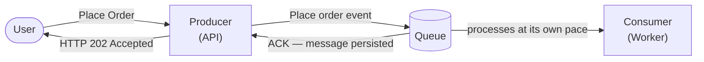
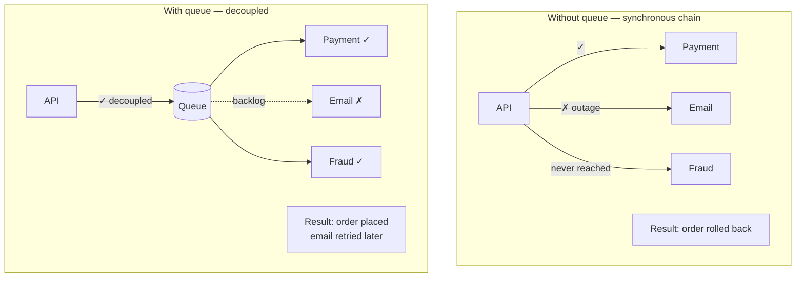
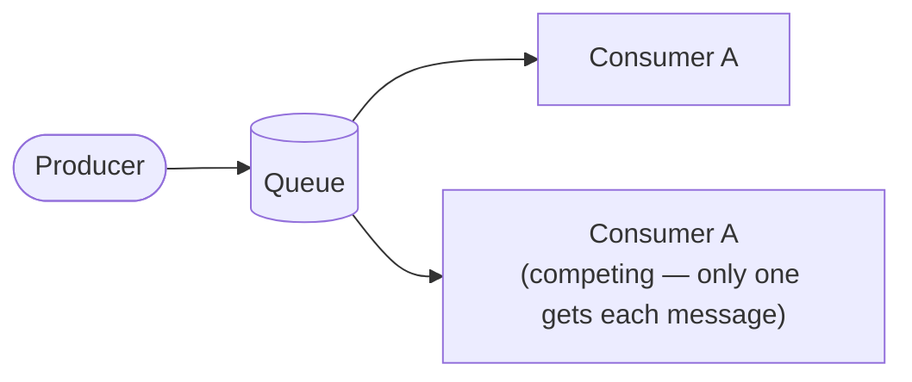
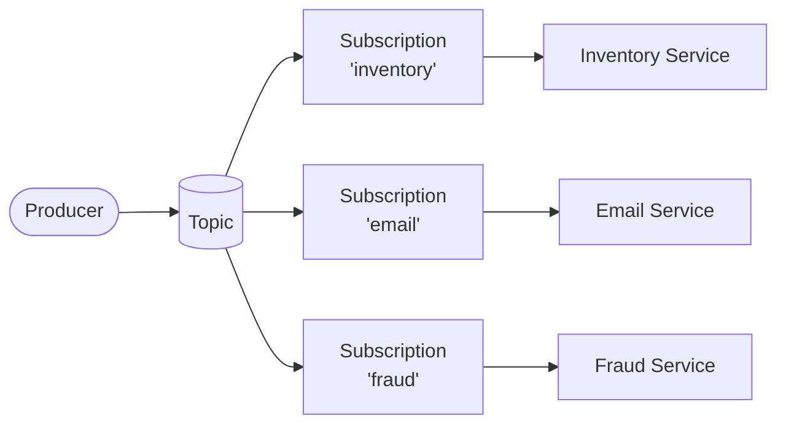
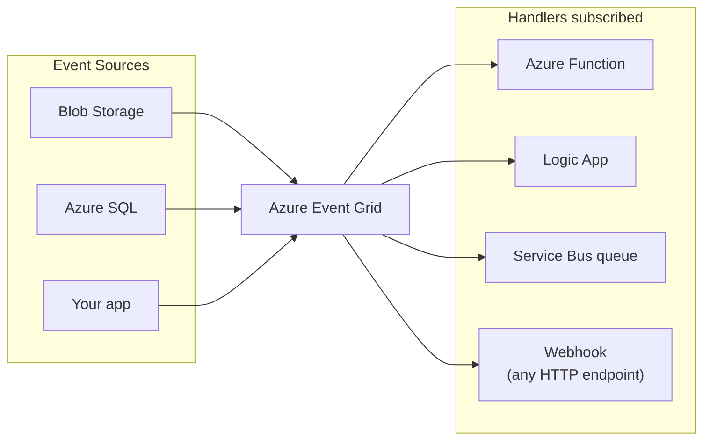
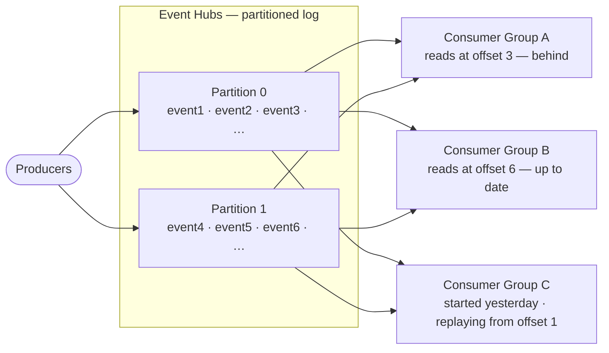

*[Grokking System Design](../../../README.md) · Module 3 — Compute and Communication Building Blocks · Day 10*

# Day 10 — Async Messaging

> **Today's one idea:** A message queue decouples sender from receiver in time — the sender does not wait, the receiver processes at its own pace, and a temporary failure in either direction does not break the other; this is the most powerful resilience primitive in distributed systems.
> **Reading time:** ~42 min · **Prereqs:** Day 1 (methodology), Day 2 (trade-off framework), Day 8 (load balancing), Day 9 (API design — synchronous request/response to contrast against)
> **Primary source for today:** Kleppmann, *Designing Data-Intensive Applications* (O'Reilly, 2017) — Chapter 11, "Stream Processing," sections "Messaging Systems" and "Message Brokers"

---

## The Hook (3 min)

A user clicks "Place Order" on your e-commerce site. Your API must now:

1. Reserve the inventory item (inventory service).
2. Charge the card (payment service — calls Stripe API, takes 800ms).
3. Send a confirmation email (email service).
4. Trigger a fraud check (ML model, takes 2 seconds).
5. Notify the warehouse (fulfilment service).

If you do all of this synchronously — each step waits for the previous — the user stares at a spinner for 3+ seconds. Worse, if the email service is having an outage, step 3 fails, and you roll back steps 1 and 2. The order is cancelled because of a non-critical email service.

This is the core failure mode of synchronous chains: **a non-critical step's failure propagates backward through the entire chain.**

The fix: *don't make the HTTP response wait for anything that doesn't have to be done before the user gets their confirmation.* Acknowledge the order, put the work on a queue, and let the downstream services process it at their own pace.

---

## Building the Intuition

### The post office analogy

Synchronous communication is a phone call: both parties must be available at the same time. If the recipient is busy, you fail.

Asynchronous messaging is a letter: you put the message in the post box and walk away. The recipient picks it up when they're ready. You didn't wait; they didn't have to be available when you sent it.

A message broker is the postal service — the infrastructure that ensures letters get delivered reliably, even if the recipient's mailbox is temporarily full.

### What a queue gives you



Three properties make this powerful:

1. **Temporal decoupling.** The producer doesn't wait. The consumer processes when it can. A consumer restart doesn't lose messages — they sit in the queue.

2. **Load levelling.** If 10,000 orders arrive in a spike, the queue absorbs the burst. The consumer processes at a steady pace of, say, 500/minute. Without a queue, that spike would overwhelm your payment service.

3. **Failure isolation.** If the email service crashes, emails pile up in the queue. When the email service recovers, it drains the backlog. The order flow was never interrupted.



---

### Azure Service Bus — queues and topics

**Azure Service Bus** is Azure's enterprise message broker. It is designed for reliable, ordered, transactional messaging between services. Two messaging patterns:

#### Queues — point-to-point

One producer, one consumer group. Each message is delivered to exactly one consumer.



Use case: a work queue where multiple worker instances compete to process jobs. Perfect for background order processing.

#### Topics and Subscriptions — publish/subscribe (fan-out)

One producer, multiple independent consumer groups. Each subscription gets its own copy.



A single "OrderPlaced" message fans out to three independent consumers. Adding a new consumer is a config change — no code change in the producer.

**Service Bus key features:**

| Feature | What it means |
|---------|--------------|
| **At-least-once delivery** | Every message is delivered at least once. Consumers must be idempotent (processing the same message twice has no additional effect). |
| **Dead-letter queue (DLQ)** | Messages that fail processing after N retries are moved to the DLQ for inspection rather than dropped. |
| **Message lock** | When a consumer reads a message, it's locked for a configurable period (default: 60s). If the consumer doesn't ACK within that time, the message unlocks and can be redelivered. |
| **Sessions** | Ordered processing within a group (e.g., all events for order-42 are processed in sequence). |
| **Transactions** | A Service Bus send can be part of a DB transaction — the message is only sent if the DB commit succeeds. |

**Minimal .NET consumer:**

```csharp
// Program.cs
builder.Services.AddAzureServiceBusClient(connectionString);
builder.Services.AddHostedService<OrderProcessor>();

// OrderProcessor.cs
public class OrderProcessor : IHostedService
{
    private readonly ServiceBusProcessor _processor;

    public OrderProcessor(ServiceBusClient client)
    {
        // Create a processor for the "orders" queue
        _processor = client.CreateProcessor("orders", new ServiceBusProcessorOptions
        {
            MaxConcurrentCalls = 10,       // process up to 10 messages in parallel
            AutoCompleteMessages = false   // we'll ACK manually after processing
        });
        _processor.ProcessMessageAsync += HandleMessageAsync;
        _processor.ProcessErrorAsync    += HandleErrorAsync;
    }

    public Task StartAsync(CancellationToken ct) => _processor.StartProcessingAsync(ct);
    public Task StopAsync(CancellationToken ct)  => _processor.StopProcessingAsync(ct);

    private async Task HandleMessageAsync(ProcessMessageEventArgs args)
    {
        var order = args.Message.Body.ToObjectFromJson<OrderPlacedEvent>();

        await _inventoryService.ReserveAsync(order.ProductId, order.Quantity);
        await _emailService.SendConfirmationAsync(order.CustomerEmail, order.OrderId);

        // ACK: tell Service Bus this message was processed successfully
        await args.CompleteMessageAsync(args.Message);
        // If an exception is thrown before CompleteMessageAsync, the message
        // lock expires and Service Bus redelivers it automatically.
    }

    private Task HandleErrorAsync(ProcessErrorEventArgs args)
    {
        _logger.LogError(args.Exception, "Message processing failed");
        return Task.CompletedTask;
    }
}
```

---

### Azure Event Grid — event-driven notifications

Service Bus is designed for *work*: reliable delivery, retries, transactions. **Azure Event Grid** is designed for *notifications*: something happened, here's the event, react if you care.



Key differences from Service Bus:

| | Azure Service Bus | Azure Event Grid |
|--|------------------|--------------------|
| Model | Queue / Topic (pull or push) | Push-only (webhook delivery) |
| Retention | Up to 14 days | 24 hours (with retry) |
| Ordering | FIFO (with sessions) | Best-effort |
| Throughput | Up to 10M messages/day (Premium) | 10M events/second |
| Use when | Reliable work queues, ordered processing | Fanout notifications, reacting to Azure resource events |

**Use Event Grid when:** Azure Storage uploads a blob and you want to trigger a Function to process it. You want to react to Azure resource lifecycle events (VM started, DB deployed). You need push-based fan-out to many subscribers with no consumer group management.

---

### Azure Event Hubs — the event stream

Both Service Bus and Event Grid process *individual messages*. **Azure Event Hubs** is different: it is a **log** — an ordered, immutable sequence of events retained for a configurable period (1 to 90 days). Consumers read from any position in the log at any time.



Each consumer group maintains its own position (offset) in the log. Multiple consumer groups read the same data independently — a new analytics pipeline can replay all history without affecting the production consumer.

**Event Hubs is designed for:**
- Telemetry ingestion (IoT sensors, application logs, clickstreams)
- Real-time analytics pipelines (feeding Azure Stream Analytics, Spark)
- Any workload where you need multiple consumers, replay, or high throughput (millions of events/second)

**The key mental model difference:**

| | Service Bus | Event Hubs |
|--|------------|------------|
| Messages are... | Deleted when ACK'd | Retained for N days |
| Each message delivered to... | One consumer (queue) or one per subscription (topic) | All consumer groups, at their own offset |
| Replay? | No | Yes — seek to any offset |
| Model | Work queue / pub-sub | Ordered log |

---

### Idempotency — the contract you must honour

With at-least-once delivery, your consumer will sometimes receive the same message twice (network glitch, consumer crash before ACK, message lock expiry). Your processing code must be **idempotent**: executing it twice produces the same result as executing it once.

```csharp
// NOT idempotent — charging twice if message is delivered twice
await _paymentService.ChargeAsync(order.CustomerId, order.Amount);

// Idempotent — uses the order ID as an idempotency key
await _paymentService.ChargeAsync(
    customerId:     order.CustomerId,
    amount:         order.Amount,
    idempotencyKey: order.OrderId   // Stripe and most payment APIs support this
);
// Second call with same idempotencyKey returns the same result without re-charging
```

Pattern: before processing, check whether this message ID has already been processed (store processed IDs in Redis or a DB table). If yes, skip. If no, process and record. This is the **Idempotent Consumer** pattern.

```csharp
private async Task HandleMessageAsync(ProcessMessageEventArgs args)
{
    var messageId = args.Message.MessageId;

    // Check Redis: have we already processed this message?
    if (await _redis.GetStringAsync($"processed:{messageId}") is not null)
    {
        await args.CompleteMessageAsync(args.Message); // ACK and skip
        return;
    }

    var order = args.Message.Body.ToObjectFromJson<OrderPlacedEvent>();
    await ProcessOrderAsync(order);

    // Mark as processed (TTL = 7 days covers any re-delivery window)
    await _redis.SetStringAsync($"processed:{messageId}", "1",
        new DistributedCacheEntryOptions { AbsoluteExpirationRelativeToNow = TimeSpan.FromDays(7) });

    await args.CompleteMessageAsync(args.Message);
}
```

---

## The Formal Picture

### Message delivery guarantees

| Guarantee | What it means | Risk |
|-----------|--------------|------|
| **At-most-once** | Delivered 0 or 1 times. No retry on failure. | Messages can be lost |
| **At-least-once** | Delivered 1 or more times. Retried until ACK'd. | Duplicates possible — consumer must be idempotent |
| **Exactly-once** | Delivered precisely once. | Requires distributed transactions — expensive |

Azure Service Bus provides **at-least-once** delivery. Exactly-once requires the Service Bus transaction feature combined with a DB write in the same transaction scope — available but costly.

### Queue depth as a leading indicator

Queue depth (number of messages waiting) is the most important operational metric for async systems. A steadily growing queue means consumers are slower than producers — a capacity problem. Set alerts: if queue depth > N for > T minutes, scale out consumers.

### Backpressure

When the queue fills up (Service Bus has a configurable size limit), the broker rejects new messages. This is **backpressure** propagating upstream: the producer slows down because the queue is full. Design your producers to handle rejection gracefully — retry with exponential backoff or route to an overflow storage (Event Hubs, which has no size limit).

---

## Where It Breaks / What It Is Not

**Async messaging is not a transaction.** Placing a message on a queue and saving the order to the database are two separate operations. If the DB save succeeds but the message fails (or vice versa), you have an inconsistency. Fix: use the **Outbox Pattern** — save both the order row and an "OutboxMessage" row in the same DB transaction. A separate background process reads the outbox and publishes messages to Service Bus. Atomicity guaranteed by the DB transaction.

**Async messaging does not make your system consistent.** The inventory service, email service, and fraud service all process independently. If fraud detects a problem 10 seconds after the order is placed (and confirmation email sent), you need a compensating transaction (refund, cancel). Design for eventual consistency, not strong consistency.

**Message ordering is not free.** Service Bus standard queues are FIFO within a session. Without sessions, ordering is best-effort. If order matters (e.g., all state updates for a user must be processed in sequence), use Service Bus sessions with the user ID as the session key.

**Dead-letter queues need attention.** DLQ messages are not processed automatically. If you don't monitor and drain the DLQ, failed messages accumulate silently. Set up Azure Monitor alerts on DLQ depth.

---

## Try It Yourself

**Exercise 1 — Choose the right service**

For each scenario, choose Azure Service Bus (Queue or Topic), Azure Event Grid, or Azure Event Hubs. Justify.

a) A .NET worker service processes background image resizing jobs. One worker instance is running. You want to add more worker instances to share the load; each image must be resized by exactly one worker.

b) A blob storage container receives user-uploaded profile photos. When a photo is uploaded, an Azure Function should resize it to thumbnail dimensions.

c) An IoT platform collects temperature readings from 50,000 sensors at 1-second intervals (~50,000 events/second). A real-time analytics pipeline and a cold-storage archival pipeline both need to consume the same stream independently.

<details>
<summary>Worked answer</summary>

a) **Service Bus Queue.** Multiple workers compete on a single queue; each message (resize job) is delivered to exactly one worker. Point-to-point, reliable, retries on failure.

b) **Event Grid.** Azure Blob Storage has native Event Grid integration — a `BlobCreated` event fires automatically when a file is uploaded. No custom producer code needed. Event Grid pushes the event to an Azure Function HTTP trigger or Event Grid trigger. This is exactly what Event Grid is designed for: reacting to Azure resource lifecycle events.

c) **Event Hubs.** 50,000 events/second is orders of magnitude beyond Service Bus's typical use case. Event Hubs is a partitioned log designed for telemetry ingestion. Both consumer groups (real-time analytics, cold storage) maintain their own offset and read the same data independently. Replay is available if the archival pipeline needs to catch up.

</details>

---

**Exercise 2 — Design the outbox pattern**

Your order API must atomically save an order to Azure SQL and publish an `OrderPlaced` event to Service Bus. Describe the database schema and the outbox reader process. What guarantees does this give, and what does it not guarantee?

<details>
<summary>Worked answer</summary>

**Schema:**
```sql
CREATE TABLE Orders (
    OrderId     UNIQUEIDENTIFIER PRIMARY KEY,
    CustomerId  UNIQUEIDENTIFIER NOT NULL,
    Total       DECIMAL(10,2) NOT NULL,
    Status      NVARCHAR(50) NOT NULL,
    CreatedAt   DATETIME2 NOT NULL
);

CREATE TABLE OutboxMessages (
    MessageId   UNIQUEIDENTIFIER PRIMARY KEY DEFAULT NEWID(),
    Topic       NVARCHAR(200) NOT NULL,   -- e.g., 'orders'
    Payload     NVARCHAR(MAX) NOT NULL,   -- JSON-serialized event
    CreatedAt   DATETIME2 NOT NULL DEFAULT SYSUTCDATETIME(),
    ProcessedAt DATETIME2 NULL            -- NULL = pending
);
```

**API handler (single transaction):**
```csharp
await using var tx = await _db.Database.BeginTransactionAsync();
_db.Orders.Add(order);
_db.OutboxMessages.Add(new OutboxMessage
{
    Topic   = "orders",
    Payload = JsonSerializer.Serialize(new OrderPlacedEvent(order))
});
await _db.SaveChangesAsync();
await tx.CommitAsync();
// Both rows committed atomically — no partial state
```

**Outbox reader (background IHostedService):**
```csharp
// Every 5 seconds:
var pending = await _db.OutboxMessages
    .Where(m => m.ProcessedAt == null)
    .OrderBy(m => m.CreatedAt)
    .Take(100)
    .ToListAsync();

foreach (var msg in pending)
{
    await _serviceBus.SendMessageAsync(new ServiceBusMessage(msg.Payload)
    {
        MessageId = msg.MessageId.ToString()
    });
    msg.ProcessedAt = DateTime.UtcNow;
}
await _db.SaveChangesAsync();
```

**Guarantees:** The order row and the outbox row are always in sync (same DB transaction). The message will eventually be published — even if the API server crashes, the outbox row survives.

**Does not guarantee:** the message is published exactly once. The outbox reader may publish and then crash before marking `ProcessedAt`. On restart, it republishes. Service Bus will receive a duplicate. **Your consumer must be idempotent.** The Outbox Pattern guarantees at-least-once publishing, not exactly-once.

</details>

---

**Exercise 3 — Spot the async smell**

Review this design: *"When a user registers, the API synchronously calls the email service to send a welcome email. The API returns 200 OK only after the email is confirmed sent."*

a) What can go wrong at scale?
b) What can go wrong with reliability?
c) Propose the redesign using async messaging.

<details>
<summary>Worked answer</summary>

a) **Scale problem:** Email sending is slow (100–500ms via SMTP/SendGrid). At 1,000 registrations/second, every API thread is blocked waiting for an email API call. Thread pool exhaustion → 503s under load.

b) **Reliability problem:** If SendGrid is having an incident, every registration fails. User intent (register) is blocked by a non-critical side effect (welcome email). The email is important but not *required to acknowledge the registration*.

c) **Redesign:**
1. API saves user to DB.
2. API publishes `UserRegistered` event to Service Bus topic (fast, ~5ms).
3. API returns `201 Created` immediately.
4. Email worker subscribes to `UserRegistered`, sends welcome email asynchronously.

If SendGrid is down, emails pile up in the Service Bus queue and are sent when it recovers. Registrations are unaffected. At scale, the API never blocks on email sending.

</details>

---

## Connect It Back

You now have the full communication toolbox:
- Day 8 — **Load balancer:** routes requests to healthy servers.
- Day 9 — **API protocol:** defines the contract between caller and callee.
- Day 10 — **Message queue:** decouples operations that don't need to be synchronous.

Together these three building blocks define *how work flows* through your system. The load balancer handles inbound traffic. The API defines the interface. The queue absorbs the work that doesn't need an immediate answer.

**Tomorrow** (Day 11) you add the last two resilience primitives: what happens when a *client* sends too many requests (rate limiting), and what happens when a *downstream service* starts failing (circuit breaker).

**Question you should now be able to answer:** *A team is deciding between Azure Service Bus and Azure Event Hubs for their order processing pipeline. Orders come in at 500/second peak. Each order must be processed by exactly one worker (payment + fulfilment). Which service is right, and which feature of that service ensures "exactly one worker"?*

---

## Suggested Readings for Today

**Required if you have 15 extra minutes:**
Kleppmann, *DDIA* — Chapter 11, "Stream Processing," section "Messaging Systems" (pp. 440–448). Kleppmann describes the fundamental choice between message brokers (delete after delivery) and event logs (retain and replay) — the precise distinction between Service Bus and Event Hubs. The best 8 pages you can read to solidify today's concepts.

**If you want the deep version:**

1. Kleppmann, *DDIA* — Chapter 11, same section, continuing through "Log-Based Message Brokers" (pp. 448–456). Kleppmann explains the Kafka log model (which Event Hubs mirrors architecturally). Even if you never use Kafka, this section teaches you *why* the append-only log design makes replay and multiple consumers possible.

2. Microsoft Azure Architecture Center — "Outbox pattern": [https://learn.microsoft.com/en-us/azure/architecture/best-practices/transactional-outbox-cosmos](https://learn.microsoft.com/en-us/azure/architecture/best-practices/transactional-outbox-cosmos). Azure's implementation guidance for the Outbox pattern with Cosmos DB (and the same principle applies to Azure SQL). Read this before implementing outbox in a production service.

3. Xu, *System Design Interview* Vol. 1 — Chapter 10, "Design a Notification System." The notification system design is fundamentally an async messaging problem: different channels (push, email, SMS), fan-out to millions of users, retry logic, and idempotency. Read after today to see these concepts assembled into a real design.

---

← [Day 9 — API Design](day-09-api-design.md) &nbsp;|&nbsp; [Day 11 — Rate Limiting & Resilience →](day-11-rate-limiting-resilience.md)
