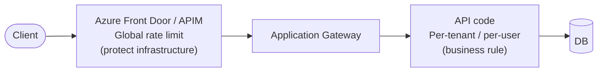
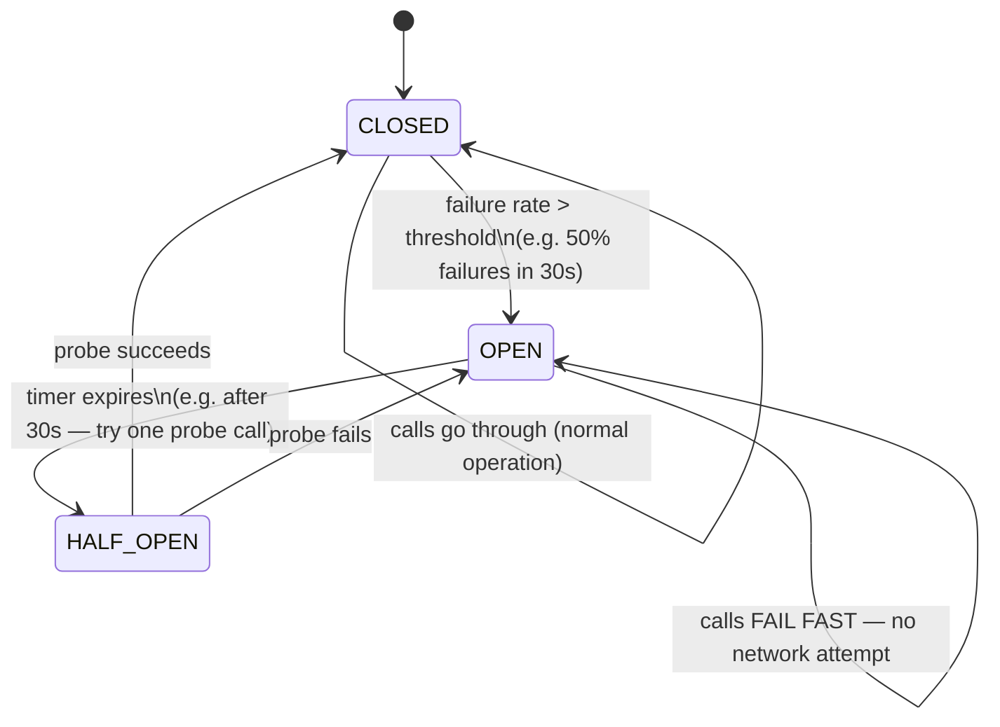
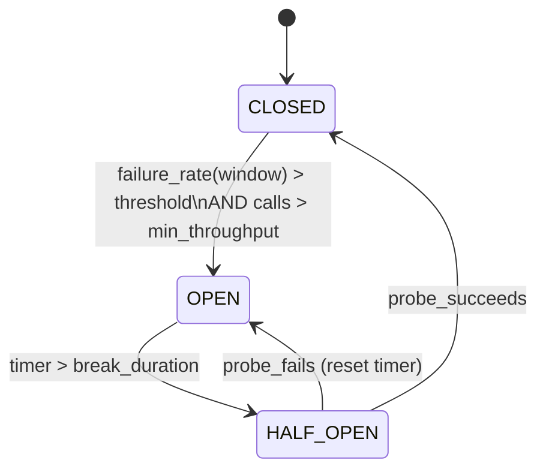

*[Grokking System Design](../../../README.md) · Module 3 — Compute and Communication Building Blocks · Day 11*

# Day 11 — Rate Limiting & Resilience

> **Today's one idea:** A circuit breaker stops calling a failing downstream service — giving it time to recover instead of hammering it into the ground; and a rate limiter protects your own service from the same fate by capping how much work any one client can demand.
> **Reading time:** ~40 min · **Prereqs:** Day 2 (trade-off framework), Day 8 (load balancing — health checks and failure detection), Day 9 (API design — APIM for gateway-level rate limiting), Day 10 (async messaging — temporal decoupling as a resilience tool)
> **Primary source for today:** Nygard, *Release It!* 2nd ed. (Pragmatic Bookshelf, 2018) — Chapter 4, "Stability Patterns," sections "Circuit Breaker" and "Bulkhead"

---

## The Hook (3 min)

It is 9 AM on a Monday. A CI pipeline bug causes your load-testing tool to run against production. Within 30 seconds, your API is receiving 50,000 requests per second — 50× normal load. Your Azure SQL connection pool exhausts. SQL queries queue up. Response times climb from 80ms to 12 seconds. The load balancer marks servers unhealthy. The entire API goes down.

Meanwhile, your API calls a third-party shipping service to calculate delivery estimates. That service is having its own rough morning — it's responding in 8 seconds per call instead of 100ms. Because your code calls it synchronously (blocking a thread per call), every thread in your thread pool is waiting for a slow shipping API. No threads are available to serve other requests. Your API is down not because of traffic, but because one dependency is slow.

Two problems, two building blocks:

1. **Rate limiting** — cap how much any one client (or all clients combined) can demand from your service.
2. **Circuit breaker** — stop calling a failing dependency and fail fast instead of waiting.

These are the two most important resilience patterns for any production .NET service on Azure.

---

## Building the Intuition

### Rate limiting — the bouncer at the door

A rate limiter is a bouncer. It does not care who you are or what you want to do — it only cares how often you've knocked on the door recently. If you've knocked 100 times in the last minute, you wait outside until the next window opens.

**Why rate limit?**

- **Protect against runaway clients.** A buggy client in a retry loop can send millions of requests.
- **Enforce fair use.** In a multi-tenant SaaS, one tenant's spike shouldn't degrade others.
- **Monetize API tiers.** Free tier: 100 req/day. Paid tier: 10,000 req/day.
- **Prevent DDoS amplification.** An expensive search query called 1,000 times/second exhausts your DB.

### The token bucket algorithm

The most common rate limiting algorithm. Imagine a bucket that holds T tokens and refills at R tokens per second.

```
Bucket capacity: 10 tokens (maximum burst)
Refill rate:     2 tokens/second

t=0:   bucket = 10 tokens
t=0:   request arrives → consume 1 token → bucket = 9 tokens ✓
t=0:   9 more requests arrive → bucket = 0 tokens ✓ (all served)
t=0:   1 more request → bucket = 0 → REJECTED (429 Too Many Requests) ✗

t=0.5: bucket refills by 1 token (2 tokens/sec × 0.5s) = 1 token
t=0.5: 1 request → ✓

t=5:   bucket = min(10, 2×5) = 10 tokens (full again)
```

The bucket allows a **burst** (up to T requests instantaneously) while enforcing a **sustained rate** (R requests/second long-term). This is more user-friendly than a fixed window (which hard-resets at the window boundary, allowing double the rate at the boundary crossing).

**Other common algorithms:**

| Algorithm | Behaviour | Best for |
|-----------|-----------|---------|
| **Token Bucket** | Allows bursts up to T, sustained rate R | General purpose API throttling |
| **Fixed Window** | Count resets at interval (e.g., per minute) | Simple; boundary burst problem |
| **Sliding Window Log** | Tracks exact timestamps of last N requests | Precise; memory-intensive |
| **Leaky Bucket** | Requests drip out at fixed rate; excess queued or dropped | Smoothing bursty traffic |

### Where to enforce rate limits

Rate limiting can live at multiple layers:



**APIM / Front Door:** enforce subscription-level and IP-level limits before requests hit your code. Zero code required — configured via policies [(Day 9)](../day-09-api-design.md).

**In your .NET API:** enforce per-user or per-tenant business rules that require knowledge of the authenticated identity (APIM doesn't know your user table).

**ASP.NET Core 8 built-in rate limiting** (no external library needed):

```csharp
// Program.cs — configure rate limiting
builder.Services.AddRateLimiter(options =>
{
    // Global fixed-window limit: 100 req/min per IP
    options.AddFixedWindowLimiter("global", o =>
    {
        o.Window          = TimeSpan.FromMinutes(1);
        o.PermitLimit     = 100;
        o.QueueLimit      = 0;       // reject immediately (no queue)
        o.QueueProcessingOrder = QueueProcessingOrder.OldestFirst;
    });

    // Per-user sliding window: 20 req/10s per authenticated user
    options.AddSlidingWindowLimiter("perUser", o =>
    {
        o.Window          = TimeSpan.FromSeconds(10);
        o.PermitLimit     = 20;
        o.SegmentsPerWindow = 5;
        o.QueueLimit      = 0;
    });

    // Return 429 with Retry-After header
    options.OnRejected = async (context, ct) =>
    {
        context.HttpContext.Response.StatusCode = StatusCodes.Status429TooManyRequests;
        if (context.Lease.TryGetMetadata(MetadataName.RetryAfter, out var retryAfter))
            context.HttpContext.Response.Headers.RetryAfter =
                ((int)retryAfter.TotalSeconds).ToString();
        await context.HttpContext.Response.WriteAsync("Rate limit exceeded.", ct);
    };
});

app.UseRateLimiter();

// Apply per-user limit to a specific endpoint group
app.MapGroup("/search")
   .RequireRateLimiting("perUser")
   .MapGet("/{query}", SearchHandler);
```

> **Always return a `Retry-After` header** when responding with 429. Clients that honour it back off correctly; clients that ignore it reveal a bug.

---

### Circuit breaker — the electrical analogy

A circuit breaker in your house protects the wiring: when current exceeds a safe threshold, it *trips* (opens the circuit) and stops current flow. You reset it manually after checking the cause.

A software circuit breaker protects your application from a failing dependency. When calls to that dependency start failing, the breaker *trips* (opens) and **immediately returns an error** for subsequent calls — without even attempting the network call. After a timeout, it lets a probe call through (half-open state) to check if the dependency has recovered.



**Why fail fast instead of waiting?**

A slow dependency holds a thread for the full timeout (e.g., 10 seconds). If 100 requests/second are in flight and each takes 10 seconds, your thread pool fills up in 10 seconds. Every subsequent request waits in the queue. Your entire API becomes unresponsive — not because it's overloaded, but because it's waiting on one slow downstream service.

With a circuit breaker, once the breaker opens, every call returns in <1ms. Your thread pool is free. You serve all other requests normally. The shipping price feature shows "unavailable" — a degraded experience, not a total outage.

### Implementing circuit breakers with Polly

[**Polly**](https://www.thepollyproject.org/) is the standard .NET resilience library. Microsoft's `Microsoft.Extensions.Http.Resilience` package wraps Polly for use with `IHttpClientFactory`.

```csharp
// Program.cs — add resilience pipeline to an HTTP client
builder.Services.AddHttpClient<IShippingClient, ShippingClient>()
    .AddResilienceHandler("shipping-pipeline", pipeline =>
    {
        // 1. Retry: up to 3 attempts with exponential backoff + jitter
        pipeline.AddRetry(new HttpRetryStrategyOptions
        {
            MaxRetryAttempts      = 3,
            Delay                 = TimeSpan.FromMilliseconds(300),
            BackoffType           = DelayBackoffType.Exponential,
            UseJitter             = true,      // randomise delays to prevent thundering herd
            ShouldHandle          = args => ValueTask.FromResult(
                args.Outcome.Exception is HttpRequestException ||
                args.Outcome.Result?.StatusCode >= HttpStatusCode.InternalServerError)
        });

        // 2. Circuit Breaker: open after 50% failure rate over 30s sampling window
        pipeline.AddCircuitBreaker(new HttpCircuitBreakerStrategyOptions
        {
            SamplingDuration          = TimeSpan.FromSeconds(30),
            FailureRatio              = 0.5,   // 50% of calls fail → open
            MinimumThroughput         = 10,    // need at least 10 calls in window
            BreakDuration             = TimeSpan.FromSeconds(30), // stay open 30s
            ShouldHandle              = args => ValueTask.FromResult(
                args.Outcome.Exception is HttpRequestException ||
                args.Outcome.Result?.StatusCode >= HttpStatusCode.InternalServerError)
        });

        // 3. Timeout: fail any single call that takes longer than 3 seconds
        pipeline.AddTimeout(TimeSpan.FromSeconds(3));
    });
```

**The pipeline order matters:** Timeout wraps Circuit Breaker wraps Retry.
- A timed-out call counts as a failure for the circuit breaker.
- A circuit-breaker-open exception is not retried (retrying an open circuit makes no sense).

**Fallback strategy** — when the circuit is open, what do you return?

```csharp
// In ShippingClient.GetDeliveryEstimateAsync:
try
{
    return await _httpClient.GetFromJsonAsync<DeliveryEstimate>(
        $"/estimate?postcode={postcode}");
}
catch (BrokenCircuitException)
{
    // Circuit is open — return a degraded response rather than propagating the error
    _logger.LogWarning("Shipping service circuit open; using fallback estimate");
    return DeliveryEstimate.Unavailable;  // UI shows "Delivery estimate unavailable"
}
```

### Bulkhead pattern

Named after the watertight compartments in a ship's hull: if one compartment floods, the others remain dry. In software: **isolate resources (thread pools, connection pools) per downstream dependency** so one slow dependency can't exhaust the pool shared by all.

```
Without bulkhead:                  With bulkhead:
                                   
Single thread pool (20 threads)    Thread pool A: 10 threads → Shipping API
                                   Thread pool B: 5 threads  → Payment API
Shipping API slow →                Thread pool C: 5 threads  → Inventory API
all 20 threads blocked →           
Payment + Inventory calls fail     Shipping API slow →
                                   Thread pool A exhausted →
                                   Payment + Inventory still work ✓
```

With `IHttpClientFactory`, each named client gets its own connection pool. That's a bulkhead — already in place if you use named clients correctly.

---

## The Formal Picture

### Token bucket — the math

Let B = bucket capacity, R = refill rate (tokens/second), t = elapsed time.

```
tokens(t) = min(B, tokens(t-1) + R × Δt)
```

Maximum burst: B requests instantaneously. Sustained rate: R requests/second. If a client needs more than R req/s sustained, they will be throttled regardless of burst capacity.

### Circuit breaker states as a state machine



### Retry with exponential backoff and jitter

Naive retry (immediate): all failed clients retry simultaneously → spike → all fail again.

Exponential backoff: wait 300ms, 600ms, 1200ms... before each retry. Reduces retry throughput.

Jitter: add randomness — wait `delay × (1 ± random(0, 0.2))`. Spreads retries over time, preventing the *synchronized retry thundering herd* [(recall Day 6's cache stampede)](../02-storage-building-blocks/days/day-06-caching.md).

```
Polly's UseJitter = true implements: delay × random(0.75, 1.25)
```

---

## Where It Breaks / What It Is Not

**Rate limiting at the gateway is not sufficient alone.** APIM rate limits by subscription key or IP. But a single legitimate user hammering an expensive endpoint from inside your own network (e.g., a background job) bypasses APIM. Apply rate limiting at the application level too for expensive operations.

**Circuit breakers are not transaction rollback.** If a payment call succeeds and the circuit opens before you can record the result, you have an inconsistent state — payment charged but order not placed. Circuit breakers prevent *new* calls; they don't roll back *in-flight* operations. Design downstream calls to be idempotent [(Day 10)](../day-10-async-messaging.md) so retries and replays are safe.

**Retrying is not always safe.** Never retry a non-idempotent operation (e.g., `POST /charge`) without an idempotency key. Retrying a failed charge without an idempotency key can double-charge the customer. Polly's `ShouldHandle` predicate should exclude POST mutations unless you've confirmed idempotency.

**Timeouts must be shorter than the caller's timeout.** If your API has a 10-second SLA and you call Shipping (3s timeout) → Payment (3s timeout) → Inventory (3s timeout) sequentially, you've already spent 9 seconds on happy-path calls. One retry blows the 10-second budget. Allocate your timeout budget: `total_timeout / N_sequential_calls` per call.

---

## Try It Yourself

**Exercise 1 — Rate limit design**

Your API has a search endpoint that runs a full-text query against Azure AI Search. Each call costs ~$0.001 in RU consumption. You have three client tiers:

- **Free tier:** anonymous users, limit generously enough not to annoy but prevent abuse.
- **Basic tier:** authenticated paying users, search-as-a-feature.
- **Enterprise tier:** high-volume customers with SLA commitments.

Design the rate limit values (requests per window, window size) and algorithm for each tier. Where do you enforce them?

<details>
<summary>Worked answer</summary>

| Tier | Limit | Window | Algorithm | Enforcement |
|------|-------|--------|-----------|-------------|
| Free (anonymous) | 20 req | 1 minute | Fixed window by IP | APIM IP-based policy |
| Basic (authenticated) | 200 req | 1 minute | Sliding window by user ID | APIM subscription key + app-level check |
| Enterprise | 2,000 req | 1 minute | Token bucket (burst 500) | APIM + negotiated per-contract |

**Justification:**
- Free tier: IP-based (no user ID available). Fixed window is simpler. 20/min = 1/3 per second — enough for genuine use, too slow for scraping.
- Basic: sliding window is fairer (no boundary burst). User ID as key (from JWT claim in APIM policy).
- Enterprise: token bucket allows short bursts (e.g., 500 requests at batch start) while averaging 2,000/min. Enforce in APIM via `rate-limit-by-key` with a higher limit and negotiate custom limits in the subscription contract.

**Return `Retry-After` and `X-RateLimit-Remaining` headers** on all rate-limited responses. Basic and Enterprise tiers should get `X-RateLimit-Limit` and `X-RateLimit-Reset` too so they can self-throttle.

</details>

---

**Exercise 2 — Build the resilience pipeline**

Your .NET 8 API calls an external currency conversion service. Acceptable failure modes:

- If the service is slow (> 2 seconds), fail fast.
- If it's failing consistently, stop calling it for 45 seconds.
- If a transient 500 or 503 comes back, retry up to 2 times with backoff.
- If unavailable, return the last-known rate from cache (stale is acceptable; error is not).

Write the Polly resilience pipeline and the fallback logic (pseudocode is fine for the cache fallback).

<details>
<summary>Worked answer</summary>

```csharp
// Registration
builder.Services.AddHttpClient<ICurrencyClient, CurrencyClient>()
    .AddResilienceHandler("currency-pipeline", pipeline =>
    {
        pipeline.AddRetry(new HttpRetryStrategyOptions
        {
            MaxRetryAttempts = 2,
            Delay            = TimeSpan.FromMilliseconds(200),
            BackoffType      = DelayBackoffType.Exponential,
            UseJitter        = true,
            ShouldHandle     = args => ValueTask.FromResult(
                args.Outcome.Exception is HttpRequestException ||
                args.Outcome.Result?.StatusCode is
                    HttpStatusCode.InternalServerError or
                    HttpStatusCode.ServiceUnavailable)
        });

        pipeline.AddCircuitBreaker(new HttpCircuitBreakerStrategyOptions
        {
            SamplingDuration   = TimeSpan.FromSeconds(30),
            FailureRatio       = 0.6,           // 60% failures → open
            MinimumThroughput  = 5,
            BreakDuration      = TimeSpan.FromSeconds(45)
        });

        pipeline.AddTimeout(TimeSpan.FromSeconds(2));  // innermost — per attempt
    });

// In CurrencyClient.GetRateAsync:
public async Task<decimal> GetRateAsync(string from, string to)
{
    try
    {
        var rate = await _httpClient.GetFromJsonAsync<ExchangeRate>(
            $"/rate?from={from}&to={to}");
        // Store in cache for fallback
        await _cache.SetStringAsync($"fx:{from}:{to}", rate!.Value.ToString(),
            new DistributedCacheEntryOptions
            {
                AbsoluteExpirationRelativeToNow = TimeSpan.FromMinutes(30)
            });
        return rate!.Value;
    }
    catch (Exception ex) when (ex is BrokenCircuitException or TimeoutRejectedException
                                   or HttpRequestException)
    {
        // Fallback: return last-known rate from cache
        var cached = await _cache.GetStringAsync($"fx:{from}:{to}");
        if (cached is not null)
        {
            _logger.LogWarning("Currency service unavailable; using cached rate");
            return decimal.Parse(cached);
        }
        // No cached rate — propagate the error
        throw new CurrencyServiceUnavailableException(
            $"Currency rate {from}/{to} unavailable and no cached fallback.", ex);
    }
}
```

**Key decisions:**
- Timeout (2s) is innermost so each retry attempt gets its own 2-second budget.
- Circuit opens at 60% failure rate (looser than 50% because this is an external service that might have bursty errors).
- Cache write on success means the fallback is always as fresh as the last successful call.
- If no cached fallback exists, surface a meaningful exception rather than silently returning 0 (which would corrupt prices).

</details>

---

**Exercise 3 — Cascade failure analysis**

Review this call chain:

```
API (10s timeout) → Order Service (8s timeout) → Payment Service (6s timeout) → Stripe
```

Stripe starts returning 5s responses (slow but successful). What happens? What is the maximum latency the user experiences? What happens if 200 concurrent users hit the API simultaneously?

<details>
<summary>Worked answer</summary>

**Latency:** Stripe returns in 5s → Payment Service adds overhead → ~5.2s → Order Service adds overhead → ~5.4s → API → user waits **~5.5 seconds**. This is within the 10s API timeout but already terrible UX.

**Concurrency at 200 users:** Each request holds a thread in Order Service for ~5 seconds. Order Service's thread pool (default ASP.NET Core: min 10, soft cap ~100) fills up in `100 threads / (200 req/s × 5s hold) = 0.1 seconds`. Every subsequent request queues or returns 503. Cascade: API starts timing out calls to Order Service → API returns 503s to users.

**The fix:** Three layers.
1. **Timeout at Stripe:** set the Stripe SDK timeout to 3s. A 5s Stripe response now fails fast.
2. **Circuit breaker in Payment Service:** after 50% failures in 30s, open circuit and return a known-bad result (don't keep waiting for Stripe).
3. **Async decoupling (Day 10):** move the payment call to a queue. Order Service accepts the order (fast), returns 202. Payment Service processes from queue asynchronously. User sees "Order received — payment processing" instead of waiting 5+ seconds.

The circuit breaker alone saves Payment Service from thread exhaustion. The async redesign saves all three services from the cascade.

</details>

---

## Connect It Back

You now have the full Module 3 toolkit:

- **Day 8 (Load balancer):** route requests to healthy servers.
- **Day 9 (API design):** define the contract clients speak.
- **Day 10 (Async messaging):** decouple work that can happen later.
- **Day 11 (Rate limiting + Circuit breaker):** protect yourself from bad clients, and protect downstream services from yourself.

Resilience is not one pattern — it is a layered defence. A rate limiter stops excessive inbound load. A timeout stops you from waiting forever. A retry handles transient failures. A circuit breaker stops you from cascading failures downstream. A bulkhead isolates which pool drains. None of these alone is sufficient; together they make a system that degrades gracefully instead of collapsing completely.

**Tomorrow** (Day 12) is a rest-and-synthesise day. No new patterns — only the URL shortener from Day 1, rebuilt using every building block from Days 1–11.

**Question you should now be able to answer:** *Describe in one paragraph why a circuit breaker must transition through a HALF-OPEN state rather than going directly from OPEN back to CLOSED after the break duration expires.*

---

## Suggested Readings for Today

**Required if you have 15 extra minutes:**
Nygard, *Release It!* 2nd ed. — Chapter 4, "Stability Patterns," section "Circuit Breaker" (pp. 94–110). Nygard invented the circuit breaker pattern name and gives the clearest account of why it exists: the integration points between services are where most production outages originate, and the circuit breaker is the one pattern that stops a partial failure from becoming a total one.

**If you want the deep version:**

1. Nygard, *Release It!* — Chapter 4, same section, continuing through "Bulkhead" and "Timeouts" (pp. 110–120). Nygard's bulkhead and timeout patterns complete the picture. Read these back to back with today's page — each pattern addresses a different phase of a cascade failure.

2. Polly documentation — "Resilience pipelines" and "Circuit breaker": [https://www.pollydocs.org/strategies/circuit-breaker.html](https://www.pollydocs.org/strategies/circuit-breaker.html). The official Polly v8 docs cover every strategy option for `AddCircuitBreaker`, `AddRetry`, and `AddTimeout`. Essential reference for the next time you configure these in a real service.

3. Microsoft Azure Architecture Center — "Retry pattern": [https://learn.microsoft.com/en-us/azure/architecture/patterns/retry](https://learn.microsoft.com/en-us/azure/architecture/patterns/retry), and "Circuit Breaker pattern": [https://learn.microsoft.com/en-us/azure/architecture/patterns/circuit-breaker](https://learn.microsoft.com/en-us/azure/architecture/patterns/circuit-breaker). Azure's implementation guidance with .NET code examples. Read both (15 minutes total) as the Azure-specific complement to Nygard's conceptual explanation.

---

← [Day 10 — Async Messaging](day-10-async-messaging.md) &nbsp;|&nbsp; [Day 12 — Rest & Synthesise I →](day-12-rest-synthesise.md)
