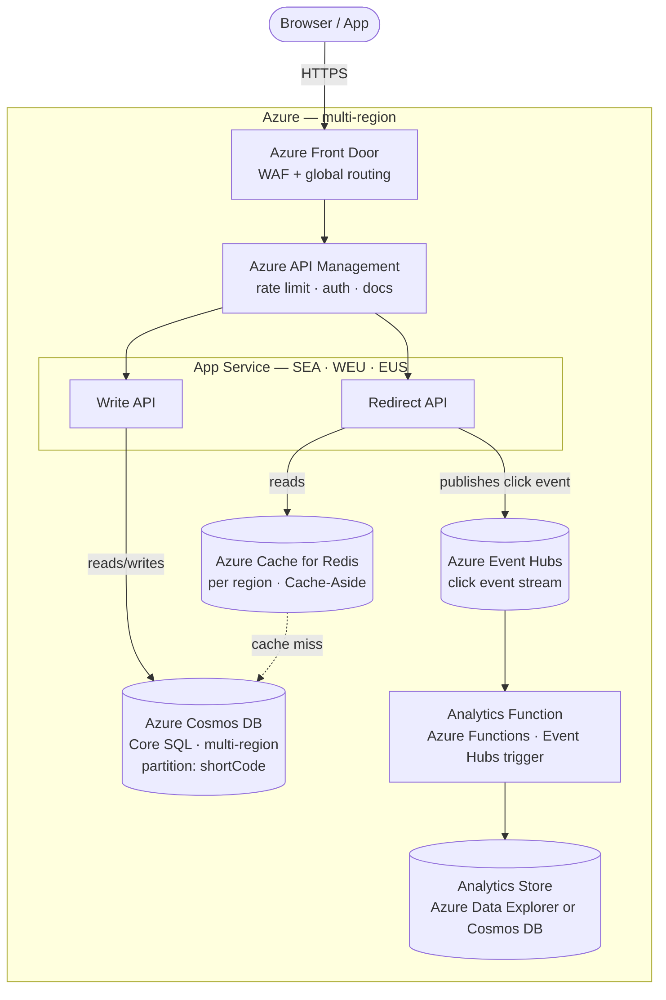

*[Grokking System Design](../../../README.md) · Module 3 — Compute and Communication Building Blocks · Day 12*

# Day 12 — Rest & Synthesise I

> **Today's one idea:** Every building block from Days 1–11 exists to solve a specific failure mode — reading back through them as a unified design for a real system reveals how they compose, depend on each other, and form a coherent whole.
> **Reading time:** ~30 min (no new material — reflect, reconstruct, consolidate) · **Prereqs:** Days 1–11
> **Primary source for today:** Your own notes. This is a Feynman-test day: close every tab, open a blank document, and explain the URL shortener design from scratch.

---

## How to Use This Day

This is not a lecture day. There is nothing new to learn. This is a **reconstruction day** — you already have all the pieces; today you find out how well they fit together in your head.

The method: take the URL shortener from Day 1 (the simplest plausible system design) and redesign it using every building block you have now. Start from the requirements. Make every storage and communication decision explicitly, citing the trade-off framework from Day 2. Draw the C4 Container diagram from Day 3.

If you can do this cleanly, you understand Days 1–11. If you get stuck, that is precisely the value of this day — the gap in your mental model shows up here, before you need it in a real design review.

---

## The Problem: URL Shortener at Scale

You last saw the URL shortener on Day 1, where it was a sketch. Here are the **requirements at production scale**:

### Functional requirements
1. Given a long URL, generate a unique short code (6–8 characters).
2. Given a short code, redirect to the original URL.
3. Track click analytics: timestamp, referrer, country (coarse geolocation).
4. Allow custom aliases (`mycompany.short/launch` instead of `sh.rt/x4kQ2p`).
5. Set expiry on short URLs (optional — URL stops redirecting after a date).

### Non-functional requirements (your quality attribute priorities, in order)
1. **Availability:** 99.9% (8.7 hours/year downtime budget). Redirects must work even if the analytics pipeline is down.
2. **Latency:** p99 redirect latency < 100ms globally.
3. **Scalability:** 100M redirects/day read load; 1M new URLs/day write load.
4. **Durability:** A stored URL must never be silently lost.
5. **Cost:** Optimise where possible — this is a high-read, low-write workload.

### Capacity estimation
From Day 1's formulas:

```
Redirect QPS:  100M / 86,400 ≈ 1,160 req/s (peak ~3× = ~3,500 req/s)
Write QPS:     1M   / 86,400 ≈  12  req/s  (negligible)
Read:Write ratio ≈ 100:1 → heavily read-dominant → caching is high-value

Storage (URLs):  1M URLs/day × 365 days × 5 years × ~500 bytes/URL ≈ 900 GB
Storage (clicks): 100M clicks/day × 100 bytes/click × 365 days ≈ 3.65 TB/year
```

---

## Reconstruct the Design

Work through each decision below. For every one, write 1–2 sentences justifying your choice using the trade-off framework. Then check your reasoning against the provided answer.

---

### Decision 1 — Where do you store the URL mapping?

You need to store `{shortCode → longUrl, createdAt, expiresAt, userId}`. There will be ~900 GB of this data over 5 years. The *only* access pattern is: **look up the long URL by short code** (point lookup by primary key, no JOINs, no full-text search).

**Your answer:**

<details>
<summary>Guided answer</summary>

**Cosmos DB (Core SQL API), partition key = `shortCode`.**

**Reasoning:**
- Access pattern is pure point lookup by key — exactly what a key-value/document store optimises for [(Day 5)](../02-storage-building-blocks/days/day-05-nosql.md).
- Cosmos DB provides single-digit millisecond reads at any scale, globally distributed with multi-region writes if needed.
- 900 GB over 5 years: well within Cosmos DB's unlimited storage per partition.
- Partition key = `shortCode` — every redirect is a single-partition read. No fan-out.

**Why not Azure SQL?**
- SQL works fine at this scale, but the access pattern is not relational — there are no JOINs, no foreign keys, no complex queries. The overhead of a full relational engine adds latency without benefit [(Day 4's Decision Guide)](../02-storage-building-blocks/days/day-04-relational-databases.md).

**Why not Redis?**
- 900 GB in Redis = expensive in-memory storage. Redis is right for hot data; Cosmos DB handles the full dataset durably at far lower cost [(Day 5 Decision Guide)](../02-storage-building-blocks/days/day-05-nosql.md).

</details>

---

### Decision 2 — How do you achieve < 100ms p99 redirect latency globally?

A Cosmos DB read in East US takes ~5ms from an East US client. From a Singapore client, the same read takes ~180ms (round-trip to East US). Your SLA is 100ms globally.

**Your answer:**

<details>
<summary>Guided answer</summary>

**Two layers:**

**Layer 1 — Cosmos DB multi-region reads.** Enable Cosmos DB multi-region replication with read endpoints in the regions where your users are (e.g., East US, West Europe, Southeast Asia). Each region serves reads locally (~5–10ms). Use Cosmos DB's "nearest region" routing in the SDK.

**Layer 2 — Azure Cache for Redis (Cache-Aside pattern).** A Redis cluster in each region caches recently-accessed short codes. TTL = 24 hours (most short links are clicked within a day of being shared). Cache hit = < 1ms local Redis lookup → total redirect path < 10ms.

```
Request path for a redirect:
  User (Singapore) → Azure Front Door → Singapore POP → App Service (SEA)
      → Redis (SEA) HIT?  → redirect 301 (< 10ms total)
      → Redis MISS → Cosmos DB (SEA read endpoint) → cache → redirect (< 20ms)
```

**Cache eviction:** LRU with 24-hour TTL [(Day 6)](../02-storage-building-blocks/days/day-06-caching.md). The top 1% of URLs (viral links) will have 99% cache hit rate. Long-tail URLs miss and go to Cosmos DB — still fast at 5ms locally.

**Why not CDN for the redirect itself?** CDN caches HTTP responses. A `301 Permanent Redirect` response can be cached by CDN and client browser — but then expiry and deactivation are impossible to propagate (the CDN and browser have the cached redirect forever). Use `302 Found` (temporary redirect, not cached) and cache the lookup in Redis instead.

</details>

---

### Decision 3 — How do you store click analytics without impacting redirect latency?

Each redirect should record: `{shortCode, timestamp, userAgent, referrer, countryCode}`. You expect 100M click events/day. Storing this synchronously in the redirect path would add latency.

**Your answer:**

<details>
<summary>Guided answer</summary>

**Async: publish click events to Azure Event Hubs, process separately.**

**Reasoning:**
- Click recording is a non-critical side effect. The user cares about the redirect, not that their click was recorded [(Day 10)](../day-10-async-messaging.md).
- Synchronous DB write in the redirect path adds 5–30ms and creates a write bottleneck (100M writes/day = 1,160 writes/s peak, shared with reads on the same DB node).
- Event Hubs handles millions of events/second. The redirect API publishes a lightweight event (~100 bytes) and returns immediately.
- A separate **analytics worker** (Azure Function triggered by Event Hubs) reads events and writes to Azure Data Explorer or Cosmos DB analytics collection.

**Availability benefit:** If the analytics pipeline goes down, redirects keep working. Click events buffer in Event Hubs (retention: 7 days) and are processed when the pipeline recovers. This directly addresses NFR #1 (redirects must work even if analytics is down).

```
Redirect path (latency-critical):
  GET /x4kQ2p → Redis → Cosmos DB → publish to Event Hubs → 302 to long URL

Analytics path (decoupled):
  Event Hubs → Azure Function → write to analytics store
```

</details>

---

### Decision 4 — How do you prevent the short code generation service from creating collisions?

When two requests try to create a short URL at the same time, you must not assign the same 6-character code to two different long URLs.

**Your answer:**

<details>
<summary>Guided answer</summary>

**Two options; the right one depends on your consistency requirement:**

**Option A — Cosmos DB unique constraint on `shortCode`.**
Generate a random 6-character code (62^6 ≈ 56 billion possibilities). Attempt to insert with `shortCode` as the partition key (and the unique key constraint). If a duplicate exists, Cosmos DB returns a 409 Conflict — retry with a new code. At 1M URLs/day against 56B possible codes, the probability of a collision is negligible, and retries are rare.

**Option B — Counter + Base62 encoding (Twitter Snowflake-style).**
Maintain an atomic counter in Azure Cache for Redis (`INCR url_counter`). Encode the integer in base62 to produce the short code. Guaranteed unique, no retries. But: Redis must be highly available (use Redis with replication), and the counter is a single sequence — URLs are predictable (sequential, not random), which may be a security concern (users can enumerate codes).

**Recommended for this workload:** Option A (random + Cosmos DB unique key). The collision probability at this scale is ~1 in 56M per insert. The code is non-guessable (security). Retries are rare. No additional infrastructure.

</details>

---

### Decision 5 — What does the load balancing / entry point look like?

100M redirects/day across multiple regions. Which Azure load balancing service(s) do you use?

**Your answer:**

<details>
<summary>Guided answer</summary>

**Azure Front Door as the global entry point.**

- Front Door routes each request to the nearest healthy regional deployment (Southeast Asia, West Europe, East US) — achieves the global latency target [(Day 8)](../day-08-load-balancing.md).
- Front Door includes WAF — blocks malicious traffic (bot floods, SQL injection in URL parameters) at the edge.
- Front Door includes CDN capability — though we're not caching the redirect itself, we *can* cache the homepage and analytics dashboard assets.
- Health probes detect regional failures and reroute automatically (supports the 99.9% availability SLA).

**Behind Front Door:** each region runs an **Application Gateway** (Layer 7, path-based routing: `/api/*` to the write API, all other paths to the redirect service) in front of **Azure Container Apps** or **App Service** instances.

**Why not just Application Gateway?** Application Gateway is regional. It doesn't route across regions. Front Door is the only Azure service that provides global, latency-based routing.

</details>

---

### Decision 6 — What does the full API contract look like?

Which protocol (REST / GraphQL / gRPC) for the public API? What does Azure APIM add?

**Your answer:**

<details>
<summary>Guided answer</summary>

**REST for the public API. APIM in front.**

- The URL shortener has a clear resource model: a short URL is a resource (`/urls/{code}`). REST maps cleanly to CRUD on this resource [(Day 9)](../day-09-api-design.md).
- Third parties (developers building link shorteners, social media tools) expect a REST API. gRPC is browser-incompatible; GraphQL is overkill for this simple resource model.

**APIM adds:**
- Rate limiting per API key (prevent abuse: free tier 1,000 URLs/day, paid tier unlimited).
- JWT validation (authenticate users creating URLs).
- Developer portal with auto-generated docs.
- Versioning (`/v1`, `/v2`) for future breaking changes.

**gRPC** could be used for the internal call from the redirect service to the code-generation service if they are split into microservices — but that's an internal communication concern, not the public API.

</details>

---

## The Full System — C4 Container Diagram

Now draw (or review) the Container diagram for the URL shortener at scale.



---

## Self-Assessment Checklist

Before moving to Module 4, confirm you can answer each of these without looking at your notes:

**Module 1 (Methodology):**
- [ ] What are the four steps of the Day 1 methodology, in order?
- [ ] What does a weighted scoring matrix look like? Can you draw one for three options and three quality attributes?
- [ ] What four vocabulary elements does a C4 Container diagram contain?

**Module 2 (Storage):**
- [ ] Why do you exhaust vertical scaling before horizontal sharding in SQL?
- [ ] What is the Cosmos DB API selection flowchart? (Core SQL → MongoDB → Cassandra → Gremlin)
- [ ] Cache-Aside in 3 steps, from memory.
- [ ] What is the cache stampede problem and one mitigation?
- [ ] When do you use Blob Storage vs CDN vs Azure AI Search?

**Module 3 (Compute & Communication):**
- [ ] Which Azure load balancing service handles multi-region failover?
- [ ] When do you choose gRPC over REST?
- [ ] What is the difference between Azure Service Bus and Azure Event Hubs (one sentence each)?
- [ ] What is the Outbox Pattern and why does it exist?
- [ ] Describe the three circuit breaker states and the condition for each transition.

If any of these trips you up, re-read that day's "Today's one idea" and "Decision Guide" sections before proceeding to Module 4.

---

## Looking Forward

Module 4 — **Distributed Systems Reality** — is where the theoretical models from earlier modules meet the fundamental impossibilities of distributed computing:

- **Day 13 — CAP Theorem:** You cannot simultaneously have Consistency and Availability when a network partition occurs. Every storage decision you've made has silently chosen a side. Day 13 makes the choice explicit.
- **Day 14 — Distributed Transactions:** Cosmos DB's multi-region replication, Service Bus's at-least-once delivery, the Outbox Pattern — all of these are workarounds for the same impossibility: you cannot have an atomic transaction across two independently-failing machines.
- **Day 15 — Observability:** A distributed system fails in ways a single process cannot. You need metrics, distributed traces, and structured logs before you can debug production.
- **Day 16 — Resilience at Scale:** Chaos engineering, bulkheads, and graceful degradation strategies for when things go wrong at scale.

The URL shortener you just designed is 90% of a production-grade system. Module 4 shows you the 10% that kills you in production.

---

## Suggested Reading for Today

**No required reading today.** Use the time saved for active recall:
1. Spend 15 minutes drawing the C4 Container diagram from memory (no notes).
2. Spend 10 minutes writing out every Azure service used in the URL shortener and its role in one sentence.
3. Spend 5 minutes writing the answer to the Day 11 question: *"Why must a circuit breaker go through HALF-OPEN rather than directly back to CLOSED?"*

**If you want optional reading:**
Xu, *System Design Interview* Vol. 1 — Chapter 8, "Design a URL Shortener" (pp. 89–104). This is Xu's own treatment of the same problem. Compare his design decisions against yours. His approach differs in the ID generation strategy (he uses a distributed ID generator) — think about the trade-offs between his approach and the Cosmos DB unique key approach you designed above.

---

← [Day 11 — Rate Limiting & Resilience](day-11-rate-limiting-resilience.md) &nbsp;|&nbsp; [Day 13 — CAP Theorem →](../../04-distributed-systems-reality/days/day-13-cap-theorem.md)
