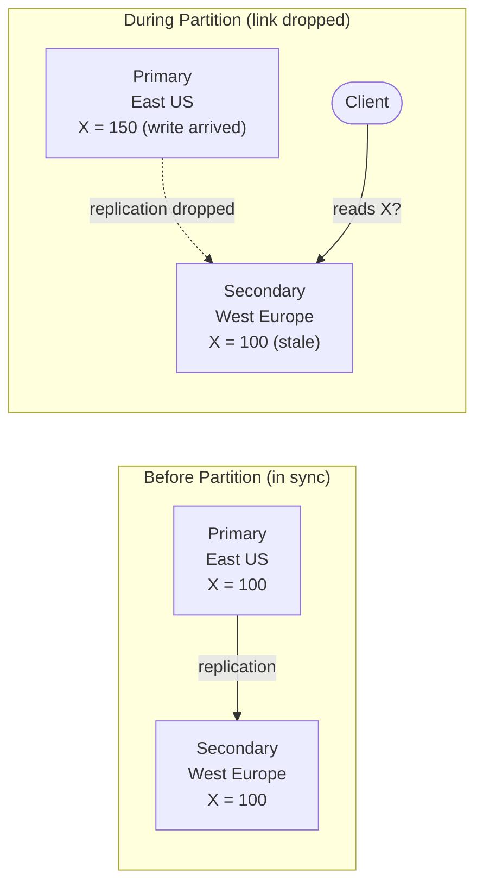

*[Grokking System Design](../../../README.md) · Module 4 — Distributed Systems Reality · Day 13*

# Day 13 — CAP Theorem

> **Today's one idea:** When a network partition occurs in a distributed data store, the system must choose between returning a potentially stale answer (Availability) and refusing to answer at all (Consistency) — there is no option that provides both.
> **Reading time:** ~38 min · **Prereqs:** Day 4 (relational databases — replication), Day 5 (NoSQL — Cosmos DB, partition keys), Day 10 (async messaging — eventual consistency introduced)
> **Primary source for today:** Gilbert, S. and Lynch, N., "Brewer's Conjecture and the Feasibility of Consistent, Available, Partition-Tolerant Web Services," ACM SIGACT News, Vol. 33, No. 2, 2002. [https://dl.acm.org/doi/10.1145/564585.564601](https://dl.acm.org/doi/10.1145/564585.564601)

---

## The Hook (3 min)

Two ATMs, same bank. One in Sydney, one in London. Both connected to a central database via a transatlantic network link.

A customer has $500 in their account. At exactly 9 AM:
- In Sydney: they withdraw $500.
- In London (0.1 seconds later, before Sydney's write has propagated): the same customer's wife withdraws $500 using a joint account.

The network link is slow — there's 180ms of latency. For a brief moment, both ATMs believe the account has $500. The bank just paid out $1,000 from a $500 account.

The engineers have two options:

1. **Refuse to process the London withdrawal** until Sydney's write is confirmed across the network. This guarantees correctness — but the London customer waits, and if the network link fails, neither ATM can operate.

2. **Process both withdrawals optimistically**, then reconcile (and reverse one) later. This keeps both ATMs running even during slow network periods — but the bank account briefly goes negative.

This is the CAP theorem in concrete terms. Neither option is wrong. They represent different trade-offs. The theorem says you *must* choose.

---

## Building the Intuition

### The three properties

**Consistency (C):** Every read receives the most recent write or an error. After any write completes, any subsequent read — from any node — returns that value. No node ever returns stale data.

**Availability (A):** Every request receives a response (not an error). The system may return a non-error answer even if some nodes are unreachable.

**Partition Tolerance (P):** The system continues operating even if some messages between nodes are lost or delayed — i.e., even if the network splits into disconnected sub-networks.

### Why P is not optional

A network partition is not a rare catastrophe — it is a physical certainty at scale. Networks drop packets. Cables get cut. Azure availability zones lose inter-zone connectivity. TCP timeouts misfire. Even without a full partition, a slow network is indistinguishable from a partition from the system's perspective.

If you build a distributed system, you *must* handle partitions. P is not a choice — it is a requirement. This means the real trade-off is always:

> **In the presence of a network partition: do you sacrifice C or A?**

- **CP system:** when a partition occurs, refuse requests that can't be served consistently. Some requests get errors. Data is never stale.
- **AP system:** when a partition occurs, keep serving requests even if data may be stale. No errors. Data may be inconsistent until the partition heals.

### A concrete partition

Imagine two database replicas: primary in East US, secondary in West Europe. A partition occurs (the transatlantic link drops).

**CP choice:** Secondary refuses to answer (or returns an error) because it can't verify it has the latest value. The client gets an error. Consistent, unavailable during partition.

**AP choice:** Secondary returns X = 100 (stale). The client gets an answer. Available, but inconsistent.

There is no third option. You cannot invent a response that is both "definitely current" and "always non-error" — because the secondary does not know what the primary has done since the link dropped.

---

## The Formal Picture

### The original statement

Brewer's conjecture (2000), formalised by Gilbert and Lynch (2002):

> *It is impossible for a web service to provide all three of the following guarantees simultaneously: Consistency, Availability, and Partition Tolerance.*

Proof sketch: Consider two nodes N₁ and N₂ connected by a network. Suppose a write goes to N₁. If a partition prevents N₁ from replicating to N₂, and a read arrives at N₂:
- If N₂ responds (Availability): it returns the stale pre-write value → not Consistent.
- If N₂ is Consistent: it must refuse to respond or return an error → not Available.
- Removing Partition Tolerance would require assuming the network never fails — not possible in a real distributed system.

### Consistency levels — the spectrum

CAP's "Consistency" is binary (linearisability — the strongest possible model). In practice, systems offer a *spectrum* of consistency levels:

| Level | Guarantee | Latency | Azure service example |
|-------|-----------|---------|----------------------|
| **Strong / Linearisable** | Every read returns the most recent write, globally. | Highest | Cosmos DB "Strong" consistency; Azure SQL synchronous replica |
| **Bounded Staleness** | Reads lag behind writes by at most K versions or T seconds. | Medium-high | Cosmos DB "Bounded Staleness" |
| **Session** | Within a session, reads reflect your own writes. | Medium | Cosmos DB "Session" (default) |
| **Consistent Prefix** | Reads never see out-of-order writes. No gaps. | Low | Cosmos DB "Consistent Prefix" |
| **Eventual** | Given no new writes, all replicas eventually converge. | Lowest | Cosmos DB "Eventual"; Redis asynchronous replication |

> **Cosmos DB's default consistency level is Session** — the most pragmatic trade-off for most applications. Within your user's session, reads are consistent with their writes. Across sessions, other users may briefly see older data.

### Where every Azure service sits

| Azure Service | CAP Profile | Why |
|--------------|-------------|-----|
| Azure SQL (synchronous replica) | CP | Synchronous replication: secondary can't serve reads during partition; writes block until replicated |
| Azure SQL (asynchronous read replica) | AP | Async replica: reads always served, may be stale |
| Cosmos DB Strong consistency | CP | Every read confirmed from quorum — refuses if quorum unreachable |
| Cosmos DB Session / Eventual consistency | AP | Serves reads from nearest replica, stale possible |
| Azure Cache for Redis | AP | Redis async replication — fast reads, stale possible during failover |
| Azure Service Bus | CP | Message not ACK'd until persisted to at least one replica; queue unavailable if quorum lost |
| Azure Storage (LRS) | AP (within region) | Three-way replica within datacenter; reads from any replica |

---

## Where It Breaks / What It Is Not

**CAP is not an excuse for ignoring consistency.** "We're an AP system" does not mean "we don't care about correctness." It means: *we have designed compensating mechanisms — conflict resolution, idempotency, last-write-wins, CRDTs — to handle the temporary inconsistency.* Choosing AP without implementing those mechanisms is not a trade-off, it's a bug.

**CAP is not the only trade-off.** The PACELC theorem extends CAP: even when there is *no* partition (the normal case), you must still trade off **Latency vs Consistency**. A strong-consistency read requires waiting for a quorum acknowledgement — that's extra latency on every read, partition or not. Cosmos DB's five consistency levels are an explicit PACELC dial.

**"Eventual consistency" is not a magic wand.** Eventual consistency guarantees that, in the absence of new writes, all replicas will *eventually* converge. It says nothing about *how long* that takes. In a misconfigured system, "eventually" can mean hours. Define your convergence SLO.

**CAP's C is linearisability — much stronger than SQL's ACID consistency.** ACID's C (Consistency) means "the transaction leaves the database in a valid state per defined constraints." CAP's C means "every read in the entire distributed system sees the latest write." These are different things. A CP system in the CAP sense can still violate ACID consistency if transactions aren't properly isolated.

---

## Try It Yourself

**Exercise 1 — Classify the system**

For each design decision, state whether it makes the system lean CP or AP, and what the user-visible consequence is during a partition:

a) A social media "like" counter. You use Cosmos DB with Eventual consistency. During a partition, a user's like count might read as 1,247 when the true value is 1,251.

b) A bank account balance. You use Azure SQL with synchronous replication. During a partition between primary and secondary, all reads from the secondary return an error.

c) A shopping cart. You store cart items in Cosmos DB with Session consistency. During a partition, a cart read from a different region may not show the most recently added item.

Worked answer

a) **AP.** The system returns an answer (Available) but it may be stale (not Consistent). User-visible consequence: the like count is slightly off for a brief window. This is acceptable — a like counter being 4 off for 50ms is undetectable and inconsequential.

b) **CP.** The system returns an error rather than stale data (Consistent but not Available during partition). User-visible consequence: the user's balance page shows an error during the partition window. This is *correct* for a bank — showing a stale balance that causes an overdraft is a worse outcome than showing an error.

c) **Session-level consistency (between CP and AP).** Within the same user's session on the same node, the cart is consistent with their writes. But if a partition routes them to a different region's replica, the most recent add might not be visible. User-visible consequence: the item they just added may temporarily disappear. This is the trade-off Cosmos DB Session makes: convenient (works for most single-region, single-session patterns) but not globally consistent.

---

**Exercise 2 — Choose the consistency level**

You are designing an Azure Cosmos DB deployment for these three collections. Choose the consistency level for each and justify using the CAP/PACELC framework.

a) `UserProfiles` — read on every page load, written when user updates settings. ~100,000 reads/second globally. Stale profile data (e.g., showing old username) for a few seconds is acceptable.

b) `InventoryCount` — a counter of how many units of a product are in stock. Must not allow overselling (selling 101 units of a 100-unit stock).

c) `OrderStatus` — a user polls this to see if their order is confirmed/shipped/delivered. The user created the order from the same session; they should always see their own updates.

Worked answer

a) **Eventual consistency.** Lowest latency, highest throughput. Stale profile data for seconds is explicitly acceptable. With 100,000 reads/second globally, Strong consistency would add significant latency and cost (requires quorum reads).

b) **Strong consistency — or, better, a different architectural decision.** Strong consistency prevents reading a stale count and issuing one-too-many orders. However, Strong consistency in Cosmos DB adds latency and reduces availability. *The better answer:* use optimistic concurrency (ETag-based conditional updates) rather than relying on consistency level alone — this prevents concurrent overwrites regardless of replication lag.

c) **Session consistency (default).** The user always reads their own writes within their session. They will see their own order updates. Other users reading the same order from different sessions may briefly see an older status — acceptable. Session consistency is the correct default for user-facing state that primarily needs to reflect your *own* recent writes.

---

**Exercise 3 — Design the conflict resolution**

You choose AP (Eventual consistency) for a collaborative document editing feature. Two users edit the same document simultaneously during a partition. When the partition heals, both edits need to be merged.

What are the three common conflict resolution strategies, and which would you choose for a text document? Which would you choose for a user profile's "last login time"?

Worked answer

**Three common strategies:**

1. **Last-Write-Wins (LWW):** The write with the later timestamp wins. Simple to implement. Loses one user's edit silently. Good for: scalar values where losing an older update is acceptable.

2. **First-Write-Wins:** The earlier write wins; later conflicting writes are rejected. Good for: exclusive resource acquisition (only one user can claim a promo code).

3. **Merge / CRDT (Conflict-free Replicated Data Type):** Both edits are merged using a defined merge function. For text: operational transforms or CRDTs (like Y.js) can merge character-level edits without losing either user's work. Complex to implement.

**For a text document:** **CRDT / operational transforms.** Last-Write-Wins would silently discard one user's edits — unacceptable for collaborative editing. Google Docs uses operational transforms; Figma uses CRDTs. The merge function defines: "insert char at position X" + "insert char at position Y" → apply both in a deterministic order.

**For "last login time":** **Last-Write-Wins.** The later timestamp is always more correct. LWW is semantically correct here, and losing the "older" login time is fine — there's no meaningful information in the older value.

Cosmos DB's conflict resolution: configurable per container — LWW (using a custom timestamp field), first-write-wins, or custom (Azure Function invoked on conflict).

---

## Connect It Back

Everything in Module 2 that you took for granted now has a formal name. When Day 4 said "synchronous replication adds latency" — that's CP behaviour: you wait for the quorum before acknowledging the write. When Day 6 said "cache reads may be stale" — that's AP behaviour: you return from the cache without confirming it matches the primary. When Day 5 introduced Cosmos DB's consistency levels — that's the PACELC dial in practice.

The CAP theorem is not academic. It is the reason every production database has a replication lag setting. It is the reason your cart might briefly lose an item. It is the reason your bank's ATM locks your account before dispensing cash. Now you can read those decisions and name them.

**Tomorrow** (Day 14) you go deeper: if you can't guarantee consistency across two machines, how do you implement a multi-step business process (place order → reserve inventory → charge card → send email) that spans multiple services and must be atomically correct?

**Question you should now be able to answer:** *A teammate proposes using Cosmos DB with Strong consistency for all collections "to avoid any staleness issues." What are the two specific costs they're accepting, and in what scenarios is Strong consistency actually justified?*

---

## Suggested Readings for Today

**Required if you have 15 extra minutes:**
Kleppmann, *DDIA* — Chapter 9, "Consistency and Consensus," section "Linearisability" (pp. 324–338). Kleppmann gives the most rigorous yet accessible explanation of what linearisability (CAP's C) actually means — with diagrams showing exactly how a non-linearisable system can violate read-after-write guarantees in ways that are surprising. The register example on page 327 is worth 15 minutes of anyone's time.

**If you want the deep version:**

1. Gilbert and Lynch, "Brewer's Conjecture" (2002) — the 6-page formal proof. [https://dl.acm.org/doi/10.1145/564585.564601](https://dl.acm.org/doi/10.1145/564585.564601). Read Sections 1–3 (3 pages). The proof is accessible and the precision cuts through the hand-waving in most blog posts.

2. Kleppmann, *DDIA* — Chapter 9, section "The CAP Theorem" (pp. 336–338) and "Linearisability and network delays" (pp. 338–339). Kleppmann critiques CAP's limitations (it's a 2-of-3 claim but the real trade-off is richer) and introduces PACELC informally. Essential for understanding why "just pick CP or AP" is an oversimplification.

3. Cosmos DB consistency documentation — "Consistency levels in Azure Cosmos DB": [https://learn.microsoft.com/en-us/azure/cosmos-db/consistency-levels](https://learn.microsoft.com/en-us/azure/cosmos-db/consistency-levels). The Azure-specific mapping of PACELC theory to a service you'll actually configure. Read the consistency level comparison table and the latency/throughput impact section.

---

← [Day 12 — Rest & Synthesise I](../../03-compute-communication-building-blocks/days/day-12-rest-synthesise.md) &nbsp;|&nbsp; [Day 14 — Distributed Transactions →](day-14-distributed-transactions.md)
