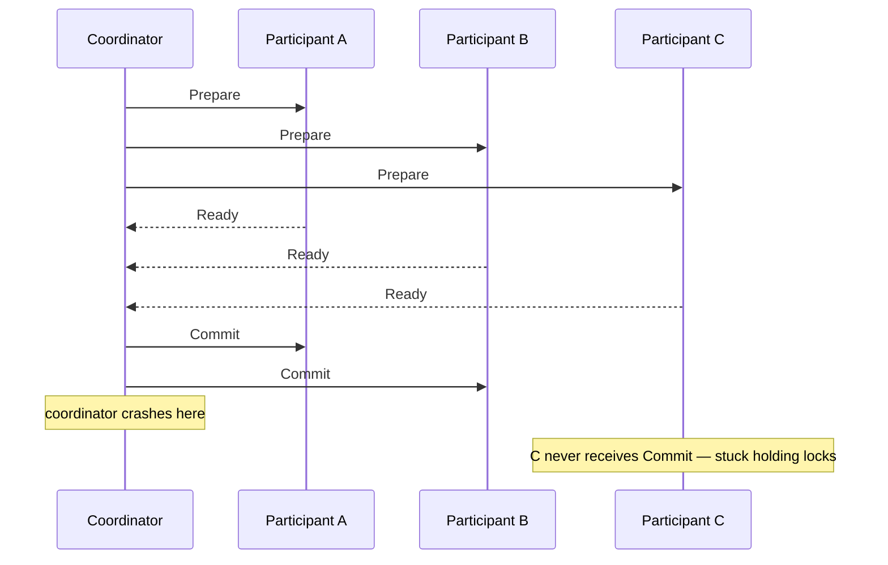
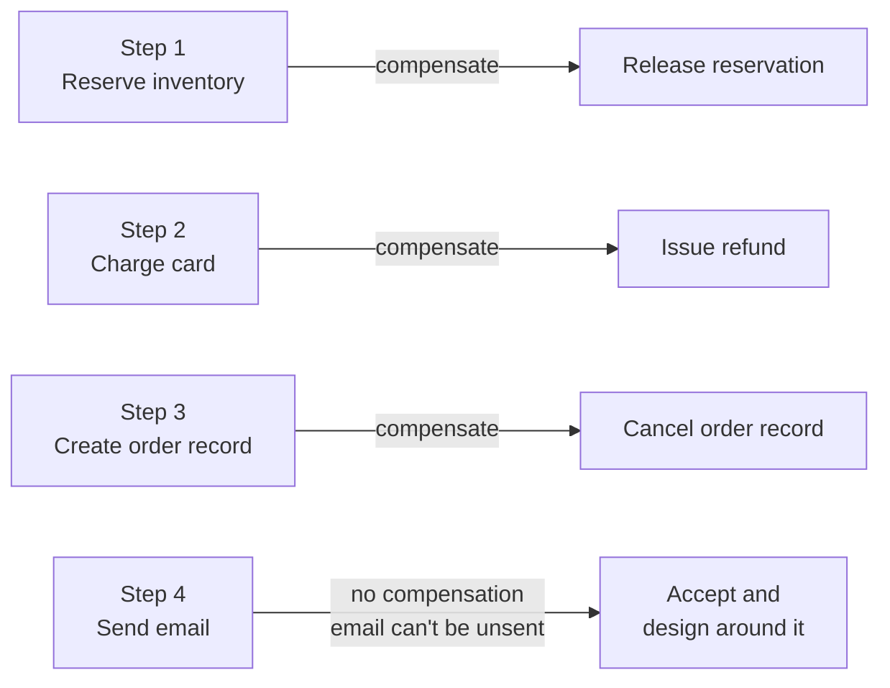
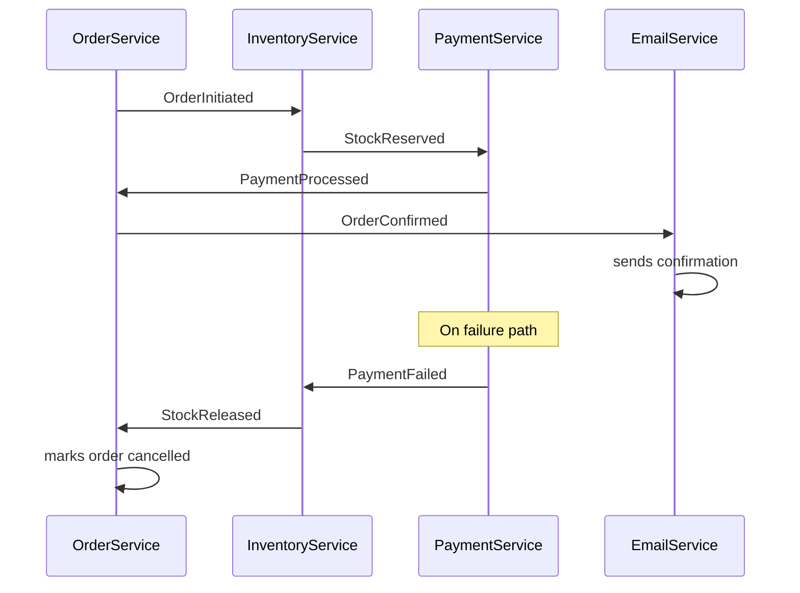
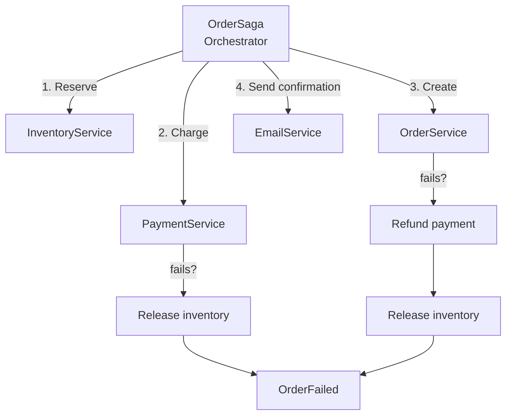

*[Grokking System Design](../../../README.md) · Module 4 — Distributed Systems Reality · Day 14*

# Day 14 — Distributed Transactions

> **Today's one idea:** You cannot have an atomic commit across two independently-failing machines — the Saga pattern accepts this impossibility and replaces the atomic transaction with a sequence of local transactions and explicit compensating actions that undo work when a step fails.
> **Reading time:** ~42 min · **Prereqs:** Day 2 (trade-off framework), Day 10 (async messaging — at-least-once delivery, Outbox Pattern), Day 13 (CAP theorem — consistency trade-offs)
> **Primary source for today:** Kleppmann, *Designing Data-Intensive Applications* (O'Reilly, 2017) — Chapter 9, "Consistency and Consensus," sections "Distributed Transactions and Consensus" (pp. 352–372)

---

## The Hook (3 min)

A customer places an order. Your system must:

1. **Deduct** inventory: `UPDATE inventory SET count = count - 1 WHERE product_id = 42`
2. **Charge** the customer: call Stripe's `/charges` API
3. **Create** the order record: `INSERT INTO orders (...) VALUES (...)`
4. **Send** a confirmation email: call SendGrid's API

In a monolith with a single database, steps 1 and 3 live in one SQL transaction. If step 2 fails (card declined), you roll back steps 1 and 3. Atomic. Clean. Familiar.

But your architecture has grown:
- Inventory lives in a separate **Inventory Service** with its own Cosmos DB.
- Orders live in an **Order Service** with its own Azure SQL.
- Payment is external (Stripe).
- Email is external (SendGrid).

Now ask: if Stripe's charge succeeds but the `INSERT INTO orders` fails — what do you do? The money left the customer's account. The order doesn't exist in your system. You have charged someone for nothing.

You cannot simply wrap everything in `BEGIN TRANSACTION ... COMMIT`. There is no single transaction coordinator that can atomically commit or roll back work across Cosmos DB, Azure SQL, Stripe's API, and SendGrid. They are four independently-failing machines. This is the distributed transaction problem.

---

## Building the Intuition

### Why two-phase commit (2PC) fails at scale

Two-Phase Commit is the classical solution — the transaction coordinator sends a "prepare" message to all participants, waits for all to confirm they're ready, then sends a "commit" (or "abort" if any refused).



The coordinator is a single point of failure. If it crashes between "prepare" and "commit," every participant is stuck holding locks indefinitely, waiting for a message that may never come. This is called an **in-doubt transaction** — and it can block for hours until the coordinator recovers.

Azure services don't support 2PC across service boundaries. Stripe doesn't expose a "prepare charge" endpoint. Cosmos DB and Azure SQL don't share a transaction coordinator. 2PC is not available to you for this architecture — and even if it were, its lock-holding behaviour makes it dangerous under load.

### The Saga pattern — accept failure, design for compensation

A Saga is a sequence of **local transactions**, each in its own service, where every step that can succeed has a corresponding **compensating transaction** that undoes its effect if a later step fails.



If step 3 fails after step 2 succeeds, the Saga triggers compensating transactions backward: cancel the order record (step 3 rolled back locally), issue a refund (step 2's compensation). The customer gets their money back; the inventory reservation is released.

The key insight: **compensating transactions are not rollbacks.** A database rollback undoes work atomically, as if it never happened. A compensating transaction is a new forward transaction that *counteracts* the effect of a previous one. The charge happened. The refund happens. Both are real events in the audit log.

### Choreography vs Orchestration

There are two ways to coordinate a Saga:

**Choreography:** each service reacts to domain events published by the previous step. No central coordinator. Services are loosely coupled — they know about events, not about each other.



**Orchestration:** a central **Saga Orchestrator** calls each service and manages the compensating logic. Services are dumb step-executors; the orchestrator holds all the business logic.



**Comparison:**

| | Choreography | Orchestration |
|--|-------------|---------------|
| Coupling | Low — services know events, not each other | Medium — services coupled to orchestrator's contract |
| Visibility | Hard — the Saga's state is spread across event logs | Easy — orchestrator holds the full state |
| Debugging | Hard — must correlate events across services | Easy — one place to inspect current step |
| Where logic lives | Distributed across services | Central in orchestrator |
| Azure implementation | Service Bus / Event Grid + each service reacting | Azure Durable Functions (orchestrator pattern) |

**The 90% case for .NET on Azure:** orchestration with **Azure Durable Functions** — the orchestrator is a stateful Durable Function, each step is an Activity Function, and the Durable Functions runtime handles persistence, retries, and compensation.

---

### Azure Durable Functions — orchestration in .NET

Durable Functions makes the orchestrator pattern nearly mechanical to implement:

```csharp
// The Saga Orchestrator — a Durable Orchestrator Function
[FunctionName("OrderSaga")]
public static async Task RunOrchestrator(
    [OrchestrationTrigger] IDurableOrchestrationContext context,
    ILogger log)
{
    var order = context.GetInput<OrderRequest>();

    bool stockReserved = false;
    bool paymentCharged = false;

    try
    {
        // Step 1 — Reserve stock
        await context.CallActivityAsync("ReserveStock",
            new ReserveStockInput(order.ProductId, order.Quantity));
        stockReserved = true;

        // Step 2 — Charge payment
        await context.CallActivityAsync("ChargePayment",
            new ChargeInput(order.CustomerId, order.Total, order.OrderId));
        paymentCharged = true;

        // Step 3 — Create order record
        await context.CallActivityAsync("CreateOrder", order);

        // Step 4 — Send confirmation (best-effort, no compensation)
        await context.CallActivityAsync("SendConfirmationEmail", order);
    }
    catch (Exception ex)
    {
        log.LogError(ex, "Order saga failed at step — compensating");

        // Compensate in reverse order
        if (paymentCharged)
            await context.CallActivityAsync("RefundPayment",
                new RefundInput(order.OrderId, order.Total));

        if (stockReserved)
            await context.CallActivityAsync("ReleaseStock",
                new ReleaseStockInput(order.ProductId, order.Quantity));

        // Mark order as failed
        await context.CallActivityAsync("MarkOrderFailed",
            new FailureInput(order.OrderId, ex.Message));
    }
}
```

The Durable Functions runtime automatically persists the orchestrator's state to Azure Storage after each step. If the function host crashes mid-saga, the runtime replays the function from the last saved checkpoint — idempotently — when it restarts. You never lose saga state.

### Idempotency is non-negotiable in Sagas

Because each Activity Function can be retried (by the runtime, on transient failures), every step must be idempotent. Use the order ID or a deterministic step ID as an idempotency key:

```csharp
[FunctionName("ChargePayment")]
public static async Task ChargePayment(
    [ActivityTrigger] ChargeInput input,
    ILogger log)
{
    // idempotencyKey = deterministic per order
    // Stripe will return the existing charge if this key was already used
    await _stripeClient.Charges.CreateAsync(new ChargeCreateOptions
    {
        Amount      = (long)(input.Total * 100),
        Currency    = "usd",
        CustomerId  = input.CustomerId,
        IdempotencyKey = $"order-{input.OrderId}-charge"   // ← critical
    });
}
```

---

## The Formal Picture

### Eventual consistency in Sagas

A Saga provides **ACD** (Atomicity via compensation, Consistency-eventual, Durability) but not **Isolation**. During a running Saga, other transactions can see intermediate state — the inventory was reserved but the order is not yet created. This is called an **anomaly**.

Three types of Saga anomaly:
- **Dirty reads:** another transaction reads state modified by an in-progress Saga that later compensates. Fix: design state machines so in-progress state is visible but labelled (e.g., `status: "pending"` vs `status: "confirmed"`).
- **Lost updates:** two Sagas modify the same resource concurrently. Fix: optimistic concurrency (ETag, row version) on shared resources.
- **Phantom reads:** a Saga query returns different results at different steps because another Saga inserted data in between. Fix: re-query at the point of use, don't cache query results across steps.

### The BASE model

Traditional ACID transactions are **Atomicity, Consistency, Isolation, Durability**. Distributed systems using Sagas are described as **BASE**:

- **B**asically **A**vailable: the system is always available (AP in CAP terms).
- **S**oft state: the state may be temporarily inconsistent during Saga execution.
- **E**ventually consistent: after all compensations complete (or all steps succeed), the system converges to a consistent state.

BASE is not a downgrade from ACID — it is a deliberate trade-off. You give up isolation and immediate consistency; you gain availability, horizontal scalability, and fault tolerance.

---

## Where It Breaks / What It Is Not

**Compensating transactions can fail too.** If your refund API (Stripe) is down when you're trying to compensate a failed order, your compensation saga fails. You now have a charged customer with no order and a failed refund. This is the **stuck Saga** problem. Fix: Durable Functions retries the compensation indefinitely. Design your compensations to be idempotent and eventually-succeeding (don't compensate with a call that can permanently fail — use a queue and retry).

**Email is un-compensatable.** Once the confirmation email is sent, you can't un-send it. Design your Saga so email is the last step (after all compensatable steps succeed). If you must send email earlier, accept that the customer may receive a confirmation email for an order that later fails — and design a follow-up "sorry, your order was cancelled" email as the compensation.

**Sagas are not free.** Choreography is hard to reason about — adding a new step requires modifying multiple services. Orchestration adds a deployment dependency on the orchestrator. Durable Functions adds cost (Azure Storage calls on every step). Evaluate whether the Saga's complexity is worth it vs. a simpler design: for example, a single-service background job with a dead-letter queue is often simpler than a multi-service Saga.

**The Saga pattern is not for all distributed workflows.** Short workflows with 2–3 steps where all services are controlled by your team may not need a full Saga. Use Saga when: the workflow spans multiple autonomous services, steps can fail independently, and the business cost of an inconsistent state is higher than the cost of implementing compensation.

---

## Try It Yourself

**Exercise 1 — Design a Saga**

A hotel booking platform must: (1) check room availability, (2) reserve the room, (3) charge the customer's card, (4) send a booking confirmation email. Design the Saga with compensating transactions for each step.

a) List the compensating transaction for each step.
b) In what order should steps execute to minimise the number of compensations needed on failure? (Hint: which steps are most likely to fail?)
c) Which step has no meaningful compensation, and how do you handle it?

<details>
<summary>Worked answer</summary>

**Saga steps and compensations:**

| Step | Forward | Compensation |
|------|---------|-------------|
| 1 | Check availability | None (read-only) |
| 2 | Reserve room | Release reservation |
| 3 | Charge card | Issue refund |
| 4 | Send confirmation email | Send "booking cancelled" email (best-effort) |

**Optimal order (minimise compensations):**

Run the most likely-to-fail step first:
- Step 3 (charge card) is the most likely to fail (card declined, Stripe outage). Run it first.
- Step 2 (room reservation) is next-most-likely (room just booked by another user).
- Step 1 (availability check) is a read — always run this first, as a guard.

Revised order: 1 (check) → 3 (charge) → 2 (reserve) → 4 (email).

If step 3 fails: no compensation needed (nothing was reserved or confirmed).
If step 2 fails after step 3: compensate step 3 (refund card).
If step 4 fails: no compensation for email itself — the booking is complete. Retry email delivery separately.

**Step 4 compensation:** Email is un-compensatable. Accept this. Ensure email is the last step. If email fails, the booking is still valid — put the email event on a retry queue rather than failing the whole Saga.

</details>

---

**Exercise 2 — Choreography vs Orchestration**

Your team is debating whether to use choreography or orchestration for the hotel booking Saga.

Argument for choreography: "It's more decoupled. Each service just reacts to events."
Argument for orchestration: "We need to know exactly where the Saga is at any point for customer support."

a) Which approach would you recommend for a customer-facing booking flow, and why?

b) What observability problem does choreography create, and how do you partially mitigate it?

<details>
<summary>Worked answer</summary>

a) **Orchestration.** Customer support will constantly ask: "Why is booking B-9842 stuck? What step failed? Was the card charged?" With choreography, answering this requires correlating events across Booking Service, Payment Service, and Room Service logs — time-consuming and error-prone. With orchestration (Durable Functions), you can inspect the orchestration instance state with one call:

```bash
# Azure CLI — check Durable Function instance state
az functionapp durable get-instances \
  --app MyBookingApp \
  --instance-id "booking-B9842"
```

This returns the current step, input, output, and any failure reason — in seconds.

b) **Choreography's observability problem:** the Saga's current state is implicit — spread across the event log of multiple services. A booking with 3 steps and 2 services means you must correlate 6 events across 2 different Service Bus topics, joined by a correlation ID.

**Partial mitigation:** 
1. Use a **correlation ID** (e.g., booking ID) as a message header in every event — enables log correlation.
2. Emit a **Saga state event** from a thin status service: when key milestones are reached, publish `BookingStatusChanged { bookingId, newStatus, timestamp }` to a central status topic. This gives you a queryable state log without full orchestration overhead.

</details>

---

**Exercise 3 — Spot the Saga bug**

Review this Saga implementation:

```
Step 1: Reserve room         → succeeds
Step 2: Send confirmation email → succeeds  
Step 3: Charge card          → fails (card declined)
Compensation: Release room reservation → succeeds

Result: Customer received a confirmation email for a booking that was cancelled.
```

a) What design rule was violated?
b) How do you fix the step ordering?
c) The customer calls support saying they have a confirmation email but the booking doesn't exist. What should your system do?

<details>
<summary>Worked answer</summary>

a) **The un-compensatable step (email) was run before the compensatable steps were complete.** The rule: email must be the last step, after all steps that can fail have succeeded.

b) **Correct order:**
1. Check availability (read — safe first)
2. Charge card (most failure-prone — fail early before any commitments)
3. Reserve room (now card is confirmed)
4. Send confirmation email (last — all reversible steps succeeded)

Now if step 2 (card) fails: no email sent, no reservation made — clean failure. If step 3 (reserve) fails after charge: refund card, no email sent.

c) **System-level fix:** Add a `BookingCancelled` email template. When compensation runs after an email was already sent, trigger a follow-up "We're sorry — your booking B-9842 was cancelled and your card has not been charged" email. This doesn't un-send the confirmation, but it resolves the customer's confusion.

Also: add a `status` field to the booking record. The booking is created with `status: "pending"` at step 1. It moves to `"confirmed"` only when all steps succeed. If the customer visits their booking page after receiving the email but before confirmation, they see "Payment pending" — not a confirmed booking. This makes intermediate state visible rather than hiding it.

</details>

---

## Connect It Back

Day 13 showed you *why* consistency is hard across distributed nodes. Day 14 showed you *what you do about it* for multi-step business processes. Together they explain why every large-scale architecture you'll read about — Amazon, Netflix, Uber — uses event-driven workflows and compensating transactions rather than distributed ACID transactions.

The Outbox Pattern from Day 10 is a micro-Saga: one local transaction (business data + outbox message), with the outbox reader as the compensating path when the publish fails. Sagas are the same pattern scaled to multi-step, multi-service workflows.

**Tomorrow** (Day 15) you move from *design* to *operation*: when a Saga gets stuck, when a circuit breaker trips, when latency spikes at 3 AM — how do you see it? Metrics, traces, and logs are your only eyes inside a distributed system.

**Question you should now be able to answer:** *Your senior engineer says: "We should just use 2PC across our microservices — it guarantees atomicity." Name two specific failure scenarios where 2PC creates a worse outcome than a well-designed Saga.*

---

## Suggested Readings for Today

**Required if you have 15 extra minutes:**
Kleppmann, *DDIA* — Chapter 9, "Consensus," section "Distributed Transactions in Practice" (pp. 360–364). Kleppmann dissects exactly why two-phase commit fails in practice and why XA transactions (the J2EE-era 2PC implementation) are considered a liability rather than an asset. Clear, honest, and directly applicable.

**If you want the deep version:**

1. Richardson, C., "Saga Pattern": [https://microservices.io/patterns/data/saga.html](https://microservices.io/patterns/data/saga.html). Chris Richardson's canonical reference on the Saga pattern — the source most architects cite. Covers both choreography and orchestration, with sequence diagrams and anti-patterns. 20 minutes.

2. Azure Durable Functions documentation — "Fan-out/fan-in, human interaction, and other patterns": [https://learn.microsoft.com/en-us/azure/azure-functions/durable/durable-functions-overview](https://learn.microsoft.com/en-us/azure/azure-functions/durable/durable-functions-overview). The orchestrator/activity function model in .NET. Read the "Orchestrator functions" and "Activity functions" sections for the Azure-specific implementation details behind today's code.

3. Ford et al., *Software Architecture: The Hard Parts* (O'Reilly, 2021) — Chapter 12, "Managing Distributed Transactions." Ford walks through choreography vs. orchestration trade-offs in depth, with decision matrices for when each applies. If you read one chapter of this book first, make it Chapter 12.

---

← [Day 13 — CAP Theorem](day-13-cap-theorem.md) &nbsp;|&nbsp; [Day 15 — Observability →](day-15-observability.md)
