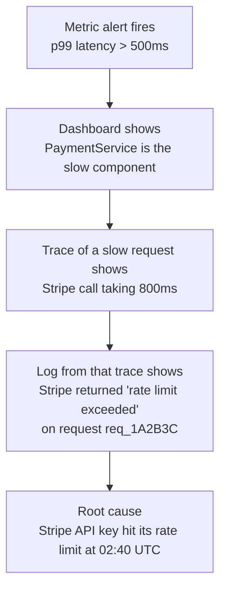
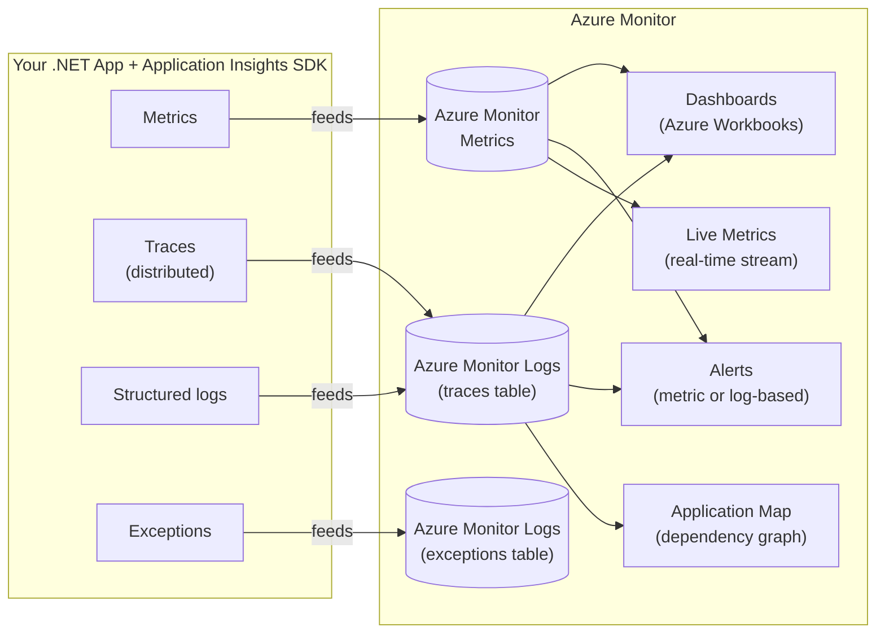

*[Grokking System Design](../../../README.md) · Module 4 — Distributed Systems Reality · Day 15*

# Day 15 — Observability

> **Today's one idea:** A distributed system fails in ways that no single log file can explain — observability is the practice of instrumenting your system so that you can ask any question about its internal state from the outside, using three complementary signals: metrics, distributed traces, and structured logs.
> **Reading time:** ~40 min · **Prereqs:** Day 1 (methodology — capacity estimation introduces QPS and latency), Day 8 (load balancing — health checks as the simplest observability), Day 11 (rate limiting and resilience — circuit breaker states are an observability concern)
> **Primary source for today:** Kleppmann, *Designing Data-Intensive Applications* (O'Reilly, 2017) — Chapter 1, "Reliable, Scalable, and Maintainable Applications," section "Maintainability" (pp. 18–23); plus the Azure Monitor documentation for Application Insights

---

## The Hook (3 min)

It is 2:47 AM. Your on-call alert fires: "p99 API latency > 2,000ms." Your Service Level Objective (SLO) is 500ms.

You SSH into a server. The app is running. You check the database — looks fine. You check Redis — fine. You restart the API pods. Latency stays high.

You stare at wall of unstructured log lines:

```
[INFO] 2026-05-13 02:41:03 Request received
[INFO] 2026-05-13 02:41:03 Calling downstream service
[INFO] 2026-05-13 02:41:05 Response returned
[INFO] 2026-05-13 02:41:05 Request completed
```

Every request looks the same. You cannot tell:
- Which downstream service was slow?
- Was it one endpoint or all endpoints?
- Was it one user or all users?
- Did it start gradually or spike suddenly?
- Which server instance is the culprit?

You spend 45 minutes debugging blind. You find it eventually: a single Cosmos DB partition is hot [(Day 4's hotspot problem)](../../02-storage-building-blocks/days/day-04-relational-databases.md) because a viral product is driving 10× its expected traffic.

With proper observability, you would have seen this in 90 seconds: a dashboard showing which partition key is receiving elevated RU/s, correlated with a distributed trace showing which API endpoint is calling that partition.

The difference between 90 seconds and 45 minutes is not intelligence — it's instrumentation.

---

## Building the Intuition

### The three pillars

**Metrics:** numerical measurements aggregated over time. *How much?* *How often?* *How fast?*

```
api_request_duration_p99 = 2,134ms
cosmos_ru_consumed_per_second{partition="product-7821"} = 4,800 RU/s
redis_cache_hit_ratio = 0.67
circuit_breaker_state{service="shipping"} = OPEN
```

Metrics are cheap to store (just numbers), cheap to query, and excellent for alerting and dashboards. They answer: "Is anything wrong right now?"

**Distributed traces:** a record of the causal chain of events for one request, across all services it touched.

```
Trace ID: 3fa9b1c2d4e5

  → API Gateway                     [0ms → 3ms]
    → OrderController.Create()       [3ms → 847ms]
      → InventoryService.Reserve()   [3ms → 12ms]    ✓
      → PaymentService.Charge()      [12ms → 820ms]  ← SLOW
        → Stripe API call            [15ms → 815ms]  ← ROOT CAUSE
      → OrderRepository.Save()       [820ms → 840ms] ✓
    → EmailService.Notify()          [840ms → 843ms]  ✓ (async)
```

A trace shows you exactly which service, which function, and which external call was slow — for one specific request. It answers: "Where did *this* request spend its time?"

**Structured logs:** machine-readable records of discrete events, enriched with context.

```json
{
  "timestamp": "2026-05-13T02:41:03.847Z",
  "level": "Warning",
  "message": "Payment service latency elevated",
  "traceId": "3fa9b1c2d4e5",
  "spanId": "b7c8d9e0",
  "orderId": "ord-99812",
  "customerId": "cust-44201",
  "duration_ms": 808,
  "stripe_request_id": "req_1A2B3C",
  "service": "PaymentService",
  "instance": "payment-pod-3"
}
```

Structured logs are queryable by any field. The trace ID links them to the distributed trace. They answer: "What happened, exactly, in context?"

The three pillars are complementary — not redundant:



---

### Azure Monitor and Application Insights

**Azure Monitor** is Azure's unified observability platform. **Application Insights** is the SDK-level component that instruments your .NET application and feeds into Azure Monitor.



**Setup in .NET 8 (one package, three lines):**

```csharp
// Program.cs
builder.Services.AddApplicationInsightsTelemetry(
    builder.Configuration["ApplicationInsights:ConnectionString"]);
// That's it. Request duration, dependencies, exceptions, traces — all auto-collected.
```

---

### Structured logging

The difference between a log you can query and a log you can only read:

```csharp
// ❌ Unstructured — string interpolation loses structure
_logger.LogWarning($"Payment failed for order {orderId}, amount {amount}");
// Stored as: "Payment failed for order ord-99812, amount 99.99"
// You can grep for it but can't query "all failures where amount > 50"

// ✓ Structured — message template preserves structure
_logger.LogWarning("Payment failed for order {OrderId}, amount {Amount}",
    orderId, amount);
// Stored as: { "OrderId": "ord-99812", "Amount": 99.99, "message": "Payment failed..." }
// Now you can query: where Amount > 50 | count
```

**Add correlation IDs to every log** — connect logs to the trace that produced them:

```csharp
// Middleware — enrich every log in this request with the trace ID
app.Use(async (context, next) =>
{
    using (_logger.BeginScope(new Dictionary<string, object>
    {
        ["TraceId"]  = Activity.Current?.TraceId.ToString() ?? "none",
        ["UserId"]   = context.User.FindFirst("sub")?.Value ?? "anonymous",
        ["RequestId"] = context.TraceIdentifier
    }))
    {
        await next();
    }
});
```

Every log within this request's scope will automatically include `TraceId`, `UserId`, and `RequestId` — even if the individual log statement doesn't mention them.

---

### Distributed tracing with Activity API

.NET's built-in `System.Diagnostics.Activity` API implements the W3C Trace Context standard. Application Insights propagates trace context automatically for HTTP calls and Service Bus messages. For custom spans:

```csharp
// Custom activity source — declare once, use across the service
private static readonly ActivitySource _source = new("OrderService");

public async Task<Order> CreateOrderAsync(OrderRequest request)
{
    // Start a custom span — shows up in the distributed trace
    using var activity = _source.StartActivity("CreateOrder");
    activity?.SetTag("order.productId", request.ProductId);
    activity?.SetTag("order.customerId", request.CustomerId);
    activity?.SetTag("order.amount",     request.Total);

    try
    {
        var order = await _repository.SaveAsync(request);
        activity?.SetTag("order.id", order.Id);
        activity?.SetStatus(ActivityStatusCode.Ok);
        return order;
    }
    catch (Exception ex)
    {
        activity?.SetStatus(ActivityStatusCode.Error, ex.Message);
        activity?.RecordException(ex);
        throw;
    }
}
```

This span appears in Application Insights as a named node in the distributed trace — with all the tags as searchable properties.

---

### Alerting — SLO-based, not symptom-based

**Symptom-based alerting** fires when a specific internal thing goes wrong: "CPU > 80%", "Redis connection pool exhausted." These fire for things that might not affect users, and stay silent for things that do.

**SLO-based (user-facing) alerting** fires when users are experiencing problems: "Error rate > 1% in 5-minute window" or "p99 latency > 500ms for 3 consecutive minutes."

| Approach | Example | Problem |
|----------|---------|---------|
| Symptom | "CPU > 80%" | CPU high but latency fine → false positive |
| Symptom | "Redis memory > 90%" | Redis OK but one endpoint is timing out → missed |
| SLO-based | "Error rate > 1%" | Catches any cause of errors → fewer alerts, more signal |
| SLO-based | "p99 latency > 500ms" | Catches slow Cosmos DB, slow Stripe, slow Redis equally |

**Four golden signals** (Google SRE) — the minimum alert set for any service:

| Signal | What to measure | Example alert |
|--------|----------------|---------------|
| **Latency** | Request duration (p50, p95, p99) | p99 > 500ms for 3 min |
| **Traffic** | Requests per second | QPS drops 50% vs baseline |
| **Errors** | HTTP 5xx rate, exception rate | Error rate > 1% for 2 min |
| **Saturation** | CPU, memory, connection pool, queue depth | Queue depth > 10,000 for 5 min |

**Kusto (KQL) query for a latency alert** in Azure Monitor:

```kusto
// Alert fires if p99 latency > 500ms in last 5 minutes
requests
| where timestamp > ago(5m)
| where success == true
| summarize p99 = percentile(duration, 99) by bin(timestamp, 1m)
| where p99 > 500
```

---

## The Formal Picture

### Cardinality — why metrics and logs are different

A metric's **cardinality** is the number of distinct label combinations. Low-cardinality metrics (one value per region, or per service) are cheap to store and fast to query. High-cardinality metrics (one value per user ID, or per order ID) explode the metric storage.

```
Low cardinality (good for metrics):
  http_request_duration{service="orders", endpoint="/create", status="200"} = 85ms

High cardinality (bad for metrics, good for logs/traces):
  http_request_duration{userId="cust-44201", orderId="ord-99812"} = 85ms
  ← 10M users × 100 orders each = 1 billion metric series
```

**Rule:** put low-cardinality dimensions in metric labels (service, endpoint, status code, region). Put high-cardinality dimensions (user IDs, order IDs, request IDs) in structured logs and trace tags. Application Insights handles this split automatically — metrics are aggregated, traces and logs are sampled.

### Sampling

At 1,000 requests/second, storing a full trace for every request would be prohibitively expensive. **Adaptive sampling** stores a representative fraction — Application Insights default is ~10 traces/second, plus 100% of error traces.

**Head sampling** decides at request entry whether to trace it. **Tail sampling** decides at request exit (after you know the outcome). Tail sampling is superior — you can ensure 100% of slow or failed requests are traced regardless of volume.

---

## Where It Breaks / What It Is Not

**Observability is not monitoring.** Monitoring tells you when something is broken (alert fires). Observability lets you understand *why* it's broken (trace + log). A system can be well-monitored but opaque. A system can be observable but have no alerts configured. You need both.

**Logging everything is not observability.** If every log line is `"Request received"` without context, you have data but no insight. Structured logs with correlation IDs and business context (order ID, customer ID, product ID) turn log data into answerable questions.

**Distributed tracing has overhead.** Each span adds microseconds of latency and bytes of data. Sampling reduces this, but 100% trace coverage for high-traffic systems is rarely practical. Configure adaptive sampling and ensure 100% coverage for errors and slow requests.

**Application Insights SDK sampling can hide errors.** If Application Insights samples out 90% of requests, and errors occur in 0.5% of those requests, you may miss errors in your Application Insights data. Configure `MinSamplingPercentage` and pin error events to never be sampled:

```csharp
builder.Services.Configure<TelemetryConfiguration>(config =>
{
    var sampler = new AdaptiveSamplingTelemetryProcessor(config.DefaultTelemetrySink.TelemetryProcessorChain)
    {
        MinSamplingPercentage = 5,   // never sample below 5%
        MaxSamplingPercentage = 100,
        ExcludedTypes = "Exception"  // never sample exceptions out
    };
});
```

---

## Try It Yourself

**Exercise 1 — Classify the signal**

For each scenario, identify whether you would use a metric, a distributed trace, or a structured log (or a combination) to investigate.

a) You want to alert on-call if error rate exceeds 1% over a 5-minute rolling window.
b) A customer service agent reports that customer "cust-44201" says their order "ord-99812" failed. You want to understand exactly what happened.
c) You want to understand whether your circuit breaker for the Shipping service is tripping frequently, and if so, at what times of day.

<details>
<summary>Worked answer</summary>

a) **Metric + alert.** Error rate is a low-cardinality, time-series aggregate — exactly what metrics are designed for. A KQL-based Azure Monitor alert queries the `requests` table for `success == false` rate.

b) **Distributed trace + structured log.** You know the order ID — use it to find the trace: `traces | where customDimensions["OrderId"] == "ord-99812"`. The trace shows every service the request touched and where it failed. The logs on that trace show the specific error message and exception detail.

c) **Metric.** Circuit breaker state is a time-series aggregate: `circuit_breaker_open{service="shipping"} = 1 or 0`. Plot it over 24 hours to see patterns. A simple metric time-series is far more useful than searching logs for "circuit breaker opened" events.

</details>

---

**Exercise 2 — Diagnose from telemetry**

You are shown the following Application Insights Application Map at 3 AM:

```
[API Gateway] → [OrderService]    avg: 45ms,  errors: 0%
             → [PaymentService]   avg: 840ms, errors: 2%   ← highlighted red
                → [Stripe API]    avg: 815ms, errors: 0%
             → [EmailService]     avg: 8ms,   errors: 0%
             → [InventoryService] avg: 12ms,  errors: 0%
```

a) Where is the latency coming from? Is it a bug in your code or an external issue?
b) Why is PaymentService showing 2% errors when Stripe shows 0% errors?
c) What would you check next?

<details>
<summary>Worked answer</summary>

a) **Stripe API.** The Stripe API call (815ms) accounts for almost all of PaymentService's latency (840ms). This is an **external dependency issue**, not a bug in your PaymentService code (which adds only 25ms of its own work on top of Stripe's response time). Check Stripe's status page (status.stripe.com) before investigating your own code.

b) **PaymentService is applying a timeout or circuit breaker.** Stripe returns 0% errors (from Stripe's perspective, all calls succeeded — just slowly). But PaymentService has a 3-second timeout [(Day 11)](../day-11-rate-limiting-resilience.md). Stripe at 815ms is within the timeout, but some calls may be hitting the 1,000ms cutoff. Alternatively, PaymentService is validating the Stripe response and rejecting some. Query the structured logs: `traces | where customDimensions["service"] == "PaymentService" | where severityLevel == 3` to see the error messages.

c) **Next steps:**
1. Check Stripe status page for ongoing incidents.
2. Query `dependencies | where target contains "stripe.com" | where success == false` in Application Insights to see what error Stripe returned on the 2% failures.
3. If the Stripe incident is ongoing, check whether the circuit breaker has tripped (`circuit_breaker_state{service="payment"}` metric) and whether the fallback is serving degraded responses.
4. Consider enabling async payment processing [(Day 10's queue approach)](../day-10-async-messaging.md) for the duration of the incident.

</details>

---

**Exercise 3 — Instrument a new service**

You are adding a `PricingService` to your .NET solution. It takes a product ID and quantity, queries Cosmos DB for price rules, applies promotions from Redis, and returns a final price. Write the minimal instrumentation:

a) What custom Activity span(s) would you add, and what tags?
b) What structured log statements at what log levels?
c) What custom metric would you emit?

<details>
<summary>Worked answer</summary>

```csharp
private static readonly ActivitySource _source = new("PricingService");
private static readonly Counter<int> _pricingRequests =
    Metrics.CreateCounter<int>("pricing_requests_total", "requests");
private static readonly Histogram<double> _pricingDuration =
    Metrics.CreateHistogram<double>("pricing_duration_ms", "ms");

public async Task<PriceResult> CalculatePriceAsync(string productId, int quantity)
{
    using var activity = _source.StartActivity("CalculatePrice");
    activity?.SetTag("product.id",    productId);
    activity?.SetTag("order.quantity", quantity);

    var sw = Stopwatch.StartNew();
    _pricingRequests.Add(1, new KeyValuePair<string, object?>("product", productId));

    try
    {
        // a) Cosmos DB span — auto-created by App Insights SDK for dependency calls
        var basePrice = await _cosmosClient.GetBasePriceAsync(productId);
        _logger.LogDebug("Base price fetched {ProductId} = {BasePrice}", productId, basePrice);

        // b) Redis span — also auto-created
        var promotion = await _redis.GetPromotionAsync(productId);
        if (promotion is not null)
            _logger.LogInformation("Promotion applied {ProductId} promo={PromoCode} discount={DiscountPct}",
                productId, promotion.Code, promotion.DiscountPercent);

        var finalPrice = ApplyPromotion(basePrice, quantity, promotion);
        activity?.SetTag("price.final", finalPrice);
        activity?.SetTag("price.hadPromotion", promotion is not null);
        activity?.SetStatus(ActivityStatusCode.Ok);

        // c) Custom metric — duration histogram
        _pricingDuration.Record(sw.Elapsed.TotalMilliseconds,
            new KeyValuePair<string, object?>("product", productId));

        return new PriceResult(finalPrice, promotion?.Code);
    }
    catch (Exception ex)
    {
        activity?.SetStatus(ActivityStatusCode.Error, ex.Message);
        activity?.RecordException(ex);
        _logger.LogError(ex, "Price calculation failed {ProductId}", productId);
        _pricingRequests.Add(1, new KeyValuePair<string, object?>("status", "error"));
        throw;
    }
}
```

**Tags rationale:** product ID on the span enables filtering slow pricing calls by product. `hadPromotion` lets you A/B compare latency for promo vs non-promo paths.

**Log levels:** `Debug` for routine data fetches (suppressed in production). `Information` for business-significant events (promotion applied). `Error` for failures.

**Custom metric:** `pricing_duration_ms` histogram enables p99 alerting per product — you'll see if a specific product's pricing is always slow (hints at a bad Cosmos DB partition key or missing Redis cache entry for that product).

</details>

---

## Connect It Back

You now have a complete picture of how a distributed system is operated. Module 2 built the storage. Module 3 built the communication. Module 4 has been confronting the realities: CAP (Day 13), distributed transactions (Day 14), and now observability — the feedback loop that tells you how all of it is actually behaving in production.

Without observability, every other building block is a guess. With it, every alert is a question with an answerable path from alert → dashboard → trace → log → root cause.

**Tomorrow** (Day 16) you close Module 4 with resilience at scale: how to *prove* your resilience patterns work (chaos engineering), how to design for graceful degradation at the system level, and the pre-production resilience checklist that governs any serious Azure service deployment.

**Question you should now be able to answer:** *Your team is debating whether to add structured logging or to add distributed tracing first. You have neither. What is your recommendation and why?*

---

## Suggested Readings for Today

**Required if you have 15 extra minutes:**
Azure Monitor documentation — "Application Insights for ASP.NET Core applications": [https://learn.microsoft.com/en-us/azure/azure-monitor/app/asp-net-core](https://learn.microsoft.com/en-us/azure/azure-monitor/app/asp-net-core). Read the "Getting started" and "Custom telemetry" sections. This is the most practical 15-minute read you can do after today's page — it shows exactly what Application Insights auto-collects and what you must instrument yourself.

**If you want the deep version:**

1. Kleppmann, *DDIA* — Chapter 1, "Maintainability," section "Operability" (pp. 19–23). Kleppmann frames observability as a property of the system's design, not just its tooling: a system is operable if it provides the information needed to understand its behaviour and make it behave as intended. The 4-page section is short and essential.

2. Google SRE Book — Chapter 6, "Monitoring Distributed Systems": [https://sre.google/sre-book/monitoring-distributed-systems/](https://sre.google/sre-book/monitoring-distributed-systems/). The source of the "four golden signals" framework. Read sections "The Four Golden Signals" and "Worrying About Your Tail." Free online.

3. OpenTelemetry .NET documentation — "Getting started": [https://opentelemetry.io/docs/languages/dotnet/getting-started/](https://opentelemetry.io/docs/languages/dotnet/getting-started/). OpenTelemetry is the vendor-neutral standard for distributed tracing and metrics. Application Insights is compatible with it. If your org runs multi-cloud or uses Grafana/Datadog alongside Azure Monitor, understanding OpenTelemetry is essential.

---

← [Day 14 — Distributed Transactions](day-14-distributed-transactions.md) &nbsp;|&nbsp; [Day 16 — Resilience at Scale →](day-16-resilience-at-scale.md)
