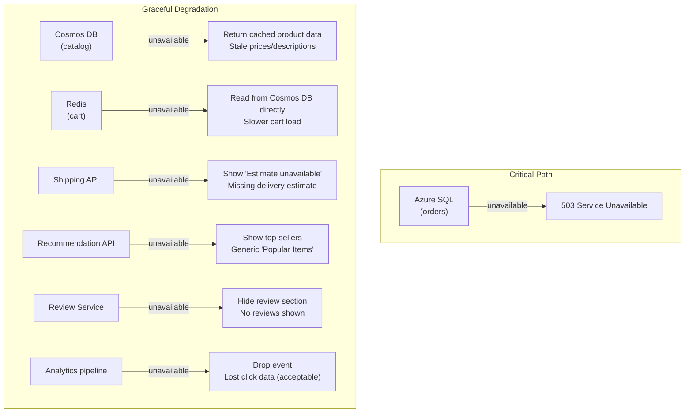
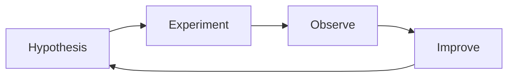
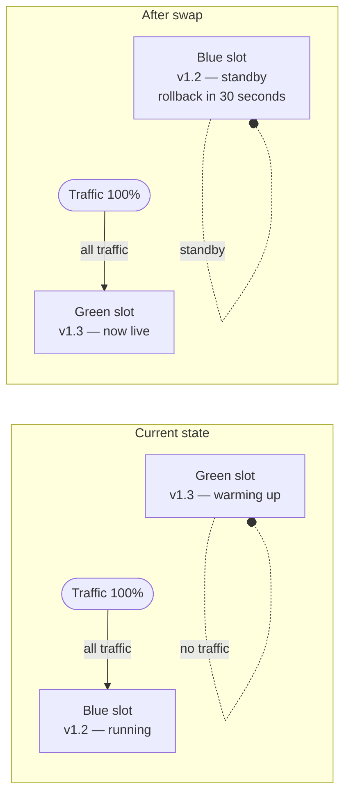
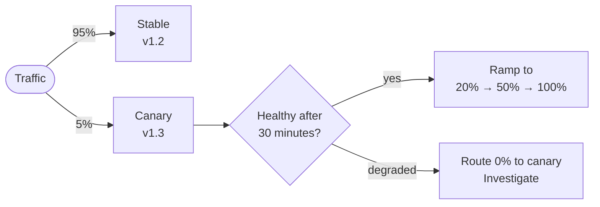
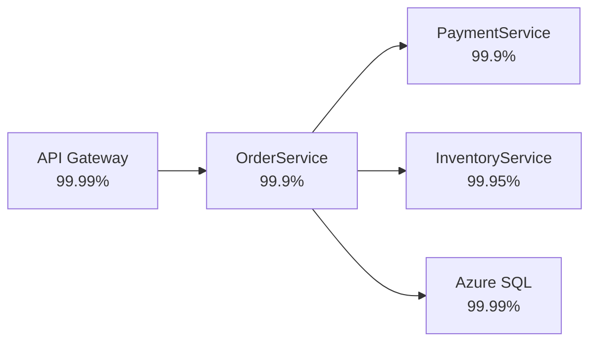

*[Grokking System Design](../../../README.md) · Module 4 — Distributed Systems Reality · Day 16*

# Day 16 — Resilience at Scale

> **Today's one idea:** Individual resilience patterns (retry, circuit breaker, rate limiter) protect a single service from a single failure mode — resilience at scale means designing the whole system so that a failure in any component degrades experience gracefully rather than propagating to a total outage.
> **Reading time:** ~38 min · **Prereqs:** Day 8 (load balancing — health checks, SPOFs), Day 11 (rate limiting, circuit breaker, bulkhead), Day 13 (CAP — partition tolerance), Day 15 (observability — SLOs and golden signals)
> **Primary source for today:** Nygard, *Release It!* 2nd ed. (Pragmatic Bookshelf, 2018) — Chapter 2, "Case Study: The Exception That Grounded an Airline," and Chapter 4, "Stability Patterns"

---

## The Hook (3 min)

2012. Amazon Prime Day precursor — a big sale event. Netflix goes dark for 8 hours. The root cause: an Elastic Load Balancer configuration issue triggered a cascade. Services that depended on other services all called their dependencies simultaneously when one node restarted. The dependency graph lit up like a circuit board and cascaded to a full outage.

Netflix's response: they built **Chaos Monkey** — a tool that randomly kills production instances during business hours. The philosophy: *if failures will happen in production anyway, you'd rather discover your resilience gaps during the day when your team is at work, not at 3 AM.*

Resilience at scale is not about eliminating failures. It is about:
1. **Containing** failures so they don't cascade.
2. **Degrading gracefully** so users see a degraded experience, not an error.
3. **Recovering automatically** — or knowing exactly how to recover manually.
4. **Proving** your resilience claims with chaos experiments before real incidents do.

---

## Building the Intuition

### The failure mode taxonomy

Before designing resilience, name the failures you're designing against. Every distributed system fails in predictable ways:

| Failure mode | Example | Resilience response |
|-------------|---------|---------------------|
| **Node crash** | App Service pod OOMKilled | Health check → LB removes node; auto-scale replaces it |
| **Slow dependency** | Stripe returns 800ms | Timeout + circuit breaker (Day 11) |
| **Network partition** | Datacenter loses inter-zone link | CAP choice: AP → serve stale data (Day 13) |
| **Overload** | 10× traffic spike | Rate limiting (Day 11) + queue buffering (Day 10) |
| **Cascading failure** | One slow service blocks all threads | Bulkhead + circuit breaker (Day 11) |
| **Data corruption** | Bad deploy writes invalid records | Soft deletes + audit logs + point-in-time restore |
| **Configuration error** | Wrong connection string in prod | Environment validation on startup; blue/green deploy |
| **Dependency version change** | Third-party API breaking change | Contract testing; tolerant reader pattern |

### Graceful degradation — serving a lesser truth

The most important resilience design decision is: **what does your system do when a non-critical component fails?**

The options are:
1. **Propagate the error:** user sees 500. Total failure of the feature.
2. **Return a fallback:** user sees stale data, a default, or a "feature unavailable" message. Partial degradation.
3. **Queue and retry:** operation is deferred, user is informed. Eventual success.

Map every external dependency to a degradation level:



This table is the **degradation contract** for your system. It forces explicit decisions: *"Is this dependency in the critical path or not? If it fails, what do we show?"*

Without this contract, every failure becomes a 500.

---

### Chaos engineering — proving resilience works

A circuit breaker you've never tested is a circuit breaker that may not work. **Chaos engineering** is the practice of deliberately injecting failures into your system to verify that your resilience mechanisms respond correctly.

The discipline was formalised by Netflix with **Chaos Monkey** (kills random VMs), later extended into **Chaos Kong** (kills entire AWS availability zones) and the **Simian Army**.

For Azure, **Azure Chaos Studio** is the managed service for running chaos experiments:

```
Experiment: "Kill one App Service instance during peak traffic"

1. Baseline: confirm normal operation
   - p99 latency: 85ms
   - Error rate: 0.02%

2. Inject failure: Azure Chaos Studio terminates instance "api-pod-3"

3. Observe:
   - Load balancer detects unhealthy node (10s health check interval)
   - Traffic redistributes to remaining instances
   - p99 latency: 92ms (acceptable — extra connections on remaining nodes)
   - Error rate: 0.04% (brief spike during redistribution)
   - Auto-scale triggers: new instance starts within 90 seconds

4. Steady state confirmed: system tolerated node failure gracefully ✓
```

**The chaos engineering loop:**



1. **Hypothesis:** "If instance 3 fails, the load balancer will reroute traffic within 30 seconds and p99 latency will stay under 200ms."
2. **Experiment:** kill instance 3.
3. **Observe:** what actually happened (metrics + trace + log — Day 15).
4. **Improve:** if the hypothesis was wrong, fix the gap. If right, move to the next experiment.

**Start small — the blast radius principle.** First experiment: kill one instance in dev. Then staging. Then production off-peak. Expand blast radius only when you've proven the smaller experiment works.

**Common Azure chaos experiments:**

| Experiment | Azure Chaos Studio fault | What it validates |
|------------|-------------------------|-------------------|
| Kill a VM/pod | VM shutdown fault | Auto-scaling + LB failover |
| Add 2s latency to Cosmos DB calls | Network latency fault | Circuit breaker timeout |
| Kill Redis | Process kill fault | Cache-aside fallback to DB |
| Fill disk | Disk pressure fault | Log rotation; disk alerts |
| Stop Service Bus namespace | Network disconnect fault | Outbox retry; DLQ monitoring |

---

### The pre-production resilience checklist

Before any service goes to production, walk through this checklist. Every "No" is a design gap.

**Single points of failure:**
- [ ] Every stateful component (SQL, Cosmos DB, Redis) has zone redundancy or replication enabled.
- [ ] No single VM/pod — minimum 2 instances, ideally across availability zones.
- [ ] Load balancer is Azure-managed (inherently HA) — not a self-managed Nginx VM.

**Failure isolation:**
- [ ] Every outbound HTTP call has a timeout configured.
- [ ] Every outbound HTTP call has a retry policy (with backoff + jitter).
- [ ] Every outbound HTTP call has a circuit breaker (Polly).
- [ ] Named HTTP clients are used (one connection pool per dependency = bulkhead).

**Graceful degradation:**
- [ ] Every external dependency has a documented fallback response.
- [ ] Non-critical features (recommendations, reviews) degrade independently of critical ones (cart, checkout).
- [ ] Circuit breaker fallbacks return meaningful degraded responses (not 500s).

**Observability:**
- [ ] Application Insights (or equivalent) is configured and receiving telemetry.
- [ ] All logs use structured logging with correlation IDs.
- [ ] Four golden signal alerts are configured (latency p99, error rate, traffic, saturation).
- [ ] Dead-letter queue depth is monitored with an alert.
- [ ] Circuit breaker state is a metric with an alert on "OPEN > 60 seconds."

**Data resilience:**
- [ ] Database backups are configured and tested (restore drill done).
- [ ] Cosmos DB has multi-region replication (or at least zone redundancy).
- [ ] Blob Storage uses ZRS or GRS.

**Deployment safety:**
- [ ] New versions are deployed via blue/green or canary — not big-bang replace.
- [ ] Rollback takes < 5 minutes (via slot swap for App Service, or Helm rollback for AKS).
- [ ] Feature flags gate new features so code can be deployed before features are enabled.

---

### Blue/green and canary deployments — resilience through deployment

The most common production outage cause is **a bad deploy** — not a hardware failure, not a spike in traffic, but code you just shipped. Deployment strategy is resilience strategy.

**Blue/green deployment:**



Azure App Service deployment slots give you this for free: deploy to the staging slot, run smoke tests, swap. If v1.3 breaks: swap back — 30 seconds.

**Canary deployment:**



Azure Front Door's weighted routing implements this natively. You don't need a service mesh.

---

## The Formal Picture

### Availability arithmetic — serial and parallel

**Two components in serial** (both must work):
```
Availability = A₁ × A₂
99.9% × 99.9% = 99.8%
```

**Two components in parallel** (only one must work):
```
Availability = 1 − (1 − A₁) × (1 − A₂)
1 − (0.001 × 0.001) = 99.9999%
```

This is the mathematical argument for redundancy. Adding a second instance changes a serial system (one instance dies → outage) into a parallel system (one instance dies → the other keeps serving). The availability improvement is orders of magnitude.

**System availability = product of all components in serial.**
A 5-service request chain, each at 99.9%:
```
0.999⁵ = 99.5% availability
 = ~43.8 hours of downtime per year
```

This is why minimising synchronous service-to-service calls matters — every hop in a synchronous chain multiplies downtime. Async messaging [(Day 10)](../day-10-async-messaging.md) breaks serial chains into parallel/decoupled flows.

### Error budgets and SLOs

An SLO (Service Level Objective) defines the target: "99.9% of requests return 2xx in < 500ms."

An **error budget** is the allowable failure: `1 - 0.999 = 0.1%` of requests can fail per month. That's about 43 minutes of full outage, or a longer period of partial degradation.

Error budgets enable a data-driven conversation between reliability and feature velocity: if the error budget is spent, slow down deployments and focus on reliability. If the budget is healthy, deploy faster.

---

## Where It Breaks / What It Is Not

**Chaos engineering is not random destruction.** Chaos Monkey's famous random VM kills are a starting point, not the entire practice. The discipline requires: a documented hypothesis, a defined steady state, a limited blast radius, and a team available to respond. Running chaos in production without these is just outage-generating, not resilience-testing.

**Graceful degradation requires product decisions.** You cannot degrade gracefully without knowing which features are critical and which are optional. "Show a spinner forever" is not graceful degradation — it is a worse experience than showing an error. Product, design, and engineering must align on the degradation contract before you can implement it.

**Deployment slot swaps are not zero-downtime for long-running connections.** WebSocket connections and SSE streams are dropped during a slot swap. Plan for client-side reconnect logic if your app uses persistent connections.

**High availability does not eliminate the need for backups.** Replication (always-on secondary) protects against *node failure*. It does not protect against *data corruption* (a bad deploy that deletes records replicates the deletion to all replicas within milliseconds). Point-in-time restore and geo-redundant backups are the only protection against logical corruption.

---

## Try It Yourself

**Exercise 1 — Availability calculation**

Your checkout flow has this dependency chain (all synchronous):



a) Calculate the end-to-end availability of the checkout flow.
b) Which component, if made async (decoupled from the critical path), would most improve availability?
c) After making InventoryService async, what is the new checkout availability?

<details>
<summary>Worked answer</summary>

a) **Serial chain:**
```
0.9999 × 0.999 × 0.999 × 0.9995 × 0.9999
= 0.9999 × 0.999 × 0.999 × 0.9995 × 0.9999
≈ 0.9973 = 99.73%
= ~23.6 hours downtime/year
```

b) **InventoryService (99.95%).** Removing any component from the serial chain improves availability. InventoryService at 99.95% is the weakest non-PaymentService link. But more importantly: inventory reservation does not require a synchronous response to the customer — you can reserve stock asynchronously and handle oversell with a compensating transaction. Making it async removes it from the checkout's critical path entirely.

c) **Without InventoryService in the serial chain:**
```
0.9999 × 0.999 × 0.999 × 0.9999
≈ 0.9978 = 99.78%
= ~19.3 hours downtime/year
```

A modest improvement in absolute terms. But the real benefit: InventoryService failures no longer cause checkout failures — they cause delayed inventory updates, which is far more acceptable.

</details>

---

**Exercise 2 — Design the degradation contract**

You are designing a streaming video platform. List your dependencies and define the degradation contract for each. State: (a) the fallback behaviour, (b) whether the user should see a UI indication, and (c) how long the fallback can be sustained before it becomes a product problem.

Dependencies: Video CDN, User Auth Service, Recommendation Engine, Comments Service, Analytics Pipeline.

<details>
<summary>Worked answer</summary>

| Dependency | Fallback | UI indication | Sustainable? |
|-----------|---------|--------------|-------------|
| **Video CDN** | Critical — no video without CDN. Failover to secondary CDN origin if configured. | "Video unavailable" error | Not sustainable — this is the core product |
| **User Auth** | Allow anonymous viewing of public content. Block premium content with "Please sign in" message. | "Sign in to continue" for premium | Sustainable for public content indefinitely; blocks paying users |
| **Recommendation Engine** | Show editorial top-10 list (pre-computed, cached in Redis) | No indication needed — user sees "Popular Videos" | Sustainable indefinitely (stale recs are fine) |
| **Comments Service** | Hide comments section. Show "Comments temporarily unavailable." | Visible message below video | Sustainable for hours; product issue if days |
| **Analytics Pipeline** | Drop events (fire-and-forget, don't block). | None | Sustainable indefinitely — lost analytics < broken user experience |

**Key principle:** Only Video CDN is in the critical path. All others degrade gracefully. This means the platform's availability SLO should be measured only against Video CDN + Auth (for premium content) + the streaming infrastructure — not against Recommendations or Comments.

</details>

---

**Exercise 3 — Design the chaos experiment**

Write a chaos experiment for the following hypothesis:

*"If the Redis cache for product data becomes unavailable, the product listing page will continue to serve requests by falling back to Cosmos DB, with p99 latency no higher than 300ms (vs 45ms normal) and error rate remaining below 0.1%."*

Define: the experiment steps, the metrics you'll observe, the success criteria, and the rollback plan.

<details>
<summary>Worked answer</summary>

**Experiment: Redis Unavailability for Product Listing**

**Scope:** Staging environment; off-peak window (10 AM Tuesday); 15-minute duration.

**Steps:**
1. **Baseline measurement (5 min):** Record product listing p99 latency, error rate, Redis hit rate, and Cosmos DB RU consumption. Target baseline: p99 ≈ 45ms, error rate < 0.1%, Redis hit rate ≈ 92%.
2. **Inject fault:** Use Azure Chaos Studio to disconnect the Redis instance from the App Service (network isolation fault). Verify via Application Insights that Redis calls are failing.
3. **Observe (10 min):**
   - Product listing p99 latency — is it staying below 300ms?
   - Error rate — is it staying below 0.1%?
   - Cosmos DB RU/s — does it spike as expected (cache misses go to DB)?
   - Application Map — does it show Redis as unhealthy but the app still responding?
4. **Remove fault:** restore Redis connectivity. Observe that latency returns to baseline within 60 seconds (cache warms up again).

**Success criteria (hypothesis confirmed if ALL are true):**
- p99 latency ≤ 300ms throughout the fault window.
- Error rate < 0.1% throughout.
- No circuit breaker trips on the product listing endpoint.
- Cosmos DB RU consumption spikes but stays within provisioned limits.

**Failure criteria (abort experiment if ANY are true):**
- Error rate > 1%.
- p99 latency > 1,000ms.
- Application Insights shows exceptions in the product listing controller.

**Rollback plan:** Azure Chaos Studio provides a "stop experiment" button — removes the network fault immediately. If rollback doesn't restore Redis within 2 minutes, restart the Redis instance.

**If hypothesis fails:** Investigate whether the Cache-Aside fallback is correctly implemented. Common bugs: exception thrown instead of DB fallback on Redis timeout; Cosmos DB connection pool too small to absorb the full load without Redis.

</details>

---

## Connect It Back

Module 4 is complete. You have covered:

- **Day 13 (CAP):** The fundamental trade-off of distributed consistency — and how every Azure service you use has already made a choice.
- **Day 14 (Distributed Transactions):** Why atomic commits across services are impossible and how Sagas replace them.
- **Day 15 (Observability):** How to see inside a distributed system using metrics, traces, and logs.
- **Day 16 (Resilience at Scale):** How to prove your resilience claims before incidents prove the opposite.

These four days underpin everything in Module 5. When you design a social media feed or a notification system, you won't just choose components — you'll choose their CAP profile, design their Saga compensations, instrument them for observability, and specify their degradation contract.

**Tomorrow** (Day 17) you enter Module 5: designing real systems. The URL shortener was a warm-up. Day 17 designs a notification system — one of the most architecturally rich problems in system design, touching async messaging, fan-out at scale, multi-channel delivery, and rate limiting all at once.

**Question you should now be able to answer:** *A system has five services in a synchronous call chain, each at 99.9% availability. The team wants to achieve 99.95% end-to-end availability. What are two structural changes they could make — without improving any individual service's availability — to reach that target?*

---

## Suggested Readings for Today

**Required if you have 15 extra minutes:**
Nygard, *Release It!* — Chapter 2, "Case Study: The Exception That Grounded an Airline" (pp. 17–36). This is the most important case study in the book — a real production outage traced step-by-step through the code that caused it. It reads like a thriller and teaches more about stability patterns than any diagram can.

**If you want the deep version:**

1. Nygard, *Release It!* — Chapter 8, "Processes on Machines," sections "Transparency" and "Designing for Production" (pp. 207–228). Nygard's production-readiness checklist predates "chaos engineering" as a term but covers the same ground. His "transparency" concept — the system must be able to tell you what it is doing and why — maps directly to Day 15's observability pillars.

2. Principles of Chaos Engineering (the original manifesto): [https://principlesofchaos.org/](https://principlesofchaos.org/). Five pages. Written by Netflix engineers. Defines steady state, hypothesis-first experimentation, minimising blast radius, and running in production. Read it once and it reframes every resilience conversation you'll ever have.

3. Azure Chaos Studio documentation — "Quickstart: Run a chaos experiment": [https://learn.microsoft.com/en-us/azure/chaos-studio/chaos-studio-quickstart-azure-portal](https://learn.microsoft.com/en-us/azure/chaos-studio/chaos-studio-quickstart-azure-portal). 15-minute tutorial. Run your first real chaos experiment in Azure. The most valuable 15 minutes you can spend after today's page.

---

← [Day 15 — Observability](day-15-observability.md) &nbsp;|&nbsp; [Day 17 — Notification System →](../../05-designing-real-systems/days/day-17-notification-system.md)
